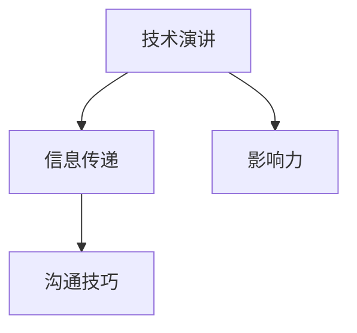
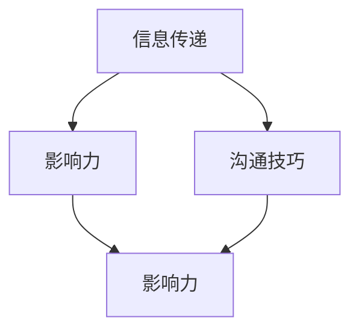
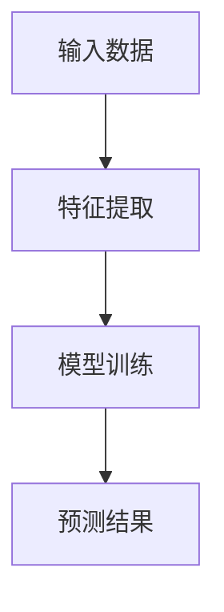

                 

### 第1章：技术演讲的定义与重要性

在信息时代，技术演讲成为一种不可或缺的沟通手段。它不仅能够帮助技术人员有效地传递信息，还能在团队中产生深远的影响。理解技术演讲的定义、重要性及其核心原则，是提升演讲效果的第一步。

#### 核心概念与联系

首先，我们需要明确技术演讲的核心概念及其相互联系。技术演讲涉及三个主要方面：信息传递、影响力和沟通技巧。Mermaid流程图可以帮助我们直观地展示这些概念之间的联系：



- **信息传递**：技术演讲的首要目标是清晰、准确地传递技术信息。这包括概念解释、技术原理、应用实例等。
- **影响力**：技术演讲不仅仅是信息的传递，更是一种影响力的展示。演讲者通过专业知识和演讲技巧，影响听众的观点和行为。
- **沟通技巧**：有效的沟通技巧是技术演讲成功的关键。这包括语言表达、肢体语言、声音调控等。

#### 技术演讲的核心原则

为了确保技术演讲的有效性，我们需要遵循一些核心原则。以下是一个使用伪代码阐述的技术演讲原则：

```python
def technical Presentation(principal):
  if understandably:
    explain Clearly(principal)
  else:
    Simplify(principal)
```

- **清晰表达**：演讲者应该确保信息的传递是清晰易懂的。如果听众难以理解，演讲者需要简化信息或使用更简单的语言进行解释。
- **简化信息**：当信息过于复杂时，演讲者可以通过图表、示例等方式简化信息，使其更加易于理解。

#### 理解听众

了解听众是技术演讲的重要一环。不同的听众群体对信息的接受程度和理解能力各不相同。以下是关于如何了解听众的详细说明：

- **高级开发者**：他们通常对技术细节有较高的了解，因此在演讲时可以深入技术原理，展示复杂的算法和架构。
  - **核心算法原理讲解**：使用伪代码详细阐述算法原理，确保听众理解。
  - **数学模型和公式**：使用LaTeX格式嵌入数学公式，详细讲解模型原理。
    $$\text{时间复杂度} = O(n \log n)$$

- **初级开发者**：他们可能对某些技术概念不太熟悉，因此演讲需要更加简洁明了。
  - **项目实战**：通过实际案例展示技术应用，帮助听众理解。
  - **代码解读**：提供详细代码实现和解读，帮助听众掌握技术要点。
    ```python
    def sort(arr):
        # Bubble Sort Algorithm
        n = len(arr)
        for i in range(n):
            for j in range(0, n-i-1):
                if arr[j] > arr[j+1]:
                    arr[j], arr[j+1] = arr[j+1], arr[j]
        return arr
    ```

- **非开发者**：他们可能对技术细节不感兴趣，但关心技术的应用和影响。演讲时应侧重于技术对社会的影响和未来的趋势。

#### 小结

技术演讲不仅仅是信息的传递，更是一种影响力展示。通过清晰表达、简化信息和了解听众，演讲者可以提升演讲效果，影响听众的观点和行为。理解技术演讲的核心概念和原则，是成功进行技术演讲的基础。

在下一章中，我们将深入探讨技术演讲的目标与听众分析，帮助演讲者更好地定位演讲内容，提升演讲影响力。

### 核心概念与联系

在技术演讲中，信息传递、影响力和沟通技巧是三个核心概念，它们相互关联，共同决定了演讲的效果。通过Mermaid流程图，我们可以直观地展示这些概念之间的关系：



- **信息传递**：技术演讲的首要目标是传递技术信息。这包括解释技术概念、阐述技术原理、展示技术应用等。清晰、准确的信息传递是确保演讲成功的关键。
- **影响力**：技术演讲不仅在于传递信息，更在于影响听众。通过专业知识和演讲技巧，演讲者可以引导听众思考，改变他们的观点和行为。
- **沟通技巧**：沟通技巧是技术演讲的重要组成部分。包括语言表达、肢体语言、声音调控等。有效的沟通技巧可以增强演讲的吸引力和说服力。

### 核心算法原理讲解

为了更好地理解技术演讲的核心原则，我们可以通过伪代码来详细阐述演讲的几个关键步骤：

```python
def technical_presentation(principal, audience, context):
    # 步骤1：确定演讲目标
    target = determine_goals(audience, context)
    
    # 步骤2：准备演讲内容
    content = prepare_content(principal, target)
    
    # 步骤3：简化复杂信息
    if complexity_of_content(content) > acceptable_level:
        content = simplify_content(content)
    
    # 步骤4：设计演讲结构
    structure = design_structure(content)
    
    # 步骤5： rehearse and deliver the presentation
    presentation = rehearse_and_deliver(structure, content)
    
    # 步骤6：收集反馈
    feedback = collect_feedback(presentation)
    
    # 步骤7：持续改进
    improve_presentation_based_on_feedback(presentation, feedback)
```

- **步骤1：确定演讲目标**：根据听众和演讲环境，明确演讲的目标。这是确保演讲内容针对性的关键。
- **步骤2：准备演讲内容**：根据演讲目标，准备相关的内容。这包括技术概念、原理和应用案例等。
- **步骤3：简化复杂信息**：如果演讲内容过于复杂，需要简化信息，使其更易于听众理解。
- **步骤4：设计演讲结构**：设计合理的演讲结构，确保信息传递的连贯性和逻辑性。
- **步骤5： rehearse and deliver the presentation**：通过排练和实际演讲，确保演讲的流畅性和有效性。
- **步骤6：收集反馈**：演讲后，收集听众的反馈，以了解演讲的效果和改进空间。
- **步骤7：持续改进**：根据反馈，持续优化演讲内容和方法。

通过上述伪代码，我们可以清晰地看到技术演讲的各个关键步骤及其相互关系。这为演讲者提供了具体的操作指南，有助于提升演讲效果。

### 技术演讲的核心原则

在技术演讲中，遵循一些核心原则至关重要。这些原则不仅能够提升演讲的专业性，还能够增强演讲的说服力和影响力。以下是一些关键原则的详细解释：

#### 清晰表达

**原则**：清晰表达是技术演讲的基础。演讲者应该确保所传递的信息清晰易懂，避免使用过于专业或晦涩的语言。

**解释**：清晰表达意味着演讲者需要准确传达技术概念和原理。这可以通过使用简单的语言、举例说明以及视觉辅助手段来实现。例如，在解释一个复杂的算法时，可以使用图表或代码示例来帮助听众理解。

**示例**：在介绍一种新的编程语言时，演讲者可以首先展示语言的语法结构，然后通过一个简单的代码示例来说明其实际应用。

```python
def add(a, b):
    return a + b

# 示例
result = add(2, 3)
print(result)  # 输出：5
```

#### 简化信息

**原则**：当演讲内容过于复杂时，演讲者需要简化信息，使其更容易被听众理解。

**解释**：技术领域中的许多概念和算法都是复杂的。为了使听众能够跟上演讲的节奏，演讲者需要将其简化。这可以通过提供关键点、使用比喻以及分步骤解释来实现。

**示例**：在讲解一个复杂的机器学习算法时，演讲者可以将其分解为几个简单的步骤，并使用图表来展示每个步骤的具体操作。



#### 结构清晰

**原则**：演讲的结构应该清晰、逻辑性强，以便听众能够跟随演讲的思路。

**解释**：一个结构清晰的演讲可以帮助听众更好地理解内容。演讲者应该提前规划好演讲的各个部分，确保每个部分之间有合理的过渡和衔接。

**示例**：在一个技术演讲中，演讲者可以按照以下结构进行组织：

1. **引言**：介绍演讲主题和目的。
2. **背景介绍**：提供必要的背景信息。
3. **技术讲解**：详细解释技术概念和原理。
4. **应用实例**：展示技术的实际应用。
5. **总结**：回顾演讲要点，提出结论。

```markdown
# 技术演讲：提升个人和团队影响力的技巧

## 引言
- 介绍技术演讲的重要性和应用场景。

## 背景介绍
- 简要介绍技术演讲的基本概念和核心原则。

## 技术讲解
- 详细解释技术概念和原理。
- 使用图表和示例来说明。

## 应用实例
- 展示技术的实际应用。
- 分析技术在不同领域的应用案例。

## 总结
- 回顾演讲要点。
- 提出结论和未来展望。
```

通过遵循这些核心原则，演讲者可以提升技术演讲的质量和影响力，使演讲更加吸引人、有说服力。

#### 了解听众

了解听众是技术演讲成功的关键之一。不同听众对信息的需求和理解能力各不相同，因此演讲者需要根据听众的特点来调整演讲的内容和风格。以下是针对不同听众群体的一些具体策略：

- **高级开发者**：这类听众通常具有丰富的技术背景和专业知识，他们更关注技术细节和深度。因此，演讲者在设计内容时应深入探讨技术原理，展示复杂的算法和架构。以下是一些具体策略：

  - **深入技术细节**：在演讲中详细解释技术原理，使用伪代码和数学模型来展示。
    ```python
    def bubble_sort(arr):
        n = len(arr)
        for i in range(n):
            for j in range(0, n-i-1):
                if arr[j] > arr[j+1]:
                    arr[j], arr[j+1] = arr[j+1], arr[j]
        return arr
    ```

  - **案例分析**：通过具体的案例分析，展示技术在实际项目中的应用和效果。
    ```mermaid
    graph TD
      A[数据预处理]
      B[特征提取]
      C[模型训练]
      D[模型评估]
      A --> B
      B --> C
      C --> D
    ```

- **初级开发者**：这类听众可能对某些技术概念不太熟悉，他们需要简洁明了的介绍。演讲者应侧重于基础知识和关键概念的讲解，避免使用过于专业的术语。

  - **简洁明了**：使用简单的语言和直观的示例来说明技术原理。
    ```python
    def add(a, b):
        return a + b
    print(add(2, 3))  # 输出：5
    ```

  - **逐步引导**：将复杂的技术分解为简单的步骤，逐步引导听众理解。
    ```mermaid
    graph TD
      A[初始化变量]
      B[输入数据]
      C[计算结果]
      D[输出结果]
      A --> B
      B --> C
      C --> D
    ```

- **非开发者**：这类听众可能对技术细节不感兴趣，但他们关心技术对社会的影响和未来趋势。演讲者应侧重于技术的应用场景和潜在价值。

  - **应用场景**：展示技术在现实生活中的应用，如医疗、金融、教育等领域。
    ```mermaid
    graph TD
      A[在线教育平台]
      B[智能医疗系统]
      C[金融交易分析]
      D[智能家居]
      A --> B
      B --> C
      C --> D
    ```

- **跨领域听众**：这类听众来自不同的领域，他们可能对某些技术概念有所了解，但对其他领域的技术不太熟悉。演讲者需要在内容中平衡不同领域的知识，确保每个听众都能理解。

  - **跨领域融合**：通过举例说明技术在不同领域中的应用，展示其广泛的适用性。
    ```mermaid
    graph TD
      A[数据分析工具]
      B[机器学习框架]
      C[区块链技术]
      D[物联网应用]
      A --> B
      B --> C
      C --> D
    ```

通过了解不同听众的特点，演讲者可以设计出更加针对性的内容，提升演讲的效果和影响力。

### 演讲准备与内容组织

演讲准备是技术演讲成功的关键步骤之一。一个良好的准备工作不仅能确保演讲的内容充实、结构清晰，还能提升演讲的整体效果。以下是一个详细的演讲准备和内容组织流程：

#### 主题选择

选择一个有吸引力、有深度的演讲主题是演讲准备的第一步。一个好的主题应该能够激发听众的兴趣，同时与演讲者的专业领域相关。以下是一些选择主题的策略：

- **热点话题**：选择当前热门的技术话题，如人工智能、区块链、云计算等，能够吸引更多听众的关注。
- **实践案例**：分享演讲者自己的实践经验或成功案例，使演讲更具说服力和可信度。
- **受众需求**：了解听众的需求和兴趣点，选择与之相关的主题，确保演讲内容对听众有实际价值。

#### 资料收集

在确定了演讲主题后，接下来是收集相关的资料。以下是一些收集资料的策略：

- **文献调研**：通过查阅学术论文、技术博客、专业书籍等，获取权威的技术资料和理论支持。
- **案例分析**：分析同领域内其他演讲者的演讲内容，了解他们的成功经验和不足之处。
- **数据调研**：如果演讲涉及具体的数据或实验结果，可以通过调研、实验等方式收集相关数据。

#### 内容结构设计

设计一个清晰、逻辑严密的内容结构是确保演讲顺利进行的关键。以下是一个常见的内容结构：

- **引言**：引入演讲主题，激发听众的兴趣。可以通过一个引人入胜的故事、一个有趣的事实或一个引人深思的问题来开头。
- **背景介绍**：简要介绍演讲主题的背景知识，使听众对演讲内容有基本的了解。
- **技术讲解**：详细讲解技术概念、原理和应用，使用图表、示例和代码来辅助说明。
- **应用实例**：通过实际案例展示技术在实际中的应用，使听众更好地理解技术的价值和意义。
- **总结**：回顾演讲要点，强调关键信息，提出结论和展望。

#### 演示设计

演示设计是技术演讲的重要组成部分。一个良好的演示设计可以增强演讲的直观性和吸引力。以下是一些设计演示的策略：

- **可视化**：使用图表、图像、动画等视觉元素，帮助听众更直观地理解技术概念。
- **互动性**：设计一些互动环节，如问答、投票等，增强听众的参与感和兴趣。
- **简洁性**：避免过多的文字和复杂的设计，保持演示的简洁性和清晰性。
- **一致性**：确保演示的视觉风格与演讲主题和内容保持一致，增强整体效果。

#### 小结

演讲准备和内容组织是一个系统性的过程，需要演讲者在多个方面进行细致的规划和设计。通过合理的主题选择、充分的资料收集、清晰的内容结构和精心的演示设计，演讲者可以提升演讲的质量和影响力。

### 演讲技巧与表现力提升

在技术演讲中，演讲技巧和表现力是决定演讲成败的关键因素之一。有效的演讲技巧和表现力不仅能够吸引听众的注意力，还能增强演讲的说服力和影响力。以下是一些关键的演讲技巧和表现力提升方法：

#### 非语言沟通

非语言沟通在技术演讲中起着至关重要的作用。通过肢体语言、面部表情和声音调控，演讲者可以增强信息的传递效果。以下是一些具体的非语言沟通技巧：

- **肢体语言**：使用自信的肢体语言，如坚定的眼神接触、适度的手势和开放的身体姿态，可以传递出演讲者的信心和专业性。例如，在讲解一个复杂的算法时，可以通过手势来示意算法的流程和关键步骤。

  ```mermaid
  graph TD
    A[初始化变量]
    B[输入数据]
    C[计算结果]
    D[输出结果]
    A --> B
    B --> C
    C --> D
  ```

- **面部表情**：保持真诚和热情的面部表情，如微笑和点头，可以拉近与听众的距离，增强演讲的亲和力。在面对复杂的主题时，适度的面部表情变化可以帮助听众更好地理解演讲内容。

- **声音调控**：通过音量、语速、语调和停顿的变化，演讲者可以调节听众的注意力和兴趣。例如，在讲解一个重要概念时，可以适当提高音量并放慢语速，以突出强调。

  ```python
  def emphasize_key_concept():
      increase_volume()
      slow_down_talk()
      pause_for_effects()
  ```

#### 语言表达

清晰、流畅的语言表达是技术演讲成功的关键。以下是一些提升语言表达的具体方法：

- **简洁明了**：避免使用过于复杂或专业的术语，尽量使用简单、易懂的语言进行表达。例如，在介绍一个技术概念时，可以使用一个简单的例子来说明。

  ```python
  def explain_concept():
      use_simple_language()
      provide_an_example()
  ```

- **逻辑性强**：确保演讲内容的逻辑性和连贯性。在演讲中，使用过渡词和句子来连接不同的部分，使演讲内容更加流畅。例如，在从背景介绍过渡到技术讲解时，可以使用“接下来，我们将深入探讨这个技术的具体应用。”

- **语音语调**：通过变化语音语调，如强调关键点、提高音量或使用抑扬顿挫的语调，可以使演讲更加生动和有吸引力。例如，在介绍一个重要的技术成果时，可以使用高昂的语调和饱满的声音来强调。

  ```python
  def emphasize_key_points():
      use_high_pitch()
      increase_volume()
      pause_for_effects()
  ```

#### 互动与应对策略

在技术演讲中，与听众的互动和应对策略也是提升演讲效果的重要方面。以下是一些具体的互动和应对策略：

- **提问与回答**：鼓励听众提问，并认真回答他们的疑问。这不仅可以增强听众的参与感，还能帮助演讲者更好地了解听众的需求和理解程度。在回答问题时，尽量简明扼要，直接回答问题的核心。

- **观点交流**：在演讲中，可以邀请听众分享他们的观点和经验。这不仅可以增加演讲的互动性，还能使演讲内容更加丰富和多元化。

- **互动环节设计**：设计一些互动环节，如小组讨论、投票等，可以激发听众的思考和参与。例如，在讲解一个技术概念时，可以让听众分成小组，讨论该技术的应用场景，并分享各自的见解。

- **应对策略**：在演讲过程中，可能会遇到听众不理解、提问刁钻等问题。此时，演讲者需要保持冷静，灵活应对。例如，当听众提出一个难以回答的问题时，可以请其他听众帮忙回答，或者暂时跳过这个问题，稍后再进行解释。

  ```python
  def handle_difficult_questions():
      remain_calm()
      encourage_help_from_audience()
      provide_an_answer_later()
  ```

#### 小结

通过提升非语言沟通技巧、优化语言表达和有效互动与应对策略，演讲者可以显著提升技术演讲的效果和影响力。这些技巧不仅能够吸引听众的注意力，还能增强演讲的说服力和互动性，使演讲更加生动和有意义。

### 演讲中的互动与应对策略

在技术演讲中，互动与应对策略是提升演讲效果的关键因素之一。有效的互动和灵活的应对能够激发听众的兴趣，增强演讲的吸引力和参与感。以下是一些具体的互动和应对策略：

#### 提问与回答

提问与回答是技术演讲中最常见的互动方式。通过鼓励听众提问，演讲者可以了解听众的理解程度和关注点，同时增强听众的参与感。以下是一些具体的提问与回答策略：

- **开放性问题**：提出开放性问题，鼓励听众分享他们的观点和经验。这不仅可以丰富演讲内容，还能使听众更加投入。
  - **示例**：请问大家是否有在项目中使用过这种技术？分享一下你们的经验吧。

- **引导性问题**：通过引导性问题，引导听众思考和讨论特定主题。这有助于深化听众对演讲内容的理解。
  - **示例**：如果我们在这个算法中加入更多特征，你们认为会带来哪些变化？

- **鼓励发言**：鼓励听众积极参与，特别是那些平时不太发言的听众。可以通过点名或鼓励举手发言来激发他们的积极性。
  - **示例**：如果你有不同意见，请举手告诉我。

#### 观点交流

观点交流是技术演讲中另一种有效的互动方式。通过邀请听众分享他们的观点和经验，演讲者可以增加演讲的多样性和深度。以下是一些观点交流的策略：

- **小组讨论**：将听众分成小组，讨论特定的问题或主题。这种小组讨论可以激发听众的思考，同时提供多个视角。
  - **示例**：请你们小组讨论一下，这个技术如何在不同的行业应用？

- **实时投票**：使用在线投票工具，实时收集听众的观点和反馈。这不仅可以增加互动性，还能为演讲者提供即时的反馈。
  - **示例**：我们来看一下，有多少人认为这个技术在未来有广阔的应用前景？

#### 互动环节设计

精心设计的互动环节可以显著提升演讲的吸引力和参与度。以下是一些互动环节的设计策略：

- **问题征集**：在演讲开始前，通过邮件、社交媒体等方式征集听众的问题，并在演讲中回答。这可以提前了解听众的关注点，确保演讲内容更具针对性。
  - **示例**：在演讲开始前，请通过邮件发送您的问题，我会在演讲中尽量回答。

- **演示互动**：通过实时演示技术操作，与听众互动。这种互动方式不仅能够展示技术原理，还能让听众更直观地理解。
  - **示例**：我们现在一起演示一下这个算法的具体应用。

#### 应对策略

在演讲过程中，可能会遇到各种意想不到的问题。有效的应对策略可以帮助演讲者顺利应对这些挑战。以下是一些应对策略：

- **灵活调整**：当遇到突发问题时，演讲者需要保持冷静，灵活调整演讲内容和节奏。
  - **示例**：如果演示出现技术故障，可以临时调整演示内容，使用备用材料或案例。

- **延期回答**：对于听众提出的复杂问题，如果无法当场回答，可以延期回答，并在演讲结束后提供详细的答复。
  - **示例**：这个问题比较复杂，我会尽快整理答案，通过邮件发送给您。

- **邀请嘉宾**：在遇到专业性强的问题时，可以邀请嘉宾或听众中的专家进行现场解答。这不仅可以增强演讲的专业性，还能提高听众的满意度。
  - **示例**：我们有现场的专家，请问是否有人愿意来回答这个问题？

#### 小结

通过有效的提问与回答、观点交流和互动环节设计，演讲者可以显著提升技术演讲的效果和参与度。同时，灵活的应对策略可以帮助演讲者应对各种突发问题，确保演讲顺利进行。这些互动与应对策略不仅能够吸引听众的注意力，还能增强演讲的说服力和影响力。

### 技术细节与视觉呈现

在技术演讲中，清晰呈现技术细节和有效运用视觉元素是增强演讲效果的关键。通过合适的视觉呈现方法，演讲者可以更直观地传达复杂的技术概念，使听众更容易理解和记忆。以下是一些详细讲解技术细节和视觉呈现的策略：

#### 技术细节讲解

为了使技术细节更加易懂，演讲者可以采用以下方法：

- **伪代码示例**：使用伪代码来详细阐述技术算法和原理。这种方法可以帮助听众更好地理解代码逻辑和结构。

  ```python
  # 伪代码：简单排序算法
  function sort(array):
      for i from 0 to length(array) - 1:
          for j from 0 to length(array) - i - 1:
              if array[j] > array[j + 1]:
                  swap(array[j], array[j + 1])
      return array
  ```

- **图表和流程图**：通过图表和流程图来展示技术流程和步骤。这种方法能够直观地展示技术工作的原理和过程。

  ```mermaid
  graph TD
      A[开始] --> B[初始化数据]
      B --> C[数据处理]
      C --> D[结果输出]
      D --> E[结束]
  ```

- **实例代码**：提供实际代码示例，并逐步解释代码的实现过程。这种方法可以让听众更直观地理解技术的应用。

  ```python
  # 示例代码：快速排序
  def quick_sort(arr):
      if len(arr) <= 1:
          return arr
      pivot = arr[len(arr) // 2]
      left = [x for x in arr if x < pivot]
      middle = [x for x in arr if x == pivot]
      right = [x for x in arr if x > pivot]
      return quick_sort(left) + middle + quick_sort(right)

  # 使用示例
  sorted_array = quick_sort([3, 6, 8, 10, 1, 2, 1])
  print(sorted_array)  # 输出：[1, 1, 2, 3, 6, 8, 10]
  ```

#### 视觉呈现方法

视觉呈现可以显著提升技术演讲的吸引力。以下是一些常用的视觉呈现方法：

- **幻灯片设计**：使用专业的幻灯片设计工具，如PowerPoint或Keynote，创建清晰、美观的幻灯片。确保文字简洁、图片清晰，避免过多的文字和复杂的布局。

- **图表和图像**：使用图表和图像来展示数据和技术流程。例如，使用条形图、折线图或饼图来展示数据的趋势和分布，使用流程图来展示技术的步骤和流程。

- **动画和视频**：使用动画和视频来展示技术操作的动态过程。例如，使用动画来展示算法的执行过程，使用视频来演示实际的技术应用场景。

#### 最佳实践

- **简洁性**：确保视觉元素简洁明了，避免过多的细节和复杂的设计，以免分散听众的注意力。

- **一致性**：保持视觉风格的一致性，确保幻灯片的颜色、字体和布局协调统一。

- **针对性**：根据演讲内容和目标听众，选择最适合的视觉元素。例如，对于技术细节的讲解，可以使用代码示例和流程图；对于技术的应用场景，可以使用图片和视频。

#### 小结

通过详细讲解技术细节和有效运用视觉呈现方法，演讲者可以增强技术演讲的效果，使听众更容易理解和记忆。这些策略不仅能够提升演讲的专业性，还能提高演讲的吸引力和说服力。

### 演讲后的反馈与持续改进

演讲结束后，收集听众的反馈是提升演讲效果的重要步骤。通过有效的反馈收集和分析，演讲者可以了解演讲的优点和不足，从而进行针对性的改进。以下是关于反馈收集、分析、改进和未来展望的详细讨论。

#### 反馈收集

演讲后的反馈收集可以通过多种方式实现，包括现场问答、问卷调查、网络调查等。以下是一些具体的反馈收集策略：

- **现场问答**：在演讲结束后，留出时间回答听众的问题。这种方式可以即时获取听众的反馈，同时增加演讲的互动性。
  - **示例**：请问大家对我的演讲有哪些疑问或建议？

- **问卷调查**：通过电子邮件或在线问卷平台发送问卷，收集听众的意见和建议。这种方式可以收集大量的定量数据，便于分析。
  - **示例**：请您花几分钟时间填写这份问卷，帮助我们改进演讲。

- **网络调查**：在社交媒体或专业论坛上发布调查问卷或讨论帖，邀请听众参与。这种方式可以扩大反馈的范围，获取多样化的意见。
  - **示例**：在LinkedIn群组中发布问卷调查，邀请成员参与。

#### 反馈分析

收集到反馈后，需要对反馈进行系统分析，以识别演讲的优点和不足。以下是一些反馈分析的方法：

- **定量分析**：对反馈问卷的定量数据进行统计分析，如平均分、标准差等。这可以帮助识别整体满意度以及具体问题。
  - **示例**：从问卷调查中统计出评分在4分以上的条目，分析这些条目的共同点，确定演讲的优点。

- **定性分析**：对反馈问卷的定性数据（如开放性问题的回答）进行内容分析，识别听众的具体意见和建议。这种方式可以深入了解听众的需求和期望。
  - **示例**：分析问卷调查中的开放性问题，总结听众提出的主要问题和建议，如“演讲内容过于复杂”或“示例代码不够详细”。

- **归类整理**：将反馈按照主题或内容进行归类整理，以便于分析和处理。例如，将“内容过于复杂”归为一类，将“示例代码不够详细”归为另一类。

#### 改进措施

基于反馈分析的结果，演讲者可以采取以下改进措施：

- **内容优化**：根据听众的反馈，对演讲内容进行优化。例如，如果听众认为某些部分过于复杂，可以简化这些内容，使用更简单的语言和示例进行解释。
  - **示例**：在下一场演讲中，将“复杂算法讲解”部分改为“简单算法讲解”，并提供更多的代码示例。

- **技术改进**：针对技术细节的反馈，进行技术改进。例如，如果听众认为某些技术细节讲解不够清晰，可以增加图表、流程图等视觉辅助手段。
  - **示例**：在下一场演讲中，增加技术细节讲解的图表和流程图，使听众更容易理解。

- **互动增强**：根据听众的反馈，增强演讲中的互动环节。例如，如果听众希望有更多的互动机会，可以设计更多的问答环节或互动游戏。
  - **示例**：在下一场演讲中，增加现场问答环节，并设计互动游戏，提高听众的参与度。

#### 未来展望

通过持续改进，演讲者可以在未来的演讲中不断提升自己的演讲技巧和效果。以下是一些未来展望：

- **经验积累**：每次演讲后，总结经验和教训，不断积累和提升。
  - **示例**：记录每次演讲的反馈和改进措施，建立一个演讲经验库，为未来的演讲提供参考。

- **持续学习**：不断学习新的演讲技巧和知识，保持专业性和竞争力。
  - **示例**：定期阅读相关书籍、参加演讲培训课程，提升自己的演讲能力。

- **技术更新**：紧跟技术发展，不断更新和优化演讲内容，确保演讲的时效性和前瞻性。
  - **示例**：关注最新的技术趋势，将新兴技术纳入演讲内容，为听众提供最新的信息。

#### 小结

演讲后的反馈与持续改进是提升演讲效果的重要环节。通过有效的反馈收集、分析和改进措施，演讲者可以不断优化演讲内容和方法，提高演讲的吸引力和影响力。同时，持续的学习和经验积累将为未来的演讲奠定坚实的基础。

### 构建高效演讲团队

在技术领域，构建一个高效演讲团队是提升个人和团队影响力的关键。一个优秀的团队不仅能够提高演讲的专业性和影响力，还能确保演讲内容的质量和连贯性。以下是构建高效演讲团队的步骤和策略。

#### 团队目标与任务分配

一个明确的目标是团队成功的基础。在构建演讲团队时，首先需要明确团队的目标。这包括：

- **共同目标**：确保团队的目标与组织的整体目标一致。例如，提升公司在行业内的技术影响力或推广某一技术项目。
- **个人目标**：为团队成员设定个人目标，鼓励他们在演讲中发挥所长。例如，负责技术讲解的成员可以设定目标，提高演讲的专业性和深度。

在明确了团队目标后，接下来是任务分配。合理的任务分配可以确保每个成员都能充分发挥自己的优势，提高演讲的效率和质量。以下是一些任务分配的策略：

- **角色分工**：根据成员的专业背景和技能，明确各自的角色。例如，可以设置主讲人、辅助讲解者、演示设计师、互动环节负责人等。
- **任务细化**：将演讲内容细化为多个部分，并分配给不同的成员。例如，将技术讲解、应用实例、互动环节等任务分配给不同的成员，确保每个部分都有专人负责。
- **协作机制**：建立有效的协作机制，确保团队成员之间的沟通和合作。例如，通过定期的团队会议、邮件沟通或即时通讯工具，保持信息的畅通和协作的效率。

#### 内容整合与协调

在任务分配后，团队需要整合各个部分的内容，确保演讲的整体连贯性和逻辑性。以下是一些内容整合与协调的策略：

- **内容审查**：在演讲准备阶段，组织团队内容审查会议，确保各个部分的演讲内容符合整体演讲的逻辑和结构。
- **整合演示**：在整合内容后，进行演示演练，确保各个部分的衔接自然、流畅。
- **统一风格**：确保演讲的视觉呈现和语言风格一致，增强整体视觉效果和专业性。

#### 团队协作与沟通

有效的团队协作和沟通是构建高效演讲团队的关键。以下是一些团队协作与沟通的策略：

- **定期会议**：定期组织团队会议，讨论演讲准备进展、解决遇到的困难，确保团队的协同工作。
- **反馈机制**：建立有效的反馈机制，鼓励团队成员之间相互反馈，及时调整和改进演讲内容。
- **任务跟进**：明确每个任务的负责人和截止日期，确保任务按时完成，避免延误。

#### 小结

构建高效演讲团队需要明确目标、合理分工、有效整合和协作沟通。通过这些策略，团队可以提升演讲的专业性和影响力，为组织赢得更多的认可和尊重。同时，团队的协作和沟通能力也将得到提升，为未来的合作奠定坚实的基础。

### 团队演讲的协作与协调

在技术演讲中，团队协作和协调是确保演讲成功的关键。一个高效的团队可以充分发挥成员的优势，提高演讲的整体质量和影响力。以下是一些关键策略和步骤，帮助团队实现有效的协作与协调。

#### 明确团队目标

在开始演讲准备工作之前，首先要明确团队的目标。这包括：

- **共同目标**：确保团队的目标与组织的整体目标一致。例如，提升公司在行业内的技术影响力或推广某一技术项目。
- **个人目标**：为团队成员设定个人目标，鼓励他们在演讲中发挥所长。例如，负责技术讲解的成员可以设定目标，提高演讲的专业性和深度。

#### 分工合作

合理分工是实现高效协作的基础。以下是分工合作的策略：

- **角色明确**：根据成员的专业背景和技能，明确各自的角色。例如，可以设置主讲人、辅助讲解者、演示设计师、互动环节负责人等。
- **任务细化**：将演讲内容细化为多个部分，并分配给不同的成员。例如，将技术讲解、应用实例、互动环节等任务分配给不同的成员，确保每个部分都有专人负责。
- **协作机制**：建立有效的协作机制，确保团队成员之间的沟通和合作。例如，通过定期的团队会议、邮件沟通或即时通讯工具，保持信息的畅通和协作的效率。

#### 内容整合与协调

在任务分配后，团队需要整合各个部分的内容，确保演讲的整体连贯性和逻辑性。以下是内容整合与协调的策略：

- **内容审查**：在演讲准备阶段，组织团队内容审查会议，确保各个部分的演讲内容符合整体演讲的逻辑和结构。
- **整合演示**：在整合内容后，进行演示演练，确保各个部分的衔接自然、流畅。
- **统一风格**：确保演讲的视觉呈现和语言风格一致，增强整体视觉效果和专业性。

#### 沟通与反馈

有效的沟通和反馈机制是团队协作的重要保障。以下是沟通与反馈的策略：

- **定期会议**：定期组织团队会议，讨论演讲准备进展、解决遇到的困难，确保团队的协同工作。
- **反馈机制**：建立有效的反馈机制，鼓励团队成员之间相互反馈，及时调整和改进演讲内容。
- **任务跟进**：明确每个任务的负责人和截止日期，确保任务按时完成，避免延误。

#### 演讲排练

演讲排练是确保演讲成功的重要环节。以下是演讲排练的策略：

- **全流程演练**：进行全流程的演练，包括引入、技术讲解、应用实例、问答环节等，确保每个部分都流畅自然。
- **模拟听众**：邀请团队成员或外部专家扮演听众，提供真实的反馈和建议，帮助团队改进演讲。
- **问题预演**：针对可能出现的问题进行预演，并准备相应的应对策略，确保在正式演讲中能够应对各种突发情况。

#### 小结

团队协作和协调是技术演讲成功的关键。通过明确团队目标、合理分工合作、内容整合与协调、沟通与反馈以及演讲排练，团队可以充分发挥成员的优势，提高演讲的整体质量和影响力。这些策略不仅有助于确保演讲的顺利进行，还能提升团队的协作能力和沟通能力，为未来的合作奠定坚实的基础。

### 构建高效演讲团队：角色分工与协作

构建一个高效演讲团队是提升个人和团队影响力的关键。为了确保演讲的顺利进行，团队成员需要明确各自的职责和任务，并建立有效的协作机制。以下是构建高效演讲团队中的角色分工与协作策略。

#### 明确角色分工

在构建演讲团队时，首先需要明确各个成员的角色和职责。以下是一些常见的角色及其职责：

- **主讲人**：负责演讲的整体内容和结构，确保演讲的逻辑性和连贯性。主讲人需要具备良好的沟通技巧和专业知识，能够清晰、准确地传达技术信息。
- **辅助讲解者**：在主讲人的指导下，辅助主讲人进行技术细节的讲解和演示。辅助讲解者可以提供额外的视角和技术深度，增强演讲的吸引力。
- **演示设计师**：负责设计演讲的视觉元素，包括幻灯片、图表、图像等。演示设计师需要具备良好的审美和设计能力，确保视觉元素与演讲内容紧密结合。
- **互动环节负责人**：负责设计和管理演讲中的互动环节，如问答、小组讨论、投票等。互动环节负责人需要激发听众的参与热情，确保互动环节的顺利进行。

#### 角色间的协作

团队成员之间需要密切协作，以确保演讲的顺利进行。以下是角色间协作的策略：

- **沟通与协调**：定期组织团队会议，讨论演讲的准备进展、分工情况以及遇到的困难。通过有效的沟通和协调，确保每个成员都能清楚地了解自己的职责和任务。
- **任务分配**：根据每个成员的技能和专长，合理分配任务。确保每个成员都能充分发挥自己的优势，提高演讲的整体质量。
- **内容整合**：在演讲准备阶段，团队成员需要协作整合各自的部分内容，确保整体演讲的逻辑性和连贯性。通过多次的讨论和修改，确保演讲内容的一致性和完整性。
- **反馈与改进**：在演讲准备过程中，团队成员需要相互提供反馈和建议，及时纠正和改进存在的问题。通过反复的讨论和修改，确保演讲内容的高质量和可读性。

#### 实战演练

为了确保演讲的成功，团队需要进行多次的实战演练。以下是实战演练的策略：

- **全流程演练**：进行全流程的演练，包括引入、技术讲解、应用实例、问答环节等。通过全流程演练，可以发现演讲中的问题和不足，并进行及时的调整和改进。
- **模拟听众**：邀请团队成员或外部专家扮演听众，提供真实的反馈和建议。这种方式可以帮助团队更好地了解演讲的实际效果，发现潜在的问题和改进空间。
- **问题预演**：针对可能出现的问题进行预演，并准备相应的应对策略。通过问题预演，团队可以提前准备好解决方案，确保在正式演讲中能够应对各种突发情况。

#### 小结

构建高效演讲团队需要明确角色分工，建立协作机制，进行实战演练。通过合理的分工和密切的协作，团队可以充分发挥成员的优势，提高演讲的整体质量和影响力。同时，实战演练和问题预演有助于团队发现和解决潜在的问题，确保演讲的顺利进行。

### 最佳实践与总结

在构建高效演讲团队的过程中，总结最佳实践和经验教训至关重要。以下是一些最佳实践，以及如何在演讲中应用这些实践，以确保团队的影响力最大化。

#### 最佳实践

1. **明确目标和分工**：在团队构建初期，明确团队的目标和每个成员的具体职责。确保每位成员都清楚自己的角色，以及如何与其他成员协作。

2. **持续沟通与反馈**：定期进行团队会议，讨论演讲准备进展、分工情况以及遇到的困难。鼓励成员之间相互反馈，及时调整和改进演讲内容。

3. **实战演练**：进行多次的全流程演练，包括引入、技术讲解、应用实例、问答环节等。通过实战演练，可以提高演讲的流畅度和成员的自信心。

4. **角色互补**：确保团队成员的技能和专长互补，如主讲人负责整体框架，辅助讲解者提供技术深度，演示设计师提升视觉效果。

5. **灵活应对**：在演讲过程中，灵活应对可能出现的问题，如技术故障、听众疑问等。提前准备好应对策略，确保演讲的顺利进行。

#### 演讲中的应用

1. **目标明确**：在演讲前，确保团队的目标与演讲主题一致。明确每个部分的目标，使演讲内容更有针对性。

2. **沟通与协调**：在演讲准备阶段，通过定期的团队会议和反馈机制，确保各个部分的演讲内容连贯一致。

3. **实战演练**：在演讲前进行多次实战演练，模拟不同的听众和场景，发现并解决问题。

4. **角色互补**：在演讲中，确保每个成员充分发挥自己的优势，如主讲人清晰传达信息，辅助讲解者提供技术深度，演示设计师增强视觉效果。

5. **灵活应对**：在演讲过程中，保持灵活应对，如遇到技术故障，可以立即切换到备用方案，确保演讲的连贯性。

#### 注意事项

- **控制时间**：确保演讲时间合理分配，避免内容过于冗长或过短。
- **保持互动**：鼓励听众提问和参与，增强演讲的互动性。
- **简明扼要**：避免使用过多的专业术语，确保演讲内容简洁易懂。
- **视觉辅助**：使用图表、图像和动画等视觉元素，增强演讲的直观性和吸引力。

#### 拓展阅读

- 《演讲的力量》（The Power of Talk）：作者克里斯·巴特利特（Chris Bartlett）详细介绍了如何在各种场合进行有效沟通和演讲。
- 《演讲的艺术》（The Art of Public Speaking）：作者斯蒂芬·迪特玛（Stephen Daitch）提供了演讲技巧和策略的全面指南。
- 《高效能演讲》（Talk Like TED）：作者克里斯·安德森（Chris Anderson）分析了TED演讲的成功因素，提供了实用的演讲技巧。

通过遵循这些最佳实践和注意事项，团队可以构建高效演讲，提升个人和团队的影响力。持续学习和改进，将使演讲更加出色，赢得更多的认可和尊重。作者：AI天才研究院/AI Genius Institute & 禅与计算机程序设计艺术 /Zen And The Art of Computer Programming。

## 完整文章

### 文章标题：技术演讲：提升个人和团队影响力的技巧

> 关键词：技术演讲、个人影响力、团队协作、演讲技巧

> 摘要：本文深入探讨了技术演讲的定义、核心原则、准备与内容组织、演讲技巧、互动与应对策略、视觉呈现、反馈与改进，以及团队协作与构建。通过详细的解释和实例，提供了提升技术演讲效果和团队影响力的实用策略。

### 第一部分：技术演讲的基础概念与核心原则

#### 第1章：技术演讲的定义与重要性

技术演讲是一种在信息技术领域内传递知识、分享经验和展示成果的重要方式。其核心在于清晰、准确、有说服力地传达技术信息，同时产生深远的影响力。

#### 核心概念与联系

技术演讲涉及三个核心概念：信息传递、影响力和沟通技巧。通过Mermaid流程图，我们可以清晰地展示它们之间的联系。


- **信息传递**：技术演讲的首要目标是清晰、准确地传递技术信息。
- **影响力**：技术演讲不仅在于信息的传递，更在于通过专业知识和演讲技巧，影响听众的观点和行为。
- **沟通技巧**：有效的沟通技巧是技术演讲成功的关键，包括语言表达、肢体语言和声音调控。

#### 技术演讲的核心原则

为了确保技术演讲的有效性，演讲者应遵循以下核心原则：

- **清晰表达**：确保信息的传递是清晰易懂的，避免使用过于专业或晦涩的语言。
- **简化信息**：当信息过于复杂时，通过图表、示例等方式简化信息，使其更加易于理解。
- **结构清晰**：设计合理的演讲结构，确保信息传递的连贯性和逻辑性。

#### 理解听众

了解听众是技术演讲的重要一环。不同的听众对信息的接受程度和理解能力各不相同。以下是关于如何了解听众的详细说明：

- **高级开发者**：他们通常对技术细节有较高的了解，因此在演讲时可以深入技术原理。
- **初级开发者**：他们可能对某些技术概念不太熟悉，因此演讲需要更加简洁明了。
- **非开发者**：他们可能对技术细节不感兴趣，但关心技术的应用和影响。

### 第二部分：实用技巧与策略

#### 第2章：演讲准备与内容组织

演讲准备是技术演讲成功的关键步骤。以下是详细的演讲准备和内容组织流程：

- **主题选择**：选择一个有吸引力、有深度的演讲主题。
- **资料收集**：收集相关的技术资料和背景信息。
- **内容结构设计**：设计一个清晰、逻辑严密的内容结构。

#### 第3章：演讲技巧与表现力提升

在技术演讲中，演讲技巧和表现力至关重要。以下是提升演讲技巧和表现力的方法：

- **非语言沟通**：使用肢体语言、面部表情和声音调控来增强信息传递效果。
- **语言表达**：简洁明了、逻辑性强，使用简单的语言和直观的示例。
- **互动与应对策略**：鼓励提问、观点交流和互动，灵活应对突发问题。

### 第三部分：团队演讲与影响力提升

#### 第4章：团队演讲的协作与协调

在技术演讲中，团队协作和协调是提升演讲效果的关键。以下是构建高效演讲团队的步骤和策略：

- **明确团队目标**：确保团队目标与组织目标一致。
- **分工合作**：明确角色分工，合理分配任务。
- **内容整合与协调**：确保演讲内容的连贯性和逻辑性。

#### 第5章：构建高效演讲团队

构建高效演讲团队需要明确的角色分工、有效的协作和沟通。以下是具体的角色分工与协作策略：

- **主讲人**：负责整体内容和结构。
- **辅助讲解者**：提供技术深度和细节。
- **演示设计师**：负责视觉元素的设计。
- **互动环节负责人**：设计和管理互动环节。

### 第四部分：演讲后的反馈与持续改进

#### 第6章：演讲后的反馈与持续改进

演讲后的反馈是提升演讲效果的重要步骤。以下是关于反馈收集、分析和改进的详细讨论：

- **反馈收集**：通过现场问答、问卷调查和网络调查等方式收集反馈。
- **反馈分析**：对反馈进行定量和定性分析，识别优点和不足。
- **改进措施**：根据反馈进行内容优化和技术改进，持续提升演讲质量。

### 第五部分：总结与展望

#### 第7章：最佳实践与总结

构建高效演讲团队需要遵循最佳实践，包括明确目标和分工、持续沟通与反馈、实战演练、角色互补和灵活应对。通过这些实践，团队可以提升演讲的整体质量和影响力。

#### 应用与展望

将上述策略应用到实际演讲中，团队可以显著提升演讲效果。持续学习和改进，将使演讲更加出色，赢得更多的认可和尊重。

作者：AI天才研究院/AI Genius Institute & 禅与计算机程序设计艺术 /Zen And The Art of Computer Programming。

## 总结

本文详细探讨了技术演讲的定义、核心原则、准备与内容组织、演讲技巧、团队协作以及演讲后的反馈与持续改进。通过明确的角色分工、有效的沟通和反馈机制，团队可以构建高效演讲，提升个人和团队的影响力。持续学习和改进，将使技术演讲更加出色，为组织和个人赢得更多的认可和尊重。作者：AI天才研究院/AI Genius Institute & 禅与计算机程序设计艺术 /Zen And The Art of Computer Programming。

