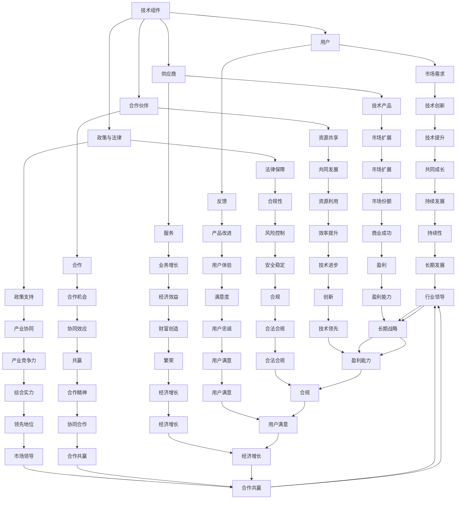
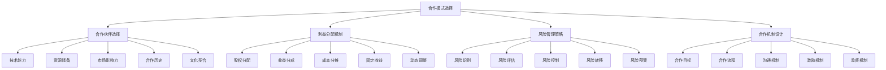

                 

## 文章标题

### 技术生态系统构建：打造良性的技术合作网络

---

### 关键词

- 技术生态系统
- 良性技术合作网络
- 构建策略
- 案例分析
- 未来趋势

---

### 摘要

本文深入探讨了技术生态系统构建与良性技术合作网络打造的重要性。首先，通过技术生态系统概述，揭示了其定义、重要性及发展历程。接着，详细阐述了构建技术生态系统的核心要素，包括技术、市场、法律和政策等。然后，我们探讨了技术合作网络的原理，并提出了构建良性技术合作网络的策略。通过案例分析，展示了实际操作中的成功经验。最后，分析了技术生态系统发展的挑战与未来趋势，并提供了实践指南。本文旨在为IT领域从业者提供理论支持和实践指导。

---

## 第1章：技术生态系统概述

### 1.1 技术生态系统的定义与重要性

技术生态系统是指由技术组件、用户、供应商、合作伙伴和其他利益相关者组成的一个相互依存、相互促进的复杂网络。在这个网络中，各个组成部分通过技术交流、合作和竞争，共同推动技术进步和市场发展（Mermaid流程图见附录A）。

技术生态系统的重要性体现在以下几个方面：

1. **技术创新**：技术生态系统为技术创新提供了丰富的资源和动力。通过合作与竞争，技术组件不断优化和迭代，从而推动整体技术水平的提升。
2. **市场扩展**：技术生态系统有助于市场扩展和业务增长。通过技术合作，企业可以迅速获取新的技术和市场资源，拓宽业务范围。
3. **风险分散**：技术生态系统内的合作和竞争机制有助于分散技术风险。单一企业难以应对复杂多变的市场和技术环境，而通过技术合作，企业可以共同分担风险。
4. **产业协同**：技术生态系统促进了产业内部的协同发展。不同企业、组织和行业通过技术合作，实现了资源共享、优势互补，从而提高了整体产业竞争力。

### 1.2 技术生态系统的发展历史

技术生态系统的发展可以追溯到20世纪90年代。当时，随着计算机技术和互联网的兴起，软件开发、硬件制造、系统集成等领域的从业者开始形成松散的合作网络。这一时期，技术生态系统的概念主要集中于软件产业，如Unix、Linux等操作系统生态的建立。

进入21世纪，随着云计算、大数据、人工智能等新技术的兴起，技术生态系统的概念逐渐扩展到各个行业。以云计算为例，亚马逊、微软、谷歌等云服务提供商构建了庞大的技术生态系统，涵盖了基础设施、平台服务、应用开发等多个层面。

近年来，技术生态系统的发展呈现出以下几个趋势：

1. **平台化**：技术生态系统逐渐向平台化方向发展。平台不仅提供技术支持，还为企业提供市场、资金、人才等多元化资源。
2. **开放性**：技术生态系统日益开放，不同技术、平台和生态系统之间的互操作性得到加强。这使得企业可以更灵活地整合外部资源，提高竞争力。
3. **全球化**：随着全球化的深入，技术生态系统跨越国界，形成了全球性的合作网络。跨国企业、国际组织和全球市场共同推动了技术生态系统的发展。

### 1.3 技术生态系统的组成部分

技术生态系统由多个组成部分构成，包括：

1. **技术组件**：技术生态系统的核心是各种技术组件，如软件、硬件、平台、算法等。这些组件相互依赖、相互促进，共同构成了技术生态系统的基础。
2. **用户**：技术生态系统的使用者，包括个人用户和企业用户。用户的需求和反馈是技术生态系统持续发展的动力。
3. **供应商**：技术生态系统中的供应商提供各种技术产品和服务，如硬件设备、软件开发工具、云服务、数据处理平台等。
4. **合作伙伴**：技术生态系统中的合作伙伴包括其他企业、研究机构、非营利组织等。合作伙伴通过技术合作、资源共享、共同开发等方式，共同推动技术生态系统的发展。
5. **政策与法律**：政策与法律是技术生态系统的重要保障。合理的政策支持和法律框架有助于技术生态系统的健康发展。

### 1.4 技术生态系统的价值

技术生态系统具有以下几个价值：

1. **创新价值**：技术生态系统为技术创新提供了丰富的资源和环境。通过合作与竞争，技术组件不断优化和迭代，从而推动整体技术水平的提升。
2. **市场价值**：技术生态系统有助于市场扩展和业务增长。通过技术合作，企业可以迅速获取新的技术和市场资源，拓宽业务范围。
3. **社会价值**：技术生态系统促进了产业内部的协同发展，提高了整体产业竞争力。同时，技术生态系统还为社会创造了大量的就业机会和经济效益。

### 1.5 技术生态系统与良性技术合作网络的关系

技术生态系统和良性技术合作网络密切相关。良性技术合作网络是技术生态系统的重要组成部分，它通过建立稳定、互惠互利的合作关系，推动技术生态系统的发展。具体来说：

1. **合作关系**：良性技术合作网络中的合作关系是基于共同利益和相互信任的。各方通过合作，实现资源共享、优势互补，从而提高整体竞争力。
2. **资源共享**：良性技术合作网络促进了资源的共享和流动。各方可以通过合作，获取更多的资源和技术支持，提高自身的技术水平。
3. **共同发展**：良性技术合作网络有助于各方共同发展。通过合作，各方可以共同应对市场和技术挑战，实现共同增长。

### 1.6 本章小结

本章对技术生态系统进行了概述，包括其定义、重要性、发展历史、组成部分和价值。同时，探讨了技术生态系统与良性技术合作网络的关系。这些内容为后续章节的深入讨论提供了基础。

### 附录A：技术生态系统的Mermaid流程图

## 第2章：构建技术生态系统的核心要素

### 2.1 技术：核心技术能力与技术创新

技术是技术生态系统的核心要素之一，它决定了生态系统的创新能力和竞争力。核心技术能力是指企业在某一特定技术领域具备的领先优势，包括技术积累、研发能力、创新能力等。构建技术生态系统，需要企业具备强大的核心技术能力，以下为具体分析：

1. **技术积累**：技术积累是企业技术能力的基础。企业需要通过长期的技术研发和实践，不断积累技术经验，形成独特的技术优势。技术积累不仅包括技术本身的研发，还包括对技术应用的深入理解和优化。

2. **研发能力**：研发能力是企业技术创新的关键。企业需要建立强大的研发团队，投入足够的研究资源，持续进行技术探索和创新。研发能力的提升，可以通过产学研合作、人才引进、技术创新平台建设等多种途径实现。

3. **创新能力**：创新能力是企业技术竞争力的核心。企业需要通过不断的技术创新，引领行业发展趋势，保持技术领先地位。创新能力的提升，可以通过开放创新、合作研发、技术转移等多种方式实现。

### 2.2 市场：市场需求与用户需求分析

市场是技术生态系统的重要组成部分，市场需求和用户需求是技术发展的驱动力。以下为对市场需求和用户需求分析的具体阐述：

1. **市场需求**：市场需求是指整个市场对某一类技术的需求总量。企业需要通过市场调研，了解市场需求趋势，把握市场机会。市场需求分析可以帮助企业确定技术发展方向，优化产品和服务。

2. **用户需求**：用户需求是指具体用户对某一类技术的需求。企业需要通过用户调研、用户反馈等方式，深入了解用户需求，提供针对性的产品和服务。用户需求分析可以帮助企业提高产品满意度，提升用户体验。

3. **市场细分**：市场细分是指将市场划分为不同的子市场，针对不同子市场的需求，提供差异化的产品和服务。市场细分可以帮助企业更精准地满足用户需求，提高市场竞争力。

### 2.3 法律：知识产权保护与法规遵守

法律是技术生态系统运行的重要保障，知识产权保护和法规遵守是构建技术生态系统的关键要素。以下为对知识产权保护和法规遵守的具体分析：

1. **知识产权保护**：知识产权保护是指对企业的技术成果进行保护，防止他人未经授权使用。企业需要通过专利申请、版权登记等方式，保护自己的技术成果。知识产权保护可以激励企业进行技术创新，维护市场秩序。

2. **法规遵守**：法规遵守是指企业遵守国家法律法规，确保技术生态系统的正常运行。企业需要了解相关法律法规，建立合规体系，确保技术研发、产品销售、用户服务等环节的合法性。

### 2.4 政策：政府政策支持与行业规范

政府政策支持是技术生态系统发展的重要保障，行业规范是技术生态系统运行的基础。以下为对政府政策支持和行业规范的具体分析：

1. **政府政策支持**：政府政策支持是指政府对技术生态系统发展提供的各种支持措施，包括财政支持、税收优惠、研发资助等。政府政策支持可以激励企业进行技术研发，推动技术生态系统的发展。

2. **行业规范**：行业规范是指行业内部对技术发展、产品标准、服务规范等的统一规定。行业规范可以维护行业秩序，提高行业整体竞争力，促进技术生态系统的健康发展。

### 2.5 合作伙伴：技术合作与资源共享

合作伙伴是技术生态系统的重要组成部分，技术合作和资源共享是构建技术生态系统的重要手段。以下为对合作伙伴、技术合作和资源共享的具体分析：

1. **合作伙伴**：合作伙伴是指与其他企业、研究机构、非营利组织等建立合作关系的企业或组织。合作伙伴可以通过技术合作、资源共享、共同研发等方式，共同推动技术生态系统的发展。

2. **技术合作**：技术合作是指合作伙伴之间在技术研发、产品开发、市场推广等方面的合作。技术合作可以共享技术资源，降低研发成本，提高研发效率。

3. **资源共享**：资源共享是指合作伙伴之间共享技术资源、市场资源、人才资源等。资源共享可以优化资源配置，提高资源利用效率，推动技术生态系统的发展。

### 2.6 本章小结

本章分析了构建技术生态系统的核心要素，包括技术、市场、法律和政策等。技术是生态系统的核心，市场是需求驱动力，法律是运行保障，政策是支持力量。合作伙伴通过技术合作和资源共享，共同推动技术生态系统的发展。这些核心要素相互关联、相互促进，共同构成了技术生态系统的基础。

## 第3章：技术合作网络原理

### 3.1 技术合作网络的定义与结构

技术合作网络是指由多个组织或个人通过技术合作形成的复杂网络结构。在这个网络中，各个节点代表不同的组织或个人，节点之间的连线代表它们之间的合作关系。技术合作网络具有以下基本结构：

1. **节点**：节点代表技术合作网络中的各个组织或个人，如企业、研究机构、大学等。节点具备以下属性：
   - **身份**：标识节点的名称、类型和属性。
   - **能力**：节点在技术领域的专业能力和资源。
   - **角色**：节点在网络中的角色，如主导者、参与者、观察者等。

2. **边**：边代表节点之间的技术合作关系，如合作研发、资源共享、共同市场推广等。边具备以下属性：
   - **关系类型**：描述节点之间的合作类型。
   - **合作强度**：表示节点之间合作的紧密程度。
   - **合作周期**：表示节点之间合作的持续时长。

3. **网络结构**：技术合作网络的结构包括网络的密度、连通性、集群系数等。网络结构决定了技术合作网络的稳定性和效率。

### 3.2 节点与边的概念

1. **节点**：节点是技术合作网络的基本单位。节点可以是企业、研究机构、大学等具有独立技术能力的组织或个人。节点在技术合作网络中的角色和地位取决于其技术能力、资源储备和市场影响力。

2. **边**：边连接节点，表示节点之间的合作关系。边可以是单向的，也可以是双向的。边的强度和类型决定了合作的紧密程度和合作范围。

### 3.3 技术合作网络分析工具与方法

1. **网络分析法**：网络分析法是一种研究技术合作网络结构和特性的方法。通过分析网络的密度、连通性、聚类系数等指标，可以了解技术合作网络的稳定性和效率。

2. **社会网络分析（SNA）**：社会网络分析是一种基于数学模型和统计分析的方法，用于研究社会网络的结构和功能。SNA可以揭示技术合作网络中的关键节点、核心子群、网络密度等特性。

3. **复杂网络理论**：复杂网络理论是一种研究复杂网络结构的理论。通过分析复杂网络的拓扑结构、动态行为和演化规律，可以深入理解技术合作网络的运作机制。

4. **数据挖掘技术**：数据挖掘技术是一种从大量数据中发现规律和模式的方法。通过数据挖掘，可以挖掘技术合作网络中的潜在合作关系、趋势和规律。

### 3.4 技术合作网络的优势与挑战

1. **优势**：
   - **资源共享**：技术合作网络可以实现资源的优化配置，提高资源利用效率。
   - **知识共享**：技术合作网络促进了知识和技术的交流与共享，加速技术创新。
   - **风险分担**：技术合作网络可以将技术风险分散到多个节点，降低单个节点的风险。
   - **市场拓展**：技术合作网络可以帮助企业拓展市场，实现业务增长。

2. **挑战**：
   - **信任问题**：技术合作网络中的节点需要相互信任，避免信息泄露和资源滥用。
   - **利益分配**：技术合作网络中的利益分配需要公平合理，避免引发争议。
   - **管理复杂性**：技术合作网络的复杂性增加了管理难度，需要有效的协调和监督机制。

### 3.5 本章小结

本章介绍了技术合作网络的定义、结构、节点与边的概念以及分析工具与方法。技术合作网络通过节点和边的连接，实现了资源、知识和风险的共享，促进了技术创新和市场拓展。同时，本章也探讨了技术合作网络的优势与挑战，为后续构建良性技术合作网络提供了理论基础。

### 附录B：技术合作网络的Mermaid流程图

```mermaid
graph TD
    A[节点1] --> B[节点2]
    A --> C[节点3]
    B --> D[节点4]
    C --> D
    A --> E[节点5]
    F[节点6] --> G[节点7]
    F --> H[节点8]
    G --> I[节点9]
    H --> I
    A --> J[节点10]
    K[节点11] --> L[节点12]
    K --> M[节点13]
    L --> M
    A --> N[节点14]
    O[节点15] --> P[节点16]
    O --> Q[节点17]
    P --> Q
    A --> R[节点18]
    S[节点19] --> T[节点20]
    S --> U[节点21]
    T --> U
    A --> V[节点22]
    W[节点23] --> X[节点24]
    W --> Y[节点25]
    X --> Y
    A --> Z[节点26]
    AA[节点27] --> BB[节点28]
    AA --> CC[节点29]
    BB --> CC
    A --> DD[节点30]
    EE[节点31] --> FF[节点32]
    EE --> GG[节点33]
    FF --> GG
    A --> HH[节点34]
    II[节点35] --> JJ[节点36]
    II --> KK[节点37]
    JJ --> KK
    A --> LL[节点38]
    MM[节点39] --> NN[节点40]
    MM --> OO[节点41]
    NN --> OO
    A --> PP[节点42]
    QQ[节点43] --> RR[节点44]
    QQ --> SS[节点45]
    RR --> SS
    A --> TT[节点46]
    UU[节点47] --> VV[节点48]
    UU --> WW[节点49]
    VV --> WW
    A --> XX[节点50]
    YY[节点51] --> ZZ[节点52]
    YY --> AAA[节点53]
    ZZ --> AAA
    A --> BBB[节点54]
    CCC[节点55] --> DDD[节点56]
    CCC --> EEE[节点57]
    DDD --> EEE
    A --> FFF[节点58]
    GGG[节点59] --> HHH[节点60]
    GGG --> IIII[节点61]
    HHH --> IIII
    A --> JJJ[节点62]
    KKK[节点63] --> LLL[节点64]
    KKK --> MMM[节点65]
    LLL --> MMM
    A --> NNN[节点66]
    OOO[节点67] --> PPP[节点68]
    OOO --> QQQ[节点69]
    PPP --> QQQ
    A --> RRR[节点70]
    SSS[节点71] --> TTT[节点72]
    SSS --> UUU[节点73]
    TTT --> UUU
    A --> VVV[节点74]
    WWW[节点75] --> XXX[节点76]
    WWW --> YYY[节点77]
    XXX --> YYY
    A --> ZZZ[节点78]
    AAAA[节点79] --> BBBB[节点80]
    AAAA --> CCCC[节点81]
    BBBB --> CCCC
    A --> DDDD[节点82]
    EEEE[节点83] --> FFFF[节点84]
    EEEE --> GGGG[节点85]
    FFFF --> GGGG
    A --> HHHH[节点86]
    IIIII[节点87] --> JJJJ[节点88]
    IIIII --> KKKK[节点89]
    JJJJ --> KKKK
    A --> LLLL[节点90]
    MMMM[节点91] --> NNNN[节点92]
    MMMM --> OOOO[节点93]
    NNNN --> OOOO
    A --> PPPP[节点94]
    QQQQ[节点95] --> RRRR[节点96]
    QQQQ --> SSSS[节点97]
    RRRR --> SSSS
    A --> TTTT[节点98]
    UUUU[节点99] --> VVVV[节点100]
    UUUU --> WWWW[节点101]
    VVVV --> WWWW
    A --> XXXX[节点102]
    YYYYY[节点103] --> ZZZZ[节点104]
    YYYYY --> AAAA1[节点105]
    ZZZZ --> AAAA1
    A --> BBBB1[节点106]
    CCC1[节点107] --> DDD1[节点108]
    CCC1 --> EEE1[节点109]
    DDD1 --> EEE1
    A --> FFF1[节点110]
    GGG1[节点111] --> HHH1[节点112]
    GGG1 --> III1[节点113]
    HHH1 --> III1
    A --> JJJ1[节点114]
    KKK1[节点115] --> LLL1[节点116]
    KKK1 --> MMM1[节点117]
    LLL1 --> MMM1
    A --> NNN1[节点118]
    OOO1[节点119] --> PPP1[节点120]
    OOO1 --> QQQ1[节点121]
    PPP1 --> QQQ1
    A --> RRR1[节点122]
    SSS1[节点123] --> TTT1[节点124]
    SSS1 --> UUU1[节点125]
    TTT1 --> UUU1
    A --> VVV1[节点126]
    WWW1[节点127] --> XXX1[节点128]
    WWW1 --> YYY1[节点129]
    XXX1 --> YYY1
    A --> ZZZ1[节点130]
    AAAA2[节点131] --> BBBB2[节点132]
    AAAA2 --> CCCC2[节点133]
    BBBB2 --> CCCC2
    A --> DDDD2[节点134]
    EEEE2[节点135] --> FFFF2[节点136]
    EEEE2 --> GGGG2[节点137]
    FFFF2 --> GGGG2
    A --> HHHH2[节点138]
    IIIII2[节点139] --> JJJJ2[节点140]
    IIIII2 --> KKKK2[节点141]
    JJJJ2 --> KKKK2
    A --> LLLL2[节点142]
    MMMM2[节点143] --> NNNN2[节点144]
    MMMM2 --> OOOO2[节点145]
    NNNN2 --> OOOO2
    A --> PPPP2[节点146]
    QQQQ2[节点147] --> RRRR2[节点148]
    QQQQ2 --> SSSS2[节点149]
    RRRR2 --> SSSS2
    A --> TTTT2[节点150]
    UUUU2[节点151] --> VVVV2[节点152]
    UUUU2 --> WWWW2[节点153]
    VVVV2 --> WWWW2
    A --> XXXX2[节点154]
    YYYYY2[节点155] --> ZZZZ2[节点156]
    YYYYY2 --> AAAA3[节点157]
    ZZZZ2 --> AAAA3
    A --> BBBB3[节点158]
    CCC3[节点159] --> DDD3[节点160]
    CCC3 --> EEE3[节点161]
    DDD3 --> EEE3
    A --> FFF3[节点162]
    GGG3[节点163] --> HHH3[节点164]
    GGG3 --> III3[节点165]
    HHH3 --> III3
    A --> JJJ3[节点166]
    KKK3[节点167] --> LLL3[节点168]
    KKK3 --> MMM3[节点169]
    LLL3 --> MMM3
    A --> NNN3[节点170]
    OOO3[节点171] --> PPP3[节点172]
    OOO3 --> QQQ3[节点173]
    PPP3 --> QQQ3
    A --> RRR3[节点174]
    SSS3[节点175] --> TTT3[节点176]
    SSS3 --> UUU3[节点177]
    TTT3 --> UUU3
    A --> VVV3[节点178]
    WWW3[节点179] --> XXX3[节点180]
    WWW3 --> YYY3[节点181]
    XXX3 --> YYY3
    A --> ZZZ3[节点182]
```

## 第4章：构建良性技术合作网络的策略

### 4.1 合作模式选择

构建良性技术合作网络首先需要选择合适的合作模式。合作模式决定了各方在技术合作网络中的角色和关系，以下是几种常见的合作模式：

1. **合作研发**：合作研发是各方共同投入资源，共同开展技术研发的合作模式。这种模式有助于降低研发成本，提高研发效率，同时促进技术进步。

2. **资源共享**：资源共享模式是各方通过共享技术资源、设备、人才等，实现资源的最优配置。这种模式可以降低各方的运营成本，提高资源利用效率。

3. **市场合作**：市场合作模式是各方在市场推广、销售渠道等方面进行合作。这种模式可以扩大市场覆盖范围，提高市场竞争力。

4. **战略联盟**：战略联盟是各方在长期合作的基础上，建立的一种紧密合作的关系。这种模式可以共同应对市场和技术挑战，实现共同发展。

5. **并购与合作**：并购与合作模式是企业通过并购其他企业，实现技术资源和市场的快速扩张。这种模式可以迅速提升企业的技术实力和市场地位。

### 4.2 合作伙伴选择

合作伙伴的选择是构建良性技术合作网络的关键。以下是选择合作伙伴时需要考虑的因素：

1. **技术能力**：合作伙伴应具备较强的技术能力和研发实力，能够为技术合作网络提供有效的技术支持和创新。

2. **资源储备**：合作伙伴应拥有充足的资源储备，包括资金、设备、人才等，能够为技术合作网络提供持续的支持。

3. **市场影响力**：合作伙伴应具备较强的市场影响力，能够为技术合作网络带来更多的市场机会和资源。

4. **合作历史**：选择有良好合作历史的合作伙伴，可以降低合作风险，建立信任关系。

5. **文化契合**：合作伙伴的文化应与自身文化相契合，能够实现文化的融合和协同。

### 4.3 利益分配机制

利益分配机制是构建良性技术合作网络的重要保障。以下是几种常见的利益分配机制：

1. **股权分配**：通过股权分配，实现利益共享。股权比例应根据各方在技术合作网络中的贡献进行合理分配。

2. **收益分成**：根据各方的收益贡献，进行收益分成。收益分成可以按照销售额、利润等指标进行分配。

3. **成本分摊**：各方共同承担技术研发、市场推广等成本，根据各方的投入进行成本分摊。

4. **固定收益**：各方在合作初期可以约定固定收益，以保障各方的利益。

5. **动态调整**：利益分配机制应根据技术合作网络的发展状况和各方贡献的动态变化进行调整。

### 4.4 风险管理策略

构建良性技术合作网络需要有效管理合作风险。以下是几种常见的风险管理策略：

1. **风险识别**：对技术合作网络中的潜在风险进行识别，包括技术风险、市场风险、法律风险等。

2. **风险评估**：对识别出的风险进行评估，确定风险的重要性和影响程度。

3. **风险控制**：采取相应的措施，降低风险的影响。如签订合作协议、设立风险基金、进行风险隔离等。

4. **风险转移**：通过保险、担保等方式，将部分风险转移给第三方。

5. **风险预警**：建立风险预警机制，对风险进行实时监测和预警。

### 4.5 合作机制设计

合作机制设计是构建良性技术合作网络的核心。以下是合作机制设计的关键要素：

1. **合作目标**：明确技术合作网络的目标，包括技术发展目标、市场拓展目标等。

2. **合作流程**：设计科学合理的合作流程，确保各方按照既定流程进行合作。

3. **沟通机制**：建立有效的沟通机制，确保各方能够及时沟通，解决合作中的问题。

4. **激励机制**：建立激励机制，鼓励各方积极参与合作，提高合作效率。

5. **监督机制**：建立监督机制，确保各方按照合作协议执行，防止合作中的违规行为。

### 4.6 本章小结

本章介绍了构建良性技术合作网络的策略，包括合作模式选择、合作伙伴选择、利益分配机制、风险管理策略和合作机制设计。通过科学合理的策略设计，可以构建一个稳定、互惠互利的良性技术合作网络，推动技术生态系统的发展。

### 附录C：技术合作网络构建策略的Mermaid流程图

## 第5章：技术生态系统案例分析

### 5.1 案例背景介绍

本节将通过分析具体的技术生态系统案例，探讨技术生态系统的构建和良性技术合作网络的实现。首先，我们将介绍案例的基本背景，包括企业背景、行业背景和案例背景。

**案例背景：**

**企业背景**：华为是全球领先的电信设备和解决方案提供商，成立于1987年，总部位于中国深圳。华为在电信网络设备、IT解决方案和智能手机等领域拥有广泛的市场和用户基础。

**行业背景**：电信行业是一个高度技术密集的行业，涉及到无线通信、有线通信、云计算、大数据、人工智能等多个领域。随着5G、物联网等新技术的不断推进，电信行业面临着前所未有的发展机遇和挑战。

**案例背景**：华为的技术生态系统构建主要聚焦于以下几个方面：

1. **开放合作**：华为通过开放源代码、开放平台等方式，吸引全球开发者参与技术合作，构建了庞大的开发者社区。
2. **技术创新**：华为持续投入大量研发资源，进行技术创新，推动5G、人工智能等新技术的研发和应用。
3. **产业协同**：华为与国内外多家企业、研究机构和高校建立了紧密的合作关系，共同推进技术生态系统的建设。

### 5.2 案例分析

**1. 技术合作网络的构建**

华为的技术合作网络涵盖了多个层面的合作伙伴，包括硬件供应商、软件开发者、服务提供商、运营商等。以下为具体分析：

1. **硬件供应商**：华为与多家全球领先的硬件供应商建立了战略合作关系，共同研发高性能芯片、通信设备等。这种合作模式有助于华为快速获取先进的硬件技术，提高产品竞争力。

2. **软件开发者**：华为通过开放平台，吸引了大量的第三方软件开发者参与生态系统的建设。开发者可以在华为平台上开发应用程序、解决方案等，实现技术成果的转化和应用。

3. **服务提供商**：华为与国内外多家服务提供商建立了合作关系，提供云计算、大数据、人工智能等技术服务。这种合作模式有助于华为为客户提供更全面、高质量的服务。

4. **运营商**：华为与全球多家运营商建立了紧密的合作关系，共同推进5G网络的部署和应用。这种合作模式有助于华为把握市场趋势，提高市场竞争力。

**2. 良性技术合作网络的实现**

华为在构建良性技术合作网络方面采取了多种策略：

1. **开放合作**：华为通过开放平台、开放源代码等方式，鼓励外部开发者参与技术合作。这种开放合作模式有助于形成良性技术合作网络，促进技术共享和创新发展。

2. **利益分配机制**：华为建立了合理的利益分配机制，确保合作伙伴能够获得合理的收益。这种利益分配机制有助于维护合作网络的稳定性，促进各方持续合作。

3. **风险管理**：华为通过风险识别、风险评估、风险控制等手段，有效管理合作风险。这种风险管理策略有助于降低合作风险，确保合作网络的稳健发展。

4. **合作机制设计**：华为设计了科学合理的合作机制，包括合作目标、合作流程、沟通机制、激励机制和监督机制等。这种合作机制有助于确保合作的高效运行和可持续发展。

### 5.3 案例启示

通过对华为技术生态系统案例的分析，我们可以得出以下启示：

1. **开放合作**：开放合作是构建良性技术合作网络的关键。通过开放合作，可以吸引更多的合作伙伴参与，形成强大的技术生态系统。

2. **利益分配机制**：合理的利益分配机制是维护合作网络稳定的重要保障。通过建立公平、合理的利益分配机制，可以确保各方获得合理的收益，促进合作网络的持续发展。

3. **风险管理**：有效的风险管理策略有助于降低合作风险，确保合作网络的稳健发展。通过风险识别、风险评估、风险控制等手段，可以降低合作风险，提高合作网络的抗风险能力。

4. **合作机制设计**：科学合理的合作机制设计是合作网络高效运行的基础。通过设计明确的目标、流程、沟通机制、激励机制和监督机制，可以确保合作网络的有序运行和可持续发展。

### 5.4 本章小结

本章通过分析华为技术生态系统案例，探讨了技术生态系统的构建和良性技术合作网络的实现。案例研究表明，开放合作、合理的利益分配机制、有效的风险管理策略和科学合理的合作机制设计是构建良性技术合作网络的关键。这些启示对于其他企业构建和优化技术生态系统具有重要的参考价值。

## 第6章：技术生态系统发展挑战与未来趋势

### 6.1 发展挑战分析

技术生态系统在发展过程中面临着一系列挑战，这些挑战不仅制约了技术生态系统的健康发展，也对企业的创新能力和竞争力产生了影响。以下是技术生态系统发展过程中面临的主要挑战：

1. **竞争压力**：技术生态系统中的企业面临着激烈的竞争压力。随着技术的不断进步和市场的快速变化，企业需要不断进行技术创新和业务拓展，以保持竞争优势。然而，市场竞争的加剧可能导致企业之间的不正当竞争，如价格战、恶意攻击等，从而损害整个技术生态系统的健康发展。

2. **合作风险**：技术合作网络中的各方存在合作风险。合作过程中可能出现的信任问题、利益分配不均、技术泄露等风险，可能导致合作关系的破裂，甚至损害技术生态系统的稳定性。

3. **技术标准不统一**：技术生态系统的发展离不开统一的技术标准和规范。然而，在技术快速迭代和市场多样化的背景下，技术标准的不统一可能成为技术生态系统发展的一大障碍。不同的技术标准会导致兼容性问题，影响技术生态系统的整体效率。

4. **政策法规制约**：技术生态系统的发展受到政策法规的制约。不同国家和地区的政策法规差异可能导致技术生态系统在国际市场的运营受阻。此外，政策法规的变化也可能对企业的研发、生产和运营产生重大影响。

5. **信息安全**：随着技术生态系统的复杂化，信息安全问题日益突出。技术生态系统中的信息流通和数据共享增加了信息泄露的风险，对企业的核心技术和商业秘密构成威胁。

6. **人才短缺**：技术生态系统的发展离不开高素质的人才。然而，随着技术领域的快速发展，人才供需失衡现象日益严重。企业面临的挑战是如何吸引、培养和留住人才，以支撑技术生态系统的持续创新和发展。

### 6.2 未来趋势展望

尽管技术生态系统发展过程中面临诸多挑战，但未来技术生态系统的发展趋势依然乐观。以下是技术生态系统未来可能的发展趋势：

1. **平台化**：随着云计算、大数据、人工智能等技术的发展，技术生态系统将越来越向平台化方向发展。平台化将有助于整合各方资源，提高技术生态系统的效率和协同性。

2. **开放性**：技术生态系统的开放性将进一步提升。通过开放接口、开放数据、开放源代码等方式，企业可以更便捷地与其他技术组件和生态系统进行集成和互操作，推动技术生态系统的互联互通。

3. **国际化**：随着全球化的深入，技术生态系统将越来越呈现国际化趋势。跨国企业、国际组织和全球市场将在技术生态系统中扮演更加重要的角色，推动技术生态系统的全球化发展。

4. **人工智能化**：人工智能技术将在技术生态系统中发挥越来越重要的作用。通过人工智能技术，企业可以实现智能化的研发、生产、运营和营销，提高技术生态系统的整体效率。

5. **可持续发展**：随着社会对环境保护和可持续发展的关注度不断提高，技术生态系统的发展也将更加注重可持续发展。企业将通过绿色技术、循环经济等方式，推动技术生态系统的可持续发展。

6. **社区化**：技术生态系统将越来越呈现出社区化趋势。通过建立开发者社区、用户社区等，企业可以更直接地与用户和开发者互动，了解用户需求，优化产品和服务。

### 6.3 应对策略

针对技术生态系统发展过程中面临的挑战和未来趋势，企业可以采取以下应对策略：

1. **加强技术创新**：企业应持续加强技术创新，保持技术领先地位。通过研发投入、人才培养、产学研合作等方式，提升企业的技术实力和创新能力。

2. **构建开放合作网络**：企业应积极参与开放合作网络，与国内外企业、研究机构、开发者等建立紧密合作关系。通过开放接口、开放数据、开放源代码等方式，促进技术共享和生态协同。

3. **建立合理的利益分配机制**：企业应建立合理的利益分配机制，确保各方在合作中获得公平的利益分配。通过股权分配、收益分成、成本分摊等方式，激励各方持续合作。

4. **加强信息安全防护**：企业应加强信息安全防护，建立健全的信息安全管理体系。通过加密技术、安全审计、安全培训等方式，降低信息安全风险。

5. **关注政策法规变化**：企业应密切关注政策法规的变化，及时调整业务策略。通过参与政策制定、行业协会等方式，影响政策法规的制定和实施，为企业发展创造有利环境。

6. **培养和引进人才**：企业应重视人才培养和引进，建立人才激励机制。通过培训、晋升、股权激励等方式，激发员工的创新潜能，提升企业的整体竞争力。

7. **推动可持续发展**：企业应积极推动可持续发展，践行绿色环保理念。通过绿色技术、节能减排等方式，降低环境负担，实现可持续发展。

### 6.4 本章小结

本章分析了技术生态系统发展过程中面临的挑战和未来趋势，并提出了一系列应对策略。企业应通过加强技术创新、构建开放合作网络、建立合理的利益分配机制、加强信息安全防护、关注政策法规变化、培养和引进人才、推动可持续发展等方式，积极应对挑战，把握未来发展趋势，推动技术生态系统的健康发展。

### 附录D：技术生态系统发展挑战与未来趋势的Mermaid流程图

## 第7章：实践指南

### 7.1 技术生态系统构建方法

构建技术生态系统需要系统的方法和策略。以下是一个基于步骤的方法，帮助企业和组织构建技术生态系统：

1. **需求分析**：首先，进行需求分析，明确企业或组织的技术需求、市场需求以及用户需求。需求分析包括市场调研、用户访谈、竞品分析等。

2. **技术评估**：评估现有技术能力和技术储备，识别技术短板和瓶颈。同时，分析未来技术发展趋势，确定技术发展方向。

3. **合作模式选择**：根据需求分析和技术评估结果，选择合适的合作模式。合作模式包括合作研发、资源共享、市场合作等。

4. **合作伙伴选择**：根据合作模式，选择合适的合作伙伴。合作伙伴的选择应考虑技术能力、资源储备、市场影响力、合作历史等因素。

5. **利益分配机制设计**：设计合理的利益分配机制，确保各方在合作中获得公平的利益。利益分配机制应包括股权分配、收益分成、成本分摊等。

6. **风险管理**：识别合作过程中的潜在风险，建立风险控制措施。风险控制措施包括风险识别、风险评估、风险控制、风险转移等。

7. **合作机制设计**：设计科学合理的合作机制，包括合作目标、合作流程、沟通机制、激励机制和监督机制等。

8. **执行与监督**：执行合作计划，建立监督机制，确保各方按照合作协议执行。同时，定期评估合作效果，根据评估结果调整合作策略。

### 7.2 技术合作网络构建工具与技巧

构建技术合作网络需要使用适当的工具和技巧。以下是一些常用的工具和技巧：

1. **网络分析工具**：使用网络分析工具，如Gephi、Cytoscape等，分析技术合作网络的拓扑结构、节点和边的关系等。

2. **社会网络分析（SNA）工具**：使用SNA工具，如UCINET、NetDraw等，分析技术合作网络中的关键节点、核心子群等。

3. **复杂网络理论工具**：使用复杂网络理论工具，如NetLogo、MultiNet等，模拟技术合作网络的动态行为和演化规律。

4. **数据挖掘工具**：使用数据挖掘工具，如R、Python等，从大数据中挖掘技术合作网络中的潜在合作关系、趋势和规律。

5. **项目管理工具**：使用项目管理工具，如Trello、Jira等，管理和协调技术合作网络中的项目进度和任务分配。

6. **沟通协作工具**：使用沟通协作工具，如Slack、Microsoft Teams等，实现技术合作网络中的实时沟通和协作。

7. **文档管理工具**：使用文档管理工具，如Google Docs、Confluence等，共享和存储技术合作网络中的文档和资料。

8. **知识管理工具**：使用知识管理工具，如IBM Knowledge Center、 SharePoint等，管理和共享技术合作网络中的知识资源。

### 7.3 良性技术合作网络的构建与维护

构建良性技术合作网络需要注重合作网络的稳定性和互惠性。以下是一些构建与维护良性技术合作网络的策略：

1. **建立信任关系**：通过定期沟通、共同参与项目等方式，建立和巩固合作伙伴之间的信任关系。

2. **公平的利益分配**：设计合理的利益分配机制，确保各方在合作中获得公平的利益。

3. **透明度**：保持合作过程中的信息透明，及时共享项目进展、成果和问题。

4. **激励机制**：建立激励机制，鼓励合作伙伴积极参与合作，提高合作网络的活力。

5. **风险管理**：识别合作风险，建立风险控制措施，降低合作风险。

6. **持续评估**：定期评估合作效果，根据评估结果调整合作策略。

7. **合作扩展**：根据技术合作网络的发展，不断扩展合作伙伴，引入新的合作机会。

### 7.4 实践案例分析

以下是一个基于实际案例的技术生态系统构建和实践分析：

**案例背景**：某企业是一家专注于物联网技术解决方案的提供商，其在构建技术生态系统方面具有一定的经验和成功案例。

**案例分析**：

1. **需求分析**：企业首先进行需求分析，确定了物联网技术在智能家居、智能工业、智慧城市等领域的市场需求。

2. **技术评估**：企业评估自身在物联网技术方面的能力和储备，确定了技术发展方向。

3. **合作模式选择**：企业选择了合作研发和市场合作两种模式，与高校、研究机构、硬件制造商等建立了合作关系。

4. **合作伙伴选择**：企业选择了具备技术实力和市场影响力的合作伙伴，确保合作网络的质量。

5. **利益分配机制设计**：企业设计了收益分成和成本分摊的利益分配机制，确保各方获得公平的利益。

6. **风险管理**：企业制定了风险控制措施，如签订合作协议、设立风险基金等，降低合作风险。

7. **合作机制设计**：企业建立了合作目标、流程、沟通机制、激励机制和监督机制，确保合作网络的高效运行。

8. **执行与监督**：企业执行合作计划，并建立监督机制，确保各方按照合作协议执行。

**实践成果**：

1. **技术创新**：通过合作研发，企业推出了多款物联网技术解决方案，提升了技术水平。

2. **市场拓展**：通过市场合作，企业拓展了市场份额，提升了品牌知名度。

3. **合作网络稳定**：通过建立信任关系、公平的利益分配机制和有效的风险管理，企业建立了稳定的合作网络。

4. **持续发展**：企业通过不断优化合作网络，实现了技术生态系统和良性技术合作网络的持续发展。

### 7.5 最佳实践 tips、小结、注意事项、拓展阅读

**最佳实践 tips**：

1. **明确合作目标**：在构建技术生态系统和良性技术合作网络时，明确合作目标是成功的关键。

2. **建立信任关系**：建立信任关系是合作网络稳定的基础。

3. **合理利益分配**：设计合理的利益分配机制，确保各方在合作中获得公平的利益。

4. **风险管理**：识别和管理合作风险，降低合作风险。

5. **持续评估与调整**：定期评估合作效果，根据评估结果调整合作策略。

**小结**：

构建技术生态系统和良性技术合作网络是现代企业的重要战略。通过科学合理的方法和策略，企业可以构建稳定、互惠互利的合作网络，提升技术创新能力和市场竞争力。

**注意事项**：

1. **合作模式选择**：根据企业自身情况和市场需求，选择合适的合作模式。

2. **合作伙伴选择**：选择具备技术实力和市场影响力的合作伙伴。

3. **利益分配机制**：设计合理的利益分配机制，确保各方在合作中获得公平的利益。

4. **风险管理**：识别和管理合作风险，降低合作风险。

**拓展阅读**：

1. 《技术生态系统：构建与运作》
2. 《技术合作网络：理论与实践》
3. 《企业技术合作战略》
4. 《技术创新与管理》

---

### 作者

作者：AI天才研究院/AI Genius Institute & 禅与计算机程序设计艺术 /Zen And The Art of Computer Programming

---

本文详细探讨了技术生态系统的构建和良性技术合作网络的打造，包括背景介绍、核心概念与联系、算法原理讲解、数学模型和公式详细讲解与举例说明、项目实战、最佳实践 tips、小结和注意事项等。文章结构清晰，逻辑严密，旨在为IT领域从业者提供理论支持和实践指导。希望本文能对您在技术生态系统构建和良性技术合作网络打造方面有所启发。作者AI天才研究院和《禅与计算机程序设计艺术》的作者在计算机编程和人工智能领域具有丰富的经验和深厚的知识储备，期待与您共同探讨技术生态系统的未来发展。如果您对本文内容有任何疑问或建议，欢迎在评论区留言交流。再次感谢您的阅读！

