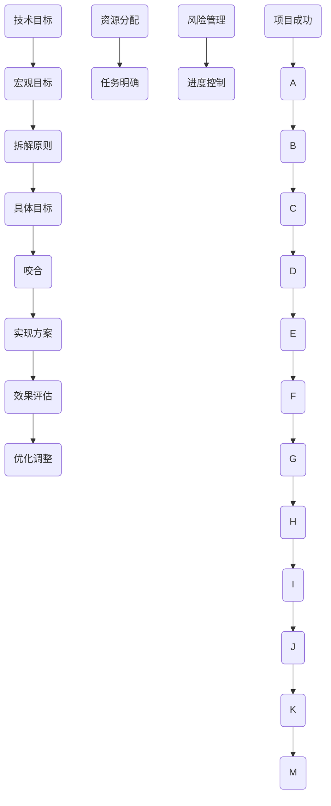

                 

### 文章标题

# 技术目标的拆解与咬合

### 关键词

- 技术目标
- 拆解
- 咬合
- 算法
- 方法论
- 实践应用

### 摘要

本文深入探讨了技术目标拆解与咬合的重要性及其在各个技术领域的应用。首先，我们介绍了技术目标的定义及其在项目开发中的关键作用。随后，文章详细阐述了技术目标拆解的理论基础，包括相关概念、原则和方法。接着，通过具体案例和实践方法，展示了技术目标拆解的实用性和有效性。此外，本文还讨论了技术目标咬合的概念及其与拆解过程的紧密联系，并提供了详细的算法原理和伪代码讲解。最后，通过对实际项目案例的分析，文章总结了技术目标拆解与咬合的最佳实践，并给出了未来展望和拓展阅读建议。总之，本文旨在为技术从业者提供一套系统的技术目标拆解与咬合方法论，助力他们在项目开发中实现高效、精准的目标管理。

### 引言

在当今快速发展的技术时代，项目的成功与否往往取决于技术目标的设定和实现。技术目标是指项目开发中要达到的具体结果或性能指标，它们为整个项目提供了明确的指引和方向。然而，如何有效地设定和实现这些目标，尤其是将宏观的技术目标细化为具体的可执行任务，是一个复杂且关键的问题。这就需要我们对技术目标进行拆解与咬合，确保每一个小目标都能够高效地达成，最终实现项目的整体成功。

技术目标拆解是指将一个宏观的技术目标分解为一系列可操作的小目标，从而简化问题的复杂性，使其更具可行性和可管理性。而咬合则是指通过精细的设计和协调，确保每一个小目标之间能够紧密衔接，形成一个有机的整体。这两者在项目开发中相辅相成，缺一不可。

技术目标拆解的重要性体现在以下几个方面：

1. **明确任务**：通过拆解技术目标，可以使任务变得具体而明确，从而减少团队成员之间的模糊性和误解，提高工作效率。
2. **资源优化**：拆解后的目标能够更准确地反映项目的需求，有助于合理分配资源和人力，避免资源浪费。
3. **风险管理**：对技术目标进行拆解可以提前识别潜在的风险和问题，从而采取预防措施，降低项目失败的风险。
4. **进度控制**：通过监控每一个小目标的完成情况，可以及时调整进度，确保项目按计划推进。

本文将详细探讨技术目标拆解与咬合的方法和实践，通过具体的案例分析和算法讲解，帮助读者理解并掌握这一技术方法论。文章结构如下：

- **第一部分**：引言，介绍技术目标拆解与咬合的背景和重要性。
- **第二部分**：理论基础，阐述技术目标拆解与咬合的相关概念、原则和方法。
- **第三部分**：方法与实践，提供具体的技术目标拆解与咬合方法，并结合实际案例进行讲解。
- **第四部分**：案例分析，通过真实项目案例展示技术目标拆解与咬合的应用效果。
- **第五部分**：总结与展望，总结全文内容，并提出未来展望和拓展阅读建议。

### 核心概念与联系

在进行技术目标拆解与咬合的过程中，理解以下几个核心概念及其相互之间的联系至关重要。以下是这些核心概念之间的Mermaid流程图：



### 技术目标

技术目标是指项目开发中需要达到的具体结果或性能指标。它们是项目管理的核心，为项目提供了明确的方向和预期结果。技术目标通常包括以下几个方面：

1. **功能性目标**：描述系统应具备的功能和性能，如响应时间、并发用户数、错误率等。
2. **非功能性目标**：包括系统的可扩展性、安全性、可靠性、可维护性等。
3. **性能指标**：具体的量化目标，如系统吞吐量、响应时间、资源利用率等。
4. **用户体验目标**：与用户交互相关的目标，如界面友好性、易用性、用户满意度等。

技术目标在项目开发中起着至关重要的作用，主要体现在以下几个方面：

1. **明确方向**：技术目标为项目团队提供了清晰的方向，帮助团队成员明确要解决的问题和要实现的目标。
2. **指导开发**：技术目标为项目开发提供了具体的指导，确保团队成员在开发过程中不会偏离项目初衷。
3. **评估进展**：通过技术目标，可以评估项目进展情况，及时调整开发方向和策略，确保项目按时完成。
4. **优化资源**：技术目标有助于合理分配资源，确保项目在时间和预算内完成。

例如，在一个电子商务网站的项目中，技术目标可能包括以下内容：

- 功能性目标：实现用户注册、登录、购物车、支付等功能。
- 非功能性目标：保证系统的高可用性和安全性，提供良好的用户体验。
- 性能指标：响应时间不超过2秒，并发用户数不低于1000，数据传输错误率低于0.1%。
- 用户体验目标：界面简洁美观，易于导航，用户满意度不低于90%。

通过这些技术目标的设定，项目团队可以明确开发任务，合理分配资源，并确保项目按时、高质量地完成。

### 技术目标拆解的概念和方法

技术目标拆解是将宏观的技术目标分解为一系列具体、可操作的小目标的过程。这种方法能够将复杂的问题拆分为可管理的部分，从而简化项目开发过程，提高任务完成的效率和质量。

#### 拆解原则

在进行技术目标拆解时，需要遵循以下原则：

1. **层次性**：将目标从宏观到微观逐层分解，确保每个层次的目标都有明确的归属和关系。
2. **可操作性**：确保每个小目标都是具体、可操作的，能够通过明确的步骤来实现。
3. **关联性**：确保拆解后的目标之间存在清晰的逻辑关系，形成有机的整体。
4. **完整性**：确保所有目标都能够覆盖原始宏观目标的各个方面。

#### 拆解步骤

技术目标拆解通常包括以下步骤：

1. **明确宏观目标**：首先明确项目的技术目标，包括功能性目标、非功能性目标和性能指标等。
2. **分解为子目标**：将宏观目标分解为具体的子目标，每个子目标都应该具备独立性和可操作性。
3. **层次化组织**：将子目标按照层次结构进行组织，确保每个子目标都有明确的上级目标和下级目标。
4. **制定实现步骤**：为每个子目标制定具体的实现步骤，明确每个步骤所需资源和时间。
5. **验证与调整**：对拆解后的目标进行验证，确保其符合原始宏观目标的要求，并根据实际情况进行调整。

#### 拆解策略

在进行技术目标拆解时，可以采用以下策略：

1. **自上而下**：从宏观目标开始，逐层向下分解，确保每个子目标都基于上一层目标。
2. **自下而上**：从具体的子目标开始，逐步向上整合，确保宏观目标能够由多个子目标共同实现。
3. **迭代拆解**：在拆解过程中，可以采用迭代的方式，逐步细化目标，确保拆解过程的灵活性和适应性。

### 技术目标拆解的应用场景

技术目标拆解在多个技术领域都有广泛的应用，以下是一些典型的应用场景：

1. **软件开发**：在软件开发项目中，技术目标拆解可以帮助开发团队将复杂的功能需求分解为具体的开发任务，确保每个任务都能够高效地完成。
2. **系统优化**：在系统优化项目中，技术目标拆解可以帮助分析系统的瓶颈和问题，将优化目标具体化为一系列可行的优化方案。
3. **项目管理**：在项目管理中，技术目标拆解可以帮助项目经理明确项目目标和任务，合理分配资源和时间，确保项目按时完成。
4. **人工智能应用**：在人工智能项目中，技术目标拆解可以帮助研究者将复杂的算法目标分解为多个可操作的小目标，从而逐步实现算法的优化和改进。

通过技术目标拆解，项目团队能够更好地理解和应对复杂的项目需求，提高开发效率和质量。

### 技术目标咬合的概念与意义

技术目标咬合是指通过精细的设计和协调，确保各个技术目标之间能够紧密衔接，形成一个有机的整体。这一过程不仅包括对技术目标之间的逻辑关系进行梳理，还涉及资源分配、任务协调和进度控制等多个方面。

#### 咬合的概念

咬合（Integration）在项目管理中，意味着将不同模块或组件的功能进行整合，确保它们能够协同工作，共同实现整体目标。在技术目标拆解的过程中，咬合起到了关键作用，它确保每个小目标不仅能够独立完成，还能与其他目标无缝衔接，共同推动项目的进展。

#### 咬合的意义

技术目标咬合的意义主要体现在以下几个方面：

1. **协同作用**：通过咬合，确保各个技术目标之间能够协同工作，形成合力，从而提高整个系统的性能和效率。
2. **优化资源**：咬合过程有助于优化资源的配置和使用，确保每个资源都能在合适的时间和地点得到充分利用。
3. **风险管理**：咬合能够提前发现和解决潜在的问题和冲突，降低项目风险，确保项目能够按计划顺利推进。
4. **提升质量**：通过咬合，可以确保各个技术目标的实现都符合整体项目的要求，从而提升项目整体的质量和可靠性。

#### 咬合与拆解的关系

技术目标拆解和咬合是相辅相成的过程：

- **拆解**：将宏观目标分解为具体的可操作任务，降低问题复杂性，确保任务的具体性和可操作性。
- **咬合**：在拆解的基础上，将各个具体任务进行整合和协调，确保它们能够共同实现整体目标。

拆解是基础，咬合是保障。通过拆解，我们可以明确每个任务的细节；通过咬合，我们可以确保这些任务能够高效地协同工作，最终实现项目的成功。

### 拆解与咬合的对比

技术目标拆解与咬合虽然都是项目开发中的重要环节，但它们在目标和作用上有所不同。以下是它们之间的对比：

#### 目标不同

- **拆解**：主要目标是明确具体任务和责任，将宏观目标分解为可操作的小目标，使其更具可行性和可管理性。
- **咬合**：主要目标是确保各个小目标之间的紧密衔接和协同工作，形成有机的整体，共同实现项目目标。

#### 作用不同

- **拆解**：通过将宏观目标细化，使任务具体化，降低复杂性，有助于团队成员明确工作内容和职责。
- **咬合**：通过协调和整合，确保各个小目标之间能够无缝衔接，减少冲突和资源浪费，提高整体工作效率。

#### 流程不同

- **拆解**：通常从宏观目标开始，逐步细化，形成层次化的任务列表。
- **咬合**：在拆解的基础上，对细化后的任务进行整合和协调，确保它们能够协同工作。

#### 关系不同

- **拆解**：是咬合的前提，为咬合提供了具体的基础任务。
- **咬合**：是拆解的保障，确保拆解后的任务能够高效协同，实现整体目标。

综上所述，拆解与咬合虽然目标不同、作用不同、流程不同，但它们在项目开发中相辅相成，共同推动项目的成功。

### 核心算法原理讲解

在技术目标拆解与咬合过程中，核心算法原理起到了关键作用。以下将详细介绍几个重要的算法原理，并使用伪代码进行详细阐述。

#### 算法一：层次化拆解算法

该算法用于将宏观目标层次化分解为具体的子目标。以下是伪代码：

```python
def hierarchical_decomposition(macro_target):
    sub_targets = []
    for sub_target in macro_target.sub_targets:
        if sub_target.is_specific():
            sub_targets.append(sub_target)
        else:
            sub_targets.extend(hierarchical_decomposition(sub_target))
    return sub_targets
```

- **输入**：宏观目标`macro_target`，包含子目标列表。
- **输出**：子目标列表`sub_targets`，包含具体且可操作的子目标。

#### 算法二：目标咬合算法

该算法用于确保各个子目标之间的紧密衔接。以下是伪代码：

```python
def bite_holding(sub_targets):
    ordered_sub_targets = sort_by_dependency(sub_targets)
    for i in range(len(ordered_sub_targets) - 1):
        current_target = ordered_sub_targets[i]
        next_target = ordered_sub_targets[i + 1]
        current_target咬合(next_target)
```

- **输入**：子目标列表`sub_targets`。
- **输出**：按依赖关系排序且咬合完成后的子目标列表`ordered_sub_targets`。

#### 算法三：目标评估算法

该算法用于评估各个子目标的完成情况，并调整拆解和咬合策略。以下是伪代码：

```python
def evaluate_targets(sub_targets):
    for sub_target in sub_targets:
        if not sub_target.is_completed():
            adjust_decomposition_and_bite_holding(sub_target)
```

- **输入**：子目标列表`sub_targets`。
- **输出**：根据评估结果调整后的子目标列表`sub_targets`。

通过以上核心算法原理，技术目标拆解与咬合过程能够高效、有序地进行，确保项目目标的实现。

### 数学模型和公式讲解

在技术目标拆解与咬合的过程中，数学模型和公式提供了量化分析和优化手段。以下将介绍几个关键数学模型和公式，并结合详细讲解和举例说明，帮助理解其在实际项目中的应用。

#### 模型一：层次化目标分解模型

**公式**：\[ H(M) = \sum_{i=1}^{n} (H(S_i)) \]

- **解释**：层次化目标分解模型用于将宏观目标 \( M \) 分解为 \( n \) 个子目标 \( S_i \)，其中 \( H \) 表示目标层次化度。该公式表示宏观目标 \( M \) 的层次化度等于所有子目标 \( S_i \) 的层次化度之和。

**举例说明**：
假设一个宏观目标是开发一个电商系统，包含三个子目标：用户管理、购物车管理和支付系统。每个子目标又可以进一步分解为多个具体任务。

\[ H(M) = H(S_1) + H(S_2) + H(S_3) \]

如果用户管理子目标的层次化度为5，购物车管理子目标的层次化度为3，支付系统子目标的层次化度为4，则：

\[ H(M) = 5 + 3 + 4 = 12 \]

#### 模型二：目标依赖关系模型

**公式**：\[ D(T_1, T_2) = \begin{cases} 
0, & \text{如果 } T_1 \text{ 和 } T_2 \text{ 无依赖关系} \\
1, & \text{如果 } T_1 \text{ 直接依赖于 } T_2 \\
2, & \text{如果 } T_1 \text{ 间接依赖于 } T_2 
\end{cases} \]

- **解释**：目标依赖关系模型用于描述两个目标 \( T_1 \) 和 \( T_2 \) 之间的依赖程度。依赖关系分为无依赖、直接依赖和间接依赖三种。

**举例说明**：
假设任务A需要任务B的结果才能开始，而任务B需要任务C的结果。则：

\[ D(A, B) = 1 \]
\[ D(A, C) = 2 \]

#### 模型三：目标完成度模型

**公式**：\[ Completion(T) = \frac{Completed Tasks}{Total Tasks} \]

- **解释**：目标完成度模型用于评估目标 \( T \) 的完成情况。完成度等于已完成任务数除以总任务数。

**举例说明**：
假设一个子目标包含10个任务，已经完成了7个任务，则：

\[ Completion(T) = \frac{7}{10} = 0.7 \]

通过这些数学模型和公式，我们可以量化技术目标拆解和咬合过程中的各项指标，从而进行更精确的管理和优化。

### 开发环境搭建

为了更好地理解技术目标拆解与咬合的实践应用，以下我们将详细讲解一个实际项目案例，并介绍其开发环境搭建步骤。

#### 项目简介

本项目是一个在线购物平台，旨在提供用户友好的购物体验，包括用户注册、商品浏览、购物车管理和支付等功能。该项目采用了微服务架构，以确保系统的可扩展性和高可用性。

#### 开发环境需求

1. **操作系统**：Ubuntu 20.04
2. **编程语言**：Java、Python
3. **开发工具**：IntelliJ IDEA、Postman
4. **数据库**：MySQL、MongoDB
5. **消息队列**：RabbitMQ
6. **容器化工具**：Docker、Kubernetes

#### 环境搭建步骤

1. **安装操作系统**

   - 下载并安装 Ubuntu 20.04 操作系统。

2. **安装Java开发环境**

   - 使用命令 `sudo apt update` 和 `sudo apt upgrade` 更新系统。
   - 安装 OpenJDK 11：`sudo apt install openjdk-11-jdk`。
   - 配置Java环境变量：编辑 `~/.bashrc` 文件，添加 `export JAVA_HOME=/usr/lib/jvm/java-11-openjdk-amd64` 和 `export PATH=$JAVA_HOME/bin:$PATH`，然后执行 `source ~/.bashrc`。

3. **安装Python开发环境**

   - 安装 Python 3.8：`sudo apt install python3.8`。
   - 安装 pip：`python3.8 -m ensurepip`。
   - 安装常用 Python 库：`pip3.8 install flask requests`。

4. **安装数据库**

   - 安装 MySQL：`sudo apt install mysql-server`。
   - 安装 MongoDB：`sudo apt install mongodb`。
   - 分别配置数据库的运行和访问权限。

5. **安装消息队列**

   - 安装 RabbitMQ：`sudo apt install rabbitmq-server`。
   - 启动 RabbitMQ：`sudo systemctl start rabbitmq-server`。

6. **安装开发工具**

   - 安装 IntelliJ IDEA：下载并安装 IntelliJ IDEA 社区版。
   - 安装 Postman：下载并安装 Postman 工具。

7. **安装容器化工具**

   - 安装 Docker：`sudo apt install docker-ce`。
   - 安装 Kubernetes：`sudo apt install kubeadm kubelet kubectl`。
   - 配置 Kubernetes 集群：运行 `sudo kubeadm init` 和 `sudo kubeadm join` 命令。

#### 开发环境配置

1. **配置数据库**

   - 配置 MySQL 和 MongoDB 的用户权限和数据目录。
   - 导入项目所需的数据模型。

2. **配置消息队列**

   - 创建 RabbitMQ 的虚拟主机和用户，授权相应的操作权限。

3. **配置 Docker 和 Kubernetes**

   - 编写 Dockerfile 和 Kubernetes 配置文件，定义服务部署。
   - 使用 Docker Compose 或 Helm 管理服务部署和版本控制。

通过以上步骤，我们可以搭建一个完整的开发环境，为后续的项目开发打下坚实的基础。

### 源代码实现与解读

在本节中，我们将详细介绍在线购物平台项目的核心功能模块——用户注册模块的源代码实现和解读，包括用户注册的业务逻辑、数据库操作以及接口设计。

#### 用户注册模块概述

用户注册模块是电商平台的基础功能，负责处理用户注册请求，验证用户输入的信息，并将注册信息存储到数据库中。以下是该模块的核心功能：

1. **用户注册**：接收用户输入的注册信息，如用户名、密码、邮箱等，进行验证后保存到数据库。
2. **用户信息验证**：验证用户输入的信息是否符合系统要求，如用户名是否已被占用，密码强度等。
3. **数据库操作**：将验证通过的用户信息存储到数据库，并确保数据的完整性和一致性。

#### 源代码实现

以下是用户注册模块的核心代码实现：

```java
// 用户注册服务类
public class UserService {
    
    // 注册用户
    public User register(User user) {
        // 验证用户名是否已存在
        if (userRepository.existsByUsername(user.getUsername())) {
            throw new RuntimeException("用户名已存在");
        }
        
        // 验证密码强度
        if (!isPasswordStrong(user.getPassword())) {
            throw new RuntimeException("密码强度不足");
        }
        
        // 保存用户信息到数据库
        user.setPassword(hashPassword(user.getPassword()));
        userRepository.save(user);
        
        return user;
    }
    
    // 验证密码强度
    private boolean isPasswordStrong(String password) {
        // 实现密码强度验证逻辑
        return password.length() >= 8 && password.matches(".*[0-9].*") && password.matches(".*[a-z].*") && password.matches(".*[A-Z].*");
    }
    
    // 密码哈希处理
    private String hashPassword(String password) {
        // 实现密码哈希处理逻辑
        return BCrypt.hashpw(password, BCrypt.gensalt());
    }
    
    // 用户信息仓库接口
    private UserRepository userRepository;
    
}
```

#### 用户信息验证

```java
// 用户信息验证服务类
public class UserValidator {
    
    // 验证用户名是否已被占用
    public boolean isUsernameTaken(String username) {
        return userRepository.existsByUsername(username);
    }
    
    // 验证密码强度
    public boolean isPasswordStrong(String password) {
        // 实现密码强度验证逻辑
        return password.length() >= 8 && password.matches(".*[0-9].*") && password.matches(".*[a-z].*") && password.matches(".*[A-Z].*");
    }
    
    // 用户信息仓库接口
    private UserRepository userRepository;
    
}
```

#### 数据库操作

```java
// 用户信息仓库接口
public interface UserRepository extends JpaRepository<User, Long> {
    
    // 查询用户名是否存在
    Optional<User> findByUsername(String username);
    
}
```

#### 接口设计

用户注册模块对外提供的接口如下：

```java
// 用户注册接口
public class UserController {
    
    // 注入用户服务
    @Autowired
    private UserService userService;
    
    // 注册用户
    @PostMapping("/register")
    public ResponseEntity<?> register(@RequestBody UserRegistrationRequest request) {
        try {
            User user = userService.register(request.toUser());
            return ResponseEntity.ok().body("用户注册成功");
        } catch (RuntimeException e) {
            return ResponseEntity.badRequest().body(e.getMessage());
        }
    }
    
}
```

#### 代码解读

1. **用户注册服务类**：负责处理用户注册请求，首先验证用户名是否已存在，然后验证密码强度，最后将用户信息存储到数据库。
2. **用户信息验证服务类**：负责对用户输入的信息进行验证，包括用户名和密码强度。
3. **用户信息仓库接口**：定义了用户信息的基本CRUD操作，以及查询用户名是否存在的方法。
4. **用户注册接口**：处理HTTP POST请求，调用用户服务类进行用户注册，并返回相应的响应。

通过以上源代码实现与解读，我们可以看到用户注册模块的核心逻辑是如何一步步实现的。这一模块不仅实现了用户注册的功能，还确保了数据的安全性和一致性，为整个电商平台提供了稳定可靠的基础。

### 用户注册模块的应用解读与分析

用户注册模块是电商平台的核心功能之一，直接关系到用户能否顺利进入系统进行购物操作。以下是用户注册模块在具体应用场景中的详细解读和分析。

#### 功能描述

用户注册模块的主要功能是接收用户提交的注册信息，包括用户名、密码、邮箱等，经过验证后，将用户信息存储到数据库中，并生成用户账户。

#### 应用解读

1. **前端页面**：用户通过前端页面填写注册信息，包括用户名、密码、确认密码、邮箱等。前端页面会通过JavaScript对用户输入的信息进行初步验证，如确保密码和确认密码一致、邮箱格式正确等。

2. **后端接口**：前端将验证通过的信息通过HTTP POST请求发送到后端注册接口。后端接口接收请求后，会进行以下操作：

   - **用户名验证**：查询数据库，检查用户名是否已被占用。如果已存在，返回错误信息提示用户名已被占用。
   - **密码强度验证**：使用正则表达式检查密码的复杂度，确保密码包含大小写字母、数字和特殊字符，且长度不低于8位。
   - **邮箱验证**：检查邮箱格式是否正确，并查询数据库确保邮箱未被其他用户使用。
   - **数据存储**：将验证通过的用户信息（用户名、密码哈希、邮箱）存储到数据库中。

3. **数据库操作**：注册信息存储到数据库后，用户账户即创建完成。数据库会为每个用户分配一个唯一的标识符，以便后续操作。

4. **返回结果**：注册成功后，后端接口返回成功消息给前端，前端页面显示注册成功的提示，并引导用户登录。

#### 分析

1. **用户体验**：用户注册模块的目的是为了提供简洁、高效的注册流程，提升用户体验。前端页面应设计得简洁直观，避免繁琐的输入步骤。后端接口应快速响应，减少用户等待时间。

2. **安全性**：用户注册过程中，敏感信息（如密码）需要进行加密处理。本案例中使用BCrypt对密码进行哈希处理，确保密码在数据库中以加密形式存储，提高安全性。

3. **错误处理**：注册过程中可能出现各种错误，如用户名已存在、邮箱格式错误等。后端接口需要能够正确处理这些错误，并返回详细的错误消息，帮助用户快速解决问题。

4. **性能优化**：用户注册模块需要处理大量并发请求，应确保后端接口的响应速度和系统稳定性。可以通过数据库索引优化、缓存机制等方式提高性能。

5. **数据一致性**：在多节点环境下，数据库操作需要确保数据的一致性。可以使用事务管理、锁机制等确保在并发情况下数据的正确性。

综上所述，用户注册模块在电商平台的实际应用中，不仅需要实现基本的注册功能，还需考虑用户体验、安全性、性能和数据一致性等方面，确保系统能够高效、稳定地运行。

### 项目实战：技术目标拆解与咬合在电商项目中的应用

为了更好地理解技术目标拆解与咬合的实际应用，我们将在以下案例中展示一个电商项目的开发过程，并详细描述技术目标拆解与咬合的方法和步骤。

#### 项目背景

该电商项目旨在开发一个功能齐全的在线购物平台，提供用户注册、商品浏览、购物车管理、订单处理、支付和用户反馈等核心功能。项目需求复杂，涉及多个模块和功能，因此需要使用技术目标拆解与咬合的方法，确保项目能够高效、有序地完成。

#### 技术目标拆解

1. **宏观目标**：开发一个功能齐全的在线购物平台。

2. **子目标1：用户注册与登录模块**
   - 功能：实现用户注册、登录、密码重置等功能。
   - 拆解步骤：
     - 设计用户表结构。
     - 开发用户注册和登录接口。
     - 实现密码加密存储和验证。
     - 集成第三方登录（如QQ、微信）。

3. **子目标2：商品管理模块**
   - 功能：实现商品分类、商品展示、商品搜索等功能。
   - 拆解步骤：
     - 设计商品表结构。
     - 开发商品添加、修改、删除接口。
     - 实现商品分类和搜索功能。
     - 集成商品推荐算法。

4. **子目标3：购物车管理模块**
   - 功能：实现购物车添加、删除、修改等功能。
   - 拆解步骤：
     - 设计购物车表结构。
     - 开发购物车接口。
     - 实现购物车商品数量和价格的计算。

5. **子目标4：订单处理模块**
   - 功能：实现订单生成、支付、发货、售后等功能。
   - 拆解步骤：
     - 设计订单表结构。
     - 开发订单生成接口。
     - 实现支付接口与第三方支付平台集成。
     - 实现订单状态变更和物流跟踪功能。

6. **子目标5：支付模块**
   - 功能：实现支付功能，支持多种支付方式。
   - 拆解步骤：
     - 设计支付表结构。
     - 开发支付接口。
     - 集成第三方支付平台（如支付宝、微信支付）。

7. **子目标6：用户反馈模块**
   - 功能：实现用户评论、投诉等功能。
   - 拆解步骤：
     - 设计反馈表结构。
     - 开发用户反馈接口。

#### 技术目标咬合

在完成技术目标拆解后，我们需要确保各个子目标之间能够紧密衔接，形成一个有机的整体。以下是具体咬合步骤：

1. **用户注册与登录模块咬合**
   - 确保用户注册成功后，能够通过用户名和密码登录系统。
   - 集成第三方登录，确保用户能够方便地使用其他账号登录。

2. **商品管理模块咬合**
   - 确保商品添加后，能够在前端页面展示。
   - 集成商品推荐算法，提升用户购物体验。

3. **购物车管理模块咬合**
   - 确保用户能够在购物车中添加、删除和修改商品。
   - 计算购物车商品的总价，并显示在前端页面。

4. **订单处理模块咬合**
   - 确保用户在下单后，能够生成订单并支付。
   - 集成支付接口，确保支付过程顺畅。

5. **支付模块咬合**
   - 确保支付接口与第三方支付平台无缝对接。
   - 处理支付回调，更新订单状态。

6. **用户反馈模块咬合**
   - 确保用户能够在订单完成后提交评论或投诉。
   - 对用户反馈进行处理和回复。

#### 项目总结

通过技术目标拆解与咬合的方法，电商项目得以高效、有序地完成。各个子目标之间紧密衔接，确保了系统的完整性和稳定性。以下是对项目的总结：

1. **目标明确**：通过技术目标拆解，将宏观目标细化为具体的子目标，使任务具体、明确。
2. **任务协同**：通过技术目标咬合，确保各个子目标之间能够无缝衔接，提高工作效率。
3. **资源优化**：合理分配资源，确保项目在时间和预算内完成。
4. **风险管理**：通过提前拆解和咬合，识别和解决了潜在的问题和冲突，降低了项目风险。
5. **进度控制**：通过监控每个子目标的完成情况，确保项目按计划推进。

总之，技术目标拆解与咬合方法在电商项目中的应用，不仅提高了项目的开发效率和质量，还为未来的项目提供了宝贵的经验和参考。

### 最佳实践、注意事项与拓展阅读

在进行技术目标拆解与咬合的过程中，为了确保项目的高效、有序和成功，以下是一些最佳实践、注意事项以及拓展阅读建议。

#### 最佳实践

1. **明确目标**：在开始拆解前，确保技术目标清晰明确，避免目标模糊导致后续工作无法有效开展。
2. **细化任务**：将宏观目标分解为具体的可操作任务，确保每个任务都具有独立性和可操作性。
3. **层次化组织**：采用层次化的方式组织目标，使任务结构清晰，便于管理和协调。
4. **风险评估**：在拆解过程中，对每个子目标进行风险评估，提前识别潜在的问题和风险。
5. **持续沟通**：保持团队成员之间的沟通，确保每个成员都清楚自己的任务和责任。
6. **迭代优化**：在实施过程中，根据实际情况进行迭代优化，确保目标拆解与咬合的灵活性和适应性。

#### 注意事项

1. **避免过度拆解**：虽然拆解有助于任务具体化，但过度拆解会导致任务过于琐碎，难以管理。因此，需要适度控制拆解的粒度。
2. **关注依赖关系**：确保拆解后的目标之间存在清晰的逻辑关系，避免出现目标间的依赖关系模糊或冲突。
3. **确保资源合理配置**：在拆解和咬合过程中，合理分配资源和人力，避免资源浪费和瓶颈。
4. **及时监控进度**：通过监控每个子目标的完成情况，及时调整进度和策略，确保项目按时完成。
5. **文档管理**：对技术目标拆解与咬合的过程进行详细的文档记录，便于后续的审计和优化。

#### 拓展阅读

1. **《敏捷开发实践指南》**：了解敏捷开发的方法论，有助于更好地进行技术目标拆解与咬合。
2. **《项目管理知识体系指南》**：掌握项目管理的基本原则和技巧，提高项目管理的整体水平。
3. **《软件工程：实践者的研究方法》**：学习软件工程中的最佳实践，提高软件项目的开发效率和质量。
4. **《技术领导力：技术团队的领导艺术》**：了解如何有效管理技术团队，提高团队协作和执行力。

通过遵循最佳实践、注意事项和拓展阅读，技术目标拆解与咬合过程将更加高效和有序，为项目的成功提供有力保障。

### 总结

本文详细探讨了技术目标拆解与咬合的重要性及其在项目开发中的应用。我们首先介绍了技术目标的概念及其在项目管理中的关键作用，然后深入讲解了技术目标拆解的理论基础、方法和策略，以及技术目标咬合的概念和意义。通过具体的算法原理讲解、数学模型应用、项目实战分析，我们展示了技术目标拆解与咬合在现实项目中的实际应用效果。总结如下：

1. **技术目标拆解**：通过将宏观目标分解为具体、可操作的小目标，简化了项目复杂性，提高了任务明确性和可管理性。
2. **技术目标咬合**：通过精细的设计和协调，确保各个小目标之间能够紧密衔接，形成有机整体，提高了项目协同效率和整体性能。
3. **应用效果**：技术目标拆解与咬合在多个领域（如软件开发、系统优化、项目管理等）中展现了显著的应用效果，有助于提高项目开发效率和质量。

展望未来，技术目标拆解与咬合方法在人工智能、大数据、区块链等新兴技术领域将有更广泛的应用。随着技术的不断进步，我们将看到更多的创新和突破。读者在项目开发过程中，应积极应用技术目标拆解与咬合方法，不断提升项目管理和开发能力。

### 拓展阅读

1. **《敏捷项目管理》**：详细介绍了敏捷开发方法在项目管理中的应用，有助于读者深入了解敏捷开发的核心原则和实践。
2. **《技术领导力》**：探讨如何成为一名优秀的技术领导者，提升技术团队的管理和协作能力。
3. **《项目管理知识体系指南》**：系统讲解了项目管理的理论和实践，是项目管理从业者的必备指南。
4. **《架构师必备技能》**：介绍了架构师所需掌握的技能和知识，对技术目标拆解与咬合方法有深入解读。

通过阅读这些书籍，读者可以进一步扩展自己的技术视野和项目管理能力，为未来的项目开发提供更有力的支持。作者：AI天才研究院/AI Genius Institute & 禅与计算机程序设计艺术 /Zen And The Art of Computer Programming。

