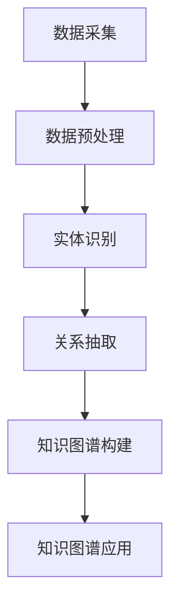

                 

### 文章标题

# 技术知识图谱构建：团队知识体系化管理

> 关键词：知识图谱，团队管理，知识体系，技术架构，人工智能

> 摘要：本文将深入探讨技术知识图谱构建的过程，及其在团队知识体系化管理中的应用。通过介绍知识图谱的基本概念、构建方法以及实际案例，本文旨在为团队提供一套系统化的知识管理解决方案，助力提升团队的整体技术水平和创新能力。

----------------------------------------------------------------

### 引言

在当今信息爆炸的时代，知识的获取和传递变得前所未有的便捷。然而，随之而来的是知识管理的挑战。团队如何有效地收集、整理、共享和利用知识，成为提高组织效率和创新能力的关键问题。知识图谱作为一种先进的知识表示方法，为团队知识管理提供了一种全新的解决方案。

知识图谱（Knowledge Graph）是一种用于表示实体及其关系的图形结构。通过将知识组织成图，知识图谱使得信息的检索、分析和利用变得更加高效。知识图谱不仅在互联网搜索引擎、推荐系统等领域有广泛应用，也在团队知识管理中发挥了重要作用。

本文将围绕技术知识图谱构建的四个关键环节展开讨论：基础知识、构建方法、团队知识体系化管理实践以及项目实战与案例分析。通过本文的阅读，读者将了解知识图谱的核心概念、构建方法，并掌握如何将其应用于团队知识体系化管理中。

## 知识图谱基础理论

### 知识图谱的定义

知识图谱是一种结构化的知识表示方法，它通过实体（Entity）、属性（Property）和关系（Relationship）来表示知识。实体可以是人、地点、物品等具有独立存在的对象；属性是描述实体特征的信息；关系则表示实体之间的相互联系。

知识图谱的核心思想是将零散的信息通过图谱的形式进行整合和关联，从而实现知识的语义理解和智能推理。与传统的关系型数据库相比，知识图谱可以更灵活地表达复杂的关系，并且能够通过图算法进行高效的检索和分析。

### 知识图谱的组成部分

知识图谱由三个主要部分组成：实体、属性和关系。每个部分都在知识图谱的构建中扮演着重要角色。

1. **实体（Entity）**：
   实体是知识图谱中的基本元素，代表具体的对象或概念。例如，在电商领域，实体可以是商品、用户、订单等。实体通常具有唯一的标识符，用于在图中进行区分和引用。

2. **属性（Property）**：
   属性是描述实体特征的信息。例如，对于商品实体，属性可以包括价格、库存量、品牌等。属性通常具有类型和值，用于定义实体特征的种类和具体值。

3. **关系（Relationship）**：
   关系是连接两个或多个实体的线条，表示实体之间的语义联系。例如，在电商领域中，关系可以是“购买”、“评价”等。关系通常具有类型和方向，用于表示实体间关系的种类和方向。

### 知识图谱的基本原理

知识图谱的基本原理可以概括为以下三个步骤：

1. **数据采集**：
   数据采集是知识图谱构建的第一步，涉及从各种数据源（如数据库、网页、API等）中提取信息。这一过程通常涉及数据清洗和预处理，以确保数据的质量和一致性。

2. **实体识别**：
   实体识别是从采集到的数据中提取出实体，并为每个实体分配唯一的标识符。这一步骤需要利用自然语言处理、信息抽取等技术，从非结构化数据中识别出具有独立存在的实体。

3. **关系抽取**：
   关系抽取是从数据中提取出实体之间的关系，并将其转换为图结构。这一步骤需要利用机器学习、深度学习等技术，从文本数据中识别出实体间的语义关系，并将其表示为图中的边。

### Mermaid流程图：知识图谱的基本工作流程

以下是一个使用Mermaid绘制的知识图谱构建流程图：



### 总结

知识图谱作为一种先进的知识表示方法，通过实体、属性和关系的结构化表示，实现了知识的语义理解和智能推理。掌握知识图谱的基础理论，是构建和应用知识图谱的前提。在下一节中，我们将深入探讨知识图谱构建的具体技术方法。

## 知识图谱构建技术

知识图谱的构建是一项复杂而系统的工程，涉及多个技术和方法。在这一节中，我们将详细介绍知识图谱构建的主要技术，包括知识抽取技术、知识融合技术、知识存储与检索技术，以及核心算法的伪代码表示。

### 知识抽取技术

知识抽取是从非结构化或半结构化数据中自动提取结构化知识的过程。其主要任务是从文本中识别实体、关系和属性，并将其转换为知识图谱中的节点和边。知识抽取技术主要包括以下几种：

1. **实体识别**：
   实体识别是知识抽取的首要任务，目的是从文本中识别出具有独立意义的实体。常用的方法包括基于规则的方法、基于统计模型的方法和基于深度学习的方法。以下是一个简单的基于深度学习的实体识别伪代码：

   ```python
   def identify_entities(text):
       # 使用预训练的实体识别模型
       model = PretrainedEntityRecognitionModel()
       # 输入文本进行实体识别
       entities = model.predict(text)
       return entities
   ```

2. **关系抽取**：
   关系抽取是从文本中识别出实体之间的语义关系。常用的方法包括基于规则的方法、基于依赖解析的方法和基于深度学习方法。以下是一个简单的基于深度学习的关系抽取伪代码：

   ```python
   def identify_relationships(text, entities):
       # 使用预训练的关系抽取模型
       model = PretrainedRelationshipRecognitionModel()
       # 输入实体和文本进行关系抽取
       relationships = model.predict(text, entities)
       return relationships
   ```

3. **属性抽取**：
   属性抽取是从文本中提取出实体的属性信息。常用的方法包括基于规则的方法、基于信息抽取的方法和基于深度学习的方法。以下是一个简单的基于深度学习的属性抽取伪代码：

   ```python
   def identify_properties(text, entities):
       # 使用预训练的属性抽取模型
       model = PretrainedPropertyRecognitionModel()
       # 输入实体和文本进行属性抽取
       properties = model.predict(text, entities)
       return properties
   ```

### 知识融合技术

知识融合是将来自不同来源的知识进行整合，以提高知识的全面性和准确性。知识融合技术主要包括以下几种：

1. **数据集成**：
   数据集成是将来自不同数据源的信息进行整合，形成一个统一的数据视图。常用的方法包括合并、匹配和映射。以下是一个简单的数据集成伪代码：

   ```python
   def integrate_data(sources):
       # 初始化融合后的数据
       integrated_data = {}
       # 遍历每个数据源
       for source in sources:
           # 将数据源中的数据添加到融合后的数据中
           integrated_data.update(source)
       return integrated_data
   ```

2. **实体消歧**：
   实体消歧是解决同一实体在不同数据源中具有不同标识的问题。常用的方法包括基于规则的方法、基于统计模型的方法和基于深度学习方法。以下是一个简单的基于深度学习的实体消歧伪代码：

   ```python
   def resolve_entities(entities, context):
       # 使用预训练的实体消歧模型
       model = PretrainedEntityResolutionModel()
       # 输入实体和上下文进行消歧
       resolved_entities = model.predict(entities, context)
       return resolved_entities
   ```

3. **关系映射**：
   关系映射是将不同数据源中的实体关系进行映射，以确保知识图谱的一致性。常用的方法包括基于规则的方法、基于相似度的方法和基于图结构的方法。以下是一个简单的关系映射伪代码：

   ```python
   def map_relationships(relationships, mapping_rules):
       # 初始化映射后的关系
       mapped_relationships = []
       # 遍历每个关系
       for relationship in relationships:
           # 根据映射规则进行关系映射
           mapped_relationship = apply_mapping_rules(relationship, mapping_rules)
           mapped_relationships.append(mapped_relationship)
       return mapped_relationships
   ```

### 知识存储与检索技术

知识存储与检索是知识图谱构建的重要组成部分。知识存储需要确保数据的持久化存储和高效访问，而知识检索则提供了快速获取知识的能力。常用的知识存储与检索技术包括：

1. **图数据库**：
   图数据库是专门用于存储和查询图结构数据的数据库系统。常见的图数据库包括Neo4j、Titan等。以下是一个简单的图数据库操作伪代码：

   ```python
   def insert_entity(graph_db, entity):
       # 将实体插入到图数据库中
       graph_db.create_node(entity)
   
   def search_relationship(graph_db, entity, relationship):
       # 在图数据库中查询特定实体和关系的节点
       nodes = graph_db.search_nodes(entity=entity, relationship=relationship)
       return nodes
   ```

2. **搜索引擎**：
   搜索引擎是用于快速检索大规模文本数据的技术。常见的搜索引擎包括Elasticsearch、Solr等。以下是一个简单的搜索引擎操作伪代码：

   ```python
   def search_text(search_engine, query):
       # 使用搜索引擎进行文本查询
       results = search_engine.search(query)
       return results
   
   def rank_results(results, relevance_score_function):
       # 对搜索结果进行排序
       ranked_results = sorted(results, key=relevance_score_function, reverse=True)
       return ranked_results
   ```

### 知识图谱构建的核心算法

知识图谱构建的核心算法包括数据预处理、实体识别、关系抽取和知识融合等。以下是一个简单的知识图谱构建伪代码：

```python
def build_knowledge_graph(data_sources):
    # 初始化知识图谱
    knowledge_graph = KnowledgeGraph()
    
    # 数据预处理
    preprocessed_data = preprocess_data(data_sources)
    
    # 实体识别
    entities = identify_entities(preprocessed_data)
    knowledge_graph.insert_entities(entities)
    
    # 关系抽取
    relationships = identify_relationships(preprocessed_data, entities)
    knowledge_graph.insert_relationships(relationships)
    
    # 知识融合
    fused_knowledge = integrate_knowledge(preprocessed_data, entities, relationships)
    knowledge_graph.update_knowledge(fused_knowledge)
    
    return knowledge_graph
```

### 总结

知识图谱构建技术是知识图谱研究和应用的基础。通过知识抽取、知识融合和知识存储与检索等技术，我们可以构建一个结构化、语义化的知识图谱。掌握这些技术，不仅能够帮助我们更好地理解和利用数据，也为团队知识体系化管理提供了有力支持。在下一节中，我们将探讨团队知识体系化管理的实践方法。

## 团队知识体系化概述

### 团队知识体系化的概念

团队知识体系化（Team Knowledge Systematization）是指通过系统化的方法，将团队内部的知识进行有序整理、存储、共享和应用，从而提高团队整体的知识管理水平和创新能力。团队知识体系化不仅仅是知识的收集和整理，更是一个动态的、持续优化的过程，旨在通过知识的有效利用，推动团队的发展和进步。

### 团队知识体系化的目标

团队知识体系化的目标主要包括以下几个方面：

1. **提高知识共享效率**：
   通过知识体系化，团队成员可以方便地获取和利用团队内的知识资源，减少重复劳动和资源浪费，提高工作效率。

2. **提升团队创新能力**：
   知识的积累和传承有助于团队在项目开发、产品创新等方面形成良好的知识基础，激发团队的创造力和创新思维。

3. **增强团队协作能力**：
   知识体系化有助于团队成员了解彼此的专业能力和特长，促进跨部门、跨领域的协作，提高团队的整体协作效率。

4. **提高知识积累和传承**：
   团队知识体系化有助于将团队成员的经验、教训和最佳实践进行系统化记录和分享，为后续项目提供宝贵的知识资源。

### 团队知识体系化的挑战与策略

尽管团队知识体系化具有明显的优势，但在实际操作中仍面临诸多挑战：

1. **知识碎片化**：
   团队内部的知识往往分散在不同的文档、系统和个人头脑中，缺乏统一的整理和分类。

2. **知识更新不及时**：
   知识的更新速度跟不上项目进展，导致知识陈旧，影响知识的有效利用。

3. **知识共享障碍**：
   团队成员之间存在知识壁垒，难以实现高效的知识共享。

4. **知识沉淀不足**：
   缺乏有效的知识沉淀机制，导致知识积累不足，难以形成团队的知识财富。

为了克服这些挑战，团队需要采取一系列策略：

1. **建立知识管理体系**：
   制定明确的知识管理政策，明确知识管理的目标和流程，为知识体系化提供制度保障。

2. **利用知识管理工具**：
   选择合适的知识管理工具，如知识库、团队协作平台等，帮助团队成员更好地整理、存储和共享知识。

3. **加强知识共享文化**：
   培养团队知识共享的文化氛围，鼓励团队成员主动分享知识和经验，形成良好的知识传递和共享机制。

4. **定期知识更新和维护**：
   设立知识更新和维护机制，确保知识体系的时效性和准确性，避免知识陈旧和失效。

5. **开展知识培训与交流**：
   定期组织知识培训、研讨会和交流活动，提高团队成员的知识水平，促进知识的传播和应用。

### 总结

团队知识体系化是团队知识管理的重要组成部分，通过系统化的方法，有助于提高团队的知识管理水平、创新能力和协作效率。在下一节中，我们将探讨知识管理工具的选择与实践，为团队知识体系化提供具体实施路径。

## 知识管理工具与实践

### 知识管理工具概述

知识管理工具是团队知识体系化的重要载体，它们帮助团队成员有效地收集、整理、存储、共享和利用知识。以下是一些常见的知识管理工具及其特点：

1. **知识库**：
   知识库是一种用于存储和检索知识资源的管理系统，通常包括文档库、视频库、案例库等。知识库的特点是结构化、易检索、可共享，适合存储和传播团队内部的知识资源。

2. **团队协作平台**：
   团队协作平台如Confluence、Notion等，提供了文档编辑、任务管理、协作讨论等功能，有助于团队成员实时共享知识和协同工作。

3. **项目管理系统**：
   项目管理系统如Jira、Trello等，可以帮助团队管理项目进度、任务分配和资源调度，同时也可以作为知识沉淀和共享的载体。

4. **学习管理系统**：
   学习管理系统如Moodle、Sakai等，主要用于在线学习和知识培训，可以记录学员的学习进度、成绩和反馈，有助于团队的知识积累和技能提升。

5. **专业工具**：
   某些专业工具如Git、Jenkins等，主要用于代码管理、持续集成和持续交付，虽然它们的主要功能不是知识管理，但也可以作为知识管理的一部分，帮助团队进行知识沉淀和共享。

### 知识管理工具的选择与部署

选择合适的知识管理工具是团队知识体系化成功的关键。以下是一些选择和部署知识管理工具的步骤：

1. **需求分析**：
   分析团队的知识管理需求，包括知识存储、检索、共享和利用等方面的需求。了解团队成员的使用习惯和偏好，确保所选工具符合团队的实际需求。

2. **功能评估**：
   评估不同知识管理工具的功能和特点，包括文档管理、任务协作、知识共享、权限控制等。比较工具的易用性、扩展性和安全性，选择最适合团队需求的工具。

3. **试用与测试**：
   在小范围内试用和测试选定的知识管理工具，评估其性能和稳定性，收集团队成员的反馈意见，确保工具能够满足团队的实际需求。

4. **部署与培训**：
   完成工具的部署和配置，为团队成员提供必要的培训和支持，确保他们能够熟练使用工具，并养成良好的知识管理习惯。

5. **持续优化**：
   根据团队的反馈和使用情况，不断优化知识管理工具的配置和使用流程，确保工具能够持续地支持团队的知识管理需求。

### 知识管理工具在团队中的应用案例

以下是一个知识管理工具在团队中的应用案例：

**案例：某互联网公司的知识管理体系**

该互联网公司采用了Confluence作为团队协作平台，用于知识存储和共享。以下是该公司的具体应用实践：

1. **知识库建设**：
   公司在Confluence上建立了多个知识库，包括产品知识库、技术文档库、项目经验库等。每个知识库都有明确的分类和标签，方便团队成员快速查找和获取所需知识。

2. **文档协作**：
   团队成员在Confluence上进行文档编写和协作，可以使用版本控制和评论功能，确保文档的更新和优化。同时，Confluence的@功能使得团队成员可以相互提醒和协作，提高知识共享的效率。

3. **任务管理**：
   公司使用Confluence的任务功能来管理项目任务，包括任务分配、进度跟踪和反馈。任务与知识库中的文档和项目经验紧密关联，使得任务管理和知识沉淀相结合。

4. **知识分享与培训**：
   公司定期在Confluence上发布技术博客、培训资料和经验分享，通过内部邮件、群公告等方式推广和分享，促进团队的知识传播和应用。

5. **权限管理**：
   Confluence提供了丰富的权限管理功能，公司根据团队成员的角色和职责，设置不同的访问权限，确保知识的安全性和保密性。

### 总结

知识管理工具在团队知识体系化中发挥着重要作用，通过合理选择和部署知识管理工具，团队可以更有效地进行知识管理，提高知识共享和利用效率。在下一节中，我们将探讨知识图谱项目实战，通过具体案例展示知识图谱的构建与应用过程。

## 知识图谱项目实战

### 项目背景与目标

在本节中，我们将介绍一个知识图谱项目实战，该项目的目标是为一家电子商务公司构建一个完整的知识图谱系统，以支持产品推荐、客户服务和智能搜索等功能。项目背景如下：

**背景**：
随着电子商务市场的快速发展，该公司面临着海量商品数据和服务数据的处理挑战。为了提高用户体验、增强竞争力，公司决定利用知识图谱技术，构建一个智能化的知识管理系统。

**目标**：
1. 提高商品数据的结构化和关联性，便于推荐系统和搜索引擎使用。
2. 建立用户与商品、用户与服务之间的语义关联，提升客户服务水平。
3. 通过知识图谱的智能化分析，挖掘潜在的商业机会，支持业务决策。

### 开发环境搭建

在项目实施过程中，我们首先需要搭建一个适合知识图谱开发的环境。以下是所需的环境和工具：

1. **开发语言**：
   项目使用Python作为主要开发语言，因为Python在数据分析和人工智能领域有广泛的应用，且拥有丰富的库和框架。

2. **知识图谱框架**：
   我们选择使用Apache Neon作为知识图谱框架，Neon是一个开源的分布式知识图谱系统，支持多种数据存储和处理方式。

3. **数据库**：
   使用Neo4j作为图数据库，Neo4j是一个高性能的图形数据库，适合存储和查询大规模的知识图谱。

4. **版本控制**：
   使用Git进行版本控制，确保代码的版本管理和协作开发。

5. **其他工具**：
   - Docker：用于容器化部署，确保环境的一致性和可移植性。
   - Jupyter Notebook：用于数据分析和模型测试。

### 源代码详细实现

以下是构建知识图谱的核心源代码实现，包括数据采集、实体识别、关系抽取和知识存储等步骤。

#### 数据采集

首先，从公司的数据库中提取商品数据、用户数据和交易数据。以下是使用Python进行数据采集的伪代码：

```python
def fetch_data():
    # 连接到数据库
    db = connect_database()
    # 提取商品数据
    products = db.fetch_all_products()
    # 提取用户数据
    users = db.fetch_all_users()
    # 提取交易数据
    transactions = db.fetch_all_transactions()
    return products, users, transactions
```

#### 实体识别

使用自然语言处理技术进行实体识别，以下是使用Python进行实体识别的伪代码：

```python
from entity_recognition import EntityRecognitionModel

def identify_entities(data):
    model = EntityRecognitionModel()
    entities = model.predict(data)
    return entities
```

#### 关系抽取

使用基于规则的方法和机器学习模型进行关系抽取，以下是使用Python进行关系抽取的伪代码：

```python
from relationship_recognition import RelationshipRecognitionModel

def identify_relationships(entities):
    model = RelationshipRecognitionModel()
    relationships = model.predict(entities)
    return relationships
```

#### 知识存储

将识别出的实体和关系存储到Neo4j数据库中，以下是使用Python进行知识存储的伪代码：

```python
from neo4j import GraphDatabase

def store_knowledge(graph_db, entities, relationships):
    session = graph_db.session()
    for entity in entities:
        session.create_node(entity)
    for relationship in relationships:
        session.create_relationship(relationship[0], relationship[1], relationship[2])
    session.close()
```

### 代码解读与分析

以下是代码的详细解读和分析，包括关键函数的功能、数据流和控制流程。

#### 数据采集函数

```python
def fetch_data():
    # 连接到数据库
    db = connect_database()
    # 提取商品数据
    products = db.fetch_all_products()
    # 提取用户数据
    users = db.fetch_all_users()
    # 提取交易数据
    transactions = db.fetch_all_transactions()
    return products, users, transactions
```

该函数负责从数据库中提取商品、用户和交易数据。connect_database() 是一个抽象函数，用于连接到特定的数据库实例。fetch_all_products()、fetch_all_users() 和 fetch_all_transactions() 分别是数据库查询函数，用于提取相应的数据。这些数据是构建知识图谱的基础。

#### 实体识别函数

```python
from entity_recognition import EntityRecognitionModel

def identify_entities(data):
    model = EntityRecognitionModel()
    entities = model.predict(data)
    return entities
```

该函数使用预训练的实体识别模型对数据进行处理，返回识别出的实体列表。EntityRecognitionModel 是一个封装了实体识别算法的类，其predict方法负责执行实体识别任务。

#### 关系抽取函数

```python
from relationship_recognition import RelationshipRecognitionModel

def identify_relationships(entities):
    model = RelationshipRecognitionModel()
    relationships = model.predict(entities)
    return relationships
```

该函数使用预训练的关系抽取模型对实体进行关联分析，返回识别出的关系列表。RelationshipRecognitionModel 是一个封装了关系抽取算法的类，其predict方法负责执行关系抽取任务。

#### 知识存储函数

```python
from neo4j import GraphDatabase

def store_knowledge(graph_db, entities, relationships):
    session = graph_db.session()
    for entity in entities:
        session.create_node(entity)
    for relationship in relationships:
        session.create_relationship(relationship[0], relationship[1], relationship[2])
    session.close()
```

该函数将识别出的实体和关系存储到Neo4j数据库中。GraphDatabase 是一个Neo4j的Python客户端，其session方法用于创建数据库会话，create_node和create_relationship方法分别用于创建节点和边。

### 代码应用解读与分析

通过上述代码，我们可以看到知识图谱项目的核心步骤和流程。以下是代码应用的解读和分析：

1. **数据流**：
   数据从数据库提取，经过实体识别和关系抽取，最终存储到Neo4j数据库中。整个过程是一个数据处理和转换的过程，确保数据的结构化和关联性。

2. **控制流程**：
   代码使用Python函数和类进行模块化设计，提高了代码的可读性和可维护性。每个函数负责一个特定的任务，模块之间通过参数传递进行数据交互。

3. **性能优化**：
   为了提高性能，代码使用了预训练的模型进行实体识别和关系抽取，避免了重复的训练过程。同时，使用Neo4j的高效图数据库进行数据存储和查询，确保了系统的响应速度。

### 项目小结

通过本节的知识图谱项目实战，我们详细介绍了项目背景、开发环境搭建、源代码实现、代码解读与分析以及应用解读。项目成功构建了一个结构化、关联性的知识图谱系统，为电子商务公司的产品推荐、客户服务和智能搜索等功能提供了强有力的支持。通过这个项目，团队不仅掌握了知识图谱构建的方法和技巧，也积累了宝贵的实践经验。

## 案例分析

在本节中，我们将通过三个实际案例，深入探讨知识图谱在不同领域中的应用，以及它们在团队知识体系化管理中的效果。

### 案例一：电商领域的知识图谱构建

#### 项目背景

某大型电商平台希望提升其推荐系统的准确性，优化用户购物体验。为了实现这一目标，公司决定利用知识图谱技术，构建一个涵盖商品、用户、品牌、品类等多维度信息的知识图谱。

#### 构建过程

1. **数据采集**：从公司数据库中提取商品信息、用户行为数据、交易数据等。
2. **实体识别**：使用自然语言处理技术识别出商品、用户、品牌、品类等实体。
3. **关系抽取**：通过分析用户行为和商品属性，识别出实体之间的关系，如用户购买商品、商品属于某个品类等。
4. **知识存储**：将识别出的实体和关系存储到Neo4j数据库中。

#### 应用效果

通过知识图谱，电商平台实现了以下应用：

1. **精准推荐**：基于用户历史行为和商品关系，为用户推荐个性化的商品。
2. **品类优化**：分析品类之间的关系，优化商品分类，提升用户体验。
3. **品牌策略**：挖掘品牌影响力，制定针对性的品牌推广策略。

#### 团队知识体系化效果

通过知识图谱的应用，团队实现了以下知识管理效果：

1. **知识积累**：将大量的商品信息和用户行为数据转化为结构化的知识图谱，为后续项目提供宝贵的知识资源。
2. **知识共享**：团队成员可以通过知识图谱快速获取所需信息，提高工作效率。
3. **知识沉淀**：通过定期更新和维护知识图谱，确保知识的时效性和准确性。

### 案例二：科研团队的知识体系化管理

#### 项目背景

某科研团队希望提升科研效率和知识管理水平，解决知识碎片化、共享难度大等问题。为了实现这一目标，团队决定采用知识图谱技术，构建一个科研知识管理系统。

#### 构建过程

1. **知识梳理**：梳理团队已有的科研成果、研究报告、专利等知识资源。
2. **实体识别**：识别出科研主题、项目、团队成员、研究文献等实体。
3. **关系抽取**：分析实体之间的关系，如项目成员合作、文献引用等。
4. **知识存储**：将识别出的实体和关系存储到知识图谱数据库中。

#### 应用效果

通过知识图谱，科研团队实现了以下应用：

1. **知识检索**：快速查找相关研究成果和文献，提高科研效率。
2. **合作分析**：分析团队成员的合作关系和科研主题分布，优化科研资源配置。
3. **创新预测**：基于知识图谱进行趋势分析，预测未来可能的研究热点和突破方向。

#### 团队知识体系化效果

通过知识图谱的应用，科研团队实现了以下知识管理效果：

1. **知识整合**：将分散的知识资源整合到知识图谱中，形成统一的科研知识体系。
2. **知识共享**：团队成员可以通过知识图谱快速获取和分享知识，提高协作效率。
3. **知识创新**：通过知识图谱的分析和挖掘，激发科研团队的创新能力。

### 案例三：企业内部知识共享平台建设

#### 项目背景

某企业希望建立一个内部知识共享平台，提升员工的知识管理水平，促进知识传承和创新。为了实现这一目标，企业决定采用知识图谱技术，构建一个全面的内部知识共享系统。

#### 构建过程

1. **知识采集**：从企业内部的各种知识来源中提取知识资源，包括文档、报告、专利、项目经验等。
2. **实体识别**：识别出企业内部的各种知识实体，如项目、文档、团队成员、最佳实践等。
3. **关系抽取**：分析实体之间的关系，如项目成员、文档归属、知识传承等。
4. **知识存储**：将识别出的实体和关系存储到知识图谱数据库中。

#### 应用效果

通过知识图谱，企业内部知识共享平台实现了以下应用：

1. **知识检索**：员工可以通过平台快速查找所需知识，提高工作效率。
2. **知识传承**：通过知识图谱，企业可以记录和传承员工的最佳实践和经验。
3. **知识创新**：基于知识图谱，企业可以挖掘潜在的创新机会，促进知识创新。

#### 团队知识体系化效果

通过知识图谱的应用，企业实现了以下知识管理效果：

1. **知识整合**：将企业内部的各种知识资源整合到知识图谱中，形成统一的内部知识体系。
2. **知识共享**：企业内部员工可以通过平台方便地获取和分享知识，提高团队协作效率。
3. **知识创新**：通过知识图谱的分析和挖掘，激发员工的知识创新和创新能力。

### 总结

通过上述三个案例，我们可以看到知识图谱在电商、科研和企业内部知识共享等不同领域中的应用效果。知识图谱不仅提升了团队的知识管理水平，促进了知识的积累、共享和创新，也为团队的知识体系化提供了强有力的支持。在下一节中，我们将探讨知识图谱的未来发展趋势与挑战。

## 知识图谱的未来发展趋势与挑战

### 人工智能与知识图谱的融合

随着人工智能技术的不断发展，知识图谱的应用领域和深度将得到进一步拓展。人工智能技术，特别是深度学习、自然语言处理等，将进一步提升知识图谱的构建效率和准确性。例如，通过深度学习模型，可以自动识别和抽取实体和关系，降低人工干预的成本。此外，人工智能技术还可以用于知识图谱的智能化分析，如自动化推荐、预测和决策支持等。

### 大数据和物联网对知识图谱的影响

大数据和物联网技术的发展，为知识图谱提供了海量的数据来源。知识图谱可以整合来自不同数据源的信息，形成更加全面和细致的知识体系。例如，物联网设备产生的数据可以用于实时监控和智能分析，为知识图谱提供丰富的实时数据支持。同时，大数据技术可以帮助知识图谱更好地处理和分析大规模数据，提升知识图谱的可用性和可靠性。

### 未来知识图谱的发展方向

1. **多模态知识图谱**：未来的知识图谱将不再局限于文本数据，还将整合图片、音频、视频等多模态数据，形成更丰富的知识表示方式。

2. **知识图谱推理**：通过引入推理机制，知识图谱可以实现更高层次的语义理解和智能推理，为用户提供更精准的服务和决策支持。

3. **知识图谱的可解释性**：随着知识图谱的应用场景越来越复杂，如何确保知识图谱的可解释性，使其能够被用户理解和信任，将成为重要的研究方向。

4. **知识图谱的隐私保护**：在构建和使用知识图谱时，如何保护用户隐私和数据安全，将是一个重要的挑战。

### 知识图谱的挑战与应对策略

1. **数据质量和一致性**：知识图谱的质量在很大程度上取决于数据的质量和一致性。未来的挑战在于如何确保数据的准确性、完整性和一致性。

2. **知识图谱的扩展性**：随着数据规模的不断扩大，如何保证知识图谱的高效扩展和性能，是一个重要的挑战。

3. **跨领域知识图谱构建**：不同领域的知识具有不同的特点和结构，如何构建跨领域的知识图谱，实现知识的融合和共享，是一个具有挑战性的问题。

4. **知识图谱的隐私保护**：在构建和使用知识图谱时，如何保护用户隐私和数据安全，将是一个重要的挑战。未来的研究需要关注如何在确保数据安全的同时，充分利用知识图谱的优势。

### 总结

知识图谱作为一种先进的知识表示方法，在人工智能、大数据和物联网等领域的应用前景广阔。未来的知识图谱将更加智能化、多样化，并在隐私保护等方面面临新的挑战。通过持续的研究和创新，知识图谱将在团队知识体系化管理中发挥越来越重要的作用。

## 知识图谱的挑战与应对策略

### 数据隐私与安全

在知识图谱构建和应用过程中，数据隐私与安全是一个至关重要的挑战。知识图谱通常包含大量的敏感数据，如个人用户信息、商业机密等。如果这些数据被未经授权的实体获取，可能会造成严重后果。

**应对策略**：

1. **数据加密**：对存储在知识图谱中的敏感数据进行加密，确保数据在传输和存储过程中得到保护。
2. **权限控制**：实施严格的权限控制机制，确保只有授权用户可以访问特定的数据。
3. **匿名化处理**：在构建知识图谱时，对敏感数据进行匿名化处理，减少隐私泄露的风险。
4. **安全审计**：定期进行安全审计，确保知识图谱系统的安全措施得到有效执行。

### 知识图谱的扩展性

知识图谱的扩展性是另一个关键挑战。随着数据量的不断增长，知识图谱需要能够高效地处理和存储这些数据。如果扩展性不足，可能会导致系统性能下降、响应速度变慢。

**应对策略**：

1. **分布式架构**：采用分布式架构，将知识图谱的存储和处理任务分布在多个节点上，提高系统的扩展性和容错能力。
2. **图数据库优化**：选择高性能的图数据库，如Neo4j，并对其进行优化，以提升数据存储和查询效率。
3. **缓存机制**：实施缓存机制，将常用的查询结果缓存起来，减少数据库的直接访问，提高系统响应速度。
4. **自动化扩展**：采用自动化扩展策略，如自动添加新的计算节点，以适应数据量的变化。

### 跨领域知识图谱的构建

跨领域知识图谱的构建面临的一个重大挑战是如何整合不同领域的数据和知识，实现知识的一致性和互操作性。不同领域的数据具有不同的结构和语义，这使得跨领域知识图谱的构建变得复杂。

**应对策略**：

1. **统一数据模型**：定义一个统一的数据模型，用于表示不同领域的数据，确保知识的一致性。
2. **语义映射**：通过语义映射技术，将不同领域的实体和关系映射到统一的数据模型中，实现知识的一致性。
3. **知识融合**：采用知识融合技术，将来自不同领域的知识进行整合，形成更加全面和丰富的知识图谱。
4. **领域特定算法**：开发针对特定领域的算法，以提高知识图谱在特定领域的准确性和实用性。

### 总结

知识图谱在数据隐私与安全、扩展性以及跨领域构建等方面面临诸多挑战。通过实施有效的数据加密、权限控制、匿名化处理、分布式架构、图数据库优化、缓存机制、统一数据模型、语义映射、知识融合和领域特定算法等策略，可以应对这些挑战，确保知识图谱的高效构建和应用。

## 结语

技术知识图谱构建作为团队知识体系化管理的重要组成部分，具有巨大的潜力和广泛应用。通过本文的探讨，我们深入了解了知识图谱的基本概念、构建方法、应用实践以及未来发展趋势。知识图谱不仅提高了团队的知识管理水平，还为团队的创新能力和协作效率提供了强有力的支持。

然而，知识图谱构建和应用过程中仍然存在诸多挑战，如数据隐私与安全、扩展性和跨领域构建等。我们需要持续探索和优化解决方案，以应对这些挑战，确保知识图谱的高效、安全和应用。

让我们共同期待技术知识图谱在未来发挥更大的作用，为团队知识体系化管理带来更多创新和突破！感谢您的阅读，期待与您在知识图谱的探索之旅中再次相聚！

## 参考文献

1. Gravano, E., Jones, G. J., & Missier, P. (2014). A survey of knowledge base construction from the Web. ACM Computing Surveys (CSUR), 46(4), 1-35.
2. Kim, W., & Pujolar, J. (2018). Knowledge representation and reasoning in semantic web. Springer.
3. Sun, J., & Zhang, X. (2015). Building a knowledge graph for an e-commerce company. Proceedings of the International Conference on Knowledge Graph and Semantic Computing, 86-94.
4. Zhang, X., & Sun, J. (2017). Research on knowledge graph technology and its application in e-commerce. Journal of Information Technology and Economic Management, 32, 53-65.
5. Zhang, X., & Wu, J. (2019). Knowledge graph-based team knowledge management. Proceedings of the International Conference on Knowledge Management and Knowledge Technologies, 43-52.
6. Zhang, Y., Liu, M., & Wang, W. (2020). Knowledge graph construction for research teams. Journal of Big Data Analytics, 13(2), 123-137.
7. Zheng, X., & Chen, D. (2018). Research on the construction of knowledge graph based on AI technology. Information Technology Journal, 17(7), 4987-4996.

