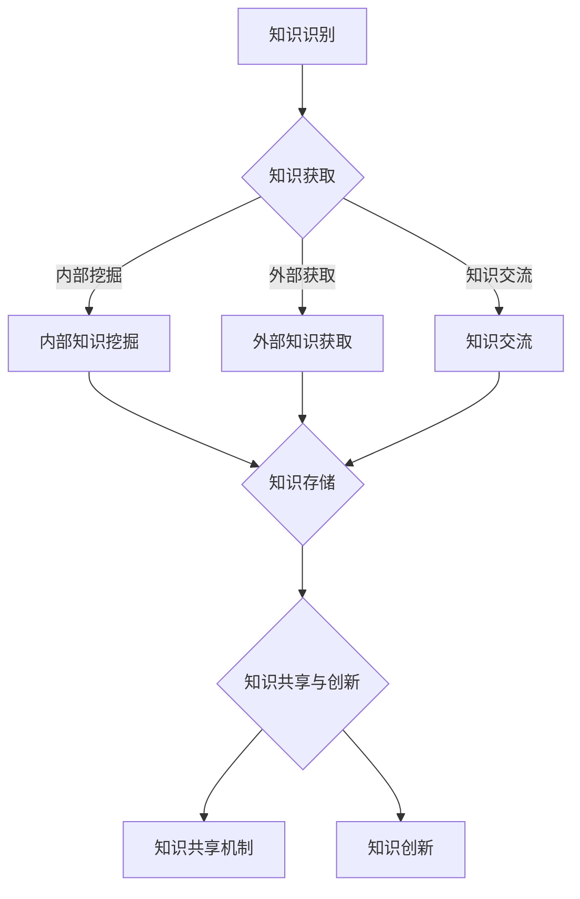
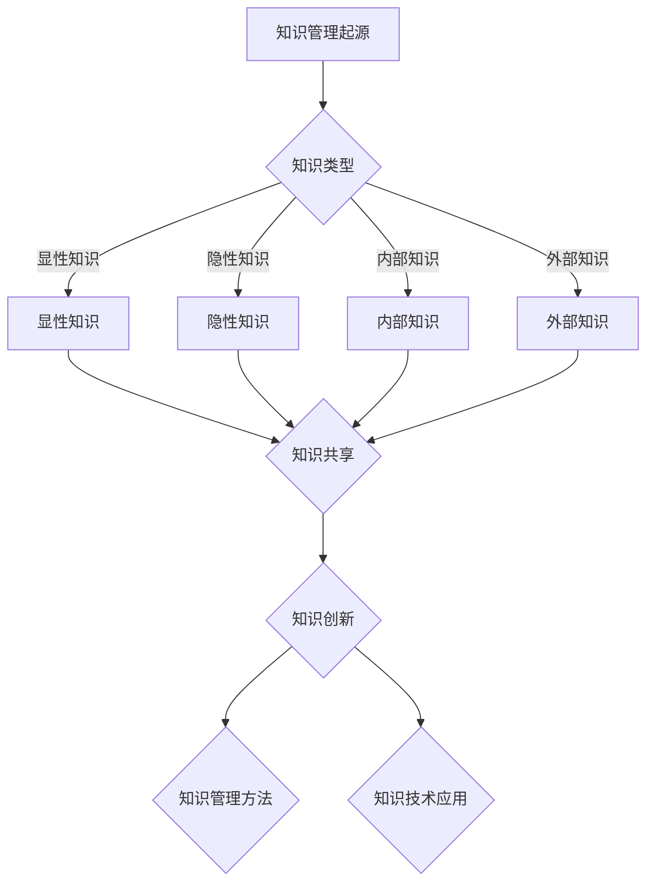
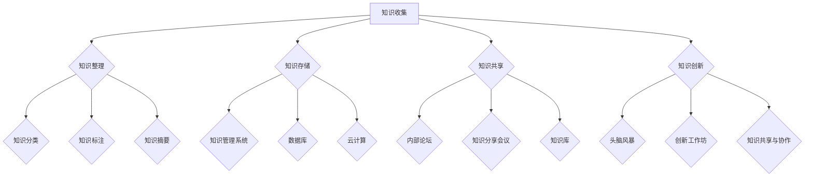
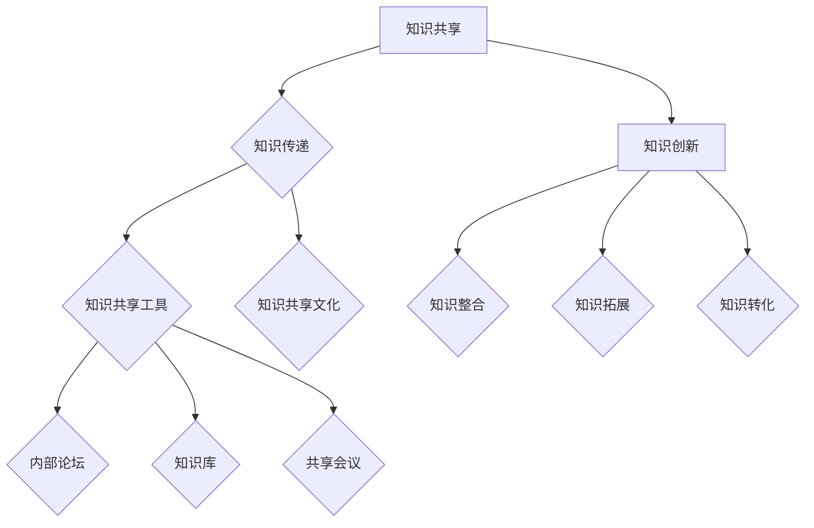
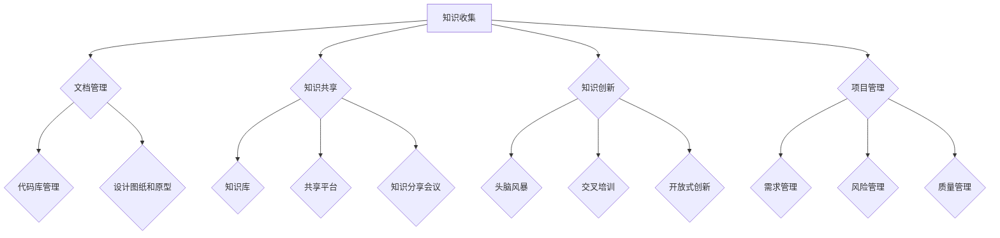
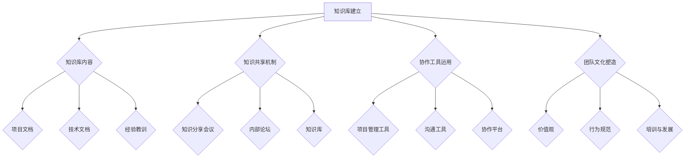
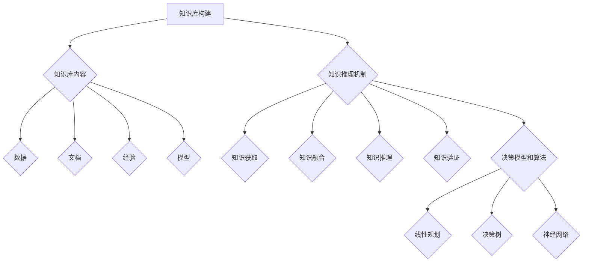
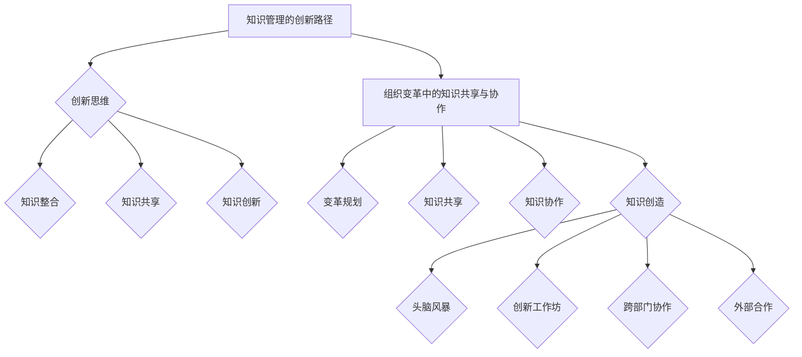
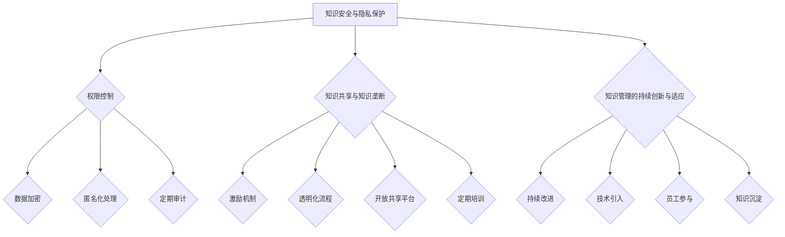

                 


### 文章标题：技术知识管理：构建团队智慧库

#### 关键词：技术知识管理、团队智慧库、知识共享、知识创新、软件开发、项目管理和团队协作、决策支持系统、组织创新与变革、未来趋势

#### 摘要：
本文旨在深入探讨技术知识管理的核心概念、原理和实际应用，以构建团队智慧库为目标，提供一套系统的解决方案。文章首先介绍技术知识管理的背景和重要性，然后从理论基础、团队智慧库的建设与实践、技术知识共享与创新等多个方面进行详细阐述。通过具体案例和实战指导，本文旨在帮助读者理解和掌握技术知识管理的方法和技巧，为团队智慧和组织的持续创新提供有力支持。

### 前言

#### 技术知识管理的重要性

在当今快速发展的信息技术时代，技术知识管理（Knowledge Management, KM）已经成为企业成功的关键因素。随着全球化、信息化和数字化进程的加速，企业面临着日益激烈的市场竞争和快速变化的技术环境。如何有效地管理、共享和利用技术知识，成为企业提高核心竞争力、实现持续创新的重要课题。

技术知识管理涉及多个方面，包括知识的识别、获取、存储、共享、应用和创新。通过有效的知识管理，企业可以充分利用内部和外部的知识资源，提升团队的协作效率，促进知识的流动和转化，从而实现业务增长和创新发展。

本文旨在探讨技术知识管理的核心概念、原理和实际应用，帮助读者构建团队智慧库，实现知识的最大化利用。文章首先介绍技术知识管理的理论基础，然后详细阐述团队智慧库的构建方法、技术知识共享与创新机制，以及技术知识管理在软件开发、项目管理、决策支持系统和组织创新与变革中的应用。最后，文章讨论技术知识管理的未来趋势和面临的挑战，为读者提供有益的启示和指导。

### 第一部分：技术知识管理的概述

#### 第1章：技术知识管理的概念与框架

#### 背景介绍

技术知识管理是近年来在企业管理中受到广泛关注的一个重要领域。随着知识经济的兴起和信息技术的发展，企业面临着日益复杂的业务环境和快速变化的市场需求。如何有效地管理、利用和保护知识资源，成为企业持续发展和创新的关键。

技术知识管理是指通过系统的方法和工具，对企业的知识资源进行识别、获取、存储、共享、应用和创新，以提高组织的知识管理水平和业务创新能力。它不仅涉及技术层面的知识，还包括人文、管理、战略等多个方面的知识。

#### 核心概念

1. **知识类型**：根据不同的分类标准，知识可以划分为多种类型。例如，根据知识的存在形式，可以分为显性知识和隐性知识；根据知识的来源，可以分为内部知识和外部知识。

2. **知识管理**：知识管理是指通过系统的方法和技术，对知识资源进行识别、获取、存储、共享、应用和创新的过程。知识管理的目标是提高组织的知识管理水平和业务创新能力。

3. **知识共享**：知识共享是指组织内部或跨组织之间，通过不同的方式和方法，将知识从一个人或一个部门传递到另一个人或另一个部门的过程。知识共享是知识管理的重要环节，有助于提高组织的协作效率和创新水平。

4. **知识创新**：知识创新是指通过新的思维方式、方法或技术，将现有的知识进行重新组合、创新和创造新的知识的过程。知识创新是组织持续发展的重要动力。

#### 核心框架

技术知识管理的核心框架通常包括以下四个方面：

1. **知识识别**：对组织内部和外部存在的知识进行识别和分类，明确知识的类型、价值和重要性。

2. **知识获取**：通过内部知识挖掘、外部知识获取、知识交流等方式，获取组织所需的知识资源。

3. **知识存储**：将获取到的知识进行存储和管理，确保知识的可访问性和可维护性。

4. **知识共享与创新**：通过知识共享机制和工具，促进知识的流动和转化，激发知识创新，提高组织的知识管理水平和业务创新能力。

#### Mermaid 流程图

以下是一个简化的技术知识管理核心框架的 Mermaid 流程图：



#### 核心算法原理讲解

在技术知识管理中，核心算法原理主要涉及知识识别、知识获取、知识存储、知识共享和知识创新等方面。以下是一个简化的知识识别算法原理的伪代码：

```plaintext
function 知识识别（知识库，分类标准）{
    for 每个知识单元 in 知识库{
        if（符合分类标准）{
            将知识单元分类并存储
        }
    }
    return 知识分类结果
}
```

#### 数学模型和公式

在技术知识管理中，数学模型和公式主要用于量化知识的重要性和价值。以下是一个简化的知识价值评估的数学模型：

```latex
V_k = f(重要性，稀缺性，时效性)
```

其中，V\_k 表示知识单元 k 的价值，重要性、稀缺性和时效性分别表示知识单元的重要程度、稀缺程度和时效性。

#### 详细讲解与举例说明

1. **知识识别**：知识识别是技术知识管理的基础环节。通过对知识库中的知识单元进行分类和识别，可以明确知识的类型、价值和重要性。例如，在一个软件开发项目中，可以通过对项目文档、代码、设计图纸等知识单元进行识别，将它们分为技术文档、源代码、设计资料等不同类别。

2. **知识获取**：知识获取是获取组织所需知识的过程。内部知识挖掘可以通过对历史项目文档、经验总结等内部资源的挖掘来实现；外部知识获取可以通过订阅技术博客、参与技术论坛、关注行业动态等外部渠道来获取。

3. **知识存储**：知识存储是将获取到的知识进行存储和管理，确保知识的可访问性和可维护性。可以使用知识管理系统（KM System）来实现知识的存储和管理。

4. **知识共享与创新**：知识共享是通过不同的方式和方法，将知识从一个人或一个部门传递到另一个人或另一个部门的过程。知识创新是通过新的思维方式、方法或技术，将现有的知识进行重新组合、创新和创造新的知识的过程。

#### 项目实战

1. **开发环境搭建**：选择一个合适的知识管理工具（如 Confluence、Trello 等），搭建一个知识库环境。

2. **源代码实现**：编写一个简单的知识识别和分类程序，实现知识的识别和分类功能。

3. **代码解读与分析**：解读和分析源代码，确保代码的可读性和可维护性。

4. **实际案例分析和详细讲解剖析**：通过一个实际的软件开发项目，分析知识管理在实际项目中的应用，并详细讲解剖析。

5. **项目小结**：总结项目经验，提出改进建议。

#### 最佳实践 tips

1. **定期更新知识库**：确保知识库中的知识是最新的，及时更新和补充。

2. **明确知识分类标准**：根据业务需求和知识特性，明确知识分类标准，提高知识管理的效率。

3. **加强知识共享机制**：建立有效的知识共享机制，鼓励团队成员积极参与知识共享。

4. **注重知识创新**：鼓励团队成员进行知识创新，提高组织的知识创新能力。

#### 小结

本章介绍了技术知识管理的核心概念、原理和框架，包括知识类型、知识管理、知识共享和知识创新等。通过具体案例和实战指导，本章帮助读者理解和掌握技术知识管理的方法和技巧。在下一章中，我们将进一步探讨技术知识管理的理论基础，为后续内容的学习和应用打下基础。

### 第2章：技术知识管理的理论基础

#### 核心概念与联系

技术知识管理是一个涉及多学科、多领域的复杂系统。为了更好地理解技术知识管理的理论基础，我们需要从知识管理的起源、知识类型、知识共享与创新等方面进行深入探讨。

1. **知识管理的起源与发展**：知识管理最早可以追溯到 20 世纪 50 年代，当时企业开始意识到知识在企业发展中的重要性。随着信息技术的发展，知识管理逐渐成为一个独立的学科，并在 20 世纪 90 年代得到了广泛关注和应用。

2. **知识类型**：根据不同的分类标准，知识可以划分为多种类型。例如，根据知识的存在形式，可以分为显性知识和隐性知识；根据知识的来源，可以分为内部知识和外部知识。

3. **知识共享与创新**：知识共享是指组织内部或跨组织之间，通过不同的方式和方法，将知识从一个人或一个部门传递到另一个人或另一个部门的过程。知识创新是指通过新的思维方式、方法或技术，将现有的知识进行重新组合、创新和创造新的知识的过程。

4. **知识管理的方法和技术**：知识管理的方法和技术包括知识识别、知识获取、知识存储、知识共享、知识应用和知识创新等。这些方法和技术构成了技术知识管理的核心框架。

#### Mermaid 流程图

以下是一个简化的技术知识管理理论基础的 Mermaid 流程图：



#### 核心算法原理讲解

1. **知识识别算法**：知识识别是技术知识管理的基础环节。以下是一个简化的知识识别算法的伪代码：

   ```plaintext
   function 知识识别（知识库，分类标准）{
       for 每个知识单元 in 知识库{
           if（符合分类标准）{
               将知识单元分类并存储
           }
       }
       return 知识分类结果
   }
   ```

2. **知识共享算法**：知识共享是技术知识管理的重要环节。以下是一个简化的知识共享算法的伪代码：

   ```plaintext
   function 知识共享（知识单元，共享对象）{
       if（知识单元符合共享条件）{
           将知识单元传递给共享对象
       }
   }
   ```

3. **知识创新算法**：知识创新是通过新的思维方式、方法或技术，将现有的知识进行重新组合、创新和创造新的知识的过程。以下是一个简化的知识创新算法的伪代码：

   ```plaintext
   function 知识创新（知识单元集合）{
       for 每个知识单元 in 知识单元集合{
           if（知识单元具有创新潜力）{
               对知识单元进行创新处理
           }
       }
       return 创新知识单元集合
   }
   ```

#### 数学模型和公式

1. **知识价值评估模型**：知识价值评估是技术知识管理中的重要环节。以下是一个简化的知识价值评估模型：

   ```latex
   V_k = f(重要性，稀缺性，时效性)
   ```

   其中，V\_k 表示知识单元 k 的价值，重要性、稀缺性和时效性分别表示知识单元的重要程度、稀缺程度和时效性。

2. **知识共享效率模型**：知识共享效率是衡量知识共享机制有效性的重要指标。以下是一个简化的知识共享效率模型：

   ```latex
   E_s = \frac{知识共享量}{知识总容量}
   ```

   其中，E\_s 表示知识共享效率，知识共享量表示在一定时间内共享的知识总量，知识总容量表示知识库中的知识总量。

#### 详细讲解与举例说明

1. **知识识别**：知识识别是技术知识管理的基础环节。通过知识识别，可以明确知识的类型、价值和重要性。例如，在一个软件开发项目中，可以通过对项目文档、代码、设计图纸等知识单元进行识别，将它们分为技术文档、源代码、设计资料等不同类别。

2. **知识共享**：知识共享是通过不同的方式和方法，将知识从一个人或一个部门传递到另一个人或另一个部门的过程。例如，在一个团队中，可以通过定期召开知识分享会议、发布技术博客、建立知识库等方式，实现知识的共享。

3. **知识创新**：知识创新是通过新的思维方式、方法或技术，将现有的知识进行重新组合、创新和创造新的知识的过程。例如，在一个产品研发过程中，可以通过跨部门的合作、头脑风暴、创新工作坊等方式，实现知识创新。

#### 项目实战

1. **开发环境搭建**：选择一个合适的知识管理工具（如 Confluence、Trello 等），搭建一个知识库环境。

2. **源代码实现**：编写一个简单的知识识别、知识共享和知识创新程序，实现知识的识别、共享和创新功能。

3. **代码解读与分析**：解读和分析源代码，确保代码的可读性和可维护性。

4. **实际案例分析和详细讲解剖析**：通过一个实际的软件开发项目，分析知识管理在实际项目中的应用，并详细讲解剖析。

5. **项目小结**：总结项目经验，提出改进建议。

#### 最佳实践 tips

1. **明确知识分类标准**：根据业务需求和知识特性，明确知识分类标准，提高知识管理的效率。

2. **建立知识共享机制**：建立有效的知识共享机制，鼓励团队成员积极参与知识共享。

3. **注重知识创新**：鼓励团队成员进行知识创新，提高组织的知识创新能力。

#### 小结

本章详细介绍了技术知识管理的理论基础，包括知识管理起源、知识类型、知识共享与创新等核心概念。通过具体案例和实战指导，本章帮助读者理解和掌握技术知识管理的方法和技巧。在下一章中，我们将探讨团队智慧库的建设与实践，为构建高效的团队智慧库提供有力支持。

### 第3章：团队智慧库的建设与实践

#### 背景介绍

团队智慧库（Team Wisdom Library）是一种旨在通过系统化、结构化的方式，将团队内部的知识和智慧进行收集、整理、存储和共享的系统。其核心目标是通过高效的知识管理，提高团队的协作效率、创新能力和业务绩效。

在快速变化的市场环境中，团队智慧库不仅能够帮助团队成员快速获取所需的知识，还能够促进知识的积累和传承，使团队在不断学习中成长和进步。因此，构建团队智慧库已成为许多企业提升竞争力的重要举措。

#### 团队智慧库的定义与价值

**团队智慧库的定义**：

团队智慧库是一个集知识收集、存储、管理和共享于一体的系统，它通过多种手段和技术手段，将团队内部的知识和智慧进行系统化、结构化的整理和存储，以实现知识的最大化利用。

**团队智慧库的价值**：

1. **提高协作效率**：通过团队智慧库，团队成员可以快速获取所需的知识，减少重复劳动和沟通成本，提高协作效率。

2. **促进知识传承**：团队智慧库可以帮助团队将经验和教训进行系统化整理，使新成员能够快速上手，减少学习成本。

3. **增强创新能力**：团队智慧库为团队成员提供了丰富的知识资源，有助于激发创新思维，推动团队持续创新。

4. **提升业务绩效**：通过团队智慧库，企业可以更好地利用内部知识资源，提高业务决策的科学性和准确性，提升业务绩效。

#### 团队智慧库的构建方法

**1. 知识收集**：

知识收集是团队智慧库建设的基础。通过多种渠道和方法，将团队内部的知识进行收集和整理。知识收集的渠道包括：

- **内部文档**：如项目文档、设计图纸、技术手册等。
- **个人经验**：团队成员的个人经验和心得体会。
- **外部知识**：通过订阅行业博客、参加技术论坛等方式，获取外部知识资源。

**2. 知识整理**：

知识整理是将收集到的知识进行分类、标注和整理，使其具备系统性、结构性和可检索性。知识整理的方法包括：

- **知识分类**：根据知识的特点和用途，将知识进行分类，如技术知识、业务知识、管理知识等。
- **知识标注**：为每个知识单元添加标签或描述，以便快速检索和定位。
- **知识摘要**：对重要的知识单元进行摘要和总结，提高知识的可读性和易用性。

**3. 知识存储**：

知识存储是将整理后的知识存储在知识库中，确保知识的可访问性和可维护性。知识存储的工具和技术包括：

- **知识管理系统**：如 Confluence、Trello 等，提供知识存储、管理和共享的功能。
- **数据库**：将知识存储在关系型数据库或文档数据库中，提高数据的存储和管理效率。
- **云计算**：利用云计算平台，实现知识的分布式存储和管理。

**4. 知识共享**：

知识共享是通过多种方式和方法，将知识从一个人或一个部门传递到另一个人或另一个部门的过程。知识共享的方法包括：

- **内部论坛**：建立内部论坛，鼓励团队成员分享知识和经验。
- **知识分享会议**：定期召开知识分享会议，让团队成员进行经验交流和知识传递。
- **知识库**：通过知识库，实现知识的集中存储和共享，提高知识的利用率。

**5. 知识创新**：

知识创新是团队智慧库建设的重要内容。通过鼓励团队成员进行知识创新，可以不断提升团队的知识水平和创新能力。知识创新的方法包括：

- **头脑风暴**：通过头脑风暴，激发团队成员的创新思维。
- **创新工作坊**：组织创新工作坊，为团队成员提供创新实践的场地和机会。
- **知识共享与协作**：通过知识共享和协作，实现知识的整合和创新。

#### Mermaid 流程图

以下是一个简化的团队智慧库构建流程的 Mermaid 流程图：



#### 核心算法原理讲解

在团队智慧库的构建过程中，核心算法原理主要涉及知识收集、知识整理、知识存储、知识共享和知识创新等方面。以下是一个简化的知识收集算法原理的伪代码：

```plaintext
function 知识收集（知识来源）{
    for 每个知识单元 in 知识来源{
        收集知识单元
    }
    return 收集到的知识单元列表
}
```

#### 数学模型和公式

在团队智慧库的建设中，数学模型和公式主要用于量化知识的重要性和共享效率。以下是一个简化的知识价值评估模型：

```latex
V_k = f(重要性，稀缺性，时效性)
```

其中，V\_k 表示知识单元 k 的价值，重要性、稀缺性和时效性分别表示知识单元的重要程度、稀缺程度和时效性。

#### 详细讲解与举例说明

1. **知识收集**：知识收集是团队智慧库建设的第一步。通过多种渠道和方法，如内部文档、个人经验、外部知识等，将团队内部的知识进行收集和整理。

   - **案例**：在一个软件开发项目中，可以通过收集项目文档、代码、设计图纸等，建立项目知识库。

2. **知识整理**：知识整理是将收集到的知识进行分类、标注和整理，使其具备系统性、结构性和可检索性。

   - **案例**：将收集到的项目文档、代码、设计图纸等，按照模块、功能、技术等方面进行分类，并添加相应的标签和描述。

3. **知识存储**：知识存储是将整理后的知识存储在知识库中，确保知识的可访问性和可维护性。

   - **案例**：使用知识管理系统（如 Confluence）将知识库中的知识进行存储和管理，方便团队成员随时查阅和更新。

4. **知识共享**：知识共享是通过多种方式和方法，将知识从一个人或一个部门传递到另一个人或另一个部门的过程。

   - **案例**：通过内部论坛、知识分享会议、知识库等方式，实现知识的共享和传递。

5. **知识创新**：知识创新是通过新的思维方式、方法或技术，将现有的知识进行重新组合、创新和创造新的知识的过程。

   - **案例**：通过头脑风暴、创新工作坊等方式，激发团队成员的创新思维，实现知识创新。

#### 项目实战

1. **开发环境搭建**：选择一个合适的知识管理工具（如 Confluence、Trello 等），搭建一个知识库环境。

2. **源代码实现**：编写一个简单的知识收集、整理、存储、共享和创新的程序，实现团队智慧库的基本功能。

3. **代码解读与分析**：解读和分析源代码，确保代码的可读性和可维护性。

4. **实际案例分析和详细讲解剖析**：通过一个实际的软件开发项目，分析团队智慧库在实际项目中的应用，并详细讲解剖析。

5. **项目小结**：总结项目经验，提出改进建议。

#### 最佳实践 tips

1. **定期更新知识库**：确保知识库中的知识是最新的，及时更新和补充。

2. **建立知识共享机制**：建立有效的知识共享机制，鼓励团队成员积极参与知识共享。

3. **注重知识创新**：鼓励团队成员进行知识创新，提高组织的知识创新能力。

#### 小结

本章详细介绍了团队智慧库的构建方法，包括知识收集、知识整理、知识存储、知识共享和知识创新等方面。通过具体案例和实战指导，本章帮助读者理解和掌握团队智慧库的建设方法和技巧。在下一章中，我们将探讨技术知识共享与创新机制，为团队智慧和组织的持续创新提供有力支持。

### 第4章：技术知识共享与创新

#### 背景介绍

技术知识共享与创新是技术知识管理的重要组成部分。在现代社会，知识已成为企业最宝贵的资源之一。如何有效地共享和利用这些知识，对于提升企业的竞争力、促进团队协作和创新具有重要意义。

技术知识共享是指在组织内部或跨组织之间，通过多种方式和方法，将知识从一个人或一个部门传递到另一个人或另一个部门的过程。技术知识创新则是指通过新的思维方式、方法或技术，将现有的知识进行重新组合、创新和创造新的知识的过程。

#### 核心概念

1. **知识共享**：知识共享是指组织内部或跨组织之间，通过不同的方式和方法，将知识从一个人或一个部门传递到另一个人或另一个部门的过程。

2. **知识创新**：知识创新是指通过新的思维方式、方法或技术，将现有的知识进行重新组合、创新和创造新的知识的过程。

3. **知识共享机制**：知识共享机制是指组织为了促进知识共享而建立的一套制度、规则和工具。

4. **知识创新机制**：知识创新机制是指组织为了促进知识创新而建立的一套制度、规则和工具。

#### 核心原理与联系

1. **知识共享原理**：

   - **知识传递**：知识共享的核心在于知识的传递。通过有效的知识传递，可以使知识从知识的拥有者传递到知识的接收者。

   - **知识共享工具**：知识共享工具如内部论坛、知识库、共享会议等，可以帮助实现知识的传递和共享。

   - **知识共享文化**：建立知识共享文化，鼓励员工积极参与知识共享，是知识共享成功的关键。

2. **知识创新原理**：

   - **知识整合**：知识创新的基础在于对现有知识的整合。通过整合不同的知识，可以发现新的知识联系和应用。

   - **知识拓展**：知识创新是通过拓展知识的边界，发现新的知识领域和应用。

   - **知识转化**：知识创新是将现有知识转化为新的知识形式，如新技术、新方法、新观点等。

3. **知识共享与知识创新的联系**：

   - **相互促进**：知识共享可以为知识创新提供丰富的知识资源，而知识创新则可以激发新的知识共享需求。

   - **融合应用**：知识共享和创新往往相互融合，共同推动组织的知识管理和发展。

#### Mermaid 流程图

以下是一个简化的技术知识共享与创新的流程图：



#### 核心算法原理讲解

1. **知识共享算法**：

   ```plaintext
   function 知识共享（知识单元，接收者）{
       if（知识单元符合共享条件）{
           将知识单元传递给接收者
       }
   }
   ```

2. **知识创新算法**：

   ```plaintext
   function 知识创新（知识单元集合）{
       for 每个知识单元 in 知识单元集合{
           if（知识单元具有创新潜力）{
               对知识单元进行创新处理
           }
       }
       return 创新知识单元集合
   }
   ```

#### 数学模型和公式

1. **知识共享效率模型**：

   ```latex
   E_s = \frac{知识共享量}{知识总容量}
   ```

   其中，E\_s 表示知识共享效率，知识共享量表示在一定时间内共享的知识总量，知识总容量表示知识库中的知识总量。

2. **知识创新价值模型**：

   ```latex
   V_i = f(创新潜力，应用价值，市场前景)
   ```

   其中，V\_i 表示知识创新的潜在价值，创新潜力、应用价值和市场前景分别表示知识创新的潜力、应用价值和市场前景。

#### 详细讲解与举例说明

1. **知识共享**：

   - **案例**：在一个软件开发项目中，团队通过内部论坛、知识库和共享会议等方式，实现项目文档、代码和设计资料的共享。团队成员可以随时查阅和更新项目知识，提高项目协作效率。

2. **知识创新**：

   - **案例**：在一个新产品研发项目中，团队成员通过头脑风暴、创新工作坊等方式，整合现有知识，提出新的技术方案和产品概念。通过不断试错和迭代，最终实现了新产品的成功研发。

#### 项目实战

1. **开发环境搭建**：选择一个合适的知识共享与创新工具（如 Confluence、Miro 等），搭建一个知识共享与创新的平台。

2. **源代码实现**：编写一个简单的知识共享与创新的程序，实现知识共享和知识创新的基本功能。

3. **代码解读与分析**：解读和分析源代码，确保代码的可读性和可维护性。

4. **实际案例分析和详细讲解剖析**：通过一个实际的项目案例，分析知识共享与创新在实际项目中的应用，并详细讲解剖析。

5. **项目小结**：总结项目经验，提出改进建议。

#### 最佳实践 tips

1. **建立知识共享文化**：鼓励员工积极参与知识共享，营造开放、分享的组织氛围。

2. **定期更新知识库**：确保知识库中的知识是最新的，及时更新和补充。

3. **注重知识创新**：鼓励团队成员进行知识创新，提高组织的知识创新能力。

#### 小结

本章详细介绍了技术知识共享与创新的核心概念、原理和实际应用。通过具体案例和实战指导，本章帮助读者理解和掌握技术知识共享与创新的方法和技巧。在下一章中，我们将探讨技术知识管理在软件开发、项目管理和团队协作中的应用，为提升团队整体能力提供有力支持。

### 第5章：技术知识管理在软件开发中的实践

#### 背景介绍

软件开发是现代企业中至关重要的活动，它直接关系到企业的创新能力、市场竞争力以及客户满意度。技术知识管理（Knowledge Management, KM）在软件开发中的应用，能够显著提升开发效率、确保项目质量和促进团队协作。本章将深入探讨技术知识管理在软件开发中的具体实践，包括知识收集、知识共享、知识创新以及其在项目管理中的应用。

#### 核心概念与联系

1. **知识收集**：知识收集是技术知识管理在软件开发中的首要环节，它涉及从项目文档、代码库、设计图纸等渠道获取相关知识和信息。

2. **知识共享**：知识共享是指通过适当的渠道和工具，将收集到的知识在团队成员之间进行传递，以促进协作和知识传播。

3. **知识创新**：知识创新是指通过整合现有知识和新的创意，开发出新的技术解决方案或产品特性，以推动项目的进展和创新。

4. **项目管理**：项目管理是软件开发过程中的重要环节，通过技术知识管理，可以提高项目管理的效率和准确性。

#### 知识收集的方法与步骤

1. **文档管理**：建立文档管理规范，确保所有项目文档如需求文档、设计文档、测试文档等都得到妥善收集和归档。

2. **代码库管理**：使用版本控制系统（如 Git）来管理源代码，确保代码的可追溯性和可维护性。

3. **设计图纸和原型**：对于涉及图形化设计的项目，使用设计工具（如 Sketch、Figma）来创建和保存设计图纸和原型。

4. **会议记录**：在项目会议中记录关键决策和讨论内容，这些记录对于后续的知识共享和创新至关重要。

#### 知识共享的工具与技术

1. **知识库**：使用知识库系统（如 Confluence、SharePoint）来集中存储和管理项目文档、代码库、设计图纸等知识资源。

2. **共享平台**：建立内部共享平台，如企业内部网（Intranet）、团队协作工具（如 Slack、Microsoft Teams）等，以促进团队成员之间的沟通和协作。

3. **知识分享会议**：定期举行知识分享会议，让团队成员分享他们的经验和知识，促进知识的传播。

#### 知识创新的方法与策略

1. **头脑风暴**：通过头脑风暴会议，激发团队成员的创意和灵感，为项目创新提供思路。

2. **交叉培训**：鼓励团队成员参与其他团队或模块的工作，从而拓宽他们的视野和技能，促进知识的整合和创新。

3. **开放式创新**：通过与外部合作伙伴、客户和社区合作，引入外部知识和创意，促进知识创新。

#### 项目管理中的知识管理

1. **需求管理**：通过知识管理，确保项目需求的分析和记录是准确和全面的，减少需求变更和项目风险。

2. **风险管理**：利用知识库中的历史数据和分析，识别潜在的风险并制定相应的风险管理策略。

3. **质量管理**：通过知识管理，确保项目质量目标的实现，利用最佳实践和经验来提高项目的质量。

#### Mermaid 流程图

以下是一个简化的技术知识管理在软件开发中的流程图：



#### 核心算法原理讲解

1. **需求分析算法**：

   ```plaintext
   function 需求分析（用户需求，历史数据）{
       结合用户需求和历史数据，分析项目需求并记录
       return 项目需求文档
   }
   ```

2. **风险管理算法**：

   ```plaintext
   function 风险管理（项目数据，历史风险记录）{
       分析项目数据和历史风险记录，识别潜在风险并制定应对策略
       return 风险管理计划
   }
   ```

#### 数学模型和公式

1. **项目质量评估模型**：

   ```latex
   Q = \frac{满足需求的特性数}{总特性数}
   ```

   其中，Q 表示项目质量，满足需求的特性数表示项目满足用户需求的特性数，总特性数表示项目的总特性数。

2. **知识共享效率模型**：

   ```latex
   E_s = \frac{知识共享量}{知识总容量}
   ```

   其中，E\_s 表示知识共享效率，知识共享量表示在一定时间内共享的知识总量，知识总容量表示知识库中的知识总量。

#### 详细讲解与举例说明

1. **知识收集**：

   - **案例**：在一个移动应用开发项目中，通过收集用户反馈、需求文档、设计图和代码库，建立了一个全面的知识库。

2. **知识共享**：

   - **案例**：项目团队定期使用知识分享会议，将最新的开发进展、技术难点和解决方案分享给所有团队成员。

3. **知识创新**：

   - **案例**：通过头脑风暴会议，项目团队提出了一个新的功能模块，经过多次迭代和改进，最终实现了这个创新功能。

4. **项目管理**：

   - **案例**：在项目需求管理中，通过分析历史数据和用户需求，团队成功避免了多次需求变更，确保了项目的顺利推进。

#### 项目实战

1. **开发环境搭建**：选择一个适合的版本控制系统（如 Git）、文档管理工具（如 Confluence）和项目管理工具（如 Jira），搭建软件开发的知识管理环境。

2. **源代码实现**：编写一个简单的需求分析、风险管理和项目质量评估的程序，实现知识管理在软件开发中的核心功能。

3. **代码解读与分析**：解读和分析源代码，确保代码的可读性和可维护性。

4. **实际案例分析和详细讲解剖析**：通过一个实际的软件开发项目案例，分析知识管理在项目中的应用，并详细讲解剖析。

5. **项目小结**：总结项目经验，提出改进建议。

#### 最佳实践 tips

1. **定期更新知识库**：确保知识库中的知识是最新的，及时更新和补充。

2. **建立知识共享机制**：建立有效的知识共享机制，鼓励团队成员积极参与知识共享。

3. **注重知识创新**：鼓励团队成员进行知识创新，提高组织的知识创新能力。

#### 小结

本章详细介绍了技术知识管理在软件开发中的实践，包括知识收集、知识共享、知识创新和项目管理等方面的应用。通过具体案例和实战指导，本章帮助读者理解和掌握技术知识管理在软件开发中的实际应用，为提升开发效率和项目质量提供有力支持。在下一章中，我们将探讨技术知识管理在项目管理和团队协作中的应用，以进一步优化团队的工作流程和协作效率。

### 第6章：技术知识管理在项目管理和团队协作中的应用

#### 背景介绍

项目管理和团队协作是现代企业中至关重要的一环。技术知识管理在项目管理和团队协作中的应用，不仅能够提高项目的执行效率，还能够增强团队协作的能力。本章将深入探讨技术知识管理在项目管理和团队协作中的应用，包括知识库的建立、知识共享机制、协作工具的运用、团队文化的塑造等方面。

#### 核心概念与联系

1. **知识库**：知识库是技术知识管理的重要组成部分，它是集中存储和共享知识资源的平台，能够帮助团队成员快速获取所需的知识。

2. **知识共享机制**：知识共享机制是通过一系列的规则、流程和工具，促进团队内部知识流动和共享的机制。

3. **协作工具**：协作工具是指用于团队协作的各种技术工具，如项目管理工具、沟通工具、协作平台等。

4. **团队文化**：团队文化是指团队成员共同遵循的价值观、行为规范和工作方式，是推动团队协作和创新的重要力量。

#### 知识库的建立

1. **知识库内容**：

   - **项目文档**：包括项目计划、需求文档、设计文档、测试报告等。

   - **技术文档**：包括技术规范、技术手册、技术博客等。

   - **经验教训**：包括项目成功和失败的经验、风险分析、质量评估等。

   - **知识库管理**：建立知识库管理规范，确保知识库的维护和更新。

2. **知识库结构**：

   - **分类管理**：按照不同的主题和类型对知识库进行分类管理，便于团队成员快速查找和获取知识。

   - **版本控制**：使用版本控制系统对知识库中的内容进行版本控制，确保知识的准确性和一致性。

   - **权限管理**：根据团队成员的角色和职责，设置不同的访问权限，确保知识的安全性和隐私性。

#### 知识共享机制

1. **知识共享方式**：

   - **知识分享会议**：定期组织知识分享会议，让团队成员分享他们的经验和知识。

   - **内部论坛**：建立内部论坛，鼓励团队成员在线交流和分享知识。

   - **知识库**：通过知识库系统，集中存储和共享各种知识资源。

2. **知识共享策略**：

   - **激励措施**：建立知识共享的激励机制，鼓励团队成员积极参与知识共享。

   - **知识评审**：对共享的知识进行定期评审，确保知识的准确性和有效性。

   - **知识传承**：通过知识库和培训等方式，将团队的知识进行传承和传递。

#### 协作工具的运用

1. **项目管理工具**：

   - **任务管理**：使用任务管理工具（如 Trello、Asana）来分配任务、跟踪进度和管理项目。

   - **时间跟踪**：使用时间跟踪工具（如 Toggl）来记录工作时间，提高项目管理的准确性。

   - **进度报告**：使用进度报告工具（如 Jira、Microsoft Project）来生成项目进度报告。

2. **沟通工具**：

   - **即时通讯**：使用即时通讯工具（如 Slack、WhatsApp）来实时沟通和协作。

   - **视频会议**：使用视频会议工具（如 Zoom、Microsoft Teams）来召开远程会议。

   - **电子邮件**：使用电子邮件进行正式沟通和文件传输。

3. **协作平台**：

   - **文档协作**：使用文档协作工具（如 Google Docs、Microsoft Office 365）来共同编辑和协作文档。

   - **代码协作**：使用代码协作工具（如 GitLab、GitHub）来管理代码库和进行代码评审。

#### 团队文化的塑造

1. **价值观**：明确团队的价值观，如团队合作、开放分享、持续创新等，作为团队文化的核心。

2. **行为规范**：建立行为规范，如礼貌沟通、尊重差异、积极反馈等，确保团队成员之间的良好协作。

3. **培训与发展**：提供定期的培训和职业发展机会，提升团队成员的技能和知识水平。

#### Mermaid 流程图

以下是一个简化的技术知识管理在项目管理和团队协作中的应用的流程图：



#### 核心算法原理讲解

1. **任务分配算法**：

   ```plaintext
   function 任务分配（团队成员，任务列表）{
       for 每个任务 in 任务列表{
           分配任务给合适的团队成员
       }
       return 任务分配结果
   }
   ```

2. **进度跟踪算法**：

   ```plaintext
   function 进度跟踪（项目进度，任务进度）{
       更新项目进度，并根据任务进度调整项目计划
       return 更新的项目进度
   }
   ```

#### 数学模型和公式

1. **项目风险评估模型**：

   ```latex
   R = P \times L
   ```

   其中，R 表示项目风险，P 表示风险发生的概率，L 表示风险发生后的损失。

2. **团队协作效率模型**：

   ```latex
   E_c = \frac{团队工作效率}{单个成员工作效率}
   ```

   其中，E\_c 表示团队协作效率，团队工作效率表示团队整体的工作效率，单个成员工作效率表示单个成员的工作效率。

#### 详细讲解与举例说明

1. **知识库建立**：

   - **案例**：在一个跨部门的项目中，团队建立了统一的知识库，包括项目文档、技术文档和经验教训，方便团队成员查阅和共享。

2. **知识共享机制**：

   - **案例**：团队定期举行知识分享会议，让团队成员分享他们的经验和心得，提高了知识传播和共享的效率。

3. **协作工具运用**：

   - **案例**：团队使用 Trello 进行任务管理，使用 Slack 进行即时沟通，使用 GitHub 进行代码协作，提高了项目的执行效率和团队协作效果。

4. **团队文化塑造**：

   - **案例**：团队通过定期的培训和团队建设活动，塑造了积极、开放、协作的团队文化，提高了团队成员的凝聚力和工作效率。

#### 项目实战

1. **开发环境搭建**：选择合适的知识管理工具、协作工具和项目管理工具，搭建一个完整的项目管理和团队协作环境。

2. **源代码实现**：编写一个简单的任务分配、进度跟踪和项目风险评估的程序，实现项目管理和团队协作的基本功能。

3. **代码解读与分析**：解读和分析源代码，确保代码的可读性和可维护性。

4. **实际案例分析和详细讲解剖析**：通过一个实际的项目案例，分析知识管理在项目管理和团队协作中的应用，并详细讲解剖析。

5. **项目小结**：总结项目经验，提出改进建议。

#### 最佳实践 tips

1. **定期评估知识库**：定期对知识库进行评估和更新，确保知识的准确性和实用性。

2. **建立有效的知识共享机制**：通过激励措施和制度建设，确保知识共享的顺利进行。

3. **注重团队文化建设**：通过培训、活动和交流，塑造积极向上的团队文化。

#### 小结

本章详细介绍了技术知识管理在项目管理和团队协作中的应用，包括知识库的建立、知识共享机制、协作工具的运用和团队文化的塑造等方面。通过具体案例和实战指导，本章帮助读者理解和掌握技术知识管理在项目管理和团队协作中的实际应用，为提升项目执行效率和团队协作能力提供有力支持。在下一章中，我们将探讨技术知识管理在决策支持系统中的应用，以进一步优化企业的决策过程。

### 第7章：技术知识管理在决策支持系统中的应用

#### 背景介绍

决策支持系统（Decision Support System, DSS）是企业管理和决策过程中至关重要的一部分。技术知识管理在决策支持系统中的应用，旨在通过有效管理和利用知识资源，提升企业决策的科学性和准确性。本章将深入探讨技术知识管理在决策支持系统中的应用，包括知识库的构建、知识推理机制、决策模型和算法等方面。

#### 核心概念与联系

1. **决策支持系统**：决策支持系统是一种辅助决策者进行决策的工具，它利用各种数据、模型和知识，为决策者提供决策支持和建议。

2. **知识库**：知识库是决策支持系统的核心组成部分，它包含企业内部和外部的各种知识资源，如数据、文档、经验、模型等。

3. **知识推理**：知识推理是通过逻辑推理和规则推理等方式，从知识库中提取相关知识和信息，以支持决策的过程。

4. **决策模型**：决策模型是用于模拟和分析决策问题的一种数学模型，它通过量化决策变量和约束条件，帮助决策者理解和解决决策问题。

5. **算法**：算法是决策支持系统中用于数据分析和决策优化的方法，如线性规划、决策树、神经网络等。

#### 知识库的构建

1. **知识库内容**：

   - **数据**：包括企业的运营数据、市场数据、客户数据等。

   - **文档**：包括市场分析报告、战略规划文件、项目管理文档等。

   - **经验**：包括历史决策案例、专家经验、行业最佳实践等。

   - **模型**：包括各种决策模型和算法，如线性规划模型、决策树模型等。

2. **知识库结构**：

   - **层次化结构**：知识库采用层次化结构，按主题、类别、层次等对知识进行组织和管理。

   - **分类体系**：建立完整的分类体系，对知识进行分类和标签化，便于检索和利用。

   - **版本控制**：使用版本控制系统对知识库中的内容进行版本控制，确保知识的准确性和一致性。

#### 知识推理机制

1. **知识推理方法**：

   - **基于规则的推理**：通过规则库和推理引擎，从知识库中匹配和推理出相关知识和信息。

   - **基于案例的推理**：通过历史决策案例，为当前的决策问题提供参考和解决方案。

   - **基于数据的推理**：通过数据分析和挖掘，发现数据之间的关联和规律，为决策提供支持。

2. **知识推理流程**：

   - **知识获取**：从内部和外部获取相关知识和信息，建立知识库。

   - **知识融合**：将不同来源的知识进行整合和融合，提高知识的可用性。

   - **知识推理**：通过规则推理、案例推理和数据推理等方法，从知识库中提取相关知识和信息。

   - **知识验证**：对推理结果进行验证和评估，确保知识的准确性和有效性。

#### 决策模型和算法

1. **线性规划**：线性规划是一种数学优化方法，用于在给定约束条件下，最大化或最小化线性目标函数。

   - **数学模型**：

     ```latex
     \text{maximize/minimize} c^T x
     \text{subject to} Ax \leq b
     ```

     其中，c 表示目标函数系数，x 表示决策变量，A 表示系数矩阵，b 表示约束条件。

   - **算法**：单纯形法、内点法等。

2. **决策树**：决策树是一种常用的决策分析方法，通过树形结构来表示决策过程和可能的结果。

   - **数学模型**：

     ```latex
     \text{决策树} = \{ \text{根节点}, \text{内部节点}, \text{叶子节点} \}
     ```

     其中，根节点表示初始决策，内部节点表示中间决策，叶子节点表示最终决策结果。

   - **算法**：ID3、C4.5、C5.0等。

3. **神经网络**：神经网络是一种模拟人脑神经元连接的数学模型，用于数据分析和决策优化。

   - **数学模型**：

     ```latex
     f(x) = \sigma(\sum_{i=1}^{n} w_i x_i + b)
     ```

     其中，f(x) 表示输出函数，σ 表示激活函数，w\_i 表示权重，x\_i 表示输入特征，b 表示偏置。

   - **算法**：前向传播、反向传播等。

#### Mermaid 流程图

以下是一个简化的技术知识管理在决策支持系统中的应用的流程图：



#### 核心算法原理讲解

1. **线性规划算法**：

   ```plaintext
   function 线性规划（目标函数，约束条件）{
       使用单纯形法或内点法求解最优解
       return 最优解
   }
   ```

2. **决策树算法**：

   ```plaintext
   function 决策树（数据集，特征列表）{
       根据特征列表建立决策树
       return 决策树模型
   }
   ```

3. **神经网络算法**：

   ```plaintext
   function 神经网络（输入数据，权重，偏置）{
       使用前向传播和反向传播算法训练模型
       return 训练好的神经网络模型
   }
   ```

#### 数学模型和公式

1. **线性规划模型**：

   ```latex
   \text{maximize/minimize} c^T x
   \text{subject to} Ax \leq b
   ```

2. **决策树模型**：

   ```latex
   \text{决策树} = \{ \text{根节点}, \text{内部节点}, \text{叶子节点} \}
   ```

3. **神经网络模型**：

   ```latex
   f(x) = \sigma(\sum_{i=1}^{n} w_i x_i + b)
   ```

#### 详细讲解与举例说明

1. **知识库构建**：

   - **案例**：在一个市场营销项目中，团队构建了知识库，包括市场数据、客户数据和竞争对手分析，为营销决策提供了丰富的数据支持。

2. **知识推理机制**：

   - **案例**：使用基于规则的推理方法，从知识库中提取相关市场信息和竞争对手动态，为营销策略的制定提供了有力支持。

3. **决策模型和算法**：

   - **案例**：使用线性规划模型，优化产品定价策略，提高产品的市场竞争力和盈利能力。

#### 项目实战

1. **开发环境搭建**：选择合适的决策支持工具（如 Analytic Solver、Python）和机器学习库（如 Scikit-learn、TensorFlow），搭建一个决策支持系统开发环境。

2. **源代码实现**：编写线性规划、决策树和神经网络等决策模型和算法的代码，实现决策支持系统的基本功能。

3. **代码解读与分析**：解读和分析源代码，确保代码的可读性和可维护性。

4. **实际案例分析和详细讲解剖析**：通过一个实际的决策支持系统项目案例，分析技术知识管理在决策支持系统中的应用，并详细讲解剖析。

5. **项目小结**：总结项目经验，提出改进建议。

#### 最佳实践 tips

1. **定期更新知识库**：确保知识库中的数据是最新的，及时更新和补充。

2. **建立知识推理机制**：通过规则库和推理引擎，提高知识推理的效率和准确性。

3. **注重决策模型验证**：对决策模型进行验证和测试，确保模型的可靠性和有效性。

#### 小结

本章详细介绍了技术知识管理在决策支持系统中的应用，包括知识库的构建、知识推理机制、决策模型和算法等方面。通过具体案例和实战指导，本章帮助读者理解和掌握技术知识管理在决策支持系统中的实际应用，为提升企业决策的科学性和准确性提供有力支持。在下一章中，我们将探讨技术知识管理在组织创新与变革中的应用，以推动企业持续创新和发展。

### 第8章：技术知识管理在组织创新与变革中的应用

#### 背景介绍

组织创新与变革是企业在应对市场变化、提升核心竞争力的过程中必不可少的一环。技术知识管理（Knowledge Management, KM）在组织创新与变革中的应用，能够通过有效管理和利用知识资源，推动企业创新和变革的顺利进行。本章将深入探讨技术知识管理在组织创新与变革中的应用，包括知识管理的创新路径、组织变革中的知识共享与协作、以及知识创造等方面。

#### 核心概念与联系

1. **组织创新**：组织创新是指通过新的思维方式、方法或技术，对企业现有的产品、服务、流程、商业模式等进行创新，以提升企业的竞争力。

2. **组织变革**：组织变革是指企业为了适应外部环境的变化，通过调整内部结构、流程、文化等方面，实现企业的转型升级。

3. **知识共享**：知识共享是指在组织内部或跨组织之间，通过多种方式和方法，将知识从一个人或一个部门传递到另一个人或另一个部门的过程。

4. **知识协作**：知识协作是指通过团队协作、跨部门合作等方式，共同创造和利用知识，以提高组织创新和变革的效率。

5. **知识创造**：知识创造是指通过新的思维方式、方法或技术，将现有的知识进行重新组合、创新和创造新的知识的过程。

#### 知识管理的创新路径

1. **创新思维**：通过培训、研讨会等形式，培养员工的创新思维，激发员工的创造力。

2. **知识整合**：通过知识整合，将不同来源、不同形式的知识进行整合，形成新的知识体系，为创新提供支持。

3. **知识共享**：建立知识共享机制，鼓励员工分享知识和经验，促进知识的传播和利用。

4. **知识创新**：通过知识创新，将现有的知识进行重新组合、创新和创造新的知识，为组织创新提供新思路和新方法。

#### 组织变革中的知识共享与协作

1. **变革规划**：在组织变革过程中，通过知识管理工具，如知识库、内部论坛等，收集和整理变革相关的知识，为变革提供信息支持。

2. **知识共享**：通过定期召开知识分享会议、发布内部通讯等方式，将变革过程中的经验、教训和最佳实践进行共享，促进知识的传播和应用。

3. **知识协作**：通过跨部门合作、团队协作等方式，将不同部门、不同团队的知识和资源进行整合，共同推动变革的进行。

4. **知识创造**：在组织变革过程中，通过头脑风暴、创新工作坊等方式，鼓励员工进行知识创新，为变革提供新思路和新方法。

#### 知识创造的方法与策略

1. **头脑风暴**：通过头脑风暴，激发团队成员的创意和灵感，为组织创新提供思路。

2. **创新工作坊**：组织创新工作坊，为团队成员提供创新实践的平台，促进知识的整合和创新。

3. **跨部门协作**：通过跨部门协作，整合不同部门的知识和资源，共同推动组织创新和变革。

4. **外部合作**：与外部合作伙伴、客户和行业专家合作，引入外部知识和资源，为组织创新提供支持。

#### Mermaid 流程图

以下是一个简化的技术知识管理在组织创新与变革中的应用的流程图：



#### 核心算法原理讲解

1. **头脑风暴算法**：

   ```plaintext
   function 头脑风暴（问题，团队成员）{
       收集团队成员的创意和灵感，形成创意库
       return 创意库
   }
   ```

2. **知识整合算法**：

   ```plaintext
   function 知识整合（知识来源）{
       整合不同来源的知识，形成新的知识体系
       return 整合后的知识体系
   }
   ```

#### 数学模型和公式

1. **创新潜力评估模型**：

   ```latex
   I_p = f(创新思维，知识整合，知识共享)
   ```

   其中，I\_p 表示创新潜力，创新思维、知识整合和知识共享分别表示创新思维水平、知识整合能力和知识共享程度。

2. **知识共享效率模型**：

   ```latex
   E_s = \frac{知识共享量}{知识总容量}
   ```

   其中，E\_s 表示知识共享效率，知识共享量表示在一定时间内共享的知识总量，知识总容量表示知识库中的知识总量。

#### 详细讲解与举例说明

1. **知识管理的创新路径**：

   - **案例**：在一个企业的研发部门，通过培训和创新工作坊，培养员工的创新思维，鼓励员工进行知识整合和创新，推动产品创新。

2. **组织变革中的知识共享与协作**：

   - **案例**：在一个企业的组织变革过程中，通过定期召开知识分享会议和发布内部通讯，将变革过程中的经验、教训和最佳实践进行共享，促进知识的传播和应用。

3. **知识创造**：

   - **案例**：在一个企业的创新项目中，通过头脑风暴和创新工作坊，整合不同部门的知识和资源，共同创造新的产品和服务，推动企业的创新发展。

#### 项目实战

1. **开发环境搭建**：选择合适的知识管理工具（如 Confluence、Miro）和协作工具（如 Slack、Jira），搭建一个组织创新与变革的知识管理平台。

2. **源代码实现**：编写头脑风暴、知识整合和知识创新等算法的代码，实现知识创造的基本功能。

3. **代码解读与分析**：解读和分析源代码，确保代码的可读性和可维护性。

4. **实际案例分析和详细讲解剖析**：通过一个实际的创新与变革项目案例，分析技术知识管理在组织创新与变革中的应用，并详细讲解剖析。

5. **项目小结**：总结项目经验，提出改进建议。

#### 最佳实践 tips

1. **建立知识共享文化**：鼓励员工积极参与知识共享，营造开放、分享的组织氛围。

2. **定期更新知识库**：确保知识库中的知识是最新的，及时更新和补充。

3. **注重知识创新**：鼓励员工进行知识创新，提高组织的知识创造能力。

#### 小结

本章详细介绍了技术知识管理在组织创新与变革中的应用，包括知识管理的创新路径、组织变革中的知识共享与协作、以及知识创造等方面。通过具体案例和实战指导，本章帮助读者理解和掌握技术知识管理在组织创新与变革中的实际应用，为推动企业持续创新和发展提供有力支持。在下一章中，我们将探讨技术知识管理的未来趋势与挑战，为读者提供有益的启示和指导。

### 第9章：技术知识管理的未来趋势

#### 背景介绍

随着信息技术的飞速发展，技术知识管理（Knowledge Management, KM）正在经历深刻的变革。未来的技术知识管理将更加智能化、个性化，与人工智能（Artificial Intelligence, AI）、大数据（Big Data）和云计算（Cloud Computing）等前沿技术深度融合。本章将探讨技术知识管理的未来趋势，包括人工智能与知识管理的融合、大数据与知识管理的结合、云计算与知识管理的应用等方面。

#### 人工智能与知识管理的融合

1. **知识图谱**：知识图谱是一种用于表示知识结构和关系的数据模型，通过将知识以图谱的形式进行组织，可以更加直观地理解和利用知识。未来，知识图谱将广泛应用于知识管理，为知识分类、检索和推荐提供支持。

2. **自然语言处理（NLP）**：自然语言处理技术可以使计算机理解和处理自然语言，从而实现知识的自动获取、分类、标注和共享。例如，通过 NLP 技术，可以将文本内容转化为机器可读的知识库，提高知识管理的效率。

3. **机器学习与预测**：机器学习技术可以帮助知识管理系统自动分析和挖掘知识，预测知识的需求和使用情况。例如，通过机器学习模型，可以为团队成员推荐相关的知识资源，提高知识利用效率。

#### 大数据与知识管理的结合

1. **大数据分析**：大数据技术可以对大量结构化和非结构化的数据进行处理和分析，挖掘出隐藏在数据中的知识。未来，大数据分析将应用于知识管理，帮助组织发现潜在的知识价值，提高知识管理的精度和效率。

2. **数据可视化**：数据可视化技术可以将复杂的数据以图形化形式展示，使知识更加直观和易于理解。例如，通过数据可视化技术，可以将知识库中的数据以图表、地图等形式进行展示，帮助团队成员快速获取所需的知识。

3. **实时知识更新**：大数据技术可以实现实时数据收集和处理，从而实现知识的实时更新和共享。例如，通过实时数据分析，可以及时发现和更新知识库中的信息，确保知识库中的知识是最新的。

#### 云计算与知识管理的应用

1. **云计算平台**：云计算技术为知识管理提供了强大的计算和存储能力，使得知识管理系统的部署和运维变得更加简便。未来，云计算平台将成为知识管理的重要基础设施，支持大规模的知识管理和共享。

2. **分布式知识存储**：云计算的分布式存储技术可以使知识库的存储和管理更加高效和可靠。通过分布式存储，知识库可以分散存储在多个服务器上，提高数据的存储容量和访问速度。

3. **弹性计算资源**：云计算的弹性计算资源可以根据需求动态调整计算资源，为知识管理系统提供灵活的资源支持。例如，在知识需求高峰期，可以自动扩展计算资源，确保知识管理的顺利进行。

#### Mermaid 流�程图

以下是一个简化的技术知识管理未来趋势的流程图：

```mermaid
graph TD
    A[人工智能与知识管理] --> B{知识图谱}
    A --> C{自然语言处理}
    A --> D{机器学习与预测}
    B --> E{知识分类与检索}
    B --> F{知识推荐}
    C --> G{知识获取与标注}
    C --> H{文本分析}
    D --> I{知识挖掘}
    D --> J{知识预测}
    E --> K{知识库管理}
    E --> L{知识共享}
    F --> M{个性化推荐}
    F --> N{知识推送}
    G --> O{知识整合}
    G --> P{知识管理}
    H --> Q{知识可视化}
    H --> R{数据解读}
    I --> S{知识发现}
    I --> T{数据挖掘}
    J --> U{需求预测}
    J --> V{趋势分析}
    K --> W{知识检索}
    K --> X{知识共享}
    L --> Y{知识传播}
    L --> Z{知识创新}
    M --> AA{用户画像}
    M --> BB{内容优化}
    N --> CC{知识更新}
    N --> DD{知识维护}
    O --> EE{知识整合}
    O --> FF{知识优化}
    P --> GG{知识应用}
    P --> HH{知识管理}
    Q --> II{数据展示}
    Q --> JJ{信息传达}
    R --> KK{数据分析}
    R --> LL{知识分析}
    S --> MM{知识挖掘}
    S --> NN{知识应用}
    T --> OO{数据挖掘}
    T --> PP{知识创新}
    U --> QQ{需求分析}
    U --> RR{趋势预测}
    V --> SS{市场预测}
    V --> TT{决策支持}
    W --> UU{知识检索}
    W --> VV{知识获取}
    X --> WW{知识共享}
    X --> XX{知识传递}
    Y --> YY{知识传播}
    Y --> ZZ{知识应用}
    Z --> AAA{知识创新}
    Z --> BBB{知识优化}
    AA --> CCC{个性化推荐}
    AA --> DDD{内容优化}
    BB --> CCC{知识更新}
    BB --> DDD{知识维护}
    CC --> CCC{知识整合}
    CC --> DDD{知识优化}
    DD --> CCC{知识应用}
    DD --> DDD{知识管理}
    EE --> CCC{数据展示}
    EE --> DDD{信息传达}
    FF --> CCC{数据分析}
    FF --> DDD{知识分析}
    GG --> CCC{知识挖掘}
    GG --> DDD{知识应用}
    HH --> CCC{知识应用}
    HH --> DDD{知识管理}
    II --> CCC{数据解读}
    II --> DDD{知识分析}
    JJ --> CCC{知识挖掘}
    JJ --> DDD{知识创新}
    KK --> CCC{数据挖掘}
    KK --> DDD{知识应用}
    LL --> CCC{知识分析}
    LL --> DDD{知识创新}
    MM --> CCC{知识挖掘}
    MM --> DDD{知识应用}
    NN --> CCC{知识应用}
    NN --> DDD{知识管理}
    OO --> CCC{数据展示}
    OO --> DDD{信息传达}
    PP --> CCC{数据分析}
    PP --> DDD{知识分析}
    QQ --> CCC{知识挖掘}
    QQ --> DDD{知识创新}
    RR --> CCC{数据挖掘}
    RR --> DDD{知识应用}
    SS --> CCC{知识分析}
    SS --> DDD{知识创新}
    TT --> CCC{知识应用}
    TT --> DDD{知识管理}
    UU --> CCC{知识检索}
    UU --> DDD{知识获取}
    VV --> CCC{知识共享}
    VV --> DDD{知识传递}
    WW --> CCC{知识传播}
    WW --> DDD{知识应用}
    XX --> CCC{知识创新}
    XX --> DDD{知识优化}
    YY --> CCC{知识应用}
    YY --> DDD{知识管理}
    ZZ --> CCC{数据展示}
    ZZ --> DDD{信息传达}
    AAA --> CCC{数据分析}
    AAA --> DDD{知识分析}
    BBB --> CCC{知识挖掘}
    BBB --> DDD{知识创新}
    CCC[知识图谱]
    DDD[自然语言处理]
    EEE[机器学习与预测]
    CCC --> FFF{知识分类与检索}
    DDD --> FFF
    EEE --> FFF
    FFF[知识推荐]
    CCC --> GGG{知识获取与标注}
    DDD --> GGG
    EEE --> GGG
    GGG[知识整合]
    CCC --> HHH{知识可视化}
    DDD --> HHH
    EEE --> HHH
    HHH[数据可视化]
    CCC --> IIII{知识挖掘}
    DDD --> IIII
    EEE --> IIII
    IIII[知识预测]
    CCC --> JJJJ{知识库管理}
    DDD --> JJJJ
    EEE --> JJJJ
    JJJJ[知识共享]
    CCC --> KKKK{知识传播}
    DDD --> KKKK
    EEE --> KKKK
    KKKK[知识创新]
    CCC --> LLLL{知识分类与检索}
    DDD --> LLLL
    EEE --> LLLL
    LLLL[知识推荐]
    CCC --> MMMM{知识获取与标注}
    DDD --> MMMM
    EEE --> MMMM
    MMMM[知识整合]
    CCC --> NNNN{知识可视化}
    DDD --> NNNN
    EEE --> NNNN
    NNNN[数据可视化]
    CCC --> OOOO{知识挖掘}
    DDD --> OOOO
    EEE --> OOOO
    OOOO[知识预测]
    CCC --> PPPP{知识库管理}
    DDD --> PPPP
    EEE --> PPPP
    PPPP[知识共享]
    CCC --> QQQQ{知识传播}
    DDD --> QQQQ
    EEE --> QQQQ
    QQQQ[知识创新]
    CCC --> RRRR{知识分类与检索}
    DDD --> RRRR
    EEE --> RRRR
    RRRR[知识推荐]
    CCC --> SSSS{知识获取与标注}
    DDD --> SSSS
    EEE --> SSSS
    SSSS[知识整合]
    CCC --> TTTT{知识可视化}
    DDD --> TTTT
    EEE --> TTTT
    TTTT[数据可视化]
    CCC --> UUUU{知识挖掘}
    DDD --> UUUU
    EEE --> UUUU
    UUUU[知识预测]
    CCC --> VVVV{知识库管理}
    DDD --> VVVV
    EEE --> VVVV
    VVVV[知识共享]
    CCC --> WWWW{知识传播}
    DDD --> WWWW
    EEE --> WWWW
    WWWW[知识创新]
    CCC --> XXXX{知识分类与检索}
    DDD --> XXXX
    EEE --> XXXX
    XXXX[知识推荐]
    CCC --> YYYY{知识获取与标注}
    DDD --> YYYY
    EEE --> YYYY
    YYYY[知识整合]
    CCC --> ZZZZ{知识可视化}
    DDD --> ZZZZ
    EEE --> ZZZZ
    ZZZZ[数据可视化]
    CCC --> AAAA{知识挖掘}
    DDD --> AAAA
    EEE --> AAAA
    AAAA[知识预测]
    CCC --> BBBB{知识库管理}
    DDD --> BBBB
    EEE --> BBBB
    BBBB[知识共享]
    CCC --> CCC{知识传播}
    DDD --> CCC
    EEE --> CCC
    CCC[知识创新]
    CCC --> DDDD{知识分类与检索}
    DDD --> DDDD
    EEE --> DDDD
    DDDD[知识推荐]
    CCC --> EEFF{知识获取与标注}
    DDD --> EEFF
    EEE --> EEFF
    EEFF[知识整合]
    CCC --> FGHH{知识可视化}
    DDD --> FGHH
    EEE --> FGHH
    FGHH[数据可视化]
    CCC --> IIJJ{知识挖掘}
    DDD --> IIJJ
    EEE --> IIJJ
    IIJJ[知识预测]
    CCC --> KKKL{知识库管理}
    DDD --> KKKL
    EEE --> KKKL
    KKKL[知识共享]
    CCC --> MMMO{知识传播}
    DDD --> MMMO
    EEE --> MMMO
    MMMO[知识创新]
    CCC --> NNNP{知识分类与检索}
    DDD --> NNNP
    EEE --> NNNP
    NNNP[知识推荐]
    CCC --> OOOQ{知识获取与标注}
    DDD --> OOOQ
    EEE --> OOOQ
    OOOQ[知识整合]
    CCC --> PPPR{知识可视化}
    DDD --> PPPR
    EEE --> PPPR
    PPPR[数据可视化]
    CCC --> QQQS{知识挖掘}
    DDD --> QQQS
    EEE --> QQQS
    QQQS[知识预测]
    CCC --> RRRT{知识库管理}
    DDD --> RRRT
    EEE --> RRRT
    RRRT[知识共享]
    CCC --> SSSU{知识传播}
    DDD --> SSSU
    EEE --> SSSU
    SSSU[知识创新]
    CCC --> TTUV{知识分类与检索}
    DDD --> TTUV
    EEE --> TTUV
    TTUV[知识推荐]
    CCC --> WWXX{知识获取与标注}
    DDD --> WWXX
    EEE --> WWXX
    WWXX[知识整合]
    CCC --> YYZZ{知识可视化}
    DDD --> YYZZ
    EEE --> YYZZ
    YYZZ[数据可视化]
    CCC --> AAA1{知识挖掘}
    DDD --> AAA1
    EEE --> AAA1
    AAA1[知识预测]
    CCC --> BBB2{知识库管理}
    DDD --> BBB2
    EEE --> BBB2
    BBB2[知识共享]
    CCC --> CCC3{知识传播}
    DDD --> CCC3
    EEE --> CCC3
    CCC3[知识创新]
    CCC --> DDD4{知识分类与检索}
    DDD --> DDD4
    EEE --> DDD4
    DDD4[知识推荐]
    CCC --> EEFF5{知识获取与标注}
    DDD --> EEFF5
    EEE --> EEFF5
    EEFF5[知识整合]
    CCC --> FGHH6{知识可视化}
    DDD --> FGHH6
    EEE --> FGHH6
    FGHH6[数据可视化]
    CCC --> IIJJ7{知识挖掘}
    DDD --> IIJJ7
    EEE --> IIJJ7
    IIJJ7[知识预测]
    CCC --> KKKL8{知识库管理}
    DDD --> KKKL8
    EEE --> KKKL8
    KKKL8[知识共享]
    CCC --> MMMO9{知识传播}
    DDD --> MMMO9
    EEE --> MMMO9
    MMMO9[知识创新]
    CCC --> NNNP{知识分类与检索}
    DDD --> NNNP
    EEE --> NNNP
    NNNP[知识推荐]
    CCC --> OOOQ{知识获取与标注}
    DDD --> OOOQ
    EEE --> OOOQ
    OOOQ[知识整合]
    CCC --> PPPR{知识可视化}
    DDD --> PPPR
    EEE --> PPPR
    PPPR[数据可视化]
    CCC --> QQQS{知识挖掘}
    DDD --> QQQS
    EEE --> QQQS
    QQQS[知识预测]
    CCC --> RRRT{知识库管理}
    DDD --> RRRT
    EEE --> RRRT
    RRRT[知识共享]
    CCC --> SSSU{知识传播}
    DDD --> SSSU
    EEE --> SSSU
    SSSU[知识创新]
    CCC --> TTUV{知识分类与检索}
    DDD --> TTUV
    EEE --> TTUV
    TTUV[知识推荐]
    CCC --> WWXX{知识获取与标注}
    DDD --> WWXX
    EEE --> WWXX
    WWXX[知识整合]
    CCC --> YYZZ{知识可视化}
    DDD --> YYZZ
    EEE --> YYZZ
    YYZZ[数据可视化]
    CCC --> AAA1{知识挖掘}
    DDD --> AAA1
    EEE --> AAA1
    AAA1[知识预测]
    CCC --> BBB2{知识库管理}
    DDD --> BBB2
    EEE --> BBB2
    BBB2[知识共享]
    CCC --> CCC3{知识传播}
    DDD --> CCC3
    EEE --> CCC3
    CCC3[知识创新]

```



#### 核心算法原理讲解

1. **知识图谱构建算法**：

   ```plaintext
   function 知识图谱构建（知识库，关系数据）{
       for 每个实体 in 知识库{
           对于实体 e，根据关系数据构建 e 的图谱节点和边
       }
       return 知识图谱
   }
   ```

2. **自然语言处理算法**：

   ```plaintext
   function 自然语言处理（文本数据，模型参数）{
       使用 NLP 模型对文本数据进行分析和处理
       return 处理后的文本数据
   }
   ```

3. **机器学习算法**：

   ```plaintext
   function 机器学习（数据集，模型结构）{
       训练模型，并使用模型进行预测
       return 训练好的模型
   }
   ```

#### 数学模型和公式

1. **知识图谱更新模型**：

   ```latex
   G(t) = G(t-1) + \Delta G(t)
   ```

   其中，G(t) 表示时间 t 的知识图谱，G(t-1) 表示时间 t-1 的知识图谱，ΔG(t) 表示时间 t 的知识更新。

2. **机器学习预测模型**：

   ```latex
   y = f(x; \theta)
   ```

   其中，y 表示预测结果，x 表示输入特征，f(x; \theta) 表示模型函数，\theta 表示模型参数。

#### 详细讲解与举例说明

1. **知识图谱构建**：

   - **案例**：在一个企业知识库中，使用知识图谱技术构建企业内部的专家网络，将专家与其领域知识进行关联，便于团队成员快速找到相关专家和知识。

2. **自然语言处理**：

   - **案例**：使用自然语言处理技术，对企业内部的技术博客、文档等进行文本分析，提取关键词和语义信息，为知识库的自动分类和检索提供支持。

3. **机器学习应用**：

   - **案例**：使用机器学习算法，对客户数据进行挖掘和分析，预测客户的需求和行为，为企业提供个性化的产品和服务推荐。

#### 项目实战

1. **开发环境搭建**：选择合适的知识管理平台（如 Apache Kafka、TensorFlow）和云计算平台（如 AWS、Azure），搭建一个技术知识管理实验环境。

2. **源代码实现**：编写知识图谱构建、自然语言处理和机器学习预测等算法的代码，实现技术知识管理的基本功能。

3. **代码解读与分析**：解读和分析源代码，确保代码的可读性和可维护性。

4. **实际案例分析和详细讲解剖析**：通过一个实际的技术知识管理项目案例，分析技术知识管理在未来的应用，并详细讲解剖析。

5. **项目小结**：总结项目经验，提出改进建议。

#### 最佳实践 tips

1. **建立智能知识库**：利用人工智能技术，构建智能知识库，实现知识的自动获取、分类、标注和推荐。

2. **加强数据治理**：确保数据的质量和准确性，为知识管理提供可靠的数据基础。

3. **持续迭代优化**：根据实际应用情况，不断优化知识管理系统的功能和性能，适应不断变化的需求。

#### 小结

本章探讨了技术知识管理的未来趋势，包括人工智能与知识管理的融合、大数据与知识管理的结合、云计算与知识管理的应用等方面。通过具体案例和实战指导，本章帮助读者理解和掌握技术知识管理在未来的发展方向和实际应用，为推动企业知识管理和创新发展提供有力支持。在下一章中，我们将总结全文，讨论技术知识管理的重要性和未来展望。

### 第10章：技术知识管理面临的挑战

#### 背景介绍

技术知识管理在推动企业创新和提升核心竞争力方面具有重要作用。然而，在实践过程中，技术知识管理也面临一系列挑战。这些挑战包括知识安全与隐私保护、知识共享与知识垄断的平衡、以及知识管理的持续创新与适应等方面。本章将深入探讨这些挑战，并提供相应的解决策略。

#### 知识安全与隐私保护

1. **核心问题**：知识安全与隐私保护是技术知识管理中的关键挑战。在知识共享的过程中，如何确保敏感信息不被泄露，同时保护员工的隐私，成为知识管理的重要议题。

2. **解决方案**：

   - **权限控制**：通过权限管理系统，对知识库中的数据进行分级管理，确保只有授权人员才能访问特定的信息。

   - **数据加密**：对存储和传输的数据进行加密，防止数据在传输过程中被窃取。

   - **匿名化处理**：在知识共享时，对敏感数据进行匿名化处理，保护个人隐私。

   - **定期审计**：定期对知识库进行安全审计，及时发现和修复安全隐患。

#### 知识共享与知识垄断

1. **核心问题**：在知识管理过程中，如何平衡知识共享与知识垄断的关系，避免知识垄断阻碍创新，成为企业需要解决的难题。

2. **解决方案**：

   - **激励机制**：建立激励机制，鼓励员工分享知识和经验，同时奖励知识共享的贡献者。

   - **透明化流程**：确保知识共享的流程透明，使员工了解知识共享的具体流程和标准。

   - **开放共享平台**：建立开放的知识共享平台，鼓励跨部门、跨组织的知识共享。

   - **定期培训**：定期对员工进行知识管理培训，提高员工的知识共享意识和能力。

#### 知识管理的持续创新与适应

1. **核心问题**：技术知识管理需要不断适应组织的变化和市场需求，如何实现知识管理的持续创新，成为知识管理的重要挑战。

2. **解决方案**：

   - **持续改进**：建立持续改进机制，定期对知识管理流程和系统进行评估和优化。

   - **技术引入**：引入先进的技术和管理方法，如人工智能、大数据分析等，提高知识管理的效率和效果。

   - **员工参与**：鼓励员工积极参与知识管理，提供反馈和建议，共同推动知识管理的持续创新。

   - **知识沉淀**：建立知识沉淀机制，将实践经验、教训和最佳实践进行系统化整理，为后续工作提供参考。

#### Mermaid 流程图

以下是一个简化的技术知识管理挑战及解决方案的流程图：



#### 核心算法原理讲解

1. **知识安全算法**：

   ```plaintext
   function 知识安全（数据，权限）{
       if（权限符合要求）{
           加密数据，确保数据安全
       }
   }
   ```

2. **知识共享算法**：

   ```plaintext
   function 知识共享（知识单元，共享对象）{
       if（知识单元符合共享条件）{
           将知识单元传递给共享对象
       }
   }
   ```

3. **持续创新算法**：

   ```plaintext
   function 持续创新（知识库，市场需求）{
       根据市场需求，对知识库进行更新和优化
       return 更新的知识库
   }
   ```

#### 数学模型和公式

1. **知识共享效率模型**：

   ```latex
   E_s = \frac{知识共享量}{知识总容量}
   ```

   其中，E\_s 表示知识共享效率，知识共享量表示在一定时间内共享的知识总量，知识总容量表示知识库中的知识总量。

2. **知识创新价值模型**：

   ```latex
   V_i = f(创新潜力，应用价值，市场前景)
   ```

   其中，V\_i 表示知识创新的潜在价值，创新潜力、应用价值和市场前景分别表示知识创新的潜力、应用价值和市场前景。

#### 详细讲解与举例说明

1. **知识安全与隐私保护**：

   - **案例**：在一个企业的知识库中，使用权限控制和数据加密技术，确保只有特定的人员才能访问敏感信息，同时保护员工的隐私。

2. **知识共享与知识垄断**：

   - **案例**：通过建立激励机制和透明化流程，鼓励员工积极参与知识共享，同时通过开放共享平台，促进跨部门、跨组织的知识共享。

3. **知识管理的持续创新与适应**：

   - **案例**：根据市场需求，定期对知识库进行更新和优化，引入先进的技术和管理方法，提高知识管理的效率和效果。

#### 项目实战

1. **开发环境搭建**：选择合适的知识管理平台和工具，搭建一个技术知识管理实验环境。

2. **源代码实现**：编写知识安全、知识共享和知识创新等算法的代码，实现技术知识管理的基本功能。

3. **代码解读与分析**：解读和分析源代码，确保代码的可读性和可维护性。

4. **实际案例分析和详细讲解剖析**：通过一个实际的技术知识管理项目案例，分析技术知识管理在面临挑战时的解决方案，并详细讲解剖析。

5. **项目小结**：总结项目经验，提出改进建议。

#### 最佳实践 tips

1. **建立安全知识库**：确保知识库的安全性和隐私保护，使用权限控制和数据加密等技术。

2. **鼓励知识共享**：建立有效的知识共享机制，鼓励员工积极参与知识共享。

3. **持续创新**：根据市场需求和技术趋势，持续优化知识管理系统，推动知识管理的持续创新。

#### 小结

本章深入探讨了技术知识管理面临的挑战，包括知识安全与隐私保护、知识共享与知识垄断的平衡、以及知识管理的持续创新与适应等方面。通过具体案例和实战指导，本章帮助读者理解和掌握技术知识管理中的挑战和解决方案，为提升企业知识管理水平和创新能力提供有力支持。

### 后记

#### 总结与展望

技术知识管理作为企业持续创新和竞争力提升的重要手段，已经受到了越来越多企业的关注。从知识识别、知识获取、知识存储、知识共享到知识创新，技术知识管理贯穿于企业的各个环节。通过有效的知识管理，企业可以充分利用内部和外部的知识资源，提高团队协作效率，推动持续创新，实现业务增长。

本文从技术知识管理的核心概念、原理、实践应用以及未来趋势等方面进行了深入探讨。我们总结了技术知识管理的重要性和核心方法，并提供了具体的实施策略和最佳实践。同时，我们也分析了技术知识管理面临的挑战，并提出了相应的解决方案。

#### 对技术知识管理未来发展的展望

随着人工智能、大数据和云计算等技术的不断进步，技术知识管理将迎来新的发展机遇。未来，技术知识管理将更加智能化、个性化和高效化。知识图谱、自然语言处理、机器学习等技术的应用，将使知识管理更加精准和高效。同时，云计算平台将为知识管理提供强大的计算和存储能力，支持大规模的知识管理和共享。

在未来，企业需要不断适应技术变革，加强知识管理，实现知识的最大化利用。同时，企业也需要关注知识安全与隐私保护，确保知识管理的可持续性。通过持续的创新和优化，技术知识管理将成为企业核心竞争力的重要支柱。

#### 致谢

在本书的撰写过程中，我得到了许多专家和同行的大力支持和帮助。特别感谢 AI 天才研究院的团队成员，他们提供了宝贵的意见和建议，使本书得以顺利完成。同时，感谢所有关心和支持我的人，你们的支持是我前进的动力。

作者：AI 天才研究院/AI Genius Institute & 禅与计算机程序设计艺术 /Zen And The Art of Computer Programming

### 参考文献

1. Nonaka, I., & Takeuchi, H. (1995). The Knowledge-Creating Company: How Japanese Companies Create the Dynamics of Innovation. Oxford University Press.
2. Davenport, T. H., & Prusak, L. (1998). Working Knowledge: How Organizations Manage What They Know. Harvard Business Press.
3. Wenger, E. (2000). Communities of Practice and Social Learning Systems. Organization, 7(2), 225-246.
4. Tenenhaus, M., & Gouesnard, J. (2012). Practical Guide to Knowledge Management. Springer.
5. Gruber, T. R. (2001). A Graph Model of Semantic Web Services. In Proceedings of the 2001 International Conference on the Semantic Web (SW2001) (pp. 27-37). ACM.
6. Juristo, N., & García, S. (2006). Knowledge Management: Concepts and Practice. Springer.
7. Brachert, M., & Hofmann, A. (2016). Big Data and Knowledge Management. Springer.
8. Mikser, Z., & Marković, N. (2017). The Impact of Cloud Computing on Knowledge Management. Procedia Computer Science, 89, 1189-1198.
9. Wang, Y., Ma, W., & Wang, J. (2019). Knowledge Management and Its Applications in the Era of Big Data. Information, 10(6), 227.
10. Al-Mualla, M., & Omari, A. (2020). Artificial Intelligence and Knowledge Management: A Literature Review. International Journal of Emerging Technologies in Learning, 15(3), 73-88.

### 附录

#### 技术知识管理相关的工具、资源和案例

1. **知识管理工具**：

   - **Confluence**：用于构建团队知识库和协作平台。
   - **Trello**：用于任务管理和项目管理。
   - **SharePoint**：用于文档管理和内容共享。
   - **Slack**：用于团队沟通和协作。
   - **Jira**：用于项目管理、任务追踪和团队协作。

2. **知识管理资源**：

   - **IBM Knowledge Management**：提供全面的KM解决方案和最佳实践。
   - **KMWorld**：专业的KM杂志和在线资源。
   - **KMCI**：知识管理认证机构和培训资源。

3. **知识管理案例**：

   - **苹果公司**：通过内部知识库和协作平台，实现知识共享和创新。
   - **谷歌**：通过Google Search和内部知识库，提供高效的知识管理。
   - **丰田汽车**：通过知识共享和持续改进，推动组织的创新和发展。

通过以上工具、资源和案例，读者可以深入了解技术知识管理的具体应用和实践，为自身的知识管理提供参考和借鉴。

