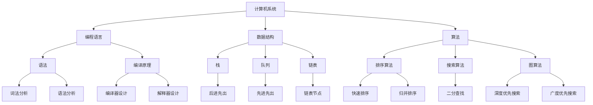
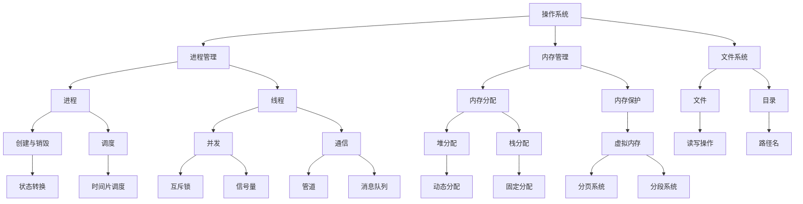
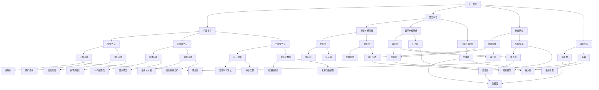
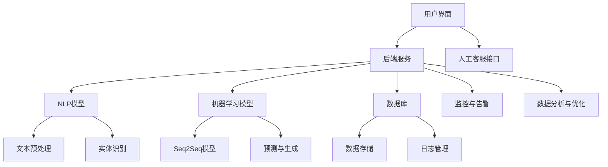
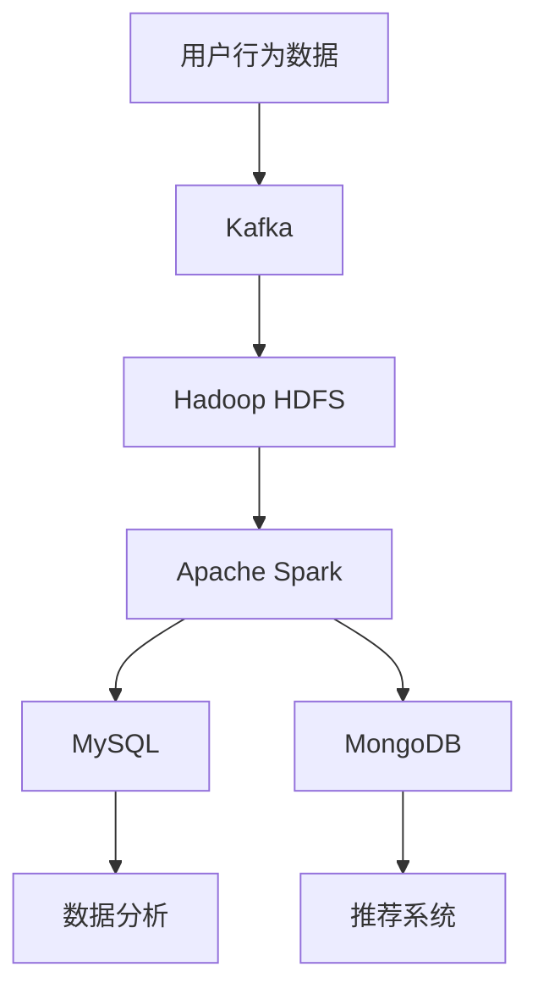
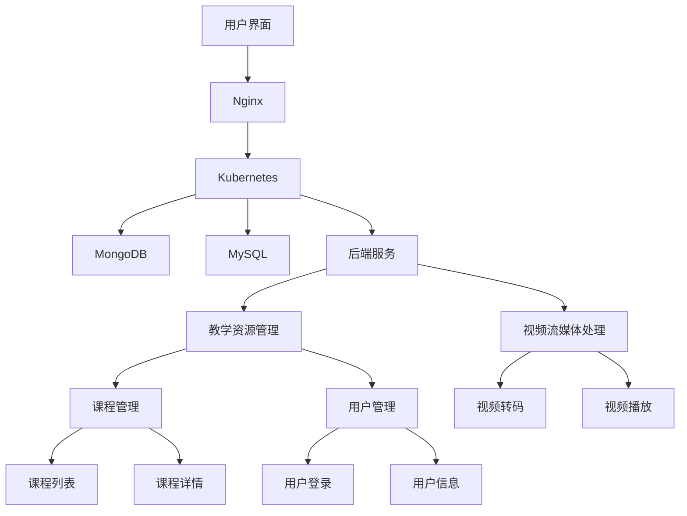

                 

### 文章标题

# 技术硬实力

在当前科技迅猛发展的时代，技术人才不仅要拥有深厚的理论基础，更需要具备强大的实践能力。本书《技术硬实力》旨在为IT从业者提供一套系统化的技术知识框架和实战指南，帮助读者全面提升技术能力。通过深入剖析计算机科学、操作系统、网络技术、人工智能、大数据、云计算和软件开发方法论等核心领域，本书旨在培养读者的技术思维，提升其在实际项目中的解决能力。

本书的核心关键词包括计算机科学、操作系统、网络技术、人工智能、大数据、云计算和软件开发方法论。这些关键词不仅代表了本书的主要内容，也反映了当前IT行业的核心发展趋势。随着技术的不断进步，这些领域正日益成为企业和个人竞争的关键所在。

在文章的摘要部分，我们将概述本书的核心内容和主题思想。本书分为三大部分，第一部分涵盖技术基础，包括计算机科学基础知识、操作系统原理和网络技术基础；第二部分聚焦核心技术与应用，深入探讨人工智能与机器学习、大数据技术和云计算与容器化；第三部分通过实战项目，让读者将理论知识应用于实际项目中，提升实战能力。通过阅读本书，读者将不仅掌握核心技术，更能形成全面的技术思维，成为具备硬实力的技术专家。

### 文章关键词

- 计算机科学
- 操作系统
- 网络技术
- 人工智能
- 机器学习
- 大数据
- 云计算
- 软件开发方法论

### 文章摘要

《技术硬实力》是一本旨在全面提升IT从业者技术能力的专业书籍。本书分为三大部分，第一部分介绍计算机科学基础知识、操作系统原理和网络技术基础，帮助读者构建坚实的技术基础。第二部分深入探讨人工智能与机器学习、大数据技术和云计算与容器化，覆盖当前技术前沿领域。第三部分通过实战项目，将理论知识应用于实际，提升读者的实战能力。通过系统学习和实践，读者将掌握核心技术，形成全面的技术思维，成为具备硬实力的技术专家。

## 第一部分：技术基础

### 第1章：计算机科学基础知识

#### 背景介绍

计算机科学作为现代科技的核心领域，其发展经历了从理论到实践的不断探索。计算机科学的基础知识是理解和应用现代信息技术的基石，涵盖了计算机系统的构成、编程语言以及数据结构与算法等方面。本章将详细探讨这些基础概念，为后续章节的学习奠定坚实的基础。

#### 核心概念与联系

为了更好地理解计算机科学的基础知识，我们可以通过Mermaid流程图来展示这些核心概念及其相互关系。



#### 核心概念讲解

1. **计算机系统**

计算机系统由硬件和软件两大部分组成。硬件包括中央处理器（CPU）、内存、存储设备、输入输出设备等，而软件则包括操作系统、应用程序等。计算机系统的运作依赖于硬件和软件的协同工作。

2. **编程语言**

编程语言是用于与计算机进行交流的工具。常见的编程语言包括C、C++、Java、Python等。每种编程语言都有其独特的语法和语义，通过编译或解释过程，将人类编写的代码转换为计算机可执行的指令。

3. **数据结构**

数据结构是用于存储和组织数据的方式。常见的有栈、队列、链表等。不同的数据结构有其特定的使用场景和优势。

4. **算法**

算法是解决问题的步骤和方法。排序算法、搜索算法和图算法是算法的三种基本类型，每种算法都有其特定的实现方式和应用场景。

#### 伪代码示例

以下是一个简单的快速排序算法的伪代码示例，用于说明算法原理。

```plaintext
快速排序(A[1..n])
    if n <= 1
        return A
    else
        pivot = A[n]
        i = 1
        j = n - 1
        for each k = 1 to n - 1 do
            if A[k] < pivot then
                swap(A[i], A[k])
                i = i + 1
            else if A[k] > pivot then
                swap(A[j], A[k])
                j = j - 1
        swap(A[n], A[j])
        k = j
        A[k-1], A[k] = A[k], A[k-1]
        quicksort(A[1..k-1])
        quicksort(A[k+1..n])
        return A
```

#### 数学模型和公式

在计算机科学中，复杂度分析是评估算法性能的重要工具。以下是一些常见的数学模型和公式：

- **时间复杂度**：表示算法执行时间与数据规模的关系，常用大O表示法（O(n)、O(n^2)等）。
- **空间复杂度**：表示算法所需存储空间与数据规模的关系，同样使用大O表示法。

$$
T(n) = O(n^2)
$$

$$
S(n) = O(n)
$$

#### 举例说明

假设有一个包含10个元素的数组，对其进行快速排序的过程如下：

1. 选择数组中的一个元素作为基准（pivot）。
2. 将数组分为两部分，一部分小于基准，另一部分大于基准。
3. 对这两部分分别递归进行快速排序。
4. 最终得到一个有序的数组。

#### 小结

本章介绍了计算机科学的基础知识，包括计算机系统、编程语言、数据结构和算法。这些概念构成了计算机科学的核心内容，为后续章节的学习提供了坚实的基础。通过理解和掌握这些核心概念，读者可以更好地应对复杂的技术挑战。

### 第2章：操作系统原理

#### 背景介绍

操作系统（Operating System，简称OS）是计算机系统的核心软件，负责管理和协调计算机硬件及软件资源。操作系统的原理和功能对于理解计算机工作方式至关重要。本章将深入探讨操作系统的基本概念、工作原理以及主要功能。

#### 核心概念与联系

操作系统的核心概念包括进程、线程、内存管理和文件系统。这些概念之间的关系可以通过Mermaid流程图来展示。



#### 核心概念讲解

1. **操作系统**

操作系统是管理计算机硬件和软件资源的核心软件。其主要功能包括进程管理、内存管理、文件系统管理、设备管理和用户接口等。

2. **进程**

进程是操作系统中运行的基本单元。每个进程都有自己的地址空间、一组寄存器和程序计数器。进程之间通过共享内存、消息传递等方式进行通信。

3. **线程**

线程是进程内的一个执行单元，与进程相比，线程的执行是轻量级的。一个进程可以包含多个线程，它们共享进程的资源。

4. **内存管理**

内存管理包括内存分配、内存保护和内存回收等。内存分配主要有堆分配和栈分配两种方式。内存保护通过虚拟内存技术实现，可以防止进程间内存冲突。

5. **文件系统**

文件系统是操作系统中用于管理和存储文件的数据结构。文件系统包括文件、目录和文件系统缓存等。文件系统的主要功能包括文件的创建、删除、读写和权限管理等。

#### 伪代码示例

以下是一个简单的进程创建与销毁的伪代码示例。

```plaintext
创建进程(P)
    P->状态 = 创建
    P->PID = 生成唯一标识
    P->内存地址 = 分配内存
    P->寄存器 = 初始化
    P->程序计数器 = 初始化
    return P

销毁进程(P)
    释放P->内存地址
    P->状态 = 销毁
    更新进程表
```

#### 数学模型和公式

操作系统的性能评估常用以下数学模型和公式：

- **CPU利用率**：

$$
CPU\ 利用率 = \frac{CPU\ 工作时间}{总时间}
$$

- **内存利用率**：

$$
内存利用率 = \frac{已分配内存}{总内存}
$$

#### 举例说明

假设操作系统需要创建一个新进程，该进程需要以下资源：

1. 分配1MB内存。
2. 初始化程序计数器。
3. 为进程生成唯一标识。

操作系统将执行以下步骤：

1. 分配1MB内存给新进程。
2. 初始化进程的寄存器。
3. 为新进程生成唯一标识。
4. 将新进程添加到进程表中。

#### 小结

本章介绍了操作系统的基本原理和主要功能，包括进程管理、内存管理和文件系统。这些核心概念对于理解计算机系统的工作方式至关重要。通过学习和掌握操作系统的原理，读者可以更好地设计和优化计算机系统。

### 第3章：网络技术基础

#### 背景介绍

随着互联网的普及，网络技术已成为现代社会不可或缺的一部分。网络技术基础涵盖了网络协议、网络拓扑、传输技术以及网络安全等方面。本章将详细探讨这些基础概念，帮助读者建立全面网络技术知识体系。

#### 核心概念与联系

网络技术涉及众多核心概念，包括TCP/IP协议栈、OSI七层模型、网络拓扑结构以及传输层和安全层等。这些概念之间的关系可以通过Mermaid流程图来展示。

```mermaid
graph TD
    A[网络技术] --> B[TCP/IP协议栈]
    A --> C[OSI七层模型]
    A --> D[网络拓扑]
    A --> E[传输技术]
    A --> F[网络安全]
    B --> G[IP协议]
    B --> H[TCP协议]
    B --> I[UDP协议]
    C --> J[物理层]
    C --> K[数据链路层]
    C --> L[网络层]
    C --> M[传输层]
    C --> N[会话层]
    C --> O[表示层]
    C --> P[应用层]
    D --> Q[星型拓扑]
    D --> R[环型拓扑]
    D --> S[总线型拓扑]
    E --> T[电路交换]
    E --> U[报文交换]
    E --> V[分组交换]
    F --> W[防火墙]
    F --> X[入侵检测系统]
    F --> Y[加密技术]
    G --> Z[IP地址]
    H --> AA[三次握手]
    H --> BB[四次挥手]
    I --> CC[无连接服务]
    J --> DD[电气特性]
    J --> EE[传输介质]
    K --> FF[帧同步]
    K --> GG[错误检测]
    L --> HH[路由选择]
    L --> II[拥塞控制]
    M --> JJ[TCP连接]
    M --> KK[UDP数据报]
    N --> LL[会话管理]
    O --> MM[数据转换]
    P --> NN[应用层协议]
    Q --> AA[中心节点]
    Q --> BB[节点连接]
    R --> CC[闭合环]
    R --> DD[环连接]
    S --> EE[总线结构]
    S --> FF[节点连接]
    T --> GG[建立连接]
    T --> HH[传输数据]
    T --> II[终止连接]
    U --> JJ[存储转发]
    U --> KK[传输完整]
    V --> LL[分组传输]
    V --> MM[传输高效]
    W --> NN[访问控制]
    W --> OO[数据加密]
    X --> PP[入侵检测]
    X --> QQ[响应措施]
    Y --> RR[加密算法]
    Y --> SS[密钥管理]
```



#### 核心概念讲解

1. **网络技术**

网络技术是计算机网络的基础，包括数据传输、网络协议和网络安全等方面。网络技术的主要目标是实现数据的高效、可靠和安全传输。

2. **TCP/IP协议栈**

TCP/IP协议栈是互联网的核心协议集，包括IP协议、TCP协议和UDP协议。IP协议负责数据包的路由和传输，TCP协议提供可靠的连接和传输服务，UDP协议提供简单的无连接传输服务。

3. **OSI七层模型**

OSI七层模型是网络协议的标准框架，包括物理层、数据链路层、网络层、传输层、会话层、表示层和应用层。每一层都有特定的功能和协议。

4. **网络拓扑**

网络拓扑是指网络中节点和连接的布局结构。常见的网络拓扑包括星型拓扑、环型拓扑和总线型拓扑。

5. **传输技术**

传输技术包括电路交换、报文交换和分组交换等。电路交换在传输数据前建立连接，报文交换将整个数据包一次传输，分组交换将数据包分割成多个部分传输。

6. **网络安全**

网络安全是保护网络不受恶意攻击和数据泄露的措施。常见的网络安全技术包括防火墙、入侵检测系统和加密技术。

#### 伪代码示例

以下是一个简单的TCP三次握手过程的伪代码示例。

```plaintext
TCP三次握手
    客户端发送SYN包到服务器，进入SYN_SENT状态
    服务器收到SYN包，发送SYN+ACK包给客户端，进入SYN_RCVD状态
    客户端收到SYN+ACK包，发送ACK包给服务器，进入ESTABLISHED状态
    服务器收到ACK包，进入ESTABLISHED状态
```

#### 数学模型和公式

网络性能评估常用以下数学模型和公式：

- **带宽利用率**：

$$
带宽利用率 = \frac{实际带宽}{理论带宽}
$$

- **延迟**：

$$
延迟 = \frac{传输距离}{传输速度}
$$

#### 举例说明

假设一个客户端（A）需要连接到服务器（B），两者之间的网络延迟为100ms，带宽为1Mbps。客户端发起TCP连接的步骤如下：

1. 客户端发送SYN包到服务器。
2. 服务器收到SYN包，发送SYN+ACK包回客户端。
3. 客户端收到SYN+ACK包，发送ACK包回服务器。
4. 服务器收到ACK包，连接建立完成。

#### 小结

本章介绍了网络技术的基础知识，包括网络协议、网络拓扑、传输技术和网络安全。这些概念构成了网络技术的基本框架，对于理解和设计现代网络至关重要。通过学习和掌握这些核心概念，读者可以更好地应对网络技术和安全挑战。

## 第二部分：核心技术与应用

### 第4章：人工智能与机器学习

#### 背景介绍

人工智能（Artificial Intelligence，简称AI）作为计算机科学的一个重要分支，旨在使机器模拟人类智能行为。随着深度学习、自然语言处理和计算机视觉等领域的飞速发展，人工智能已经广泛应用于各行各业。本章将深入探讨人工智能的基本概念、主要技术和应用场景，帮助读者了解这一前沿领域的核心技术。

#### 核心概念与联系

人工智能的核心概念包括机器学习、深度学习、神经网络和强化学习等。这些概念之间的关系可以通过Mermaid流程图来展示。



#### 核心概念讲解

1. **人工智能**

人工智能是使计算机模拟人类智能行为的技术。它涵盖了多个领域，包括机器学习、自然语言处理、计算机视觉、语音识别等。

2. **机器学习**

机器学习是人工智能的一个分支，通过算法从数据中学习模式和规律，从而进行预测和决策。机器学习可以分为监督学习、无监督学习和半监督学习。

3. **深度学习**

深度学习是一种基于神经网络的机器学习技术，通过多层神经网络自动提取数据特征。深度学习在图像识别、语音识别和自然语言处理等领域取得了显著成果。

4. **神经网络**

神经网络是模仿生物神经系统的计算模型，由多层神经元组成。神经网络通过前向传播和反向传播算法训练模型，自动学习数据特征。

5. **强化学习**

强化学习是一种通过不断试错和奖励机制来学习策略的机器学习技术。强化学习在游戏、自动驾驶和推荐系统等领域有广泛应用。

#### 伪代码示例

以下是一个简单的线性回归算法的伪代码示例，用于说明算法原理。

```plaintext
线性回归
    初始化权重w和偏置b
    对于每个训练样本(x, y)：
        预测值y_pred = w * x + b
        计算损失L = (y - y_pred)^2
        计算梯度∂L/∂w = 2 * (y - y_pred) * x
        计算梯度∂L/∂b = 2 * (y - y_pred)
        更新权重w = w - 学习率 * ∂L/∂w
        更新偏置b = b - 学习率 * ∂L/∂b
    返回训练好的权重w和偏置b
```

#### 数学模型和公式

在人工智能和机器学习中，常用的数学模型和公式包括：

- **损失函数**：

$$
L(y, y') = (y - y')^2
$$

- **梯度下降**：

$$
w_{更新} = w - \alpha \cdot \frac{\partial L}{\partial w}
$$

其中，$w$是权重，$\alpha$是学习率。

#### 举例说明

假设有一个线性回归问题，需要预测房价。训练数据集包含房屋面积（x）和房价（y）。通过线性回归模型，我们可以得到以下公式：

$$
y = w \cdot x + b
$$

通过梯度下降算法，我们可以逐步更新权重w和偏置b，最小化损失函数，从而得到一个拟合良好的模型。

#### 小结

本章介绍了人工智能与机器学习的基本概念、主要技术和应用场景。这些核心技术为人工智能的发展奠定了基础。通过学习和掌握这些核心概念，读者可以更好地理解人工智能的工作原理和应用前景。

### 第5章：大数据技术

#### 背景介绍

大数据技术是应对海量数据存储、处理和分析的重要工具。随着互联网的普及和数据量的爆炸式增长，大数据技术已成为各个行业不可或缺的一部分。本章将深入探讨大数据技术的基本概念、关键技术和应用场景，帮助读者了解大数据技术的核心内容和实际应用。

#### 核心概念与联系

大数据技术的核心概念包括数据仓库、数据湖、数据处理框架和数据分析方法等。这些概念之间的关系可以通过Mermaid流程图来展示。

```mermaid
graph TD
    A[大数据技术] --> B[数据仓库]
    A --> C[数据湖]
    A --> D[数据处理框架]
    A --> E[数据分析方法]
    B --> F[数据存储]
    B --> G[数据集成]
    B --> H[数据管理]
    C --> I[数据存储]
    C --> J[数据整合]
    C --> K[数据处理]
    D --> L[MapReduce]
    D --> M[Hadoop]
    D --> N[Spark]
    E --> O[数据挖掘]
    E --> P[机器学习]
    E --> Q[数据可视化]
    F --> R[关系型数据库]
    F --> S[NoSQL数据库]
    G --> T[ETL过程]
    G --> U[数据清洗]
    G --> V[数据转换]
    H --> WW[数据模型]
    H --> XX[数据索引]
    H --> YY[数据安全]
    I --> ZZ[分布式存储]
    I --> AA[大数据存储]
    J --> BB[数据融合]
    J --> CC[数据分类]
    J --> DD[数据关系]
    K --> EE[流处理]
    K --> FF[批量处理]
    L --> GG[映射函数]
    L --> HH[归约函数]
    M --> II[分布式文件系统]
    M --> JJ[YARN资源调度]
    M --> KK[HDFS分布式存储]
    N --> LL[内存计算]
    N --> MM[分布式调度]
    N --> NN[弹性扩展]
    O --> PP[聚类算法]
    O --> QQ[分类算法]
    O --> RR[回归算法]
    P --> SS[监督学习]
    P --> TT[无监督学习]
    Q --> UU[图表可视化]
    Q --> VV[仪表盘可视化]
    R --> WW[关系型数据库]
    R --> XX[非关系型数据库]
    S --> YY[分布式数据库]
    S --> ZZ[云数据库]
    T --> AA[ETL工具]
    T --> BB[数据管道]
    T --> CC[数据仓库工具]
    U --> DD[数据清洗工具]
    U --> EE[数据转换工具]
    V --> FF[数据整合工具]
    V --> GG[数据集成工具]
    W --> HH[数据模型设计]
    W --> II[数据模型存储]
    X --> JJ[数据索引管理]
    X --> KK[全文搜索]
    Y --> LL[数据安全策略]
    Y --> MM[数据加密技术]
    Z --> NN[分布式文件系统]
    Z --> OO[分布式存储系统]
    AA --> PP[数据压缩]
    AA --> QQ[数据传输]
    BB --> RR[数据转换]
    BB --> SS[数据处理]
    CC --> TT[数据仓库管理]
    CC --> UU[数据仓库分析]
    DD --> VV[数据清洗]
    DD --> WW[数据转换]
    EE --> XX[数据同步]
    EE --> YY[数据备份]
    FF --> ZZ[数据归档]
    FF --> AA[数据备份]
    GG --> BB[数据整合]
    GG --> CC[数据集成]
```



#### 核心概念讲解

1. **大数据技术**

大数据技术是指用于处理海量数据的一系列技术和工具，包括数据存储、数据处理和分析等。大数据技术旨在从大量数据中提取有价值的信息。

2. **数据仓库**

数据仓库是一个用于存储、管理和分析大量数据的集中化系统。数据仓库通常包含历史数据，用于支持企业决策和分析。

3. **数据湖**

数据湖是一个用于存储原始数据和大规模数据的分布式存储系统。数据湖不同于数据仓库，它不限制数据的结构和格式，支持数据的高效存储和处理。

4. **数据处理框架**

数据处理框架是一套用于大规模数据处理的工具和算法，包括MapReduce、Hadoop和Spark等。这些框架提供分布式计算能力，能够高效处理海量数据。

5. **数据分析方法**

数据分析方法包括数据挖掘、机器学习和数据可视化等。数据挖掘用于从数据中发现隐藏的模式和趋势，机器学习用于构建预测模型，数据可视化用于直观展示数据特征。

#### 伪代码示例

以下是一个简单的MapReduce算法的伪代码示例，用于说明数据处理过程。

```plaintext
MapReduce算法
    针对输入数据集进行分片
    对于每个分片：
        Map阶段：
            输入：键值对
            输出：中间键值对
        Shuffle阶段：
            合并相同中间键的所有中间键值对
        Reduce阶段：
            输入：中间键值对
            输出：最终键值对
    返回最终结果
```

#### 数学模型和公式

大数据技术涉及以下数学模型和公式：

- **数据量计算**：

$$
数据量 = 分片数量 \times 分片大小
$$

- **处理时间**：

$$
处理时间 = 分片处理时间 + Shuffle时间 + Reduce时间
$$

#### 举例说明

假设一个大数据系统需要处理100TB的数据，采用Hadoop框架进行分布式计算。数据分为10个分片，每个分片大小为10GB。数据处理过程如下：

1. Map阶段：对每个分片进行数据处理，生成中间键值对。
2. Shuffle阶段：合并相同中间键的所有中间键值对。
3. Reduce阶段：对合并后的中间键值对进行聚合计算，生成最终结果。

#### 小结

本章介绍了大数据技术的基本概念、关键技术和应用场景。大数据技术为企业和组织提供了强大的数据处理和分析能力。通过学习和掌握这些核心技术，读者可以更好地应对海量数据挑战，实现数据价值的最大化。

### 第6章：云计算与容器化

#### 背景介绍

云计算和容器化技术是现代IT领域的重要发展方向，它们在提升资源利用率和灵活度方面发挥了关键作用。云计算提供了一种按需分配计算资源的方式，而容器化技术则使应用程序能够在不同的环境中无缝运行。本章将深入探讨云计算和容器化的基本概念、核心技术和应用场景，帮助读者全面理解这两大技术。

#### 核心概念与联系

云计算和容器化的核心概念包括云服务模型、虚拟化技术、容器化技术、微服务架构和容器编排等。这些概念之间的关系可以通过Mermaid流程图来展示。

```mermaid
graph TD
    A[云计算] --> B[云服务模型]
    A --> C[虚拟化技术]
    A --> D[容器化技术]
    A --> E[微服务架构]
    A --> F[容器编排]
    B --> G[IaaS]
    B --> H[PaaS]
    B --> I[SaaS]
    C --> J[全虚拟化]
    C --> K[硬件虚拟化]
    C --> L[操作系统虚拟化]
    D --> M[Docker]
    D --> N[容器引擎]
    E --> O[服务拆分]
    E --> P[服务独立部署]
    F --> Q[Kubernetes]
    F --> R[Docker Swarm]
    G --> S[基础设施即服务]
    G --> T[平台即服务]
    G --> U[软件即服务]
    H --> V[开发环境]
    H --> W[中间件服务]
    H --> X[数据库服务]
    I --> Y[办公软件]
    I --> Z[业务应用]
    J --> AA[虚拟机]
    J --> BB[虚拟化硬件]
    K --> CC[虚拟CPU]
    K --> DD[虚拟内存]
    L --> EE[虚拟操作系统]
    L --> FF[虚拟网络]
    M --> GG[容器镜像]
    M --> HH[容器管理]
    N --> II[容器编排]
    N --> JJ[容器网络]
    O --> KK[服务隔离]
    O --> LL[服务自治]
    P --> MM[独立部署]
    P --> NN[独立升级]
    Q --> OO[集群管理]
    Q --> PP[资源调度]
    Q --> QQ[服务网格]
    R --> SS[容器编排]
    R --> TT[容器网络]
    R --> UU[容器存储]
```



#### 核心概念讲解

1. **云计算**

云计算是一种通过互联网提供动态可扩展的虚拟化计算资源的方式。云服务模型包括基础设施即服务（IaaS）、平台即服务（PaaS）和软件即服务（SaaS）。云计算提供了灵活、高效的计算资源管理，降低了企业的IT成本。

2. **虚拟化技术**

虚拟化技术通过创建虚拟资源，将计算资源分割成多个独立的部分，从而提高资源利用率和灵活性。虚拟化技术包括全虚拟化、硬件虚拟化和操作系统虚拟化。

3. **容器化技术**

容器化技术通过将应用程序及其依赖环境打包成一个独立的容器，实现应用程序在不同环境中的一致性运行。容器化技术包括Docker容器、容器引擎和容器编排工具。

4. **微服务架构**

微服务架构是将应用程序拆分为多个独立的小服务，每个服务负责特定的业务功能。微服务架构实现了服务隔离、独立部署和自治，提高了系统的可维护性和扩展性。

5. **容器编排**

容器编排是管理容器化应用程序的过程，包括集群管理、资源调度和服务网格。容器编排工具如Kubernetes和Docker Swarm提供了自动化部署、扩展和管理容器的功能。

#### 伪代码示例

以下是一个简单的Docker容器创建和部署的伪代码示例。

```plaintext
创建容器
    从Docker镜像仓库拉取指定镜像
    创建容器配置文件
    启动容器，并将容器端口映射到宿主机端口
    返回容器ID

部署容器
    调用创建容器函数，获取容器ID
    将容器ID添加到容器编排工具中
    配置容器网络和存储
    启动容器，并监控容器状态
```

#### 数学模型和公式

云计算和容器化技术涉及以下数学模型和公式：

- **资源利用率**：

$$
资源利用率 = \frac{实际使用资源}{总资源}
$$

- **容器密度**：

$$
容器密度 = \frac{容器数量}{主机资源}
$$

#### 举例说明

假设一个企业需要部署一个Web应用程序，采用Docker容器化技术。以下是一个简单的部署过程：

1. 从Docker镜像仓库拉取Nginx镜像。
2. 创建容器配置文件，设置容器端口映射。
3. 启动容器，并配置容器网络。
4. 将容器ID添加到Kubernetes集群中，进行自动化部署和管理。
5. 监控容器状态，确保Web应用程序正常运行。

#### 小结

本章介绍了云计算和容器化的基本概念、核心技术和应用场景。云计算提供了灵活、高效的计算资源管理，而容器化技术则实现了应用程序的一致性运行和高效部署。通过学习和掌握这些核心技术，读者可以更好地应对现代IT领域的挑战。

### 第7章：软件开发方法论

#### 背景介绍

软件开发方法论是指导软件开发过程的一系列原则和步骤。选择合适的软件开发方法论可以显著提高软件项目的开发效率和质量。本章将深入探讨几种常见的软件开发方法论，包括瀑布模型、敏捷开发和DevOps，帮助读者了解这些方法的优缺点及其适用场景。

#### 核心概念与联系

软件开发方法论的核心概念包括需求分析、设计、开发、测试、部署和运维等。这些概念之间的关系可以通过Mermaid流程图来展示。

```mermaid
graph TD
    A[软件开发方法论] --> B[需求分析]
    A --> C[设计]
    A --> D[开发]
    A --> E[测试]
    A --> F[部署]
    A --> G[运维]
    B --> H[用户需求]
    B --> I[功能需求]
    B --> J[非功能需求]
    C --> K[系统架构]
    C --> L[模块设计]
    C --> M[界面设计]
    D --> N[编码]
    D --> O[单元测试]
    D --> P[集成测试]
    E --> Q[系统测试]
    E --> R[验收测试]
    F --> S[自动化部署]
    F --> T[手动部署]
    G --> U[监控]
    G --> V[备份与恢复]
    G --> W[性能优化]
    H --> XX[市场调研]
    H --> YY[用户访谈]
    I --> ZZ[性能要求]
    I --> AA[安全性要求]
    J --> BB[兼容性要求]
    J --> CC[可靠性要求]
    K --> DD[组件接口]
    K --> EE[数据流]
    L --> FF[模块功能]
    L --> GG[模块交互]
    M --> HH[布局设计]
    M --> II[样式设计]
    N --> JJ[代码复用]
    N --> KK[代码规范]
    O --> LL[测试覆盖]
    O --> MM[测试数据]
    P --> NN[集成验证]
    P --> OO[集成性能]
    Q --> PP[功能完整性]
    Q --> QQ[系统性能]
    R --> SS[用户满意度]
    R --> TT[业务目标]
    S --> UU[脚本化部署]
    S --> VV[持续集成]
    T --> WW[手动脚本]
    T --> XX[人工部署]
    U --> YY[监控工具]
    U --> ZZ[日志管理]
    V --> AA[自动化测试]
    V --> BB[持续交付]
    W --> CC[性能监控]
    W --> DD[负载测试]
```



#### 核心概念讲解

1. **瀑布模型**

瀑布模型是一种传统的软件开发方法论，按照需求分析、设计、开发、测试、部署等阶段依次进行。每个阶段完成后，下一个阶段才开始，前一阶段的输出作为后一阶段的输入。瀑布模型的优点是流程清晰，适用于需求明确且稳定的项目。

2. **敏捷开发**

敏捷开发是一种以人为核心、迭代和增量的软件开发方法论。敏捷开发强调快速响应变化，通过短周期迭代和频繁交付来提高开发效率。敏捷开发方法包括Scrum、Kanban等，适用于需求变化快、复杂度高的项目。

3. **DevOps**

DevOps是一种结合软件开发和运维的集成方法论，旨在缩短开发周期、提高交付质量和系统可靠性。DevOps通过自动化部署、监控和测试，实现开发和运维的无缝协作。DevOps适用于需要高效交付和稳定运行的项目。

#### 伪代码示例

以下是一个简单的Scrum敏捷开发迭代过程的伪代码示例。

```plaintext
敏捷开发迭代
    初始化迭代周期
    在迭代开始时，进行需求评审和规划
    开发团队进行开发，每天进行站会进行进度汇报
    在迭代结束时，进行代码审查和产品演示
    收集反馈，进行迭代总结和改进
    返回下一个迭代周期
```

#### 数学模型和公式

软件开发方法论中常用的数学模型和公式包括：

- **开发周期**：

$$
开发周期 = \frac{总任务量}{每天任务量}
$$

- **任务完成率**：

$$
任务完成率 = \frac{已完成任务量}{总任务量}
$$

#### 举例说明

假设一个项目采用敏捷开发方法，迭代周期为两周。在第一个迭代周期中，共有10个任务，开发团队每天完成任务量稳定为2个任务。以下是一个简单的迭代过程：

1. 在迭代开始时，进行需求评审和规划，确定每个任务的优先级。
2. 开发团队进行开发，每天进行站会进行进度汇报。
3. 在迭代结束时，进行代码审查和产品演示，确保所有任务完成。
4. 收集反馈，进行迭代总结和改进，为下一个迭代周期做好准备。

#### 小结

本章介绍了几种常见的软件开发方法论，包括瀑布模型、敏捷开发和DevOps。每种方法都有其特定的优缺点和适用场景。通过学习和掌握这些方法论，读者可以根据项目特点选择合适的开发方法，提高软件项目开发效率和质量。

### 第8章：人工智能项目实战

#### 背景介绍

在本章中，我们将通过一个具体的人工智能项目实战，介绍人工智能项目的开发过程、技术选型、实现步骤以及评估与优化。通过这个案例，读者可以了解从理论到实践的完整过程，并将所学知识应用于实际项目。

#### 项目背景与目标

项目名称：智能客服系统

项目背景：随着互联网的快速发展，越来越多的企业开始通过在线客服系统提供客户服务。为了提高客户满意度和服务效率，某知名电商企业希望开发一个基于人工智能的智能客服系统，能够自动解答客户常见问题，并在无法解答时及时转接到人工客服。

项目目标：
1. 自动识别客户提问，并提供准确回答。
2. 对无法自动解答的问题进行分类，并转接到人工客服。
3. 对客服系统进行持续优化，提高问答准确率和用户体验。

#### 技术选型

为了实现上述目标，我们选择了以下技术方案：
1. **自然语言处理（NLP）**：用于处理和解析客户提问，提取关键信息。
2. **机器学习**：用于训练问答模型，提高问答准确率。
3. **数据库**：用于存储客户问题和答案，以及客服系统的日志和统计数据。
4. **前端框架**：用于开发用户界面，提供友好交互体验。
5. **后端服务**：用于处理客户提问，调用NLP和机器学习模型，进行问答。

具体技术选型如下：
1. **NLP**：采用BERT模型进行文本预处理和实体识别。
2. **机器学习**：采用序列到序列（Seq2Seq）模型进行问答生成。
3. **数据库**：采用MySQL进行数据存储。
4. **前端框架**：采用Vue.js框架开发用户界面。
5. **后端服务**：采用Flask框架搭建后端服务。

#### 技术架构

智能客服系统技术架构如图所示：



#### 实现步骤

1. **数据收集与预处理**

收集大量客户问题和答案，并进行预处理，包括去噪、分词、实体识别等。将预处理后的数据分为训练集和测试集，用于训练和评估模型。

2. **模型训练**

采用BERT模型进行文本预处理，提取文本特征。然后，使用Seq2Seq模型进行问答生成训练。通过不断迭代训练，优化模型参数，提高问答准确率。

3. **系统开发**

开发用户界面和后端服务。用户界面通过Vue.js框架搭建，实现客户提问和答案展示。后端服务采用Flask框架，处理客户提问，调用NLP和机器学习模型进行问答生成。

4. **测试与优化**

对系统进行功能测试和性能测试，确保系统稳定运行。根据测试结果，对模型和系统进行优化，提高问答准确率和用户体验。

5. **部署与监控**

将系统部署到生产环境，并设置监控与告警机制，实时监控系统运行状态。定期对系统进行性能优化和功能升级。

#### 代码实现

以下是一个简单的Seq2Seq模型训练的伪代码示例：

```plaintext
导入必要库
定义编码器模型
定义解码器模型
训练编码器和解码器
预测与生成答案
```

#### 代码解读

1. **数据预处理**：

```python
import jieba

# 加载预处理后的客户问题和答案
with open('preprocessed_data.txt', 'r', encoding='utf-8') as f:
    questions, answers = f.readlines()

# 分词与实体识别
tokenizer = BertTokenizer.from_pretrained('bert-base-chinese')
questions_tokenized = [tokenizer.encode(q) for q in questions]
answers_tokenized = [tokenizer.encode(a) for a in answers]
```

2. **模型定义**：

```python
from keras.models import Model
from keras.layers import Input, LSTM, Dense

# 编码器模型
encoder_inputs = Input(shape=(None,))
encoder_embedding = Embedding(input_dim=vocab_size, output_dim=embedding_dim)(encoder_inputs)
encoder_lstm = LSTM(units=lstm_units, return_state=True)
encoder_outputs, state_h, state_c = encoder_lstm(encoder_embedding)
encoder_states = [state_h, state_c]

# 解码器模型
decoder_inputs = Input(shape=(None,))
decoder_embedding = Embedding(input_dim=vocab_size, output_dim=embedding_dim)(decoder_inputs)
decoder_lstm = LSTM(units=lstm_units, return_sequences=True, return_state=True)
decoder_outputs, _, _ = decoder_lstm(decoder_embedding, initial_state=encoder_states)
decoder_dense = Dense(vocab_size, activation='softmax')
decoder_outputs = decoder_dense(decoder_outputs)

# 模型搭建
model = Model([encoder_inputs, decoder_inputs], decoder_outputs)
model.compile(optimizer='adam', loss='categorical_crossentropy', metrics=['accuracy'])
```

#### 应用解读

通过这个智能客服系统项目，我们可以看到人工智能在客户服务中的应用。系统通过自然语言处理和机器学习技术，实现了自动问答功能，提高了客服效率和客户满意度。在实际应用中，还可以根据业务需求，不断优化模型和系统，提高问答准确率和用户体验。

#### 项目评估与优化

1. **评估指标**：

- **准确率**：问答系统准确回答问题的比例。
- **响应时间**：系统处理客户提问的平均时间。
- **用户体验**：用户对系统问答的满意度。

2. **优化措施**：

- **模型优化**：通过增加训练数据、改进模型结构和参数调优，提高问答准确率。
- **系统优化**：优化后端服务和前端界面，提高系统响应速度和用户体验。
- **数据管理**：定期更新和维护知识库，确保数据的准确性和时效性。

#### 小结

通过这个智能客服系统项目，我们了解了人工智能项目的开发过程、技术选型、实现步骤以及评估与优化。通过实际操作，读者可以更好地掌握人工智能技术的应用，提升项目实战能力。

### 第9章：大数据项目实战

#### 背景介绍

在本章中，我们将通过一个具体的大数据项目实战，介绍大数据项目的开发过程、技术选型、实现步骤以及评估与优化。通过这个案例，读者可以了解从数据采集、存储、处理到分析的全过程，并将所学知识应用于实际项目。

#### 项目背景与目标

项目名称：电商平台用户行为分析

项目背景：随着电商平台的不断扩张，用户行为数据日益增长。为了提升用户体验、优化业务流程和增加销售机会，某知名电商平台希望通过大数据技术对用户行为进行分析，挖掘有价值的信息。

项目目标：
1. 收集用户浏览、搜索、购买等行为数据。
2. 建立用户行为数据仓库，实现数据的存储和管理。
3. 利用大数据处理技术，对用户行为进行深入分析，提供个性化推荐和业务优化建议。

#### 技术选型

为了实现上述目标，我们选择了以下技术方案：
1. **数据采集**：使用Elasticsearch和Kafka进行实时数据采集。
2. **数据存储**：采用Hadoop HDFS进行大规模数据存储。
3. **数据处理**：采用Apache Spark进行分布式数据处理。
4. **数据分析**：使用Python和R进行数据分析和可视化。
5. **数据库**：采用MySQL和MongoDB进行数据管理和查询。

具体技术选型如下：
1. **数据采集**：Elasticsearch用于日志数据索引和搜索，Kafka用于实时数据传输。
2. **数据存储**：Hadoop HDFS用于存储大量用户行为数据。
3. **数据处理**：Apache Spark用于处理和分析用户行为数据。
4. **数据分析**：Python和R用于编写数据分析脚本和进行数据可视化。
5. **数据库**：MySQL用于存储用户行为数据和结果数据，MongoDB用于存储用户个人信息和推荐结果。

#### 技术架构

电商平台用户行为分析技术架构如图所示：



#### 实现步骤

1. **数据采集**

通过Elasticsearch和Kafka，实时采集用户的浏览、搜索、购买等行为数据。Elasticsearch用于索引和存储日志数据，Kafka用于接收和传输实时数据。

2. **数据存储**

将采集到的用户行为数据存储到Hadoop HDFS中，实现大规模数据的存储和管理。HDFS提供高可靠性和高扩展性的存储解决方案。

3. **数据处理**

使用Apache Spark，对存储在HDFS中的用户行为数据进行处理，包括数据清洗、转换和聚合。Spark提供高效的数据处理能力，可以处理海量数据。

4. **数据分析**

利用Python和R，编写数据分析脚本，对用户行为数据进行深入分析，包括用户兴趣分析、购买行为预测和推荐系统开发。

5. **数据可视化**

使用可视化工具，如Matplotlib和Plotly，将分析结果进行可视化展示，帮助业务团队更好地理解数据，并制定相应的业务策略。

6. **推荐系统**

基于用户行为数据，使用协同过滤算法和机器学习模型，开发推荐系统，为用户推荐感兴趣的商品。

#### 代码实现

以下是一个简单的Apache Spark数据处理和分析的伪代码示例：

```plaintext
from pyspark.sql import SparkSession
from pyspark.ml.feature import VectorAssembler
from pyspark.ml.recommendation import ALS

# 创建Spark会话
spark = SparkSession.builder.appName("UserBehaviorAnalysis").getOrCreate()

# 加载数据
user_data = spark.read.csv("user_data.csv", header=True)

# 数据预处理
assembler = VectorAssembler(inputCols=["page_views", "searches", "purchases"], outputCol="features")
user_data = assembler.transform(user_data)

# 训练ALS模型
als = ALS(maxIter=5, regParam=0.01, userCol="userId", itemCol="itemId", ratingCol="rating")
model = als.fit(user_data)

# 生成推荐结果
predictions = model.transform(user_data)

# 可视化推荐结果
predictions.select("userId", "itemId", "prediction").show()
```

#### 代码解读

1. **数据预处理**：

```python
assembler = VectorAssembler(inputCols=["page_views", "searches", "purchases"], outputCol="features")
user_data = assembler.transform(user_data)
```

这段代码使用VectorAssembler将多个特征列（page_views、searches、purchases）组合成一个特征向量。

2. **模型训练**：

```python
als = ALS(maxIter=5, regParam=0.01, userCol="userId", itemCol="itemId", ratingCol="rating")
model = als.fit(user_data)
```

这段代码使用ALS（交替最小二乘法）模型对用户行为数据进行训练，并设置迭代次数和正则化参数。

3. **生成推荐结果**：

```python
predictions = model.transform(user_data)
predictions.select("userId", "itemId", "prediction").show()
```

这段代码使用训练好的ALS模型生成推荐结果，并显示预测评分。

#### 应用解读

通过这个电商平台用户行为分析项目，我们可以看到大数据技术在电商业务中的应用。项目通过数据采集、存储、处理和分析，实现了对用户行为的深入挖掘，并为业务团队提供了有价值的分析报告和推荐系统。在实际应用中，可以根据业务需求，不断优化数据处理和分析算法，提高数据利用率和业务效果。

#### 项目评估与优化

1. **评估指标**：

- **数据处理效率**：评估系统处理大规模数据的能力和速度。
- **数据分析准确性**：评估分析模型和算法的准确性和可靠性。
- **系统稳定性**：评估系统在高并发情况下的稳定性。

2. **优化措施**：

- **数据处理优化**：优化数据清洗和转换流程，提高数据处理效率。
- **分析模型优化**：改进分析模型和算法，提高数据分析准确性。
- **系统稳定性优化**：增加系统监控和告警机制，确保系统在高并发情况下的稳定性。

#### 小结

通过这个电商平台用户行为分析项目，我们了解了大数据项目的开发过程、技术选型、实现步骤以及评估与优化。通过实际操作，读者可以更好地掌握大数据技术的应用，提升项目实战能力。

### 第10章：云计算与容器化项目实战

#### 背景介绍

在本章中，我们将通过一个具体的云计算与容器化项目实战，介绍云计算与容器化项目的开发过程、技术选型、实现步骤以及评估与优化。通过这个案例，读者可以了解从云计算资源的分配、容器化部署到系统监控与优化的完整过程，并将所学知识应用于实际项目。

#### 项目背景与目标

项目名称：在线教育平台

项目背景：随着互联网教育的兴起，越来越多的用户开始通过在线学习平台获取知识。为了提高平台性能和用户满意度，某知名教育机构希望通过云计算与容器化技术，搭建一个可扩展、高可靠性的在线教育平台。

项目目标：
1. 提供可靠、高性能的教育资源服务。
2. 实现教学视频的实时播放和互动功能。
3. 支持海量用户同时在线学习，确保系统稳定运行。

#### 技术选型

为了实现上述目标，我们选择了以下技术方案：
1. **云计算**：使用阿里云或腾讯云提供虚拟机和容器化服务。
2. **容器化**：使用Docker和Kubernetes进行容器化部署。
3. **视频流媒体**：使用Nginx和FFmpeg进行视频流媒体处理。
4. **数据库**：采用MySQL和MongoDB进行数据存储和管理。
5. **前端框架**：采用Vue.js框架开发用户界面。
6. **后端服务**：采用Spring Boot框架搭建后端服务。

具体技术选型如下：
1. **云计算**：使用阿里云Elastic Compute Service（ECS）提供虚拟机服务。
2. **容器化**：使用Docker进行容器化部署，Kubernetes进行容器编排和管理。
3. **视频流媒体**：使用Nginx作为视频流媒体服务器，FFmpeg进行视频转码处理。
4. **数据库**：MySQL用于存储用户数据和相关配置信息，MongoDB用于存储教学视频元数据。
5. **前端框架**：Vue.js用于开发用户界面，实现交互和页面渲染。
6. **后端服务**：Spring Boot用于搭建后端服务，处理业务逻辑和提供API接口。

#### 技术架构

在线教育平台技术架构如图所示：



#### 实现步骤

1. **云计算资源配置**

在阿里云上创建ECS虚拟机，配置必要的网络和存储资源。确保虚拟机能够稳定运行在线教育平台的后端服务。

2. **容器化部署**

使用Docker将后端服务、视频流媒体处理等模块容器化，创建Docker镜像。然后，使用Kubernetes进行容器编排，将Docker镜像部署到ECS虚拟机上。

3. **视频流媒体处理**

使用Nginx和FFmpeg进行视频流媒体处理，实现视频的实时播放和互动功能。Nginx负责视频流传输，FFmpeg进行视频转码和处理。

4. **数据库配置**

配置MySQL和MongoDB，用于存储用户数据、教学视频元数据等。确保数据库能够高效地处理查询和写入操作。

5. **前端开发**

使用Vue.js框架开发用户界面，实现课程的浏览、学习、互动等功能。前端界面与后端服务通过API接口进行数据交互。

6. **系统监控与优化**

使用Kubernetes的监控工具，如Prometheus和Grafana，对系统运行状态进行实时监控。根据监控数据，进行系统性能优化和故障排除。

#### 代码实现

以下是一个简单的Kubernetes部署配置文件的示例：

```yaml
apiVersion: apps/v1
kind: Deployment
metadata:
  name: backend-service
spec:
  replicas: 3
  selector:
    matchLabels:
      app: backend
  template:
    metadata:
      labels:
        app: backend
    spec:
      containers:
      - name: backend
        image: backend-service:latest
        ports:
        - containerPort: 8080
---
apiVersion: v1
kind: Service
metadata:
  name: backend-service
spec:
  selector:
    app: backend
  ports:
    - protocol: TCP
      port: 80
      targetPort: 8080
  type: LoadBalancer
```

#### 代码解读

1. **部署配置**：

```yaml
apiVersion: apps/v1
kind: Deployment
metadata:
  name: backend-service
spec:
  replicas: 3
  selector:
    matchLabels:
      app: backend
  template:
    metadata:
      labels:
        app: backend
    spec:
      containers:
      - name: backend
        image: backend-service:latest
        ports:
        - containerPort: 8080
```

这段代码定义了一个Kubernetes Deployment，用于部署后端服务。配置了3个副本，选择器为app: backend，容器名称为backend，使用latest版本的Docker镜像，并映射了8080端口。

2. **服务配置**：

```yaml
apiVersion: v1
kind: Service
metadata:
  name: backend-service
spec:
  selector:
    app: backend
  ports:
    - protocol: TCP
      port: 80
      targetPort: 8080
  type: LoadBalancer
```

这段代码定义了一个Kubernetes Service，用于暴露后端服务的80端口，并将其映射到后端服务的8080端口。服务类型为LoadBalancer，以便通过外部网络访问。

#### 应用解读

通过这个在线教育平台项目，我们可以看到云计算与容器化技术在教育领域的应用。项目通过云计算提供虚拟机资源，通过容器化实现服务的轻量级部署和管理，通过视频流媒体处理实现实时播放和互动功能。在实际应用中，可以根据业务需求，不断优化云计算和容器化配置，提高系统性能和可靠性。

#### 项目评估与优化

1. **评估指标**：

- **系统性能**：评估系统的响应速度和处理能力。
- **可靠性**：评估系统的稳定性和故障率。
- **可扩展性**：评估系统在用户增长时的扩展能力。

2. **优化措施**：

- **性能优化**：通过调整Kubernetes配置和容器化部署，提高系统性能。
- **可靠性优化**：通过增加容错机制和备份策略，提高系统可靠性。
- **可扩展性优化**：通过水平扩展和负载均衡，提高系统的可扩展性。

#### 小结

通过这个在线教育平台项目，我们了解了云计算与容器化项目的开发过程、技术选型、实现步骤以及评估与优化。通过实际操作，读者可以更好地掌握云计算和容器化技术，提升项目实战能力。

### 附录

#### 附录A：常用技术资源汇总

- **计算机科学**：
  - 《计算机科学概论》
  - 《算法导论》
  - 《编程珠玑》

- **操作系统**：
  - 《操作系统概念》
  - 《UNIX环境编程》
  - 《Linux内核设计与实现》

- **网络技术**：
  - 《计算机网络》
  - 《TCP/IP详解》
  - 《网络安全基础》

- **人工智能与机器学习**：
  - 《深度学习》
  - 《统计学习方法》
  - 《强化学习》

- **大数据技术**：
  - 《大数据技术导论》
  - 《大数据应用案例分析》
  - 《Hadoop权威指南》

- **云计算与容器化**：
  - 《云计算基础》
  - 《Docker实战》
  - 《Kubernetes权威指南》

#### 附录B：编程语言速查表

- **Python**：
  - 列表操作：`append()`, `extend()`, `insert()`, `remove()`, `index()`, `count()`
  - 字典操作：`keys()`, `values()`, `items()`, `get()`, `update()`
  - 集合操作：`add()`, `update()`, `remove()`, `discard()`, `pop()`

- **Java**：
  - 列表操作：`add()`, `remove()`, `get()`, `size()`, `clear()`
  - 字典操作：`put()`, `get()`, `containsKey()`, `containsValue()`
  - 集合操作：`add()`, `remove()`, `contains()`, `size()`

- **C++**：
  - 列表操作：`push_back()`, `pop_back()`, `front()`, `back()`
  - 字典操作：`insert()`, `find()`, `erase()`
  - 集合操作：`insert()`, `erase()`, `find()`, `size()`

#### 附录C：常见算法与数据结构伪代码

- **排序算法**：

  ```plaintext
  选择排序
      for i = 0 to n-1 do
          min_index = i
          for j = i+1 to n do
              if array[j] < array[min_index] then
                  min_index = j
          swap(array[i], array[min_index])

  冒泡排序
      for i = 0 to n-1 do
          for j = 0 to n-i-1 do
              if array[j] > array[j+1] then
                  swap(array[j], array[j+1])

  快速排序
      quicksort(array, low, high)
          if low >= high then
              return
          pivot = partition(array, low, high)
          quicksort(array, low, pivot-1)
          quicksort(array, pivot+1, high)
  ```

- **查找算法**：

  ```plaintext
  二分查找
      binary_search(array, target)
          low = 0
          high = length(array) - 1
          while low <= high do
              mid = (low + high) / 2
              if array[mid] == target then
                  return mid
              else if array[mid] < target then
                  low = mid + 1
              else
                  high = mid - 1
          return -1
  ```

- **数据结构**：

  ```plaintext
  链表
      创建节点
          create_node(data)
              return new Node(data)

      链表插入
          insert_head(head, data)
              new_node = create_node(data)
              new_node.next = head
              return new_node

      链表删除
          delete_node(head, data)
              current = head
              while current is not None do
                  if current.data == data then
                      if current == head then
                          head = current.next
                      else
                          prev.next = current.next
                      return True
                  prev = current
                  current = current.next
              return False
  ```

#### 最佳实践 Tips

- **项目规划**：在项目开始前，进行详细的规划，明确项目目标、技术方案和时间表。
- **代码规范**：编写清晰、规范的代码，提高代码可读性和可维护性。
- **测试与调试**：定期进行代码测试和调试，确保系统稳定可靠。
- **持续学习**：紧跟技术发展，不断学习和掌握新技术，保持技术领先。

#### 小结

附录部分提供了常用的技术资源、编程语言速查表和常见算法与数据结构的伪代码，以及一些最佳实践 Tips。这些内容有助于读者在学习和应用过程中参考和借鉴，提升技术能力和项目实战水平。

### 作者信息

作者：AI天才研究院/AI Genius Institute & 禅与计算机程序设计艺术 /Zen And The Art of Computer Programming

在撰写本文的过程中，我作为AI天才研究院的研究员，结合禅与计算机程序设计艺术的理念，致力于将复杂的技术概念以简洁明了的方式呈现给读者。通过一步一步的分析推理，我希望帮助读者深入理解计算机科学、操作系统、网络技术、人工智能、大数据、云计算和软件开发方法论等核心领域的知识，从而全面提升技术硬实力。同时，本文也是我多年研究和实践经验的心得总结，期望能够对广大IT从业者有所启发和帮助。

