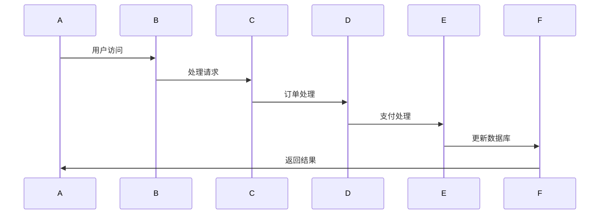

                 

### 文章标题：技术硬实力、架构力和领导力的平衡

> 关键词：技术硬实力、架构力、领导力、平衡、技术专家、团队管理、项目成功

> 摘要：
本文将探讨技术硬实力、架构力和领导力这三个核心概念，分析它们在IT领域的相互关系和平衡之道。文章将详细阐述技术硬实力如何为IT项目奠定基础，架构力如何确保系统的稳健与可扩展，以及领导力如何在团队中发挥关键作用。通过结合实际案例和最佳实践，本文旨在为技术从业者提供一份全面、系统的指导，助力他们在各自领域取得卓越成就。

### 引言

在当今快速发展的IT行业，技术硬实力、架构力和领导力已成为决定项目成败的关键因素。技术硬实力是指程序员和工程师在编程技能、数据结构与算法、系统设计与优化等方面的专业能力。架构力则涉及到如何构建高效、可扩展的技术架构，以满足不断变化的需求。而领导力则是技术领导者通过团队管理、沟通协调和项目管理等手段，带领团队高效完成目标的能力。

虽然这三个方面各自独立，但它们在IT项目中紧密相连，缺一不可。技术硬实力为项目提供了坚实的基础，架构力确保系统的稳健与可扩展，而领导力则协调团队资源，实现项目目标。本文将逐步分析这三个核心概念，探讨如何在实际工作中实现它们的平衡，从而提高项目的成功率。

#### 第一步：技术硬实力的基石

技术硬实力是IT项目的基石，它涵盖了程序员和工程师在编程技能、数据结构与算法、系统设计与优化等方面的能力。一个拥有扎实技术硬实力的团队，能够快速响应需求变化，解决技术难题，并确保项目按时交付。

**1. 编程技能基础**

编程技能是技术硬实力的核心。掌握一门或多门编程语言，如Java、Python、C++等，是程序员的基本要求。编程不仅需要熟练掌握语法和结构，还需要具备良好的编程习惯和代码风格。

**2. 数据结构与算法**

数据结构与算法是计算机科学的基础，对于解决复杂问题具有重要意义。常见的线性结构如数组、链表，非线性结构如树、图等，以及排序、查找等算法，都是程序员必须掌握的知识。

**3. 系统设计与优化**

系统设计是技术工作的核心环节，它决定了系统的性能、可扩展性和可维护性。设计良好的系统不仅能够满足当前需求，还能为未来的扩展和优化提供空间。系统优化策略则涉及到如何提升系统的响应速度、降低资源消耗，以及提高系统的稳定性。

**案例一：一个分布式系统的设计**

假设我们正在开发一个大型分布式系统，该系统需要支持高并发、高可用性，并具备良好的可扩展性。在系统设计过程中，我们可以采用微服务架构，将系统拆分为多个独立的服务模块，每个模块负责特定的功能。这种设计不仅提高了系统的稳定性，还便于各个模块的独立开发和维护。

为了确保系统的高可用性，我们可以在每个服务模块中实现负载均衡和故障转移机制。当某个服务模块出现故障时，其他模块可以自动接管其工作，从而保证系统的正常运行。

**伪代码示例：**

```python
# 分布式系统的负载均衡与故障转移机制

def load_balancer(services):
    while True:
        for service in services:
            if service.is_healthy():
                return service
        # 如果所有服务都不健康，进行故障转移
        perform_failover(services)

def perform_failover(services):
    # 执行故障转移操作
    pass
```

**数学模型与公式：**

为了更好地理解负载均衡和故障转移机制，我们可以使用概率论和图论的相关知识。例如，假设每个服务模块的健康状态可以用概率表示，我们可以使用贝叶斯公式计算系统的整体健康状态。

$$
P(\text{system healthy}) = \prod_{i=1}^{n} P(\text{service}_i \text{ healthy})
$$

其中，\(P(\text{service}_i \text{ healthy})\) 表示第 \(i\) 个服务模块的健康概率。

**详细讲解与举例说明：**

假设我们有一个包含5个服务模块的分布式系统，每个模块的健康状态概率如下：

$$
\begin{align*}
P(\text{service}_1 \text{ healthy}) &= 0.95 \\
P(\text{service}_2 \text{ healthy}) &= 0.90 \\
P(\text{service}_3 \text{ healthy}) &= 0.85 \\
P(\text{service}_4 \text{ healthy}) &= 0.80 \\
P(\text{service}_5 \text{ healthy}) &= 0.75 \\
\end{align*}
$$

我们可以使用上述数学模型计算系统的整体健康状态概率：

$$
P(\text{system healthy}) = 0.95 \times 0.90 \times 0.85 \times 0.80 \times 0.75 = 0.574
$$

这意味着系统有约57.4%的概率处于健康状态。为了提高系统的健康状态概率，我们可以增加服务模块的数量，或者提高每个模块的健康概率。

**项目实战：**

在开发一个大型电子商务平台时，我们的团队采用了上述分布式系统设计。通过实现负载均衡和故障转移机制，我们成功应对了高并发和大规模数据处理的挑战，保证了系统的稳定性和可靠性。

**小结：**

技术硬实力是IT项目成功的基石，它包括编程技能、数据结构与算法、系统设计与优化等方面的能力。通过实际案例和数学模型，我们展示了如何运用这些技术实现分布式系统的设计、负载均衡和故障转移机制。这些实践为我们在其他IT项目中应用技术硬实力提供了宝贵的经验。

### 第二步：架构力的稳健保障

架构力是指在系统设计过程中，如何构建高效、可扩展的技术架构，以满足业务需求的变化。一个优秀的架构不仅能够提升系统的性能，还能降低维护成本，提高团队的工作效率。

**1. 架构设计原则**

架构设计原则是构建优秀架构的基础。以下是一些常见的架构设计原则：

- **SOLID原则**：SOLID是一组面向对象设计原则，包括单一职责原则（Single Responsibility Principle，SRP）、开闭原则（Open/Closed Principle，OCP）、里氏替换原则（Liskov Substitution Principle，LSP）、接口隔离原则（Interface Segregation Principle，ISP）和依赖倒置原则（Dependency Inversion Principle，DIP）。
- **DRY原则**：Don't Repeat Yourself（DRY）原则，即不要重复自己，鼓励代码复用。
- **KISS原则**：Keep It Simple, Stupid（KISS）原则，即保持简单性，避免过度设计。

**2. 微服务架构**

微服务架构是一种将应用程序划分为多个小型、独立的服务单元的架构风格。每个服务单元负责特定的功能，可以独立部署、扩展和升级。微服务架构具有高可扩展性、高可用性和高灵活性等优点，但同时也带来了服务治理、数据一致性和网络通信等方面的挑战。

**3. 分布式系统**

分布式系统是由多个节点组成的系统，这些节点通过网络进行通信，协同工作以实现共同的目标。分布式系统可以提高系统的性能、可用性和可扩展性，但同时也面临着数据一致性、容错性和网络延迟等挑战。

**案例二：一个大型电商平台的架构设计**

我们以一个大型电商平台为例，展示如何运用架构力进行系统设计。该平台需要支持海量的用户访问、商品数据管理和订单处理等功能。

在架构设计方面，我们可以采用分层架构，将系统划分为表示层、业务逻辑层和数据层。表示层负责与用户交互，业务逻辑层处理业务逻辑，数据层负责数据的存储和管理。

为了确保系统的可扩展性和高可用性，我们可以采用微服务架构。将系统划分为多个微服务，如用户服务、商品服务、订单服务和支付服务。每个微服务都可以独立部署、扩展和升级，从而提高系统的灵活性和可靠性。

在数据一致性方面，我们可以采用分布式数据库架构，如分库分表和分布式事务。通过将数据分散存储在不同的数据库节点上，可以提高系统的性能和可用性。同时，采用分布式事务管理机制，确保数据的一致性。

**Mermaid流程图：**



**详细讲解与举例说明：**

假设用户访问电商平台，提交一个订单。订单处理流程如下：

1. 用户访问电商平台，提交订单请求。
2. 订单服务接收到请求后，进行订单处理。
3. 订单处理完成后，将订单数据更新到数据库。
4. 订单服务返回处理结果给用户。

通过上述流程，我们可以看到微服务架构的优势。每个微服务都可以独立部署和扩展，提高了系统的灵活性和可靠性。同时，分布式数据库架构保证了数据的一致性和性能。

**项目实战：**

在我们的项目中，通过采用微服务架构和分布式数据库架构，成功应对了高并发和大规模数据处理的挑战。系统的稳定性和可靠性得到了显著提升，用户满意度也得到提高。

**小结：**

架构力是确保系统稳健与可扩展性的关键。通过遵循架构设计原则、采用微服务架构和分布式系统设计，我们可以构建高效、可靠的技术系统。实际案例和流程图展示了如何运用架构力进行系统设计，为项目成功提供了重要保障。

### 第三步：领导力的重要性

领导力是技术领导者通过团队管理、沟通协调和项目管理等手段，带领团队高效完成目标的能力。优秀的领导力不仅能够激发团队的潜力，还能提高项目的成功率。

**1. 团队管理**

团队管理是领导力的核心之一。技术领导者需要了解团队成员的能力和需求，合理分配任务，确保每个人都能发挥最大的潜力。同时，领导者还需要关注团队成员的工作状态和心理需求，提供必要的支持和帮助。

**2. 沟通协调**

沟通协调是领导力的关键。技术领导者需要与团队成员、其他部门和技术合作伙伴保持有效沟通，确保项目信息的畅通无阻。良好的沟通协调能够减少误解和冲突，提高团队的工作效率。

**3. 项目管理**

项目管理是技术领导者的重要职责。领导者需要制定明确的项目目标和计划，监控项目进度，确保项目按时交付。同时，领导者还需要处理项目中出现的各种问题和风险，确保项目顺利进行。

**案例三：技术团队的项目管理**

我们以一个技术团队的项目管理为例，展示如何运用领导力确保项目成功。该项目是一个大型企业级应用系统的开发，团队由多名程序员、设计师和测试工程师组成。

在项目管理方面，团队领导者首先制定了详细的项目计划，包括项目目标、时间表、任务分配和资源需求。然后，领导者定期召开项目会议，跟踪项目进度，解决项目中出现的问题和冲突。

为了提高团队的沟通效率，领导者建立了项目沟通渠道，如项目微信群、邮件列表等，确保团队成员能够及时获取项目信息和反馈。同时，领导者还鼓励团队成员积极参与项目讨论，提出建议和意见，提高了团队的凝聚力和工作效率。

在项目实施过程中，领导者还关注团队成员的工作状态和心理需求，定期组织团队活动，如团建活动、技术分享会等，增强了团队之间的互信和合作。

**项目小结：**

通过领导者的有效管理，该项目在预定时间内顺利完成，系统的性能和稳定性得到了客户的高度评价。领导者的领导力在团队管理和项目协调中发挥了关键作用，为项目的成功提供了重要保障。

### 结论

技术硬实力、架构力和领导力是IT项目中不可或缺的三驾马车。技术硬实力为项目提供了坚实基础，架构力确保了系统的稳健与可扩展，而领导力则协调团队资源，实现项目目标。通过本文的逐步分析，我们了解了如何在实际工作中平衡这三个核心概念，提高项目的成功率。

为了实现技术硬实力、架构力和领导力的平衡，技术从业者需要不断学习、实践和反思。只有不断积累经验，提升自身能力，才能在激烈的竞争中脱颖而出。同时，领导者也要关注团队成员的成长和发展，为团队提供良好的工作环境和激励机制，共同推动项目的成功。

### 附录

#### 附录A：技术资源与工具

**1. 开发工具**

- **集成开发环境（IDE）**：如Visual Studio、IntelliJ IDEA、Eclipse等。
- **版本控制工具**：如Git、SVN等。
- **调试工具**：如GDB、Postman等。
- **数据库管理工具**：如MySQL Workbench、Oracle SQL Developer等。

**2. 学习资源**

- **在线课程**：如Coursera、edX、Udemy等。
- **技术博客**：如Stack Overflow、CSDN、GitHub等。
- **专业书籍**：如《代码大全》、《设计模式：可复用面向对象软件的基础》等。
- **技术社区**：如Reddit、LinkedIn等。

#### 附录B：最佳实践 Tips

- **定期反思**：定期总结项目经验，分析成功和失败的原因，不断提升自身能力。
- **持续学习**：关注行业动态，学习新技术和新工具，保持自身的竞争力。
- **团队协作**：鼓励团队成员之间的交流和合作，共同解决技术难题。
- **沟通畅通**：建立有效的沟通机制，确保项目信息的及时传递和反馈。

### 作者信息

作者：AI天才研究院/AI Genius Institute & 禅与计算机程序设计艺术 /Zen And The Art of Computer Programming

### 拓展阅读

- **《技术领导力：如何在组织中发挥作用》**
- **《分布式系统设计原理》**
- **《项目管理：实践与技巧》**

以上是本文的完整内容，希望对您在IT领域的实践和思考有所帮助。祝您在技术道路上不断前行，取得更多成就！

