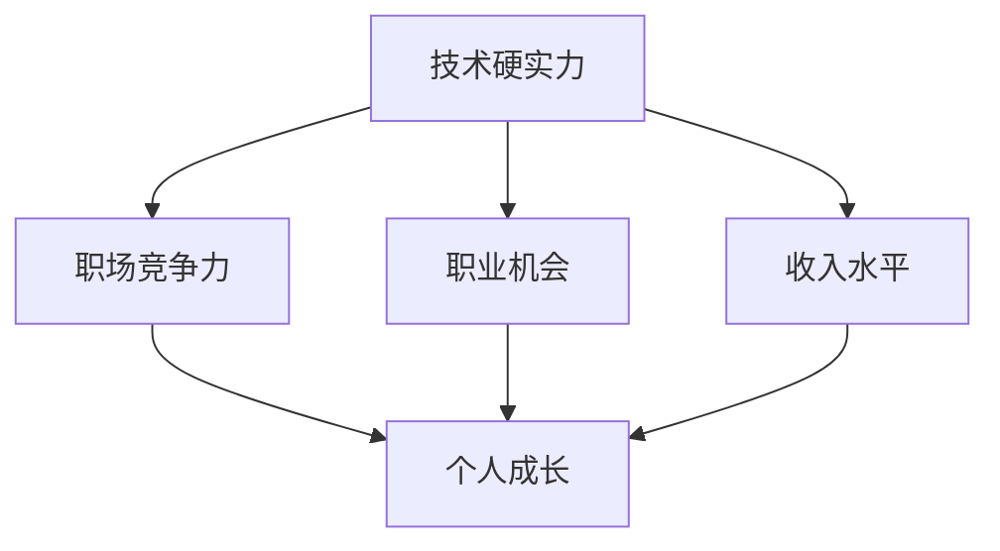
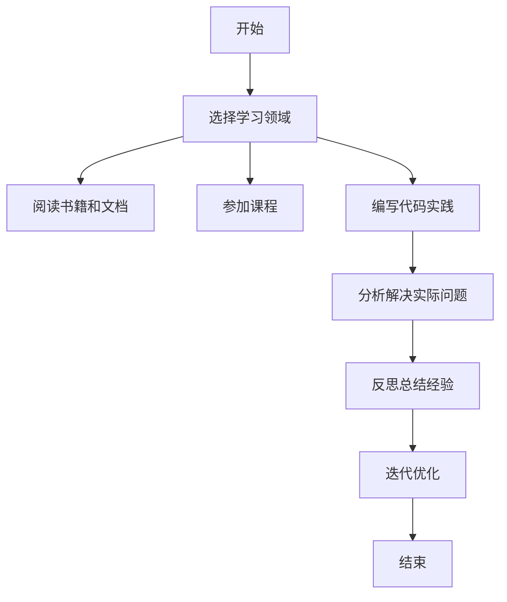

                 

## 引言

在当今这个数字化时代，技术的进步和应用已经渗透到了我们生活的方方面面。无论是互联网、人工智能，还是大数据，技术都已经成为驱动社会发展的重要引擎。而在这个技术驱动的时代，技术硬实力的重要性愈发凸显。本文旨在探讨技术硬实力对个人和职业发展的重要性，分析其定义和分类，以及其在不同行业中的应用，进而探讨其未来趋势。

### 技术硬实力的定义和重要性

技术硬实力，顾名思义，是指个人在特定技术领域内具备的硬性技能和知识储备。它不仅包括编程能力、算法理解、数据结构知识，还涉及对硬件、软件、网络等底层技术原理的深刻理解。技术硬实力的重要性主要体现在以下几个方面：

1. **提升职场竞争力**：在竞争激烈的职场中，具备过硬的技术硬实力意味着你能够更好地完成工作任务，解决复杂问题，从而在众多求职者中脱颖而出。

2. **增加职业机会**：技术硬实力是打开职场大门的钥匙。掌握多种技术技能的人，往往能够在不同行业找到工作机会，拥有更广阔的职业发展空间。

3. **提高收入水平**：技术硬实力与薪资水平呈正相关。具备高超技术硬实力的人，往往能够获得更高的薪酬和奖金。

4. **推动个人成长**：技术硬实力的提升不仅能够带来职业上的成功，还能推动个人在技术领域的深入探索，促进个人成长和自我实现。

### 技术硬实力的核心概念和联系

为了更好地理解技术硬实力的概念，我们可以借助Mermaid流程图来展示技术硬实力与个人职业发展之间的关系。



从这个流程图中，我们可以看到技术硬实力是推动个人职业发展的核心动力。通过提升技术硬实力，个人不仅能够提升职场竞争力，增加职业机会，提高收入水平，还能够推动个人成长和自我实现。

### 技术硬实力对个人和职业发展的影响

技术硬实力对个人和职业发展的影响是深远且广泛的。以下从几个方面详细阐述：

#### 提升职场竞争力

在职场中，技术硬实力是衡量个人能力的重要标准之一。具备强大技术硬实力的人，能够在短时间内理解并解决复杂问题，从而提高工作效率。这种高效的工作能力，使得他们在面对竞争激烈的职场时，能够脱颖而出。

#### 增加职业机会

技术硬实力的提升不仅能够增强在职场的竞争力，还能为个人打开更多职业机会。掌握多种技术技能的人，往往能够胜任不同领域的工作，从而拥有更广阔的职业发展空间。

#### 提高收入水平

技术硬实力与薪资水平呈正相关。在许多行业中，技术硬实力高超的人，往往能够获得更高的薪酬和奖金。这种薪资差异，不仅体现在初入职场的薪资上，还体现在职业晋升和绩效奖金等方面。

#### 推动个人成长

技术硬实力的提升不仅能够带来职业上的成功，还能推动个人在技术领域的深入探索，促进个人成长和自我实现。通过不断学习和实践，个人能够不断提高自己的技术水平，从而在职场中取得更大的成就。

### 技术硬实力的培养和提升方法

#### 技术硬实力培养的伪代码

为了培养和提高技术硬实力，我们可以设计一个简单的伪代码框架，以便更好地理解培养过程。

```plaintext
function 培养技术硬实力（技能集）：
    初始化技能集
    选择学习领域
    阅读相关书籍和文档
    参加线上或线下课程
    编写代码实践
    分析和解决实际问题
    反思和总结经验
    不断迭代和优化
    返回技能集
```

#### 技术硬实力提升的数学模型

为了量化技术硬实力的提升过程，我们可以引入一个简单的数学模型。假设技术硬实力的提升与学习时间、实践次数和问题解决能力成正比，可以用以下公式表示：

$$
技术硬实力 = f(学习时间, 实践次数, 问题解决能力)
$$

其中，$f$ 是一个非线性函数，用于描述技能的提升过程。为了简化模型，我们可以将其表示为：

$$
技术硬实力 = k \times 学习时间 \times 实践次数 \times 问题解决能力
$$

其中，$k$ 是一个常数，表示技能提升的效率。通过不断学习和实践，我们可以逐步提升自己的技术硬实力。

#### 技术硬实力提升的Mermaid流程图

为了更好地展示技术硬实力的提升过程，我们可以借助Mermaid流程图来描述。



### 技术硬实力在不同行业中的应用

技术硬实力不仅对个人职业发展有重要影响，还在不同行业中发挥着关键作用。以下从几个方面探讨技术硬实力在IT行业、金融行业等中的应用。

#### IT行业中的应用

在IT行业，技术硬实力是软件开发、系统运维、网络安全等岗位的核心能力。具备强大的技术硬实力，能够帮助IT从业者更好地应对复杂的技术问题，提高系统稳定性，保障网络安全。

#### 金融行业中的应用

在金融行业，技术硬实力广泛应用于金融分析、量化交易、风险管理等领域。具备强大技术硬实力的金融从业者，能够通过数据分析，发现市场规律，提高投资决策的准确性。

#### 其他行业中的应用

除了IT和金融行业，技术硬实力在其他行业中也具有广泛应用。例如，在制造业，技术硬实力可以帮助从业者更好地掌握自动化技术，提高生产效率；在医疗行业，技术硬实力可以帮助医生更好地利用医疗数据，提高诊断和治疗效果。

### 技术硬实力的未来趋势

随着技术的不断进步，技术硬实力在未来将继续发挥重要作用。以下从几个方面探讨技术硬实力的未来趋势：

#### 人工智能和大数据的深入应用

人工智能和大数据技术的快速发展，将进一步提高技术硬实力的要求。未来，具备人工智能和大数据技术硬实力的人才，将更加受到市场的青睐。

#### 跨学科融合

随着技术的发展，不同学科之间的融合将越来越紧密。具备跨学科技术硬实力的人，将在未来的职场中具有更大的竞争优势。

#### 线上教育的普及

随着线上教育的普及，个人将更加容易获取技术硬实力的培训资源。未来，通过线上学习，个人可以更加灵活地提升自己的技术硬实力。

### 结论

技术硬实力在当今数字化时代的重要性不可忽视。通过不断提升技术硬实力，个人不仅能够提升职业竞争力，增加职业机会，提高收入水平，还能推动个人成长和自我实现。技术硬实力的培养和提升需要长期的努力和实践。在未来，随着技术的不断进步，技术硬实力将继续在各个领域发挥关键作用。让我们共同努力，提升自己的技术硬实力，迎接未来的挑战。

### 附录

#### 技术硬实力学习资源推荐

为了帮助大家更好地提升技术硬实力，我们推荐以下学习资源：

1. **书籍**：
   - 《深度学习》（Deep Learning） by Ian Goodfellow、Yoshua Bengio和Aaron Courville
   - 《编程珠玑》（The Art of Computer Programming） by Donald E. Knuth
   - 《人工智能：一种现代的方法》（Artificial Intelligence: A Modern Approach） by Stuart J. Russell和Peter Norvig

2. **在线课程**：
   - Coursera上的《机器学习》（Machine Learning）课程
   - Udacity上的《数据科学与大数据技术》课程
   - edX上的《深度学习基础》（Foundations of Deep Learning）课程

3. **实践项目**：
   - Kaggle上的数据科学竞赛
   - GitHub上的开源项目
   - 个人项目，如构建一个简单的Web应用程序或数据分析项目

通过利用这些资源，我们可以系统地提升自己的技术硬实力，为未来的职业发展打下坚实的基础。

### 最佳实践 tips、小结、注意事项、拓展阅读等内容

#### 最佳实践 tips

1. **持续学习**：技术日新月异，持续学习是提升技术硬实力的关键。定期阅读技术书籍、关注技术博客、参加技术会议和研讨会。

2. **实践出真知**：理论知识需要通过实践来巩固。尝试参与开源项目、进行个人项目实践，将所学知识应用于实际问题的解决。

3. **团队合作**：在团队合作中，可以学习他人的编程风格和解决问题的方法，提高自己的技术能力。

4. **分享知识**：通过教学他人，可以加深对知识的理解和记忆，同时也能建立自己的技术声誉。

#### 小结

技术硬实力是个人在技术领域的核心竞争力，对于职业发展和个人成长具有重要意义。通过持续学习、实践和团队合作，我们可以不断提升自己的技术硬实力，迎接未来的挑战。

#### 注意事项

1. **避免盲目跟风**：在选择学习路径和项目实践时，应结合自己的兴趣和职业规划，避免盲目跟风。

2. **注意理论与实践的结合**：在学习过程中，要注重理论知识与实际操作的结合，避免只学理论而不动手实践。

3. **保持耐心和毅力**：技术硬实力的提升是一个长期过程，需要耐心和毅力。遇到困难时，不要轻易放弃。

#### 拓展阅读

- 《技术领导力：打造高效团队》 by Selena Dehne
- 《程序员修炼之道：从小工到专家》 by Andrew B. Hunt和David Thomas
- 《软件工程：实践者的研究方法》 by Roger S. Pressman和Bruce R. Maxim

通过阅读这些拓展资料，我们可以进一步了解技术硬实力在职业发展中的重要性，以及如何通过有效的学习和实践方法来提升自己的技术能力。作者：AI天才研究院/AI Genius Institute & 禅与计算机程序设计艺术 /Zen And The Art of Computer Programming

---
### 撰写技术博客的具体步骤

撰写一篇高质量的技术博客文章，需要经过一系列的精心设计和细致的执行步骤。以下是一步一步的详细指南：

#### 1. 确定主题和目标读者

- **步骤**：首先，确定你想要写的主题。这个主题应该是你熟悉且有兴趣的，这样在写作过程中会更加顺畅。同时，确定你的目标读者。他们是初学者、中级开发者还是高级专家？
- **理由**：明确主题和读者有助于决定文章的风格、深度和语言，从而确保文章能够吸引并满足目标读者的需求。

#### 2. 收集资料和调研

- **步骤**：在确定主题后，开始收集相关的资料。这包括查找相关的书籍、文章、在线课程和权威网站。同时，进行实际调研，比如查找相关项目或案例，以便更好地支持你的论点。
- **理由**：丰富的资料和实际案例能够为你的文章提供有力的支持，使文章内容更加有说服力和可信度。

#### 3. 制定大纲

- **步骤**：在收集资料后，制定一个详细的写作大纲。大纲应包括引言、核心章节、结论和附录等部分。每个章节都要有明确的小节和标题。
- **理由**：一个清晰的大纲能够帮助你组织思路，确保文章的结构合理、逻辑严密。

#### 4. 编写初稿

- **步骤**：根据大纲，开始撰写文章的初稿。初稿不需要完全完美，重点是先把想法和内容表达出来。
- **理由**：初稿阶段主要是为了记录你的思考和内容，后续可以进行修改和完善。

#### 5. 结构优化和内容润色

- **步骤**：在初稿完成后，对文章进行结构优化和内容润色。检查文章的逻辑结构是否合理，内容是否连贯，是否有冗余或重复的部分。
- **理由**：结构优化和内容润色能够使文章更加紧凑、条理清晰，提升文章的整体质量。

#### 6. 添加代码示例和解释

- **步骤**：如果文章中包含技术细节或代码示例，确保它们是正确的，并且能够清晰地解释代码的作用和实现方法。
- **理由**：代码示例和详细的解释能够帮助读者更好地理解技术概念，提升文章的实用性。

#### 7. 审阅和修改

- **步骤**：完成初稿和修改后，进行审阅和修改。可以请同行或导师帮忙审阅，以获得不同的视角和建议。
- **理由**：审阅和修改能够帮助你发现文章中的错误和不妥之处，进一步提升文章的质量。

#### 8. 添加图表和视觉元素

- **步骤**：在文章中添加相关的图表、流程图和代码截图等视觉元素，以增强文章的可读性和吸引力。
- **理由**：视觉元素能够使文章更加生动，帮助读者更好地理解和记忆文章内容。

#### 9. 最终校对和格式调整

- **步骤**：完成所有修改后，进行最终校对。确保没有错别字、语法错误，格式符合规范，如markdown格式等。
- **理由**：最终校对能够确保文章的准确性和专业性，提升文章的整体质量。

#### 10. 发布和推广

- **步骤**：将文章发布到技术博客或相关平台，并利用社交媒体、邮件列表等渠道进行推广，吸引更多的读者。
- **理由**：发布和推广能够使你的文章被更多人看到，提升你的影响力。

### 总结

撰写一篇高质量的技术博客文章需要充分的准备和细致的执行。通过确定主题、收集资料、制定大纲、编写初稿、结构优化、内容润色、代码示例添加、审阅修改、添加视觉元素、最终校对和发布推广等一系列步骤，你可以确保文章既有深度又有广度，为读者提供有价值的信息和见解。这个过程不仅能够提升你的写作技巧，还能增强你的技术理解和表达能力。作者：AI天才研究院/AI Genius Institute & 禅与计算机程序设计艺术 /Zen And The Art of Computer Programming

