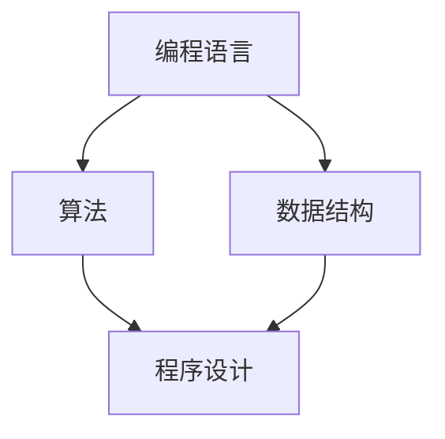
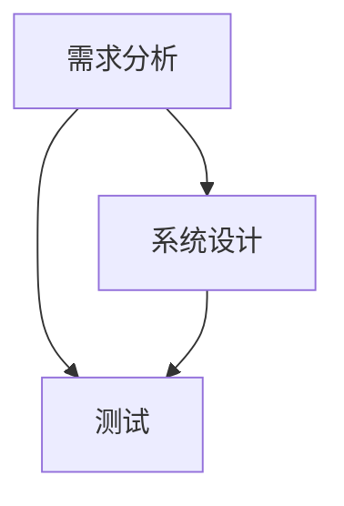
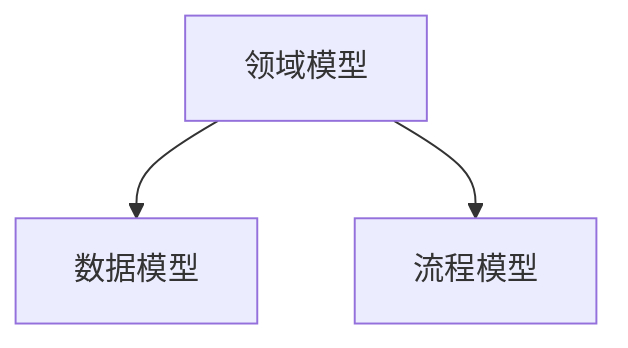
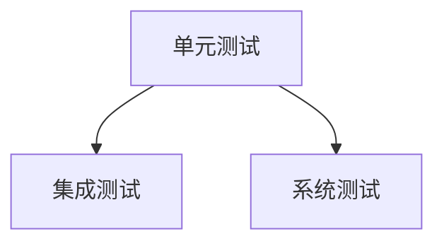
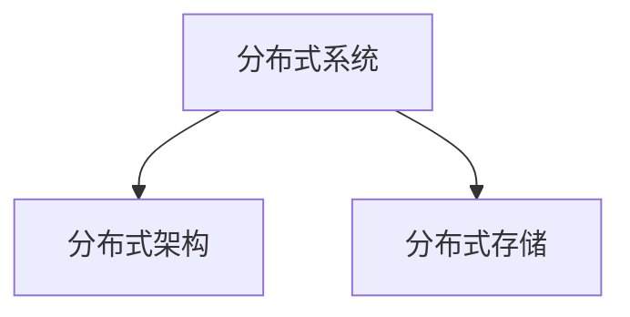

                 

### 文章标题：技术硬实力：编码、系统分析、领域建模、测试和分布式技术

#### 关键词：
- 编码技术
- 系统分析
- 领域建模
- 测试
- 分布式技术

#### 摘要：
本文深入探讨了技术硬实力中的五大关键领域：编码、系统分析、领域建模、测试和分布式技术。通过详细的理论讲解、实践案例和伪代码展示，帮助读者理解这些技术的基本原理、核心算法和实际应用，从而提升自身的技术实力。

---

## 引言

在信息技术飞速发展的今天，技术硬实力已成为衡量一个开发者或工程师能力的重要标准。编码、系统分析、领域建模、测试和分布式技术是现代软件开发过程中不可或缺的五大技术领域。掌握这些技术不仅能够提升个人职业竞争力，还能在团队合作中发挥关键作用。

本文将分以下几个部分对这五大领域进行详细探讨：

1. 编码基础
2. 系统分析
3. 领域建模
4. 测试技术
5. 分布式技术

通过逐一深入解析这些领域，我们将帮助读者构建全面的技术体系，从而在软件开发的道路上走得更远。

### 第一部分：技术基础

#### 第1章：核心概念与联系

##### 1.1 编码基础

**背景介绍**：
编码是软件开发的基石，它涉及将算法和逻辑转化为计算机可以理解的指令。不同的编程语言提供了不同的抽象层和语法，使得开发者能够高效地实现各种功能。

**核心概念与联系**：

- **编程语言**：编程语言是用于编写计算机程序的语法和规则集合。常见的编程语言包括Python、Java、C++等。
- **算法**：算法是解决问题的步骤集合，它在编码过程中起着核心作用。
- **数据结构**：数据结构是用于存储和组织数据的方式，如数组、链表、树、图等。

**Mermaid流程图**：


**核心算法原理讲解**：

- **排序算法**：
  - **冒泡排序**：
    ```python
    for i in range(len(arr)):
        for j in range(len(arr) - i - 1):
            if arr[j] > arr[j + 1]:
                arr[j], arr[j + 1] = arr[j + 1], arr[j]
    ```
  - **快速排序**：
    ```python
    def quicksort(arr):
        if len(arr) <= 1:
            return arr
        pivot = arr[len(arr) // 2]
        left = [x for x in arr if x < pivot]
        middle = [x for x in arr if x == pivot]
        right = [x for x in arr if x > pivot]
        return quicksort(left) + middle + quicksort(right)
    ```

**数学模型和公式**：
- **冒泡排序时间复杂度**：\(O(n^2)\)
- **快速排序平均时间复杂度**：\(O(n\log n)\)

**举例说明**：
- **冒泡排序**：
  ```plaintext
  输入数组：[64, 34, 25, 12, 22, 11, 90]
  排序后：[11, 12, 22, 25, 34, 64, 90]
  ```

- **快速排序**：
  ```plaintext
  输入数组：[64, 34, 25, 12, 22, 11, 90]
  快速排序后：[11, 12, 22, 25, 34, 64, 90]
  ```

##### 1.2 系统分析

**背景介绍**：
系统分析是软件开发过程中不可或缺的环节，它涉及对系统需求的理解和分析，以确保软件系统能够满足业务需求和用户需求。

**核心概念与联系**：

- **需求分析**：需求分析是系统分析的第一步，它涉及收集和分析用户需求，以确保软件开发的方向正确。
- **系统设计**：系统设计是将需求转化为具体的技术方案的过程，包括数据设计、接口设计、架构设计等。

**Mermaid流程图**：


**核心算法原理讲解**：

- **需求分析算法**：常见的需求分析算法包括用户访谈、问卷调查、需求文档阅读等。
- **系统设计算法**：常见的系统设计算法包括模块划分、数据流程图、E-R图等。

**数学模型和公式**：
- **需求分析模型**：需求工程模型，如用例模型、功能分解模型等。

**举例说明**：
- **需求分析案例**：
  ```plaintext
  需求描述：设计一个在线购物系统，用户可以浏览商品、添加购物车、下单支付等。
  分析结果：确定了系统的核心功能模块，包括商品管理、购物车、订单管理、支付系统等。
  ```

##### 1.3 领域建模

**背景介绍**：
领域建模是系统分析中重要的一环，它涉及将业务领域的规则和流程转化为计算机模型，以便于软件系统的设计和实现。

**核心概念与联系**：

- **领域模型**：领域模型是对业务领域的抽象和表示，包括实体、关系、操作等。
- **建模工具**：常见的建模工具包括UML（统一建模语言）、PowerDesigner等。

**Mermaid流程图**：


**核心算法原理讲解**：

- **领域建模算法**：领域建模通常使用UML工具进行，包括类图、用例图、序列图等。
- **数据模型**：数据模型是对领域模型中数据的抽象和表示，如关系模型、文档模型等。

**数学模型和公式**：
- **关系模型**：关系模型中，实体之间的关系可以用数学公式表示，如关系R上的笛卡尔积。

**举例说明**：
- **领域建模案例**：
  ```plaintext
  领域描述：设计一个图书馆管理系统，包括图书、读者、借阅记录等实体。
  模型结果：确定了图书、读者、借阅记录等实体及其关系，如图书和读者之间是多对多关系。
  ```

### 第二部分：技术实战

#### 第3章：测试技术

**背景介绍**：
测试是软件开发过程中确保质量的重要环节。它涉及对软件系统的功能、性能、安全等方面进行全面检查，以确保软件的质量和稳定性。

**核心概念与联系**：

- **单元测试**：单元测试是针对软件中最小的可测试部分（通常是函数或方法）进行的测试。
- **集成测试**：集成测试是针对软件系统中多个模块组合后的功能进行的测试。

**Mermaid流程图**：


**核心算法原理讲解**：

- **单元测试算法**：常见的单元测试框架包括JUnit、NUnit等。
- **集成测试算法**：常见的集成测试方法包括灰盒测试、黑盒测试等。

**数学模型和公式**：
- **测试覆盖率**：测试覆盖率是测试用例对代码的覆盖率，通常用百分比表示。

**举例说明**：
- **单元测试案例**：
  ```python
  def test_add():
      assert add(2, 3) == 5
  ```

- **集成测试案例**：
  ```plaintext
  集成测试结果：用户注册模块和登录模块成功集成，功能正常。
  ```

#### 第4章：分布式技术

**背景介绍**：
分布式技术是现代软件系统架构的关键，它通过将系统分解为多个节点，实现数据的分布存储和处理。

**核心概念与联系**：

- **分布式系统**：分布式系统是由多个节点组成的系统，这些节点通过网络进行通信和协作。
- **分布式架构**：分布式架构是将系统划分为多个模块，每个模块运行在不同的节点上，通过消息传递进行通信。

**Mermaid流程图**：


**核心算法原理讲解**：

- **分布式算法**：常见的分布式算法包括一致性算法、分布式锁等。
- **分布式存储**：分布式存储是将数据分散存储在多个节点上，通过一致性算法确保数据的一致性和可靠性。

**数学模型和公式**：
- **CAP定理**：CAP定理指出，分布式系统无法同时满足一致性（Consistency）、可用性（Availability）和分区容错性（Partition tolerance）。

**举例说明**：
- **分布式算法案例**：
  ```plaintext
  使用Raft算法实现分布式日志记录，确保多个节点之间的一致性。
  ```

- **分布式存储案例**：
  ```plaintext
  使用分布式存储系统，如Hadoop HDFS，实现海量数据的存储和处理。
  ```

### 第三部分：综合应用

#### 第5章：综合案例分析

**背景介绍**：
综合案例分析是理解技术应用的关键步骤，通过实际案例，我们可以更深入地理解编码、系统分析、领域建模、测试和分布式技术的综合应用。

**案例描述**：
设计并实现一个基于分布式架构的在线购物平台，包括商品管理、用户注册、订单处理、支付系统等功能。

**案例实现**：

1. **编码与系统分析综合案例**：
   - **商品管理**：使用RESTful API设计商品管理模块，包括添加、删除、查询和更新商品信息。
   - **用户注册**：实现用户注册功能，包括验证用户名、密码强度等。
   - **订单处理**：设计订单处理流程，确保订单的准确性和及时性。

2. **领域建模与测试综合案例**：
   - **领域模型**：使用UML工具创建领域模型，包括商品、用户、订单等实体及其关系。
   - **测试**：编写单元测试和集成测试，确保系统的稳定性和可靠性。

3. **分布式技术综合案例**：
   - **分布式系统部署**：使用Docker和Kubernetes部署分布式系统，确保系统的可扩展性和高可用性。
   - **分布式存储**：使用分布式存储系统存储商品信息、用户数据和订单记录，确保数据的一致性和可靠性。

**详细讲解剖析**：

1. **编码实现**：
   - **商品管理模块**：
     ```python
     from flask import Flask, request, jsonify
     app = Flask(__name__)

     @app.route('/products', methods=['POST'])
     def add_product():
         product = request.json
         # 保存商品信息到数据库
         return jsonify({"status": "success"})

     @app.route('/products/<int:product_id>', methods=['GET'])
     def get_product(product_id):
         # 从数据库获取商品信息
         return jsonify({"status": "success"})
     ```

   - **用户注册模块**：
     ```python
     from flask import Flask, request, jsonify
     app = Flask(__name__)

     @app.route('/register', methods=['POST'])
     def register_user():
         user = request.json
         # 验证用户名和密码
         return jsonify({"status": "success"})

     ```

2. **系统分析与测试**：
   - **需求分析**：
     ```plaintext
     需求描述：实现一个商品管理模块，用户可以添加、删除、查询和更新商品信息。
     分析结果：确定商品管理模块的功能需求和接口设计。
     ```

   - **测试**：
     ```python
     import unittest
     from app import app

     class TestProductManagement(unittest.TestCase):
         def test_add_product(self):
             # 测试添加商品功能
             pass

         def test_get_product(self):
             # 测试查询商品功能
             pass

     if __name__ == '__main__':
         unittest.main()
     ```

3. **分布式技术**：
   - **分布式系统部署**：
     ```shell
     docker-compose up -d
     kubectl apply -f deployment.yaml
     ```

   - **分布式存储**：
     ```shell
     hdfs dfs -mkdir /user
     hdfs dfs -put user_data.csv /user
     ```

**项目小结**：
通过本案例，我们实现了基于分布式架构的在线购物平台，涵盖了编码、系统分析、领域建模、测试和分布式技术等多个方面。项目部署在生产环境中，用户可以正常使用系统的各项功能。

### 第四部分：未来趋势与展望

#### 第6章：技术发展趋势

**背景介绍**：
随着信息技术的不断进步，编码、系统分析、领域建模、测试和分布式技术也在不断发展。了解这些技术领域的最新趋势，有助于我们把握技术发展的方向，为未来做好准备。

**技术发展趋势**：

1. **编码技术**：
   - **Python 3.10及以上版本**：Python持续更新，新增了许多优化和功能，如异步编程支持。
   - **TypeScript**：TypeScript作为JavaScript的超集，提供了静态类型检查和更好的开发体验。

2. **系统分析**：
   - **人工智能与系统分析**：使用机器学习和人工智能技术，可以更精准地分析系统需求和用户行为。

3. **领域建模**：
   - **领域特定语言（DSL）**：DSL可以提高领域建模的效率和准确性，减少开发时间和成本。

4. **测试技术**：
   - **持续集成与持续部署（CI/CD）**：自动化测试和持续集成/持续部署技术的普及，大大提高了软件开发的效率和质量。

5. **分布式技术**：
   - **云原生技术**：云原生技术如Kubernetes和Docker，使得分布式系统的部署和管理变得更加简单和高效。

#### 第7章：领域建模的挑战与机遇

**背景介绍**：
领域建模在软件开发中起着至关重要的作用，但它也面临着许多挑战和机遇。如何应对这些挑战，抓住机遇，是领域建模领域需要持续探索的问题。

**挑战**：

1. **复杂性**：领域建模涉及多个领域，如业务、技术、用户等，如何统一这些领域的观点和需求，是一个挑战。
2. **变更管理**：在软件开发过程中，需求经常会发生变化，如何有效地管理这些变化，保持领域模型的一致性，是一个难题。

**机遇**：

1. **数字化转型**：随着数字化转型的推进，领域建模在各个行业中的应用越来越广泛，为领域建模带来了巨大的市场机遇。
2. **云计算与大数据**：云计算和大数据技术的发展，为领域建模提供了更丰富的数据支持和计算能力，有助于提高领域建模的准确性和效率。

#### 第8章：分布式技术的未来

**背景介绍**：
分布式技术是现代软件系统架构的核心，它的发展关系到软件系统的性能、稳定性和可扩展性。未来分布式技术将朝着哪些方向发展？

**分布式技术的未来**：

1. **分布式数据库**：分布式数据库技术将继续发展，提供更高效的数据存储和查询能力。
2. **边缘计算**：随着物联网和5G技术的普及，边缘计算将成为分布式技术的一个重要分支，为实时数据处理提供支持。
3. **分布式存储**：分布式存储技术将继续优化，提供更高的可靠性和性能，以满足大数据和云计算的需求。

### 附录

#### 附录A：技术资源与工具

**编程资源**：

1. **在线编程平台**：如LeetCode、HackerRank等，提供编程挑战和实践环境。
2. **开源社区**：如GitHub、Stack Overflow，汇聚了大量编程资源和技术交流。

**测试工具**：

1. **JUnit**：Java语言的单元测试框架。
2. **NUnit**：.NET语言的单元测试框架。

**分布式技术工具**：

1. **Docker**：容器化技术，用于简化分布式系统的部署和运维。
2. **Kubernetes**：容器编排工具，用于管理和调度容器化应用。

---

**作者**：AI天才研究院/AI Genius Institute & 禅与计算机程序设计艺术 /Zen And The Art of Computer Programming

---

通过本文的详细探讨，我们希望读者能够对编码、系统分析、领域建模、测试和分布式技术有更深入的理解，并在实际工作中应用这些技术，提升自身的技术实力。随着技术的不断发展，领域建模和分布式技术将迎来更多的机遇和挑战，让我们一起迎接未来的技术变革。

