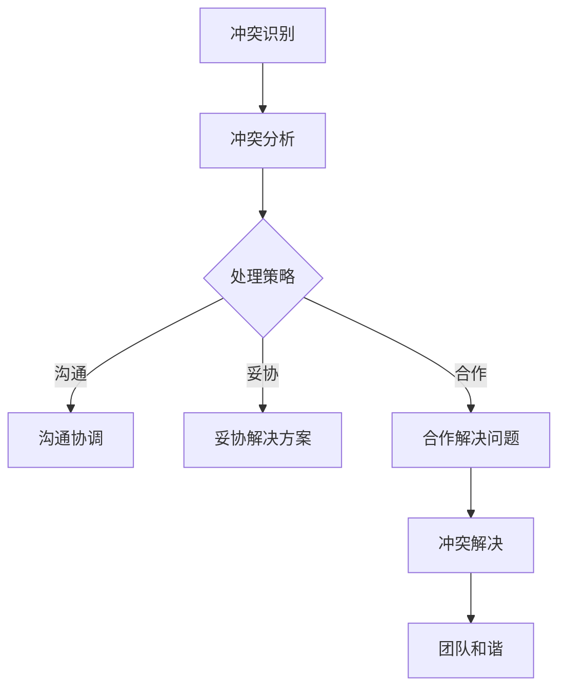

                 

### 文章标题：技术管理中的冲突处理技巧

> **关键词：** 技术管理、冲突处理、团队合作、领导力、项目管理、算法原理、实际案例。

**摘要：** 本文将深入探讨技术管理中的冲突处理技巧。首先，我们将介绍技术管理的基本概念及其在组织中的重要性。接着，我们分析冲突的常见类型和原因，并探讨冲突处理的基本原理和框架。随后，文章将详细讲解各种常见冲突的处理方法，从个人与团队层面到项目管理层面。此外，我们还将探讨领导力在冲突管理中的作用，并提供实战案例分析和实际操作技巧。最后，文章将对全文内容进行总结，并提出未来展望和最佳实践建议。

### 引言

在技术管理领域，冲突是不可避免的。无论是软件开发团队内部的技术分歧，还是项目进度延误引发的部门之间的矛盾，冲突的存在都可能导致团队效率降低、项目失败，甚至影响整个组织的运作。因此，掌握有效的冲突处理技巧对于技术管理者至关重要。

本文旨在为技术管理者提供一套系统化的冲突处理技巧，帮助他们在复杂的技术环境中保持团队和谐，提升项目管理效率。文章将从以下几个方面展开：

1. **技术管理基础**：介绍技术管理的定义、职责和发展趋势。
2. **冲突处理的原理与框架**：阐述冲突的定义、类型和处理的基本原理。
3. **常见冲突的处理方法**：详细讲解个人与团队的冲突、技术方案选择中的冲突、优先级分配中的冲突等常见冲突的处理方法。
4. **领导力与冲突管理**：探讨领导力在冲突管理中的关键作用。
5. **团队合作中的冲突处理**：分析团队合作中的冲突原因和处理策略。
6. **项目管理中的冲突管理**：讨论项目冲突的特点与处理方法。
7. **实战案例分析**：通过实际案例展示冲突处理技巧的应用。
8. **总结与展望**：总结全文内容，并提出未来展望和最佳实践建议。

通过这篇文章，读者将能够全面了解冲突处理的各个方面，提升自己在技术管理中的实战能力。接下来，我们将首先介绍技术管理的基础知识，为后续内容的展开打下基础。

### 技术管理基础

**定义与职责**

技术管理是指对技术团队和项目进行规划、组织、协调和控制的一系列管理活动，旨在确保项目目标的实现和团队的高效运作。技术管理的核心职责包括：

1. **项目规划**：制定项目计划，明确项目目标、范围、时间表和资源需求。
2. **团队管理**：搭建和管理技术团队，确保团队成员的能力和积极性。
3. **风险管理**：识别和应对项目中的潜在风险，确保项目顺利进行。
4. **质量管理**：确保项目交付符合质量标准，满足客户需求。
5. **沟通协调**：促进团队内部及与其他部门的沟通，确保项目顺利进行。

**发展趋势**

随着技术的快速发展和市场竞争的加剧，技术管理也在不断演进。以下是一些当前技术管理领域的主要发展趋势：

1. **数字化管理**：利用大数据、人工智能等技术进行项目管理和决策支持。
2. **敏捷开发**：采用敏捷开发方法，提高团队响应速度和适应性。
3. **跨职能团队**：打破部门壁垒，组建跨职能团队，提高项目协同效率。
4. **持续交付**：通过持续集成和持续交付，缩短产品迭代周期，提高市场响应速度。

**挑战与机遇**

技术管理的挑战主要来自于技术的快速更新和项目管理复杂度的增加。为了应对这些挑战，技术管理者需要不断提升自身能力，掌握以下技能：

1. **技术洞察力**：对新技术和新趋势有敏锐的洞察力，及时调整战略方向。
2. **领导力**：具备领导力，能够激励团队成员，协调不同利益相关者的需求。
3. **项目管理能力**：熟练掌握项目管理方法，确保项目按时按质完成。
4. **沟通协调能力**：具备良好的沟通协调能力，能够解决项目中的冲突和问题。

同时，技术管理也带来了许多机遇。通过有效的技术管理，组织可以更快地响应市场变化，提高产品竞争力，实现可持续发展。此外，技术管理的发展也为技术人才提供了广阔的职业发展空间。

### 冲突处理的原理与框架

在技术管理中，冲突是不可避免的。有效的冲突处理对于保持团队和谐、提升项目管理效率至关重要。本文将探讨冲突的定义、类型、处理原理和框架。

**定义与类型**

**冲突的定义**：冲突是指两个或多个利益相关者之间因目标、利益、价值观等方面的不一致而产生的紧张状态。在技术管理中，冲突通常表现为意见分歧、资源争夺、优先级争议等。

**冲突的类型**：

1. **个人与团队的冲突**：团队成员之间因个人性格、工作风格、价值观等因素导致的冲突。
2. **技术方案选择中的冲突**：在技术决策过程中，不同团队或成员因技术方案的不同而引发的冲突。
3. **优先级分配中的冲突**：项目资源有限，不同任务或项目的优先级不同，导致资源争夺和决策困难。

**处理原理**

**合作原则**：合作原则是冲突处理的核心。在处理冲突时，应尽量寻求共同点，达成共识，共同解决问题。

**沟通原则**：沟通是冲突处理的关键。有效的沟通可以消除误解，建立信任，促进问题的解决。

**尊重原则**：尊重是冲突处理的基础。在处理冲突时，应尊重每个人的意见和感受，避免指责和攻击。

**妥协原则**：在冲突无法完全解决时，妥协是一种有效的处理方式。通过妥协，可以暂时平息冲突，为后续解决问题创造条件。

**框架**

**冲突识别**：及时发现冲突，识别冲突类型和原因。

**冲突分析**：对冲突进行深入分析，理解冲突背后的动机和影响。

**冲突处理**：根据冲突类型和原因，采取相应的处理策略，如沟通、妥协、合作等。

**冲突解决**：通过有效的冲突处理，解决问题，达成共识，恢复团队和谐。

**流程图**

通过上述原理和框架，技术管理者可以有效地识别、分析和处理冲突，提升团队运作效率。接下来，我们将详细探讨常见冲突的处理方法。

### 常见冲突的处理方法

在技术管理过程中，冲突是不可避免的，但有效的处理方法可以缓解紧张局势，提高团队效率和项目成功率。以下将详细探讨几种常见冲突的处理方法。

#### 个人与团队的冲突

**原因分析**：

1. **个人性格与工作风格差异**：团队成员的性格和工作风格不同，可能导致沟通障碍和协作问题。
2. **职责分工不明确**：团队成员对职责分工的理解不一致，容易引发职责重叠或责任缺失。
3. **个人目标与团队目标冲突**：团队成员的个人目标和团队目标不一致，可能导致工作动力不足和团队凝聚力下降。

**处理方法**：

1. **开放沟通**：建立开放的沟通环境，鼓励团队成员表达意见和反馈，促进理解。
2. **明确职责**：明确团队成员的职责和任务，确保每个人都清楚自己的角色和责任。
3. **建立共同目标**：制定团队目标，确保个人目标与团队目标的一致性，提高团队凝聚力。

**案例分析**：

假设团队中有两位成员，A和B，他们性格和工作风格迥异。A倾向于细节导向，而B则更注重整体。在项目开发过程中，A和B因对代码质量的要求产生分歧。通过开放沟通，他们最终达成共识，A负责代码审查，B负责整体架构设计，有效地解决了冲突。

#### 技术方案选择中的冲突

**原因分析**：

1. **技术方向不一致**：不同团队或成员对技术发展方向有不同的看法，可能导致技术选择的分歧。
2. **资源分配不均**：项目资源有限，不同团队或成员对资源分配有不同的期望，容易引发资源争夺。
3. **风险评估不一致**：对项目风险的不同评估可能导致技术方案的选择不一致。

**处理方法**：

1. **技术评审**：组织技术评审会议，讨论不同技术方案的优缺点，达成共识。
2. **资源调配**：根据项目需求和资源情况，合理分配资源，确保每个团队或成员都能获得必要的资源。
3. **风险评估与决策**：对项目风险进行评估，制定风险应对策略，确保技术方案的选择具有可行性。

**案例分析**：

在一个大型项目中，团队A建议采用微服务架构，而团队B则倾向于使用传统的单体架构。通过技术评审，团队发现微服务架构在可扩展性和灵活性方面具有优势，但开发成本较高。经过讨论，团队决定采用微服务架构，并在开发过程中逐步优化，最终成功实施。

#### 优先级分配中的冲突

**原因分析**：

1. **项目任务重叠**：项目任务之间存在重叠，导致资源争夺和优先级争议。
2. **时间紧迫**：项目进度紧张，不同任务的时间安排冲突，可能导致任务优先级的不一致。
3. **利益相关者期望不一致**：不同利益相关者对项目任务的重要性有不同的期望，容易引发优先级争议。

**处理方法**：

1. **任务分解**：对项目任务进行详细分解，明确每个任务的优先级，确保任务的合理分配。
2. **沟通协调**：与利益相关者进行有效沟通，了解他们的需求和期望，确保任务优先级的合理性。
3. **动态调整**：根据项目进展和实际情况，动态调整任务优先级，确保项目进度的顺利进行。

**案例分析**：

在一个软件项目中，团队需要在两周内完成两个关键模块的开发。由于时间紧迫，团队决定将其中一个模块的优先级提高，集中资源和精力进行开发。同时，与利益相关者沟通，确保他们对优先级调整的理解和支持。

通过上述方法，技术管理者可以有效地处理各种常见冲突，提升团队协作效率和项目管理质量。在下一部分，我们将探讨领导力在冲突管理中的作用。

### 领导力与冲突管理

领导力在冲突管理中扮演着至关重要的角色。一个优秀的领导者不仅能够有效解决冲突，还能预防和减少冲突的发生，为团队创造和谐的工作环境。

#### 领导力对冲突管理的影响

**1. 情感管理能力**

领导者需要具备良好的情感管理能力，能够识别和应对团队成员的情感变化，缓解紧张情绪，避免冲突升级。通过情感共鸣和理解，领导者可以促进团队成员之间的信任和沟通，从而有效解决冲突。

**2. 沟通能力**

沟通是领导力的核心要素之一。领导者需要具备有效的沟通能力，能够清晰表达自己的想法，倾听团队成员的意见和需求，确保信息的准确传递和理解。通过有效的沟通，领导者可以消除误解，减少冲突发生的可能性。

**3. 决策能力**

在冲突管理中，领导者需要具备良好的决策能力。面对复杂的情况和多样的利益诉求，领导者需要能够迅速做出决策，权衡各方利益，确保决策的合理性和公正性。良好的决策能力有助于化解冲突，恢复团队的和谐。

**4. 领导风格**

领导风格对冲突管理有着重要的影响。不同的领导风格适用于不同的情境和团队。民主型领导风格鼓励团队成员参与决策，增加透明度，减少冲突；权威型领导风格在紧急情况下能够快速决策，但在长期可能会导致成员的被动和依赖。领导者应根据具体情况选择合适的领导风格，以最大化冲突管理的效果。

#### 高效领导的冲突处理技巧

**1. 及时识别冲突**

领导者需要具备敏锐的观察力，能够及时发现冲突的迹象。通过日常的沟通和团队互动，领导者可以了解团队成员的情绪和需求，及时发现潜在的问题。

**2. 公正处理冲突**

在处理冲突时，领导者需要保持公正和客观。避免偏袒任何一方，确保每个团队成员都有平等的发言机会。通过公正的处理，领导者可以树立威信，增强团队的信任和凝聚力。

**3. 引导对话**

领导者需要具备引导对话的能力，帮助团队成员建立有效的沟通渠道。通过引导对话，领导者可以促进团队成员之间的理解，找到冲突的根源，并提出合理的解决方案。

**4. 鼓励团队合作**

领导者应鼓励团队合作，促进团队成员之间的协作和互助。通过团队合作，领导者可以降低冲突发生的概率，提升团队的协作效率。

#### 领导者的自我提升

**1. 继续学习和成长**

领导者需要不断学习和成长，提升自己的领导力和管理能力。通过参加培训课程、阅读专业书籍、与同行交流等方式，领导者可以不断更新知识，适应新的管理挑战。

**2. 建立良好的团队文化**

领导者应努力建立积极的团队文化，鼓励创新和合作。通过明确的价值观和行为准则，领导者可以引导团队成员形成共同的目标和理念，减少冲突。

**3. 主动倾听和反馈**

领导者应主动倾听团队成员的意见和反馈，了解他们的需求和困扰。通过积极的反馈，领导者可以帮助团队成员成长，提升团队的整体素质。

通过以上措施，领导者可以有效地管理冲突，提升团队效率和项目管理质量。在下一部分，我们将探讨团队合作中的冲突处理。

### 团队合作中的冲突处理

在技术管理中，团队合作是确保项目成功的关键。然而，团队成员之间的差异和意见分歧可能导致冲突。有效的冲突处理是保持团队协作和项目顺利进行的重要保障。以下将详细探讨团队合作中的冲突原因和处理策略。

#### 冲突原因分析

**1. 个人性格与工作风格差异**

团队成员的个人性格和工作风格差异是导致冲突的主要原因之一。例如，一个团队成员可能倾向于细节导向，而另一位则注重整体架构，这可能导致在任务分工和合作中的分歧。

**2. 职责分工不明确**

职责分工不明确会导致团队成员之间的工作重叠或责任缺失，从而引发冲突。例如，如果一个团队成员认为自己已经完成了某个任务，而其他团队成员则认为任务还未完成，这可能导致合作中的矛盾。

**3. 个人目标和团队目标不一致**

团队成员的个人目标和团队目标不一致也可能引发冲突。例如，一个团队成员可能更关注自己的绩效指标，而忽略了团队的整体目标，这可能导致工作方向和优先级的不一致。

**4. 沟通不畅**

沟通不畅是团队合作中常见的冲突原因。团队成员之间的沟通障碍可能导致误解和冲突。例如，一个团队成员可能误解了另一个团队成员的意思，从而引发了不必要的矛盾。

#### 冲突处理策略

**1. 明确职责分工**

为了减少职责分工不明确导致的冲突，团队应明确每个成员的职责和任务。这可以通过制定详细的任务清单和工作说明书来实现。同时，团队应定期审查和更新职责分工，确保任务的合理分配和协作。

**2. 提升沟通能力**

提升团队成员的沟通能力是解决沟通不畅问题的关键。团队可以通过组织沟通培训，提高团队成员的沟通技巧和表达能力。此外，团队应建立开放的沟通渠道，鼓励团队成员积极表达意见和反馈。

**3. 建立共同目标**

为了减少个人目标和团队目标不一致导致的冲突，团队应明确共同的目标和愿景。这可以通过制定团队目标，确保每个成员都清楚自己的工作方向和团队的期望。同时，团队应定期回顾和调整目标，确保目标的实现。

**4. 使用冲突管理工具**

团队可以使用一些冲突管理工具来帮助解决冲突。例如，使用“5W1H”问题解决法（即What问题、Why原因、Who相关人员、When时间、Where地点、How解决方案），可以系统地分析冲突的根源，并提出解决方案。此外，团队还可以使用SWOT分析（即Strengths优势、Weaknesses劣势、Opportunities机会、Threats威胁）来评估冲突的影响和应对策略。

**5. 建立积极的团队文化**

建立积极的团队文化是减少冲突、提升团队协作的关键。团队应鼓励相互尊重、支持和信任，营造一个和谐的工作氛围。通过庆祝团队的成就和认可成员的贡献，团队可以增强凝聚力，减少冲突。

#### 案例分析

假设在一个软件开发项目中，团队成员A和B因任务分工不明确而产生冲突。团队成员A认为任务已经分配给B，但B则认为自己还未接到任务。为了解决这个冲突，团队可以采取以下步骤：

1. **明确职责分工**：团队重新审查任务分配，明确每个成员的任务和责任，确保分工清晰。
2. **沟通确认**：团队通过会议或邮件等方式与所有成员沟通，确保每个人都知道自己的任务和责任。
3. **建立反馈机制**：团队建立一个定期反馈机制，让团队成员可以随时了解任务的进展和问题，确保任务的顺利进行。
4. **解决冲突**：如果冲突仍然存在，团队可以召开冲突解决会议，让所有相关成员参与，共同分析冲突原因，提出解决方案。

通过上述步骤，团队可以有效地解决冲突，恢复合作，确保项目的顺利进行。

通过以上策略，团队可以更好地处理团队合作中的冲突，提升团队协作效率和项目成功率。在下一部分，我们将探讨项目管理中的冲突管理。

### 项目管理中的冲突管理

在项目管理过程中，冲突是不可避免的，尤其是在大型和复杂的项目中。有效的冲突管理是确保项目顺利进行、按时按质完成的重要保障。以下将讨论项目冲突的特点、处理方法及实战案例分析。

#### 项目冲突的特点

**1. 多样性**

项目冲突可能来自多个方面，包括团队成员的个人冲突、团队之间的利益冲突、技术方案的分歧、资源争夺等。这种多样性使得项目冲突的处理更加复杂。

**2. 动态性**

项目冲突不是静态的，而是在项目过程中不断变化。项目的进度、需求的变化以及外部环境的影响都可能导致冲突的产生和升级。

**3. 紧急性**

在项目执行过程中，紧急问题往往需要快速解决。紧急性的冲突处理要求项目经理具备快速决策和有效沟通的能力。

**4. 影响性**

项目冲突如果得不到有效处理，可能会对项目进度、质量、成本等方面产生重大影响。因此，项目冲突的处理具有很高的风险和重要性。

#### 项目冲突的处理方法

**1. 预防措施**

预防冲突是项目管理的重要环节。项目经理可以通过以下措施来预防冲突：

- **明确项目目标和范围**：确保所有团队成员对项目的目标和范围有清晰的理解，减少目标不一致导致的冲突。
- **建立有效的沟通机制**：确保团队内部和跨团队的沟通渠道畅通，避免信息不对称和误解。
- **合理分配资源和责任**：确保团队成员的资源和责任分配合理，避免因资源不足或职责不明确导致的冲突。

**2. 处理策略**

在冲突发生时，项目经理可以采取以下处理策略：

- **合作与协商**：鼓励团队成员通过合作和协商解决问题，寻求共识和解决方案。
- **妥协与让步**：在冲突无法通过合作解决时，项目经理可以采取妥协和让步策略，以平息冲突，为后续解决问题创造条件。
- **调解与仲裁**：当冲突无法通过协商解决时，项目经理可以采用调解或仲裁的方式，由第三方介入解决冲突。
- **冲突升级**：如果冲突持续无法解决，项目经理需要考虑冲突升级的风险，并采取相应的措施，如调整项目计划、资源分配等，以降低冲突对项目的影响。

**3. 实战案例**

**案例背景**：

某公司正在开发一款大型企业级应用，项目周期为6个月。在项目进行到第3个月时，团队成员A和团队B因技术方案的选择产生严重冲突。团队A主张采用微服务架构，而团队B则认为传统的单体架构更为可靠。

**处理过程**：

1. **冲突识别**：项目经理通过日常沟通和会议发现团队A和团队B之间的冲突，及时进行干预。

2. **冲突分析**：项目经理组织双方进行技术评审会议，分析微服务架构和单体架构的优缺点，以及各自的实施难度和成本。

3. **处理策略**：

   - **合作与协商**：项目经理鼓励团队A和团队B通过讨论和交流，寻求共同点。双方最终达成共识，认为可以采用微服务架构，但需要逐步实施，确保项目的稳定性。
   - **妥协与让步**：项目经理在双方都做出让步的基础上，调整项目计划，将微服务架构的实施分为多个阶段，以降低风险。
   - **调解与仲裁**：项目经理作为第三方，确保双方在决策过程中保持公正，避免任何一方偏袒。

4. **结果**：

   - **项目进展**：通过有效的冲突处理，项目团队在接下来的3个月内顺利完成了微服务架构的实施，并成功上线。
   - **团队关系**：冲突的解决提升了团队之间的信任和协作，团队氛围更加和谐，项目后续工作顺利进行。

**项目小结**：

通过以上案例，我们可以看到，有效的冲突管理对于项目的成功至关重要。项目经理需要具备敏锐的冲突识别能力、合理的处理策略和有效的沟通能力，以确保项目在复杂环境中顺利推进。

#### 最佳实践 tips

1. **预防为主**：在项目初期，通过明确目标和范围、建立有效的沟通机制等措施预防冲突。
2. **及时干预**：一旦发现冲突，项目经理应及时干预，避免冲突扩大化。
3. **灵活应对**：根据冲突的具体情况，灵活选择处理策略，确保冲突得到有效解决。
4. **持续反馈**：在项目过程中，持续收集团队成员的反馈，及时调整冲突处理策略。

通过以上最佳实践，项目经理可以更好地管理项目冲突，提升项目管理效率和项目成功率。在下一部分，我们将通过实际案例进一步探讨冲突处理技巧。

### 实际案例分析与详细讲解

为了更好地理解技术管理中的冲突处理技巧，我们通过以下几个实际案例来深入剖析冲突的解决过程，并提供详细的讲解。

#### 案例一：技术团队中的冲突

**背景**：

在一个软件项目中，开发团队中的两位核心成员A和B因为代码风格和实现方式产生严重分歧。A倾向于使用面向对象的编程方法，而B则更喜欢面向过程的编程风格。这种分歧导致代码合并时出现大量冲突，严重影响了项目进度。

**冲突分析**：

1. **原因**：团队成员之间的编程习惯差异是冲突的主要原因。
2. **影响**：代码风格不一致不仅影响代码的可读性和维护性，还可能导致团队成员之间的摩擦。

**解决过程**：

1. **团队讨论**：项目经理组织了一次团队讨论会议，让A和B分别阐述自己的观点。
2. **妥协方案**：在项目经理的引导下，双方同意在关键模块上采用A的面向对象方法，而在其他模块上采用B的面向过程方法。
3. **代码评审**：项目经理安排了定期的代码评审会议，确保代码风格的一致性，并逐步统一团队成员的编程习惯。

**结果**：

通过妥协和定期的沟通，团队成员最终接受了这种代码风格的混合使用。项目顺利完成了代码合并，并按时交付。

#### 案例二：项目进度延误的冲突

**背景**：

在一个大型IT项目中，由于需求变更频繁，导致项目进度严重延误。项目经理和客户代表因进度问题产生冲突。项目经理认为需求变更导致了进度延误，而客户代表则认为项目团队未能有效管理变更。

**冲突分析**：

1. **原因**：需求变更管理不当和沟通不足是冲突的主要原因。
2. **影响**：项目进度延误可能导致项目成本增加、团队士气下降。

**解决过程**：

1. **需求评审会议**：项目经理组织了需求评审会议，与客户代表一起详细讨论了每个变更的必要性及其影响。
2. **变更管理流程**：项目经理与团队一起制定了严格的变更管理流程，确保每次需求变更都经过充分评估和讨论。
3. **定期进度汇报**：项目经理定期向客户代表汇报项目进度，确保双方对项目状况有清晰的认识。

**结果**：

通过需求评审会议和变更管理流程的建立，项目团队的变更管理能力得到了提升。项目进度逐渐恢复正常，客户对项目团队的信任度也大幅提高。

#### 案例三：跨部门合作中的冲突

**背景**：

在一个多部门合作的项目中，IT部门和市场营销部门因项目优先级产生冲突。IT部门认为市场营销部门的需求优先级过高，影响了核心系统的开发进度，而市场营销部门则认为IT部门没有充分理解业务需求。

**冲突分析**：

1. **原因**：部门之间的沟通不足和利益冲突是冲突的主要原因。
2. **影响**：跨部门合作不畅可能导致项目延期、资源浪费。

**解决过程**：

1. **跨部门协调会议**：项目经理组织了定期的跨部门协调会议，让各部门代表共同讨论项目的优先级和资源分配。
2. **共同目标制定**：项目经理与各部门代表一起制定了共同的项目目标，确保各部门在项目中的利益一致。
3. **透明沟通渠道**：项目经理建立了透明的沟通渠道，确保各部门之间的信息传递畅通无阻。

**结果**：

通过跨部门协调会议和共同目标的制定，项目团队的协作效率显著提高。各部门之间的沟通更加顺畅，项目进度和质量都得到了保障。

#### 项目小结

通过以上实际案例，我们可以看到，有效的冲突处理不仅需要理解冲突的原因，还需要采取合适的解决策略。无论是技术团队内部的矛盾、项目进度延误，还是跨部门合作中的分歧，通过合理的沟通、协调和妥协，都可以找到解决冲突的方法，确保项目的顺利进行。

这些案例为我们提供了宝贵的实战经验，也强调了在技术管理中持续学习和实践的重要性。在下一部分，我们将对全文内容进行总结，并提出未来展望。

### 总结与展望

通过本文的深入探讨，我们系统地了解了技术管理中的冲突处理技巧。以下是对全文内容的总结和未来展望：

**总结**

1. **技术管理基础**：技术管理涉及项目规划、团队管理、风险管理、质量管理和沟通协调等多方面职责。随着数字化管理和敏捷开发等趋势的发展，技术管理正面临新的机遇与挑战。
2. **冲突处理的原理与框架**：冲突是技术管理中不可避免的，有效的冲突处理原则包括合作、沟通、尊重和妥协。通过识别、分析和处理冲突，技术管理者可以保持团队和谐，提升项目管理效率。
3. **常见冲突的处理方法**：从个人与团队的冲突到技术方案选择中的冲突，再到优先级分配中的冲突，各种处理方法都提供了具体的操作指南和案例分析。
4. **领导力与冲突管理**：领导力在冲突管理中起着至关重要的作用。领导者需要具备情感管理、沟通、决策和团队协作等能力，以有效解决冲突。
5. **团队合作中的冲突处理**：通过明确职责分工、提升沟通能力和建立共同目标，团队合作中的冲突可以得到有效管理。
6. **项目管理中的冲突管理**：项目经理需要采取预防措施、处理策略和实战案例分析，确保项目在复杂环境中顺利推进。

**未来展望**

1. **技术管理发展**：随着人工智能、大数据等技术的不断发展，技术管理将更加智能化和自动化。技术管理者需要不断学习和适应新技术，提升管理能力。
2. **冲突处理创新**：未来冲突处理将更加注重预防性措施和系统化流程。通过数据分析和人工智能，冲突管理将更加精准和高效。
3. **领导力提升**：领导者需要不断自我提升，掌握先进的领导方法和冲突处理技巧，以适应不断变化的管理环境。
4. **国际合作与交流**：在全球化的背景下，技术管理者需要加强国际合作与交流，借鉴全球最佳实践，提升自身管理水平。

**最佳实践 tips**

1. **预防为主**：在项目初期明确目标和范围，建立有效的沟通机制和变更管理流程。
2. **及时干预**：发现冲突时，及时采取干预措施，避免冲突扩大。
3. **灵活应对**：根据具体冲突情况，灵活选择处理策略，确保冲突得到有效解决。
4. **持续反馈**：定期收集团队成员的反馈，不断优化冲突处理策略。

通过本文的探讨，我们希望读者能够掌握技术管理中的冲突处理技巧，提升项目管理能力，为组织的发展和成功贡献力量。

### 拓展阅读

为了进一步深入学习技术管理中的冲突处理技巧，读者可以参考以下拓展阅读资源：

1. **《技术团队管理实战》**：作者刘鹏，详细介绍了技术团队管理的各个方面，包括团队建设、项目管理、冲突处理等。
2. **《敏捷项目管理实战》**：作者秦晓辉，介绍了敏捷开发方法在项目管理中的应用，包括冲突管理的敏捷实践。
3. **《项目管理知识体系指南（PMBOK）》**：作者项目管理协会（PMI），系统地讲解了项目管理的核心知识和最佳实践。
4. **《领导力与影响力》**：作者约翰·麦克斯韦尔，提供了关于领导力提升的深入见解，对冲突管理具有启发作用。
5. **《如何管理你的团队》**：作者斯蒂芬·罗宾斯，探讨了团队管理的核心问题，包括团队冲突的处理方法。

这些资源将为读者提供更广泛的理论和实践指导，帮助他们在技术管理领域不断成长和提升。通过深入学习和实践，读者将能够更有效地管理冲突，提升团队绩效和组织效能。

