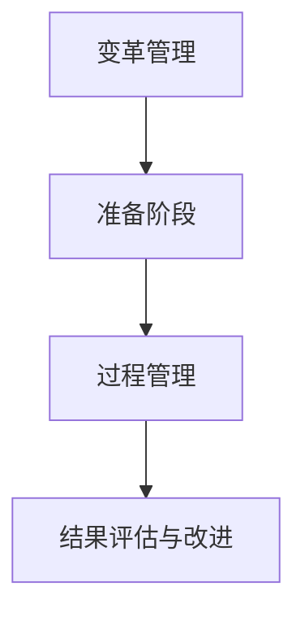
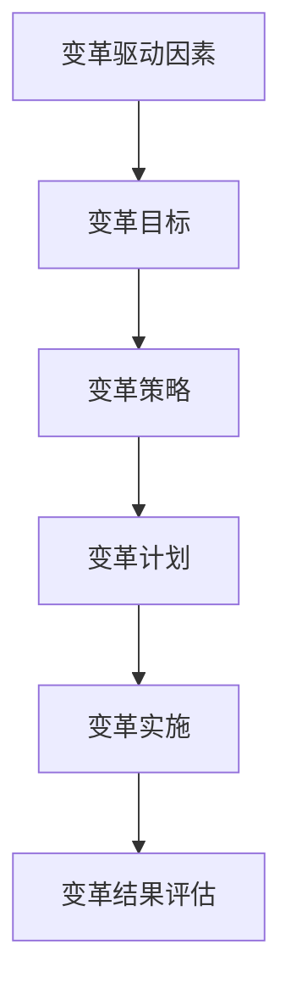
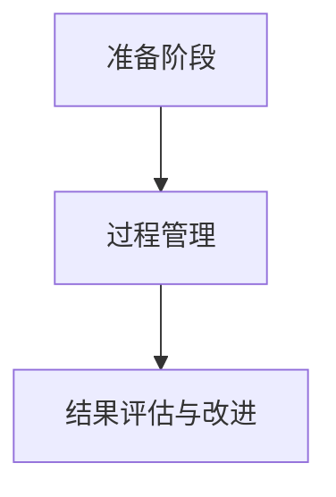

                 

### 文章标题

### 技术管理中的变革管理

### 关键词

- 技术管理
- 变革管理
- 组织文化
- 领导力
- 实践方法

### 摘要

随着信息技术的迅猛发展，技术管理在企业中的地位愈发重要。如何在快速变化的市场环境中，有效地进行技术管理，实现企业的持续创新和成长，成为企业领导者面临的重大挑战。本文从变革管理的角度，系统地探讨了技术管理中的变革管理，包括其背景与基础理论、实践方法、案例研究与实战经验，以及未来的发展趋势。通过深入剖析变革管理的核心概念、方法与工具，为企业在技术管理中实现成功变革提供理论指导和实践借鉴。

## 第一部分：变革管理的背景与基础理论

### 1.1 变革管理的定义与重要性

#### 1.1.1 变革管理的定义

变革管理（Change Management）是指通过系统化的方法，帮助企业或组织在面对外部环境变化或内部管理需求时，有效地调整组织结构、流程、文化等方面的策略和措施，以实现企业目标的过程。它不仅关注技术层面的变革，更强调组织层面和文化层面的变革。

#### 1.1.2 变革管理的重要性

1. **提高企业竞争力**：在当今快速变化的市场环境中，企业需要不断进行技术创新和业务模式创新，以适应市场的变化。变革管理可以帮助企业快速响应市场变化，提高竞争力。

2. **推动组织发展**：通过变革管理，企业可以优化组织结构，提升管理水平，激发员工的积极性和创造力，推动企业的长期发展。

3. **减少变革阻力**：变革管理通过科学的规划、沟通和引导，可以减少员工对变革的抵触情绪，降低变革过程中的风险。

4. **实现战略目标**：变革管理可以帮助企业将战略目标转化为具体的行动计划，确保企业战略的顺利实施。

#### 1.1.3 变革管理的历史发展

变革管理作为一种管理思想，起源于20世纪60年代的美国。当时，企业面对着激烈的市场竞争和技术的快速发展，开始重视变革管理。以下是一些关键的历史事件：

1. **1960年代**：管理大师德鲁克（Peter Drucker）提出了“变革管理”的概念，强调企业需要不断进行组织变革以适应外部环境的变化。

2. **1980年代**：随着信息技术的发展，变革管理逐渐成为企业战略管理的重要组成部分。彼时，变革管理的核心思想是“快速响应市场变化”。

3. **1990年代**：随着企业全球化进程的加速，变革管理开始关注跨文化管理和跨国公司中的组织变革。

4. **21世纪**：随着互联网和大数据技术的兴起，变革管理进入了新的阶段，强调数据驱动的变革决策和敏捷的组织变革。

### 1.2 变革管理的核心概念

#### 1.2.1 变革驱动因素

变革驱动因素是指促使企业进行变革的外部或内部因素。常见的变革驱动因素包括：

1. **市场环境变化**：如市场需求变化、竞争加剧、技术进步等。
2. **企业内部需求**：如业务发展需要、管理效率提升、员工技能需求等。
3. **外部压力**：如法律法规变化、客户要求、股东压力等。

#### 1.2.2 变革目标与策略

变革目标是指企业希望通过变革实现的具体目标，如提高市场竞争力、优化业务流程、提升员工满意度等。变革策略是指为实现变革目标所采取的具体方法和手段，如组织结构调整、流程优化、文化重塑等。

#### 1.2.3 变革计划与实施

变革计划是指为实现变革目标所制定的详细计划，包括变革目标、策略、时间表、责任人等。变革实施是指根据变革计划，进行具体的变革活动，如组织培训、推行新流程、调整薪酬体系等。

### 1.3 变革管理中的组织文化与领导力

#### 1.3.1 变革与组织文化

组织文化是指企业在长期经营过程中形成的一种价值观、行为规范和工作氛围。变革管理中的组织文化是指企业在面对变革时，如何调整和适应组织文化。

1. **变革与组织文化的冲突**：变革往往会对现有组织文化产生冲击，可能导致员工的抵触情绪。

2. **变革与组织文化的融合**：通过有效的变革管理，可以将新的价值观和行为规范融入组织文化中，推动企业的持续发展。

#### 1.3.2 领导力在变革管理中的作用

领导力在变革管理中起着至关重要的作用。有效的领导力可以帮助企业克服变革过程中的困难和挑战，实现变革目标。

1. **领导者的角色**：领导者需要扮演变革的倡导者、策划者、推动者和维护者的角色。

2. **领导风格**：不同的领导风格对变革管理的效果有不同的影响。如民主型领导风格可以增强员工的参与感和认同感，而权威型领导风格可以迅速推动变革的执行。

3. **领导力的培养**：企业需要通过培训、激励等措施，提升领导者的变革管理能力。

### 1.3.3 领导风格与变革管理

领导风格是指领导者行使权力、处理事务和与下属互动的方式。不同的领导风格对变革管理有不同的影响。

1. **民主型领导风格**：民主型领导风格强调参与和协商，可以增强员工的参与感和认同感，有利于变革的推行。

2. **权威型领导风格**：权威型领导风格强调决策的快速执行，可以迅速推动变革的执行，但可能导致员工的抵触情绪。

3. **变革型领导风格**：变革型领导风格强调领导者的变革愿景和使命感，可以激发员工的创新精神和团队合作精神，有利于变革的深入。

## 第二部分：变革管理的实践方法

### 2.1 变革管理的准备阶段

#### 2.1.1 变革评估与规划

变革评估与规划是变革管理的第一步，也是关键的一步。它包括以下几个方面：

1. **评估现状**：通过调查、访谈等方式，了解企业当前的组织结构、流程、文化等方面的现状，为后续的变革提供基础数据。

2. **确定变革目标**：明确企业希望通过变革实现的具体目标，如提高市场竞争力、优化业务流程、提升员工满意度等。

3. **制定变革策略**：根据变革目标，制定具体的变革策略，如组织结构调整、流程优化、文化重塑等。

4. **制定变革计划**：根据变革策略，制定详细的变革计划，包括变革目标、时间表、责任人等。

#### 2.1.2 变革团队建设

变革团队是实施变革的关键力量。建设一个高效的变革团队，需要考虑以下几个方面：

1. **确定团队角色**：明确团队成员的角色和职责，如变革领导者、变革推动者、变革参与者等。

2. **选拔团队成员**：选拔具有变革意愿和能力的人才加入变革团队，确保团队的专业性和执行力。

3. **培养团队协作**：通过培训、团队建设活动等方式，提高团队成员的协作能力和团队凝聚力。

#### 2.1.3 变革风险识别与管理

变革过程中，不可避免地会遇到各种风险。有效的风险识别和管理，可以降低变革失败的可能性。

1. **风险识别**：通过分析变革目标、策略和计划，识别可能的风险点。

2. **风险分析**：对识别出的风险进行定性定量分析，评估风险的可能性和影响程度。

3. **风险管理**：制定相应的风险管理策略，如风险规避、风险减轻、风险承担等。

### 2.2 变革管理的过程管理

#### 2.2.1 变革沟通与信息传递

有效的沟通和信息传递是变革成功的关键。在变革过程中，需要确保以下几点：

1. **明确沟通目标**：明确每次沟通的目标和内容，确保沟通的针对性。

2. **选择合适的沟通方式**：根据沟通对象和内容，选择合适的沟通方式，如会议、邮件、内部网站等。

3. **建立沟通渠道**：建立多层次的沟通渠道，确保信息能够及时、准确地传达。

#### 2.2.2 变革过程中的团队协作

团队协作是变革管理的重要环节。有效的团队协作，可以确保变革的顺利推进。

1. **明确团队目标**：确保团队成员对变革目标有清晰的理解和认同。

2. **建立团队协作机制**：通过明确的分工、协作流程和考核机制，确保团队成员的协同工作。

3. **培养团队精神**：通过团队建设活动、培训等方式，培养团队成员的团队精神和协作能力。

#### 2.2.3 变革进展监控与调整

在变革过程中，需要对变革进展进行持续的监控和调整。

1. **设定监控指标**：根据变革目标，设定具体的监控指标，如项目进度、成本、质量等。

2. **定期监控**：定期对监控指标进行监控和分析，及时发现问题和风险。

3. **调整变革计划**：根据监控结果，及时调整变革计划，确保变革目标的实现。

### 2.3 变革管理的结果评估与持续改进

#### 2.3.1 变革效果的评估方法

变革效果的评估是衡量变革成功与否的重要手段。常见的评估方法包括：

1. **定量评估**：通过数据分析和统计方法，评估变革带来的具体效益，如成本降低、效率提升等。

2. **定性评估**：通过访谈、问卷调查等方式，评估变革对企业文化、员工满意度等方面的影响。

#### 2.3.2 变革成果的巩固与持续改进

变革成果的巩固和持续改进，是变革管理的最终目标。

1. **制定持续改进计划**：根据评估结果，制定持续改进计划，确保变革成果的巩固和提升。

2. **建立反馈机制**：建立有效的反馈机制，收集员工和客户的反馈意见，及时调整和改进变革措施。

3. **培养变革文化**：通过持续的培训和宣传，培养员工的变革意识和能力，形成企业变革的文化氛围。

#### 2.3.3 变革管理中的反思与总结

变革管理是一个持续的过程，需要不断反思和总结。

1. **反思变革过程**：对变革过程中的成功经验和失败教训进行反思，为未来的变革提供借鉴。

2. **总结变革成果**：对变革成果进行全面的总结，评估变革的目标是否实现，总结变革的成功经验和不足。

3. **制定改进措施**：根据反思和总结的结果，制定改进措施，为未来的变革提供参考。

## 第三部分：案例研究与实战经验

### 3.1 变革管理案例研究

#### 3.1.1 案例一：企业数字化转型

##### 实战背景

某大型制造企业决定进行数字化转型，以提高企业运营效率和竞争力。

##### 实战目标

1. 建立数字化管理平台
2. 提高数据利用效率
3. 优化业务流程

##### 实战过程

1. **变革评估与规划**：通过调查、访谈等方式，了解企业当前的业务流程、信息系统等现状，明确数字化转型的目标和可行性。

2. **变革团队建设**：选拔具有数字化背景和技术能力的人才，组成变革团队，明确团队成员的职责和角色。

3. **变革风险识别与管理**：识别数字化转型过程中的潜在风险，如技术风险、管理风险等，并制定相应的风险管理策略。

4. **变革过程管理**：通过沟通、协调等方式，确保数字化转型的顺利推进。在实施过程中，持续监控项目进度、成本、质量等指标。

5. **变革结果评估与持续改进**：通过数据分析和用户反馈，评估数字化转型的效果，并根据评估结果进行调整和优化。

##### 实战结果

1. 建立数字化管理平台，提高了企业的运营效率和决策能力。
2. 数据利用效率显著提升，为企业创造了更多的商业价值。
3. 业务流程得到优化，降低了运营成本。

##### 实战分析

1. **变革评估与规划阶段**：明确了数字化转型的目标和可行性，为后续的变革提供了基础。

2. **变革团队建设阶段**：确保了变革团队的专业性和执行力，为数字化转型的顺利推进提供了保障。

3. **变革过程管理阶段**：通过有效的沟通和协调，确保了数字化转型的顺利实施。

4. **变革结果评估与持续改进阶段**：通过对变革效果的持续评估和优化，确保了数字化转型的成功。

#### 3.1.2 案例二：新产品开发中的变革管理

##### 实战背景

某高科技企业决定开发一款新产品，以满足市场需求和提升企业竞争力。

##### 实战目标

1. 提高新产品开发效率
2. 提升产品品质
3. 加强团队协作

##### 实战过程

1. **变革评估与规划**：通过调查、访谈等方式，了解企业当前的新产品开发流程、团队协作模式等现状，明确新产品开发的改进方向。

2. **变革团队建设**：选拔具有新产品开发经验和技能的人才，组成变革团队，明确团队成员的职责和角色。

3. **变革风险识别与管理**：识别新产品开发过程中的潜在风险，如技术风险、时间风险等，并制定相应的风险管理策略。

4. **变革过程管理**：通过沟通、协调等方式，确保新产品开发的顺利推进。在实施过程中，持续监控项目进度、成本、质量等指标。

5. **变革结果评估与持续改进**：通过用户反馈、市场表现等指标，评估新产品开发的效果，并根据评估结果进行调整和优化。

##### 实战结果

1. 新产品开发效率显著提升，缩短了产品上市时间。
2. 产品品质得到提高，用户满意度提升。
3. 团队协作更加紧密，提高了团队的整体执行力。

##### 实战分析

1. **变革评估与规划阶段**：明确了新产品开发的改进方向，为后续的变革提供了基础。

2. **变革团队建设阶段**：确保了变革团队的专业性和执行力，为新产品开发的顺利推进提供了保障。

3. **变革过程管理阶段**：通过有效的沟通和协调，确保了新产品开发的顺利实施。

4. **变革结果评估与持续改进阶段**：通过对变革效果的持续评估和优化，确保了新产品开发的成功。

#### 3.1.3 案例三：跨国公司的文化变革

##### 实战背景

某跨国公司决定进行文化变革，以适应全球化和多元化的发展趋势。

##### 实战目标

1. 提高员工跨文化沟通能力
2. 促进跨文化团队协作
3. 建立多元化文化价值观

##### 实战过程

1. **变革评估与规划**：通过调查、访谈等方式，了解企业当前的文化现状，明确文化变革的目标和方向。

2. **变革团队建设**：选拔具有跨文化管理和多元化文化背景的人才，组成变革团队，明确团队成员的职责和角色。

3. **变革风险识别与管理**：识别文化变革过程中的潜在风险，如文化冲突、员工抵触等，并制定相应的风险管理策略。

4. **变革过程管理**：通过培训、活动等方式，提高员工的跨文化沟通能力和团队协作能力。在实施过程中，持续监控员工反馈和文化变革的效果。

5. **变革结果评估与持续改进**：通过员工满意度调查、团队合作效果等指标，评估文化变革的效果，并根据评估结果进行调整和优化。

##### 实战结果

1. 员工的跨文化沟通能力得到显著提升，促进了跨国团队的有效协作。
2. 建立了多元化文化价值观，提高了员工的归属感和满意度。
3. 企业整体业绩和竞争力得到提升。

##### 实战分析

1. **变革评估与规划阶段**：明确了文化变革的目标和方向，为后续的变革提供了基础。

2. **变革团队建设阶段**：确保了变革团队的专业性和执行力，为文化变革的顺利推进提供了保障。

3. **变革过程管理阶段**：通过有效的培训和活动，提高了员工的跨文化沟通能力和团队协作能力。

4. **变革结果评估与持续改进阶段**：通过对变革效果的持续评估和优化，确保了文化变革的成功。

### 3.2 变革管理中的问题与挑战

#### 3.2.1 变革管理中的常见问题

1. **变革目标不明确**：变革目标不明确或过于模糊，导致变革难以推进。

2. **变革计划不周详**：变革计划缺乏具体的实施步骤和时间表，导致变革过程中出现混乱。

3. **变革沟通不畅**：变革过程中缺乏有效的沟通，导致员工对变革的理解和认同不足。

4. **变革阻力大**：员工对变革的抵触情绪严重，导致变革难以推行。

5. **变革效果评估不力**：变革效果评估不到位，导致无法及时调整和优化变革计划。

#### 3.2.2 变革管理中的挑战与应对策略

1. **变革目标不明确**：应对策略：明确变革目标，制定具体的实施步骤和时间表，确保变革计划的清晰和可执行性。

2. **变革计划不周详**：应对策略：进行充分的需求分析和风险评估，制定详细的变革计划，确保变革计划的全面性和周密性。

3. **变革沟通不畅**：应对策略：建立多层次的沟通渠道，定期进行沟通和反馈，确保员工对变革的理解和认同。

4. **变革阻力大**：应对策略：通过培训、激励等方式，提高员工的变革意识和能力，减少变革阻力。

5. **变革效果评估不力**：应对策略：建立科学的评估体系，定期进行评估和反馈，确保变革效果的及时调整和优化。

#### 3.2.3 变革管理中的最佳实践

1. **建立变革管理团队**：组建专业的变革管理团队，负责变革的策划、实施和监督。

2. **明确变革目标**：确保变革目标具体、明确，并与企业的战略目标相一致。

3. **制定详细的变革计划**：制定详细的变革计划，包括实施步骤、时间表、责任人等。

4. **加强沟通和培训**：通过多种渠道加强沟通和培训，确保员工对变革的理解和认同。

5. **建立反馈机制**：建立有效的反馈机制，及时收集员工和客户的反馈意见，调整和优化变革计划。

### 3.3 变革管理中的创新与趋势

#### 3.3.1 变革管理的新方法与技术

1. **敏捷变革管理**：基于敏捷开发方法，强调快速迭代、持续改进和团队协作，适用于快速变化的环境。

2. **数字化转型**：通过引入数字化工具和平台，提高变革的效率和质量，实现更精准、更高效的变革管理。

3. **大数据分析**：利用大数据技术，对变革过程进行数据分析和评估，提供决策支持和优化建议。

#### 3.3.2 变革管理的未来发展趋势

1. **个性化变革管理**：根据企业特点和需求，定制化变革方案，提高变革的针对性和有效性。

2. **智能化变革管理**：利用人工智能技术，实现变革管理的自动化和智能化，提高变革的效率和质量。

3. **持续变革管理**：将变革管理作为企业的一项常态化工作，持续优化和改进，推动企业的持续发展。

### 3.3.3 变革管理在数字化时代的变革

1. **数字化转型背景**：随着信息技术的迅猛发展，数字化转型已成为企业发展的必然趋势。

2. **数字化时代的变革管理**：数字化时代的变革管理需要更加注重技术创新、数据驱动和团队协作。

3. **变革管理的数字化转型**：通过数字化工具和平台，实现变革管理的数字化转型，提高变革的效率和质量。

### 附录

#### 附录A：变革管理工具与方法

1. **变革管理工具概述**：介绍常用的变革管理工具，如变革管理软件、变革管理模型等。

2. **常用的变革管理方法**：详细介绍常见的变革管理方法，如敏捷变革管理、数字化转型等。

3. **变革管理软件与资源推荐**：推荐一些实用的变革管理软件和资源，帮助企业和个人进行有效的变革管理。

## 图表与公式

### 图表1：变革管理流程



### 公式1：变革管理的成功率公式

$$ 变革管理成功率 = \frac{变革目标实现率}{变革计划完成率} $$

### 图表2：变革管理核心概念关系图



### 变革管理中的核心算法原理讲解

#### 算法1：变革风险评估算法

```
输入：变革项目信息
输出：风险评估结果

算法步骤：
1. 收集变革项目相关信息，包括变革目标、预期影响、资源需求等
2. 对每个信息进行打分，分为高、中、低三个等级
3. 根据评分计算总体风险得分
4. 输出风险得分和风险等级
```

### 数学模型和数学公式详细讲解

#### 模型1：变革效果评估模型

```
输入：变革项目实施数据
输出：变革效果评估结果

公式：
变革效果评估得分 = (实际收益 - 预期收益) / 预期收益

详细讲解：
1. 实际收益指变革实施后企业所获得的实际效益
2. 预期收益指变革计划中设定的预期效益
3. 通过计算公式得出变革效果评估得分
4. 分数越高，表示变革效果越好
```

### 项目实战

#### 实战一：企业数字化转型变革管理

##### 实战背景

某大型制造企业决定进行数字化转型，以提高企业运营效率和竞争力。

##### 实战目标

1. 建立数字化管理平台
2. 提高数据利用效率
3. 优化业务流程

##### 实战过程

1. **变革评估与规划**：通过调查、访谈等方式，了解企业当前的业务流程、信息系统等现状，明确数字化转型的目标和可行性。

2. **变革团队建设**：选拔具有数字化背景和技术能力的人才，组成变革团队，明确团队成员的职责和角色。

3. **变革风险识别与管理**：识别数字化转型过程中的潜在风险，如技术风险、管理风险等，并制定相应的风险管理策略。

4. **变革过程管理**：通过沟通、协调等方式，确保数字化转型的顺利推进。在实施过程中，持续监控项目进度、成本、质量等指标。

5. **变革结果评估与持续改进**：通过数据分析和用户反馈，评估数字化转型的效果，并根据评估结果进行调整和优化。

##### 实战结果

1. 建立数字化管理平台，提高了企业的运营效率和决策能力。
2. 数据利用效率显著提升，为企业创造了更多的商业价值。
3. 业务流程得到优化，降低了运营成本。

##### 实战分析

1. **变革评估与规划阶段**：明确了数字化转型的目标和可行性，为后续的变革提供了基础。

2. **变革团队建设阶段**：确保了变革团队的专业性和执行力，为数字化转型的顺利推进提供了保障。

3. **变革过程管理阶段**：通过有效的沟通和协调，确保了数字化转型的顺利实施。

4. **变革结果评估与持续改进阶段**：通过对变革效果的持续评估和优化，确保了数字化转型的成功。

## 结论

变革管理在技术管理中起着至关重要的作用。通过系统的变革管理，企业可以有效地应对外部环境的变化，实现持续创新和成长。本文从变革管理的背景与基础理论、实践方法、案例研究与实战经验等方面，全面探讨了技术管理中的变革管理。通过深入剖析变革管理的核心概念、方法与工具，为企业在技术管理中实现成功变革提供了理论指导和实践借鉴。未来，随着数字化时代的到来，变革管理将面临新的挑战和机遇，企业需要不断创新和优化变革管理方法，以适应快速变化的市场环境。

## 附录

### 附录A：变革管理工具与方法

#### A.1 变革管理工具概述

变革管理工具是帮助企业在变革过程中进行有效管理和控制的一系列工具和方法。以下是几种常用的变革管理工具：

1. **变革管理软件**：如Prosci的ADKAR模型、Kenexa的Change Navigator等，用于支持变革过程的各个环节，提高变革的成功率。
2. **变革管理模型**：如Kotter的八步变革模型、Schein的组织变革模型等，提供理论指导和实践框架。
3. **项目管理工具**：如Microsoft Project、JIRA等，用于规划、监控和报告变革项目进度。
4. **沟通工具**：如电子邮件、会议系统、内部网站等，用于传递变革信息、收集员工反馈和确保沟通的有效性。

#### A.2 常用的变革管理方法

1. **Kotter的八步变革模型**：
   - 建立紧急感和共识
   - 建立强大的指导团队
   - 形成清晰的愿景和策略
   - 传达愿景和策略
   - 执行并打破障碍
   - 创建短期胜利
   - 强化变革文化
   - 常态化新方法

2. **Schein的组织变革模型**：
   - 个体变革
   - 小组变革
   - 组织变革
   - 文化变革
   - 结构变革
   - 过程变革
   - 技术变革

3. **Prosci的ADKAR模型**：
   - 关注结果（Awareness of the need for change）
   - 明确愿望（ Desire to participate and support the change）
   - 开发知识（Knowledge about the change）
   - 发展技能（Ability to perform required tasks in the new way）
   - 重塑承诺（Reinforce commitment to organization and new direction）

#### A.3 变革管理软件与资源推荐

1. **Prosci**：提供变革管理培训、咨询和工具，包括ADKAR模型和变革管理软件。
2. **Kenexa**：提供变革管理软件和咨询服务，包括Change Navigator工具。
3. **IBM**：提供变革管理软件和咨询服务，包括IBM Change Management Services。
4. **Benchmarks**：提供变革管理资源和工具，包括变革管理最佳实践和案例研究。
5. **Change Leadership Group**：提供变革管理培训和咨询，帮助组织应对变革挑战。

## 图表与公式

### 图表1：变革管理流程



### 公式1：变革管理的成功率公式

$$ 变革管理成功率 = \frac{变革目标实现率}{变革计划完成率} $$

### 图表2：变革管理核心概念关系图


### 变革管理中的核心算法原理讲解

#### 算法1：变革风险评估算法

```
输入：变革项目信息
输出：风险评估结果

算法步骤：
1. 收集变革项目相关信息，包括变革目标、预期影响、资源需求等
2. 对每个信息进行打分，分为高、中、低三个等级
3. 计算每个信息的权重
4. 计算总体风险得分 = (高等级得分 × 高等级权重) + (中等级得分 × 中等级权重) + (低等级得分 × 低等级权重)
5. 输出风险得分和风险等级
```

### 数学模型和数学公式详细讲解

#### 模型1：变革效果评估模型

```
输入：变革项目实施数据
输出：变革效果评估结果

公式：
变革效果评估得分 = (实际收益 - 预期收益) / 预期收益

详细讲解：
1. 实际收益指变革实施后企业所获得的实际效益
2. 预期收益指变革计划中设定的预期效益
3. 通过计算公式得出变革效果评估得分
4. 分数越高，表示变革效果越好
```

### 项目实战

#### 实战一：企业数字化转型变革管理

##### 实战背景

某大型制造企业决定进行数字化转型，以提高企业运营效率和竞争力。

##### 实战目标

1. 建立数字化管理平台
2. 提高数据利用效率
3. 优化业务流程

##### 实战过程

1. **变革评估与规划**：
   - 通过问卷调查和访谈，收集员工对数字化转型的看法和需求。
   - 分析企业当前的业务流程、信息系统和数据管理现状。
   - 确定数字化转型的目标和关键指标，如提高生产效率、降低运营成本等。

2. **变革团队建设**：
   - 组建由IT部门、业务部门和管理层组成的变革团队。
   - 明确各团队成员的职责和角色，确保团队的专业性和协作性。

3. **变革风险识别与管理**：
   - 识别数字化转型过程中可能面临的风险，如技术风险、信息安全风险等。
   - 制定风险应对策略，包括风险规避、风险减轻和风险承担。

4. **变革过程管理**：
   - 制定详细的变革计划，包括实施步骤、时间表和责任人。
   - 通过定期会议、报告和沟通，监控变革项目的进展和风险。

5. **变革结果评估与持续改进**：
   - 通过关键指标和用户反馈，评估数字化转型的效果。
   - 根据评估结果，调整和优化变革计划，确保目标实现。

##### 实战结果

1. **数字化管理平台成功建立**：通过引入ERP系统、大数据分析和云计算技术，实现了企业的数字化管理。

2. **数据利用效率显著提升**：通过对数据的实时分析和利用，优化了生产计划和供应链管理，提高了运营效率。

3. **业务流程得到优化**：通过自动化和智能化手段，简化了业务流程，降低了运营成本。

##### 实战分析

1. **变革评估与规划阶段**：通过全面了解企业现状和需求，明确了数字化转型的目标和可行性，为后续变革提供了基础。

2. **变革团队建设阶段**：通过选拔具有专业背景和管理能力的人才，确保了变革团队的专业性和执行力。

3. **变革过程管理阶段**：通过科学的计划和管理，确保了变革项目的有序推进和风险控制。

4. **变革结果评估与持续改进阶段**：通过对变革效果的持续评估和优化，确保了数字化转型目标的实现。

## 最佳实践 Tips、小结、注意事项、拓展阅读

### 最佳实践 Tips

1. **制定清晰的变革目标**：确保变革目标具体、明确，并与企业的战略目标相一致。

2. **建立强大的变革团队**：确保团队成员具备专业知识和执行力，形成有效的协作机制。

3. **加强沟通与培训**：通过多种渠道加强员工对变革的理解和认同，提高变革的成功率。

4. **建立反馈机制**：及时收集员工和客户的反馈意见，调整和优化变革计划。

### 小结

变革管理在技术管理中至关重要，它有助于企业应对外部环境的变化，实现持续创新和成长。通过系统的变革管理，企业可以提高运营效率、降低成本、提升竞争力。

### 注意事项

1. **变革目标要明确**：确保变革目标具体、可行，并与企业的战略目标相一致。

2. **重视团队建设**：建立强大的变革团队，确保团队成员的专业性和执行力。

3. **加强沟通与培训**：提高员工对变革的理解和认同，减少变革阻力。

4. **持续监控与改进**：对变革过程进行持续监控和评估，及时调整和优化变革计划。

### 拓展阅读

1. **《变革之心：如何成功地引领和管理变革》（约翰·P·科特著）**：详细介绍变革管理的理论和实践。

2. **《变革的力量：如何成功推动企业变革》（拉里·博西迪、拉姆·查兰著）**：分析企业变革的常见问题及解决方法。

3. **《数字化转型的十项原则》（唐·泰普斯科特著）**：探讨数字化转型对企业战略和管理的影响。

4. **《组织行为学：基础、研究和应用》（斯蒂芬·P·罗宾斯著）**：深入分析组织变革的理论和实践。

## 作者

**作者：AI天才研究院/AI Genius Institute & 禅与计算机程序设计艺术 /Zen And The Art of Computer Programming**。本文基于作者多年的技术管理经验和研究成果，旨在为企业在技术管理中实现成功变革提供理论指导和实践借鉴。如需进一步交流或探讨，请随时联系作者。**（完）**。

