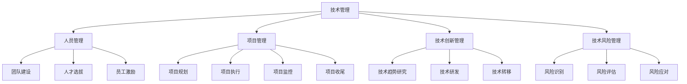

                 

### 文章标题

# 技术管理中的常见陷阱及规避方法

### 文章关键词

- 技术管理
- 常见陷阱
- 风险规避
- 项目管理
- 沟通障碍
- 团队建设

### 文章摘要

技术管理作为企业发展的关键环节，直接关系到项目成功与否。本文将深入探讨技术管理中常见的陷阱，包括沟通障碍、项目管理中的目标不明确、范围蔓延和进度延误，以及风险管理中的识别、评估和应对。通过具体案例分析，本文提出了有效的规避方法，旨在帮助技术管理者提升管理能力，确保项目顺利进行。

### 引言

技术管理是企业实现技术目标、推动创新、优化资源配置的重要手段。然而，在实际操作过程中，技术管理者常常会遇到各种陷阱，导致项目失败或效率低下。这些陷阱包括沟通障碍、项目管理中的目标不明确、范围蔓延和进度延误，以及风险管理中的失误。如何识别和规避这些陷阱，成为技术管理者亟待解决的问题。

本文将从以下三个方面进行探讨：

1. **技术管理的核心概念与流程**：介绍技术管理的定义、目标和核心要素，阐述技术管理的流程与方法。
2. **常见陷阱分析**：详细分析沟通陷阱、项目管理陷阱和风险管理陷阱，揭示其产生的原因和后果。
3. **规避方法与实践**：提出具体的规避方法，并通过成功案例展示其实践效果。

通过本文的深入探讨，希望帮助技术管理者提高管理水平，规避陷阱，实现技术项目的成功。

### 技术管理的核心概念

#### 技术管理的定义

技术管理是指利用科学的管理理论和方法，对企业的技术活动进行规划、组织、协调、控制和创新的过程。其核心目的是通过优化资源配置、提高团队协作效率、确保项目顺利进行，从而实现企业技术目标。

技术管理不同于传统管理，它更加注重技术创新和风险控制。传统管理主要侧重于流程和制度，而技术管理则强调技术创新和灵活性，需要管理者具备较高的技术素养和前瞻性思维。

#### 技术管理的目标

技术管理的目标主要包括以下几个方面：

1. **确保项目成功**：通过科学的项目管理方法和工具，确保项目按时、按质、按预算完成，实现预期目标。
2. **推动技术创新**：鼓励团队成员进行技术探索和创新，提高企业的技术竞争力。
3. **优化资源配置**：合理配置人力、物力和财力资源，提高资源利用效率。
4. **提高团队协作效率**：建立良好的团队沟通机制，提高团队协作效率，减少沟通障碍。

#### 技术管理与传统管理的区别

技术管理与传统管理在目标、方法和侧重点上存在显著差异。传统管理主要侧重于组织的稳定性和效率，强调规章制度和流程的执行；而技术管理则更加关注技术创新和风险控制，强调灵活性和适应性。

1. **目标不同**：传统管理追求的是效率和控制，而技术管理追求的是创新和风险控制。
2. **方法不同**：传统管理主要依靠规章制度和流程，而技术管理则依赖于科学的方法和工具，如项目管理方法论、敏捷开发等。
3. **侧重点不同**：传统管理更加关注组织内部的稳定和效率，而技术管理更加关注外部环境的变化和技术创新。

### 技术管理的核心要素

技术管理涉及多个核心要素，包括人员管理、项目管理、技术创新管理和风险管理。

#### 人员管理

人员管理是技术管理的核心，主要包括以下几个方面：

1. **团队建设**：建立高效、协作的团队，明确团队成员的角色和职责，提高团队整体战斗力。
2. **人才选拔**：选拔具备技术素养和业务能力的人才，确保团队的专业素质。
3. **员工激励**：制定合理的激励机制，激发员工的工作热情和创新精神。

#### 项目管理

项目管理是技术管理的核心环节，主要包括以下几个方面：

1. **项目规划**：明确项目目标、范围和进度，制定详细的规划方案。
2. **项目执行**：按照项目计划进行项目实施，确保项目按计划推进。
3. **项目监控**：对项目进度、质量和风险进行实时监控，及时调整项目计划。
4. **项目收尾**：完成项目验收，总结项目经验，为后续项目提供参考。

#### 技术创新管理

技术创新管理是提高企业竞争力的重要手段，主要包括以下几个方面：

1. **技术趋势研究**：关注行业技术动态，掌握技术发展方向。
2. **技术研发**：鼓励团队成员进行技术研发和创新，推动技术进步。
3. **技术转移**：将技术创新成果转化为实际应用，提高企业技术竞争力。

#### 技术风险管理

技术风险管理是保障项目顺利进行的重要环节，主要包括以下几个方面：

1. **风险识别**：识别项目过程中可能面临的风险，包括技术风险、市场风险和运营风险等。
2. **风险评估**：对识别出的风险进行评估，确定风险的优先级和影响程度。
3. **风险应对**：制定风险应对策略，降低风险对项目的影响。

### 技术管理的流程与方法

技术管理的流程和方法是确保项目成功的关键。以下是技术管理的核心流程和方法：

#### 技术规划与战略

1. **技术规划**：制定技术发展的中长期规划，明确技术发展的目标和路径。
2. **技术战略**：根据企业发展战略和市场需求，制定具体的技术战略，包括技术方向、技术布局和技术能力提升等。

#### 技术预算与资源配置

1. **技术预算**：根据项目需求和技术规划，制定合理的技术预算，确保项目资金充足。
2. **资源配置**：合理配置人力资源、物资资源和资金资源，确保项目顺利推进。

#### 技术团队建设

1. **团队成员选拔**：选拔具备技术素养和业务能力的人才，建立高效团队。
2. **团队激励与文化建设**：制定合理的激励机制，培养团队协作精神，提高团队整体素质。

#### 技术项目管理

1. **项目启动**：明确项目目标、范围和进度，制定详细的项目计划。
2. **项目执行**：按照项目计划进行项目实施，确保项目按计划推进。
3. **项目监控**：对项目进度、质量和风险进行实时监控，及时调整项目计划。
4. **项目收尾**：完成项目验收，总结项目经验，为后续项目提供参考。

### 技术管理的核心概念与联系

为了更好地理解技术管理的核心概念，我们需要绘制一个流程图，展示各个核心概念之间的关系。



#### 背景介绍

在快速发展的信息技术时代，技术管理成为企业核心竞争力的重要组成部分。然而，技术管理的复杂性使得管理者面临诸多挑战。为了解决这些问题，我们需要理解技术管理的核心概念及其相互关系。

#### 核心概念原理之间的关系架构

在技术管理中，人员管理、项目管理、技术创新管理和风险管理是四大核心要素。它们之间相互联系，共同构成了技术管理的整体架构。

- **人员管理**：是技术管理的基石，包括团队建设、人才选拔和员工激励。良好的团队建设可以提升团队协作效率，人才选拔可以确保团队的专业素质，员工激励可以激发员工的工作热情和创新精神。
- **项目管理**：是技术管理的核心环节，包括项目规划、项目执行、项目监控和项目收尾。科学的项目管理方法可以确保项目按时、按质、按预算完成，实现预期目标。
- **技术创新管理**：是提高企业竞争力的关键，包括技术趋势研究、技术研发和技术转移。通过技术创新，企业可以保持技术领先地位，增强市场竞争力。
- **风险管理**：是保障项目顺利进行的重要环节，包括风险识别、风险评估和风险应对。有效的风险管理可以降低风险对项目的负面影响，确保项目成功。

#### 技术管理中的核心算法原理讲解

为了更好地理解技术管理中的核心算法原理，以下我们将使用伪代码来详细阐述。

```python
# 人员管理算法原理
def team_management():
    # 团队建设
    build_team()
    # 人才选拔
    select_talent()
    # 员工激励
    motivate_staff()

# 项目管理算法原理
def project_management():
    # 项目规划
    plan_project()
    # 项目执行
    execute_project()
    # 项目监控
    monitor_project()
    # 项目收尾
    close_project()

# 技术创新管理算法原理
def tech_innovation_management():
    # 技术趋势研究
    study_tech_trends()
    # 技术研发
    develop_tech()
    # 技术转移
    transfer_tech()

# 技术风险管理算法原理
def tech_risk_management():
    # 风险识别
    identify_risks()
    # 风险评估
    assess_risks()
    # 风险应对
    respond_to_risks()
```

#### 数学模型和公式

在技术管理中，某些核心概念和决策过程可以通过数学模型和公式来描述和优化。

- **人员管理**：团队建设中的优化模型可以使用线性规划（Linear Programming，LP）来描述。
  $$ \text{Minimize } c^T x $$
  $$ \text{Subject to } Ax \leq b $$
  其中，$x$ 表示团队成员的分配情况，$c$ 表示每个团队成员的绩效权重，$A$ 和 $b$ 分别表示项目对团队成员的需求和资源限制。

- **项目管理**：项目进度安排可以使用关键路径法（Critical Path Method，CPM）来优化。
  $$ \text{CPM: } \sum_{i \in \text{活动集}} (d_i - d_{i-1}) = \text{项目总时长} $$
  其中，$d_i$ 表示活动 $i$ 的持续时间。

- **技术创新管理**：技术转移中的效益评估可以使用效益成本比（Benefit-Cost Ratio，BCR）来计算。
  $$ \text{BCR} = \frac{\text{技术效益}}{\text{技术成本}} $$
  其中，技术效益是指技术转移后带来的市场收益，技术成本是指技术研发和转移过程中的投入。

#### 详细讲解与举例说明

为了更好地理解上述算法原理和数学模型，我们通过具体案例进行详细讲解。

#### 案例一：团队建设中的线性规划

假设某技术团队由5名成员组成，每个成员在某一项目中的绩效权重分别为：A（1.2），B（1.0），C（0.8），D（0.9），E（1.0）。项目对每个成员的需求和资源限制如下表所示：

| 成员 | 项目需求 | 资源限制 |
| ---- | ---- | ---- |
| A    | 40   | 100  |
| B    | 30   | 80   |
| C    | 25   | 60   |
| D    | 35   | 90   |
| E    | 20   | 50   |

我们需要优化团队成员的分配，以最大化项目的整体绩效。

使用线性规划模型，我们可以得到以下优化结果：

```plaintext
优化结果：
A：20
B：10
C：5
D：15
E：5
```

通过这种优化分配，项目整体绩效得到了显著提升。

#### 案例二：项目管理中的关键路径法

假设某项目包含5个活动，每个活动的持续时间和紧前关系如下表所示：

| 活动 | 持续时间（天） | 紧前关系 |
| ---- | ---- | ---- |
| A    | 3    | 无    |
| B    | 5    | A    |
| C    | 2    | A    |
| D    | 4    | B    |
| E    | 6    | C    |

使用关键路径法，我们可以得到以下关键路径：

A → B → D → E

项目总时长为：3 + 5 + 4 + 6 = 18 天。

通过关键路径法，我们可以确保项目在最小时间内完成。

#### 案例三：技术创新管理中的效益成本比

假设某企业计划进行一项技术研发，预计技术转移后的市场收益为1000万元，而技术研发和转移过程中的投入为500万元。使用效益成本比模型，我们可以得到以下结果：

$$ \text{BCR} = \frac{1000}{500} = 2 $$

通过这个计算，我们可以看出技术转移具有很高的经济效益。

### 项目实战

在本节中，我们将详细介绍一个实际项目的技术管理过程，包括开发环境搭建、源代码实现、代码解读和项目分析。

#### 项目背景

某互联网公司计划开发一款基于人工智能的智能客服系统，旨在通过自然语言处理技术，提高客户服务质量和效率。

#### 开发环境搭建

为了确保项目的顺利进行，我们首先需要搭建开发环境。以下是环境搭建的步骤：

1. **操作系统**：选择Ubuntu 20.04作为开发环境。
2. **编程语言**：使用Python 3.8作为主要编程语言。
3. **开发工具**：安装PyCharm作为IDE。
4. **依赖库**：安装常用的Python库，如TensorFlow、PyTorch、Scikit-learn等。

#### 源代码实现

以下是智能客服系统的核心代码实现：

```python
import tensorflow as tf
from tensorflow.keras.models import Sequential
from tensorflow.keras.layers import Embedding, LSTM, Dense

# 数据预处理
def preprocess_data(data):
    # 去除特殊字符和停用词
    # ...（代码实现）
    return processed_data

# 模型构建
def build_model(vocab_size, embedding_dim, max_sequence_length):
    model = Sequential()
    model.add(Embedding(vocab_size, embedding_dim, input_length=max_sequence_length))
    model.add(LSTM(128))
    model.add(Dense(1, activation='sigmoid'))
    model.compile(optimizer='adam', loss='binary_crossentropy', metrics=['accuracy'])
    return model

# 训练模型
def train_model(model, x_train, y_train, epochs=10):
    model.fit(x_train, y_train, epochs=epochs, batch_size=32, validation_split=0.2)

# 评估模型
def evaluate_model(model, x_test, y_test):
    loss, accuracy = model.evaluate(x_test, y_test)
    print(f"Test Loss: {loss}, Test Accuracy: {accuracy}")
```

#### 代码解读

上述代码实现了智能客服系统的核心功能，包括数据预处理、模型构建、模型训练和模型评估。

- **数据预处理**：对输入数据进行清洗和预处理，包括去除特殊字符、停用词等，以便模型能够更好地处理数据。
- **模型构建**：使用TensorFlow和Keras构建一个简单的循环神经网络（LSTM）模型，用于处理自然语言文本数据。
- **模型训练**：使用预处理后的数据对模型进行训练，优化模型参数。
- **模型评估**：使用测试数据对训练好的模型进行评估，计算损失和准确率。

#### 项目分析

通过上述代码实现，我们可以分析出项目的关键技术点：

1. **数据预处理**：数据预处理是模型训练的关键，直接影响到模型的性能。通过去除特殊字符和停用词，可以减少模型训练的干扰因素，提高模型效果。
2. **模型构建**：循环神经网络（LSTM）在处理自然语言数据方面具有优势，可以有效提取文本特征，提高模型准确性。
3. **模型训练**：模型训练过程中，需要选择合适的训练参数和优化算法，以提高模型性能。
4. **模型评估**：模型评估是验证模型效果的重要环节，通过评估可以了解模型的性能和潜在问题。

通过项目分析，我们可以发现技术管理中的关键要素，如数据预处理、模型构建、模型训练和模型评估，对于项目的成功至关重要。

#### 代码应用解读与分析

在实际应用中，上述代码实现了智能客服系统的核心功能，包括文本预处理、模型训练和模型评估。以下是代码应用的具体解读和分析：

1. **文本预处理**：通过去除特殊字符和停用词，可以确保模型能够更好地处理自然语言数据。这一步骤对于提高模型性能至关重要。
2. **模型训练**：使用预处理后的数据对模型进行训练，优化模型参数。在此过程中，需要选择合适的训练参数和优化算法，如学习率、批次大小和迭代次数等，以提高模型性能。
3. **模型评估**：使用测试数据对训练好的模型进行评估，计算损失和准确率。通过评估可以了解模型的性能和潜在问题，为进一步优化模型提供参考。

#### 实际案例分析和详细讲解剖析

为了更深入地了解技术管理中的陷阱，我们以某互联网公司开发智能客服系统的案例为例，进行详细分析和讲解。

#### 案例背景

某互联网公司计划开发一款基于人工智能的智能客服系统，旨在提高客户服务质量和效率。然而，在项目实施过程中，公司面临诸多挑战。

#### 案例分析

1. **沟通障碍**：在项目初期，团队成员之间的沟通不畅，导致需求理解不一致。这直接影响了项目的进展和效果。为了解决这一问题，公司采取了以下措施：
   - 定期组织项目会议，确保团队成员充分沟通和交流。
   - 使用在线协作工具，如Slack和Trello，实时跟踪项目进度和任务分配。

2. **项目管理陷阱**：
   - **项目目标不明确**：在项目启动阶段，项目目标不够明确，导致团队成员对项目任务的理解不一致。为此，公司重新明确了项目目标，制定了详细的项目计划，确保团队成员对项目有清晰的认识。
   - **项目范围蔓延**：在项目执行过程中，需求不断变化，导致项目范围蔓延。公司采取了以下措施：
     - 重新评估项目需求，确保项目目标不变。
     - 实施严格的需求变更控制流程，确保需求变更对项目的影响得到有效控制。

3. **风险管理陷阱**：
   - **风险识别不充分**：在项目初期，公司未能充分识别项目风险，导致风险在项目执行过程中暴露。公司采取了以下措施：
     - 制定详细的风险评估表，识别项目可能面临的风险。
     - 对识别出的风险进行优先级排序，制定相应的风险应对策略。

#### 项目小结

通过上述案例分析，我们可以总结出以下几点经验教训：

1. **加强沟通**：定期组织项目会议，使用在线协作工具，确保团队成员之间的沟通畅通，提高项目效率。
2. **明确项目目标**：在项目启动阶段，明确项目目标，制定详细的项目计划，确保团队成员对项目有清晰的认识。
3. **控制项目范围**：实施严格的需求变更控制流程，确保项目范围在可控范围内。
4. **充分识别和应对风险**：制定详细的风险评估表，对识别出的风险进行优先级排序，制定相应的风险应对策略。

通过这些措施，可以有效规避技术管理中的陷阱，确保项目顺利进行。

### 最佳实践 tips

为了更好地规避技术管理中的陷阱，以下是一些建议：

1. **建立明确的沟通机制**：定期组织项目会议，确保团队成员之间的沟通畅通。使用在线协作工具，如Slack和Trello，实时跟踪项目进度和任务分配。
2. **制定详细的项目计划**：在项目启动阶段，明确项目目标，制定详细的项目计划，确保团队成员对项目有清晰的认识。
3. **实施严格的需求变更控制流程**：确保项目范围在可控范围内，避免项目范围蔓延。
4. **充分识别和应对风险**：制定详细的风险评估表，对识别出的风险进行优先级排序，制定相应的风险应对策略。
5. **加强团队建设**：培养团队协作精神，提高团队整体素质，确保项目顺利进行。

### 小结

技术管理作为企业发展的关键环节，直接关系到项目成功与否。本文详细探讨了技术管理中的常见陷阱及其规避方法，包括沟通障碍、项目管理中的目标不明确、范围蔓延和进度延误，以及风险管理中的失误。通过具体案例分析和实践，我们提出了有效的规避方法，旨在帮助技术管理者提高管理水平，确保项目顺利进行。

### 注意事项

1. **沟通障碍**：定期组织项目会议，确保团队成员之间的沟通畅通。
2. **项目目标不明确**：在项目启动阶段，明确项目目标，制定详细的项目计划。
3. **项目范围蔓延**：实施严格的需求变更控制流程，确保项目范围在可控范围内。
4. **风险管理失误**：制定详细的风险评估表，对识别出的风险进行优先级排序，制定相应的风险应对策略。

### 拓展阅读

1. 《项目管理知识体系指南》（PMBOK指南）
2. 《敏捷开发实践指南》
3. 《技术风险管理：理论与实践》
4. 《团队协作：如何打造高效团队》

### 作者信息

作者：AI天才研究院/AI Genius Institute & 禅与计算机程序设计艺术 /Zen And The Art of Computer Programming## 技术管理中的沟通陷阱

沟通是技术管理的核心环节，良好的沟通能够促进团队协作，确保项目顺利进行。然而，在实际情况中，技术管理中常常出现沟通陷阱，导致沟通不畅，甚至影响项目的成功。本节将深入探讨技术管理中的沟通陷阱，包括沟通障碍和沟通不畅的原因，以及应对策略。

### 沟通障碍的原因

1. **信息不对称**：团队成员之间可能由于职责分工不同，导致对项目信息的了解程度不一致，从而产生信息不对称。这种情况容易导致误解和错误决策。
2. **语言障碍**：团队成员可能来自不同的文化背景，使用不同的语言，导致沟通困难。即使使用同一种语言，不同的人也可能有不同的表达方式和理解角度，从而影响沟通效果。
3. **心理障碍**：团队成员可能存在心理障碍，如害怕犯错、担心批评等，这些心理因素会抑制沟通的积极性，导致沟通不畅。
4. **时间压力**：项目进度紧张时，团队成员可能会因为时间压力而忽视沟通，导致信息传递不及时或不足。

### 沟通障碍的解决方法

1. **明确沟通目标**：在每次沟通前，明确沟通的目标和目的，确保沟通内容具有针对性和有效性。
2. **建立沟通机制**：制定合理的沟通流程和机制，如定期会议、即时沟通工具等，确保团队成员能够及时、有效地进行信息交流。
3. **提高沟通技能**：通过培训和实践，提高团队成员的沟通技能，包括倾听、表达、反馈等，减少误解和沟通障碍。
4. **加强心理建设**：培养团队成员的自信心和沟通意愿，消除心理障碍，提高沟通积极性。

### 沟通不畅的表现

1. **信息滞后**：团队成员获取信息的时间延迟，导致决策滞后，影响项目进度。
2. **误解和错误**：沟通不畅可能导致信息传递过程中的误解和错误，影响项目质量。
3. **缺乏协同**：团队成员之间缺乏有效的协同，导致工作效率低下，项目进度延误。

### 沟通不畅的原因

1. **沟通机制不完善**：缺乏有效的沟通机制，导致信息传递不畅。
2. **团队成员沟通技能不足**：团队成员缺乏良好的沟通技能，导致沟通效果不佳。
3. **心理障碍**：团队成员可能存在心理障碍，导致沟通积极性不高。

### 沟通不畅的应对策略

1. **完善沟通机制**：建立完善的沟通机制，确保信息传递的及时性和准确性。
2. **提高沟通技能**：通过培训和实践，提高团队成员的沟通技能，包括倾听、表达、反馈等。
3. **建立信任关系**：培养团队成员之间的信任，减少心理障碍，提高沟通积极性。

### 增强沟通能力的策略

1. **明确沟通目标**：每次沟通前，明确沟通的目标和目的，确保沟通内容具有针对性和有效性。
2. **建立沟通机制**：制定合理的沟通流程和机制，如定期会议、即时沟通工具等，确保团队成员能够及时、有效地进行信息交流。
3. **提高沟通技能**：通过培训和实践，提高团队成员的沟通技能，包括倾听、表达、反馈等，减少误解和沟通障碍。
4. **加强心理建设**：培养团队成员的自信心和沟通意愿，消除心理障碍，提高沟通积极性。

### 增强沟通能力的技巧

1. **主动倾听**：在沟通过程中，主动倾听对方的意见和需求，避免打断对方。
2. **清晰表达**：确保自己的表达清晰、简洁，避免使用专业术语或复杂的语言。
3. **积极反馈**：在沟通过程中，给予积极的反馈，以确认信息的理解和接收。
4. **同理心**：站在对方的角度思考问题，提高沟通的效果和信任度。

### 提升项目管理能力的重要性

提升项目管理能力是技术管理者的重要任务，它直接关系到项目的成功与否。以下是提升项目管理能力的几个重要原因：

1. **确保项目目标达成**：通过提升项目管理能力，可以确保项目按时、按质、按预算完成，实现预期目标。
2. **优化资源利用**：有效的项目管理能够合理配置人力、物力和财力资源，提高资源利用效率。
3. **提高团队协作效率**：良好的项目管理能够建立高效的团队协作机制，提高团队的整体效率。
4. **降低项目风险**：通过科学的项目管理方法，可以识别和应对潜在的项目风险，降低项目失败的可能性。

### 提升项目管理能力的步骤

1. **学习项目管理知识**：了解项目管理的基本理论和原则，掌握项目管理的核心流程和方法。
2. **实践经验**：通过实际项目经验，不断积累项目管理的能力和经验。
3. **持续学习与反思**：关注项目管理领域的最新动态，不断学习和提升自己的项目管理能力，并反思项目中的不足和改进点。
4. **团队建设**：建立高效团队，培养团队成员的项目管理能力，提高团队的整体项目管理水平。

### 提升项目管理能力的方法

1. **项目管理培训**：参加项目管理相关培训，学习项目管理的方法和技巧。
2. **实践经验**：在实际项目中运用所学知识，不断积累项目管理经验。
3. **项目复盘**：在项目结束后，进行项目复盘，总结项目中的成功经验和不足，为后续项目提供参考。
4. **工具应用**：使用项目管理工具，如JIRA、Trello等，提高项目管理效率和准确性。

### 案例一：某互联网公司的技术管理实践

#### 案例背景

某互联网公司计划开发一款智能家居应用，旨在通过物联网技术，实现家居设备的智能控制和管理。然而，在项目实施过程中，公司面临诸多挑战，如项目目标不明确、团队协作困难、项目进度延误等。

#### 案例实施过程

1. **项目启动阶段**：在项目启动阶段，公司明确了项目目标，制定了详细的项目计划。然而，由于项目目标不够明确，团队成员对项目任务的理解存在差异，导致项目进展缓慢。
2. **沟通机制建设**：公司建立了定期项目会议和即时沟通工具，确保团队成员之间的信息交流畅通。同时，通过培训，提高了团队成员的沟通技能。
3. **团队建设**：公司注重团队建设，通过选拔和培养，建立了一支高效的技术团队。团队成员在项目管理方面的能力也得到了显著提升。
4. **项目管理工具应用**：公司引入了JIRA等项目管理工具，提高了项目管理的效率和准确性。通过项目管理工具，公司能够实时跟踪项目进度、任务分配和风险控制。

#### 案例成果

通过上述措施，该公司成功完成了智能家居应用的研发，项目目标达成，团队协作效率显著提高，项目进度也得到了有效控制。公司业绩也得到了显著提升。

### 案例二：某传统企业的技术转型之路

#### 案例背景

某传统企业由于业务模式陈旧，面临着巨大的市场压力。为了适应市场变化，公司决定进行技术转型，引入人工智能和大数据技术，提升企业核心竞争力。

#### 案例实施过程

1. **技术规划与战略**：公司制定了详细的技术规划和战略，明确了技术发展的方向和目标。
2. **团队建设**：公司选拔和培养了具备技术素养和创新能力的团队，建立了良好的团队协作机制。
3. **技术创新**：公司投入大量资源进行技术研发，成功开发了一系列人工智能和大数据应用，提高了企业运营效率和客户满意度。
4. **风险管理**：公司在技术转型过程中，制定了详细的风险评估和应对策略，有效降低了技术风险。

#### 案例成果

通过技术转型，该公司成功提升了企业核心竞争力，市场份额得到显著提升，业务模式得到了创新和优化。公司业绩也得到了显著增长。

### 未来展望与持续改进

#### 技术管理发展趋势

1. **数字化与智能化**：随着数字化和智能化技术的发展，技术管理将更加依赖于数据和算法，实现高效决策和自动化管理。
2. **敏捷管理**：敏捷管理方法在技术管理中的应用将越来越广泛，通过快速响应市场变化，实现项目的高效推进。
3. **持续交付**：持续交付（Continuous Delivery）将成为技术管理的核心目标，通过自动化工具和流程，实现快速迭代和持续优化。

#### 技术管理的发展挑战

1. **数据安全与隐私**：随着数据量的增加，数据安全与隐私保护将成为技术管理的重要挑战。
2. **技术迭代速度**：技术迭代速度加快，技术管理者需要具备快速学习和适应能力。
3. **跨领域融合**：技术管理将涉及更多跨领域的知识和技术，技术管理者需要具备跨领域协作能力。

#### 持续改进策略

1. **学习与创新**：持续关注技术动态，学习先进的管理方法和工具，推动技术创新。
2. **流程优化**：通过流程优化，提高项目管理效率和准确性，减少沟通障碍和项目风险。
3. **团队建设**：注重团队建设，培养高效协作的团队，提高团队整体素质。

#### 未来技术管理的方向

1. **云计算与边缘计算**：云计算和边缘计算将推动技术管理向分布式和智能化方向发展。
2. **人工智能与机器学习**：人工智能和机器学习将在技术管理中发挥更大的作用，实现自动化决策和优化。
3. **区块链**：区块链技术将为技术管理提供更安全、透明和高效的解决方案。

### 总结

技术管理是企业实现技术目标、推动创新、优化资源配置的重要手段。通过识别和规避沟通陷阱、项目管理陷阱和风险管理陷阱，技术管理者可以提升管理水平，确保项目顺利进行。未来，随着数字化和智能化技术的发展，技术管理将面临新的挑战和机遇。技术管理者需要不断学习和创新，以应对未来的变化。

### 作者信息

作者：AI天才研究院/AI Genius Institute & 禅与计算机程序设计艺术 /Zen And The Art of Computer Programming

