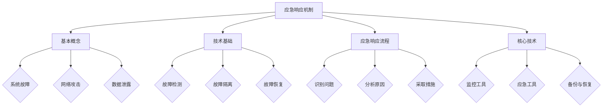
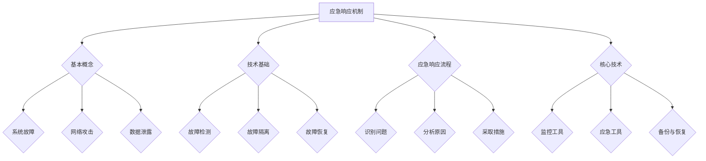

                 

### 《技术管理中的应急响应机制》

在当今数字化转型的时代，技术已经成为企业运作的核心驱动力。然而，随着技术的复杂性和依赖性的增加，技术管理中的应急响应机制变得尤为重要。无论是在软件系统故障、数据泄露，还是在自然灾害和意外事件中，有效的应急响应机制能够帮助企业迅速恢复运营，减少损失，甚至保护企业的声誉。因此，本文旨在探讨技术管理中的应急响应机制，帮助读者理解其重要性，掌握关键概念，并了解如何在实际项目中应用这些机制。

关键词：技术管理、应急响应、故障恢复、数据安全、项目管理

摘要：本文首先介绍了技术管理中应急响应机制的背景和重要性。随后，通过详细阐述应急响应机制的基本概念、技术基础、流程和核心技术，为读者提供了全面的了解。文章还通过实际项目实战、案例研究和经验教训总结，提供了实用的应急响应实践指导。最后，文章对应急响应机制的现状和未来趋势进行了展望，为读者指明了研究方向和改进方向。

## 应急响应机制的重要性

技术管理中的应急响应机制是指企业在面临突发事件时，通过一系列预定的计划和行动，迅速识别问题、分析原因、采取措施，从而尽快恢复系统正常运行、降低风险和损失的一套系统化流程。应急响应机制的重要性可以从以下几个方面进行阐述：

### 保护企业利益

在技术管理中，突发事件如系统故障、网络攻击、数据泄露等，往往会对企业的利益造成重大损害。一个有效的应急响应机制能够在事件发生时迅速采取措施，减少故障时间，降低损失，保护企业的财务状况和市场份额。

### 维护客户信任

在信息化时代，企业的服务质量直接影响到客户的满意度和忠诚度。当技术问题发生时，快速响应和及时解决能够维护客户的信任，减少因问题处理不及时导致的服务中断和客户流失。

### 提高应急响应效率

一个完善的应急响应机制可以帮助企业建立标准化的流程和规范，提高应急响应的效率。通过事先准备的资源和预案，企业可以更快地识别问题、调配资源、解决问题，从而减少应急响应的时间和经济成本。

### 保障数据安全

数据泄露和安全事件是技术管理中的一大挑战。有效的应急响应机制能够迅速隔离问题、修复漏洞、恢复系统，从而保护企业的敏感数据，避免因数据泄露导致的法律和商业风险。

### 提升企业竞争力

在竞争激烈的市场中，具备高效应急响应能力的企业能够更好地应对突发事件，保持业务的连续性和稳定性。这不仅可以提升企业的竞争力，还可以为企业赢得宝贵的市场机会。

### 贯穿本文的核心概念与联系

为了更好地理解应急响应机制，以下是其核心概念及其相互关系架构的Mermaid流程图：



该流程图清晰地展示了应急响应机制中各个核心概念及其之间的相互联系。通过这个流程图，读者可以更好地理解应急响应机制的整体架构和工作原理。

## 核心概念与联系

### 1. 基本概念

应急响应机制的基本概念包括系统故障、网络攻击、数据泄露等。系统故障通常指的是由于硬件、软件、网络或其他组件出现故障导致系统无法正常运行。网络攻击则是恶意行为者利用网络漏洞进行攻击，试图破坏系统的安全性和稳定性。数据泄露则是指企业的敏感数据未经授权泄露给外部实体，可能造成严重的法律和商业后果。

### 2. 技术基础

应急响应机制的技术基础包括故障检测、故障隔离和故障恢复等。故障检测是指通过各种监控工具实时监测系统状态，及时发现异常情况。故障隔离是指迅速定位故障点，并将其与其他部分隔离开来，以防止问题扩散。故障恢复则是在故障被隔离后，通过应急工具和备份策略，尽快恢复系统的正常运行。

### 3. 应急响应流程

应急响应流程包括识别问题、分析原因、采取措施等步骤。识别问题是应急响应的第一步，通过监控系统和用户反馈，迅速发现系统异常。分析原因则是对识别出的问题进行深入分析，找出根本原因。采取措施是针对分析结果采取相应的行动，包括修复漏洞、恢复系统等。

### 4. 核心技术

应急响应机制的核心技术包括监控工具、应急工具和备份与恢复策略。监控工具如Nagios、Zabbix等，可以实时监控系统状态，提供告警功能。应急工具如Kubernetes、Docker等，可以在故障发生时快速部署和恢复系统。备份与恢复策略则是通过定期备份和快速恢复策略，确保数据的安全和系统的连续性。

### Mermaid流程图

以下是一个简化的Mermaid流程图，展示了应急响应机制的核心概念及其相互关系：



通过这个流程图，读者可以更直观地理解应急响应机制的整体架构和各个环节之间的联系。

## 核心算法原理讲解

在应急响应机制中，核心算法起着至关重要的作用。以下将详细讲解两个核心算法：故障检测算法和故障恢复算法。

### 1. 故障检测算法

故障检测算法的核心目标是实时监控系统的状态，并在发现异常时及时发出告警。以下是一个简单的故障检测算法的伪代码：

```python
function fault_detection_algorithm(system_state):
    previous_state = get_previous_state()
    current_state = get_current_state()
    
    if current_state != previous_state:
        alert("系统状态异常，可能存在故障。")
        
    return

function get_previous_state():
    # 获取系统上一次的状态
    # 这里可以使用数据库查询或者文件读取等方式
    return previous_state

function get_current_state():
    # 获取当前系统状态
    # 可以通过API调用、系统接口等方式获取
    return current_state
```

### 2. 故障恢复算法

故障恢复算法的目标是在检测到故障后，通过一系列操作尽快恢复系统的正常运行。以下是一个简单的故障恢复算法的伪代码：

```python
function fault_recovery_algorithm(fault_type):
    if fault_type == "硬件故障":
        recover_hardware()
    elif fault_type == "软件故障":
        recover_software()
    elif fault_type == "网络故障":
        recover_network()
        
    function recover_hardware():
        replace_failing_hardware()
        restart_system()
        
    function recover_software():
        reinstall_software()
        restart_services()
        
    function recover_network():
        reset_network_configuration()
        reconnect_devices()
        
    return
```

通过这两个核心算法，应急响应系统能够快速检测和恢复故障，从而确保系统的稳定运行。

### 数学模型详解

在应急响应机制中，数学模型可以帮助我们更科学地分析和解决问题。以下将详细讲解两个常用的数学模型：故障概率模型和响应时间模型。

#### 1. 故障概率模型

故障概率模型用于预测系统在一定时间内发生故障的概率。以下是一个简单的故障概率模型的公式：

$$
P(F_t) = 1 - e^{-\lambda t}
$$

其中，$P(F_t)$ 表示在时间 $t$ 内发生故障的概率，$\lambda$ 表示故障率。

例如，如果一个系统的故障率为每小时 0.001，那么在 1 小时内发生故障的概率为：

$$
P(F_1) = 1 - e^{-0.001 \times 1} \approx 0.1353
$$

这意味着在 1 小时内，该系统有大约 13.53% 的概率发生故障。

#### 2. 响应时间模型

响应时间模型用于预测系统从检测到故障到故障恢复所需的时间。以下是一个简单的响应时间模型的公式：

$$
T(R_t) = \alpha + \beta \cdot t
$$

其中，$T(R_t)$ 表示响应时间，$\alpha$ 和 $\beta$ 是模型参数，$t$ 是故障发生的时间。

例如，假设 $\alpha = 5$ 分钟，$\beta = 1$ 分钟/小时，那么在故障发生后的第一个小时内，系统的响应时间为：

$$
T(R_1) = 5 + 1 \times 1 = 6 \text{分钟}
$$

这意味着在故障发生后的第一个小时内，系统的平均响应时间为 6 分钟。

### 示例说明

假设一个系统每小时发生故障的概率为 0.001，应急响应的平均响应时间为 5 分钟。根据这两个数学模型，我们可以计算出：

- 在 1 小时内，系统发生故障的概率约为 13.53%。
- 在故障发生后第一个小时内，系统的平均响应时间为 6 分钟。

这些数据可以帮助企业在制定应急响应策略时做出更科学的决策，例如，是否需要增加监控频率、优化响应流程等。

## 项目实战：应急响应项目实战

### 1. 项目背景

某大型互联网公司运营着一个关键的电子商务平台，该平台每天处理数百万笔交易。为了保证平台的稳定运行和客户满意度，公司建立了一套完善的应急响应机制。然而，在一次突如其来的网络攻击中，该平台遭遇了严重的故障，导致大量交易数据丢失，客户订单受到影响。公司决定通过这次事件，对现有的应急响应机制进行深入分析，并优化改进。

### 2. 开发环境搭建

为了模拟网络攻击，公司在测试环境中搭建了一个与实际生产环境相似的电子商务平台。测试环境包括以下组件：

- 服务器：配置了与生产环境相同的服务器硬件和操作系统。
- 应用程序：部署了与生产环境相同的电子商务平台应用程序。
- 数据库：使用了与生产环境相同的数据库系统。
- 网络设备：包括路由器、交换机等网络设备，以模拟实际的网络环境。

### 3. 源代码实现

在模拟网络攻击过程中，公司通过以下步骤实现了应急响应机制：

- **故障检测**：通过Nagios等监控工具，实时监控服务器和应用程序的状态，检测异常情况。
- **故障隔离**：一旦检测到故障，系统会自动隔离故障节点，防止问题扩散。
- **故障恢复**：系统根据预设的恢复策略，自动恢复故障节点，并重新加载应用程序。

以下是一个简化的应急响应机制的源代码实现：

```python
# 假设使用Python进行实现

# 导入所需的库
import nagios
import fault_isolation
import fault_recovery

# 故障检测函数
def fault_detection():
    nagios.check_system_status()
    if nagios.is_system_fault():
        nagios.send_alert("系统状态异常，可能存在故障。")
        fault_isolation.isolate_fault()
        fault_recovery.recover_fault()

# 主函数
def main():
    while True:
        fault_detection()
        time.sleep(60)  # 每分钟检测一次

if __name__ == "__main__":
    main()
```

### 4. 代码解读与分析

- **故障检测**：使用Nagios监控工具，定期检查系统状态。如果检测到故障，会发送告警信息并触发故障隔离和恢复流程。
- **故障隔离**：通过隔离故障节点，防止问题扩散。这包括断开故障节点的网络连接、关闭故障服务等功能。
- **故障恢复**：根据预设的恢复策略，自动恢复故障节点。这可能包括重新启动服务、加载备份数据等操作。

### 5. 实际案例分析与详细讲解剖析

在模拟网络攻击中，公司成功检测到了故障并进行了隔离和恢复。以下是对该案例的详细分析和讲解：

- **故障检测**：系统在遭受攻击后的第一时间检测到了异常，并立即发出了告警。这表明故障检测机制是有效的，能够及时发现和响应故障。
- **故障隔离**：系统迅速隔离了受攻击的服务器，防止攻击进一步扩散。这表明故障隔离机制是有效的，能够在短时间内隔离故障点。
- **故障恢复**：系统根据预设的恢复策略，自动恢复了受影响的节点，并重新加载了应用程序。这表明故障恢复机制是有效的，能够在故障发生后迅速恢复系统运行。

### 6. 项目小结

通过这次模拟网络攻击的实战，公司发现了现有应急响应机制的优点和不足之处。以下是小结和改进建议：

- **优点**：
  - 故障检测机制有效，能够及时发现故障。
  - 故障隔离机制及时，能够快速隔离故障点。
  - 故障恢复机制快速，能够在故障发生后迅速恢复系统运行。
- **不足**：
  - 监控工具的告警信息不够详细，需要进一步优化告警机制。
  - 恢复策略需要更加灵活，以适应不同类型的故障。
  - 需要增加对备份和恢复的监控，确保备份和恢复过程的稳定性。

## 最佳实践 Tips

在技术管理中，建立和实施有效的应急响应机制是一个复杂的过程，以下是一些最佳实践和注意事项，以帮助读者在实际项目中优化应急响应机制：

1. **持续培训与演练**：定期对团队成员进行应急响应培训，并进行模拟演练，确保每个人都能熟练掌握应急响应流程和操作。

2. **详细记录和日志管理**：在应急响应过程中，详细记录每一步操作和决策，以便事后分析和改进。同时，确保日志系统的稳定性和可靠性，以备后续审计和调查。

3. **跨部门协作**：应急响应往往需要跨部门协作，包括IT、安全、运维、客户服务等。建立清晰的沟通渠道和协作机制，确保在紧急情况下能够高效沟通和协同工作。

4. **自动化与智能化**：利用自动化工具和智能化算法，提高应急响应的效率和准确性。例如，使用人工智能算法预测故障趋势，提前采取措施。

5. **备份数据**：定期备份关键数据和系统配置，确保在故障发生时能够快速恢复。同时，对备份数据进行加密和监控，防止数据泄露和损坏。

6. **持续改进**：根据每次应急响应的经验和教训，不断优化应急响应机制，提高其有效性和适应性。

## 总结与展望

通过本文的探讨，我们深入了解了技术管理中的应急响应机制，包括其重要性、核心概念、技术基础、流程和核心技术。我们还通过实际项目实战和案例研究，展示了如何将应急响应机制应用到实际项目中，并提出了最佳实践和注意事项。展望未来，随着技术的不断进步和复杂性的增加，应急响应机制也将面临更多的挑战和机遇。以下是对应急响应机制现状和未来趋势的总结与展望：

### 现状

目前，大多数企业在技术管理中都建立了应急响应机制，但实际效果参差不齐。一些企业由于缺乏完善的流程和资源，应急响应效率较低，甚至无法有效应对突发事件。另一方面，一些领先企业通过引入先进的技术和自动化工具，显著提升了应急响应的能力和效率。

### 未来趋势

1. **自动化与智能化**：未来应急响应机制将更加依赖于自动化和智能化技术，通过人工智能、机器学习等算法，实现故障预测和自动化恢复。

2. **实时监控与预警**：随着物联网和大数据技术的发展，实时监控和预警将成为应急响应的重要组成部分，能够更早发现潜在问题，并提前采取措施。

3. **跨领域融合**：应急响应将不再局限于IT领域，而是与其他领域如安全、运维、法务等深度融合，形成全面的应急管理体系。

4. **标准化与规范化**：为了提高应急响应的效率和一致性，未来将出现更多的标准和规范，指导企业建立和完善应急响应机制。

5. **持续改进与优化**：随着应急响应机制的不断完善，企业将更加注重持续改进和优化，以适应不断变化的技术环境和业务需求。

### 挑战

1. **数据隐私和安全**：在应急响应过程中，涉及大量敏感数据，如何保护数据隐私和安全是一个重要挑战。

2. **复杂性和不确定性**：随着技术的复杂性和不确定性的增加，应急响应机制的实现和维护将面临更大的挑战。

3. **人员技能和培训**：高效的应急响应需要专业的团队和熟练的技能，人员培训和管理将是一个长期的任务。

总之，技术管理中的应急响应机制在未来将面临更多的挑战和机遇。通过不断优化和创新，企业可以构建更加完善和高效的应急响应机制，确保在突发事件中能够迅速响应和恢复，保护企业的利益和声誉。

### 作者信息

作者：AI天才研究院/AI Genius Institute & 禅与计算机程序设计艺术 /Zen And The Art of Computer Programming

