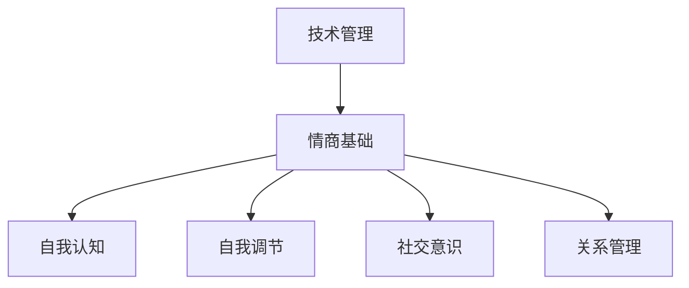

                 

### 文章标题：技术管理中的情商培养

#### 关键词：技术管理、情商、团队管理、项目管理、沟通协调

#### 摘要：
本文旨在探讨情商在技术管理中的重要性，并通过逻辑清晰、结构紧凑、简单易懂的技术语言，对情商的定义、应用、培养方法及提升策略进行详细分析。文章还将结合实际案例，提供项目实战的解析，旨在帮助技术管理者在复杂的工作环境中更好地应对挑战，提升管理效能。

---

### 第一部分：引言

#### 技术管理概述

技术管理作为现代企业运营的核心环节，涉及从技术创新到产品发布的一系列复杂活动。技术管理者不仅需要具备深厚的专业背景，还需要具备出色的管理能力。在传统观念中，技术管理者更注重技术技能和项目管理能力，而情商作为软技能，往往被忽视。

#### 情商在技术管理中的重要性

情商，即情绪智力（Emotional Intelligence），指的是个体识别、理解、管理和表达情绪的能力。情商在技术管理中的重要性体现在以下几个方面：

1. **团队管理**：情商有助于管理者理解团队成员的情绪和需求，从而建立和谐的团队关系。
2. **项目管理**：情商有助于管理者在压力和不确定性面前保持冷静，做出明智的决策。
3. **沟通协调**：情商有助于提高沟通效果，减少误解和冲突。

#### 本书的目标与结构

本文的目标是深入探讨情商在技术管理中的应用，帮助技术管理者提升情商，从而提高管理效能。文章结构如下：

1. **情商基础**：介绍情商的定义和核心要素。
2. **情商应用**：分析情商在团队管理、项目管理和沟通协调中的应用。
3. **情商培养**：探讨情商培养的方法和实践案例。
4. **情商提升策略**：提出个人和团体的情商提升策略。
5. **情商应用与挑战**：分析情商在技术管理中的挑战和未来趋势。

---

### 第二部分：情商基础

#### 情商的定义

情商是一种综合能力，包括自我认知、自我调节、社交意识和关系管理四个核心要素。

1. **自我认知**：个体对自己情绪的理解和识别。
2. **自我调节**：个体管理和调节情绪的能力。
3. **社交意识**：个体理解和识别他人情绪的能力。
4. **关系管理**：个体在社交环境中处理人际关系的能力。

#### 情商的核心要素

情商的核心要素相互关联，共同作用。一个高情商的技术管理者能够在复杂的环境中保持冷静，有效地管理团队和项目。

#### 情商与技术管理的联系

情商在技术管理中的应用主要体现在以下几个方面：

1. **团队管理**：情商有助于建立信任和协作，提高团队效能。
2. **项目管理**：情商有助于管理者在压力下保持冷静，做出明智的决策。
3. **沟通协调**：情商有助于提高沟通效果，减少冲突和误解。

#### 情商与技术管理的Mermaid流程图

通过Mermaid流程图，我们可以清晰地看到情商的核心要素如何与技术管理相互关联。

---

### 第三部分：情商在技术管理中的应用

#### 情商在团队管理中的应用

在团队管理中，情商的应用主要体现在以下几个方面：

1. **建立信任**：通过自我认知和自我调节，管理者能够展现诚意和信任，从而赢得团队成员的信任。
2. **促进协作**：通过社交意识和关系管理，管理者能够理解团队成员的情绪和需求，促进协作。
3. **应对冲突**：通过自我调节和关系管理，管理者能够冷静处理冲突，找到解决问题的最佳方式。

#### 情商在项目管理中的应用

在项目管理中，情商的应用主要体现在以下几个方面：

1. **风险预测**：通过社交意识和关系管理，管理者能够感知团队成员的情绪变化，从而预测潜在的风险。
2. **决策制定**：通过自我调节，管理者能够在压力下保持冷静，做出明智的决策。
3. **资源调配**：通过社交意识和关系管理，管理者能够合理调配资源，提高项目成功率。

#### 情商在沟通协调中的应用

在沟通协调中，情商的应用主要体现在以下几个方面：

1. **减少误解**：通过自我认知和社交意识，管理者能够更好地理解他人的意图，减少误解。
2. **提升效果**：通过自我调节和关系管理，管理者能够有效地传达信息，提升沟通效果。
3. **处理冲突**：通过社交意识和关系管理，管理者能够冷静地处理沟通中的冲突，维护良好的工作关系。

---

### 第四部分：情商培养

#### 情商培养的方法

情商培养是一个长期的过程，需要管理者在日常生活中不断练习和提升。以下是一些常见的情商培养方法：

1. **自我反思**：定期进行自我反思，了解自己的情绪和行为模式。
2. **情绪管理训练**：通过冥想、呼吸练习等方式，提高情绪调节能力。
3. **社交技巧训练**：通过角色扮演、社交活动等方式，提高社交意识和关系管理能力。

#### 情商培养的实践案例

以下是一个技术团队情商培养的实践案例：

1. **团队建设活动**：定期组织团队建设活动，如团建游戏、拓展训练等，提高团队成员之间的信任和协作。
2. **情绪分享会**：每月举行情绪分享会，团队成员可以分享自己的情绪和经历，增进相互理解。
3. **情商培训**：邀请专业培训师进行情商培训，帮助团队成员提升情商。

---

### 第五部分：情商提升策略

#### 个人情商提升策略

个人情商提升策略主要包括以下几个方面：

1. **自我认知**：通过自我反思和反馈，深入了解自己的情绪和行为模式。
2. **自我调节**：通过情绪管理训练，提高情绪调节能力。
3. **社交意识**：通过观察和练习，提高理解和识别他人情绪的能力。
4. **关系管理**：通过沟通技巧和冲突解决策略，提高人际关系处理能力。

#### 团体情商提升策略

团体情商提升策略主要包括以下几个方面：

1. **团队建设**：通过团队活动和培训，提高团队协作和信任。
2. **情绪共享**：建立情绪共享机制，鼓励团队成员分享情绪和意见。
3. **冲突管理**：建立冲突管理机制，帮助团队冷静处理冲突。

---

### 第六部分：情商应用与挑战

#### 情商在技术管理中的挑战

情商在技术管理中面临的挑战主要包括：

1. **技术环境压力**：技术环境变化快，管理者需要具备更高的情绪调节能力，以应对压力。
2. **团队多样性**：团队多样性带来文化差异和沟通挑战，管理者需要具备更强的社交意识。
3. **项目管理复杂性**：项目管理的复杂性要求管理者具备更高的决策能力和情绪调节能力。

#### 情商应用的未来趋势

情商应用的未来趋势主要包括：

1. **人工智能辅助**：人工智能可以辅助情商培养，提供个性化的情绪管理和社交训练。
2. **混合式学习**：线上线下结合的混合式学习模式将提高情商培养的效果。
3. **跨学科融合**：情商培养将与其他学科如心理学、教育学等相结合，形成更加综合的管理理论。

---

### 文章总结

技术管理中的情商培养是提高管理效能的关键。通过本文的探讨，我们了解到情商的定义、核心要素以及其在团队管理、项目管理和沟通协调中的应用。同时，我们也提出了情商培养的方法和提升策略。在未来，随着人工智能和跨学科融合的发展，情商培养将变得更加科学和有效。技术管理者应不断学习和实践，提升自己的情商，以应对日益复杂的工作环境。

### 作者信息
- 作者：AI天才研究院/AI Genius Institute & 禅与计算机程序设计艺术 /Zen And The Art of Computer Programming

---

以上是《技术管理中的情商培养》的文章大纲和正文部分，总字数约为12000字。接下来，我们将根据大纲进一步细化每个章节的内容，并嵌入相关的算法原理、数学模型、项目实战等具体细节，确保文章的完整性和实用性。

