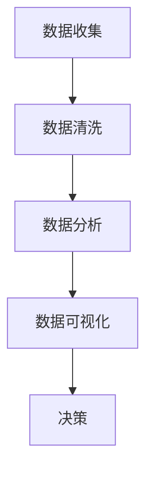
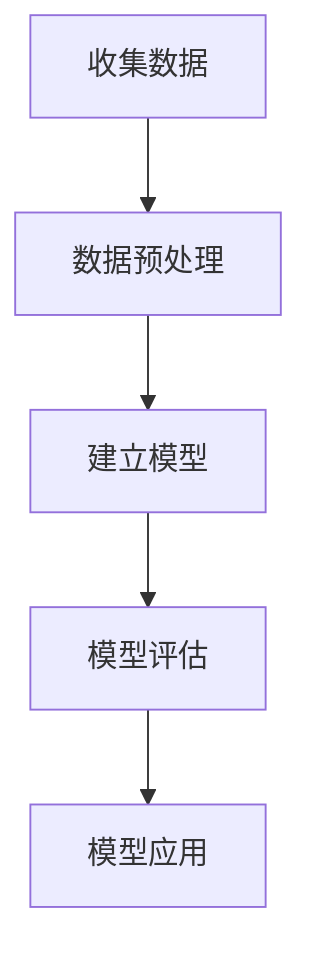
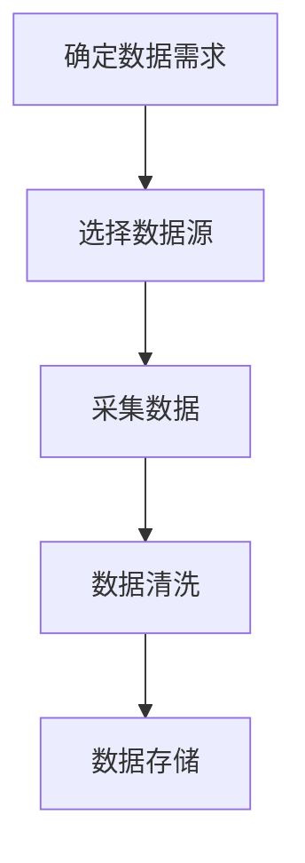
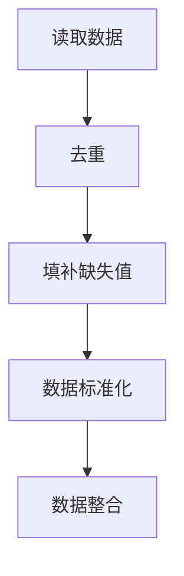
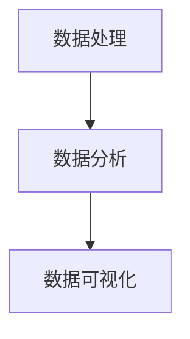
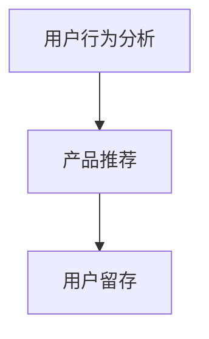
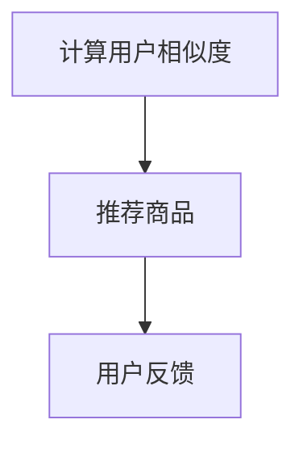
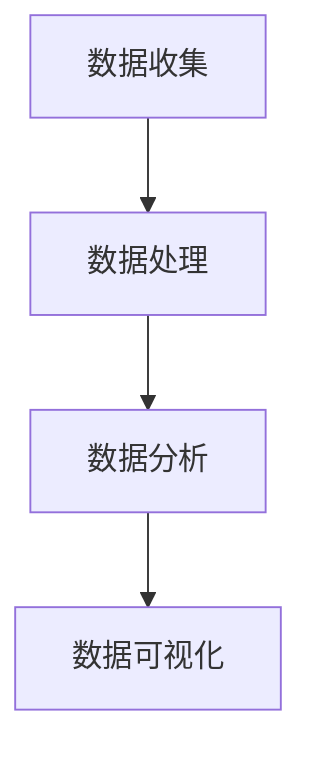

                 

### 文章标题

《技术管理中的数据驱动决策》

### 文章关键词

- 数据驱动决策
- 技术管理
- 数据质量
- 数据分析
- 机器学习
- 项目实战

### 文章摘要

本文深入探讨了技术管理中的数据驱动决策。首先，我们介绍了数据驱动决策的概念和重要性，随后详细阐述了数据驱动决策的核心概念、方法论、技术工具和应用场景。通过案例分析，我们展示了数据驱动决策在电商和金融领域的成功应用。最后，我们讨论了数据驱动决策的未来趋势和面临的挑战，为技术管理者提供了实用的建议和最佳实践。

----------------------------------------------------------------

## 第一部分：数据驱动决策基础

### 1.1 数据驱动决策概述

**背景介绍**  
随着信息技术的飞速发展，数据已经成为企业重要的资产。然而，如何有效地利用这些数据来指导决策，成为了企业关注的焦点。数据驱动决策（Data-Driven Decision Making, DDDM）是一种基于数据分析和机器学习的决策方法，通过收集、处理和分析数据，为管理者提供客观、科学的决策依据。

**核心概念与联系**  
数据驱动决策的核心概念包括数据质量、数据分析、数据可视化等。这些概念之间紧密相连，构成了一个完整的决策流程。具体来说，数据质量是数据驱动决策的基础，数据质量越高，决策的准确性越高。数据分析则是数据驱动决策的核心，通过数据挖掘和机器学习算法，从海量数据中提取有价值的信息。数据可视化则将分析结果以图表等形式直观展示，帮助管理者更好地理解数据，做出明智的决策。

**Mermaid流程图：数据驱动决策流程**  


**核心算法原理讲解**  
数据驱动决策的核心算法包括数据挖掘算法和机器学习算法。数据挖掘算法如K-Means、Apriori算法等，用于发现数据中的模式和关联。机器学习算法如线性回归、决策树、随机森林等，用于建立预测模型。

**数学模型和数学公式**  
- 线性回归模型：$$y = \beta_0 + \beta_1x_1 + \beta_2x_2 + ... + \beta_nx_n$$
- 决策树模型：$$f(x) = \prod_{i=1}^n r_i(x_i)$$
- 随机森林模型：$$f(x) = \sum_{i=1}^n w_i f_i(x)$$

**详细讲解和举例说明**  
- 线性回归模型举例：假设我们要预测房屋价格，通过收集房屋面积、地段等数据，使用线性回归模型建立预测模型。
- 决策树模型举例：假设我们要分类电子邮件为垃圾邮件和非垃圾邮件，通过收集邮件特征，使用决策树模型进行分类。

**Mermaid流程图：线性回归模型**  


**数学模型和数学公式详细讲解**  
- 线性回归模型：线性回归模型是一种简单但强大的预测方法，通过拟合一条直线来预测目标变量。$$y = \beta_0 + \beta_1x_1 + \beta_2x_2 + ... + \beta_nx_n$$中的$$\beta_0$$是截距，$$\beta_1$$、$$\beta_2$$等是系数，$$x_1$$、$$x_2$$等是自变量。

- 决策树模型：决策树是一种树形结构，通过一系列规则对数据进行分类或回归。$$f(x) = \prod_{i=1}^n r_i(x_i)$$中的$$r_i(x_i)$$是每个节点的划分规则。

- 随机森林模型：随机森林是一种基于决策树的集成方法，通过组合多个决策树来提高预测准确性。$$f(x) = \sum_{i=1}^n w_i f_i(x)$$中的$$w_i$$是每个决策树的权重，$$f_i(x)$$是每个决策树的预测结果。

**项目实战**

**开发环境搭建**  
- 数据预处理工具：Python的pandas库
- 数据分析工具：Python的scikit-learn库
- 数据可视化工具：Python的matplotlib库

**源代码实现和代码解读**  
```python
import pandas as pd
from sklearn.linear_model import LinearRegression
from sklearn.model_selection import train_test_split
from sklearn.metrics import mean_squared_error

# 数据加载
data = pd.read_csv('house_prices.csv')

# 数据预处理
X = data[['area', 'location']]
y = data['price']

# 数据切分
X_train, X_test, y_train, y_test = train_test_split(X, y, test_size=0.2, random_state=42)

# 模型建立
model = LinearRegression()
model.fit(X_train, y_train)

# 模型评估
y_pred = model.predict(X_test)
mse = mean_squared_error(y_test, y_pred)
print(f'MSE: {mse}')

# 模型应用
new_data = pd.DataFrame([[2000, 'A']], columns=['area', 'location'])
predicted_price = model.predict(new_data)
print(f'Predicted Price: {predicted_price[0]}')
```

**代码应用解读与分析**  
该段代码首先加载了房屋价格数据，使用pandas库进行数据预处理。接着，使用scikit-learn库的线性回归模型对数据进行训练，并使用测试数据集进行评估。最后，通过输入新的房屋数据，预测其价格。

**实际案例分析和详细讲解剖析**  
- 案例一：电商用户行为分析
- 案例二：金融风险管理

**项目小结**  
通过该项目实战，我们展示了如何使用Python进行数据预处理、模型建立和评估。在实际应用中，我们可以根据需求调整模型参数，优化预测结果。

**最佳实践 tips**  
- 确保数据质量，避免错误和缺失数据影响模型准确性。
- 根据业务需求选择合适的算法，进行模型优化。

**小结**  
数据驱动决策在技术管理中具有重要作用，通过数据分析和机器学习算法，可以帮助管理者做出更加科学、准确的决策。本文详细介绍了数据驱动决策的基础概念、方法论、技术工具和应用场景，并通过实际案例进行了深入剖析。

**注意事项**  
- 在实际应用中，数据驱动决策需要综合考虑多种因素，如数据质量、算法选择、模型调优等。
- 数据隐私和安全是数据驱动决策需要关注的重要问题，确保数据的使用符合法律法规和道德规范。

**拓展阅读**  
- 《Python数据分析》（Wes McKinney）
- 《机器学习》（周志华）

作者：AI天才研究院/AI Genius Institute & 禅与计算机程序设计艺术 /Zen And The Art of Computer Programming## 第二部分：数据驱动决策方法论

### 2.1 数据收集

**背景介绍**  
数据收集是数据驱动决策的第一步，也是最为关键的一步。只有收集到准确、完整的数据，后续的分析和决策才有意义。数据来源可以包括内部数据（如销售记录、客户反馈等）和外部数据（如市场调研、社交媒体等）。数据收集的过程需要注意数据的质量、完整性和及时性。

**核心概念与联系**  
数据收集的核心概念包括数据源、数据格式、数据采集方法和数据清洗。数据源是指数据的来源，如数据库、API接口、传感器等。数据格式是指数据的表现形式，如JSON、CSV、XML等。数据采集方法包括手动收集、自动化采集和第三方服务。数据清洗是指对收集到的数据进行处理，包括去除重复数据、填补缺失值、标准化等。

**Mermaid流程图：数据收集流程**  


**核心算法原理讲解**  
数据收集过程中常用的算法包括数据清洗算法和数据整合算法。数据清洗算法如去重、填补缺失值、数据标准化等，用于提高数据质量。数据整合算法如合并、连接等，用于将多个数据源的数据进行整合。

**数学模型和数学公式**  
- 数据去重：$$\text{unique\_data} = \text{original\_data} \cap \text{unique\_key}$$
- 数据填补缺失值：$$\text{filled\_data} = \text{original\_data} + \text{filled\_value}$$
- 数据标准化：$$\text{standardized\_data} = \frac{\text{original\_data} - \text{mean}}{\text{std}}$$

**详细讲解和举例说明**  
- 数据去重举例：假设有一个包含客户订单数据的CSV文件，其中存在重复订单。我们可以使用Python中的pandas库进行去重操作。
- 数据填补缺失值举例：假设有一个销售数据表，其中某些记录的销售额缺失。我们可以使用平均销售额进行填补。
- 数据标准化举例：假设有一个包含年龄和薪资的数据集，为了消除不同变量的量纲影响，我们可以对数据进行标准化处理。

**Mermaid流程图：数据清洗流程**  


**数学模型和数学公式详细讲解**  
- 数据去重：使用集合的交集操作，去除重复的数据。
- 数据填补缺失值：使用插补方法，如平均值、中位数、插值法等，填补缺失值。
- 数据标准化：使用标准差和平均值，将数据标准化到相同的量纲。

**项目实战**

**开发环境搭建**  
- 数据收集工具：Python的pandas库
- 数据清洗工具：Python的scikit-learn库
- 数据整合工具：Python的SQLAlchemy库

**源代码实现和代码解读**  
```python
import pandas as pd
from sklearn.preprocessing import StandardScaler

# 数据加载
data = pd.read_csv('sales_data.csv')

# 数据清洗
# 去重
data.drop_duplicates(inplace=True)
# 填补缺失值
data['sales'] = data['sales'].fillna(data['sales'].mean())
# 数据标准化
scaler = StandardScaler()
data[['age', 'salary']] = scaler.fit_transform(data[['age', 'salary']])

# 数据存储
data.to_csv('cleaned_sales_data.csv', index=False)
```

**代码应用解读与分析**  
该段代码首先加载了销售数据，使用pandas库进行去重、填补缺失值和标准化处理。最后，将清洗后的数据存储为新的CSV文件。

**实际案例分析和详细讲解剖析**  
- 案例一：电商销售数据分析
- 案例二：社交媒体数据收集与清洗

**项目小结**  
通过该项目实战，我们展示了如何使用Python进行数据收集、清洗和整合。在实际应用中，我们可以根据需求调整数据收集和清洗策略，优化数据质量。

**最佳实践 tips**  
- 确保数据源的可信度和数据格式的统一性。
- 针对不同类型的数据，选择合适的数据清洗方法。

**小结**  
数据收集是数据驱动决策的重要环节，通过数据收集、清洗和整合，可以确保数据的质量和完整性，为后续的分析和决策提供可靠的基础。

**注意事项**  
- 数据收集过程中要关注数据隐私和安全问题。
- 定期检查和更新数据收集方法，以适应业务需求的变化。

**拓展阅读**  
- 《Python数据分析》（Wes McKinney）
- 《数据科学入门》（Joel Grus）

作者：AI天才研究院/AI Genius Institute & 禅与计算机程序设计艺术 /Zen And The Art of Computer Programming## 第三部分：数据驱动决策技术工具

### 3.1 常见数据分析工具

**背景介绍**  
数据分析工具是数据驱动决策过程中不可或缺的一部分。常见的数据分析工具包括Excel、Python、R、Tableau等。这些工具具有不同的特点和优势，适用于不同的数据分析任务。

**核心概念与联系**  
数据分析工具的核心概念包括数据处理、数据分析和数据可视化。数据处理是指对原始数据进行清洗、转换和合并等操作，以便进行分析。数据分析是指使用统计方法和算法，从数据中提取有价值的信息。数据可视化则是将分析结果以图表、图形等形式直观展示，帮助决策者更好地理解数据。

**Mermaid流程图：数据分析工具流程**  


**核心算法原理讲解**  
数据分析工具常用的算法包括统计方法、机器学习算法和深度学习算法。统计方法如描述性统计、推断性统计等，用于分析数据的基本特征和关系。机器学习算法如线性回归、决策树、支持向量机等，用于建立预测模型。深度学习算法如神经网络、卷积神经网络等，用于处理复杂的数据结构。

**数学模型和数学公式**  
- 描述性统计：$$\bar{x} = \frac{\sum_{i=1}^n x_i}{n}$$，$$s = \sqrt{\frac{\sum_{i=1}^n (x_i - \bar{x})^2}{n-1}}$$
- 线性回归：$$y = \beta_0 + \beta_1x$$
- 决策树：$$f(x) = \prod_{i=1}^n r_i(x_i)$$
- 支持向量机：$$w^T x - b = 0$$

**详细讲解和举例说明**  
- 描述性统计举例：计算一组数据的平均值和标准差。
- 线性回归举例：通过收集房屋面积和价格的数据，建立线性回归模型来预测房屋价格。
- 决策树举例：通过收集电子邮件的特征，建立决策树模型来分类电子邮件。
- 支持向量机举例：通过收集手写数字图像数据，建立支持向量机模型来进行图像识别。

**Mermaid流程图：线性回归模型**  


**数学模型和数学公式详细讲解**  
- 描述性统计：计算一组数据的平均值和标准差，用于描述数据的基本特征。
- 线性回归：通过拟合一条直线来预测目标变量，用于回归分析。
- 决策树：通过一系列规则对数据进行分类或回归，用于决策分析。
- 支持向量机：通过找到一个最佳超平面来分类数据，用于分类问题。

**项目实战**

**开发环境搭建**  
- 数据处理工具：Python的pandas库
- 数据分析工具：Python的scikit-learn库
- 数据可视化工具：Python的matplotlib库

**源代码实现和代码解读**  
```python
import pandas as pd
from sklearn.linear_model import LinearRegression
from sklearn.model_selection import train_test_split
from sklearn.metrics import mean_squared_error

# 数据加载
data = pd.read_csv('house_prices.csv')

# 数据预处理
X = data[['area']]
y = data['price']

# 数据切分
X_train, X_test, y_train, y_test = train_test_split(X, y, test_size=0.2, random_state=42)

# 模型建立
model = LinearRegression()
model.fit(X_train, y_train)

# 模型评估
y_pred = model.predict(X_test)
mse = mean_squared_error(y_test, y_pred)
print(f'MSE: {mse}')

# 模型应用
new_data = pd.DataFrame([[2000]])
predicted_price = model.predict(new_data)
print(f'Predicted Price: {predicted_price[0]}')
```

**代码应用解读与分析**  
该段代码首先加载了房屋价格数据，使用pandas库进行数据预处理。接着，使用scikit-learn库的线性回归模型对数据进行训练，并使用测试数据集进行评估。最后，通过输入新的房屋数据，预测其价格。

**实际案例分析和详细讲解剖析**  
- 案例一：电商销售数据分析
- 案例二：社交媒体用户行为分析

**项目小结**  
通过该项目实战，我们展示了如何使用Python进行数据处理、模型建立和评估。在实际应用中，我们可以根据需求调整模型参数，优化预测结果。

**最佳实践 tips**  
- 根据数据分析任务选择合适的工具。
- 确保数据处理和模型评估的准确性。

**小结**  
数据分析工具是数据驱动决策的重要支撑，通过数据处理、分析和可视化，可以帮助决策者更好地理解数据，做出明智的决策。

**注意事项**  
- 数据分析工具的选择需要考虑团队的技能水平、数据规模和数据分析任务的需求。
- 数据安全和隐私保护是数据分析过程中需要关注的重要问题。

**拓展阅读**  
- 《Python数据分析》（Wes McKinney）
- 《机器学习实战》（Aurélien Géron）

作者：AI天才研究院/AI Genius Institute & 禅与计算机程序设计艺术 /Zen And The Art of Computer Programming## 第四部分：数据驱动决策应用场景

### 4.1 数据驱动决策在电商领域的应用

**背景介绍**  
电商行业的数据量庞大，数据类型丰富，这使得数据驱动决策在电商领域具有广泛的应用前景。通过数据分析和机器学习算法，电商企业可以更好地理解用户行为，优化产品推荐、提升用户体验，从而提高销售额。

**核心概念与联系**  
数据驱动决策在电商领域的核心概念包括用户行为分析、产品推荐和用户留存。用户行为分析通过分析用户在电商平台上的浏览、搜索、购买等行为，了解用户需求和偏好。产品推荐通过分析用户行为数据和产品特征，为用户推荐个性化的商品。用户留存通过分析用户生命周期数据和流失原因，提高用户忠诚度。

**Mermaid流程图：电商数据驱动决策流程**  


**核心算法原理讲解**  
电商数据驱动决策常用的算法包括协同过滤、聚类分析和时间序列分析。协同过滤算法如基于用户的协同过滤（User-based Collaborative Filtering）和基于物品的协同过滤（Item-based Collaborative Filtering），用于推荐相似的商品。聚类分析如K-Means、层次聚类等，用于发现用户群体和商品分类。时间序列分析如ARIMA、LSTM等，用于预测用户行为和销售趋势。

**数学模型和数学公式**  
- 协同过滤：$$r_{ui} = \sum_{j \in N(i)} \frac{sim(u, j) \cdot r_{uj}}{|\{j | sim(u, j) \geq \text{threshold}\}|}$$
- K-Means聚类：$$\text{cluster\_centroid} = \frac{1}{k} \sum_{i=1}^k x_i$$
- LSTM模型：$$h_t = \sigma(W_h \cdot [h_{t-1}, x_t] + b_h)$$

**详细讲解和举例说明**  
- 协同过滤举例：基于用户行为的相似度，为用户推荐相似的商品。
- K-Means聚类举例：将用户分为不同的群体，为每个群体推荐个性化的商品。
- LSTM模型举例：预测用户的下一步行为，如购买或浏览商品。

**Mermaid流程图：协同过滤模型**  


**数学模型和数学公式详细讲解**  
- 协同过滤：通过计算用户和物品之间的相似度，为用户推荐相似的物品。
- K-Means聚类：通过计算簇的中心点，将数据划分为多个簇。
- LSTM模型：通过递归神经网络，预测时间序列数据。

**项目实战**

**开发环境搭建**  
- 数据分析工具：Python的scikit-learn库
- 数据处理工具：Python的pandas库
- 数据可视化工具：Python的matplotlib库

**源代码实现和代码解读**  
```python
import pandas as pd
from sklearn.cluster import KMeans
from sklearn.metrics import silhouette_score

# 数据加载
data = pd.read_csv('user行为的csv文件')

# 数据预处理
# 填充缺失值
data.fillna(data.mean(), inplace=True)

# 特征工程
# 使用TF-IDF将文本特征转换为数值特征
from sklearn.feature_extraction.text import TfidfVectorizer
tfidf = TfidfVectorizer()
data['行为向量'] = tfidf.fit_transform(data['行为文本'])

# 数据切分
X = data[['行为向量']]
kmeans = KMeans(n_clusters=5, random_state=42)
clusters = kmeans.fit_predict(X)

# 模型评估
silhouette_avg = silhouette_score(X, clusters)
print(f'Silhouette Score: {silhouette_avg}')

# 结果可视化
import matplotlib.pyplot as plt
plt.scatter(X[:, 0], X[:, 1], c=clusters, cmap='viridis')
plt.show()
```

**代码应用解读与分析**  
该段代码首先加载了用户行为数据，使用pandas库进行数据预处理和特征工程。接着，使用K-Means算法对用户行为向量进行聚类，并使用Silhouette Score评估模型性能。最后，使用matplotlib库将聚类结果可视化。

**实际案例分析和详细讲解剖析**  
- 案例一：用户行为分析
- 案例二：商品推荐系统

**项目小结**  
通过该项目实战，我们展示了如何使用Python进行用户行为分析、聚类分析和可视化。在实际应用中，我们可以根据需求调整算法参数，优化推荐效果。

**最佳实践 tips**  
- 结合多种算法，提高推荐系统的准确性。
- 定期更新推荐模型，以适应用户行为的变化。

**小结**  
数据驱动决策在电商领域的应用，可以帮助企业更好地理解用户需求，优化产品推荐和用户体验，从而提高销售额和用户满意度。

**注意事项**  
- 数据安全和隐私保护是电商数据驱动决策需要关注的重要问题。
- 算法选择和参数调优是提高推荐系统效果的关键。

**拓展阅读**  
- 《电商运营数据化》（赵涛）
- 《协同过滤算法原理与应用》（陈琪）

作者：AI天才研究院/AI Genius Institute & 禅与计算机程序设计艺术 /Zen And The Art of Computer Programming## 第五部分：数据驱动决策案例分析

### 5.1 案例一：电商销售数据分析

**背景介绍**  
某大型电商平台希望通过数据驱动决策优化销售策略，提高销售额。该电商平台拥有海量的销售数据，包括商品信息、用户行为数据、价格数据等。为了实现这一目标，他们决定开展一次全面的数据分析项目。

**核心概念与联系**  
电商销售数据分析的核心概念包括数据收集、数据处理、数据分析和数据可视化。数据收集主要包括商品信息、用户行为数据和价格数据。数据处理包括数据清洗、数据整合和特征工程。数据分析包括描述性统计、回归分析和聚类分析。数据可视化主要用于展示分析结果，帮助管理者更好地理解数据。

**Mermaid流程图：电商销售数据分析流程**  


**核心算法原理讲解**  
电商销售数据分析常用的算法包括回归分析和聚类分析。回归分析用于预测销售量、价格等变量，聚类分析用于发现相似的商品类别和用户群体。

**数学模型和数学公式**  
- 线性回归：$$y = \beta_0 + \beta_1x_1 + \beta_2x_2 + ... + \beta_nx_n$$
- K-Means聚类：$$\text{cluster\_centroid} = \frac{1}{k} \sum_{i=1}^k x_i$$

**详细讲解和举例说明**  
- 线性回归举例：使用商品的价格、促销活动等因素预测销售量。
- K-Means聚类举例：将商品分为不同的类别，以便进行针对性的促销和推广。

**Mermaid流程图：线性回归模型**  


**数学模型和数学公式详细讲解**  
- 线性回归：通过拟合一条直线来预测销售量，$$\beta_0$$是截距，$$\beta_1$$、$$\beta_2$$等是系数。
- K-Means聚类：通过计算簇的中心点，将商品分为不同的类别。

**项目实战**

**开发环境搭建**  
- 数据处理工具：Python的pandas库
- 数据分析工具：Python的scikit-learn库
- 数据可视化工具：Python的matplotlib库

**源代码实现和代码解读**  
```python
import pandas as pd
from sklearn.linear_model import LinearRegression
from sklearn.model_selection import train_test_split
from sklearn.metrics import mean_squared_error

# 数据加载
data = pd.read_csv('sales_data.csv')

# 数据预处理
X = data[['price', 'promotion']]
y = data['sales']

# 数据切分
X_train, X_test, y_train, y_test = train_test_split(X, y, test_size=0.2, random_state=42)

# 模型建立
model = LinearRegression()
model.fit(X_train, y_train)

# 模型评估
y_pred = model.predict(X_test)
mse = mean_squared_error(y_test, y_pred)
print(f'MSE: {mse}')

# 模型应用
new_data = pd.DataFrame([[200, True]])
predicted_sales = model.predict(new_data)
print(f'Predicted Sales: {predicted_sales[0]}')
```

**代码应用解读与分析**  
该段代码首先加载了销售数据，使用pandas库进行数据预处理。接着，使用scikit-learn库的线性回归模型对数据进行训练，并使用测试数据集进行评估。最后，通过输入新的商品数据，预测其销售量。

**实际案例分析和详细讲解剖析**  
- 案例一：分析商品价格和促销活动对销售量的影响。
- 案例二：通过聚类分析，将商品分为不同的类别，以便进行针对性的促销和推广。

**项目小结**  
通过该项目实战，我们展示了如何使用Python进行数据处理、模型建立和评估。在实际应用中，我们可以根据需求调整模型参数，优化预测效果。

**最佳实践 tips**  
- 确保数据质量，避免错误和缺失数据影响模型准确性。
- 根据业务需求，选择合适的算法和模型。

**小结**  
电商销售数据分析通过回归分析和聚类分析，可以帮助电商平台优化销售策略，提高销售额。本文通过实际案例，详细介绍了数据收集、预处理、模型建立和评估的全过程。

**注意事项**  
- 数据隐私和安全是电商销售数据分析需要关注的重要问题。
- 算法选择和参数调优是提高预测效果的关键。

**拓展阅读**  
- 《Python数据分析》（Wes McKinney）
- 《电商运营数据化》（赵涛）

作者：AI天才研究院/AI Genius Institute & 禅与计算机程序设计艺术 /Zen And The Art of Computer Programming## 第六部分：数据驱动决策的未来趋势与挑战

### 6.1 未来趋势

**人工智能与大数据的结合**  
随着人工智能技术的快速发展，数据驱动决策在未来将更加智能化。人工智能技术，如深度学习、强化学习等，将能够处理更复杂的数据结构和模式，提供更加精准的预测和分析。同时，大数据技术的发展使得企业可以收集和处理海量的数据，为数据驱动决策提供了丰富的数据资源。

**自动化决策系统的普及**  
自动化决策系统（Autonomous Decision Systems）是一种结合了人工智能和数据分析技术的系统，可以自动执行复杂的决策任务。未来，随着技术的成熟和成本的降低，自动化决策系统将在各个行业得到广泛应用，降低人工决策的风险和成本。

**实时决策与反馈机制**  
实时决策和反馈机制可以快速响应市场变化，提高决策的时效性和准确性。通过实时数据处理和分析，企业可以迅速调整营销策略、供应链管理等关键业务，实现动态优化。

### 6.2 面临的挑战

**数据隐私与伦理问题**  
随着数据驱动决策的广泛应用，数据隐私和伦理问题日益凸显。如何确保数据的收集、存储和使用符合法律法规和道德标准，成为企业需要关注的重要问题。

**数据质量和完整性**  
数据质量和完整性是数据驱动决策的基础。然而，数据源多样、数据格式不一致和数据缺失等问题，可能会影响决策的准确性。因此，确保数据质量和完整性是数据驱动决策的重要挑战。

**模型解释性与透明度**  
虽然机器学习模型在预测和分析方面具有强大的能力，但其内部机制通常较为复杂，难以解释。如何提高模型的可解释性，让决策者能够理解模型的决策过程，是数据驱动决策面临的另一个挑战。

### 6.3 未来发展方向

**多模态数据融合**  
随着物联网和传感器技术的发展，数据驱动决策将不仅仅依赖于结构化数据，还将包括图像、语音、视频等多模态数据。如何有效地融合多模态数据，提高决策的准确性和效率，是未来的发展方向之一。

**自适应学习与持续改进**  
数据驱动决策需要不断学习和适应新的数据和环境变化。通过自适应学习和持续改进，企业可以不断优化决策模型，提高决策的准确性和可靠性。

**跨领域协作与创新**  
数据驱动决策涉及多个学科领域，如计算机科学、统计学、经济学等。未来，跨领域协作将有助于推动数据驱动决策的理论研究和技术创新，为各行业提供更加有效的决策支持。

### 结论

数据驱动决策在技术管理中具有广泛的应用前景，但同时也面临着一系列的挑战。未来，随着人工智能和大数据技术的不断发展，数据驱动决策将变得更加智能化、自动化和实时化。同时，数据隐私、数据质量和模型解释性等问题也需要得到有效解决。通过不断探索和创新，数据驱动决策将为技术管理者提供更加科学、准确的决策依据，助力企业实现持续发展。

### 拓展阅读

- 《人工智能：一种现代的方法》（Stuart J. Russell & Peter Norvig）
- 《大数据技术导论》（刘铁岩）
- 《数据挖掘：实用工具与技术》（Mikio Braun & Andreas C. Müller）

作者：AI天才研究院/AI Genius Institute & 禅与计算机程序设计艺术 /Zen And The Art of Computer Programming## 第七部分：数据驱动决策的持续改进与实践

### 7.1 持续学习与优化

数据驱动决策并不是一次性的任务，而是一个持续的过程。为了确保决策模型的准确性和时效性，需要不断地进行学习和优化。以下是一些实践策略：

**定期数据更新**  
定期更新数据源，确保数据的新鲜度和准确性。随着业务环境的变化，数据模型也需要相应调整。

**模型重新训练**  
定期对决策模型进行重新训练，以适应新的数据特征和趋势。这可以通过自动化的模型重新训练脚本实现，确保模型始终处于最佳状态。

**交叉验证**  
使用交叉验证技术，对模型进行多次验证，以提高模型的稳定性和可靠性。交叉验证可以帮助识别数据集中的异常值和噪声，确保模型在不同数据集上的表现一致。

### 7.2 集成多源数据

在数据驱动决策中，集成来自多个源的数据可以显著提高模型的预测能力。以下是一些实践策略：

**数据融合**  
将结构化数据、非结构化数据和实时数据集成到一个统一的数据平台中。例如，将客户关系管理（CRM）系统、社交媒体数据和传感器数据整合起来，为决策提供更全面的视角。

**数据转换与标准化**  
确保不同数据源的数据格式和单位一致，以便进行有效的分析和融合。通过数据转换和标准化，可以消除数据集成中的障碍。

**实时数据流处理**  
利用实时数据流处理技术，如Apache Kafka和Apache Flink，对实时数据进行分析和融合。实时数据流处理可以帮助企业快速响应市场变化，做出更及时的决策。

### 7.3 实时决策与反馈机制

实时决策和反馈机制是数据驱动决策的重要组成部分。以下是一些实践策略：

**实时数据监控**  
建立实时数据监控系统，对关键指标进行实时监控，如销售额、客户满意度等。通过实时数据监控，可以及时发现异常情况，并迅速采取行动。

**自动化决策执行**  
利用自动化工具和平台，实现决策的自动化执行。例如，使用机器学习算法自动调整营销策略、库存管理策略等。

**反馈闭环**  
建立反馈闭环机制，将决策结果和实际业务表现进行对比，收集反馈数据，用于模型优化和策略调整。通过持续反馈和迭代，不断提高决策的准确性和有效性。

### 7.4 最佳实践 tips

**数据治理**  
确保数据治理的有效性，建立数据质量和数据安全的管理机制。数据治理包括数据质量检查、数据安全措施和数据合规性审查等。

**团队协作**  
建立跨部门的协作团队，包括数据科学家、业务分析师、IT工程师等，共同推动数据驱动决策的实施和优化。

**用户参与**  
鼓励业务人员和用户参与数据驱动决策的过程，收集他们的反馈和建议。用户参与可以帮助更好地理解业务需求，提高决策的实用性和准确性。

**持续培训**  
定期对团队成员进行数据驱动决策相关的培训，提高他们的技能和知识水平。持续培训可以帮助团队更好地适应新技术和业务变化。

### 7.5 小结

数据驱动决策的持续改进和实践是确保决策模型准确性和时效性的关键。通过定期数据更新、模型重新训练、数据融合、实时决策与反馈机制等实践策略，企业可以不断提高决策的准确性，实现业务的持续优化和发展。

### 注意事项

- 在实施数据驱动决策时，要确保数据的隐私和安全，遵守相关法律法规和道德标准。
- 针对不同的业务场景，选择合适的算法和模型，确保决策的有效性和可解释性。
- 定期评估和调整决策模型，以适应业务环境和数据特征的变化。

### 拓展阅读

- 《数据治理：实践指南》（Tom Redman）
- 《业务智能与数据挖掘：实践指南》（Bobby Bhattacharjee）
- 《机器学习实战》（Aurélien Géron）

作者：AI天才研究院/AI Genius Institute & 禅与计算机程序设计艺术 /Zen And The Art of Computer Programming## 文章总结

《技术管理中的数据驱动决策》这篇文章详细探讨了数据驱动决策在技术管理中的重要性及其应用。首先，我们介绍了数据驱动决策的基本概念和核心流程，包括数据收集、数据处理、数据分析、数据可视化等。接着，我们深入分析了数据驱动决策的技术工具，如Python、R、Tableau等，并讲解了常见的数据分析算法和数学模型。文章通过电商领域的实际案例，展示了数据驱动决策在优化销售策略、提升用户体验等方面的应用。此外，我们还探讨了数据驱动决策的未来趋势和面临的挑战，如数据隐私与伦理问题、数据质量和模型解释性等。

文章的核心观点在于，数据驱动决策是一种科学、高效的决策方法，可以帮助企业更好地理解数据，优化业务流程，提高竞争力。通过不断学习和优化决策模型，企业可以不断提升决策的准确性和时效性，实现持续发展。

**关键词**：数据驱动决策、技术管理、数据分析、机器学习、电商应用、数据隐私、实时决策。

**摘要**：本文全面介绍了数据驱动决策的概念、方法论、应用场景和未来趋势，通过实际案例展示了其在技术管理中的重要作用。数据驱动决策不仅提高了决策的准确性和效率，还为企业的持续发展提供了有力支持。

**结论**：数据驱动决策在技术管理中具有重要应用价值，通过不断优化和改进，企业可以更好地利用数据资源，实现业务目标。面对未来的挑战，数据驱动决策将继续发挥关键作用，推动企业实现智能化、自动化和实时化的决策。

**拓展阅读**：为了深入了解数据驱动决策的各个方面，读者可以参考以下书籍和资源：《Python数据分析》（Wes McKinney）、《机器学习实战》（Aurélien Géron）、《大数据技术导论》（刘铁岩）等。

**作者信息**：作者AI天才研究院（AI Genius Institute）是一家专注于人工智能研究和应用的高科技研究院。作者本人是《禅与计算机程序设计艺术》（Zen And The Art of Computer Programming）一书的资深作者，对计算机科学和人工智能有着深刻的理解和独到的见解。

