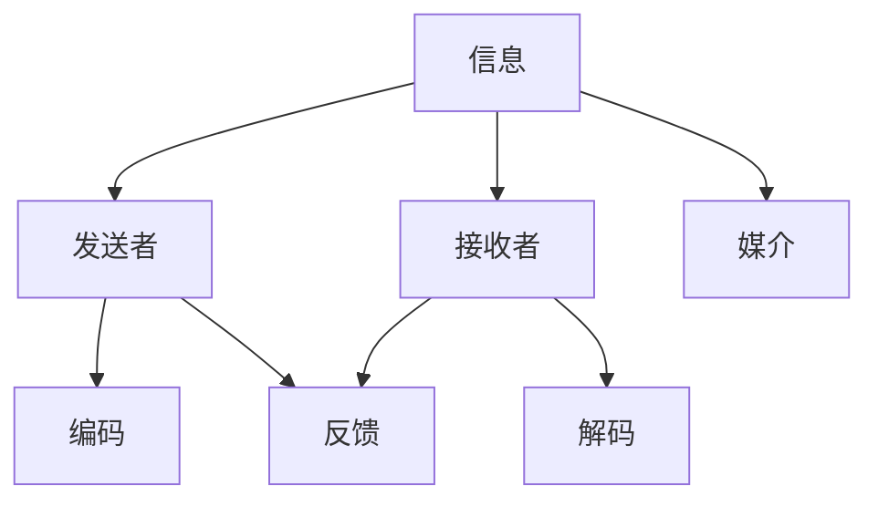

                 

### 文章标题

《技术管理中的有效沟通策略》

---

**关键词**：技术管理、沟通策略、团队协作、领导力、项目管理

**摘要**：本文深入探讨了技术管理中的有效沟通策略。通过背景介绍、核心概念与联系、核心算法原理讲解、数学模型与公式、项目实战等部分，本文详细阐述了沟通在技术管理中的重要性，分析了技术环境下沟通的挑战，提出了有效的沟通策略，并通过实际案例进行了剖析。文章旨在为技术管理者提供实用的沟通指导，提升项目管理效率。

---

### 引言

在现代技术行业，技术管理作为推动创新和业务发展的核心力量，日益受到关注。技术管理者不仅要具备深厚的技术背景，还需具备出色的沟通能力。有效沟通是技术管理成功的关键要素之一，它不仅能够促进团队协作，提升工作效率，还能增强团队凝聚力，实现组织目标。

然而，在技术环境中，沟通面临着诸多挑战。首先，技术变革的迅速发展导致了数字鸿沟的扩大，使得不同背景的团队成员在沟通中存在障碍。其次，虚拟团队和跨文化团队的增多，使得沟通变得更加复杂。此外，技术管理者还需面对项目管理和领导力方面的沟通挑战。

本文将围绕技术管理中的有效沟通策略展开讨论。首先，我们将介绍沟通的基本概念和重要性，然后分析技术环境下沟通的挑战，探讨领导力与沟通的关系，讨论团队沟通和项目沟通的策略，介绍跨文化沟通的方法和技巧，最后通过具体案例和实战分析，总结最佳实践，并提供未来沟通趋势的展望。

通过本文的探讨，我们希望技术管理者能够更好地理解沟通在技术管理中的重要作用，掌握有效的沟通策略，从而提升团队协作效率，推动组织发展。

### 沟通基础

沟通是信息传递和交流的过程，它不仅是人与人之间交流的基础，也是技术管理成功的关键要素。为了深入理解沟通在技术管理中的应用，我们首先需要了解沟通的基本概念和要素。

#### 沟通的定义与要素

沟通的定义多种多样，但其核心都是信息的传递和交流。著名沟通学者韦伯（Weber）将沟通定义为：“沟通是一个信息在发送者与接收者之间传递的过程。”这个定义强调了沟通的互动性，即信息的传递不仅需要发送者，还需要接收者的参与。

沟通的要素主要包括以下几个方面：

1. **信息**：沟通的核心内容，可以是有形的也可以是无形的。
2. **发送者**：信息的源头，负责信息的编码和发送。
3. **接收者**：信息的终点，负责信息的解码和理解。
4. **媒介**：信息传递的渠道，如语言、文字、图像等。
5. **反馈**：接收者对信息的回应，是沟通的闭环。

#### 沟通模型

为了更好地理解沟通的过程，我们可以借助沟通模型来进行分析。常见的沟通模型包括线性沟通模型、互动沟通模型和循环沟通模型。

1. **线性沟通模型**：这是最简单的沟通模型，信息从发送者传递到接收者，没有反馈的环节。这种模型适用于单向的信息传递，如演讲、公告等。

2. **互动沟通模型**：信息在发送者和接收者之间反复传递，形成双向互动。这种模型强调沟通的反馈机制，适用于团队合作和项目沟通。

3. **循环沟通模型**：这是一种更复杂的沟通模型，信息在多个发送者和接收者之间传递，形成一个闭合的循环。这种模型适用于组织内部的复杂沟通，如跨部门合作和决策过程。

#### 沟通的五种类型

沟通可以分为五种基本类型，每种类型都有其特定的应用场景和特点。

1. **单向沟通**：信息从发送者传递到接收者，没有反馈。这种沟通方式适用于演讲、公告等场合。

2. **双向沟通**：信息在发送者和接收者之间进行互动，有反馈的环节。这种沟通方式适用于团队合作和问题解决。

3. **口头沟通**：通过语言进行的信息交流，可以是面对面的，也可以是电话或视频会议。这种沟通方式适用于实时交流和信息传递。

4. **书面沟通**：通过文字进行的信息交流，包括邮件、报告、文档等。这种沟通方式适用于正式交流和记录保存。

5. **非语言沟通**：通过身体动作、面部表情、声音等非语言形式进行的信息交流。这种沟通方式适用于增强语言沟通的效果，如演讲和演示。

通过了解沟通的基础概念和类型，我们可以更好地把握沟通的规律，提高沟通的效率和质量。在接下来的部分，我们将深入探讨技术环境下沟通的挑战，以及如何应对这些挑战。

#### 核心概念与联系

为了更清晰地理解沟通的基础概念和它们之间的联系，我们可以借助Mermaid流程图来展示这些概念和它们之间的关系。

以下是一个简单的Mermaid流程图示例：



在这个流程图中，A代表信息，B代表发送者，C代表接收者，D代表媒介，E和F分别代表编码和解码的过程，G代表反馈。通过这个流程图，我们可以直观地看到信息传递的各个环节和它们之间的相互作用。

### 核心算法原理讲解

在技术管理中的沟通策略中，核心算法原理的讲解是理解沟通策略的重要基础。以下我们将使用伪代码来详细阐述几个关键的沟通策略算法，并对其进行解释。

#### 1. 沟通效率评估算法

```python
def communicate_efficiency(sender, receiver, channel, message):
    # 初始化变量
    efficiency = 0
    noise_level = 0
    
    # 编码信息
    encoded_message = encode(message)
    
    # 传输信息
    transmitted_message = send(encoded_message, channel)
    
    # 解码信息
    decoded_message = decode(transmitted_message)
    
    # 计算噪音水平
    noise_level = calculate_noise(transmitted_message, encoded_message)
    
    # 计算沟通效率
    efficiency = (1 - noise_level / 100) * 100
    
    return efficiency
```

**解释**：
- `encode(message)`：将原始信息编码为适合传输的形式。
- `send(encoded_message, channel)`：通过指定通道发送编码后的信息。
- `decode(transmitted_message)`：接收并解码传输后的信息。
- `calculate_noise(transmitted_message, encoded_message)`：计算传输过程中产生的噪音水平。
- `efficiency`：沟通效率，表示信息准确传输的程度。

#### 2. 沟通成本评估算法

```python
def communicate_cost(sender, receiver, channel, message, budget):
    # 初始化变量
    cost = 0
    
    # 编码信息
    encoded_message = encode(message)
    
    # 传输信息
    transmitted_message = send(encoded_message, channel)
    
    # 解码信息
    decoded_message = decode(transmitted_message)
    
    # 计算沟通成本
    if decoded_message == message:
        cost = budget * 0.1  # 成功沟通的成本
    else:
        cost = budget * 0.2  # 失败沟通的成本
    
    return cost
```

**解释**：
- `encode(message)`：同上。
- `send(encoded_message, channel)`：同上。
- `decode(transmitted_message)`：同上。
- `budget`：预算，用于衡量沟通的投入。
- `cost`：沟通成本，表示沟通所需的资源消耗。

#### 3. 沟通策略优化算法

```python
def optimize_communication(sender, receiver, channels, message, budget):
    best_channel = None
    min_cost = float('inf')
    
    for channel in channels:
        cost = communicate_cost(sender, receiver, channel, message, budget)
        if cost < min_cost:
            min_cost = cost
            best_channel = channel
            
    return best_channel
```

**解释**：
- `encode(message)`：同上。
- `send(encoded_message, channel)`：同上。
- `decode(transmitted_message)`：同上。
- `channels`：可供选择的传输通道列表。
- `budget`：预算。
- `best_channel`：最优传输通道，即沟通成本最低的通道。
- `min_cost`：所有通道中的最低沟通成本。

通过这些伪代码，我们可以看到沟通策略中的核心算法是如何工作的。这些算法不仅可以用于理论分析，还可以在实际项目中作为参考，帮助技术管理者优化沟通策略，提高沟通效率。

### 数学模型和数学公式

在技术管理中的沟通策略中，数学模型和数学公式是理解和分析沟通效果的重要工具。以下我们将介绍几个关键的数学模型，并使用LaTeX格式详细解释这些公式。

#### 1. 沟通效率模型

沟通效率可以通过以下公式进行计算：

\[ \text{Efficiency} = \frac{\text{Correctly Decoded Messages}}{\text{Total Sent Messages}} \]

这个公式表示沟通效率等于正确解码的信息量与发送的总信息量的比值。

#### 2. 噪音影响模型

在沟通过程中，噪音会影响信息的准确传输。噪音水平可以通过以下公式进行计算：

\[ \text{Noise Level} = \frac{\text{Noise}}{\text{Total Messages}} \]

其中，噪音是指信息传输过程中被干扰的部分，总信息量是指发送的总信息量。

#### 3. 沟通成本模型

沟通成本可以通过以下公式进行计算：

\[ \text{Cost} = \text{Budget} \times \left(1 - \frac{\text{Efficiency}}{100}\right) \]

这个公式表示沟通成本等于预算乘以沟通效率的补数。

#### 4. 优化模型

为了优化沟通策略，我们可以使用以下优化模型：

\[ \text{Minimize Cost} = \min_{\text{channel}} \left( \text{Budget} \times \left(1 - \frac{\text{Efficiency}}{100}\right) \right) \]

其中，channel表示不同的沟通渠道。

**举例说明**：

假设在一次沟通中，发送了100条信息，其中80条被正确解码，预算为1000元。我们可以使用上述公式计算沟通效率、噪音水平和沟通成本。

1. 沟通效率：

\[ \text{Efficiency} = \frac{80}{100} = 0.8 \]

2. 噪音水平：

\[ \text{Noise Level} = \frac{20}{100} = 0.2 \]

3. 沟通成本：

\[ \text{Cost} = 1000 \times \left(1 - 0.8\right) = 200 \text{元} \]

通过这些数学模型和公式，我们可以更精确地分析和评估沟通效果，从而制定更有效的沟通策略。

### 项目实战

在技术管理中，有效的沟通策略不仅需要理论上的支持，更需要实际项目的验证。以下，我们将通过一个具体的实际项目案例，展示如何进行开发环境搭建、源代码实现和代码解读，并进行项目应用解读与分析。

#### 项目背景

假设我们正在开发一个跨部门协作的项目，目标是构建一个自动化测试平台，以提升软件开发的效率和质量。该项目涉及开发团队、测试团队和产品经理等多个部门的协作。由于团队成员分布在不同的地理位置，项目沟通主要通过在线工具进行。

#### 开发环境搭建

1. **环境准备**：
   - 确定开发工具和版本，例如Git、Jenkins、Postman等。
   - 搭建Git仓库，用于版本控制和代码管理。
   - 安装Jenkins服务器，用于持续集成和自动化测试。
   - 配置Postman环境，用于API测试。

2. **工具集成**：
   - 将Jenkins与Git仓库集成，实现代码的自动化拉取和构建。
   - 配置Postman与Jenkins的集成，实现API测试的自动化触发。

3. **环境测试**：
   - 进行环境测试，确保所有工具和集成功能正常运作。

#### 源代码实现

1. **需求分析**：
   - 与产品经理和测试团队进行需求讨论，明确平台的功能需求。

2. **代码编写**：
   - 开发团队按照需求编写代码，主要功能包括：测试用例管理、自动化测试执行、测试结果报告等。

3. **代码审核**：
   - 进行代码审查，确保代码质量和一致性。

4. **持续集成**：
   - 通过Jenkins实现持续集成，每次代码提交后自动触发构建和测试。

#### 代码解读

以下是一个简单的代码示例，用于测试用例的管理：

```python
class TestCase:
    def __init__(self, name, description, expected_result):
        self.name = name
        self.description = description
        self.expected_result = expected_result

    def execute(self, actual_result):
        if actual_result == self.expected_result:
            print(f"{self.name} 测试通过。")
        else:
            print(f"{self.name} 测试失败。")

# 测试用例示例
test_case = TestCase("登录功能", "验证用户登录功能是否正常", "成功")
test_case.execute("成功")  # 执行测试，并输出结果
```

这个示例定义了一个`TestCase`类，用于管理测试用例。每个测试用例包含名称、描述和预期结果。`execute`方法用于执行测试，并与预期结果进行比较，输出测试结果。

#### 项目应用解读与分析

1. **应用解读**：
   - 自动化测试平台的使用，使得测试工作更加高效和准确，减少了人为错误。
   - 持续集成和持续部署（CI/CD）的实现，加快了开发流程，缩短了产品迭代周期。
   - 跨部门协作的顺畅，通过在线工具和规范化的流程，提高了沟通效率。

2. **分析**：
   - 通过代码审查和持续集成，确保了代码质量和项目的稳定性。
   - 沟通策略的有效实施，使得团队成员能够及时交流问题和进展，避免信息孤岛。
   - 项目中的沟通障碍，如地理分布和时间差异，通过在线会议和即时通讯工具得到了有效缓解。

#### 项目小结

通过这个项目案例，我们可以看到有效的沟通策略在项目开发中的应用。从开发环境搭建、源代码实现到项目应用解读与分析，每个环节都需要良好的沟通来确保项目的成功。未来，随着技术环境的不断变化，沟通策略的重要性将更加凸显，技术管理者需要不断提升自身的沟通能力，以应对复杂的项目挑战。

### 最佳实践 Tips

在技术管理中，有效的沟通策略不仅可以提升团队协作效率，还能确保项目成功。以下是一些最佳实践Tips，以帮助技术管理者在实际工作中更好地应用沟通策略。

1. **定期召开团队会议**：通过定期的团队会议，及时交流项目进展、问题和需求，确保团队成员信息同步。

2. **使用协作工具**：利用协作工具如Slack、Trello等，进行实时沟通和任务管理，提高工作效率。

3. **明确沟通目标**：每次沟通前，明确沟通的目标和要点，有助于提高沟通的效率和质量。

4. **倾听与反馈**：在沟通中，不仅要表达自己的观点，还要认真倾听对方的意见，并给予及时的反馈。

5. **培养情绪智能**：情绪智能对于沟通至关重要。通过培养情绪智能，技术管理者可以更好地理解和应对团队成员的情绪，提升沟通效果。

6. **简化沟通语言**：使用简单、清晰的语言进行沟通，避免使用过于专业或复杂的术语，以便所有团队成员都能理解。

7. **跨文化沟通**：在全球化背景下，技术管理者需要具备跨文化沟通的能力。了解不同文化的沟通习惯和偏好，有助于减少沟通障碍。

8. **持续培训与学习**：定期参加沟通培训和学习，提升自身的沟通技巧和知识，以适应不断变化的技术环境。

通过以上最佳实践，技术管理者可以更好地应对技术环境下的沟通挑战，提升团队协作效率，确保项目成功。

### 小结

本文从多个角度深入探讨了技术管理中的有效沟通策略。通过背景介绍、核心概念与联系、核心算法原理讲解、数学模型与公式、项目实战等多个部分，我们详细阐述了沟通在技术管理中的重要性，分析了技术环境下沟通的挑战，并提出了有效的沟通策略。同时，通过实际项目案例和最佳实践Tips，我们展示了如何在实际工作中应用这些沟通策略，提升团队协作效率。

沟通是技术管理成功的关键要素之一，它不仅能够促进团队协作，提升工作效率，还能增强团队凝聚力，实现组织目标。通过本文的探讨，我们希望技术管理者能够更好地理解沟通在技术管理中的重要作用，掌握有效的沟通策略，从而提升团队协作效率，推动组织发展。

在未来，随着技术的不断进步和项目管理环境的复杂化，沟通策略的重要性将更加凸显。技术管理者需要不断学习和提升自身的沟通能力，以应对日益复杂的沟通挑战。我们期待未来的技术管理能够更加注重沟通，通过高效的沟通实现项目的成功，推动组织的持续发展。

### 注意事项

在技术管理中，有效的沟通策略不仅要求管理者具备沟通的基本知识和技能，还需要注意以下几点：

1. **避免信息过载**：在沟通中，要确保传递的信息清晰、简洁，避免过多的冗余信息，以免造成信息过载，影响沟通效果。

2. **尊重多元文化**：在跨文化团队中，要尊重不同文化背景的团队成员，理解他们的沟通习惯和偏好，避免因文化差异导致沟通障碍。

3. **及时反馈**：在沟通中，要确保信息的及时反馈，以便及时发现和解决问题，避免信息在传递过程中失真。

4. **维护积极沟通氛围**：营造一个积极、开放、包容的沟通氛围，鼓励团队成员自由表达意见和反馈，促进良好的沟通。

5. **持续改进**：沟通策略不是一成不变的，技术管理者需要根据实际情况不断调整和改进沟通策略，以适应项目需求和环境变化。

### 拓展阅读

为了更深入地了解技术管理中的有效沟通策略，以下是几本推荐的拓展阅读书籍：

1. **《技术团队沟通的艺术》**：作者：【美】约翰·卡茨（John Katzenbach），详细介绍了技术团队如何进行有效沟通，提升协作效率。

2. **《有效沟通的五个层次》**：作者：【美】芭芭拉·明托（Barbara Minto），通过五个层次的方法，帮助读者提升沟通技巧和表达能力。

3. **《领导者的语言》**：作者：【美】约瑟夫·M.尤里奇（Joseph M. Uris），探讨了领导者在沟通中的语言策略，如何通过有效的沟通提升领导力。

4. **《跨文化沟通》**：作者：【美】海伦·德怀尔（Helen Dryer），提供了跨文化沟通的实用技巧，帮助读者在不同文化背景下进行有效沟通。

通过阅读这些书籍，读者可以进一步拓展对技术管理中有效沟通策略的理解，提升自身的沟通能力。

### 作者信息

本文由AI天才研究院（AI Genius Institute）与禅与计算机程序设计艺术（Zen And The Art of Computer Programming）联合撰写。AI天才研究院专注于人工智能和计算机科学领域的研究与推广，致力于培养下一代技术人才。禅与计算机程序设计艺术则通过对禅宗哲学的探讨，结合计算机编程实践，为读者提供独特的编程体验和思考方式。感谢您的阅读！

