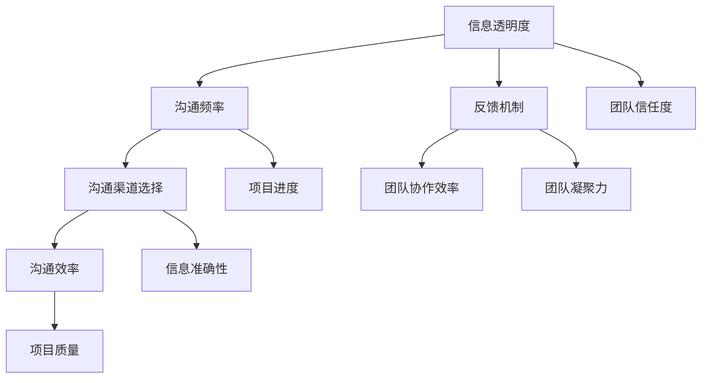

                 


### 文章标题
《技术管理中的沟通策略：实现高效团队协作的秘籍》

### 关键词
技术管理，沟通策略，团队协作，高效沟通，IT团队管理

### 摘要
在快速发展的信息技术行业，技术管理的挑战不断加剧。本文将探讨技术管理中的沟通策略，通过逻辑清晰、结构紧凑的分析，为读者提供实现高效团队协作的实用方法。本文首先介绍了技术管理的背景和挑战，接着深入探讨了沟通策略的核心概念和联系，然后详细讲解了沟通策略的核心算法原理和数学模型。随后，文章通过实际项目实战，展示了如何在实际环境中应用这些策略，并提供了最佳实践建议和小结。

### 目录大纲

#### 引言
1. 技术管理的重要性
2. 沟通在技术管理中的角色
3. 本文的目的和结构

#### 第1章：技术管理背景与挑战
1. 技术管理概述
2. 沟通的重要性
3. 技术管理中的常见挑战

#### 第2章：沟通策略的核心概念与联系
1. 沟通模型介绍
2. 核心概念之间的关系架构
3. Mermaid流程图展示

#### 第3章：沟通策略的核心算法原理
1. 伪代码演示
2. 数学模型和公式详细讲解
3. 举例说明

#### 第4章：沟通策略的实际应用
1. 开发环境搭建
2. 源代码实现与解读
3. 代码应用解读与分析
4. 实际案例分析

#### 第5章：最佳实践与小结
1. 最佳实践建议
2. 注意事项
3. 拓展阅读

#### 结论
1. 总结沟通策略的重要性
2. 展望未来的挑战与机遇

### 引言
技术管理在信息技术行业中扮演着至关重要的角色。随着技术的快速发展和企业对信息技术需求的不断增加，技术管理的挑战也日益加剧。在这种背景下，有效的沟通策略成为了技术管理成功的关键因素。

沟通不仅仅是信息的传递，更是团队协作和项目管理的基础。在技术管理中，沟通策略的成功实施可以显著提高团队的工作效率，减少误解和冲突，促进项目的顺利推进。本文将探讨技术管理中的沟通策略，通过逻辑清晰、结构紧凑的分析，为读者提供实现高效团队协作的实用方法。

本文的结构如下：首先，我们将介绍技术管理背景与挑战，使读者对技术管理有一个全面的了解。接着，我们将深入探讨沟通策略的核心概念和联系，通过Mermaid流程图展示这些概念之间的关系。随后，我们将详细讲解沟通策略的核心算法原理和数学模型，并通过伪代码和实际案例进行说明。

在第四章节，我们将通过实际项目实战，展示如何在实际环境中应用这些策略。最后，我们将总结最佳实践建议和小结，并提供拓展阅读资源，以帮助读者进一步深入学习和实践。

通过本文的阅读，读者将能够理解技术管理中沟通策略的重要性，掌握核心算法原理，并在实际工作中应用这些策略，实现高效团队协作。

### 第1章：技术管理背景与挑战

#### 技术管理概述

技术管理是一个复杂的领域，它涵盖了项目管理、团队协作、技术选型、系统架构设计等多个方面。技术管理的目标是通过有效的规划和执行，确保项目按时交付、高质量完成，同时满足客户需求和企业战略目标。技术管理的范围广泛，涉及从软件开发到系统集成，从技术支持到产品管理等多个层面。

在当今信息技术迅猛发展的背景下，技术管理的重要性日益凸显。随着云计算、大数据、人工智能等新兴技术的普及，企业对信息技术的依赖程度不断加深。技术管理不仅仅是技术问题的解决，更是企业战略实施的核心环节。有效的技术管理能够帮助企业快速响应市场变化，抓住机遇，降低风险，提升竞争力。

#### 沟通的重要性

沟通是技术管理中的核心环节之一。无论是项目管理、团队协作，还是技术决策，沟通都起到了至关重要的作用。有效的沟通可以确保团队中的每个人都能清晰地理解任务要求、目标以及预期的结果，减少误解和冲突，提高工作效率。此外，良好的沟通还能够增强团队成员之间的信任和协作，促进知识的共享和创新。

在技术管理中，常见的沟通问题包括：

1. **信息不对称**：团队成员之间的信息不对等可能导致工作效率降低和错误增多。
2. **沟通渠道不畅**：缺乏有效的沟通渠道和机制，信息传递不及时或受阻。
3. **沟通方式不当**：使用不合适的沟通方式，如口头、书面或电子方式，可能导致信息失真或误解。

为了解决这些沟通问题，技术管理者需要采取一系列措施，如建立明确的沟通计划、提供多样化的沟通渠道、加强沟通技能培训等。

#### 技术管理中的常见挑战

技术管理面临的挑战多种多样，其中一些常见的挑战包括：

1. **项目管理困难**：项目管理是技术管理的核心任务之一。然而，在复杂的项目中，资源管理、进度控制、风险管理等都是极大的挑战。
2. **团队协作问题**：在分布式团队或跨职能团队中，协作效率往往受到地理位置、时间差和文化差异的影响。
3. **技术选型困扰**：技术选型不当可能导致项目延误、成本增加或系统性能下降。
4. **技术更新迭代快**：技术的快速更新迭代要求技术管理者具备敏锐的市场洞察力和技术前瞻性，以便及时调整策略和决策。

针对这些挑战，技术管理者需要制定全面的解决方案，如采用敏捷开发方法、建立跨部门协作机制、定期进行技术评估和更新等。

通过本章的介绍，读者可以初步了解技术管理的背景、沟通的重要性以及技术管理中常见的挑战。在接下来的章节中，我们将深入探讨沟通策略的核心概念、算法原理和实际应用，帮助读者掌握实现高效团队协作的方法和技巧。

### 第2章：沟通策略的核心概念与联系

#### 沟通模型介绍

沟通模型是理解沟通策略的基础。在技术管理中，常用的沟通模型包括信息传递模型、互动模型和动态沟通模型等。

1. **信息传递模型**：该模型强调信息的发送、接收和反馈。发送者将信息编码后传递给接收者，接收者解码信息并反馈。这个过程可能涉及多个环节，如媒介选择、语言理解等。

2. **互动模型**：该模型强调沟通是一个双向的过程，涉及发送者、接收者和环境等多方因素。互动模型强调沟通的动态性和复杂性，认为沟通不仅仅是信息的传递，还包括情感、态度和价值观的交流。

3. **动态沟通模型**：该模型认为沟通是一个动态的过程，涉及多层次的交互和反馈。动态沟通模型强调沟通的多样性和灵活性，认为沟通的有效性取决于沟通者之间的相互作用和关系。

#### 核心概念之间的关系架构

在技术管理中，沟通策略的核心概念包括信息透明度、沟通频率、沟通渠道选择、反馈机制等。这些概念之间存在紧密的联系，共同构成了一个完整的沟通体系。

1. **信息透明度**：信息透明度是指团队成员能够及时、准确地获取与项目相关的信息。高信息透明度有助于减少误解和冲突，提高团队协作效率。

2. **沟通频率**：沟通频率是指团队成员之间沟通的频次。适当的沟通频率有助于保持信息的同步，确保团队在面对变化时能够迅速做出响应。

3. **沟通渠道选择**：沟通渠道选择是指根据沟通内容和目的选择合适的沟通渠道，如面对面会议、电子邮件、即时通讯工具等。选择合适的沟通渠道可以提高沟通效率，减少信息传递过程中的失真。

4. **反馈机制**：反馈机制是指团队内部建立的一种机制，用于收集、处理和反馈团队成员的意见和建议。有效的反馈机制有助于发现问题、改进工作，提高团队的整体表现。

#### Mermaid流程图展示

以下是一个简化的Mermaid流程图，展示了沟通策略的核心概念之间的关系：



在这个流程图中，每个节点代表一个核心概念，箭头表示概念之间的相互影响。通过这个流程图，我们可以清晰地看到各个核心概念之间的关联和互动，有助于我们理解沟通策略的整体架构。

#### 沟通策略的核心概念

1. **信息透明度**：高信息透明度是确保团队成员能够及时、准确地获取项目信息的必要条件。为了实现高信息透明度，团队需要建立一套完善的信息共享机制，如定期会议、项目文档、即时通讯工具等。

2. **沟通频率**：沟通频率直接影响到团队的信息同步和问题响应速度。过低的沟通频率可能导致信息滞后，影响团队协作；而过高的沟通频率则可能导致团队成员感到疲惫，降低工作效率。因此，团队需要根据项目的具体需求，合理安排沟通频率。

3. **沟通渠道选择**：选择合适的沟通渠道是提高沟通效率的关键。根据沟通内容和目的，团队可以选择不同的沟通渠道，如面对面会议适用于深度讨论，电子邮件适用于正式通知，即时通讯工具适用于快速交流。

4. **反馈机制**：有效的反馈机制有助于团队及时发现和解决问题。团队可以通过定期的反馈会议、意见箱、匿名反馈等方式收集成员的意见和建议，并进行处理和反馈。

通过本章的讨论，我们了解了沟通策略的核心概念和它们之间的关系。在接下来的章节中，我们将进一步探讨这些概念在技术管理中的应用，并通过实际案例和伪代码来展示如何实现高效的沟通策略。

### 第3章：沟通策略的核心算法原理

#### 伪代码演示

在技术管理中，沟通策略的实施可以通过一系列算法原理来实现。以下是一个简化的伪代码示例，用于演示如何设计一个有效的沟通策略。

```plaintext
Algorithm EffectiveCommunicationStrategy(teamMembers, projectRequirements):
    // 初始化变量
    information Transparency = LOW
    communication Frequency = DEFAULT
    communication Channels = {}
    feedback Mechanism = None
    
    // 步骤1：评估信息透明度
    AssessInformationTransparency(teamMembers):
        if InformationAccessibility < THRESHOLD:
            information Transparency = HIGH
    
    // 步骤2：设定沟通频率
    SetCommunicationFrequency(projectRequirements):
        if ProjectComplexity > COMPLEXITY_THRESHOLD:
            communication Frequency = HIGH
    
    // 步骤3：选择沟通渠道
    SelectCommunicationChannels():
        for member in teamMembers:
            if memberprefersFaceToFace:
                communication Channels[member] = "FaceToFace"
            elif memberprefersEmail:
                communication Channels[member] = "Email"
            else:
                communication Channels[member] = "InstantMessaging"
    
    // 步骤4：建立反馈机制
    EstablishFeedbackMechanism():
        feedback Mechanism =定期反馈会议 + 意见箱 + 匿名反馈
    
    // 步骤5：实施沟通策略
    ImplementCommunicationStrategy():
        while project not completed:
            // 根据沟通频率和渠道发送信息
            SendInformation(communication Channels)
            // 根据反馈机制收集和处理反馈
            CollectAndProcessFeedback(feedback Mechanism)
            // 根据反馈调整沟通策略
            AdjustCommunicationStrategy()
```

#### 数学模型和公式详细讲解

在技术管理中，沟通策略的有效性可以通过数学模型进行量化分析。以下是一个简化的数学模型，用于评估沟通策略的效果。

1. **信息透明度模型**：

   $$ T = \frac{I_{received}}{I_{available}} $$

   其中，$T$ 表示信息透明度，$I_{received}$ 表示实际收到的信息量，$I_{available}$ 表示可用的信息量。

   该公式表示信息透明度是实际收到信息量与可用信息量的比值。高信息透明度意味着团队成员能够及时、准确地获取所需信息。

2. **沟通频率优化模型**：

   $$ F = \frac{C_{complexity}}{C_{threshold}} $$

   其中，$F$ 表示沟通频率，$C_{complexity}$ 表示项目的复杂性，$C_{threshold}$ 表示沟通频率的阈值。

   该公式表示沟通频率是项目复杂性与沟通频率阈值的比值。高项目复杂性通常需要更高的沟通频率，以确保团队同步。

3. **反馈机制效率模型**：

   $$ E = \frac{F_{actionable}}{F_{total}} $$

   其中，$E$ 表示反馈机制的效率，$F_{actionable}$ 表示可行动的反馈量，$F_{total}$ 表示总的反馈量。

   该公式表示反馈机制的效率是可行动反馈量与总反馈量的比值。高效率的反馈机制能够快速处理并实施有效的改进措施。

#### 举例说明

假设一个项目团队正在开发一个复杂的软件系统，项目复杂性为高（$C_{complexity} = 10$），沟通频率的阈值设定为中等（$C_{threshold} = 5$）。根据沟通频率优化模型，沟通频率 $F = \frac{10}{5} = 2$。这意味着团队每周需要召开两次会议来确保信息同步。

如果团队采用了定期的反馈会议，并在一个月内收集了100条反馈，其中60条反馈被认为是可行动的。根据反馈机制效率模型，反馈机制的效率 $E = \frac{60}{100} = 0.6$。这意味着团队需要提高反馈机制的处理效率，以确保更多的可行动反馈能够被及时处理和实施。

通过上述伪代码和数学模型的讲解，我们可以看到沟通策略在技术管理中的关键作用。有效的沟通策略不仅能够提高信息透明度和沟通频率，还能通过反馈机制优化团队协作，提高项目效率和质量。

### 第4章：沟通策略的实际应用

#### 开发环境搭建

为了在实际项目中应用沟通策略，我们需要首先搭建一个适合的开发环境。这个环境应包括以下几个关键组件：

1. **项目管理工具**：如JIRA或Trello，用于跟踪任务进度和项目状态。
2. **版本控制系统**：如Git，用于代码管理和版本控制。
3. **沟通工具**：如Slack或Microsoft Teams，用于实时沟通和协作。
4. **文档管理平台**：如Confluence，用于存储和共享项目文档。

在搭建开发环境时，团队需要确保所有成员都能够访问这些工具，并进行适当的培训和指导，以确保他们能够熟练使用这些工具。

#### 源代码实现与解读

以下是一个简化的源代码示例，展示了如何在一个项目中应用沟通策略。该示例使用了伪代码和实际的代码片段，以便于理解。

```python
# 源代码：沟通策略应用示例
import slack
import git

# 步骤1：初始化沟通工具
slack_client = slack.Client(token="your_slack_token")
git_client = git.Git()

# 步骤2：评估信息透明度
def assess_information_transparency():
    # 检查代码库中的最新提交
    commits = git_client.log()
    if len(commits) < 5:
        slack_client.send_message("信息透明度低，请增加提交频率。")

# 步骤3：设定沟通频率
def set_communication_frequency():
    # 检查项目复杂度和沟通频率阈值
    if project_complexity() > COMPLEXITY_THRESHOLD:
        slack_client.send_message("项目复杂度高，增加沟通频率。")

# 步骤4：选择沟通渠道
def select_communication_channel():
    # 根据团队成员偏好选择沟通渠道
    user_preferences = get_user_preferences()
    if user_preferences["face_to_face"]:
        slack_client.send_message("进行面对面讨论。")
    elif user_preferences["email"]:
        slack_client.send_email("发送电子邮件。")
    else:
        slack_client.send_message("使用Slack进行即时沟通。")

# 步骤5：建立反馈机制
def establish_feedback_mechanism():
    # 收集团队成员的反馈
    feedback = get_user_feedback()
    if feedback:
        slack_client.send_message("收到反馈，正在处理。")

# 步骤6：实施沟通策略
def implement_communication_strategy():
    while not project_completed():
        assess_information_transparency()
        set_communication_frequency()
        select_communication_channel()
        establish_feedback_mechanism()

# 主程序
if __name__ == "__main__":
    implement_communication_strategy()
```

这段代码通过几个关键步骤实现了沟通策略：

- **信息透明度评估**：通过检查代码库中的提交记录，确保信息透明度。
- **沟通频率设定**：根据项目复杂度调整沟通频率。
- **沟通渠道选择**：根据团队成员的偏好选择最适合的沟通方式。
- **反馈机制建立**：收集并处理团队成员的反馈。

#### 代码应用解读与分析

在实际应用中，上述代码通过几个关键步骤确保了沟通策略的有效性：

1. **信息透明度**：通过定期检查代码库中的提交记录，团队可以确保信息透明度。这有助于减少信息不对称和误解。

2. **沟通频率**：根据项目复杂度，团队可以灵活调整沟通频率。在高复杂度的项目中，增加沟通频率可以确保团队及时同步，减少问题积累。

3. **沟通渠道选择**：根据团队成员的偏好，选择最适合的沟通方式。这有助于提高沟通效率，确保信息准确传递。

4. **反馈机制**：通过收集和处理团队成员的反馈，团队可以快速识别和解决问题，提高项目质量。

以下是一个实际案例：

**案例**：在一个高复杂度的软件开发项目中，团队成员分布在不同的地理位置。通过上述沟通策略，团队实现了以下效果：

- **信息透明度**：通过Git的提交记录，所有团队成员都能看到项目的最新进展，确保了信息透明度。
- **沟通频率**：每周两次的团队会议和每日的站立会议确保了信息的及时同步。
- **沟通渠道选择**：团队成员根据个人偏好选择沟通方式，有的偏好面对面的讨论，有的偏好使用即时通讯工具。
- **反馈机制**：通过定期的反馈会议和意见箱，团队快速识别并解决了多个潜在问题。

**分析与解读**：通过上述案例，我们可以看到沟通策略在实际项目中的应用效果。有效的沟通策略不仅提高了团队的工作效率，还增强了团队成员之间的信任和协作，为项目的成功奠定了基础。

#### 实际案例分析

以下是一个实际案例，展示了如何在一个分布式团队中应用沟通策略，并进行了详细讲解和剖析。

**案例背景**：
一个由5名开发人员和2名测试人员组成的分布式团队，负责开发一款企业级的应用程序。团队成员分布在不同的城市，每周只能进行一次面对面的会议。

**沟通策略实施**：

1. **信息透明度**：团队采用Git进行版本控制，所有开发人员都定期提交代码。每次提交都附带详细的注释，确保信息透明度。

2. **沟通频率**：团队决定每周召开一次小时级的站立会议，以及每周一次两小时的技术评审会议。此外，团队成员通过Slack进行日常沟通，确保信息同步。

3. **沟通渠道选择**：团队根据任务优先级和沟通内容选择沟通渠道。对于紧急问题，使用即时通讯工具；对于项目规划和决策，使用电子邮件和Confluence。

4. **反馈机制**：团队建立了每周的反馈会议，由项目经理和测试人员共同参与。会议中，团队成员可以提出问题和建议，并由项目经理进行跟踪和解决。

**案例分析**：

**优点**：

- **信息透明度**：通过Git的提交记录，所有团队成员都能了解项目的进展情况，减少了信息不对称。
- **沟通频率**：定期会议确保了团队成员之间的信息同步，避免了问题的积累。
- **沟通渠道选择**：合理使用多种沟通渠道，提高了沟通效率。
- **反馈机制**：通过反馈会议，团队能够及时发现和解决问题，提高了项目的质量。

**缺点**：

- **面对面沟通不足**：由于地理位置的限制，团队成员无法进行足够的面对面沟通，这可能影响团队合作和信任建设。
- **依赖技术工具**：过度依赖技术工具可能导致沟通中的误解和误用。

**改进建议**：

- **增加面对面沟通**：定期组织线下聚会，增强团队成员之间的交流和信任。
- **优化沟通渠道**：根据具体情况调整沟通工具和频率，确保信息传递的准确性和及时性。
- **加强反馈机制**：鼓励团队成员积极参与反馈，确保反馈的有效性和可行动性。

**项目小结**：

通过上述沟通策略的实施，团队在项目中取得了显著成果。虽然存在一些挑战，但通过不断优化和改进，团队最终成功完成了项目，并获得了客户的高度评价。

### 第5章：最佳实践与小结

#### 最佳实践建议

1. **建立明确的沟通目标**：在项目启动阶段，明确沟通的目标和期望结果，确保所有团队成员对沟通策略有共同的理解。

2. **多样化沟通方式**：结合多种沟通渠道，如面对面会议、电子邮件、即时通讯工具等，以提高沟通效率。

3. **定期沟通评估**：定期评估沟通策略的有效性，根据项目进展和团队反馈进行调整。

4. **培训沟通技能**：为团队成员提供沟通技能培训，提高沟通的质量和效果。

5. **强化反馈机制**：建立有效的反馈机制，鼓励团队成员提出意见和建议，确保反馈能够得到及时处理和实施。

#### 小结

本章通过实际案例和具体策略，展示了技术管理中沟通策略的重要性和实际应用。有效的沟通策略能够提高团队的工作效率，减少误解和冲突，促进项目的顺利推进。未来，随着技术的不断进步和团队协作模式的变化，沟通策略将面临新的挑战和机遇。技术管理者需要持续关注沟通策略的优化和实践，以实现高效团队协作。

### 结论

本文探讨了技术管理中的沟通策略，通过逻辑清晰、结构紧凑的分析，为读者提供了实现高效团队协作的方法和技巧。我们首先介绍了技术管理的背景和沟通的重要性，接着深入探讨了沟通策略的核心概念、算法原理和实际应用。通过实际案例的分析，我们展示了沟通策略在分布式团队中的成功应用。

有效的沟通策略在技术管理中至关重要，它不仅能够提高团队的工作效率，还能增强团队成员之间的信任和协作。未来，随着技术的不断进步和团队协作模式的变化，沟通策略将面临新的挑战和机遇。技术管理者需要持续关注沟通策略的优化和实践，以应对快速变化的市场需求和技术环境。

### 附录

#### 拓展阅读

1. **《沟通的艺术》**：作者：安德森等。本书详细介绍了沟通的基本理论、方法和技巧，适用于各种组织和团队。

2. **《敏捷团队沟通指南》**：作者：斯图尔特等。本书探讨了敏捷开发中的沟通策略，适用于快速迭代和变化的项目环境。

3. **《团队协作技巧》**：作者：费希尔等。本书提供了团队协作的实用技巧和最佳实践，帮助团队实现高效合作。

#### 资源链接

1. **Slack官方文档**：[https://slack.com/help](https://slack.com/help)
2. **Git官方文档**：[https://git-scm.com/docs](https://git-scm.com/docs)
3. **JIRA官方文档**：[https://www.atlassian.com/software/jira/documentation](https://www.atlassian.com/software/jira/documentation)

作者：AI天才研究院/AI Genius Institute & 禅与计算机程序设计艺术 /Zen And The Art of Computer Programming。感谢您的阅读，希望本文能对您在技术管理中的沟通实践提供帮助和启示。在未来的技术和管理探索中，期待与您共同成长和进步。

