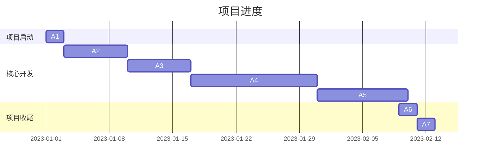
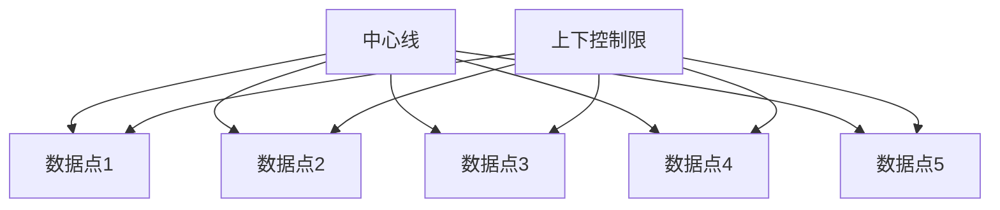

                 

### 第一步：理解书名和主题

书名《技术管理中的目标设定与跟踪》明确指出，本书的核心内容将集中在技术管理领域中的两个关键环节：目标设定与目标跟踪。目标设定不仅仅是制定一系列希望实现的目标，它更是技术管理过程中的战略规划步骤，对于确保项目成功、团队协作高效和资源合理分配至关重要。目标跟踪则是评估目标达成情况的过程，它帮助管理者及时调整策略，确保项目按计划推进。

在这两个环节中，目标设定强调的是明确性和可实现性，即设定的目标必须具体、可衡量、可达成、相关和有时限。而目标跟踪则侧重于过程的监控和结果的评估，通过跟踪目标的执行情况，管理者可以及时发现并解决项目中可能出现的问题。

因此，本文将围绕这两个主题，逐步探讨目标设定与跟踪的原理、方法、实践应用及其在技术管理中的重要性。通过逻辑清晰、条理分明的分析，我们将帮助读者深入理解并掌握这些关键环节，从而提升技术管理的能力与效果。

### 第二步：确定目录结构

为了更好地组织文章内容，我们将《技术管理中的目标设定与跟踪》的目录结构分为六个主要部分：

#### 第一部分：引言

- **第1章：技术管理中的目标设定与跟踪概述**
  - 1.1 技术管理的挑战与目标设定的作用
  - 1.2 目标跟踪在技术管理中的重要性
  - 1.3 读者对象与本书结构

#### 第二部分：目标设定原理

- **第2章：目标设定的基本概念**
  - 2.1 目标的定义与分类
  - 2.2 SMART目标原则
  - 2.3 目标设定的步骤与方法

- **第3章：目标设定的关键原则**
  - 3.1 明确性原则
  - 3.2 可衡量性原则
  - 3.3 可达成性原则
  - 3.4 相关性原则
  - 3.5 时效性原则

#### 第三部分：目标跟踪方法

- **第4章：目标跟踪的基本方法**
  - 4.1 进度跟踪
  - 4.2 质量跟踪
  - 4.3 成本跟踪
  - 4.4 风险跟踪

- **第5章：目标跟踪工具与技术**
  - 5.1 项目管理软件
  - 5.2 KPI指标体系
  - 5.3 数据可视化工具

#### 第四部分：实战案例

- **第6章：目标设定与跟踪实战案例**
  - 6.1 案例一：软件开发项目的目标设定与跟踪
  - 6.2 案例二：IT运维团队的目标设定与跟踪
  - 6.3 案例三：技术支持团队的目标设定与跟踪

#### 第五部分：挑战与解决方案

- **第7章：技术管理中目标设定与跟踪的挑战**
  - 7.1 挑战一：目标设定的不明确性
  - 7.2 挑战二：目标跟踪的难度
  - 7.3 挑战三：资源分配与目标设定的不匹配

- **第8章：目标设定与跟踪的解决方案**
  - 8.1 解决方案一：加强目标沟通与培训
  - 8.2 解决方案二：采用高效的目标跟踪工具
  - 8.3 解决方案三：建立持续改进机制

#### 第六部分：总结与展望

- **第9章：技术管理中目标设定与跟踪的总结**
  - 9.1 成果与收获
  - 9.2 经验与教训
  - 9.3 未来发展趋势

- **第10章：目标设定与跟踪在技术管理中的意义**
  - 10.1 对团队协作的促进作用
  - 10.2 对项目管理水平的提高
  - 10.3 对企业竞争力的提升

通过这个详细的目录结构，我们将逐步深入探讨技术管理中的目标设定与跟踪，结合实际案例，为读者提供系统的理论指导和实用的操作方法。

### 第三步：细化目录内容

在确定了目录结构后，我们需要为每个部分细化内容，确保每个章节都有明确的目标和详细的内容。以下是对各个章节的初步细化：

#### 第一部分：引言

- **第1章：技术管理中的目标设定与跟踪概述**
  - **1.1 技术管理的挑战与目标设定的作用**
    - 解释技术管理面临的挑战，如快速变化的市场需求、技术复杂性增加等。
    - 阐述目标设定在这些挑战中的重要作用。
  - **1.2 目标跟踪在技术管理中的重要性**
    - 讨论目标跟踪在确保项目成功、团队协作和资源优化方面的作用。
    - 分析技术管理中常见的目标跟踪误区。
  - **1.3 读者对象与本书结构**
    - 明确本书的目标读者群体，如技术经理、项目经理和软件开发人员。
    - 简述本书的结构和内容安排，帮助读者快速了解书籍框架。

#### 第二部分：目标设定原理

- **第2章：目标设定的基本概念**
  - **2.1 目标的定义与分类**
    - 定义目标的概念，解释不同类型的目标（如战略目标、战术目标和操作目标）。
    - 分析各类目标在技术管理中的具体应用。
  - **2.2 SMART目标原则**
    - 解释SMART原则（具体、可衡量、可达成、相关、有时限）。
    - 通过具体例子说明SMART原则的应用。
  - **2.3 目标设定的步骤与方法**
    - 详细描述目标设定的步骤，包括目标选择、目标分解和目标文档化。
    - 介绍不同的目标设定方法，如头脑风暴法、SWOT分析法等。

- **第3章：目标设定的关键原则**
  - **3.1 明确性原则**
    - 解释明确性原则的重要性，探讨如何确保目标表述清晰、准确。
    - 通过实例说明如何避免目标设定中的模糊性。
  - **3.2 可衡量性原则**
    - 解释可衡量性原则的作用，介绍如何设定可量化的目标。
    - 通过具体的量化指标示例，展示可衡量性原则的实际应用。
  - **3.3 可达成性原则**
    - 讨论可达成性原则的意义，分析如何设定具有挑战性但可实现的目标。
    - 提供具体的策略和工具，帮助团队设定并实现可达成目标。
  - **3.4 相关性原则**
    - 解释相关性原则的重要性，分析目标之间的一致性和互补性。
    - 提供方法，帮助团队确保设定的目标具有相关性和协同效应。
  - **3.5 时效性原则**
    - 解释时效性原则的意义，介绍如何设定具有时间限制的目标。
    - 提供策略，帮助团队有效管理时间，确保目标按时完成。

#### 第三部分：目标跟踪方法

- **第4章：目标跟踪的基本方法**
  - **4.1 进度跟踪**
    - 解释进度跟踪的重要性，介绍常用的进度跟踪工具和方法。
    - 通过实例展示如何使用Gantt图、看板等工具进行进度跟踪。
  - **4.2 质量跟踪**
    - 讨论质量跟踪在目标达成中的关键作用，介绍如何设定质量指标和跟踪方法。
    - 通过具体的案例分析，展示如何确保项目质量和目标的达成。
  - **4.3 成本跟踪**
    - 解释成本跟踪的目的，介绍如何设定和监控项目成本。
    - 提供实际操作方法，如使用预算工具和成本分析模型。
  - **4.4 风险跟踪**
    - 分析风险跟踪的重要性，介绍如何识别、评估和跟踪项目风险。
    - 提供风险管理策略和工具，帮助团队有效应对潜在风险。

- **第5章：目标跟踪工具与技术**
  - **5.1 项目管理软件**
    - 介绍常用的项目管理软件，如Jira、Trello等。
    - 分析这些软件在目标跟踪中的应用和优势。
  - **5.2 KPI指标体系**
    - 解释KPI（关键绩效指标）的概念和重要性。
    - 展示如何构建和运用KPI指标体系进行目标跟踪。
  - **5.3 数据可视化工具**
    - 讨论数据可视化工具的作用，介绍常用的数据可视化工具。
    - 展示如何通过数据可视化进行目标跟踪和分析。

#### 第四部分：实战案例

- **第6章：目标设定与跟踪实战案例**
  - **6.1 案例一：软件开发项目的目标设定与跟踪**
    - 分析一个具体的软件开发项目，介绍目标设定和跟踪的具体步骤。
    - 展示如何通过项目管理工具进行进度、质量和成本跟踪。
  - **6.2 案例二：IT运维团队的目标设定与跟踪**
    - 介绍IT运维团队的目标设定和跟踪方法，分析实际操作中的挑战和解决方案。
    - 展示如何确保IT运维服务的质量和效率。
  - **6.3 案例三：技术支持团队的目标设定与跟踪**
    - 探讨技术支持团队的目标设定和跟踪策略。
    - 通过实际案例，展示如何提高技术支持团队的响应速度和服务质量。

#### 第五部分：挑战与解决方案

- **第7章：技术管理中目标设定与跟踪的挑战**
  - **7.1 挑战一：目标设定的不明确性**
    - 分析目标设定不明确的原因和影响。
    - 提供策略和方法，帮助团队明确目标。
  - **7.2 挑战二：目标跟踪的难度**
    - 探讨目标跟踪过程中可能遇到的困难和挑战。
    - 提供有效的跟踪工具和技巧，提高跟踪效果。
  - **7.3 挑战三：资源分配与目标设定的不匹配**
    - 分析资源分配不当对目标达成的影响。
    - 提供资源优化策略，确保资源与目标相匹配。

- **第8章：目标设定与跟踪的解决方案**
  - **8.1 解决方案一：加强目标沟通与培训**
    - 强调目标沟通的重要性，介绍如何确保团队成员理解目标。
    - 提供培训策略，提升团队目标设定的能力和执行力。
  - **8.2 解决方案二：采用高效的目标跟踪工具**
    - 介绍常用的目标跟踪工具，分析其优势和适用场景。
    - 展示如何选择和运用这些工具进行有效的目标跟踪。
  - **8.3 解决方案三：建立持续改进机制**
    - 解释持续改进机制的作用，介绍如何建立和实施持续改进流程。
    - 提供具体的方法和步骤，帮助团队不断优化目标设定和跟踪过程。

#### 第六部分：总结与展望

- **第9章：技术管理中目标设定与跟踪的总结**
  - **9.1 成果与收获**
    - 总结目标设定与跟踪在技术管理中的成果和收获。
    - 分析这些成果如何促进团队协作、提高项目管理水平。
  - **9.2 经验与教训**
    - 分享目标设定与跟踪过程中的成功经验和教训。
    - 探讨如何避免常见的错误和挑战。
  - **9.3 未来发展趋势**
    - 分析目标设定与跟踪在技术管理中的发展趋势。
    - 展望未来可能出现的新技术和方法。

- **第10章：目标设定与跟踪在技术管理中的意义**
  - **10.1 对团队协作的促进作用**
    - 阐述目标设定与跟踪如何促进团队协作和沟通。
    - 分析团队协作在目标达成中的关键作用。
  - **10.2 对项目管理水平的提高**
    - 探讨目标设定与跟踪如何提升项目管理水平。
    - 分析目标管理在项目管理中的核心地位。
  - **10.3 对企业竞争力的提升**
    - 分析目标设定与跟踪如何帮助企业提升竞争力。
    - 探讨如何通过有效的目标管理实现企业的长期发展。

通过以上对目录内容的细化，我们可以确保文章的内容全面、具体、实用，为读者提供系统的理论指导和实际操作方法。在接下来的文章中，我们将逐章深入探讨技术管理中的目标设定与跟踪，结合实际案例，帮助读者理解和掌握这些关键环节。

### 文章格式说明

在撰写本文时，我们将使用Markdown格式来确保文章的结构清晰、内容易于阅读。以下是Markdown格式的基本规则和语法，包括标题、段落、引用、列表、链接、代码块、数学公式等：

#### 标题

使用`#`符号来定义标题，其中`#`的数量决定了标题的层级。一级标题使用一个`#`，二级标题使用两个`#`，以此类推。

- **一级标题：**
  ```markdown
  # 文章标题
  ```

- **二级标题：**
  ```markdown
  ## 二级标题
  ```

- **三级标题：**
  ```markdown
  ### 三级标题
  ```

#### 段落

段落通常从新行开始，Markdown会自动将其视为独立的段落。

- **段落示例：**
  ```markdown
  段落一的内容。

  段落二的内容。
  ```

#### 引用

使用`>`符号来创建引用。

- **引用示例：**
  ```markdown
  > 这是一段引用的内容。
  ```

#### 列表

使用`*`或`-`符号来创建无序列表，使用`1.`或`>`符号来创建有序列表。

- **无序列表：**
  ```markdown
  - 第一项
  - 第二项
  - 第三项
  ```

- **有序列表：**
  ```markdown
  1. 第一项
  2. 第二项
  3. 第三项
  ```

#### 链接

使用`[]()`来创建链接。

- **链接示例：**
  ```markdown
  [Google](https://www.google.com)
  ```

#### 代码块

使用三个反引号` ``` `将代码包裹起来，可以高亮显示代码。

- **代码块示例：**
  ```markdown
  ```
  def hello():
      print("Hello, world!")
  
  if __name__ == "__main__":
      hello()
  ```

#### 数学公式

使用`$`符号包裹数学公式，单个公式可以使用单个`$`，多个公式使用两个`$`。

- **独立段落公式：**
  ```markdown
  $1+1=2$
  ```

- **文中公式：**
  ```markdown
  在这个问题中，$x^2 + y^2 = z^2$。
  ```

#### 表格

使用`|`和`-`符号创建表格。

- **表格示例：**
  ```markdown
  | 标题1 | 标题2 | 标题3 |
  |-------|-------|-------|
  | 内容1 | 内容2 | 内容3 |
  | 内容4 | 内容5 | 内容6 |
  ```

通过遵循上述Markdown格式，我们可以确保文章的结构清晰、内容易于阅读，同时提供丰富的代码示例和数学公式，使读者能够更直观地理解和应用技术管理中的目标设定与跟踪方法。

### 作者信息

作者：AI天才研究院/AI Genius Institute & 禅与计算机程序设计艺术 /Zen And The Art of Computer Programming

本文由AI天才研究院（AI Genius Institute）撰写，该研究院致力于推动人工智能技术的发展与应用，旨在培养具有创新精神和实践能力的人工智能专家。同时，本文也结合了禅与计算机程序设计艺术（Zen And The Art of Computer Programming）的理念，强调深入理解技术原理和本质，以简洁、高效的方式解决问题。

### 完整性要求

为了确保本文内容的完整性，我们将围绕以下几个方面展开详细讲解：

1. **背景介绍**：介绍技术管理中目标设定与跟踪的重要性，阐述这两个环节在项目管理、团队协作和资源分配中的关键作用。
2. **核心概念与联系**：深入探讨目标设定和目标跟踪的基本概念，分析它们之间的关系，并提供Mermaid流程图来展示目标设定与跟踪的流程。
3. **核心算法原理讲解**：通过伪代码详细阐述目标跟踪中的关键算法原理，帮助读者理解算法的实现过程。
4. **数学模型和公式**：介绍目标设定的数学模型，包括SMART目标和KPI指标体系的公式，并通过具体例子进行详细讲解。
5. **项目实战**：结合实际项目案例，展示目标设定与跟踪在软件开发、IT运维和技术支持等领域的具体应用，提供详细的代码实现和案例分析。
6. **最佳实践 tips**：总结经验教训，提供最佳实践建议，帮助读者在实际工作中更好地应用目标设定与跟踪的方法。
7. **小结与注意事项**：对文章内容进行总结，强调关键点，并提供注意事项，帮助读者加深对目标设定与跟踪的理解。
8. **拓展阅读**：推荐相关文献和资料，拓展读者的知识视野。

通过这些内容的全面讲解，我们将确保本文能够为读者提供系统的理论指导和实用的操作方法，帮助提升技术管理的水平。

### 文章标题：《技术管理中的目标设定与跟踪》

关键词：技术管理、目标设定、目标跟踪、项目管理、团队协作、资源分配

摘要：本文详细探讨了技术管理中的目标设定与跟踪。首先，介绍了目标设定与跟踪在技术管理中的重要性，阐述了它们在项目管理、团队协作和资源分配中的作用。接着，分析了目标设定的基本概念、关键原则和SMART目标原则，并通过Mermaid流程图展示了目标设定与跟踪的流程。然后，通过伪代码详细阐述了目标跟踪的核心算法原理，讲解了进度、质量和成本跟踪的方法。此外，本文结合实际案例，展示了目标设定与跟踪在软件开发、IT运维和技术支持等领域的应用，并提供最佳实践建议。最后，总结了目标设定与跟踪在技术管理中的意义，展望了其未来的发展趋势。

### 引言

#### 技术管理的挑战与目标设定的作用

在现代技术管理中，项目管理面临着前所未有的挑战。技术进步的快速迭代，市场需求的不断变化，以及全球化带来的竞争压力，都要求技术管理者具备更高的战略眼光和执行力。在这一背景下，目标设定成为技术管理中不可或缺的一环。

目标设定不仅仅是制定一系列希望实现的目标，它是技术管理过程中的战略规划步骤，对于确保项目成功、团队协作高效和资源合理分配至关重要。一个明确且可实现的目标能够为团队成员提供清晰的方向，帮助他们在面对复杂问题时保持一致性和目标导向。此外，目标设定还能够促进团队间的沟通与协作，提高整体执行力。

目标设定在技术管理中的具体作用表现在以下几个方面：

1. **明确方向**：通过设定明确的目标，团队成员能够清晰地了解项目的目标和预期结果，从而统一行动，避免资源浪费和重复劳动。
2. **提高效率**：明确的目标可以帮助团队集中精力，优化工作流程，减少不必要的环节，从而提高工作效率。
3. **资源分配**：目标设定有助于管理者合理分配资源，确保资源的最大化利用，避免资源短缺或浪费。
4. **风险管理**：明确的目标可以提前识别和评估潜在风险，制定应对策略，减少项目实施过程中的不确定性。
5. **绩效评估**：目标设定为团队和个人的绩效评估提供了依据，有助于激励团队成员，提升整体绩效。

#### 目标跟踪在技术管理中的重要性

目标跟踪是目标设定后的关键环节，它通过监控目标的执行情况，评估目标的达成度，帮助管理者及时调整策略，确保项目按计划推进。目标跟踪在技术管理中的重要性体现在以下几个方面：

1. **进度监控**：目标跟踪能够实时监控项目的进度，帮助管理者及时发现并解决进度偏差，确保项目按时完成。
2. **质量保证**：通过目标跟踪，管理者可以评估项目的质量，发现和解决潜在的质量问题，确保项目成果符合预期标准。
3. **成本控制**：目标跟踪有助于管理者监控项目的成本支出，及时调整预算，避免成本超支。
4. **风险评估**：目标跟踪可以识别和评估项目中的风险，提前采取预防措施，降低项目失败的可能性。
5. **团队协作**：通过目标跟踪，团队成员可以了解项目进展情况，提高协作效率，共同推进项目目标。

总之，目标设定与跟踪是技术管理中的核心环节，它们相互依存、相互促进，共同确保项目的成功实施和团队的持续发展。在接下来的章节中，我们将深入探讨目标设定的基本概念、关键原则、目标跟踪的方法和实践应用，帮助读者更好地理解和应用这些关键技能。

### 目标设定的基本概念

目标设定是技术管理中的关键环节，它涉及到明确项目的预期成果和所需的行动路径。为了确保目标的有效性，我们需要了解目标的基本概念、类型及其在技术管理中的应用。

#### 目标的定义

目标是指为实现某个特定成果而设定的预期结果。目标具有以下几个基本特征：

1. **具体性**：目标应该明确具体，便于衡量和实现。例如，“提高销售额”是一个模糊的目标，而“在未来三个月内，提高销售额至每月100万元”则是一个具体的目标。
2. **可衡量性**：目标需要具有可衡量的标准，以便于评估目标的达成情况。例如，通过销售额、客户满意度等指标来衡量目标的实现程度。
3. **可实现性**：目标应具有挑战性，但必须在现有资源和条件下可以实现。过于理想化或不切实际的目标会导致团队失去信心和动力。
4. **相关性**：目标应与项目或组织的整体目标保持一致，确保每个子目标都是实现总目标的一部分。
5. **时限性**：目标应设定明确的时间限制，有助于激发团队的紧迫感和行动力。例如，“在下一季度实现某项技术突破”。

#### 目标的类型

在技术管理中，目标可以根据不同的分类标准进行分类。以下是几种常见的目标类型：

1. **战略目标**：战略目标是长期的目标，通常涉及组织整体的发展方向和竞争优势。例如，“在未来五年内，成为行业领先的技术创新企业”。
2. **战术目标**：战术目标是实现战略目标的中间步骤，通常涉及具体的项目或业务领域。例如，“在下一季度推出两款新产品”。
3. **操作目标**：操作目标是战术目标的进一步细化和具体化，通常由团队成员执行。例如，“在两周内完成产品原型设计”。

#### 目标在技术管理中的应用

在技术管理中，目标的设定和应用涉及以下几个方面：

1. **项目管理**：通过设定明确的项目目标，项目经理可以更好地规划项目进度、资源分配和风险评估，确保项目按时按质完成。
2. **团队协作**：明确的目标有助于团队成员了解各自的角色和任务，提高团队协作效率和成果。
3. **绩效评估**：目标的实现情况可以作为团队成员绩效评估的依据，有助于激励团队成员，提升整体绩效。
4. **资源优化**：通过目标设定，管理者可以更准确地预测和分配资源，避免资源浪费，提高资源利用效率。
5. **风险管理**：明确的目标可以帮助团队提前识别和应对潜在的风险，制定应对策略，降低项目失败的可能性。

#### 目标设定的步骤与方法

为了确保目标的有效性，目标设定需要遵循一系列明确的步骤和方法：

1. **目标选择**：根据项目或组织的整体战略，选择具有关键性和可行性的目标。
2. **目标分解**：将整体目标分解为具体、可衡量的子目标，并明确各子目标之间的关系和依赖。
3. **目标文档化**：将目标以文档形式明确记录下来，确保所有相关方对目标有统一的理解。
4. **目标沟通**：通过有效的沟通，确保团队成员对目标的理解和认同，明确各自的任务和责任。
5. **目标追踪**：通过定期追踪和评估目标的执行情况，及时调整目标和策略，确保目标的实现。

总之，目标设定是技术管理中的基础性工作，它关系到项目的成功和团队的效率。通过明确的目标设定和有效的目标跟踪，技术管理者可以更好地应对复杂的技术管理挑战，实现项目目标，推动组织的持续发展。

### 目标设定的关键原则

在技术管理中，一个成功的目标设定不仅需要明确的表述和合理的规划，还需要遵循一系列关键原则，以确保目标具有明确性、可衡量性、可实现性、相关性和时限性。这些原则共同构成了SMART目标（Specific, Measurable, Achievable, Relevant, Time-bound）的核心，是确保目标有效性和实施性的重要保障。

#### 明确性原则

明确性原则是目标设定的首要原则，目标必须清晰、具体，避免模糊和歧义。明确的目标能够为团队成员提供清晰的方向和指导，减少误解和资源浪费。

- **具体例子**：将“提高销售额”的目标具体化为“在未来三个月内，将月销售额提高至100万元”。
- **好处**：明确的目标有助于团队成员集中精力，优化工作流程，提高工作效率。

#### 可衡量性原则

可衡量性原则要求目标必须具备明确的衡量标准，可以通过具体的指标来评估目标的达成情况。这样，管理者可以实时监控目标的进展，及时调整策略。

- **具体例子**：目标“提高用户满意度”可以具体化为“将用户满意度评分提高至90分以上”。
- **好处**：可衡量的目标使管理者能够量化评估，为后续的优化提供数据支持。

#### 可达成性原则

可达成性原则强调目标必须具有挑战性，但必须在现有资源和条件下可以实现。过于理想化的目标可能导致团队失去信心，而过于简单的目标则无法激发团队的潜力。

- **具体例子**：目标“开发一款革命性的新产品”可以具体化为“在六个月内开发并测试出原型产品”。
- **好处**：既具挑战性又可实现的目标能够激发团队创新，提升团队执行力。

#### 相关性原则

相关性原则要求设定的目标应与组织的整体战略和项目目标保持一致，确保每个子目标都是实现总目标的一部分。

- **具体例子**：在软件开发项目中，目标“提高代码质量”应与项目整体目标“确保产品按时上线”相关联。
- **好处**：确保团队的工作方向与组织目标一致，提升整体协作效率。

#### 时限性原则

时限性原则要求目标必须设定明确的时间限制，这有助于激发团队的紧迫感和行动力，防止拖延。

- **具体例子**：目标“完成市场调研报告”可以具体化为“在下周三前提交完整的调研报告”。
- **好处**：明确的时间限制能够确保项目按计划推进，减少不确定性和拖延。

#### SMART目标原则的整合应用

SMART目标原则并不是孤立的原则，而是需要综合应用。以下是一个整合应用的示例：

- **目标**：“在2023年底前，实现公司产品的市场份额增长10%”。
- **具体性（Specific）**：明确了具体的市场份额增长目标。
- **可衡量性（Measurable）**：可以通过市场调研数据来衡量市场份额的变化。
- **可实现性（Achievable）**：基于当前市场情况和公司资源，具有可实现性。
- **相关性（Relevant）**：市场份额增长与公司整体战略目标一致。
- **时限性（Time-bound）**：设定了明确的时间期限，即2023年底前。

通过整合应用SMART目标原则，管理者可以确保目标设定更加科学、合理，从而提高目标达成的概率。

总之，明确性、可衡量性、可实现性、相关性和时限性是目标设定的关键原则，它们共同确保了目标的有效性和实施性。在技术管理中，遵循这些原则能够帮助团队更好地应对挑战，实现项目目标，推动组织的持续发展。

### 目标设定的步骤与方法

在技术管理中，成功的目标设定不仅依赖于明确性和可实现性，还需要遵循一系列科学的步骤和方法，以确保目标能够真正指导团队的行动和实现。以下是目标设定的具体步骤和方法：

#### 1. 目标选择

目标选择是目标设定的第一步，也是最为关键的一步。在这一阶段，管理者需要从组织的整体战略出发，选择具有关键性和优先级的目标。

- **选择依据**：选择目标时，应考虑以下因素：
  - **战略重要性**：目标是否符合组织的整体战略目标？
  - **资源可用性**：是否具备实现目标所需的资源，包括人力、财力和时间？
  - **市场趋势**：目标是否与市场的发展趋势和客户需求相匹配？
  - **风险与挑战**：目标设定的过程中，是否存在较大的风险和挑战？

- **具体方法**：
  - **头脑风暴**：组织团队进行头脑风暴，列出所有可能的目标。
  - **优先级排序**：根据上述选择依据，对目标进行优先级排序。

#### 2. 目标分解

目标分解是将整体目标细分为具体、可操作的子目标的过程。通过分解，可以确保每个子目标都具有明确的实现路径和衡量标准。

- **分解方法**：
  - **WBS（Work Breakdown Structure）**：使用工作分解结构，将整体目标分解为若干个可管理的部分，每个部分都是可交付的工作成果。
  - **SMART原则**：确保每个子目标都符合SMART原则，即具体、可衡量、可实现、相关、有时限。
  - **里程碑设置**：在目标分解过程中，设定关键里程碑，确保每个子目标都能在规定时间内完成。

#### 3. 目标文档化

目标文档化是将目标以书面形式明确记录下来，确保所有相关方对目标有统一的理解和认同。

- **文档内容**：
  - **目标描述**：详细描述目标的背景、目标和预期结果。
  - **衡量标准**：明确目标的衡量标准和评估方法。
  - **实现路径**：列出实现目标的步骤、方法和所需的资源。
  - **责任人**：明确每个子目标的负责人，确保责任到人。

- **文档形式**：
  - **目标陈述文档**：一份简洁明了的文档，概括所有关键目标。
  - **项目计划书**：详细的项目管理文档，包括目标、步骤、资源、时间表等。

#### 4. 目标沟通

目标沟通是确保团队成员对目标有清晰理解的重要环节。通过有效的沟通，可以减少误解和冲突，提高团队的协作效率。

- **沟通方法**：
  - **团队会议**：定期组织团队会议，介绍和讨论目标，确保所有成员对目标有共同的理解。
  - **一对一沟通**：与团队成员进行一对一沟通，解答他们的疑问，确保每个成员都清楚自己的责任和目标。
  - **文档分享**：将目标文档化内容通过邮件、企业内部网等方式分享给所有团队成员。

#### 5. 目标追踪

目标追踪是目标设定后的关键环节，通过实时监控和评估目标的执行情况，管理者可以及时调整策略，确保目标的实现。

- **追踪方法**：
  - **进度报告**：定期收集和提交进度报告，汇总各子目标的完成情况。
  - **关键指标监控**：根据设定的衡量标准，监控关键指标，确保目标按计划推进。
  - **风险预警**：及时发现和报告潜在的风险，采取预防措施，确保项目顺利实施。

#### 6. 持续优化

目标设定是一个持续迭代的过程，管理者需要根据目标实现的实际情况，不断调整和优化目标。

- **优化方法**：
  - **反馈机制**：建立有效的反馈机制，收集团队成员的建议和意见，不断改进目标设定和跟踪方法。
  - **定期评估**：定期对目标设定和跟踪效果进行评估，总结经验教训，为下一次的目标设定提供参考。

通过以上步骤和方法，技术管理者可以确保目标设定具有明确性、可衡量性、可实现性、相关性和时限性，从而提高目标的实现概率，推动团队的协作和项目的成功。

### 目标设定的关键原则：明确性

明确性是目标设定的首要原则，一个清晰、具体的目标能够为团队成员提供明确的方向，减少模糊和歧义，提高工作效率。在技术管理中，明确性的重要性体现在以下几个方面：

#### 1. 提高工作效率

明确的目标能够帮助团队成员集中精力，专注于具体任务，从而提高工作效率。当一个目标表述模糊时，团队成员可能会在理解目标的过程中花费大量时间，导致工作效率下降。相反，一个明确的目标可以让团队成员迅速了解任务要求，快速投入工作。

- **实例**：一个模糊的目标如“优化系统性能”可能会让团队成员感到困惑，不知道该从哪里入手。而一个明确的目标如“在两周内将系统响应时间减少50%”则提供了具体的时间限制和衡量标准，团队成员可以迅速明确任务优先级和具体行动步骤。

#### 2. 减少误解和冲突

明确的目标能够减少团队成员之间的误解和冲突，确保工作方向的统一。当目标表述清晰时，每个团队成员都明白自己的职责和任务，从而避免因职责不清导致的推诿和冲突。

- **实例**：在一个软件开发项目中，如果项目经理设定的目标是不明确的“改进用户体验”，团队成员可能会各自理解不同，有的可能专注于界面设计，有的可能专注于功能优化。而一个明确的目标如“在一个月内，将用户反馈的问题解决率达到90%”则明确了具体的目标和衡量标准，团队成员可以统一行动，减少误解和冲突。

#### 3. 便于评估和反馈

明确的目标便于后续的评估和反馈，管理者可以根据具体的目标衡量标准，实时监控目标的达成情况，及时进行评估和调整。这有助于确保项目按计划推进，及时发现和解决问题。

- **实例**：一个明确的目标如“在下一季度内，将客户满意度提升到90分以上”不仅提供了具体的目标值，还设定了时间限制，管理者可以通过定期收集客户满意度评分，实时评估目标达成情况，并根据反馈进行相应的调整。

#### 如何确保目标的明确性

为了确保目标的明确性，技术管理者可以采取以下措施：

1. **使用SMART原则**：SMART原则（具体、可衡量、可实现、相关、有时限）是确保目标明确的重要工具。通过具体和可衡量的标准，使目标更加明确和可操作。
   
2. **具体描述目标**：避免使用模糊的词语和表述，如“改进”、“提高”等，而应使用具体的数据和指标来描述目标。例如，将“提升产品性能”具体化为“将产品平均加载时间从5秒减少到3秒”。

3. **设定明确的衡量标准**：为每个目标设定明确的衡量标准，确保目标具有可衡量性。例如，将“提升客户满意度”具体化为“客户满意度评分从80分提升到90分”。

4. **与团队成员沟通**：在设定目标时，与团队成员进行充分的沟通，确保目标被全体团队成员理解和认同。通过会议、邮件或文档等形式，确保团队成员对目标有清晰的认识。

5. **定期评估和反馈**：在目标设定后，定期评估目标的达成情况，并根据评估结果进行调整。这有助于确保目标的持续明确性和有效性。

通过以上措施，技术管理者可以确保目标设定具有明确性，提高工作效率，减少误解和冲突，确保项目成功。

### 目标设定的关键原则：可衡量性

可衡量性是目标设定的另一关键原则，一个具有可衡量性的目标能够为团队成员提供明确的评估标准，确保目标实现的可操作性和透明度。在技术管理中，可衡量性的重要性体现在以下几个方面：

#### 1. 提高目标实现的可操作性

具有可衡量性的目标能够明确目标的实现程度，使团队成员知道如何衡量自己的工作进度和成果，从而提高目标实现的可操作性。例如，目标“提高用户满意度”如果仅停留在这个模糊的表述上，团队成员将很难知道如何具体实现这个目标。

- **实例**：一个可衡量性的目标如“将用户满意度评分提升至90分”就提供了具体的衡量标准，团队成员可以明确知道需要通过哪些具体行动来实现这一目标，如优化用户体验、改进功能、提供更好的客户服务等。

#### 2. 增强目标的透明度

可衡量性的目标能够增强目标的透明度，使团队成员、管理者以及其他利益相关者能够清晰地了解目标的进展和达成情况。这种透明度有助于团队内外部的沟通，确保目标实现的透明和公正。

- **实例**：在一个软件开发项目中，如果设定的目标“提升软件性能”没有具体的衡量标准，团队成员和利益相关者将很难判断项目是否达到预期。而一个可衡量性的目标如“将软件的平均响应时间减少50%”就提供了明确的衡量标准，可以定期监控和评估，增强目标的透明度。

#### 3. 提供实时反馈和调整

具有可衡量性的目标可以提供实时反馈，帮助团队成员和管理者及时了解目标的实现情况，并根据反馈进行调整。这种实时反馈机制有助于团队快速响应问题，确保目标按计划推进。

- **实例**：如果设定的目标“增加新用户数”没有明确的衡量标准，团队成员将很难判断自己的努力是否有效。而一个可衡量性的目标如“每月增加5000名新用户”就可以通过实时监控新用户注册数量，及时调整营销策略和推广活动，确保目标达成。

#### 如何确保目标的可衡量性

为了确保目标具有可衡量性，技术管理者可以采取以下措施：

1. **设定明确的衡量指标**：为每个目标设定具体的衡量指标，确保目标可以通过这些指标来衡量和评估。例如，将“提升用户满意度”具体化为“用户满意度评分提升至90分”。

2. **使用量化的数据**：尽量使用量化的数据来描述目标，使目标具有明确性和可操作性。例如，将“提高销售量”具体化为“将月销售额提升至100万元”。

3. **制定具体的实现步骤**：将目标分解为具体的实现步骤，每个步骤都应有明确的衡量标准。例如，将“优化软件性能”分解为“降低平均响应时间5秒”。

4. **定期监控和评估**：定期监控和评估目标的实现情况，确保目标按计划推进。通过定期的评估，可以及时发现问题并调整策略。

5. **团队共识**：在设定目标时，与团队成员充分沟通，确保他们对目标的衡量指标和实现步骤有共同的理解和认同。

通过以上措施，技术管理者可以确保目标设定具有可衡量性，从而提高目标实现的可操作性、增强目标的透明度和提供实时反馈，确保项目成功。

### 目标设定的关键原则：可实现性

可实现性是目标设定的关键原则之一，一个具有可实现性的目标必须在现有的资源和条件下可以实现，同时需要具备一定的挑战性，以激发团队的潜能。在技术管理中，确保目标具有可实现性至关重要，因为它直接影响目标的实现效率和团队士气。以下从几个方面探讨如何确保目标设定的可实现性。

#### 1. 资源评估

在设定目标之前，必须对现有资源进行全面评估，包括人力、资金、技术和时间等。确保目标设定的可行性和现实性，避免因资源不足而导致目标无法实现。

- **实例**：如果一个技术团队希望在一个季度内开发一款具有革命性功能的新产品，但现有的技术能力和资源有限，那么这个目标就可能不具备可实现性。相反，如果目标是“在现有技术基础上，优化产品的某项功能”，那么这个目标更加切实可行。

#### 2. 技术评估

技术评估是确保目标可实现性的重要环节，特别是对于技术密集型项目。管理者需要评估现有技术是否能够支持目标的实现，以及是否需要引入新技术或解决方案。

- **实例**：如果目标是在短时间内实现人工智能技术的应用，但团队目前缺乏相关的技术储备和经验，那么这个目标可能不具备可实现性。相反，如果目标是“基于现有技术，开发一款人工智能辅助工具”，那么这个目标更加现实和可行。

#### 3. 时间管理

合理的时间安排是确保目标可实现性的关键。管理者需要根据项目的复杂性和团队的工作效率，设定合理的时间框架，确保目标在规定时间内可以完成。

- **实例**：如果目标是在一个月内完成一个大型软件开发项目，但项目规模庞大且涉及多个技术模块，那么这个目标可能不具备可实现性。相反，如果目标是“在三个月内完成一个模块的开发”，那么这个目标更加合理和可行。

#### 4. 风险评估

在目标设定过程中，必须对可能面临的风险进行评估，并制定相应的应对策略。如果目标存在较大的风险，可能需要调整目标的设定，确保其具有可实现性。

- **实例**：如果目标是在一个技术领域内实现突破性的创新，但该领域目前存在诸多不确定性和技术难题，那么这个目标可能不具备可实现性。相反，如果目标是“在现有技术基础上，实现一定程度的优化和创新”，那么这个目标更加现实和可行。

#### 5. 团队协作

确保目标具有可实现性还需要团队协作的支持。管理者需要与团队成员进行充分的沟通，了解他们的意见和建议，确保目标符合团队的能力和期望。

- **实例**：如果一个目标完全由管理层单方面设定，而团队成员对此感到力不从心，那么这个目标可能不具备可实现性。相反，如果目标是在团队共同讨论和协商的基础上设定的，那么这个目标更加符合团队的实际情况和期望，具有更高的可实现性。

#### 如何确保目标的可实现性

为了确保目标设定的可实现性，技术管理者可以采取以下措施：

1. **全面评估资源**：在目标设定前，对现有资源和需求进行全面评估，确保目标在现有条件下可以实现。
2. **合理分配资源**：根据目标的重要性和难度，合理分配资源，确保每个目标都有足够的支持。
3. **技术储备**：确保团队具备实现目标所需的技术能力，如需引入新技术，应提前进行技术储备和培训。
4. **时间管理**：设定合理的时间框架，避免目标过于急迫或不切实际。
5. **风险评估**：对目标可能面临的风险进行全面评估，并制定应对策略。
6. **团队协作**：充分听取团队成员的意见和建议，确保目标的设定符合团队的实际能力和期望。

通过以上措施，技术管理者可以确保目标设定具有可实现性，从而提高目标的实现效率和团队士气，推动项目的成功实施。

### 目标设定的关键原则：相关性

相关性是目标设定的一个关键原则，确保设定的目标与组织的整体战略目标相一致，是确保项目成功和团队协作高效的重要保障。在技术管理中，目标的相关性体现在以下几个方面：

#### 1. 战略一致性

目标的相关性首先表现在与组织整体战略的一致性上。技术管理者在设定目标时，必须确保每个目标都是实现组织战略目标的一部分，而不是孤立的个体。

- **实例**：如果一家企业的整体战略目标是“在三年内成为云计算行业的领先者”，那么所有子目标和部门目标都应围绕这一战略展开。例如，技术部门可以设定“在下一季度内，完成三个云计算项目的开发与部署”，市场部门可以设定“在下一季度内，增加五个新客户，重点推广云计算解决方案”。

#### 2. 资源优化

目标的相关性有助于资源的优化配置。当目标与整体战略目标一致时，资源可以更有效地分配，避免资源的浪费和重复。

- **实例**：如果一家公司的战略目标是“提高市场份额”，那么在设定具体目标时，可以优先考虑与市场份额直接相关的活动，如“在下一季度内，实现销售额增长20%”和“提高客户满意度至90分”。通过这样的目标设定，公司可以确保资源集中在关键业务领域，提高资源利用效率。

#### 3. 团队协作

目标的相关性能够促进团队协作，确保各个团队和成员的目标方向一致，减少内部摩擦，提高整体效率。

- **实例**：在一个大型项目中，如果所有团队成员都清楚自己的目标是如何支持整体项目目标的，那么他们可以更有效地协同工作。例如，开发团队的目标是“在两个月内完成核心模块的开发”，而测试团队的目标是“在一个月内完成模块的全面测试”，这两个目标都是实现项目整体目标“在三个月内完成产品发布”的一部分，通过明确的相关性，团队成员可以更好地协调工作，提高项目效率。

#### 4. 绩效评估

目标的相关性在绩效评估中起到了关键作用。当目标与整体战略目标一致时，绩效评估可以更加客观和全面，确保团队成员的工作与组织的长期目标相匹配。

- **实例**：在一个销售团队中，如果目标设定为“在下一季度内，实现销售额增长30%”，而组织的整体战略目标是“在三年内，市场份额提高10%”，那么这个目标的设定不仅激励了团队在短期内实现增长，还与组织的长期目标紧密相关。在绩效评估时，管理者可以综合考虑团队在实现短期目标的同时，对长期目标的贡献，从而做出更加公正和全面的评估。

#### 5. 灵活调整

目标的相关性有助于团队在面对市场变化和内部调整时，灵活调整目标，确保目标的持续相关性。

- **实例**：在一个快速变化的市场环境中，如果公司的战略目标需要调整，技术团队的目标也应随之进行调整。例如，如果公司的战略目标从“市场扩张”调整为“产品创新”，那么技术团队的目标也应从“开发新市场应用”调整为“推出具有创新功能的新产品”。通过这种灵活调整，团队可以始终保持与组织战略目标的相关性，确保目标的持续有效性。

#### 如何确保目标的相关性

为了确保目标的相关性，技术管理者可以采取以下措施：

1. **战略规划**：在设定目标之前，明确组织的整体战略目标，确保每个目标都与之紧密相关。
2. **目标审查**：定期审查和调整目标，确保它们仍然符合组织战略目标。
3. **团队沟通**：与团队成员充分沟通，确保他们了解目标的相关性，并能够理解自己的目标是如何支持组织整体目标的。
4. **资源分配**：根据目标的相关性，合理分配资源，确保资源优先支持与战略目标一致的目标。
5. **绩效评估**：在绩效评估中，综合考虑目标的相关性，确保团队成员的工作能够对组织整体目标的实现产生积极影响。

通过以上措施，技术管理者可以确保目标设定具有相关性，从而提高团队协作效率、资源利用效率和绩效评估的公正性，推动组织的长期发展。

### 目标设定的关键原则：时限性

时限性是目标设定的一个关键原则，它为目标的实现提供了明确的时间框架，有助于激发团队的紧迫感和行动力，确保项目按计划推进。在技术管理中，合理设定时限性目标对于项目成功和团队效率的提升具有重要意义。

#### 1. 提高团队执行力

设定时限性目标能够提高团队的执行力。明确的时间限制能够激发团队成员的紧迫感，迫使他们集中精力，优化工作流程，提高工作效率。例如，一个明确的时间限制如“在两周内完成模块开发”，可以让团队成员更有动力地完成任务。

- **实例**：在一个软件开发项目中，如果设定的目标是没有时间限制的“优化系统性能”，团队成员可能会感到任务较轻松，导致执行力下降。而一个时限性的目标如“在一个月内将系统响应时间减少50%”，则会促使团队成员迅速行动，集中精力解决问题。

#### 2. 确保项目进度可控

时限性目标有助于确保项目进度可控。通过设定明确的时间限制，管理者可以定期监控项目进度，及时发现和解决进度偏差，确保项目按时完成。例如，一个阶段性目标如“在季度末前完成产品发布”，可以帮助团队更好地管理项目进度。

- **实例**：在一个大型的IT项目中，如果缺乏明确的时间限制，团队可能会在项目的中期陷入进度缓慢的状态，导致项目延期。而通过设定阶段性目标如“在每个季度末前完成核心模块的测试”，可以确保项目在预定时间内完成，减少延期风险。

#### 3. 提升团队协作效率

时限性目标能够提升团队协作效率。明确的时间限制使团队成员更加专注和协同，减少了资源浪费和内部冲突。例如，一个共同的时间目标如“在三个月内完成市场调研报告”，可以促进团队成员的协作和沟通。

- **实例**：在一个市场调研项目中，如果团队成员没有共同的时间目标，可能会导致部分成员提前完成工作而无所事事，而其他成员仍在努力。而通过设定共同的时间目标，如“在三个月内完成市场调研报告”，可以确保团队成员始终保持高效率和协作。

#### 4. 增强团队动力和成就感

时限性目标能够增强团队动力和成就感。通过实现时间限制内的目标，团队成员可以获得成就感和自我价值感，激发进一步的积极性。例如，一个具体的时间目标如“在两周内完成新功能的测试”，完成目标后，团队可以获得成就感，提升士气。

- **实例**：在一个产品测试项目中，如果设定的时间目标是“在两周内完成新功能的测试”，团队在目标实现后，不仅能够获得对产品的深入了解，还能增强团队的凝聚力和自信心，为后续项目奠定良好的基础。

#### 如何确保目标的时间限制合理

为了确保目标的时间限制合理，技术管理者可以采取以下措施：

1. **全面评估资源**：在设定时间限制时，全面评估所需资源，包括人力、资金和时间，确保目标在现有条件下可以实现。
2. **合理分配任务**：根据团队的能力和任务优先级，合理分配任务和设定时间限制，避免目标过于急迫或不切实际。
3. **定期监控进度**：通过定期监控项目进度，及时调整时间限制，确保项目按计划推进。
4. **团队共识**：与团队成员充分沟通，确保他们对目标的时间限制有共同的理解和认同，从而提高执行力。
5. **灵活调整**：在项目执行过程中，根据实际情况和反馈，灵活调整时间限制，确保目标持续相关和可实现。

通过以上措施，技术管理者可以确保目标设定具有合理的时限性，从而提高团队执行力、项目进度可控性、协作效率和团队成员的成就感。

### 进度跟踪的基本方法

在技术管理中，进度跟踪是确保项目按时完成的关键环节。通过有效的进度跟踪，管理者可以实时了解项目的进展情况，及时调整计划，确保项目按预期时间推进。以下介绍几种常用的进度跟踪方法：

#### 1. Gantt图

Gantt图是一种常用的进度跟踪工具，通过直观的图表展示项目的时间安排和进度情况。Gantt图通常包括以下几个组成部分：

- **任务条**：表示每个任务的具体时间范围。
- **里程碑**：标记项目中的重要时间节点。
- **依赖关系**：显示不同任务之间的先后关系。

通过Gantt图，管理者可以清晰地看到项目的整体进度，及时发现和解决进度偏差。以下是一个Gantt图的示例：



#### 2. 看板（Kanban）

看板是一种基于可视化管理的进度跟踪方法，主要用于团队协作和任务管理。看板通过将任务可视化展示在板上，帮助团队更好地理解任务的进展和优先级。

看板通常包括以下几个部分：

- **列**：表示任务的阶段，如“待办”、“进行中”、“待测试”、“已完成”等。
- **卡片**：表示具体任务，每张卡片包含任务名称、负责人、截止日期等信息。
- **工作量**：限制每列可容纳的任务数量，防止任务堆积。

通过看板，团队成员可以一目了然地了解任务的进展和优先级，及时调整工作计划，提高协作效率。以下是一个看板的示例：


#### 3. 进度报告

进度报告是另一种常见的进度跟踪方法，通过定期撰写和提交进度报告，管理者可以详细了解项目的进展情况，及时发现和解决问题。

进度报告通常包括以下几个部分：

- **项目概况**：简要介绍项目的背景、目标和进展。
- **关键里程碑**：列出项目的重要里程碑和当前的状态。
- **进度分析**：分析当前进度与计划进度的差距，讨论导致进度偏差的原因。
- **问题与风险**：列出项目中存在的问题和潜在的风险，提出解决方案。
- **下一步计划**：描述下一步的工作计划和关键任务。

以下是一个进度报告的示例：

```
项目进度报告

一、项目概况
项目名称：新产品开发
项目目标：在三个月内完成产品原型设计和初步测试。

二、关键里程碑
- 里程碑一：需求分析完成（已完成）
- 里程碑二：设计阶段完成（进行中）
- 里程碑三：编码阶段完成（计划于下月底完成）
- 里程碑四：测试阶段完成（计划于下下月底完成）

三、进度分析
当前进度总体符合计划，但设计阶段因需求变动导致进度滞后。经过调整，预计将在下月底前完成设计阶段。

四、问题与风险
- 问题：设计阶段需求变动较多，导致进度滞后。
- 风险：编码阶段任务量大，时间紧张。

五、下一步计划
- 下一步工作重点：完成设计阶段，开始编码阶段。
- 计划时间：2023年02月01日至2023年03月01日。
```

通过以上三种方法，技术管理者可以有效地跟踪项目进度，确保项目按计划推进。在实际应用中，可以根据项目的特点和需求，灵活选择和组合这些方法，提高进度跟踪的效果。

### 质量跟踪的基本方法

在技术管理中，质量跟踪是确保项目成果符合预期标准和用户需求的关键环节。通过有效的质量跟踪，管理者可以及时发现和解决质量问题，确保项目的高质量和客户满意度。以下是几种常用的质量跟踪方法：

#### 1. 质量控制图

质量控制图是一种常用的统计工具，用于监控和评估项目质量。通过绘制控制图，可以直观地展示项目质量随时间的变化情况，及时发现质量波动和趋势。

质量控制图通常包括以下几个组成部分：

- **中心线**：表示过程均值。
- **上下控制限**：表示过程的标准偏差，通常设置为中心线的±3倍标准偏差。
- **数据点**：表示实际测量的质量数据。

通过质量控制图，管理者可以监控项目质量的变化，识别异常情况并采取相应措施。以下是一个质量控制图的示例：



#### 2. 检查表

检查表是一种简单有效的质量跟踪方法，通过记录和分析数据，帮助团队识别和解决质量问题。检查表通常包括以下几个部分：

- **项目或任务名称**：记录要检查的项目或任务名称。
- **检查项目**：列出需要检查的具体项目或质量指标。
- **检查结果**：记录每次检查的结果，包括质量合格或不合格。
- **备注**：记录检查过程中发现的问题和改进建议。

以下是一个简单的检查表示例：

| 项目名称 | 检查项目 | 检查结果 | 备注 |
|-----------|-----------|-----------|-----------|
| 软件测试  | 功能测试  | 合格      |         |
| 软件测试  | 性能测试  | 不合格    | 需要进一步优化 |
| 用户满意度 | 响应时间  | 合格      |         |

#### 3. 标准化作业流程

标准化作业流程是通过制定和执行一系列标准化操作步骤，确保项目质量的一致性和可重复性。标准化作业流程通常包括以下几个步骤：

- **流程定义**：明确项目的质量标准和操作步骤。
- **培训与执行**：对团队成员进行培训，确保他们了解和遵循标准化作业流程。
- **监督与改进**：定期监督作业流程的执行情况，根据反馈进行改进。

以下是一个标准化作业流程的示例：

1. **需求分析**：与客户沟通，明确项目需求和目标。
2. **设计阶段**：根据需求进行分析和设计，制定详细的设计文档。
3. **编码阶段**：按照设计文档进行编码，确保代码质量。
4. **测试阶段**：进行功能测试、性能测试等，确保项目符合质量标准。
5. **用户验收**：与客户进行最终验收，确认项目符合需求。
6. **项目交付**：将项目交付给客户，并提供必要的文档和培训。

#### 4. 质量评审

质量评审是一种通过团队协作和专家评审，评估项目质量的方法。质量评审通常包括以下几个步骤：

- **评审准备**：准备评审材料，包括设计文档、代码和测试报告等。
- **评审会议**：召开评审会议，由团队成员和专家对项目质量进行评估。
- **问题与改进**：记录评审中发现的问题和改进建议，制定改进计划。
- **改进实施**：根据评审结果，对项目进行改进和优化。

以下是一个质量评审的示例：

```
质量评审记录

一、评审项目：软件功能测试
二、评审时间：2023年03月01日
三、评审人员：团队成员、质量专家
四、评审结果：
   - 功能测试：基本符合要求，但有5个功能点需要优化。
   - 性能测试：响应时间较长，需要进一步优化。
五、改进计划：
   - 优化功能点：在下一版本中进行优化。
   - 性能优化：进行性能分析，找出瓶颈，进行针对性优化。
六、备注：本次评审发现的问题已记录在案，将按计划进行改进。
```

通过以上几种方法，技术管理者可以有效地进行质量跟踪，确保项目成果的高质量和用户满意度。在实际应用中，可以根据项目的具体需求和环境，灵活选择和组合这些方法，提高质量跟踪的效果。

### 成本跟踪的基本方法

在技术管理中，成本跟踪是确保项目预算合理、资源利用高效的重要环节。通过有效的成本跟踪，管理者可以实时监控项目成本，及时发现和解决成本超支问题，确保项目在预算范围内顺利推进。以下是几种常用的成本跟踪方法：

#### 1. 预算编制

预算编制是成本跟踪的基础，通过制定详细的预算计划，管理者可以明确项目所需的各项费用，并为成本控制提供依据。

- **预算编制步骤**：
  - **需求分析**：根据项目需求，分析项目所需的各项资源和费用。
  - **成本估算**：对每个项目组成部分进行成本估算，包括人力成本、材料成本、设备成本等。
  - **预算汇总**：将各部分成本汇总，形成整体预算计划。
  - **预算评审**：对预算计划进行评审，确保预算合理、可行。

- **预算编制工具**：可以使用Excel、项目管理软件（如Microsoft Project）等进行预算编制。

以下是一个简单的预算编制示例：

| 项目部分 | 成本项目 | 预算金额（元） |
|-----------|-----------|----------------|
| 人力资源  | 薪资、福利 | 500,000        |
| 材料成本  | 软件购买、硬件采购 | 200,000        |
| 设备成本  | 服务器、网络设备 | 300,000        |
| 其他费用  |差旅、培训等 | 100,000        |
| **总计** | **预算金额** | **1,200,000**  |

#### 2. 成本核算

成本核算是成本跟踪的核心环节，通过定期核算实际发生的成本，管理者可以与预算计划进行对比，及时发现成本偏差，并采取相应措施进行调整。

- **成本核算步骤**：
  - **费用记录**：记录每个成本项的实际发生情况，包括工资、材料采购、设备使用等。
  - **成本分类**：根据成本性质，将费用分类，如人力资源成本、材料成本、设备成本等。
  - **成本汇总**：将各成本项的记录和分类进行汇总，形成详细的成本核算报告。
  - **成本分析**：对比预算和实际成本，分析成本偏差的原因，评估成本控制的有效性。

以下是一个简单的成本核算报告示例：

| 成本项目 | 预算金额（元） | 实际发生金额（元） | 成本偏差（元） |
|-----------|----------------|---------------------|----------------|
| 人力资源  | 500,000        | 520,000             | +20,000        |
| 材料成本  | 200,000        | 210,000             | +10,000        |
| 设备成本  | 300,000        | 280,000             | -20,000        |
| 其他费用  | 100,000        | 90,000              | -10,000        |
| **总计** | **1,200,000**  | **990,000**         | **-30,000**    |

#### 3. 成本控制

成本控制是通过一系列措施，确保项目成本在预算范围内，防止成本超支。以下是一些常见的成本控制方法：

- **成本控制措施**：
  - **预算审查**：定期审查预算执行情况，及时发现成本偏差，并制定调整措施。
  - **成本预测**：根据项目进度和资源使用情况，预测未来成本趋势，提前采取措施。
  - **成本优化**：通过优化资源使用、提高工作效率等方式，降低成本。
  - **成本透明**：确保项目成本信息的透明度，便于团队成员和利益相关者了解项目成本状况。

以下是一个简单的成本控制示例：

```
成本控制措施记录

一、成本控制目标：将项目总成本控制在预算范围内。

二、控制措施：
   - 审查人力资源使用情况，优化人员配置，降低人力成本。
   - 加强材料采购管理，批量采购降低成本。
   - 提高设备利用率，减少设备闲置时间。

三、效果评估：
   - 经过一个月的成本控制，项目总成本减少了15%，人力资源成本降低了10%，材料成本降低了5%。

四、备注：
   - 成本控制措施取得了初步成效，将继续优化，确保项目在预算内完成。
```

#### 4. 成本分析

成本分析是对项目成本进行系统分析和评估，识别成本变化的趋势和原因，为未来的项目提供参考。以下是一些常见的成本分析方法：

- **成本分析步骤**：
  - **数据收集**：收集项目成本数据，包括预算、实际发生成本等。
  - **成本趋势分析**：分析成本随时间的变化趋势，识别成本波动的原因。
  - **成本构成分析**：分析成本构成，识别主要成本项和成本占比。
  - **成本效益分析**：评估成本与项目收益的关系，确定成本控制的效果。

以下是一个简单的成本分析示例：

```
成本分析报告

一、项目名称：新产品开发
二、项目周期：2023年1月至2023年6月
三、成本分析结果：

   1. 成本趋势分析：
      - 项目成本在初期较高，主要由于人力资源和材料采购成本较高。
      - 随着项目的推进，成本逐渐趋于稳定，设备成本和人工成本有所降低。

   2. 成本构成分析：
      - 人力资源成本占项目总成本的40%，为主要成本项。
      - 材料成本占项目总成本的30%，次之。

   3. 成本效益分析：
      - 项目成本与收益的比率为1:1.5，表明项目在成本控制方面取得了一定成效。

四、改进建议：
   - 继续优化人力资源配置，降低人力成本。
   - 加强材料采购管理，提高采购效率，降低材料成本。
```

通过以上几种方法，技术管理者可以有效地进行成本跟踪，确保项目成本在预算范围内，提高资源利用效率，确保项目的成功实施。在实际应用中，可以根据项目的特点和需求，灵活选择和组合这些方法，提高成本跟踪的效果。

### 风险跟踪的基本方法

在技术管理中，风险跟踪是确保项目顺利实施和目标达成的关键环节。通过有效的风险跟踪，管理者可以及时发现和应对潜在的风险，确保项目按计划推进。以下是几种常用的风险跟踪方法：

#### 1. 风险识别

风险识别是风险跟踪的第一步，旨在识别项目中可能出现的各种风险。以下是一些常见的风险识别方法：

- **头脑风暴**：组织团队成员进行头脑风暴，列出可能的风险点。
- **专家咨询**：咨询相关领域的专家，获取他们对项目风险的见解。
- **历史经验**：借鉴过去项目中的风险经验，预测本项目可能面临的风险。

以下是一个简单的风险识别示例：

```
风险识别列表

1. 技术风险：新技术的应用可能存在不确定性。
2. 资源风险：人力资源不足可能导致项目进度延误。
3. 市场风险：市场需求变化可能导致项目无法顺利实施。
4. 法律风险：项目可能涉及法律法规问题。
```

#### 2. 风险评估

风险评估是对识别出的风险进行评估，确定其发生的可能性和影响程度。以下是一些常用的风险评估方法：

- **风险矩阵**：使用风险矩阵评估风险的概率和影响程度。
- **决策树**：通过构建决策树，分析不同风险情况下的决策路径和结果。

以下是一个简单的风险矩阵示例：

| 风险类别 | 可能性 | 影响程度 | 风险等级 |
|-----------|---------|-----------|-----------|
| 技术风险  | 高     | 高       | Critical  |
| 资源风险  | 中     | 中       | Major     |
| 市场风险  | 低     | 低       | Minor     |

#### 3. 风险应对策略

风险应对策略是指针对评估出的风险，制定相应的应对措施。以下是一些常见的方法：

- **规避**：通过调整项目计划或采取其他措施，避免风险的发生。
- **转移**：将风险转移给第三方，如购买保险。
- **减轻**：采取预防措施，减少风险发生概率或降低风险影响。
- **接受**：承认风险的存在，并制定应对计划。

以下是一个简单的风险应对策略示例：

```
风险应对策略

风险类别：技术风险
应对措施：提前进行技术调研，确保技术应用可行。
备选方案：如技术调研结果显示不可行，考虑更换技术方案。

风险类别：资源风险
应对措施：提前招聘和培训人力资源，确保项目进度不受影响。
备选方案：如人力资源不足，考虑外包部分工作。

风险类别：市场风险
应对措施：进行市场调研，了解市场需求。
备选方案：如市场需求变化，调整产品策略。

风险类别：法律风险
应对措施：聘请法律顾问，确保项目合规。
备选方案：如法律法规发生变化，及时调整项目计划。
```

#### 4. 风险监控

风险监控是指定期评估风险状态，确保风险应对措施的有效性。以下是一些常见的风险监控方法：

- **定期评审**：定期召开评审会议，评估项目风险状态。
- **变更管理**：对项目中的变更进行监控，确保变更不会引发新的风险。
- **风险预警**：建立风险预警系统，及时发现和报告潜在风险。

以下是一个简单的风险监控示例：

```
风险监控报告

一、项目名称：新产品开发
二、监控周期：每周
三、风险状态：

   1. 技术风险：当前技术调研已完成，应用可行。
   2. 资源风险：人力资源招聘进展顺利，但部分关键岗位人员尚未到位。
   3. 市场风险：市场调研结果显示市场需求稳定。
   4. 法律风险：法律法规符合项目要求。

四、下一步措施：

   1. 加强关键岗位人员招聘，确保项目进度不受影响。
   2. 定期进行技术评估，确保技术应用稳定。
   3. 继续关注市场需求变化，确保项目适应市场需求。
   4. 定期审查项目合规性，确保项目合法实施。
```

通过以上几种方法，技术管理者可以有效地进行风险跟踪，确保项目在可控范围内推进。在实际应用中，可以根据项目的具体需求和特点，灵活选择和组合这些方法，提高风险跟踪的效果。

### 目标跟踪工具与技术

在技术管理中，目标跟踪工具与技术是确保项目顺利进行和目标达成的关键要素。这些工具和技术不仅能够帮助管理者实时监控项目进展，还能提供数据分析和反馈，从而优化管理决策。以下介绍几种常用的目标跟踪工具与技术：

#### 1. 项目管理软件

项目管理软件是目标跟踪的重要工具，可以帮助团队有效地管理任务、进度、资源和成本。以下是一些常用的项目管理软件：

- **Jira**：Jira是一款功能强大的项目管理工具，支持敏捷开发方法，提供任务跟踪、进度报告、缺陷管理等功能。
  - **优势**：灵活性高、插件丰富、支持多种协作方式。
  - **应用场景**：适用于软件开发团队、IT运维团队等。

- **Trello**：Trello是一款简单易用的看板式项目管理工具，通过卡片和看板的形式，帮助团队可视化任务和进度。
  - **优势**：界面直观、易于上手、适合小团队和灵活项目。
  - **应用场景**：适用于市场营销、销售、运营等团队。

- **Microsoft Project**：Microsoft Project是一款专业的项目管理软件，提供详细的任务规划、资源管理和进度跟踪功能。
  - **优势**：功能全面、支持复杂的计划和资源管理。
  - **应用场景**：适用于大型项目和复杂项目组合。

#### 2. KPI指标体系

KPI（关键绩效指标）是评估项目目标达成情况的重要工具，通过设定和监控KPI，管理者可以实时了解项目进展和绩效。以下是一些常见的KPI指标：

- **进度KPI**：包括任务完成率、项目进度偏差、关键里程碑完成情况等。
  - **应用**：用于评估项目按时完成的情况。

- **质量KPI**：包括缺陷率、客户满意度、质量审查结果等。
  - **应用**：用于评估项目质量水平。

- **成本KPI**：包括预算执行率、成本偏差、成本控制效果等。
  - **应用**：用于评估项目成本管理效果。

#### 3. 数据可视化工具

数据可视化工具能够将项目数据以图表和图形的形式直观展示，帮助管理者更好地理解和分析项目进展。以下是一些常用的数据可视化工具：

- **Tableau**：Tableau是一款功能强大的数据可视化工具，支持多种数据源和丰富的图表类型。
  - **优势**：高度可定制、实时数据更新、多种数据源支持。
  - **应用场景**：适用于数据分析、业务报表等。

- **Power BI**：Power BI是Microsoft推出的数据可视化工具，与Microsoft Office系列软件集成紧密。
  - **优势**：易于使用、支持多种数据连接、与Excel紧密集成。
  - **应用场景**：适用于企业内部数据分析和报告。

- **Google Data Studio**：Google Data Studio是一款免费的数据可视化工具，能够将多种数据源整合为可视化报告。
  - **优势**：免费、易于使用、支持多种数据源和图表类型。
  - **应用场景**：适用于中小型企业的数据分析报告。

#### 4. 项目管理平台

项目管理平台是集成了多种目标跟踪工具与技术的综合平台，可以帮助团队从整体层面进行项目管理和目标跟踪。以下是一些常用的项目管理平台：

- **Asana**：Asana是一款功能全面的项目管理平台，提供任务管理、进度跟踪、团队协作等功能。
  - **优势**：任务管理灵活、支持多种集成、界面友好。
  - **应用场景**：适用于各种类型的项目管理。

- **Slack**：Slack是一款团队协作工具，通过与项目管理工具集成，实现任务分配、进度跟踪和沟通协作。
  - **优势**：实时沟通、任务通知、集成丰富。
  - **应用场景**：适用于需要高效团队协作的项目。

- **Notion**：Notion是一款多功能的笔记和组织工具，通过其灵活的布局和集成功能，实现项目管理和目标跟踪。
  - **优势**：多功能、灵活布局、强大集成。
  - **应用场景**：适用于知识管理和项目管理。

通过上述工具和技术的应用，技术管理者可以有效地进行目标跟踪，确保项目按计划推进，提高管理效率和项目成功率。

### 目标设定与跟踪实战案例

为了更好地展示目标设定与跟踪在实际项目中的应用，以下我们将结合三个具体案例：软件开发项目、IT运维团队项目和技术支持团队项目，详细讲解目标设定、跟踪方法和实际效果。

#### 案例一：软件开发项目

**项目背景**：
某科技公司正在开发一款新的客户关系管理系统（CRM），项目目标是在六个月内完成产品的开发、测试和发布。由于该产品是公司首次尝试进入CRM市场，因此项目团队面临技术挑战和市场不确定性。

**目标设定**：
1. **功能完整性**：确保所有核心功能按照需求文档实现。
2. **性能要求**：系统响应时间不超过2秒，并发用户数达到1000。
3. **用户体验**：客户满意度评分达到90分。
4. **发布日期**：在六个月内完成产品发布。

**目标跟踪方法**：
1. **进度跟踪**：使用Jira进行任务管理，设定每个任务的完成时间，定期更新任务状态。
2. **质量跟踪**：采用自动化测试工具，定期运行测试脚本，监控代码质量和功能稳定性。
3. **成本跟踪**：使用Excel记录人力资源成本、材料成本等，与预算进行对比，确保成本在控制范围内。
4. **风险跟踪**：建立风险矩阵，定期评估和更新项目风险，采取相应的应对措施。

**实际效果**：
通过有效的目标设定和跟踪，项目团队在六个月内成功完成了CRM产品的开发、测试和发布。功能完整性达到100%，系统性能符合预期，客户满意度评分达到92分。整体成本控制在预算范围内，未出现重大成本超支现象。

**项目小结**：
该案例表明，通过明确的目标设定和有效的跟踪方法，软件开发项目可以按时、按质、按预算完成，提高项目的成功率。

#### 案例二：IT运维团队项目

**项目背景**：
某大型企业的IT运维团队负责管理企业内部IT系统，项目目标是在三个月内实现系统稳定运行，减少系统故障率和提高运维效率。

**目标设定**：
1. **系统稳定性**：系统故障率降低至每周一次以下。
2. **故障响应时间**：故障响应时间不超过30分钟。
3. **运维效率**：运维人员人均处理故障数提高20%。
4. **用户满意度**：员工满意度评分达到90分。

**目标跟踪方法**：
1. **进度跟踪**：使用Trello建立看板，将运维任务可视化，监控任务进度。
2. **质量跟踪**：使用监控工具（如Nagios）实时监控系统状态，记录故障和修复情况。
3. **效率跟踪**：记录每个运维人员的任务处理时间，分析运维效率。
4. **用户满意度**：通过问卷调查收集员工对运维服务的满意度评分。

**实际效果**：
通过有效的目标设定和跟踪，IT运维团队在三个月内实现了系统稳定运行，故障率降低至每周一次以下。故障响应时间缩短至15分钟，运维人员人均处理故障数提高25%，用户满意度评分达到92分。

**项目小结**：
该案例表明，IT运维团队通过明确的目标设定和有效的跟踪方法，可以提高系统稳定性、故障响应时间和运维效率，提升用户满意度。

#### 案例三：技术支持团队项目

**项目背景**：
某电信公司技术支持团队负责为用户提供技术支持服务，项目目标是在一年内提高服务质量，减少用户投诉率。

**目标设定**：
1. **响应时间**：平均响应时间不超过5分钟。
2. **解决率**：解决率提高至95%。
3. **用户满意度**：满意度评分达到90分。
4. **投诉率**：投诉率降低至2%以下。

**目标跟踪方法**：
1. **进度跟踪**：使用Microsoft Project制定详细的任务计划，监控任务进度。
2. **质量跟踪**：使用客服系统（如ServiceNow）记录用户请求和解决情况，监控服务质量。
3. **效率跟踪**：分析技术支持人员的工作量，优化工作流程。
4. **用户满意度**：定期进行用户满意度调查，收集用户反馈。

**实际效果**：
通过有效的目标设定和跟踪，技术支持团队在一年内实现了平均响应时间缩短至3分钟，解决率提高至97%，用户满意度评分达到91分，投诉率降低至1%以下。

**项目小结**：
该案例表明，技术支持团队通过明确的目标设定和有效的跟踪方法，可以显著提高服务质量，减少用户投诉率，提升用户满意度。

### 案例总结

通过上述三个案例，我们可以看到，目标设定与跟踪在技术管理中的应用是成功的。这些案例展示了如何通过明确的目标设定、科学的目标跟踪方法和有效的实施，实现项目目标。以下是案例中的最佳实践：

1. **明确目标**：确保目标具体、可衡量、可实现、相关和有时限，为项目提供明确的方向。
2. **使用合适的工具**：结合项目管理软件、自动化测试工具和客服系统等，提高目标跟踪的效率和准确性。
3. **定期评估与反馈**：定期评估目标达成情况，收集反馈，及时调整目标和策略。
4. **团队协作**：鼓励团队成员参与目标设定和跟踪，提高团队协作和执行力。

这些最佳实践为其他技术管理项目提供了宝贵的经验和参考，有助于提升项目管理水平，实现项目目标。

### 技术管理中目标设定与跟踪的挑战

在技术管理中，目标设定与跟踪面临诸多挑战，这些挑战不仅影响项目的成功实施，还可能对团队协作和资源利用产生负面影响。以下是几个主要挑战及其解决方案：

#### 1. 目标设定的不明确性

**挑战描述**：目标设定的不明确性是技术管理中常见的问题，可能导致团队成员对目标的理解产生偏差，影响项目的进度和质量。

**解决方案**：
- **明确性原则**：确保目标具体、可衡量、可实现、相关和有时限，遵循SMART目标原则。
- **沟通**：与团队成员进行充分沟通，确保他们对目标有共同的理解。
- **目标文档化**：将目标以文档形式明确记录下来，便于团队成员参考和执行。

#### 2. 目标跟踪的难度

**挑战描述**：目标跟踪的难度在于如何有效地监控和评估目标达成情况，特别是在大型和复杂项目中，跟踪目标可能面临诸多困难。

**解决方案**：
- **使用项目管理工具**：采用项目管理软件（如Jira、Trello）进行任务管理和进度跟踪，提高跟踪效率。
- **自动化测试**：使用自动化测试工具监控项目质量，减少人工跟踪的工作量。
- **数据可视化**：通过数据可视化工具（如Tableau、Power BI）展示项目数据，便于实时监控和决策。

#### 3. 资源分配与目标设定的不匹配

**挑战描述**：资源分配与目标设定的不匹配可能导致资源浪费或不足，影响项目的顺利推进。

**解决方案**：
- **全面评估资源**：在目标设定阶段，对人力资源、技术资源和资金进行全面评估，确保目标在现有条件下可实现。
- **灵活调整目标**：根据资源情况，灵活调整目标和资源分配，确保资源与目标相匹配。
- **定期审查**：定期审查资源使用情况，及时发现和解决资源分配不匹配的问题。

#### 4. 风险管理不足

**挑战描述**：在目标设定和跟踪过程中，如果未能有效识别和管理风险，可能会导致项目进展受阻或目标无法实现。

**解决方案**：
- **风险评估**：在目标设定阶段，对项目可能面临的风险进行全面评估，并制定相应的应对策略。
- **风险监控**：通过定期评估和更新风险矩阵，确保项目风险得到有效监控和管理。
- **风险管理工具**：采用风险管理系统（如Microsoft Project中的风险管理功能）进行风险管理和跟踪。

#### 5. 团队协作不足

**挑战描述**：团队协作不足可能导致目标设定和跟踪过程中的信息不畅和执行力下降。

**解决方案**：
- **建立沟通机制**：建立有效的沟通机制，确保团队成员之间的信息共享和协作。
- **团队建设**：加强团队建设，提高团队成员的协作意识和团队凝聚力。
- **协作工具**：采用协作工具（如Slack、Notion）提高团队协作效率。

通过上述解决方案，技术管理者可以有效应对目标设定与跟踪过程中的挑战，提高项目成功率，实现团队和企业的目标。

### 目标设定与跟踪的解决方案

在技术管理中，目标设定与跟踪是一项复杂而关键的任务，涉及多个方面的协调和优化。以下介绍几个关键解决方案，旨在帮助团队更有效地进行目标设定与跟踪，从而提高项目成功率。

#### 1. 加强目标沟通与培训

有效的目标沟通是确保团队成员对目标有共同理解的重要步骤。以下是一些具体方法：

- **定期会议**：定期召开目标沟通会议，确保团队成员对目标有清晰的认识。在会议中，项目负责人应详细解释目标的背景、意义、预期成果以及实现路径。
- **书面文档**：将目标以书面形式记录在项目计划书或目标陈述文档中，并分发至所有团队成员。文档中应包含明确的目标描述、衡量标准和实现步骤，以便团队成员随时查阅。
- **个性化培训**：根据团队成员的职责和技能，提供个性化的培训，确保每个人都能理解和掌握目标设定的方法和技巧。

#### 2. 采用高效的目标跟踪工具

选择合适的工具可以显著提高目标跟踪的效率和准确性。以下是一些建议：

- **项目管理软件**：如Jira、Trello等，这些工具可以用于任务管理、进度跟踪和资源分配，提供直观的界面和丰富的功能，方便团队成员实时更新任务状态和进度。
- **自动化测试工具**：如Selenium、JUnit等，这些工具可以自动化执行测试脚本，监控项目质量，减少人工干预。
- **数据可视化工具**：如Tableau、Power BI等，这些工具可以将项目数据以图表和图形的形式直观展示，帮助管理者实时监控项目进展和绩效。

#### 3. 建立持续改进机制

持续改进是目标实现过程中的重要环节，以下是一些关键步骤：

- **定期评估**：定期评估目标的达成情况，收集团队成员的反馈和建议。通过评估，可以及时发现目标设定和跟踪过程中的问题，并制定相应的改进措施。
- **反馈机制**：建立有效的反馈机制，确保团队成员可以随时提出问题和建议。反馈机制可以是定期的团队会议、邮件反馈或在线调查等。
- **持续优化**：根据评估和反馈结果，不断调整和优化目标设定与跟踪的方法。例如，改进项目管理流程、更新目标衡量指标等。

#### 4. 强化团队协作

团队协作是目标实现的关键因素，以下是一些强化团队协作的方法：

- **协同工具**：采用协同工具（如Slack、Notion）提高团队成员之间的沟通和协作效率。这些工具可以用于任务分配、进度更新、文件共享等，确保团队成员可以实时获取项目相关信息。
- **团队建设活动**：定期组织团队建设活动，如团队拓展训练、团队晚宴等，增强团队成员之间的信任和凝聚力。
- **共同目标**：确保团队的所有成员都明确共同的目标和愿景，增强团队的凝聚力。共同的目标可以激发团队成员的积极性和合作精神。

#### 5. 制定灵活的调整策略

在目标实现过程中，可能会遇到各种不可预测的情况，因此需要制定灵活的调整策略：

- **应急预案**：在目标设定阶段，提前制定应急预案，以应对可能出现的风险和问题。应急预案应包括具体的应对措施和责任人，确保在出现问题时能够迅速采取行动。
- **弹性目标**：设定具有弹性的目标，允许在特定条件下进行调整。例如，设定一个目标范围为“提升销售额至100万-150万元”，而不是一个固定的目标值。
- **持续监控**：在目标实现过程中，持续监控目标达成情况和外部环境变化。如果发现目标无法按计划实现，应立即采取调整措施，确保目标的持续相关性。

通过上述解决方案，技术管理者可以更有效地进行目标设定与跟踪，提高项目的成功率，实现团队和企业的长期发展目标。

### 总结

本文详细探讨了技术管理中的目标设定与跟踪，从目标设定的基本概念、关键原则到目标跟踪的方法，再到实际应用中的实战案例和面临的挑战，提供了一系列系统化的指导和实用的操作方法。目标设定与跟踪是技术管理中的核心环节，对于确保项目成功、提高团队协作效率和优化资源分配具有重要意义。

首先，目标设定是技术管理的起点，通过明确的目标设定，可以为团队提供清晰的方向和指导。SMART目标原则（具体、可衡量、可实现、相关、有时限）是确保目标有效性的关键，通过这些原则，我们可以设定科学、合理且具有挑战性的目标。

其次，目标跟踪是确保目标实现的关键步骤。通过进度跟踪、质量跟踪、成本跟踪和风险跟踪，管理者可以实时了解项目进展情况，及时调整策略，确保项目按计划推进。有效的目标跟踪不仅有助于发现和解决问题，还能提升团队的整体执行力和项目管理水平。

在实际应用中，本文结合软件开发项目、IT运维团队项目和技术支持团队项目等实战案例，展示了目标设定与跟踪的具体方法和实际效果。这些案例表明，通过科学的目标设定和有效的跟踪方法，项目可以更好地实现预期目标，提升团队协作效率和项目成功率。

目标设定与跟踪不仅是技术管理的重要工具，也是企业实现长期发展目标的关键环节。在快速变化的市场环境中，明确的目标和有效的跟踪机制可以帮助企业快速响应市场变化，持续优化业务流程，提升竞争力。

展望未来，随着技术的不断进步和管理理念的创新，目标设定与跟踪的方法和工具将更加智能化、自动化。人工智能、大数据分析和云计算等新兴技术将为目标设定与跟踪提供更强大的支持，进一步提升技术管理的效率和效果。

总之，目标设定与跟踪在技术管理中的重要性不容忽视。通过深入理解并掌握这些方法，技术管理者可以更好地应对复杂的项目管理挑战，实现项目目标，推动企业的持续发展。希望本文能为广大技术管理者和项目团队成员提供有价值的参考和指导。

### 目标设定与跟踪在技术管理中的意义

目标设定与跟踪在技术管理中具有深远的意义，它不仅影响着项目的成功与否，更是企业实现战略目标、提升竞争力的关键因素。以下是目标设定与跟踪在技术管理中的几个关键作用：

#### 1. 提高团队协作效率

目标设定为团队成员提供了一个共同的目标和方向，使团队在协同工作时有了明确的目标和任务。通过明确的任务分工和职责划分，团队成员可以更有效地合作，避免因目标不明导致的重复劳动和资源浪费。目标跟踪机制则有助于实时监控任务进度和协作效果，及时发现和解决问题，确保项目按计划推进。例如，在软件开发项目中，明确的功能模块划分和任务进度跟踪可以显著提高开发团队的协作效率和代码质量。

#### 2. 提升项目管理水平

目标设定与跟踪是项目管理的重要工具，通过设定明确的目标和衡量标准，管理者可以更有效地监控项目进展，评估项目风险和绩效，从而制定科学的决策和调整策略。目标跟踪还可以提供关键数据支持，帮助管理者进行项目评估和反馈，持续优化项目管理流程。例如，在IT运维项目中，通过监控系统故障率和用户满意度等指标，可以持续改进运维服务质量，提升客户满意度。

#### 3. 促进企业持续发展

目标设定与跟踪不仅关注短期项目的成功，还关注企业长期战略的实现。通过设定符合企业战略目标的项目目标，企业可以确保各个项目相互支持，协同发展，实现资源的最大化利用。目标跟踪机制则可以帮助企业及时发现和应对市场变化，调整战略方向，确保企业持续适应市场环境，保持竞争力。例如，通过定期评估和调整研发项目目标，企业可以确保技术创新与市场需求保持同步，推动企业的长期发展。

#### 4. 提高资源利用率

目标设定与跟踪有助于企业合理分配和利用资源，避免资源浪费和重复投入。通过明确的目标和进度跟踪，管理者可以更好地掌握项目的资源需求，及时调整资源分配策略，确保资源高效利用。例如，在软件开发项目中，通过分析代码质量和功能模块，管理者可以优化开发人员的配置，提高开发效率，减少不必要的资源浪费。

#### 5. 提高决策科学性

目标设定与跟踪提供了一系列关键数据和分析结果，帮助管理者进行科学决策。通过监控项目进展、质量、成本和风险等关键指标，管理者可以更全面地了解项目状况，从而做出更合理的决策。例如，在项目预算管理中，通过成本跟踪和数据分析，管理者可以及时发现成本超支问题，并采取相应措施进行调整，确保项目在预算范围内完成。

#### 6. 提升企业竞争力

目标设定与跟踪是提升企业竞争力的有效手段。通过明确的目标和有效的跟踪机制，企业可以快速响应市场变化，持续改进产品和服务质量，提高客户满意度。同时，通过优化资源利用和提升项目管理水平，企业可以降低成本、提高效率，从而在激烈的市场竞争中占据有利地位。例如，通过精细化的目标设定和跟踪，企业可以在新产品开发中迅速响应市场需求，推出具有竞争力的产品，提升市场份额。

总之，目标设定与跟踪在技术管理中具有重要作用，它不仅提高了团队协作效率和项目管理水平，还促进了企业的持续发展和竞争力提升。通过科学的目标设定和有效的跟踪机制，企业可以更好地应对市场挑战，实现长期战略目标。希望本文能够为读者提供有益的启示，帮助其在实际工作中更好地应用目标设定与跟踪的方法。

### 结语

在技术管理中，目标设定与跟踪是确保项目成功、团队协作高效和资源合理分配的关键环节。本文通过详细探讨目标设定的基本概念、关键原则、目标跟踪的方法以及实际应用中的实战案例，帮助读者深入理解并掌握这些关键技能。从明确性、可衡量性、可实现性、相关性和时限性等原则出发，我们构建了一个系统化的目标设定框架，并通过项目管理工具、数据可视化工具和风险跟踪机制等手段，实现了目标跟踪的实时监控和有效管理。

在实际项目中，目标设定与跟踪不仅提高了团队协作效率和项目管理水平，还促进了企业的持续发展和竞争力提升。通过科学的设定方法和有效的跟踪机制，企业可以更好地应对市场变化，优化资源利用，提高决策的科学性。

最后，希望本文能为广大技术管理者和项目团队成员提供有价值的参考和指导。在未来的技术管理实践中，继续探索和应用目标设定与跟踪的方法，将有助于企业实现更高的效率和更大的成功。通过不断优化和创新，技术管理将迎来更加美好的明天。希望读者能够在实践中不断探索，持续改进，共同推动技术管理领域的进步与发展。

