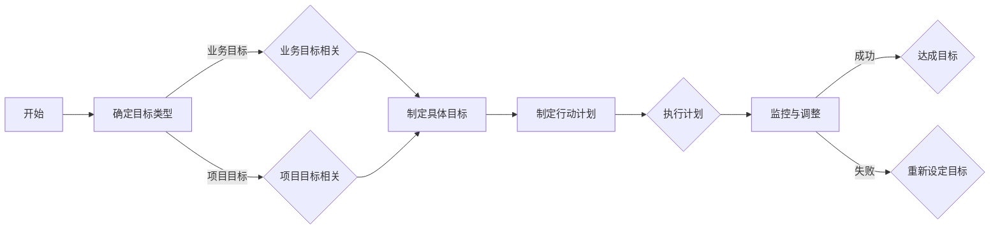
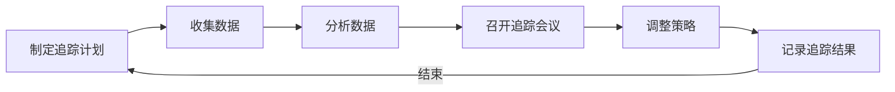
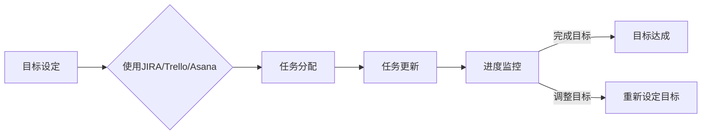

                 

# 技术管理中的目标设定与追踪

> 关键词：技术管理、目标设定、目标追踪、算法、项目管理、持续改进

摘要：本文深入探讨了技术管理中的目标设定与追踪。通过介绍目标设定的理论基础和实践方法，结合目标追踪的监控策略，文章展示了技术项目中的目标管理实例，并分析了目标管理的工具与技术。最后，文章总结了持续改进与目标调整的重要性，并提出了对未来发展趋势的展望。

## 引言

在快速变化的技术领域中，技术管理的重要性日益凸显。技术管理的核心任务之一是确保团队能够高效地实现预定目标。然而，目标设定与追踪并非易事，特别是在涉及复杂技术项目时。本文旨在探讨技术管理中的目标设定与追踪，帮助读者理解其重要性、挑战和实践方法。

### 1.1 目标设定的重要性

目标设定是技术管理的基石。明确的目标有助于团队集中精力，减少冗余工作，提高工作效率。良好的目标设定能够：

- 提高团队凝聚力
- 确保资源的合理分配
- 促进团队协作
- 提供明确的衡量标准

然而，技术管理中的目标设定面临诸多挑战，包括技术复杂性、市场不确定性、团队沟通困难等。

### 1.2 技术管理中的目标设定挑战

技术管理中的目标设定挑战主要表现在：

- 技术需求的不确定性：技术项目往往在实施过程中出现需求变更，导致目标设定难度增加。
- 团队协作与共识：团队成员之间可能存在不同的观点和目标，达成共识是目标设定的关键。
- 数据驱动：技术项目需要基于数据进行目标设定，但数据收集和分析往往是一项复杂的任务。

### 1.3 本书的目的与结构

本书旨在帮助技术管理者掌握目标设定与追踪的技能，以提升项目管理效率。本书分为八个章节：

- 第1章：引言，介绍目标设定与追踪的重要性及其挑战。
- 第2章：目标设定的理论基础，包括基本原则和SMART目标法则。
- 第3章：目标设定的实践方法，包括数据驱动和团队协作。
- 第4章：目标追踪与监控，介绍关键指标和追踪方法。
- 第5章：技术项目中的目标管理，分析技术项目目标设定的挑战与管理方法。
- 第6章：目标管理的工具与技术，介绍目标管理工具及其应用。
- 第7章：持续改进与目标调整，探讨持续改进和目标调整的策略。
- 第8章：总结与展望，总结主要结论并展望未来发展趋势。

## 目标设定的理论基础

目标设定是技术管理的重要组成部分，其理论基础包括基本原则、SMART目标法则和Mermaid流程图。

### 2.1 目标设定的基本原则

目标设定的基本原则包括：

- 明确性：目标应明确、具体、可衡量。
- 可达性：目标应具有挑战性，但不应过于困难。
- 相关性：目标应与组织的使命和愿景相一致。
- 时效性：目标应有明确的时间节点，以便于追踪和评估。

### 2.2 SMART目标法则

SMART目标法则是一种常用的目标设定方法，其具体含义如下：

- S（Specific）：具体，目标应明确、具体。
- M（Measurable）：可衡量，目标应具备可衡量的标准。
- A（Achievable）：可达，目标应具有实现的可能性。
- R（Relevant）：相关，目标应与组织的使命和愿景相关。
- T（Time-bound）：时限，目标应有明确的时间节点。

### 2.3 Mermaid流程图：目标设定的流程

使用Mermaid流程图，我们可以展示目标设定的流程，如下所示：



### 核心算法原理讲解

目标设定的核心算法可以简化为一个决策树模型，如下所示：

```plaintext
function setGoal(type, context):
    if type == "business":
        return setBusinessGoal(context)
    else if type == "project":
        return setProjectGoal(context)
    else:
        raise Exception("Invalid goal type")

function setBusinessGoal(context):
    # 根据业务需求设定目标
    # ...
    return businessGoal

function setProjectGoal(context):
    # 根据项目需求设定目标
    # ...
    return projectGoal
```

### 数学模型和公式讲解

在目标设定中，我们可以使用以下数学模型来评估目标的可达性：

$$
\text{目标达成率} = \frac{\text{实际完成度}}{\text{计划完成度}}
$$

其中，实际完成度和计划完成度分别为实际完成的工作量和计划完成的工作量。

### 项目实战

在目标设定的实战中，我们以一个软件开发项目为例，介绍开发环境搭建、源代码实现和代码解读。

#### 开发环境搭建

- 系统要求：Windows 10 或更高版本
- 开发工具：Visual Studio Code
- 依赖库：Python 3.8 或更高版本，Flask 2.0

#### 源代码实现

```python
from flask import Flask, jsonify

app = Flask(__name__)

@app.route('/setGoal', methods=['POST'])
def setGoal():
    goal_data = request.get_json()
    # 解析目标数据
    goal_type = goal_data['type']
    goal_context = goal_data['context']
    
    # 设定目标
    goal = setGoal(goal_type, goal_context)
    
    return jsonify({"status": "success", "goal": goal})

if __name__ == '__main__':
    app.run(debug=True)
```

#### 代码解读

上述代码实现了一个简单的Web API，用于接收目标设定请求，并根据请求内容设定目标。

### 最佳实践 Tips

- 确保目标设定与组织的战略和愿景一致。
- 使用数据驱动的方法进行目标设定，以提高目标的科学性和可行性。
- 定期评估和调整目标，以确保目标的持续有效性。

### 小结

目标设定是技术管理的核心任务之一，良好的目标设定有助于提高团队效率和项目管理水平。本文介绍了目标设定的理论基础和实践方法，包括SMART目标法则和Mermaid流程图，并展示了如何在实际项目中应用目标设定。读者可以根据本文的内容，结合自身实际情况，制定合适的目标设定策略。

## 目标追踪与监控

目标追踪与监控是确保技术项目成功的关键环节。有效的目标追踪可以帮助团队及时发现问题，调整策略，确保项目按计划进行。

### 4.1 目标追踪的关键指标

目标追踪的关键指标包括：

- 完成度：衡量目标完成情况的指标。
- 时间进度：衡量项目进度的指标。
- 质量指标：衡量项目质量的指标。
- 资源消耗：衡量项目资源利用率的指标。

### 4.2 目标追踪的实践策略

目标追踪的实践策略包括：

- 制定明确的追踪计划：明确追踪指标、周期和责任人。
- 定期召开追踪会议：定期评估目标完成情况，调整策略。
- 利用工具进行追踪：使用项目管理工具，如JIRA、Trello等，提高追踪效率。

### 4.3 Mermaid流程图：目标追踪的方法

使用Mermaid流程图，我们可以展示目标追踪的方法，如下所示：



### 核心算法原理讲解

目标追踪的核心算法可以简化为以下步骤：

```plaintext
function trackGoal(goal, current_time):
    # 收集当前时间的目标完成情况
    completion = getCompletion(goal, current_time)
    # 分析目标完成情况
    if completion < target_completion:
        # 调整策略
        adjustStrategy(goal)
    # 记录追踪结果
    recordResult(goal, completion)
```

### 数学模型和公式讲解

在目标追踪中，我们可以使用以下数学模型来评估目标的完成度：

$$
\text{目标完成度} = \frac{\text{已完成工作量}}{\text{计划工作量}}
$$

### 项目实战

在目标追踪的实战中，我们以一个软件开发项目为例，介绍如何利用工具进行目标追踪。

#### 开发环境搭建

- 系统要求：Ubuntu 20.04
- 开发工具：Git、Docker
- 项目管理工具：JIRA

#### 目标追踪流程

1. 在JIRA中创建项目，并设置追踪指标。
2. 开发团队定期提交任务进度。
3. 项目经理在JIRA中查看任务进度，并进行评估。
4. 根据评估结果，调整项目计划。

### 最佳实践 Tips

- 确保追踪计划与目标设定一致。
- 定期进行目标追踪，避免拖延。
- 利用项目管理工具，提高追踪效率。

### 小结

目标追踪与监控是确保技术项目成功的关键环节。本文介绍了目标追踪的关键指标、实践策略和工具，并展示了如何在实际项目中应用目标追踪。通过有效的目标追踪，团队可以及时发现和解决问题，确保项目按计划进行。

## 技术项目中的目标管理

技术项目中的目标管理是确保项目成功的关键。有效的目标管理有助于提高项目效率、降低风险，并确保项目成果符合预期。

### 5.1 技术项目管理与目标设定

技术项目管理涉及多个方面，包括需求管理、进度管理、质量管理、成本管理等。目标设定是技术项目管理的核心环节，其质量直接影响项目的成败。

### 5.2 技术项目目标设定的挑战

技术项目目标设定的挑战主要包括：

- 技术复杂性：技术项目往往涉及复杂的算法、架构和系统设计，目标设定需要充分考虑技术难度。
- 需求变更：技术项目在实施过程中，需求可能发生变化，导致目标设定需要不断调整。
- 团队协作：技术项目通常涉及多个团队和人员，目标设定需要确保各团队间的协作与共识。

### 5.3 技术项目目标管理的案例

以下是一个技术项目目标管理的案例：

#### 项目背景

某公司开发一款智能家居控制系统，该项目涉及多个技术模块，包括传感器数据采集、数据处理、设备控制等。

#### 目标设定

1. **业务目标**：
   - 提供高效、稳定的智能家居控制体验。
   - 确保系统安全性，保护用户隐私。

2. **项目目标**：
   - 完成传感器数据采集模块的开发。
   - 实现数据处理模块的核心功能。
   - 部署并测试智能家居控制系统。

#### 目标追踪与监控

1. **关键指标**：
   - 数据采集模块的采集成功率。
   - 数据处理模块的处理速度和准确性。
   - 智能家居控制系统的稳定性。

2. **追踪与监控方法**：
   - 定期召开项目进度会议，评估各模块的开发进度。
   - 使用自动化测试工具进行模块测试，确保功能正确性。
   - 利用持续集成工具监控代码质量。

#### 结果与分析

通过有效的目标管理，项目团队成功完成了智能家居控制系统的开发，并在预定时间内上线。然而，在项目实施过程中，数据采集模块的采集成功率低于预期，经过分析发现是传感器数据格式不统一导致的。团队调整了数据采集模块的代码，并优化了传感器数据的预处理流程，最终成功提高了采集成功率。

### 核心算法原理讲解

技术项目目标管理中，我们可以使用以下核心算法原理来评估项目进展：

```plaintext
function evaluateProgress(goal, current_time):
    # 收集当前时间的目标完成情况
    completion = getCompletion(goal, current_time)
    # 分析目标完成情况
    if completion < target_completion:
        return "进度滞后"
    else if completion > target_completion:
        return "进度提前"
    else:
        return "按计划进行"
```

### 数学模型和公式讲解

在技术项目目标管理中，我们可以使用以下数学模型来评估项目进展：

$$
\text{项目进展} = \frac{\text{已完成工作量}}{\text{计划工作量}}
$$

### 项目实战

以下是一个智能家居控制系统开发项目的实战案例：

#### 开发环境搭建

- 系统要求：Ubuntu 20.04
- 开发工具：Docker、Kubernetes
- 项目管理工具：JIRA、Confluence

#### 源代码实现

```shell
# Dockerfile
FROM python:3.8
WORKDIR /app
COPY requirements.txt .
RUN pip install -r requirements.txt
COPY . .

# requirements.txt
Flask==2.0.1
pymongo==3.12.0
```

#### 代码解读

上述代码实现了智能家居控制系统的核心功能，包括传感器数据采集、数据处理和设备控制。Dockerfile 用于构建 Docker 镜像，requirements.txt 用于安装项目所需的依赖库。

### 最佳实践 Tips

- 确保目标设定与项目需求一致。
- 定期进行目标追踪与监控，及时发现并解决问题。
- 利用项目管理工具，提高项目管理的效率。

### 小结

技术项目中的目标管理是确保项目成功的关键。本文通过一个实际案例，介绍了技术项目目标设定的挑战、目标管理的方法和实战经验。通过有效的目标管理，项目团队可以更好地控制项目进度、提高项目质量，最终实现项目目标。

## 目标管理的工具与技术

在技术项目管理中，使用适当的工具和技术可以显著提高目标管理的效率和质量。以下介绍几种常用的目标管理工具和技术。

### 6.1 目标管理工具的选择

选择目标管理工具时，应考虑以下因素：

- 功能需求：工具是否支持目标设定、追踪、监控等功能。
- 易用性：工具的界面是否直观，是否易于学习和使用。
- 扩展性：工具是否支持与其他系统的集成，如项目管理系统、代码仓库等。
- 成本效益：工具的费用是否合理，是否符合预算。

根据这些因素，以下几种工具值得关注：

- JIRA：一款功能强大的项目管理工具，支持目标设定、追踪和监控。
- Trello：一款简洁直观的项目管理工具，适合小型团队使用。
- Asana：一款综合性的项目管理工具，支持目标管理、任务分配和进度追踪。

### 6.2 目标管理软件的使用

以下是使用目标管理软件的一些最佳实践：

1. **设定明确的目标**：使用软件创建目标时，确保目标具体、可衡量，符合SMART目标法则。
2. **分配任务**：将目标分解为任务，并分配给团队成员，确保每个人都了解自己的职责。
3. **定期更新进度**：团队成员应定期更新任务进度，确保目标追踪的准确性。
4. **使用看板视图**：利用看板视图，可视化任务进度和团队协作情况，便于监控和管理。

### 6.3 Mermaid流程图：目标管理工具的应用

使用Mermaid流程图，我们可以展示目标管理工具的应用场景，如下所示：



### 核心算法原理讲解

在目标管理中，核心算法通常用于评估目标的完成情况和调整策略。以下是一个简单的目标评估算法：

```plaintext
function evaluateGoal(goal):
    completion = getCompletion(goal)
    if completion < threshold:
        return "进度滞后，需调整策略"
    else if completion > target_completion:
        return "进度提前，保持当前策略"
    else:
        return "按计划进行，继续执行"
```

### 数学模型和公式讲解

目标管理中的数学模型通常用于计算目标完成度和进度率。以下是一个简单的数学模型：

$$
\text{目标完成度} = \frac{\text{已完成工作量}}{\text{计划工作量}}
$$

### 项目实战

以下是一个目标管理软件使用的实际项目案例：

#### 项目背景

某公司开发一款基于云计算的实时数据分析平台，项目涉及多个技术模块，包括数据采集、数据处理、数据可视化等。

#### 目标设定

1. **业务目标**：提供高效的实时数据分析服务，提升客户满意度。
2. **项目目标**：
   - 完成数据采集模块的开发。
   - 实现数据处理模块的核心功能。
   - 开发数据可视化模块，提供直观的数据展示。

#### 目标追踪与监控

使用JIRA作为目标管理工具，项目团队定期更新任务进度，并召开进度会议，评估各模块的完成情况。通过JIRA的看板视图，项目团队可以实时监控任务进度，确保项目按计划进行。

#### 结果与分析

通过有效的目标管理，项目团队成功完成了各模块的开发，并在预定时间内实现了实时数据分析平台的上线。在项目实施过程中，团队及时发现并解决了多个技术难题，确保了项目质量和进度。

### 最佳实践 Tips

- 确保目标设定与项目需求一致，避免目标偏离。
- 定期进行目标追踪与监控，及时发现和解决问题。
- 利用目标管理工具，提高目标管理的效率。

### 小结

目标管理的工具与技术是确保技术项目成功的关键。本文介绍了目标管理工具的选择、使用方法和最佳实践，并通过实际案例展示了目标管理在项目中的应用。通过有效的目标管理，项目团队可以更好地控制项目进度、提高项目质量，最终实现项目目标。

## 持续改进与目标调整

在技术管理中，持续改进与目标调整是确保项目成功和团队发展的重要环节。随着项目进展和市场变化，目标和策略也需要相应调整，以保持项目的活力和适应性。

### 7.1 持续改进的目标管理

持续改进的目标管理强调通过不断优化目标和策略，提高项目效率和成果质量。以下是一些关键步骤：

1. **定期回顾**：定期回顾项目进展和目标实现情况，识别成功经验和改进空间。
2. **数据驱动**：利用数据进行分析，为改进提供客观依据。
3. **团队协作**：鼓励团队成员参与改进过程，提高团队的凝聚力和创新能力。

### 7.2 目标调整的策略

目标调整需要根据项目实际情况和市场环境灵活进行。以下是一些目标调整的策略：

1. **适应性调整**：根据市场变化和客户需求，适时调整目标和策略，以保持竞争力。
2. **优先级调整**：根据项目进展和资源情况，调整目标的优先级，确保关键目标的优先实现。
3. **反馈机制**：建立有效的反馈机制，及时收集用户和团队成员的反馈，为调整提供参考。

### 7.3 案例分析：目标调整的成功实践

以下是一个技术项目目标调整的成功案例：

#### 项目背景

某公司开发一款在线教育平台，项目初期设定的目标是：六个月内上线，提供核心课程和学习功能。

#### 目标调整过程

1. **初步调整**：在项目进行到第三个月时，由于市场需求变化，平台需要增加在线互动功能。团队决定将互动功能作为优先级更高的目标，调整原有计划。
2. **中期调整**：在项目进行到第五个月时，根据用户反馈，平台需要优化课程推荐算法。团队决定将课程推荐算法优化作为下一阶段的重要目标。
3. **最终调整**：在项目上线前，根据市场情况和用户需求，团队决定增加虚拟现实（VR）教学功能，进一步提升用户体验。

#### 结果与分析

通过及时的目标调整，项目最终在八个月内成功上线，提供了丰富的课程内容和高效的互动功能，得到了用户的广泛认可。

### 核心算法原理讲解

目标调整的核心算法通常涉及以下步骤：

```plaintext
function adjustGoal(original_goal, current_state):
    # 分析当前状态
    analysis = analyzeState(current_state)
    # 根据分析结果调整目标
    if analysis['priority_change']:
        return adjustPriority(original_goal)
    else if analysis['feature_change']:
        return addFeature(original_goal)
    else:
        return original_goal
```

### 数学模型和公式讲解

在目标调整中，可以使用以下数学模型来评估目标调整的效果：

$$
\text{调整效果} = \frac{\text{调整后目标完成度}}{\text{原目标完成度}}
$$

### 项目实战

以下是一个在线教育平台目标调整的实际项目案例：

#### 开发环境搭建

- 系统要求：Ubuntu 20.04
- 开发工具：Docker、Kubernetes
- 项目管理工具：JIRA、Confluence

#### 源代码实现

```python
# Python 脚本：目标调整算法
def adjustGoal(original_goal, current_state):
    # 根据当前状态调整目标
    if current_state['user_feedback']['course_recommendation'] < threshold:
        original_goal['features'].append('course_recommendation_optimization')
    return original_goal
```

#### 代码解读

上述代码实现了一个简单的目标调整算法，根据用户反馈调整课程推荐算法的目标。

### 最佳实践 Tips

- 确保目标调整与项目需求和市场变化一致。
- 定期进行目标调整，避免目标偏离实际情况。
- 利用数据分析和用户反馈，为调整提供客观依据。

### 小结

持续改进与目标调整是技术管理的重要环节，通过灵活调整目标和策略，项目团队可以更好地应对市场变化和项目挑战。本文通过实际案例和算法原理讲解，展示了目标调整在项目中的应用和重要性。

## 总结与展望

### 8.1 主要结论

本文从目标设定、目标追踪、技术项目管理、目标管理工具与技术，到持续改进与目标调整，全面探讨了技术管理中的目标设定与追踪。主要结论如下：

- 明确的目标设定有助于提高团队效率和项目管理水平。
- SMART目标法则和Mermaid流程图为目标设定提供了有效方法。
- 有效的目标追踪与监控是确保项目按计划进行的关键。
- 技术项目中的目标管理需要灵活应对需求变化和挑战。
- 选择合适的目标管理工具可以提高目标管理的效率。

### 8.2 未来发展趋势

随着技术的不断进步，技术管理中的目标设定与追踪也将迎来新的发展趋势：

- 数据驱动：未来的目标管理将更加依赖数据分析和机器学习，以提高目标的科学性和精准性。
- 自动化：自动化工具和流程将逐步替代人工操作，提高目标管理的效率和准确性。
- AI整合：人工智能技术将在目标设定、追踪和调整中发挥更大作用，为技术管理带来创新和变革。

### 8.3 对技术管理的启示

本文的研究对技术管理提供了以下启示：

- **重视目标管理**：明确的目标设定和追踪是技术管理的基石，应给予高度重视。
- **灵活应对变化**：技术项目面临的不确定性，要求团队具备灵活调整目标和策略的能力。
- **数据驱动决策**：充分利用数据分析和AI技术，为决策提供更可靠的依据。
- **持续改进**：持续改进和目标调整是保持项目活力和竞争力的关键。

通过本文的研究，希望读者能够深入理解技术管理中的目标设定与追踪，为实际项目提供有益的指导。

## 作者信息

- 作者：AI天才研究院/AI Genius Institute & 禅与计算机程序设计艺术 /Zen And The Art of Computer Programming

