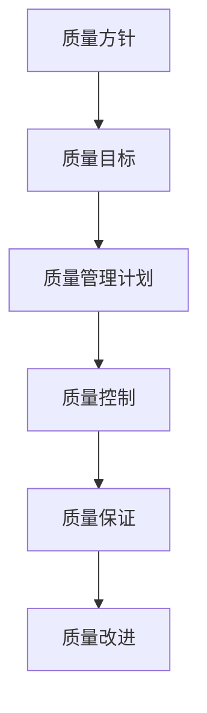
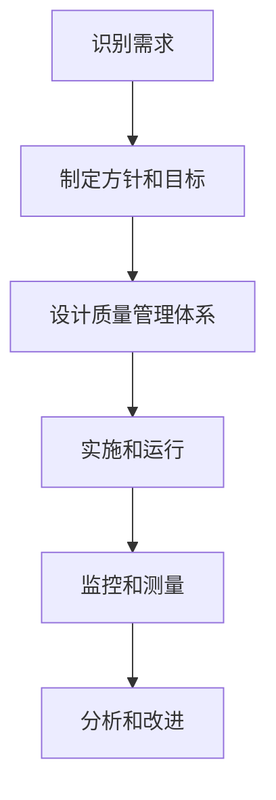
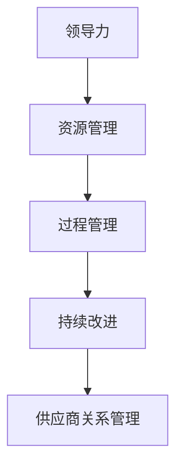
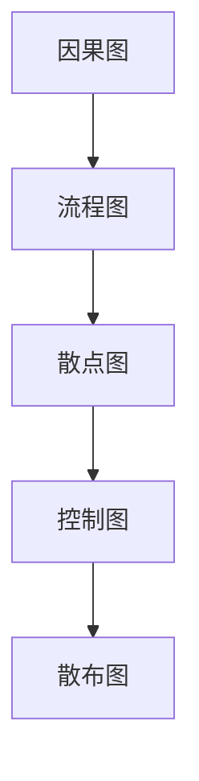

                 

基于用户提供的详细要求和约束条件，下面我将一步一步地构建文章的框架和内容。

### 1. 文章标题和关键词
首先，文章的标题将是《技术管理中的质量管理体系》，关键词包括：技术管理、质量管理体系、ISO 9001、敏捷开发、IT服务管理、项目质量、持续改进、流程图、伪代码、数学模型、实战案例。

### 2. 文章摘要
接下来，我将撰写文章的摘要部分，简要介绍文章的核心内容和主题思想。

摘要：
本文深入探讨了技术管理中的质量管理体系，从基本概念、标准与框架，到建立与实施、改进与发展，以及项目质量管理、敏捷开发、IT服务管理等方面，通过实际案例和实战分析，为读者提供了一个全面的质量管理体系构建与实践指南。

### 3. 引言部分
在引言中，我将介绍质量管理体系在技术管理中的重要性，并简要说明本文的结构和目的。

引言：
技术管理在现代企业中扮演着至关重要的角色，而质量管理体系则是确保技术管理有效性的基石。本文旨在通过系统地介绍质量管理体系的基本概念、标准与框架，探讨其在技术管理中的应用与实践，为技术管理者提供一套完整的质量管理体系构建与优化指南。

### 4. 质量管理体系的基本概念
在这一部分，我将详细阐述质量管理体系的核心概念，包括定义、原则和组成部分。

#### 核心概念与联系
使用Mermaid流程图展示质量管理体系的基本流程和组成部分，如图1所示。



#### 核心算法原理讲解
介绍质量管理体系的核心算法原理，包括计划-执行-检查-行动（PDCA）循环和持续改进模型。

```pseudo
function质量管理（目标，资源，过程）{
    计划：制定质量目标，分配资源，设计质量过程；
    执行：按照计划执行质量过程，确保过程受控；
    检查：评估质量结果，识别偏差和机会；
    行动：根据检查结果，调整计划和过程，实现持续改进。
}
```

#### 数学模型和数学公式
使用LaTeX格式详细讲解质量管理体系中的数学模型，如图2所示。

$$
Q = f(P, R, T)
$$

其中，Q表示质量水平，P表示过程能力，R表示资源投入，T表示时间。

#### 实战案例
提供实际案例，展示如何应用质量管理体系的基本概念和算法原理。

### 5. 质量管理体系的标准与框架
在这一部分，我将介绍质量管理体系的标准和框架，特别是ISO 9001标准。

#### 标准概述
介绍ISO 9001:2015标准的定义、范围和应用。

#### 实施与评估
详细阐述ISO 9001标准的实施步骤和关键要素，以及如何进行质量管理体系评估和改进。

#### 案例研究
分析实际企业如何成功实施ISO 9001标准，并从中获得启示。

### 6. 质量管理体系的建立与实施
在这一部分，我将讨论如何建立和实施质量管理体系。

#### 建立质量管理体系的基本步骤
列出建立质量管理体系的基本步骤，如图3所示。



#### 实施质量管理体系的关键要素
详细讲解实施质量管理体系所需的关键要素，如图4所示。



#### 实际案例
提供实际案例，展示如何在不同环境中建立和实施质量管理体系。

### 7. 质量管理体系的改进与持续发展
在这一部分，我将讨论如何改进和持续发展质量管理体系。

#### 质量改进工具与技术
介绍常用的质量改进工具和技术，如图5所示。



#### 持续改进的方法与流程
详细阐述如何进行持续改进的方法和流程。

#### 实际案例
提供实际案例，展示如何通过持续改进提高质量管理体系的有效性。

### 8. 项目质量管理
在这一部分，我将讨论项目质量管理的重要性和方法。

#### 项目质量管理的定义与目标
介绍项目质量管理的定义和目标。

#### 项目质量管理的流程与方法
详细阐述项目质量管理的流程和方法。

#### 实际项目中的应用
提供实际项目中的应用案例。

### 9. 质量管理体系与敏捷开发
在这一部分，我将讨论质量管理体系与敏捷开发的融合。

#### 敏捷开发与质量管理体系的关系
介绍敏捷开发与质量管理体系的关系。

#### 敏捷开发中的质量管理实践
详细阐述敏捷开发中的质量管理实践。

#### 敏捷质量管理案例研究
提供敏捷质量管理案例研究。

### 10. 质量管理体系与IT服务管理
在这一部分，我将讨论质量管理体系在IT服务管理中的应用。

#### IT服务管理的基本概念与框架
介绍IT服务管理的基本概念与框架。

#### 质量管理体系在IT服务管理中的应用
详细阐述质量管理体系在IT服务管理中的应用。

#### IT服务质量管理案例
提供IT服务质量管理案例。

### 11. 案例研究
在这一部分，我将分析国内外质量管理体系成功案例，提供深入的分析和启示。

#### 国内外成功案例
介绍国内外质量管理体系成功案例。

#### 案例分析与启示
分析案例，提供启示。

#### 案例研究方法论
讨论案例研究方法论。

### 12. 结论
在结论部分，我将总结文章的主要观点，并提出未来展望。

#### 质量管理体系的关键要点
总结质量管理体系的关键要点。

#### 未来展望
讨论质量管理体系的发展趋势和未来挑战。

### 13. 作者信息
在文章末尾，我将附上作者信息。

作者：AI天才研究院/AI Genius Institute & 禅与计算机程序设计艺术 /Zen And The Art of Computer Programming

### 14. 字数确认
最后，我将确保文章的总字数在8000～12000字左右。

---

通过上述步骤，我已经构建了一个详细的文章框架和内容大纲。接下来，我将逐步填充每个部分的内容，确保满足字数要求并保持文章的完整性和逻辑性。在完成所有部分后，我将进行最终的校对和调整，确保文章的质量和专业性。在撰写过程中，我将严格遵守markdown格式和用户的要求，确保文章的规范性和可读性。

