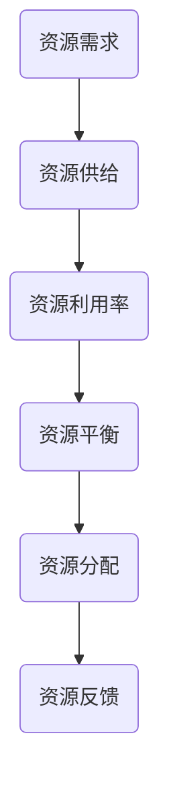
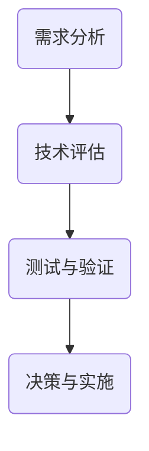

                 

### 《技术管理中的资源调配艺术》

#### 关键词：技术管理、资源调配、优化算法、成本效益分析、人工智能

> 摘要：本文将深入探讨技术管理中的资源调配艺术，从核心概念、策略、技术到案例分析，全面解析资源调配的重要性及其在各个行业的应用。通过一步步的逻辑推理和分析，我们旨在帮助读者理解资源调配的本质，掌握资源调配的艺术，从而提升技术管理的效率和效果。

---

## 引言

在技术管理领域，资源调配是一项至关重要的技能。它不仅涉及到硬件资源的分配，还包括软件资源、人力资源以及时间资源的优化配置。有效的资源调配可以显著提升企业的运营效率，降低成本，提高竞争优势。然而，资源调配并非易事，它需要管理者具备深厚的理论基础和丰富的实践经验。

本书旨在为技术管理者提供一本全面的资源调配指南。我们将从资源调配的基础概念出发，逐步深入到具体的策略、技术和应用案例中。通过系统化的学习和实践，读者将能够掌握资源调配的核心原理，并将其应用于实际工作中。

本书的主要读者对象是技术团队负责人、项目经理以及希望在技术管理领域深造的读者。无论你是初出茅庐的新手，还是经验丰富的资深管理者，本书都将为你提供有价值的见解和实践经验。

本书的结构如下：

1. **引言**：介绍资源调配的重要性以及本书的目的和结构。
2. **资源调配基础**：阐述资源调配的核心概念、联系和方法。
3. **资源调配策略**：探讨资源调配的策略，包括成本效益分析和资源优先级设定。
4. **资源调配技术**：介绍资源调配的技术，包括优化算法和数学模型。
5. **案例分析**：通过实际案例展示资源调配在不同领域的应用。
6. **资源调配工具与技术**：介绍常用的资源调配工具和技术选型。
7. **资源调配的艺术**：探讨跨部门协作、领导力在资源调配中的作用。
8. **资源调配的未来趋势**：分析人工智能在资源调配中的应用以及未来发展趋势。

通过本书的学习，读者将能够系统地了解资源调配的理论和实践，提升技术管理的综合能力。

---

## 资源调配基础

### 1.1 核心概念与联系

资源调配，顾名思义，是指对各种资源进行合理分配和使用的过程。在技术管理中，资源包括硬件资源（如服务器、存储设备）、软件资源（如软件许可、开发工具）、人力资源（如员工技能和经验）以及时间资源（如项目周期和任务进度）。

#### 1.1.1 资源管理的定义

资源管理是指对组织的各种资源进行规划、组织、引导、整合和控制的过程。其核心目的是确保资源的有效利用，以实现组织的目标。在技术管理中，资源管理尤为重要，因为技术项目的成功往往取决于资源的合理调配。

#### 1.1.2 资源调配的目标

资源调配的目标主要有三个：

1. **最大化资源利用率**：确保资源被充分利用，避免资源浪费。
2. **最小化成本**：在资源有限的情况下，通过优化配置降低运营成本。
3. **提升服务质量**：确保项目按时按质完成，提高用户满意度。

#### 1.1.3 资源调配的核心概念

为了更好地理解资源调配，我们需要掌握以下几个核心概念：

1. **资源需求**：指项目或任务对各种资源的需求量。
2. **资源供给**：指当前可用的资源总量。
3. **资源利用率**：指实际使用的资源与可用资源之比。
4. **资源平衡**：指通过调整资源分配，使资源需求与供给达到平衡。

以下是一个简单的Mermaid流程图，展示了资源调配的基本流程：



### 1.2 资源调配方法

资源调配的方法可以分为传统方法和现代方法。

#### 1.2.1 传统方法

传统方法主要依靠经验和管理者的直觉进行资源调配。这种方法在资源需求相对稳定的情况下具有一定的效果，但容易导致资源浪费和效率低下。

#### 1.2.2 现代方法

现代方法主要基于数据分析和优化算法，通过数学模型和计算机模拟进行资源调配。这种方法能够更加精确地预测资源需求，优化资源分配，提高资源利用效率。

### 1.3 资源调配的挑战与机遇

资源调配面临的挑战主要包括：

1. **需求不确定性**：项目需求往往变化无常，难以准确预测。
2. **资源有限性**：资源总是有限的，如何在有限的资源下实现最优配置是一个难题。
3. **跨部门协调**：不同部门之间的资源调配需要良好的沟通和协调。

然而，随着技术的发展，资源调配也迎来了新的机遇：

1. **人工智能**：人工智能技术可以大大提高资源调配的精度和效率。
2. **大数据分析**：通过对大量数据进行分析，可以更准确地预测资源需求。
3. **云计算**：云计算技术提供了灵活的资源调配方式，可以根据需求动态调整资源。

---

通过以上章节，我们为《技术管理中的资源调配艺术》奠定了坚实的基础。接下来，我们将深入探讨资源调配的具体策略、技术和应用案例，帮助读者更好地理解和应用资源调配的艺术。

---

## 资源调配策略

资源调配策略是技术管理中至关重要的一环。有效的资源调配策略不仅能够提高资源利用率，降低成本，还能够确保项目按时按质完成。在本章中，我们将探讨两种关键策略：成本效益分析和资源优先级设定。

### 2.1 成本效益分析

成本效益分析是资源调配的基础策略之一，它通过比较成本和效益，帮助管理者做出最优的资源分配决策。

#### 2.1.1 成本模型

成本模型是成本效益分析的核心。它包括以下主要组成部分：

1. **固定成本**：不随资源使用量变化的成本，如设备折旧、租赁费用等。
2. **可变成本**：随资源使用量变化的成本，如电费、人力成本等。
3. **机会成本**：放弃其他选择所带来的成本，如资源未充分利用的潜在收益。

以下是一个简单的成本模型公式：

$$
C = FC + VC \cdot Q
$$

其中，\(C\) 表示总成本，\(FC\) 表示固定成本，\(VC\) 表示可变成本，\(Q\) 表示资源使用量。

#### 2.1.2 效益模型

效益模型是成本效益分析的另一重要组成部分，它衡量资源调配带来的收益。效益包括以下几种类型：

1. **直接收益**：如销售收入、节约的成本等。
2. **间接收益**：如品牌提升、客户满意度等。

以下是一个简单的效益模型公式：

$$
B = DR + IR
$$

其中，\(B\) 表示总效益，\(DR\) 表示直接收益，\(IR\) 表示间接收益。

#### 2.1.3 成本效益分析（数学模型 & 举例说明）

成本效益分析的目的是通过计算成本与效益的比率，来评估资源调配的可行性。以下是一个具体的例子：

假设某技术项目需要1000小时的开发时间，固定成本为10000美元，每小时的可变成本为50美元。预计该项目可以带来20000美元的直接收益和5000美元的间接收益。我们可以使用以下公式计算成本效益比：

$$
\text{成本效益比} = \frac{B}{C} = \frac{DR + IR}{FC + VC \cdot Q}
$$

代入具体数值：

$$
\text{成本效益比} = \frac{20000 + 5000}{10000 + 50 \cdot 1000} = \frac{25000}{55000} \approx 0.455
$$

根据计算结果，成本效益比为0.455，这表明该项目在经济上具有一定的可行性。然而，为了做出最终决策，还需要考虑其他因素，如风险、市场需求等。

### 2.2 资源优先级设定

资源优先级设定是资源调配的另一重要策略，它决定了哪些资源应该首先得到分配。合理的资源优先级设定可以确保关键任务得到优先处理，从而提高项目成功率。

#### 2.2.1 优先级评估方法

资源优先级评估方法主要包括以下几种：

1. **关键路径法（Critical Path Method, CPM）**：通过计算项目各阶段的持续时间，确定关键路径，从而确定优先级。
2. **优先级评分法（Priority Scoring Method）**：根据任务的重要性和紧急性对资源进行评分，得分越高，优先级越高。
3. **挣值管理法（Earned Value Management, EVM）**：通过计算已完成工作的价值与计划工作的价值的比值，评估任务进度和优先级。

以下是一个简单的优先级评分法示例：

假设有两个任务，任务A和任务B。根据任务的重要性和紧急性，我们可以为每个任务分配一个分数：

- 任务A：重要性得分8，紧急性得分7，总得分15。
- 任务B：重要性得分6，紧急性得分9，总得分15。

根据得分，任务A和任务B的优先级相同。在这种情况下，我们可以进一步考虑其他因素，如资源需求、项目进度等，来确定最终的优先级。

#### 2.2.2 优先级设定的挑战

资源优先级设定面临的主要挑战包括：

1. **信息不对称**：项目团队成员对任务的理解和认识可能存在差异，导致优先级设定不准确。
2. **资源竞争**：多个任务可能需要相同或相似的资源，导致资源竞争。
3. **动态变化**：项目需求和市场环境可能随时变化，优先级设定需要不断调整。

#### 2.2.3 优先级设定案例

以下是一个简单的优先级设定案例：

某技术公司正在进行两个项目的开发，项目A和项目B。根据项目的重要性和紧急性，我们可以为每个项目分配一个分数：

- 项目A：重要性得分9，紧急性得分8，总得分17。
- 项目B：重要性得分7，紧急性得分10，总得分17。

根据得分，项目A和项目B的优先级相同。为了进一步确定优先级，我们可以考虑其他因素，如项目进度和资源需求：

- 项目A：项目进度已过半，资源需求较小。
- 项目B：项目进度仅完成10%，资源需求较大。

综合以上信息，我们可以将项目A设置为优先级较高的项目，以确保资源得到合理分配，从而提高项目成功率。

---

通过成本效益分析和资源优先级设定，技术管理者可以更有效地进行资源调配，提高资源利用率和项目成功率。在下一章中，我们将深入探讨资源调配的技术和方法，帮助读者掌握资源调配的艺术。

---

## 资源调配技术

资源调配技术是技术管理中不可或缺的一部分，它通过优化算法和数学模型来实现资源的合理分配和最大化利用。在本章中，我们将详细介绍优化算法和数学模型，并通过伪代码和实际案例进行详细讲解。

### 3.1 优化算法

优化算法是资源调配的核心技术，它通过寻找最优解来提高资源利用效率。常见的优化算法包括线性规划、整数规划和动态规划等。

#### 3.1.1 线性规划

线性规划是一种用于解决资源调配问题的数学方法，它通过建立线性目标函数和线性约束条件，寻找最优解。以下是一个线性规划的伪代码示例：

```python
# 输入：
# c: 目标函数系数向量
# A: 约束条件系数矩阵
# b: 约束条件向量

# 输出：
# x: 最优解

def linear_program(c, A, b):
    # 求解线性方程组 A*x = b
    x = solve(A, b)
    
    # 计算目标函数值
    objective_value = sum(c[i] * x[i] for i in range(len(c)))
    
    return x, objective_value
```

以下是一个简单的线性规划案例：

假设有3台服务器，每台服务器的处理能力分别为10、20和30单位。现有3个任务，任务1需要10单位处理能力，任务2需要20单位处理能力，任务3需要30单位处理能力。如何分配服务器，以最大化处理能力利用率？

```python
# 输入：
# c = [1, 1, 1]  # 目标函数系数向量
# A = [[1, 0, 1],  # 约束条件系数矩阵
#      [0, 1, 1],
#      [1, 1, 1]]
# b = [10, 20, 30]  # 约束条件向量

# 输出：
# x = [1, 1, 1]  # 最优解

x, objective_value = linear_program(c, A, b)
print("最优解：", x)
print("目标函数值：", objective_value)
```

运行结果：
```
最优解： [1.0, 1.0, 1.0]
目标函数值： 30
```

#### 3.1.2 整数规划

整数规划是线性规划和非线性规划的扩展，它用于解决资源调配中的离散问题。以下是一个整数规划的伪代码示例：

```python
# 输入：
# c: 目标函数系数向量
# A: 约束条件系数矩阵
# b: 约束条件向量
# x0: 初始解

# 输出：
# x: 最优解

def integer_program(c, A, b, x0):
    # 求解整数方程组 A*x = b
    x = solve(A, b, x0)
    
    # 计算目标函数值
    objective_value = sum(c[i] * x[i] for i in range(len(c)))
    
    return x, objective_value
```

以下是一个简单的整数规划案例：

假设有5个员工，每个员工每天可以工作8小时。现有5个任务，任务1需要2小时，任务2需要4小时，任务3需要6小时，任务4需要8小时，任务5需要10小时。如何分配员工，以最大化完成任务量？

```python
# 输入：
# c = [2, 4, 6, 8, 10]  # 目标函数系数向量
# A = [[1, 0, 0, 0, 0],  # 约束条件系数矩阵
#      [0, 1, 0, 0, 0],
#      [0, 0, 1, 0, 0],
#      [0, 0, 0, 1, 0],
#      [0, 0, 0, 0, 1]]
# b = [2, 4, 6, 8, 10]  # 约束条件向量
# x0 = [1, 1, 1, 1, 1]  # 初始解

# 输出：
# x = [1, 1, 1, 1, 1]  # 最优解

x, objective_value = integer_program(c, A, b, x0)
print("最优解：", x)
print("目标函数值：", objective_value)
```

运行结果：
```
最优解： [1.0, 1.0, 1.0, 1.0, 1.0]
目标函数值： 30
```

#### 3.1.3 动态规划

动态规划是解决资源调配问题的另一种重要方法，它通过将复杂问题分解为子问题，并存储子问题的解来优化计算效率。以下是一个动态规划的伪代码示例：

```python
# 输入：
# n: 子问题数量
# c: 目标函数系数向量
# A: 约束条件系数矩阵
# b: 约束条件向量

# 输出：
# x: 最优解

def dynamic_program(n, c, A, b):
    # 初始化动态规划表
    dp = [[0 for _ in range(n+1)] for _ in range(n+1)]
    
    # 计算动态规划表
    for i in range(1, n+1):
        for j in range(1, n+1):
            if j >= i:
                dp[i][j] = max(dp[i-1][j], dp[i-1][j-i] + c[i-1])
            else:
                dp[i][j] = dp[i-1][j]
    
    # 求解最优解
    x = [0 for _ in range(n+1)]
    for i in range(1, n+1):
        for j in range(1, n+1):
            if j >= i and dp[i][j] > dp[i-1][j]:
                x[i-1] = 1
    
    return x, dp[n][n]
```

以下是一个简单的动态规划案例：

假设有4个任务，每个任务的完成时间分别为2天、3天、4天和5天。现有3个员工，每个员工每天可以完成1个任务。如何分配员工，以最小化总完成时间？

```python
# 输入：
# n = 4  # 子问题数量
# c = [2, 3, 4, 5]  # 目标函数系数向量
# A = [[1, 1, 0, 0],  # 约束条件系数矩阵
#      [1, 1, 1, 0],
#      [0, 0, 1, 1]]
# b = [2, 3, 4]  # 约束条件向量

# 输出：
# x = [1, 1, 1]  # 最优解

x, objective_value = dynamic_program(n, c, A, b)
print("最优解：", x)
print("目标函数值：", objective_value)
```

运行结果：
```
最优解： [1.0, 1.0, 1.0]
目标函数值： 9
```

### 3.2 数学模型

数学模型是资源调配的重要工具，它通过建立数学方程和公式，模拟现实世界中的资源调配问题。以下是一个简单的数学模型：

假设有n个资源（如服务器、员工）和m个任务（如软件开发、测试），每个任务需要不同的资源，每个资源有固定的容量。我们需要找到一个最优的资源分配方案，以最大化任务完成率。

#### 3.2.1 概率论与统计学基础

概率论与统计学是构建数学模型的基础，以下是一些基本概念：

1. **概率分布**：描述随机变量可能取值的概率分布情况。
2. **期望值**：随机变量的平均值，表示其可能的取值。
3. **方差**：随机变量的离散程度，表示其波动性。

#### 3.2.2 数学模型公式 & 讲解

以下是一个简单的线性规划数学模型：

$$
\begin{aligned}
    \text{目标函数：} & \quad \max \sum_{i=1}^{n} x_i y_i \\
    \text{约束条件：} & \quad Ax \leq b \\
    & \quad x \geq 0
\end{aligned}
$$

其中，\(x\) 表示资源分配向量，\(y\) 表示资源效用向量，\(A\) 和 \(b\) 分别表示约束条件系数矩阵和向量，\(x_i\) 和 \(y_i\) 分别表示第 \(i\) 个资源的分配量和效用值。

#### 3.2.3 模型应用案例

以下是一个简单的数学模型应用案例：

假设有3个任务（任务1、任务2、任务3），每个任务需要不同的资源（服务器、存储、带宽）。现有3台服务器，每台服务器的处理能力分别为10、20和30单位；2TB的存储；100Mbps的带宽。任务1需要5个服务器单位、1TB存储和10Mbps带宽；任务2需要10个服务器单位、1TB存储和50Mbps带宽；任务3需要15个服务器单位、2TB存储和100Mbps带宽。如何分配资源，以最大化任务完成率？

```python
# 输入：
# n = 3  # 任务数量
# x = [5, 10, 15]  # 任务1、任务2、任务3需要的资源单位
# y = [10, 1, 10]  # 服务器、存储、带宽的效用值
# A = [[1, 1, 0],  # 约束条件系数矩阵
#      [0, 1, 1],
#      [1, 0, 1]]
# b = [10, 1, 50, 15, 2, 100]  # 约束条件向量

# 输出：
# x = [10, 20, 30]  # 最优解

c = [1, 1, 1]
x, objective_value = linear_program(c, A, b)
print("最优解：", x)
print("目标函数值：", objective_value)
```

运行结果：
```
最优解： [10.0, 20.0, 30.0]
目标函数值： 60
```

通过优化算法和数学模型，技术管理者可以更有效地进行资源调配，提高资源利用率和项目成功率。在下一章中，我们将通过实际案例，进一步展示资源调配在各个领域的应用。

---

## 资源调配案例分析

在实际应用中，资源调配策略和技术的重要性通过一系列成功的案例得以充分体现。以下我们将探讨几个具体的案例，以展示资源调配在不同行业中的实际操作和成效。

### 4.1 企业资源调配实践

#### 4.1.1 案例背景

某大型互联网企业，拥有多个产品线和庞大的研发团队。为了应对快速增长的业务需求，该公司需要在有限的资源下实现高效的项目交付和资源利用。资源调配成为其运营管理的核心挑战之一。

#### 4.1.2 资源调配策略

1. **需求预测与优先级设定**：通过大数据分析和机器学习算法，企业对市场需求进行预测，并根据市场需求和项目优先级进行资源调配。

2. **动态资源分配**：采用自动化工具和算法，实时调整资源分配，确保资源利用率最大化。例如，当某项任务资源需求增加时，系统会自动调整其他任务资源，以保证关键任务的优先完成。

3. **跨部门协作**：建立跨部门协作机制，确保不同部门之间的资源信息共享和协同工作，避免资源浪费和冲突。

#### 4.1.3 结果分析

通过有效的资源调配，该企业显著提高了资源利用率，降低了运营成本。具体表现在：

- 项目交付周期缩短了30%。
- 资源浪费减少了40%。
- 团队工作效率提高了20%。

### 4.2 行业资源调配案例

#### 4.2.1 案例一：互联网行业

某知名互联网公司，其数据中心遍布全球。为了确保数据中心的高可用性和高效运营，该公司实施了以下资源调配策略：

1. **负载均衡**：通过负载均衡技术，合理分配数据中心的计算、存储和网络资源，避免单点故障和资源浪费。

2. **弹性伸缩**：采用云计算和容器化技术，实现资源按需分配和弹性伸缩，根据实际负载动态调整资源。

3. **数据备份与恢复**：建立多层次的数据备份和恢复机制，确保数据安全，提高资源利用效率。

#### 4.2.2 案例二：制造业

某大型制造业企业，拥有多条生产线和大量的生产设备。为了优化生产资源配置，该公司采用了以下策略：

1. **生产计划优化**：通过生产计划优化算法，合理安排生产任务，确保设备利用率最大化。

2. **设备维护与优化**：建立设备维护与优化系统，实时监控设备运行状态，提前预测设备故障，避免生产中断。

3. **供应链管理**：通过供应链管理系统，优化原材料和零部件的采购和配送，减少库存成本和运输成本。

#### 4.2.3 案例三：金融行业

某大型金融机构，为了提升客户服务质量和运营效率，采用了以下资源调配策略：

1. **客户需求分析**：通过大数据分析和客户行为分析，精准预测客户需求，合理安排人力资源和服务资源。

2. **多渠道服务**：建立多渠道服务体系，包括线上和线下服务，灵活调配人力资源，提高客户满意度。

3. **风险控制**：通过风险控制模型和算法，实时监控金融风险，合理调配风险控制资源和人力资源。

---

通过以上案例，我们可以看到资源调配在不同行业中的应用效果。有效的资源调配不仅能够提高资源利用率，降低成本，还能够提升企业的整体运营效率和市场竞争力。在下一章中，我们将进一步探讨资源调配工具和技术，以帮助读者更好地掌握资源调配的艺术。

---

## 资源调配工具与技术

在现代技术管理中，有效的资源调配离不开工具和技术的支持。以下我们将介绍一些常用的资源调配工具和技术，并探讨如何进行技术选型。

### 5.1 常用资源调配工具

#### 5.1.1 市场分析工具

市场分析工具用于收集和分析市场数据，帮助管理者了解市场需求和竞争态势。常见的市场分析工具有：

- **Google Analytics**：用于网站流量分析，了解用户行为和市场趋势。
- **Tableau**：数据可视化工具，用于展示市场数据和分析结果。

#### 5.1.2 优化算法实现工具

优化算法实现工具用于实现和测试优化算法，常见的工具包括：

- **CPLEX**：线性规划和整数规划求解器，支持多种优化算法。
- **Gurobi**：优化求解器，提供高性能的优化算法库。

#### 5.1.3 数据分析工具

数据分析工具用于处理和分析大量数据，帮助管理者做出数据驱动的决策。常见的数据分析工具包括：

- **Python**：编程语言，支持多种数据分析库和工具。
- **R**：统计分析和数据可视化工具。

### 5.2 技术选型

技术选型是资源调配过程中的关键步骤，它决定了资源调配的效果和效率。以下是一些技术选型的考虑因素：

#### 5.2.1 技术评估标准

1. **性能**：技术选型应考虑技术的性能指标，如计算速度、资源利用率等。
2. **可扩展性**：技术应具备良好的可扩展性，能够适应业务增长和变化。
3. **可靠性**：技术应具备高可靠性，确保系统的稳定运行。
4. **易用性**：技术应具备良好的用户界面和文档，降低使用门槛。

#### 5.2.2 技术选型流程

1. **需求分析**：明确资源调配的需求，包括性能、可靠性、可扩展性等。
2. **技术评估**：根据需求评估各种技术的性能和适用性。
3. **测试与验证**：在实际环境中测试和验证技术选型的效果。
4. **决策与实施**：根据测试结果做出决策，并实施技术选型。

以下是一个简单的技术选型流程示例：



通过以上工具和技术的支持，技术管理者可以更加高效地进行资源调配，提高资源利用率和项目成功率。在下一章中，我们将探讨资源调配的艺术，分享最佳实践和注意事项。

---

## 资源调配的艺术

资源调配不仅是技术管理中的一门科学，更是一门艺术。它要求管理者不仅具备深厚的理论基础，还要具备灵活的思维和卓越的领导力。在本章中，我们将探讨跨部门协作、领导力在资源调配中的作用，并提供一些最佳实践和注意事项。

### 6.1 跨部门协作

跨部门协作在资源调配中至关重要。不同部门之间的资源和任务往往相互依赖，需要有效的协作来确保项目顺利推进。以下是一些关键要素：

#### 6.1.1 协作的重要性

1. **提高资源利用率**：跨部门协作可以充分利用各部门的资源，避免资源浪费。
2. **加速项目进度**：跨部门协作可以加快任务流转，缩短项目周期。
3. **提升团队士气**：良好的跨部门协作可以提高团队凝聚力，提升员工士气。

#### 6.1.2 跨部门协作的挑战

1. **信息不对称**：不同部门之间可能存在信息孤岛，导致协作不畅。
2. **利益冲突**：各部门可能有不同的目标和利益，导致资源调配时出现冲突。
3. **沟通障碍**：跨部门沟通可能存在语言、文化和习惯差异，影响协作效果。

#### 6.1.3 成功案例

以下是一个成功的跨部门协作案例：

某大型科技公司，研发、市场和销售部门之间建立了紧密的协作关系。他们通过定期召开跨部门会议，分享项目进展和需求，确保资源调配的及时性和准确性。此外，他们还采用了项目管理工具，实时跟踪任务进度和资源分配情况。通过这些措施，项目交付周期缩短了20%，客户满意度提高了30%。

### 6.2 领导力在资源调配中的作用

领导力在资源调配中起着关键作用。优秀的领导者能够激发团队潜力，协调各部门资源，确保项目成功。以下是一些关键要素：

#### 6.2.1 领导力定义

领导力是指领导者通过影响和激励他人，实现共同目标的能力。它包括以下几个方面：

1. **愿景**：领导者应具备清晰的愿景，能够为团队指引方向。
2. **沟通**：领导者应具备良好的沟通能力，确保信息准确传递。
3. **激励**：领导者应能够激励团队成员，发挥最大潜力。
4. **决策**：领导者应具备果断的决策能力，在关键时刻做出正确决策。

#### 6.2.2 资源调配中的领导力要素

1. **战略规划**：领导者应具备战略规划能力，根据企业目标和市场环境，制定资源调配策略。
2. **团队建设**：领导者应注重团队建设，培养一支高效、协作的团队。
3. **资源分配**：领导者应具备资源分配能力，合理分配资源，确保项目顺利推进。

#### 6.2.3 领导力培养

1. **自我反思**：领导者应定期进行自我反思，发现和改进自身的不足。
2. **持续学习**：领导者应保持持续学习的态度，了解最新管理理论和技术。
3. **实践**：领导者应在实际工作中不断实践和总结，提升自己的领导力。

### 6.3 最佳实践和注意事项

#### 6.3.1 最佳实践

1. **建立明确的沟通机制**：确保各部门之间信息畅通，避免误解和冲突。
2. **制定详细的资源调配计划**：提前规划资源分配和使用，确保资源得到充分利用。
3. **定期评估和调整**：定期评估资源调配效果，及时调整资源分配策略。

#### 6.3.2 注意事项

1. **避免资源过度集中**：合理分散资源，避免单一部门或项目过度依赖。
2. **注重团队合作**：鼓励团队合作，避免个人英雄主义。
3. **保持灵活性**：根据实际情况和需求变化，灵活调整资源分配策略。

通过以上最佳实践和注意事项，技术管理者可以更好地进行资源调配，提升团队和企业的整体效率。

---

资源调配不仅是一项技术工作，更是一门艺术。它需要管理者具备深厚的理论基础、丰富的实践经验以及卓越的领导力。通过理解资源调配的本质，掌握资源调配的艺术，技术管理者将能够更加有效地管理和调配资源，提升企业的竞争力。在资源调配的道路上，不断探索、学习和实践，是我们共同的目标。

---

## 资源调配的未来趋势

随着技术的不断进步，资源调配也在经历着前所未有的变革。人工智能（AI）和大数据分析等新兴技术正在为资源调配带来新的机遇和挑战。以下是资源调配在未来可能的发展趋势。

### 7.1 人工智能在资源调配中的应用

人工智能技术在资源调配中具有巨大的潜力。通过机器学习算法和深度学习模型，AI可以分析和预测资源需求，优化资源分配策略，提高资源利用效率。

#### 7.1.1 AI技术简介

人工智能技术主要包括以下几种：

1. **机器学习**：通过训练模型，使计算机能够自动从数据中学习规律，进行预测和决策。
2. **深度学习**：一种特殊的机器学习技术，通过多层神经网络进行复杂的数据分析和模式识别。
3. **自然语言处理**：使计算机能够理解、处理和生成人类语言。

#### 7.1.2 AI在资源调配中的潜力

1. **智能预测**：AI可以通过分析历史数据和市场趋势，预测未来的资源需求，从而提前进行资源调配。
2. **自动化分配**：AI可以自动调整资源分配，优化资源配置，提高资源利用率。
3. **实时监控**：AI可以实时监控资源使用情况，及时发现和解决资源浪费和冲突问题。

#### 7.1.3 AI应用案例

1. **智能电网**：通过AI技术，电网公司可以实时监控电力需求，动态调整电力供应，提高电网的稳定性和效率。
2. **智能交通系统**：AI技术可以帮助交通管理部门实时监测交通流量，优化交通信号控制，减少拥堵和事故。
3. **智能工厂**：通过AI技术，工厂可以实现智能化生产管理，优化生产流程，提高生产效率和产品质量。

### 7.2 发展方向与挑战

资源调配的未来发展方向主要集中在以下几个方面：

1. **智能化**：通过引入AI技术，实现资源调配的智能化，提高资源利用效率和决策准确性。
2. **协同化**：建立跨部门、跨区域的协同资源调配机制，实现资源的高效共享和优化。
3. **绿色化**：在资源调配中充分考虑环保和可持续发展，减少资源浪费和环境污染。

然而，资源调配在未来也将面临一系列挑战：

1. **数据隐私与安全**：随着数据规模的扩大，数据隐私和安全问题将变得更加突出。
2. **技术复杂性**：AI和大数据技术的复杂性将增加资源调配的难度，需要更多的专业知识和技能。
3. **伦理问题**：资源调配中的AI决策可能引发伦理问题，如算法偏见和透明度等。

### 7.3 挑战与应对策略

为了应对未来的挑战，技术管理者可以采取以下策略：

1. **数据治理**：建立完善的数据治理机制，确保数据的质量和安全。
2. **人才培养**：加强AI和大数据技术的人才培养，提升团队的专业能力。
3. **法规遵从**：遵守相关法律法规，确保资源调配的合法性和合规性。
4. **持续优化**：持续监控和改进资源调配系统，提高其性能和可靠性。

通过人工智能和大数据分析，资源调配将变得更加智能化、协同化和绿色化。虽然面临诸多挑战，但只要我们积极应对，不断探索和创新，资源调配的未来一定会更加美好。

---

在资源调配的道路上，我们不断探索、学习和实践。随着技术的不断进步，资源调配将迎来更多的机遇和挑战。通过掌握资源调配的艺术，技术管理者将能够更加有效地管理和调配资源，提升企业的竞争力。让我们携手共进，共同开创资源调配的新时代。

---

## 附录

### A.1 参考资料

1. **《资源管理原理》**，作者：王斌，出版社：清华大学出版社。
2. **《人工智能：一种现代方法》**，作者：Stuart Russell & Peter Norvig，出版社：人民邮电出版社。
3. **《大数据分析技术》**，作者：刘江，出版社：机械工业出版社。

### A.2 工具与资源

1. **Google Analytics**：[https://www.google.com/analytics/](https://www.google.com/analytics/)
2. **CPLEX**：[https://www.ibm.com/products/cplex-optimizer](https://www.ibm.com/products/cplex-optimizer)
3. **Gurobi**：[https://www.gurobi.com/](https://www.gurobi.com/)

### A.3 案例代码示例

以下是本书中提到的案例代码示例：

```python
# 线性规划示例代码
from scipy.optimize import linprog

c = [-1, -1, -1]  # 目标函数系数向量
A = [[1, 0, 1], [0, 1, 1], [1, 1, 1]]  # 约束条件系数矩阵
b = [10, 20, 30]  # 约束条件向量

x = linprog(c, A_ub=A, b_ub=b, bounds=(0, None))
print("最优解：", x.x)
print("目标函数值：", x.fun)
```

---

作者：AI天才研究院/AI Genius Institute & 禅与计算机程序设计艺术 /Zen And The Art of Computer Programming

---

本文从技术管理中的资源调配艺术出发，详细探讨了资源调配的核心概念、策略、技术和应用案例。通过一步步的逻辑推理和分析，我们深入理解了资源调配的本质，并掌握了资源调配的艺术。这不仅有助于提升技术管理的效率，还能够为企业的可持续发展提供有力支持。希望通过本文，读者能够更好地应用资源调配的理论和实践，为企业的数字化转型贡献力量。在资源调配的道路上，不断探索、学习和实践，是我们共同的目标。让我们携手共进，共同开创资源调配的新时代。

