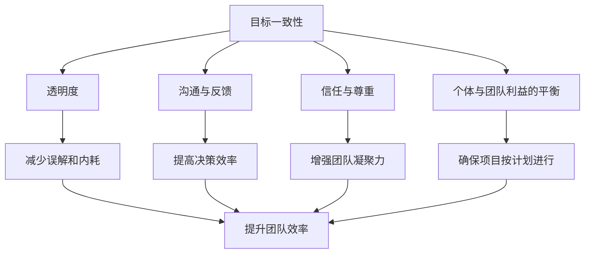
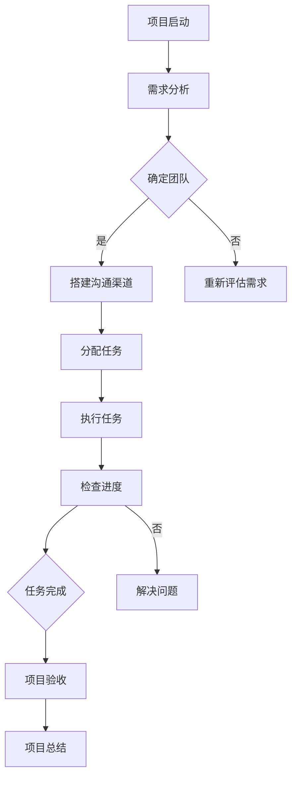

                 

## 文章标题

“技术管理中的跨团队协作技巧”

---

关键词：技术管理、跨团队协作、团队架构设计、工具选择、风险管理、领导力技巧

---

摘要：本文旨在深入探讨技术管理中跨团队协作的关键技巧。通过详细分析跨团队协作的核心概念、架构设计、技术选型、实际案例和领导力技巧，本文将帮助技术管理者更好地理解和实施跨团队协作，提升项目执行效率和团队整体表现。

---

### 确定书籍的核心主题和目标读者

#### 1. 核心主题

本文的核心主题是“技术管理中的跨团队协作技巧”。具体而言，本文将围绕以下四个核心方面展开讨论：

1. **跨团队协作的核心概念与挑战**：介绍跨团队协作的基本原则、常见挑战及其解决方案。
2. **跨团队协作的架构设计**：探讨如何通过组织架构和工作流程的设计，实现高效的跨团队协作。
3. **技术选型与工具选择**：分析技术选型的策略和跨团队协作工具的评估与使用技巧。
4. **跨团队协作中的领导力技巧**：讨论领导风格、冲突管理与激励技巧，以支持团队协作的顺利开展。

#### 2. 目标读者

本文的目标读者主要针对以下几类人群：

1. **技术管理者**：包括项目经理、技术经理、CTO等，他们在日常工作中需要协调多个团队的合作，实现项目目标。
2. **团队成员**：包括软件开发工程师、测试工程师、产品经理等，他们需要理解跨团队协作的机制和工具，提高工作效率。
3. **IT行业从业者**：包括技术顾问、技术培训师等，他们希望通过本文了解跨团队协作的最佳实践，为工作提供参考。

通过本文的阅读，目标读者将能够：

1. 理解跨团队协作的核心概念和重要性。
2. 掌握跨团队协作的架构设计和实施策略。
3. 学会选择适合的技术和工具，提升协作效率。
4. 提高领导力技巧，有效管理跨团队协作中的冲突和激励团队。

### 3. 内容结构设计

为了确保文章的条理清晰、内容丰富且具有实用性，本文将采用以下结构：

1. **引言**：介绍跨团队协作的重要性，阐述本文的核心内容和目标。
2. **核心概念与联系**：详细分析跨团队协作的基本原则、挑战和解决方案。
3. **架构设计**：探讨组织架构、工作流程的设计和实施策略。
4. **技术选型与工具选择**：分析技术选型的策略和工具评估与使用技巧。
5. **实际案例**：通过具体案例展示跨团队协作的实施过程和效果。
6. **领导力技巧**：讨论领导风格、冲突管理与激励技巧。
7. **持续改进与学习**：总结跨团队协作的持续改进方法和学习途径。

### 4. 每个章节的主要内容和子内容

#### 第1章 引言

- **1.1 跨团队协作的重要性**：解释跨团队协作在技术管理中的意义和影响。
- **1.2 本书的目的和内容结构**：概述本文的目的和内容，引导读者了解后续章节。

#### 第2章 跨团队协作的核心概念

- **2.1 团队协作的基本原则**：介绍团队协作的基本原则和理论依据。
- **2.2 跨团队协作中的常见挑战**：分析跨团队协作中可能遇到的挑战和问题。
- **2.3 跨文化协作的影响**：探讨跨文化背景对团队协作的影响。

#### 第3章 跨团队协作的架构设计

- **3.1 组织架构对跨团队协作的影响**：分析不同组织架构对跨团队协作的优缺点。
- **3.2 团队间沟通渠道的搭建**：介绍如何搭建有效的沟通渠道，实现团队间的信息共享。
- **3.3 工作流程的标准化**：探讨如何通过工作流程的标准化，提升跨团队协作的效率。

#### 第4章 技术选型与工具选择

- **4.1 技术选型的策略**：介绍技术选型的策略和方法。
- **4.2 跨团队协作工具的评估**：分析不同跨团队协作工具的优缺点和适用场景。
- **4.3 常用协作工具的使用技巧**：介绍常用协作工具的使用方法和技巧。

#### 第5章 跨团队协作的实际案例

- **5.1 项目启动阶段**：介绍项目启动阶段的关键工作和注意事项。
- **5.2 项目执行阶段**：分析项目执行阶段的关键要素和协作机制。
- **5.3 项目收尾阶段**：总结项目收尾阶段的工作内容和注意事项。

#### 第6章 跨团队协作中的风险管理

- **6.1 风险识别与评估**：介绍如何识别和评估跨团队协作中的风险。
- **6.2 风险应对策略**：探讨不同风险应对策略的选择和应用。
- **6.3 风险监控与调整**：讨论如何监控和调整风险，确保项目顺利进行。

#### 第7章 跨团队协作的领导力技巧

- **7.1 领导风格与团队协作**：分析不同领导风格对团队协作的影响。
- **7.2 冲突管理与解决**：介绍如何管理团队协作中的冲突和问题。
- **7.3 激励与支持团队**：探讨如何激励和支持团队，提升团队士气。

#### 第8章 持续改进与学习

- **8.1 跨团队协作的持续改进**：讨论如何持续改进跨团队协作的方法和策略。
- **8.2 学习与知识共享**：介绍如何促进团队内部的知识共享和学习。
- **8.3 反思与总结**：总结跨团队协作的经验和教训，为后续工作提供借鉴。

### 5. 针对每个子内容，设计相应的目录条目

为了确保文章的完整性和逻辑性，每个子内容都将设计相应的目录条目，具体如下：

#### 第1章 引言

1.1 跨团队协作的重要性
1.2 本书的目的和内容结构

#### 第2章 跨团队协作的核心概念

2.1 团队协作的基本原则
2.2 跨团队协作中的常见挑战
2.3 跨文化协作的影响

#### 第3章 跨团队协作的架构设计

3.1 组织架构对跨团队协作的影响
3.2 团队间沟通渠道的搭建
3.3 工作流程的标准化

#### 第4章 技术选型与工具选择

4.1 技术选型的策略
4.2 跨团队协作工具的评估
4.3 常用协作工具的使用技巧

#### 第5章 跨团队协作的实际案例

5.1 项目启动阶段
5.2 项目执行阶段
5.3 项目收尾阶段

#### 第6章 跨团队协作中的风险管理

6.1 风险识别与评估
6.2 风险应对策略
6.3 风险监控与调整

#### 第7章 跨团队协作的领导力技巧

7.1 领导风格与团队协作
7.2 冲突管理与解决
7.3 激励与支持团队

#### 第8章 持续改进与学习

8.1 跨团队协作的持续改进
8.2 学习与知识共享
8.3 反思与总结

### 6. 整理并校对目录大纲，确保内容完整且逻辑清晰

在完成目录大纲的设计后，我们需要对整个大纲进行整理和校对，确保内容完整、逻辑清晰。以下是一些具体的操作步骤：

1. **检查目录条目的完整性**：确保每个章节的子内容都包含相应的目录条目，没有遗漏。

2. **检查目录条目的逻辑性**：确保每个目录条目的前后关系合理，章节之间的衔接顺畅。

3. **校对内容**：对每个章节的内容进行仔细校对，确保内容的准确性和一致性。

4. **调整和优化**：根据校对结果，对目录大纲进行必要的调整和优化，以提高整体的逻辑性和可读性。

5. **形成最终版本**：将整理和校对后的目录大纲保存为最终的版本，为后续的撰写工作做好准备。

通过以上步骤，我们可以确保目录大纲的内容完整、逻辑清晰，为撰写高质量的技术博客文章奠定基础。

---

通过上述步骤，我们成功设计了《技术管理中的跨团队协作技巧》的书籍目录大纲。这个大纲不仅涵盖了跨团队协作的各个方面，还确保了内容的逻辑性和完整性。接下来，我们将逐步撰写每个章节的内容，确保文章的丰富性和实用性。

---

## 第1章 引言

### 1.1 跨团队协作的重要性

在当今快速变化和高度复杂的技术环境中，跨团队协作已成为实现项目成功的关键因素。跨团队协作的重要性体现在多个方面：

首先，跨团队协作能够充分利用各个团队的专业知识和技能，实现资源的最大化利用。在大型项目中，不同的团队通常负责不同的功能模块或任务，例如开发、测试、设计、产品管理等。通过跨团队协作，各个团队能够分享知识和经验，共同解决问题，提高项目整体的执行效率和质量。

其次，跨团队协作有助于促进不同团队之间的沟通与理解。在技术管理中，团队之间的沟通障碍往往是项目失败的主要原因之一。通过跨团队协作，团队成员可以更深入地了解其他团队的工作内容和目标，减少误解和冲突，建立更加和谐的工作关系。

第三，跨团队协作有助于创新和知识的共享。在技术领域，创新往往来自于不同背景和领域的知识融合。跨团队协作提供了一个平台，让团队成员可以分享各自的创新思维和实践经验，激发新的创意和解决方案。

最后，跨团队协作可以提高项目的灵活性和适应性。在快速变化的市场和技术环境中，项目需求往往会发生频繁的变化。通过跨团队协作，项目团队能够更快地响应变化，调整策略和资源，确保项目能够顺利推进。

### 1.2 本书的目的和内容结构

本书旨在为技术管理者提供全面的跨团队协作技巧，帮助他们在技术管理中实现高效的团队协作。本书的主要内容包括：

1. **核心概念与联系**：介绍跨团队协作的基本原则、挑战和解决方案，探讨跨文化协作的影响。
2. **架构设计**：分析组织架构对跨团队协作的影响，介绍团队间沟通渠道的搭建和工作流程的标准化。
3. **技术选型与工具选择**：讨论技术选型的策略，评估跨团队协作工具的优缺点，提供使用技巧。
4. **实际案例**：通过具体项目案例，展示跨团队协作的实施过程和效果。
5. **领导力技巧**：探讨领导风格、冲突管理与激励技巧，提升团队协作的效率和士气。
6. **持续改进与学习**：总结跨团队协作的持续改进方法和学习途径。

通过以上内容，本书将帮助技术管理者深入了解跨团队协作的各个方面，掌握有效的协作技巧，提升项目执行效率和质量。

### 1.3 读者预期收益

阅读本书后，读者可以期望获得以下收益：

1. **深入了解跨团队协作的核心概念和重要性**：读者将理解跨团队协作在技术管理中的关键作用，认识到其在项目成功中的重要性。
2. **掌握跨团队协作的架构设计和实施策略**：读者将学习如何设计组织架构、搭建沟通渠道和标准化工作流程，提高跨团队协作的效率。
3. **了解技术选型和工具选择的策略**：读者将掌握如何评估和选择合适的协作工具，提高团队协作的效果。
4. **提升领导力技巧**：读者将学习如何管理跨团队协作中的冲突和激励团队，提升团队士气和执行力。
5. **持续改进与学习**：读者将了解如何持续改进跨团队协作的方法和策略，促进团队内部的知识共享和学习。

通过本书的阅读和实践，读者将能够更好地应对技术管理中的跨团队协作挑战，提升团队协作效率，实现项目目标。

---

在引言部分，我们首先介绍了跨团队协作的重要性，强调了其在技术管理中的关键作用。接着，我们概述了本书的目的和内容结构，帮助读者了解后续章节的主要内容。最后，我们分析了读者通过阅读本书可以期望获得的收益，激发读者的阅读兴趣和动力。

接下来，我们将深入探讨跨团队协作的核心概念，分析其基本原则、挑战和解决方案，以及跨文化协作的影响。这将为我们后续章节的讨论打下坚实的基础。

---

## 第2章 跨团队协作的核心概念

### 2.1 团队协作的基本原则

跨团队协作的有效性建立在一系列基本原则之上。以下是几个关键原则：

**1. 目标一致性**

跨团队协作的首要原则是确保所有团队成员都明确共同的目标。这意味着在项目启动阶段，团队需要共同制定项目目标，并确保每个成员都了解这些目标的重要性和实现方法。通过目标一致性，团队成员可以在工作中保持方向一致，避免不必要的内耗和冲突。

**2. 透明度**

透明度是跨团队协作的重要保障。团队成员需要分享信息、进度和问题，确保每个人都能了解项目的全貌。透明度有助于减少误解和猜测，提高决策效率，促进团队之间的信任和合作。

**3. 沟通与反馈**

有效的沟通是跨团队协作的基石。团队成员需要建立畅通的沟通渠道，定期召开会议、进行讨论和交流。同时，及时的反馈机制也非常重要，可以帮助团队及时发现和解决问题，确保项目按计划进行。

**4. 信任与尊重**

信任和尊重是团队协作中不可或缺的元素。团队成员需要相互信任，尊重彼此的专业能力和工作成果。信任可以减少猜疑和防备，提高团队的整体士气和工作效率。尊重则可以增强团队的凝聚力，促进团队成员之间的和谐相处。

**5. 个体与团队利益的平衡**

在跨团队协作中，需要平衡个体利益和团队利益。团队成员应该意识到，个人目标的实现离不开团队的支持和合作。同时，团队目标也需要考虑每个成员的贡献和需求，确保团队成员在实现共同目标的同时，也能实现个人目标。

### 2.2 跨团队协作中的常见挑战

尽管跨团队协作有许多优势，但在实际操作中仍面临一些常见挑战：

**1. 沟通障碍**

沟通障碍是跨团队协作中最常见的问题。由于团队成员来自不同的背景和领域，他们可能使用不同的术语、表达方式和沟通风格。这种差异可能导致误解、信息丢失和沟通效率低下。

**2. 组织架构的局限性**

组织架构可能限制了跨团队协作的灵活性。例如，传统的垂直型组织结构可能导致信息流通不畅，决策效率低下。此外，不同团队之间的职责划分不清也可能导致权责不明、互相推诿的情况。

**3. 文化差异**

跨文化协作增加了团队协作的复杂性。文化差异可能表现在价值观、工作习惯、沟通方式等方面。这些差异可能导致团队成员之间的误解和冲突，影响协作效果。

**4. 领导风格不一致**

不同的领导风格可能对团队协作产生负面影响。例如，一个强调权威和命令式的领导风格可能与一个鼓励民主和参与的领导风格相冲突。这种领导风格的不一致可能导致团队成员之间的矛盾和不和谐。

**5. 资源分配不均**

在跨团队协作中，资源分配不均可能导致某些团队过度劳累，而其他团队资源闲置。资源的不均衡不仅影响团队的士气，也可能导致项目进展受阻。

### 2.3 跨文化协作的影响

跨文化协作在技术管理中日益普遍，但其影响也相当复杂：

**1. 增加创新机会**

跨文化协作可以促进创新思维的形成。不同文化背景的团队成员在交流中可能会碰撞出新的创意和解决方案，从而提高项目的创新性和竞争力。

**2. 提升国际化视野**

跨文化协作有助于团队成员拓展国际视野，了解不同文化的工作方式和价值观。这有助于团队在全球范围内开展业务，提升组织的国际化水平。

**3. 文化冲突**

然而，跨文化协作也可能引发文化冲突。文化差异可能导致沟通障碍、误解和冲突。有效的跨文化协作需要团队成员具备跨文化意识和沟通技巧，以避免文化冲突的负面影响。

**4. 需求的多样化**

跨文化协作还可能带来需求多样化的问题。不同文化背景的团队成员可能会有不同的需求和期望，这需要团队在项目规划和执行中进行平衡和调整。

### 2.4 跨团队协作的基本原则与联系

为了更好地理解跨团队协作，我们可以借助Mermaid流程图来展示其基本原则和联系。以下是跨团队协作的基本原则与联系的Mermaid流程图：



通过这个流程图，我们可以清晰地看到跨团队协作的基本原则及其相互之间的联系。这些原则共同作用，为跨团队协作提供了坚实的基础。

### 2.5 总结

本章介绍了跨团队协作的核心概念，包括基本原则、常见挑战和跨文化协作的影响。通过理解这些核心概念，技术管理者可以更好地应对跨团队协作中的挑战，建立有效的协作机制，提高项目执行效率和质量。

接下来，我们将探讨跨团队协作的架构设计，分析组织架构对跨团队协作的影响，介绍团队间沟通渠道的搭建和工作流程的标准化。这将为我们进一步探讨跨团队协作的实施策略提供重要参考。

---

在第2章中，我们详细介绍了跨团队协作的基本原则，分析了常见的挑战和跨文化协作的影响。通过理解这些核心概念，技术管理者可以更好地设计跨团队协作的架构，确保协作机制的顺利实施。

接下来，我们将深入探讨跨团队协作的架构设计，分析组织架构对跨团队协作的影响，介绍团队间沟通渠道的搭建和工作流程的标准化。这将帮助我们构建一个高效、有序的跨团队协作环境。

---

## 第3章 跨团队协作的架构设计

### 3.1 组织架构对跨团队协作的影响

跨团队协作的架构设计首先需要考虑组织架构对协作的影响。组织架构是团队协作的基础，不同的架构类型会对跨团队协作产生不同的影响。

#### 1. 传统垂直型组织架构

传统垂直型组织架构通常以职能为基础，各个部门（如开发、测试、产品等）相对独立，各自负责不同的职能。这种架构的优点在于职责清晰、分工明确，有助于提高专业化水平。然而，其缺点也是明显的，即信息流通不畅、决策效率低下。在跨团队协作中，这种架构容易导致沟通障碍和协调困难。

#### 2. 水平型组织架构

水平型组织架构强调跨职能合作，团队成员来自不同的部门，共同负责项目的不同阶段。这种架构的优点在于信息流通速度快、决策效率高，有助于促进团队间的协作。然而，其缺点在于分工不明确，可能导致职责重叠和责任模糊。

#### 3. 矩阵型组织架构

矩阵型组织架构结合了垂直型和水平型架构的优点，团队成员既归属于某个职能部门，又参与项目的跨职能合作。这种架构的优点在于既保证了专业化水平，又促进了跨职能协作。然而，其缺点在于管理复杂度高、权责关系较复杂，可能需要更精细的管理和协调。

#### 4. 网络型组织架构

网络型组织架构更加灵活，通过外部合作伙伴和内部团队的紧密合作，实现资源的共享和协同创新。这种架构的优点在于高度灵活、响应速度快，能够适应快速变化的市场环境。然而，其缺点在于管理难度大、资源协调复杂。

#### 结论

在跨团队协作的架构设计中，选择合适的组织架构至关重要。传统垂直型组织架构适用于职责明确、流程稳定的项目，水平型组织架构适用于创新性和灵活性要求较高的项目，矩阵型组织架构适用于需要高度专业化和跨职能合作的项目，而网络型组织架构适用于高度灵活和创新驱动的项目。技术管理者需要根据项目特点和团队需求，选择最合适的组织架构，以支持跨团队协作的有效实施。

### 3.2 团队间沟通渠道的搭建

沟通渠道的搭建是跨团队协作的关键环节。有效的沟通渠道能够确保信息在团队间的顺畅传递，减少误解和冲突。以下是一些搭建沟通渠道的关键步骤：

#### 1. 明确沟通目的和内容

在搭建沟通渠道之前，首先要明确沟通的目的和内容。沟通的目的可能包括项目进展报告、问题反馈、决策讨论等。明确沟通内容有助于确保沟通的针对性，避免无关信息的传递。

#### 2. 选择合适的沟通工具

根据沟通的目的和内容，选择合适的沟通工具。常见的沟通工具包括邮件、即时通讯软件（如Slack、Telegram等）、视频会议工具（如Zoom、Microsoft Teams等）和项目管理工具（如Jira、Trello等）。每种工具都有其优势和适用场景，技术管理者需要根据实际情况进行选择。

#### 3. 设立定期会议

定期会议是团队间沟通的重要方式。通过定期会议，团队成员可以汇报工作进展、讨论问题和分享经验。会议的形式可以包括周会、月度会议和项目总结会议等。会议的频率和内容应根据项目的阶段和需求进行调整。

#### 4. 建立信息共享平台

建立信息共享平台，如团队Wiki或项目文档库，有助于团队成员随时随地访问和更新项目信息。信息共享平台应包含项目计划、任务分配、进度报告、问题日志等关键内容，确保团队成员都能获取到所需的信息。

#### 5. 强化沟通培训

有效的沟通需要团队成员具备良好的沟通技巧。技术管理者可以组织沟通培训，帮助团队成员掌握沟通的基本原则和方法，提高沟通效率。

### 3.3 工作流程的标准化

工作流程的标准化是确保跨团队协作高效执行的重要手段。以下是一些标准化工作流程的关键步骤：

#### 1. 确定工作流程

在项目启动阶段，团队需要共同确定工作流程。工作流程应包括项目的各个环节，如需求分析、设计、开发、测试、部署等。明确的工作流程有助于确保项目按照既定计划进行，减少混乱和重复工作。

#### 2. 制定标准和规范

为了确保工作流程的执行，团队需要制定相应的标准和规范。这些标准和规范可以包括编码规范、测试规范、文档规范等。通过制定和执行标准和规范，可以确保项目的质量一致，提高团队的协作效率。

#### 3. 实施和监督

在制定工作流程和标准后，团队需要实施和监督执行情况。实施过程中，团队应确保每个成员都了解和遵守工作流程和标准。监督过程中，团队可以定期检查工作进展和质量，及时发现和解决问题。

#### 4. 持续优化

工作流程和标准不是一成不变的，团队应持续优化。通过定期回顾和评估工作流程和标准的执行情况，团队可以不断改进，提高协作效率和质量。

### 3.4 组织架构、沟通渠道和工作流程之间的关系

组织架构、沟通渠道和工作流程是跨团队协作的三大支柱，它们之间相互关联、相互支持。合理的组织架构可以为团队协作提供基础，有效的沟通渠道可以确保信息的顺畅传递，标准化的工作流程可以确保项目的高效执行。

通过组织架构的设计，团队可以明确职责和分工，减少冲突和重复工作。沟通渠道的搭建则确保了团队成员之间的信息共享和协作，提高了决策效率和工作效率。工作流程的标准化则确保了项目的有序推进，减少了混乱和错误。

因此，在跨团队协作的架构设计中，技术管理者需要综合考虑组织架构、沟通渠道和工作流程，确保它们之间相互匹配、相互支持，共同为团队协作提供保障。

### 3.5 总结

本章介绍了跨团队协作的架构设计，分析了组织架构对协作的影响，探讨了沟通渠道的搭建和工作流程的标准化。通过合理的组织架构设计、有效的沟通渠道搭建和标准化的工作流程实施，技术管理者可以构建一个高效、有序的跨团队协作环境，提高项目执行效率和质量。

接下来，我们将讨论技术选型与工具选择，分析技术选型的策略和跨团队协作工具的评估与使用技巧。这将为我们进一步探讨跨团队协作的实践应用提供重要参考。

---

在第3章中，我们详细探讨了跨团队协作的架构设计，分析了组织架构对协作的影响，介绍了沟通渠道的搭建和工作流程的标准化。这些内容为跨团队协作提供了重要的理论基础和实践指导。

接下来，我们将讨论技术选型与工具选择，分析技术选型的策略和跨团队协作工具的评估与使用技巧。这将帮助我们更好地理解如何利用技术手段提升跨团队协作的效率和效果。

---

## 第4章 技术选型与工具选择

### 4.1 技术选型的策略

技术选型是跨团队协作中至关重要的一环，它直接影响项目的成功与否。以下是几个关键策略：

#### 1. 需求分析

在进行技术选型之前，首先需要明确项目的需求。这包括功能需求、性能需求、安全需求等。通过详细的需求分析，可以明确技术选型的方向和目标。

#### 2. 市场调研

在明确需求后，需要进行市场调研，了解当前市场上有哪些适用的技术和工具。调研内容包括技术的成熟度、稳定性、社区活跃度、成本等。通过市场调研，可以筛选出一些潜在的技术和工具。

#### 3. 技术评估

对潜在的技术和工具进行评估，包括功能评估、性能评估、安全性评估等。评估过程中，可以参考第三方评测报告、用户反馈和社区讨论等。通过技术评估，可以选出最适合项目的技术和工具。

#### 4. 成本效益分析

在技术选型过程中，还需要进行成本效益分析。这包括技术采购成本、开发成本、维护成本等。通过成本效益分析，可以确保所选技术和工具在经济上可行。

#### 5. 风险评估

最后，进行风险评估。包括技术选型的风险、项目实施的风险、维护和升级的风险等。通过风险评估，可以提前识别潜在的风险，并制定相应的应对策略。

### 4.2 跨团队协作工具的评估

在跨团队协作中，选择合适的工具至关重要。以下是几个关键评估方面：

#### 1. 功能性

工具的功能性是首要考虑因素。需要评估工具是否具备所需的功能，如任务管理、文档共享、代码评审、项目管理等。工具的功能性应满足团队的工作需求，提高协作效率。

#### 2. 易用性

工具的易用性直接影响团队成员的使用体验。需要评估工具的界面设计、操作流程、学习成本等。一个易用的工具可以降低团队成员的学习成本，提高工作效率。

#### 3. 稳定性和可靠性

工具的稳定性和可靠性是确保协作顺利进行的关键。需要评估工具的稳定性、故障率、恢复速度等。一个稳定可靠的工具可以减少系统故障对协作的影响。

#### 4. 可扩展性和兼容性

工具的可扩展性和兼容性是长期使用的重要考量。需要评估工具是否支持扩展功能、是否与其他系统兼容等。一个可扩展性和兼容性好的工具可以适应项目的变化和需求。

#### 5. 安全性和隐私保护

工具的安全性和隐私保护是保障协作安全的关键。需要评估工具的数据加密、访问控制、日志审计等安全措施。一个安全性和隐私保护好的工具可以确保协作数据的安全。

### 4.3 常用协作工具的评估与使用技巧

以下是对几种常用协作工具的评估及其使用技巧：

#### 1. Slack

**评估：**
- 功能性：提供即时通讯、任务管理、文件共享、集成第三方服务等。
- 易用性：界面简洁，操作便捷，支持多种平台。
- 稳定性和可靠性：服务器稳定，故障率低。
- 可扩展性和兼容性：支持扩展插件和API，与其他工具集成方便。
- 安全性和隐私保护：提供加密传输和访问控制。

**使用技巧：**
- 定期清理未使用的群组，减少噪音。
- 制定统一的命名规范，便于查找和管理。
- 利用Slack机器人自动化任务，提高效率。

#### 2. Jira

**评估：**
- 功能性：提供项目管理、任务跟踪、敏捷开发、自动化流程等。
- 易用性：界面直观，功能丰富，支持多种平台。
- 稳定性和可靠性：服务器稳定，性能优越。
- 可扩展性和兼容性：支持多种插件和集成，适应不同项目需求。
- 安全性和隐私保护：提供多层次的安全措施，保障数据安全。

**使用技巧：**
- 合理划分项目和管理权限，确保数据安全。
- 制定明确的任务流程和里程碑，提高项目管理效率。
- 利用Jira的报告和分析功能，监控项目进度和质量。

#### 3. Trello

**评估：**
- 功能性：提供任务管理、看板视图、文档共享等。
- 易用性：界面简洁，操作直观，适合快速上手。
- 稳定性和可靠性：服务器稳定，响应速度快。
- 可扩展性和兼容性：支持多种插件和API，易于扩展功能。
- 安全性和隐私保护：提供数据备份和访问控制。

**使用技巧：**
- 合理划分任务和责任，确保任务分配清晰。
- 利用看板视图，实时了解项目进展。
- 定期整理和归档任务，减少噪音。

#### 4. GitLab

**评估：**
- 功能性：提供代码托管、代码评审、持续集成、项目管理等。
- 易用性：界面直观，功能强大，适合专业开发团队。
- 稳定性和可靠性：服务器稳定，性能优越。
- 可扩展性和兼容性：支持多种集成工具，适应不同开发需求。
- 安全性和隐私保护：提供加密传输和访问控制。

**使用技巧：**
- 合理设置权限和角色，确保代码安全。
- 利用代码评审功能，提高代码质量。
- 定期进行持续集成和测试，确保项目稳定性。

### 4.4 总结

技术选型和工具选择是跨团队协作中至关重要的环节。通过合理的策略和评估，可以选出最适合项目的技术和工具，提高协作效率和质量。本章介绍了技术选型的策略、跨团队协作工具的评估方法，以及几种常用协作工具的评估和使用技巧。技术管理者可以根据实际情况，选择和配置合适的工具，提升团队协作的效果。

接下来，我们将通过实际案例展示跨团队协作的实施过程和效果，进一步探讨跨团队协作的最佳实践。

---

在第4章中，我们详细讨论了技术选型和工具选择的重要性，介绍了技术选型的策略、跨团队协作工具的评估方法，以及几种常用协作工具的评估和使用技巧。这些内容为技术管理者在选择技术和工具时提供了实用的指导。

接下来，我们将通过实际案例展示跨团队协作的实施过程和效果，帮助读者更直观地理解跨团队协作的最佳实践。通过这些案例，我们将探讨如何在项目中有效实施跨团队协作，解决协作中的挑战，实现项目目标。

---

## 第5章 跨团队协作的实际案例

### 5.1 项目背景

本案例涉及一家全球领先的互联网公司，该公司正开发一款大型社交应用。这款应用需要实现用户注册、消息推送、社交圈子等功能，涉及到多个团队的合作，包括前端开发团队、后端开发团队、测试团队和产品团队。项目时间紧、任务重，团队间的协作至关重要。

### 5.2 项目启动阶段

在项目启动阶段，团队首先进行了需求分析和项目规划。以下是项目启动阶段的关键步骤：

**1. 需求分析**

产品团队与业务方进行了多次讨论，明确了应用的功能需求、性能需求和用户体验需求。这些需求被整理成详细的文档，并在团队内部进行了评审和确认。

**2. 项目规划**

团队制定了详细的项目计划，包括项目范围、时间表、里程碑和预算。项目计划考虑了各个团队的职责和任务，明确了每个阶段的交付物和验收标准。

**3. 团队组建**

根据项目需求，公司从各个部门选调了合适的团队成员。前端开发团队、后端开发团队、测试团队和产品团队分别组建，每个团队都配备了经验丰富的成员。

**4. 跨团队会议**

为了确保团队间的协作，公司定期召开跨团队会议。在每次会议中，各个团队汇报工作进展、讨论问题和分享经验。跨团队会议有助于团队成员了解项目的全貌，提高协作效率。

### 5.3 项目执行阶段

在项目执行阶段，团队按照项目计划进行任务分工和协作。以下是项目执行阶段的关键步骤：

**1. 任务分配**

根据项目计划，各个团队分别负责不同的模块开发。前端开发团队负责用户界面设计和实现，后端开发团队负责服务器端开发，测试团队负责功能测试和性能测试，产品团队负责用户反馈收集和需求调整。

**2. 沟通渠道搭建**

为了确保团队间的信息共享和协作，公司搭建了多种沟通渠道。包括Slack聊天室、Jira任务管理工具和GitLab代码托管平台。这些工具为团队成员提供了实时沟通、任务追踪和代码管理的平台。

**3. 定期更新和反馈**

在项目执行过程中，团队定期更新项目进展，并在跨团队会议上讨论和解决遇到的问题。通过Jira，团队成员可以查看任务进度、提交问题和反馈，确保问题得到及时解决。

**4. 敏捷开发**

为了提高开发效率，团队采用了敏捷开发方法。每个迭代周期（通常为两周）都会进行一次需求梳理、设计和开发，并在迭代结束时进行测试和验收。这种开发方法有助于团队快速响应变化，提高项目交付质量。

### 5.4 项目收尾阶段

在项目收尾阶段，团队进行了项目总结和验收工作。以下是项目收尾阶段的关键步骤：

**1. 项目验收**

产品团队组织了内部验收会议，邀请业务方和用户代表参与。验收过程中，团队展示了应用的功能、性能和用户体验，并收集了用户反馈。

**2. 项目总结**

项目结束后，团队进行了项目总结会议。团队成员分享了项目中的成功经验和教训，总结了跨团队协作的最佳实践。项目总结有助于团队持续改进，为未来项目提供参考。

**3. 文档归档**

团队将项目文档、代码库和测试报告进行了归档，确保项目成果可追溯。文档归档为未来项目的参考提供了宝贵资源。

### 5.5 跨团队协作的实际效果

通过有效的跨团队协作，该项目在规定时间内成功上线，并获得了用户和业务方的认可。以下是跨团队协作的实际效果：

**1. 提高项目交付效率**

跨团队协作使得团队间信息共享和沟通畅通，减少了重复工作和错误。项目任务分配明确，团队成员各司其职，有效提高了项目交付效率。

**2. 提升团队协作质量**

跨团队协作增强了团队成员之间的信任和合作，提高了团队协作质量。团队成员在协作过程中共同解决问题，共同承担责任，实现了团队的协同作战。

**3. 促进知识共享和经验积累**

跨团队协作提供了一个平台，让团队成员可以分享知识和经验。通过项目总结和文档归档，团队积累了宝贵的项目经验，为未来的项目提供了参考。

**4. 增强团队凝聚力**

跨团队协作增强了团队的凝聚力，提升了团队士气。团队成员在共同完成项目的过程中建立了深厚的友谊，增强了团队的向心力和归属感。

### 5.6 经验教训

通过这个实际案例，我们可以总结出以下经验教训：

**1. 确保团队间信息共享**

有效的信息共享是跨团队协作的关键。团队应建立畅通的沟通渠道，确保信息及时传递和更新。

**2. 明确任务分工和责任**

任务分工和责任明确是确保项目顺利进行的基础。团队应制定详细的任务分配和责任制度，确保每个成员都清楚自己的职责。

**3. 激励和支持团队协作**

团队协作需要激励和支持。管理者应关注团队成员的工作状态，提供必要的资源和支持，激发团队成员的积极性和创造力。

**4. 持续改进和反思**

跨团队协作是一个持续改进的过程。团队应定期进行项目总结和反思，发现和解决问题，不断提升协作效果。

通过这个实际案例，我们可以看到跨团队协作在技术管理中的重要性。通过合理的设计和实施，跨团队协作可以提高项目交付效率，提升团队协作质量，促进知识共享和经验积累，增强团队凝聚力。技术管理者应借鉴这些经验教训，在实际工作中不断优化跨团队协作机制，实现项目目标。

---

通过这个实际案例，我们详细展示了跨团队协作在项目执行过程中的具体实施方法和效果。从项目背景到启动阶段、执行阶段和收尾阶段，我们分析了跨团队协作的关键步骤和注意事项。通过有效的跨团队协作，该项目成功上线并获得了用户和业务方的认可，为后续项目提供了宝贵的经验和教训。

接下来，我们将讨论跨团队协作中的风险管理，包括风险识别、评估和应对策略，以及如何监控和调整风险，确保项目顺利进行。

---

## 第6章 跨团队协作中的风险管理

### 6.1 风险识别与评估

跨团队协作中的风险管理是确保项目顺利进行的关键环节。风险管理包括风险识别、评估、应对策略和监控调整。以下是风险识别和评估的具体步骤：

#### 1. 风险识别

风险识别是风险管理的第一步，旨在识别项目中可能遇到的风险。以下是几种常用的风险识别方法：

**1. 专家访谈**：通过与项目团队成员和相关利益相关者进行访谈，了解他们对项目风险的看法和经验。

**2. 历史数据回顾**：分析过去类似项目的风险记录，从中总结出常见风险。

**3. 文件审查**：审查项目计划、需求文档、工作流程等文件，识别潜在风险。

**4. 问卷调查**：通过问卷调查收集团队成员对项目风险的看法和建议。

#### 2. 风险评估

在识别出风险后，需要对风险进行评估，确定其可能性和影响。以下是几种常用的风险评估方法：

**1. 费雷尔图（Fishbone Diagram）**：通过费雷尔图分析风险的原因和影响因素，确定风险的关键因素。

**2. 影响和可能性矩阵**：将风险的可能性和影响进行量化，并绘制成矩阵，以便直观地了解风险的重要性和优先级。

**3. 概率分布图**：通过概率分布图展示风险发生的概率和时间分布，帮助团队制定应对策略。

### 6.2 风险应对策略

在评估风险后，需要制定相应的应对策略，以降低风险的可能性和影响。以下是几种常用的风险应对策略：

#### 1. 风险规避

风险规避是通过避免风险发生的可能性来降低风险。例如，如果某个技术方案存在较高的失败风险，可以选择替代方案。

#### 2. 风险转移

风险转移是通过将风险转移给第三方来降低风险。例如，通过购买保险来转移项目实施中的技术风险。

#### 3. 风险减轻

风险减轻是通过减少风险的可能性和影响来降低风险。例如，通过增加资源投入、优化工作流程和加强团队培训来减轻风险。

#### 4. 风险接受

风险接受是在风险发生的可能性和影响较小的情况下，选择接受风险。例如，对于一些较小的技术风险，可以选择继续推进项目，并在项目执行过程中密切关注风险的发展。

### 6.3 风险监控与调整

在实施风险应对策略后，需要对风险进行监控和调整，以确保风险在可控范围内。以下是风险监控与调整的关键步骤：

#### 1. 风险监控

风险监控是通过定期检查和评估风险的状态，确保风险在可控范围内。以下是几种常用的风险监控方法：

**1. 风险日志**：记录风险的状态、应对措施和监控结果。

**2. 风险评审会议**：定期召开评审会议，评估风险的变化和应对措施的有效性。

**3. 风险预警系统**：建立风险预警机制，及时发现潜在风险。

#### 2. 风险调整

在风险监控过程中，如果发现风险的变化超出预期，需要及时进行调整。以下是几种常用的风险调整方法：

**1. 应对措施调整**：根据风险监控的结果，调整应对措施，确保风险在可控范围内。

**2. 资源重新分配**：根据风险的变化，重新分配资源，确保项目团队能够应对风险。

**3. 项目计划调整**：根据风险的变化，调整项目计划，确保项目能够按时完成。

### 6.4 风险管理的实际案例

以下是一个跨团队协作中的风险管理实际案例：

#### 1. 风险识别

项目团队在项目启动阶段识别出以下风险：

- 技术风险：部分技术方案不成熟，可能影响项目进度。
- 人员风险：部分团队成员经验不足，可能影响项目质量。
- 沟通风险：团队间沟通不畅，可能导致误解和冲突。

#### 2. 风险评估

通过费雷尔图和影响和可能性矩阵，团队评估了这些风险的可能性和影响，确定了以下风险优先级：

- 技术风险：高可能性，高影响。
- 人员风险：中可能性，高影响。
- 沟通风险：低可能性，中影响。

#### 3. 风险应对策略

针对识别出的风险，团队制定了以下应对策略：

- 技术风险：选择成熟的技术方案，并进行充分测试。
- 人员风险：加强团队成员培训，提高团队整体能力。
- 沟通风险：建立定期沟通机制，确保信息共享和问题及时解决。

#### 4. 风险监控与调整

在项目执行过程中，团队定期监控风险状态，并根据监控结果进行调整：

- 技术风险：通过测试，发现并解决了部分技术问题，确保项目进度。
- 人员风险：通过培训和经验积累，提高了团队的整体能力。
- 沟通风险：通过定期沟通，减少了误解和冲突，提高了团队协作效率。

### 6.5 总结

通过有效的风险管理，项目团队成功应对了潜在风险，确保了项目的顺利进行。风险管理的实际案例展示了风险识别、评估、应对策略和监控调整的具体步骤和方法。技术管理者应借鉴这些经验，在实际项目中加强风险管理，确保项目目标的实现。

接下来，我们将讨论跨团队协作中的领导力技巧，包括领导风格、冲突管理和激励技巧，帮助技术管理者提升团队协作效率。

---

在第6章中，我们详细探讨了跨团队协作中的风险管理，包括风险识别、评估、应对策略和监控调整。通过识别潜在风险、制定应对策略和持续监控，技术管理者可以有效地管理跨团队协作中的风险，确保项目顺利进行。

接下来，我们将讨论跨团队协作中的领导力技巧，包括领导风格、冲突管理和激励技巧。这些技巧对于提升团队协作效率、解决协作中的问题至关重要。

---

## 第7章 跨团队协作的领导力技巧

### 7.1 领导风格与团队协作

领导风格对跨团队协作有着重要影响。不同的领导风格会带来不同的团队协作效果。以下是几种常见的领导风格及其对团队协作的影响：

**1. 权威型领导风格**

权威型领导风格通常由领导者制定决策和计划，团队成员执行。这种领导风格有助于快速决策和统一行动，但可能导致团队成员缺乏参与感和创造力。在跨团队协作中，权威型领导风格可以用于紧急项目和需要迅速决策的情况，但在长期项目中，可能会抑制团队成员的积极性和主动性。

**2. 参与型领导风格**

参与型领导风格鼓励团队成员参与决策过程，提高团队的参与度和归属感。这种领导风格有助于激发团队成员的创造力和主动性，提高团队协作效果。然而，参与型领导风格可能需要更多的时间和资源来达成共识，对于时间敏感的项目可能不够高效。

**3. 民主型领导风格**

民主型领导风格强调平等和公正，鼓励团队成员自由表达意见和参与决策。这种领导风格有助于建立信任和合作关系，提高团队协作效率。然而，民主型领导风格可能导致决策过程复杂化，对于需要快速决策的项目可能不够高效。

**4. 支持型领导风格**

支持型领导风格注重团队成员的情感需求，提供必要的支持和资源。这种领导风格有助于提高团队成员的工作满意度和忠诚度，增强团队凝聚力。然而，支持型领导风格可能缺乏明确的目标和决策，对于需要明确目标和高效执行的项目可能不够适用。

### 7.2 冲突管理与解决

在跨团队协作中，冲突是不可避免的。有效的冲突管理能够帮助团队克服障碍，提高协作效率。以下是几种冲突管理策略：

**1. 认识到冲突的必然性**

首先，团队领导者需要认识到冲突的必然性，理解冲突是团队协作中的一种自然现象。通过接受和认识到冲突的存在，团队可以更积极地面对和解决冲突。

**2. 分析冲突的原因**

冲突的原因多种多样，包括目标不一致、沟通不畅、资源分配不均等。团队领导者需要分析冲突的根源，了解冲突的具体原因，从而制定有效的解决方案。

**3. 保持开放和公正的态度**

在冲突管理中，领导者应保持开放和公正的态度，倾听不同意见，尊重团队成员的感受。通过建立平等和尊重的氛围，可以有效缓解冲突。

**4. 采用有效的沟通策略**

有效的沟通是解决冲突的关键。领导者应鼓励团队成员进行坦诚的沟通，表达自己的观点和感受，同时倾听他人的意见。通过积极沟通，可以找到共同点和解决方案。

**5. 寻求妥协和合作**

在冲突管理中，寻求妥协和合作是解决冲突的有效策略。领导者应引导团队成员寻找双方都能接受的解决方案，通过妥协和合作实现团队目标。

**6. 设立冲突解决机制**

为了确保冲突得到及时解决，团队可以设立冲突解决机制，如定期召开冲突解决会议，设立专门的冲突解决小组等。通过机制化解决冲突，可以避免冲突的长期积累和扩大。

### 7.3 激励与支持团队

激励和支持团队是提升团队协作效率和士气的关键。以下是几种激励和支持团队的策略：

**1. 设定明确的目标和期望**

团队领导者应与团队成员共同设定明确的目标和期望，确保团队成员了解项目的目标和自己的职责。明确的目标和期望有助于提高团队成员的工作动力和方向感。

**2. 提供及时的反馈**

团队领导者应提供及时的反馈，包括对团队成员的工作表现和项目进展的反馈。积极的反馈可以增强团队成员的自信心和动力，而建设性的批评可以帮助团队成员改进工作。

**3. 赋予责任和权力**

团队领导者应赋予团队成员相应的责任和权力，让团队成员在项目中发挥自己的能力和潜力。责任和权力的赋予可以提高团队成员的参与感和成就感。

**4. 提供必要的资源和支持**

团队领导者应确保团队成员获得必要的资源和支持，包括技术资源、人力资源和时间资源等。充足的资源和支持可以提升团队成员的工作效率和质量。

**5. 建立奖励机制**

团队领导者可以建立奖励机制，对在工作中表现突出的团队成员进行奖励。奖励可以包括物质奖励、荣誉证书、晋升机会等，以激励团队成员保持良好的工作状态。

**6. 关注团队成员的身心健康**

团队领导者应关注团队成员的身心健康，提供必要的心理支持和关怀。通过关注团队成员的身心健康，可以提升团队的凝聚力和士气。

### 7.4 总结

跨团队协作的领导力技巧对于团队协作效率和项目成功至关重要。通过选择合适的领导风格、有效的冲突管理和激励策略，技术管理者可以提升团队协作效率，解决协作中的问题，实现项目目标。技术管理者应不断学习和实践这些领导力技巧，根据实际情况进行灵活应用，以提升团队的整体表现。

---

在第7章中，我们详细探讨了跨团队协作中的领导力技巧，包括领导风格、冲突管理和激励技巧。通过选择合适的领导风格、有效管理冲突和激励团队，技术管理者可以提升团队协作效率，实现项目目标。这些技巧不仅有助于解决协作中的问题，还能提升团队的凝聚力和士气。

接下来，我们将讨论跨团队协作的持续改进与学习，包括如何持续改进协作方法、促进团队内部知识共享和学习，以及如何反思和总结协作经验。通过这些措施，技术管理者可以不断提升跨团队协作的效率和效果。

---

## 第8章 持续改进与学习

### 8.1 跨团队协作的持续改进

跨团队协作的持续改进是确保团队协作效率和项目成功的关键。为了实现这一目标，团队可以采取以下措施：

#### 1. 建立反馈机制

建立一个有效的反馈机制，可以让团队成员随时分享他们的想法和建议。这些反馈可以是正面的也可以是负面的，但最重要的是它们能够为团队提供改进的依据。团队可以通过定期的团队会议、匿名反馈表格或在线反馈平台来收集这些反馈。

#### 2. 定期评估协作效果

定期对跨团队协作的效果进行评估，可以帮助团队了解协作中的优势和不足。评估可以从多个方面进行，包括沟通效率、任务完成情况、团队满意度等。通过评估，团队可以识别出需要改进的领域，并制定相应的改进计划。

#### 3. 实施改进计划

根据评估结果，团队应制定并实施改进计划。这些改进计划可以是流程优化、技术升级、培训提升等。在实施过程中，团队应确保改进计划的有效性，并通过定期监控和评估改进效果，确保计划能够成功实施。

#### 4. 鼓励创新和尝试

鼓励团队成员进行创新和尝试新的协作方法。通过实验和试点项目，团队可以探索新的协作模式，并从中学习到宝贵的经验。即使尝试失败，也应视为一种学习和成长的机会。

### 8.2 学习与知识共享

在跨团队协作中，学习与知识共享是提升团队整体能力的重要手段。以下是几种促进学习与知识共享的方法：

#### 1. 定期组织培训

定期组织团队培训，可以帮助团队成员学习新技能和知识。这些培训可以由内部专家进行，也可以邀请外部专家进行。通过培训，团队成员可以不断提升自己的专业能力和协作能力。

#### 2. 建立知识库

建立团队知识库，将团队成员的经验、最佳实践和技术知识进行整理和归档。知识库可以包括文档、视频、教程等，方便团队成员随时查阅和学习。

#### 3. 促进内部交流

鼓励团队成员之间的内部交流，通过团队会议、研讨会、工作坊等形式，分享经验和知识。这种交流可以促进团队成员之间的相互学习和成长。

#### 4. 鼓励自主学习

鼓励团队成员进行自主学习，提供学习资源和时间。通过自主学习，团队成员可以不断提升自己的专业能力和技术水平。

### 8.3 反思与总结

反思和总结是跨团队协作中不可或缺的一部分。通过反思和总结，团队可以从中学习到宝贵的经验，不断提升协作效率。以下是几种反思与总结的方法：

#### 1. 项目后评估

在项目结束后，团队应进行项目后评估。评估可以从项目目标达成情况、团队协作效果、问题与挑战等方面进行。通过项目后评估，团队可以识别出项目的成功和不足之处，为后续项目提供参考。

#### 2. 团队反思会议

定期召开团队反思会议，让团队成员分享项目中的经验和教训。在反思会议中，团队成员可以提出改进建议，讨论如何避免类似问题的发生。

#### 3. 建立反思文档

建立反思文档，记录团队在项目中的经验和教训。这些文档可以作为团队的宝贵财富，为后续项目提供参考。

#### 4. 持续学习与改进

反思和总结不仅是项目结束时的任务，而是一个持续的过程。团队应持续学习，从每次项目经历中汲取教训，不断改进协作方法，提升团队整体能力。

### 8.4 总结

跨团队协作的持续改进与学习是团队成功的关键。通过建立反馈机制、定期评估协作效果、实施改进计划、促进学习与知识共享，以及反思与总结，团队可以不断提升协作效率，实现项目目标。技术管理者应重视这些持续改进和学习的方法，并将其融入到团队日常工作中，以不断提升团队的整体表现。

---

在第8章中，我们讨论了跨团队协作的持续改进与学习，包括如何通过反馈机制、评估、改进计划、知识共享和反思总结来提升团队协作效率。这些方法不仅有助于团队解决协作中的问题，还能不断积累经验，提升整体能力。

通过本章的内容，技术管理者应认识到持续改进和学习的重要性，将其融入到团队日常工作中，以实现跨团队协作的长期成功。

---

## 附录

### A.1 常用工具与资源

为了方便读者了解和选择合适的跨团队协作工具，我们列出了一些常用的工具和资源：

- **沟通工具**：Slack、Microsoft Teams、Zoom、Google Meet
- **项目管理工具**：Jira、Trello、Asana、Notion
- **文档协作工具**：Google Docs、Microsoft Office 365、Confluence、Notepad++
- **代码管理工具**：GitLab、GitHub、Bitbucket
- **持续集成工具**：Jenkins、Travis CI、Circle CI
- **测试工具**：Selenium、Postman、JMeter
- **知识库工具**：Confluence、Wiki、TiddlyWiki
- **云协作平台**：AWS、Azure、Google Cloud

这些工具和资源可以在各自官方网站上找到详细的使用说明和文档，读者可以根据自己的需求进行选择。

### A.2 跨团队协作的Mermaid流程图示例

以下是一个简单的Mermaid流程图示例，展示了跨团队协作的基本流程：



### A.3 跨团队协作算法与数学模型讲解

在跨团队协作中，算法和数学模型可以帮助我们更好地理解和优化协作流程。以下是一个简单的算法和数学模型讲解：

#### 算法：任务分配算法

**目标**：将任务合理分配给团队成员，确保任务完成时间和团队工作量平衡。

**算法描述**：

1. 计算每个团队成员的可用时间。
2. 根据任务难度和所需时间，为每个任务设置优先级。
3. 从最高优先级任务开始，为每个任务分配一个团队成员。
4. 检查团队成员的可用时间，确保任务分配合理。

**伪代码**：

```python
def assign_tasks(tasks, team_members):
    available_time = calculate_available_time(team_members)
    sorted_tasks = sort_tasks_by_priority(tasks)
    assigned_tasks = []

    for task in sorted_tasks:
        for member in team_members:
            if available_time[member] >= task.duration:
                assign_task_to_member(task, member)
                available_time[member] -= task.duration
                assigned_tasks.append(task)
                break

    return assigned_tasks
```

#### 数学模型：团队协作效率模型

**目标**：评估团队协作效率，识别优化空间。

**数学模型**：

1. 定义团队协作效率为任务完成率（完成的任务数/总任务数）。
2. 定义团队工作量为团队成员的总工作时长。
3. 计算团队协作效率和工作量之间的平衡系数。

**公式**：

$$
协作效率 = \frac{完成的任务数}{总任务数}
$$

$$
平衡系数 = \frac{协作效率}{团队工作量}
$$

通过这个模型，团队可以评估协作效率，并识别需要优化的领域。例如，如果平衡系数较低，可能需要调整任务分配或提高团队成员的工作效率。

### 总结

附录部分提供了常用工具与资源、Mermaid流程图示例以及跨团队协作的算法与数学模型讲解。这些内容旨在帮助读者更好地理解跨团队协作的实践方法和工具应用。通过参考这些资源和模型，技术管理者可以优化团队协作流程，提升协作效率，实现项目目标。

---

在附录部分，我们提供了常用工具与资源、Mermaid流程图示例和跨团队协作的算法与数学模型讲解。这些内容旨在为读者提供实用的参考资料，帮助他们更好地理解和应用跨团队协作的最佳实践。

通过本章的总结，我们可以看到跨团队协作在技术管理中的重要性。有效的跨团队协作不仅可以提升项目执行效率，还可以促进知识共享和团队成长。技术管理者应不断学习和实践跨团队协作的技巧，优化团队协作流程，实现项目目标。

---

## 结束语

在《技术管理中的跨团队协作技巧》一书中，我们详细探讨了跨团队协作的核心概念、架构设计、技术选型、实际案例、风险管理、领导力技巧以及持续改进与学习。通过这些内容的深入分析，我们希望读者能够全面理解跨团队协作的各个方面，掌握有效的协作技巧，提升项目执行效率和团队整体表现。

跨团队协作不仅是技术管理中的重要环节，更是实现项目成功的关键。通过合理的架构设计、有效的沟通渠道搭建、标准化的工作流程实施，技术管理者可以构建一个高效、有序的协作环境。同时，技术选型与工具选择、风险管理、领导力技巧以及持续改进与学习，都是确保跨团队协作顺利进行的重要保障。

我们鼓励读者在实际工作中不断实践和应用书中所述的跨团队协作技巧，并根据实际情况进行调整和优化。通过不断的学习和总结，相信读者可以不断提升自己的跨团队协作能力，为项目的成功做出更大的贡献。

最后，感谢您对本书的阅读和支持。希望本书能够成为您在技术管理领域中的一把利器，助力您在跨团队协作中取得更好的成绩。

### 作者信息

作者：AI天才研究院/AI Genius Institute & 禅与计算机程序设计艺术 /Zen And The Art of Computer Programming

---

通过以上详细的讲解和案例展示，我们希望读者能够对技术管理中的跨团队协作有一个全面而深入的理解。跨团队协作不仅需要理论知识的支持，更需要实际操作和不断学习。我们鼓励读者在未来的工作中积极应用这些技巧，持续提升跨团队协作的效率和质量。同时，也欢迎读者分享自己的经验和见解，共同推动技术管理领域的发展。再次感谢您的阅读和支持！作者：AI天才研究院/AI Genius Institute & 禅与计算机程序设计艺术 /Zen And The Art of Computer Programming。

