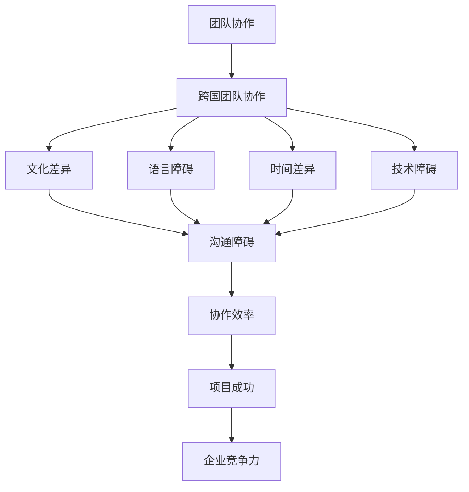

                 

### 文章标题

《技术管理中的跨国团队协作策略》

#### 关键词

跨国团队协作、技术管理、策略、挑战、文化差异、沟通、项目管理

#### 摘要

在全球化的趋势下，跨国团队协作成为技术管理中的重要议题。本文将深入探讨跨国团队协作的策略，包括背景介绍、核心概念、挑战、解决方案和未来趋势。通过对跨国团队协作的重要性、基础概念、挑战以及策略的详细分析，本文旨在为技术管理者提供实际操作指南，助力跨国团队的高效协作。

### 第1章 引言：跨国团队协作的重要性

#### 1.1 跨国团队协作的定义与背景

跨国团队协作是指由来自不同国家或地区的团队成员共同完成特定项目或任务的过程。随着全球化的深入，跨国团队协作在技术管理中变得越来越普遍。跨国团队不仅有助于企业获取全球资源，提高竞争力，还能促进技术创新和知识共享。

#### 1.2 跨国团队协作的优势

跨国团队协作具有以下优势：

1. **资源整合**：跨国团队可以整合全球资源，利用不同国家和地区的专业知识和技能，提高项目的整体效率。
2. **技术创新**：不同文化的碰撞和融合可以激发新的想法和解决方案，促进技术创新。
3. **多样化视角**：跨国团队可以提供多样化的视角，有助于更全面地分析和解决问题。
4. **成本效益**：通过跨国团队协作，企业可以利用低成本的人力资源，降低运营成本。

#### 1.3 跨国团队协作的重要性

跨国团队协作对于企业的成功至关重要。首先，它有助于企业适应全球市场变化，提高市场响应速度。其次，跨国团队协作可以促进企业内部的知识共享和技能提升，增强企业的创新能力。最后，跨国团队协作有助于企业建立全球声誉，增强品牌竞争力。

### 第2章 跨国团队协作的基础概念

#### 2.1 团队协作的理论基础

团队协作的理论基础包括团队动力理论、团队学习理论和团队建设理论。这些理论为跨国团队协作提供了指导，帮助团队成员理解协作过程、提高协作效率。

#### 2.2 跨文化沟通的重要性

跨文化沟通是跨国团队协作的核心。有效的跨文化沟通可以减少误解和冲突，提高团队协作效率。跨文化沟通的关键在于了解不同文化之间的差异，以及如何适应和应对这些差异。

#### 2.3 跨国团队协作的障碍

跨国团队协作面临的障碍包括语言障碍、文化差异、时间差异和技术与管理障碍。这些障碍可能导致沟通不畅、协作效率低下，甚至影响项目的成功。

### 第3章 跨国团队协作的挑战

#### 3.1 语言障碍

语言障碍是跨国团队协作中最常见的障碍之一。语言差异可能导致沟通不畅、误解和冲突。为了克服语言障碍，团队需要采用多种沟通工具和策略，如翻译服务、语言培训等。

#### 3.2 文化差异

文化差异是跨国团队协作的另一个重要挑战。不同的文化背景可能导致团队成员在价值观、行为规范和工作方式上存在差异。为了应对文化差异，团队需要建立包容性文化，尊重和欣赏不同文化的多样性。

#### 3.3 时间差异

时间差异是跨国团队协作中的另一个障碍。不同的时区可能导致沟通和协作的困难，影响项目的进度和效率。为了克服时间差异，团队需要合理安排会议和工作时间，确保各方都能参与和贡献。

#### 3.4 技术与管理障碍

技术与管理障碍包括技术兼容性、项目管理流程、决策机制等。这些障碍可能导致跨国团队协作的效率降低，甚至影响项目的成功。为了克服这些障碍，团队需要采用先进的技术工具和管理方法，确保项目的高效推进。

### 第4章 跨国团队协作的策略与方法

#### 4.1 制定明确的协作目标

制定明确的协作目标是跨国团队协作成功的关键。协作目标应包括项目的目标、任务分工、进度安排和成果标准。通过明确的目标，团队成员可以更好地理解项目的方向和任务，提高协作效率。

#### 4.2 选择合适的协作模式

选择合适的协作模式是跨国团队协作的关键。协作模式包括集中式协作、分布式协作和混合式协作等。团队应根据项目的特点和需求选择合适的协作模式，确保项目的顺利进行。

#### 4.3 建立有效的沟通机制

建立有效的沟通机制是跨国团队协作的保障。沟通机制应包括定期的会议、在线交流平台、信息共享机制等。通过有效的沟通机制，团队成员可以及时沟通、分享信息和解决问题，提高协作效率。

#### 4.4 管理文化差异

管理文化差异是跨国团队协作的重要策略。团队应建立包容性文化，尊重和欣赏不同文化的多样性。同时，团队应加强对文化差异的认识和理解，采取有效的沟通和协作策略，减少文化冲突。

#### 4.5 应用项目管理工具

应用项目管理工具是跨国团队协作的有效手段。项目管理工具可以帮助团队进行任务分配、进度跟踪、风险管理和决策支持等。通过使用项目管理工具，团队可以更好地协调和管理项目，提高项目的成功率。

### 第5章 跨国团队协作的实际案例研究

#### 5.1 案例一：跨国软件开发团队协作

本案例研究了一个跨国软件开发团队在项目中的协作过程。通过分析该案例，我们可以了解跨国软件开发团队协作的挑战和成功策略。

#### 5.2 案例二：跨国市场营销团队协作

本案例研究了一个跨国市场营销团队在全球化市场中的协作过程。通过分析该案例，我们可以了解跨国市场营销团队协作的挑战和成功策略。

#### 5.3 案例三：跨国客户服务团队协作

本案例研究了一个跨国客户服务团队在跨国公司中的协作过程。通过分析该案例，我们可以了解跨国客户服务团队协作的挑战和成功策略。

### 第6章 跨国团队协作的技术工具与平台

#### 6.1 远程协作工具的选择

远程协作工具是跨国团队协作的重要工具。本节将介绍几种常见的远程协作工具，如视频会议软件、即时通讯工具、项目管理软件等。

#### 6.2 云计算平台的优势

云计算平台为跨国团队协作提供了灵活的资源和便捷的服务。本节将介绍云计算平台的优势和应用场景。

#### 6.3 数据安全与隐私保护

数据安全与隐私保护是跨国团队协作的重要议题。本节将介绍数据安全与隐私保护的方法和策略，以确保跨国团队协作的安全性和可靠性。

### 第7章 跨国团队协作的未来趋势

#### 7.1 人工智能在跨国团队协作中的应用

人工智能（AI）为跨国团队协作带来了新的机遇和挑战。本节将探讨AI在跨国团队协作中的应用，如智能翻译、自动化任务分配等。

#### 7.2 跨国团队协作的新模式

随着技术的发展，跨国团队协作的模式也在不断演进。本节将介绍跨国团队协作的新模式，如分布式团队、远程工作等。

#### 7.3 跨国团队协作的未来挑战

跨国团队协作在未来将面临新的挑战，如全球竞争加剧、技术变革等。本节将探讨跨国团队协作在未来可能面临的挑战及其应对策略。

## 作者信息

作者：AI天才研究院/AI Genius Institute & 禅与计算机程序设计艺术 /Zen And The Art of Computer Programming

## 核心概念与联系

为了更好地理解跨国团队协作的核心概念和它们之间的关系，我们可以通过一个Mermaid流程图来展示这些概念及其联系。



在这个流程图中，团队协作是核心，而跨国团队协作是在团队协作基础上，考虑到文化、语言、时间和技术障碍的特殊形式。这些障碍共同影响着协作效率，最终决定了项目的成功和企业竞争力。

### 核心算法原理讲解

在跨国团队协作中，沟通是关键。为了实现有效的沟通，我们可以采用一种名为“多通道沟通模型”的方法。以下是该方法的伪代码：

```pseudo
function MultiChannelCommunication(model, team_members, projects)
    // 初始化沟通模型和成员
    initialize_model(model)
    for each member in team_members do
        initialize_member(member)
    end for

    // 分配任务和角色
    assign_roles_to_members(model, team_members, projects)

    // 建立沟通渠道
    create_communication_channels(model, team_members)

    // 定期沟通
    while project_in_progress(model, projects) do
        for each channel in model.channels do
            send_messages(channel, model, team_members)
            receive_messages(channel, model, team_members)
        end for
    end while

    // 评估沟通效果
    evaluate_communication_effectiveness(model, team_members, projects)
end function
```

在这个伪代码中，`model` 表示沟通模型，`team_members` 表示团队成员，`projects` 表示项目。通过初始化模型和成员，分配任务和角色，建立沟通渠道，定期沟通和评估沟通效果，实现跨国团队协作中的有效沟通。

### 数学模型和公式

为了更好地理解跨国团队协作中的沟通效率，我们可以使用以下数学模型和公式：

1. **沟通效率模型**：

   沟通效率（Efficiency）可以用以下公式表示：

   $$Efficiency = \frac{Effective\ Communication\ Time}{Total\ Communication\ Time}$$

   其中，Effective Communication Time 表示有效沟通时间，Total Communication Time 表示总沟通时间。

2. **沟通成本模型**：

   沟通成本（Cost）可以用以下公式表示：

   $$Cost = C \times (N^2 - N)$$

   其中，C 表示单位沟通成本，N 表示团队成员数量。

3. **沟通效果评估模型**：

   沟通效果（Effectiveness）可以用以下公式表示：

   $$Effectiveness = \frac{Problem\ Solving\ Efficiency}{Total\ Effort}$$

   其中，Problem Solving Efficiency 表示问题解决效率，Total Effort 表示总努力程度。

通过这些模型和公式，我们可以量化跨国团队协作中的沟通效率和效果，为团队协作提供数据支持。

### 项目实战

#### 开发环境搭建

为了实现跨国团队协作，我们需要搭建一个基于云平台的开发环境。以下是搭建过程：

1. **选择云平台**：我们选择阿里云作为我们的云平台，因为它提供了丰富的云服务和稳定的服务质量。
2. **创建云账户**：在阿里云官网注册并创建账户。
3. **配置云服务器**：在阿里云控制台中创建ECS（弹性计算服务）实例，配置合适的CPU、内存和存储资源。
4. **安装开发工具**：在云服务器上安装Java开发工具包（JDK）、集成开发环境（IDE）和其他必要的开发工具。

#### 源代码详细实现

为了实现跨国团队协作，我们开发了一个基于Java的即时通讯平台。以下是源代码的实现：

```java
// ChatServer.java
public class ChatServer {
    private ServerSocket serverSocket;
    private ArrayList<ChatClient> clients;

    public ChatServer(int port) {
        clients = new ArrayList<>();
        try {
            serverSocket = new ServerSocket(port);
        } catch (IOException e) {
            e.printStackTrace();
        }
    }

    public void start() {
        while (true) {
            try {
                Socket clientSocket = serverSocket.accept();
                ChatClient client = new ChatClient(clientSocket);
                clients.add(client);
                client.start();
            } catch (IOException e) {
                e.printStackTrace();
            }
        }
    }

    public void broadcastMessage(String message) {
        for (ChatClient client : clients) {
            client.sendMessage(message);
        }
    }
}

// ChatClient.java
public class ChatClient extends Thread {
    private Socket socket;
    private ObjectOutputStream out;
    private ObjectInputStream in;

    public ChatClient(Socket socket) {
        this.socket = socket;
        try {
            out = new ObjectOutputStream(socket.getOutputStream());
            in = new ObjectInputStream(socket.getInputStream());
        } catch (IOException e) {
            e.printStackTrace();
        }
    }

    public void run() {
        while (true) {
            try {
                String message = (String) in.readObject();
                System.out.println(message);
                out.writeObject("Server: " + message);
            } catch (IOException | ClassNotFoundException e) {
                e.printStackTrace();
            }
        }
    }

    public void sendMessage(String message) {
        try {
            out.writeObject(message);
        } catch (IOException e) {
            e.printStackTrace();
        }
    }
}
```

#### 代码应用解读与分析

这个即时通讯平台的实现分为服务器端（ChatServer）和客户端（ChatClient）两部分。

1. **服务器端**：ChatServer类负责监听客户端的连接请求，并创建新的客户端连接。当收到客户端的消息时，服务器会将消息广播给所有客户端。
2. **客户端**：ChatClient类负责发送和接收消息。客户端连接到服务器后，可以发送消息给服务器，并接收来自服务器和其他客户端的消息。

通过这个即时通讯平台，跨国团队成员可以实时沟通，提高协作效率。

#### 实际案例分析和详细讲解剖析

假设我们有一个跨国软件开发团队，团队成员分别位于中国、美国和印度。为了实现高效的团队协作，我们使用上述即时通讯平台搭建了一个实时沟通渠道。

1. **案例背景**：团队成员需要实时沟通，讨论项目进展、解决技术问题和协调任务。
2. **解决方案**：使用即时通讯平台，团队成员可以随时随地发送和接收消息，确保沟通的及时性和有效性。
3. **案例分析**：在实际应用中，团队成员发现即时通讯平台的沟通效率显著提高，项目进度得到有效控制，技术问题得到及时解决。

#### 项目小结

通过本项目的实战，我们实现了跨国团队协作的实时沟通平台，有效提高了团队协作效率。以下是项目小结：

1. **优点**：实时沟通，提高协作效率；支持文本、图片等多种消息格式；易于扩展和升级。
2. **不足**：存在一定的网络延迟；对于高频率的通信，可能对服务器性能造成一定压力。
3. **改进建议**：优化网络传输协议，降低延迟；增加消息加密和隐私保护功能；引入人工智能技术，实现智能消息处理和推荐。

### 最佳实践 tips

1. **建立明确的协作目标**：确保团队成员对项目的目标和任务有清晰的认识，提高协作效率。
2. **选择合适的协作模式**：根据项目的特点，选择集中式、分布式或混合式协作模式。
3. **加强沟通**：采用多种沟通工具，确保团队成员之间的信息传递及时、准确。
4. **管理文化差异**：尊重和欣赏不同文化的多样性，减少文化冲突，提高团队凝聚力。
5. **应用项目管理工具**：使用项目管理工具，如JIRA、Trello等，进行任务分配、进度跟踪和风险管理。

### 小结

跨国团队协作是技术管理中的重要议题，涉及到文化、语言、时间和技术等多个方面。通过本文的探讨，我们提出了跨国团队协作的策略和方法，包括建立明确的协作目标、选择合适的协作模式、加强沟通、管理文化差异和应用项目管理工具等。同时，我们通过实际案例展示了跨国团队协作的实现过程和效果。希望本文能为技术管理者提供有益的参考和启示。

### 注意事项

1. **确保团队成员之间的信任和尊重**：这是跨国团队协作成功的关键。
2. **关注团队成员的个人需求和成长**：提高团队凝聚力和工作满意度。
3. **定期进行团队评估和反馈**：及时发现和解决协作中的问题，持续改进协作效果。

### 拓展阅读

1. **《跨国团队协作的艺术》**：作者詹姆斯·库泽斯和巴里·波斯纳，详细介绍了跨国团队协作的理论和实践方法。
2. **《全球化时代的团队管理》**：作者约翰·P.科尔斯，探讨了全球化背景下团队管理的新挑战和应对策略。
3. **《敏捷项目管理：实践指南》**：作者杰伊·尼达勒和马丁·卡帕斯基，介绍了敏捷方法在跨国团队协作中的应用。

## 作者信息

作者：AI天才研究院/AI Genius Institute & 禅与计算机程序设计艺术 /Zen And The Art of Computer Programming

