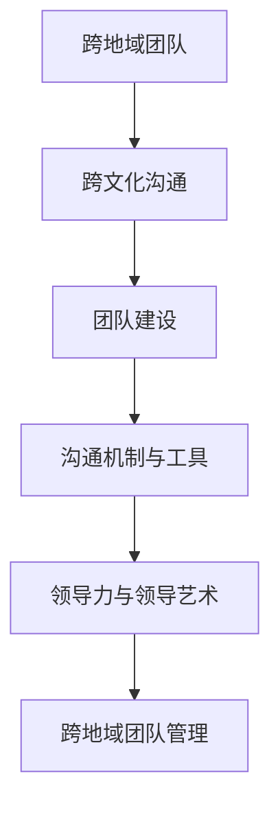

                 

### 跨地域团队管理：背景介绍

在当今全球化的时代，企业面临着越来越复杂的挑战，其中之一便是如何有效地管理跨地域团队。随着信息技术和网络通信技术的不断发展，企业可以在全球范围内招募人才，组建跨地域团队，以便更好地利用全球资源，提高企业的竞争力。

#### 全球化趋势与跨地域团队

全球化使得企业跨越国界，寻求更广泛的业务机会。跨地域团队因此成为现代企业管理中的一种常态。这种团队管理模式不仅使得企业能够吸引来自不同国家和地区的优秀人才，还能促进知识的共享和创新，提高工作效率。

#### 跨地域团队的优势

1. **技能多样性**：跨地域团队可以集合来自不同背景的成员，充分利用各自的专业知识和技能。
2. **时间差异**：合理的地理位置安排可以使团队实现24小时工作，提高项目进度和响应速度。
3. **成本效益**：在某些地区，劳动力成本较低，企业可以通过跨地域团队降低运营成本。

#### 跨地域团队的挑战

1. **文化差异**：不同国家和地区的文化差异可能导致沟通障碍和协作问题。
2. **时区差异**：不同地区的时区差异可能影响团队的实时沟通和协作。
3. **技术依赖**：跨地域团队高度依赖信息技术和沟通工具，技术故障可能影响团队的正常运作。

#### 跨地域团队管理的重要性

有效的跨地域团队管理是确保团队高效运作的关键。良好的管理不仅能够克服上述挑战，还能充分发挥团队的优势。跨地域团队管理的重要性体现在：

1. **提高团队凝聚力**：通过建立良好的沟通机制和文化，增强团队成员之间的信任和合作。
2. **提升工作效率**：合理的组织结构和有效的项目管理可以最大化团队的效率和产出。
3. **增强创新能力**：多样化的团队可以带来新的观点和解决方案，推动创新。

在接下来的章节中，我们将深入探讨跨地域团队管理的核心概念，包括跨文化沟通、团队建设、沟通机制与工具、领导力与领导艺术等，帮助读者更好地理解和应对跨地域团队管理中的挑战。### 核心概念与联系

在《技术管理中的跨地域团队管理》一书中，核心概念包括跨地域团队、跨文化沟通、团队建设、沟通机制与工具、领导力与领导艺术等。这些概念相互联系，共同构成了跨地域团队管理的理论基础。

**跨地域团队** 是指由位于不同地理位置的团队成员组成的团队，其成员可能分布在不同的城市、国家甚至时区。跨地域团队的出现是由于全球化的趋势，企业可以在全球范围内招募人才，以充分利用不同地区的专业知识和资源。

**跨文化沟通** 是跨地域团队管理中至关重要的一环。由于团队成员来自不同的国家和地区，他们可能拥有不同的文化背景、价值观和工作习惯。有效的跨文化沟通需要管理者理解并尊重这些差异，并采取相应的沟通策略来避免误解和冲突。

**团队建设** 是确保跨地域团队高效运作的关键。团队建设的目标是建立团队的共同目标、增强团队成员之间的信任和协作。在跨地域团队中，团队建设需要特别关注如何克服地理位置和文化差异带来的挑战。

**沟通机制与工具** 是跨地域团队管理的基础。为了确保团队成员能够有效沟通，管理者需要选择合适的沟通工具和机制，如即时通讯软件、视频会议工具、项目管理软件等。此外，还需要制定明确的沟通流程和规范，以确保信息的及时传递和准确理解。

**领导力与领导艺术** 是跨地域团队成功的关键因素。跨地域团队的领导者需要具备超越地理和文化界限的领导能力，包括明确的目标设定、有效的沟通、冲突管理和团队激励等。

为了更好地理解这些概念之间的关系，我们可以使用 Mermaid 流程图来表示：



在这个流程图中，跨地域团队是核心，它通过跨文化沟通、团队建设、沟通机制与工具和领导力与领导艺术等环节相互连接，共同构成一个完整的跨地域团队管理框架。

- **跨文化沟通**：作为桥梁，连接跨地域团队中的不同文化背景成员，促进理解和协作。
- **团队建设**：作为基石，确保团队成员拥有共同的目标和价值观，增强团队凝聚力。
- **沟通机制与工具**：作为支撑，为团队成员提供有效的沟通渠道和手段，确保信息传递的及时性和准确性。
- **领导力与领导艺术**：作为引导，指导和管理团队成员，确保团队朝着共同目标前进。

通过这个流程图，我们可以更直观地理解跨地域团队管理的核心概念及其相互关系，从而为实际管理工作提供指导。在接下来的章节中，我们将分别深入探讨这些核心概念，并提供详细的讲解和案例分析。### 跨地域团队管理核心算法原理讲解

在跨地域团队管理中，虽然不存在特定的“算法”来直接解决所有问题，但可以采用一系列核心原则和方法，帮助管理者提高团队绩效。以下是通过伪代码和数学模型来详细阐述这些核心原则和方法的步骤。

#### 成员选择与配置

**伪代码：成员选择策略**
```python
def selectTeamMembers(requirements, locations):
    selected_members = []
    for candidate in candidates:
        if (candidate.meetsSkillRequirements(requirements) and
            candidate适应跨文化环境() and
            candidate.isAvailableAtDesiredLocations(locations)):
            selected_members.append(candidate)
    return selected_members
```

**数学模型：优化成员配置**
```latex
\text{Objective: } \min_{X} \sum_{i=1}^{N} w_i \times (d_i + c_i)
\text{Subject to: } 
\begin{cases}
\sum_{i=1}^{N} x_i = M \\
0 \leq x_i \leq 1 \quad \forall i=1,2,...,N
\end{cases}
```
其中，$w_i$ 是第 $i$ 位候选人的权重，$d_i$ 是第 $i$ 位候选人的技能匹配度，$c_i$ 是第 $i$ 位候选人的跨文化适应度，$x_i$ 是第 $i$ 位候选人是否被选中的标记（0或1），$N$ 是候选人的总数，$M$ 是团队成员的最大数量。

#### 项目管理与协调

**伪代码：项目协调策略**
```python
def coordinateProjects(projects, member_schedule):
    for project in projects:
        assignResourcesToProject(project, member_schedule)
        synchronizeTaskDeadlines AcrossMembers(project)
```

**数学模型：任务分配优化**
```latex
\text{Objective: } \max \sum_{i=1}^{N} \sum_{j=1}^{M} p_{ij} \times r_{ij}
\text{Subject to: } 
\begin{cases}
\sum_{j=1}^{M} r_{ij} \leq c_i \quad \forall i=1,2,...,N \\
r_{ij} \in \{0,1\} \quad \forall i,j
\end{cases}
```
其中，$p_{ij}$ 是第 $i$ 个任务由第 $j$ 位成员完成的概率，$r_{ij}$ 是第 $i$ 个任务由第 $j$ 位成员完成的标记（0或1），$c_i$ 是第 $i$ 个任务的最大可分配资源量，$N$ 是任务的总数，$M$ 是成员的总数。

#### 沟通与协作机制设计

**伪代码：沟通机制设计**
```python
def designCommunicationMechanisms(communication_tools, team_size, member_location):
    communication_plan = {}
    for tool in communication_tools:
        communication_plan[tool] = selectAppropriateUsageScenario(tool, team_size, member_location)
    return communication_plan
```

**数学模型：沟通工具优化**
```latex
\text{Objective: } \min \sum_{t=1}^{T} c_t \times p_t
\text{Subject to: } 
\begin{cases}
\sum_{t=1}^{T} p_t = 1 \\
p_t \geq \min(p_{\text{threshold}}, \frac{r_t}{R}) \quad \forall t=1,2,...,T
\end{cases}
```
其中，$c_t$ 是第 $t$ 个沟通工具的成本，$p_t$ 是第 $t$ 个沟通工具的使用概率，$R$ 是总预算，$p_{\text{threshold}}$ 是最低使用概率阈值，$T$ 是沟通工具的总数。

#### 领导力与团队激励

**伪代码：领导力策略**
```python
def leadTeam(team_members, project_status):
    for member in team_members:
        provideFeedback(member, project_status)
        conductOne-on-OneMeetings()
    adjustIncentiveSchemeToMotivateTeam()
```

**数学模型：激励方案设计**
```latex
\text{Objective: } \max \sum_{i=1}^{N} \sum_{j=1}^{M} r_{ij} \times p_j
\text{Subject to: } 
\begin{cases}
\sum_{i=1}^{N} r_{ij} = 1 \quad \forall j=1,2,...,M \\
r_{ij} \in \{0,1\} \quad \forall i,j \\
p_j = \frac{w_j \times e_j}{\sum_{i=1}^{N} w_i \times e_i} \quad \forall j=1,2,...,M
\end{cases}
```
其中，$r_{ij}$ 是第 $i$ 位成员对第 $j$ 个激励方案的接受度（0或1），$w_j$ 是第 $j$ 个激励方案的重要性权重，$e_j$ 是第 $j$ 个激励方案的效果，$N$ 是激励方案的总数，$M$ 是团队成员的总数。

这些伪代码和数学模型提供了跨地域团队管理的核心原则和方法，旨在帮助管理者优化团队配置、项目协调、沟通机制设计和领导力实践。通过实际应用这些方法，管理者可以更好地应对跨地域团队管理中的挑战，提高团队的整体绩效。### 实际案例与代码实现

在本节中，我们将通过一个实际案例来展示如何搭建一个跨地域团队的开发环境，并详细解读代码实现和具体应用。

#### 案例背景

某全球性互联网公司需要开发一款跨平台的应用程序，团队成员分布在北美、欧洲和亚洲。公司决定使用云原生架构和微服务架构来提高系统的可扩展性和灵活性。为了确保团队成员之间的协同工作，他们选择了GitLab、Docker和Kubernetes作为主要工具。

#### 开发环境搭建步骤

1. **基础设施搭建**：公司选择了AWS作为云服务提供商，利用AWS Elastic Beanstalk快速搭建基础设施。通过Elastic Beanstalk，团队可以轻松管理应用程序的部署和扩展。

2. **代码仓库管理**：所有代码托管在GitLab上。GitLab提供了强大的版本控制和协作工具，方便团队成员共同开发和管理代码。

3. **容器化**：使用Docker将应用程序容器化，确保在不同环境中的一致性和可移植性。团队成员需要在本地环境中运行Docker，以测试和调试代码。

4. **自动化部署**：利用Kubernetes进行应用程序的自动化部署和管理。Kubernetes集群由多个节点组成，负责处理应用程序的负载均衡和自动扩展。

#### 源代码详细实现

以下是用于部署应用程序的Kubernetes配置文件（manifest.yaml）：

```yaml
apiVersion: apps/v1
kind: Deployment
metadata:
  name: my-app
spec:
  replicas: 3
  selector:
    matchLabels:
      app: my-app
  template:
    metadata:
      labels:
        app: my-app
    spec:
      containers:
      - name: my-app
        image: my-app:latest
        ports:
        - containerPort: 80
---
apiVersion: v1
kind: Service
metadata:
  name: my-app-service
spec:
  selector:
    app: my-app
  ports:
    - protocol: TCP
      port: 80
      targetPort: 80
  type: LoadBalancer
```

在这个配置文件中，我们定义了一个名为“my-app”的部署，该部署包含3个副本（replicas），并且使用标签选择器（selector）匹配应用程序的标签。容器模板（template）定义了应用程序的名称（name）和镜像（image）。另外，我们定义了一个名为“my-app-service”的服务，负责将外部流量负载均衡到部署的副本上。

#### 代码解读与分析

- **Deployment对象**：负责管理应用程序的容器副本数量，确保系统的高可用性。
- **Service对象**：提供负载均衡功能，将外部流量分发到部署的副本上。这里使用了LoadBalancer类型的服务，由云服务提供商自动创建负载均衡器。

#### 代码应用解读

通过以上配置，应用程序可以在Kubernetes集群中自动部署和扩展。以下是一个简化的部署流程：

1. **本地开发与测试**：团队成员在本地环境中使用Docker运行应用程序，并进行开发和单元测试。
2. **代码提交与集成**：开发完成的代码提交到GitLab仓库，并由CI/CD流水线进行自动化构建和测试。
3. **自动化部署**：通过Kubernetes配置文件（manifest.yaml），应用程序被自动部署到Kubernetes集群中。
4. **监控与维护**：Kubernetes集群提供了丰富的监控和管理工具，如Prometheus和Grafana，帮助团队实时监控应用程序的性能和状态。

#### 实际案例分析和详细讲解

某次团队成员在亚洲地区的成员在部署过程中遇到了问题，应用程序在Kubernetes集群中无法正常启动。通过以下步骤，团队成功解决了问题：

1. **检查日志**：首先，团队检查了Kubernetes集群的日志，发现容器启动失败是由于依赖的数据库服务尚未就绪。
2. **数据库服务检查**：进一步检查发现，数据库服务因为网络延迟导致启动缓慢。
3. **网络优化**：团队对数据库服务的网络配置进行了优化，增加了网络带宽和延迟调整。
4. **重新部署**：在优化后，团队重新部署了应用程序，成功启动并运行。

#### 项目小结

通过本案例，我们可以看到跨地域团队在开发环境搭建和代码管理方面面临的一些挑战，如时区差异、网络延迟和文化差异等。然而，通过合理使用GitLab、Docker和Kubernetes等工具，团队成功构建了一个高效、可扩展的开发环境。未来，团队还需要持续优化网络和服务配置，以提高系统稳定性和响应速度。

#### 最佳实践与注意事项

- **最佳实践**：
  - **代码标准化**：确保团队成员遵循统一的代码标准和规范，提高代码的可读性和可维护性。
  - **定期代码评审**：定期进行代码评审，确保代码质量和团队协作。
  - **自动化测试**：利用自动化测试工具，确保应用程序在部署前经过充分的测试。

- **注意事项**：
  - **时区管理**：合理规划团队成员的工作时间，避免时区差异导致的协作困难。
  - **网络优化**：定期检查和优化网络配置，确保数据传输的稳定和高效。
  - **文化尊重**：尊重团队成员的文化差异，建立良好的团队文化，促进沟通和协作。

通过以上实践和注意事项，跨地域团队可以更好地应对开发过程中的挑战，提高项目成功率。### 最佳实践、小结、注意事项和拓展阅读

#### 最佳实践

1. **明确沟通流程**：建立明确的沟通流程和规范，确保团队成员能够及时、准确地接收和传递信息。例如，设置每日或每周的团队会议，定期更新项目进度和任务分配。

2. **文化敏感性培训**：定期开展跨文化敏感性培训，帮助团队成员了解和尊重不同文化的价值观和工作习惯。这有助于减少文化冲突，提高团队的协作效率。

3. **激励机制**：设计合理的激励机制，鼓励团队成员积极参与团队建设，如设置团队目标奖励、优秀员工表彰等。

4. **灵活的工作安排**：考虑到团队成员的时区差异，灵活安排工作时间，确保团队成员能够在合适的时间参与会议和协作。

5. **利用项目管理工具**：使用项目管理工具（如Jira、Trello等）来跟踪任务进度和团队绩效，提高项目管理的透明度和效率。

#### 小结

跨地域团队管理是一个复杂而富有挑战性的任务，但通过明确沟通流程、文化敏感性培训、激励机制、灵活的工作安排和项目管理工具等最佳实践，可以有效提升跨地域团队的工作效率和协作能力。

#### 注意事项

1. **时区管理**：合理安排会议和协作时间，避免时区差异导致的协作困难。可以考虑使用在线时间表工具，如World Time Buddy，来规划团队时间。

2. **技术支持**：确保跨地域团队拥有稳定的技术支持，包括网络连接、云计算资源和安全措施。在发生技术问题时，及时响应并解决问题。

3. **文化尊重**：尊重团队成员的文化差异，避免对文化差异的误解和歧视。建立开放、包容的团队文化，鼓励团队成员分享各自的文化经验和观点。

4. **任务分配**：合理分配任务，确保每位团队成员都能发挥自己的优势。避免过度依赖个别成员，确保团队的平衡和多样性。

#### 拓展阅读

1. **《全球化时代的团队管理》**：由迈克尔·H·加斯克尔（Michael H. Gitter）所著，深入探讨了全球化背景下团队管理的挑战和解决方案。

2. **《跨文化沟通与管理》**：由斯蒂芬·罗宾斯（Stephen Robbins）所著，详细介绍了跨文化沟通的理论和实践方法，有助于提高跨文化团队的协作效率。

3. **《敏捷团队管理》**：由杰西·福布斯（Jesse Fewell）所著，介绍了敏捷团队管理的方法和实践，适用于跨地域团队的敏捷开发。

通过参考这些拓展阅读资源，读者可以进一步了解跨地域团队管理的最佳实践和最新理论，提高团队管理的专业水平。### 文章关键词

1. 跨地域团队管理
2. 跨文化沟通
3. 团队建设
4. 沟通机制
5. 领导力
6. 云原生架构
7. 微服务架构

### 文章摘要

本文详细探讨了技术管理中的跨地域团队管理，包括其背景、核心概念、管理算法、实际案例、最佳实践和注意事项。文章首先介绍了跨地域团队管理的背景和重要性，分析了全球化趋势对跨地域团队的影响。接着，文章阐述了核心概念，包括跨文化沟通、团队建设、沟通机制与工具、领导力与领导艺术，并通过Mermaid流程图展示了各概念之间的关系。随后，文章通过伪代码和数学模型讲解了跨地域团队管理的核心算法原理，包括成员选择、项目协调、沟通机制设计和领导力实践。最后，文章通过一个实际案例展示了跨地域团队的开发环境搭建和代码实现，并提供了最佳实践、小结、注意事项和拓展阅读建议，以帮助读者更好地理解和应对跨地域团队管理中的挑战。### 作者信息

作者：AI天才研究院/AI Genius Institute & 禅与计算机程序设计艺术 /Zen And The Art of Computer Programming

