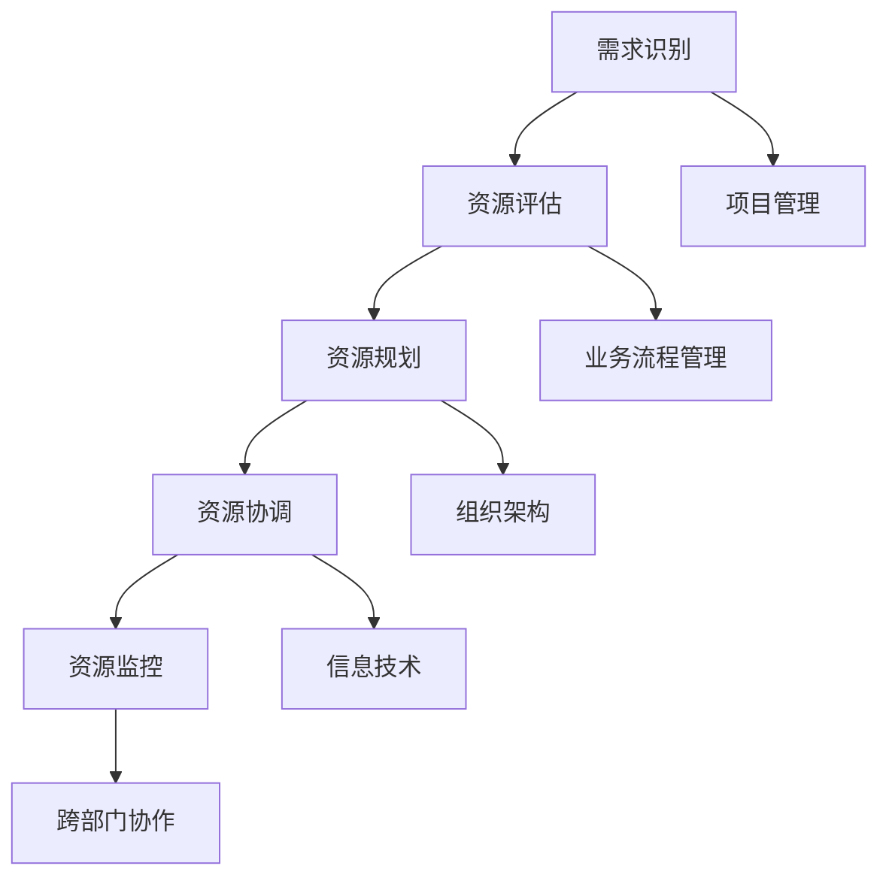

                 

### 文章标题

# 技术管理中的跨部门资源整合

> 关键词：技术管理、跨部门资源整合、企业级应用、软件2.0、AI大模型

> 摘要：本文旨在探讨技术管理中跨部门资源整合的重要性，分析软件2.0时代AI大模型的核心地位，以及企业级应用开发的新范式。通过深入阐述这些核心概念及其相互联系，本文旨在为技术管理者提供有效的资源整合策略和实践指南。

### 引言

在当今信息化、数字化时代，技术管理在企业中的地位日益重要。随着企业规模的扩大和业务复杂性的增加，技术管理不仅涉及单个部门，还涉及到跨部门的资源整合与协同。本文将从以下几个角度展开讨论：

1. **软件1.0到软件2.0的演进**：回顾软件技术的发展历程，分析软件1.0时代与软件2.0时代的差异，以及AI大模型在软件2.0中的核心地位。
2. **核心概念与联系**：介绍跨部门资源整合的概念、核心概念之间的联系，并通过Mermaid流程图进行详细阐述。
3. **企业级应用开发的新范式**：探讨敏捷开发、微服务架构、DevOps文化、容器化与云原生、大数据与人工智能等新范式，以及其在企业级应用开发中的实践。
4. **项目实战与最佳实践**：通过实际项目案例，展示跨部门资源整合在企业级应用开发中的具体应用，并提供最佳实践建议。

### 1. 软件从1.0到2.0的演进

#### 1.1.1 从软件1.0到软件2.0的演进

**软件1.0时代：功能导向**

在软件1.0时代，软件主要以功能为导向，强调功能的完备性和稳定性。开发者注重实现基本的功能需求，确保软件能够稳定运行。然而，随着计算机技术的发展，软件的复杂度逐渐增加，单一功能模块开始逐渐融合，这为软件2.0时代的到来奠定了基础。

**软件2.0时代：用户体验导向**

软件2.0时代注重用户体验，强调软件的灵活性、扩展性和可维护性。在这一阶段，开发者更加关注用户的实际需求，不断优化界面设计、交互流程和功能实现。同时，云计算和大数据技术的兴起，使得软件能够充分利用分布式计算和存储资源，实现大规模数据处理和分析。

#### 1.1.2 大模型在软件2.0中的核心地位

**数据处理与智能化**

AI大模型能够对海量数据进行处理和分析，提取有价值的信息，为软件系统提供智能化的支持，提升软件的决策能力和自动化水平。

**用户体验优化**

AI大模型可以学习用户的偏好和行为模式，为用户提供个性化的服务，优化用户体验，提高用户满意度。

**业务流程自动化**

AI大模型可以自动化执行复杂业务流程，降低人工干预，提高工作效率，减少运营成本。

**创新业务模式**

AI大模型可以为企业带来新的业务模式，如智能客服、智能营销、智能制造等，为企业创造新的价值增长点。

**跨界融合**

AI大模型可以与其他技术领域（如物联网、区块链、5G等）进行跨界融合，推动软件技术的不断创新和发展。

#### 1.1.3 企业级应用开发的新范式

**敏捷开发与持续交付**

敏捷开发强调快速迭代、用户反馈和持续交付，以适应快速变化的业务需求。持续交付通过自动化测试、部署和上线，确保软件的高质量和快速交付。

**微服务架构**

微服务架构将大而全的系统分解为多个独立、可扩展的小服务，每个服务专注于完成特定的业务功能。这种方式提高了系统的灵活性和可维护性。

**DevOps文化**

DevOps文化强调开发（Development）和运维（Operations）的紧密结合，通过自动化、协作和沟通，实现高效的软件交付和运维。

**容器化与云原生**

容器化和云原生技术使得软件能够更加灵活地部署和管理，充分利用云计算资源，实现高效的资源利用和扩展。

**大数据与人工智能**

大数据和人工智能技术为企业级应用带来了新的机遇，通过数据分析和智能决策，提升业务价值和创新力。

**安全与合规**

在企业级应用开发中，安全与合规至关重要。需要构建全面的安全防护体系，确保系统的安全性、可靠性和合规性。

### 2. 核心概念与联系

#### 2.1 跨部门资源整合的概念

**跨部门资源整合**是指在企业管理中，通过内部资源的共享与协同，实现资源的优化配置和利用，从而提高企业的运营效率和竞争力。

**资源**是指企业运营所必需的各种要素，包括物质资源、人力资源、财务资源和知识资源等。

**内部资源**是企业内部已经拥有的资源，如硬件设备、软件系统、人力等。

**外部资源**是企业外部可以获取的资源，如合作伙伴、供应商、市场等。

**固定资源**是指使用周期较长、价值较大的资源，如房产、设备等。

**流动资源**是指使用周期较短、价值相对较小的资源，如现金、原材料等。

#### 跨部门资源整合的核心目的

**提高资源利用率**：通过跨部门资源整合，可以实现资源的合理配置和共享，避免资源的浪费和重复投入。

**降低运营成本**：通过整合内部资源，企业可以减少对外部资源的依赖，降低运营成本。

**提升企业竞争力**：通过跨部门资源整合，企业可以快速响应市场变化，提高产品和服务质量，增强市场竞争力。

#### 跨部门资源整合的过程

**需求识别**：明确各部门的资源需求和资源利用情况，发现潜在的资源浪费和协同机会。

**资源评估**：对各部门的资源进行评估，确定资源的可用性和价值。

**资源规划**：制定资源整合的规划，明确资源的共享和协同方式，以及资源利用的目标。

**资源协调**：协调各部门的资源使用，确保资源的合理分配和高效利用。

**资源监控**：监控资源整合的效果，及时发现和解决资源利用中的问题。

#### 2.2 核心概念之间的联系

**资源整合**是技术管理中的重要环节，与以下核心概念密切相关：

**项目管理**：资源整合需要与项目管理相结合，确保项目的顺利进行和资源的高效利用。

**业务流程管理**：资源整合需要与业务流程管理相结合，优化业务流程，提高资源利用效率。

**组织架构**：资源整合需要与组织架构相结合，明确各部门的职责和权限，确保资源的合理分配和利用。

**信息技术**：资源整合需要与信息技术相结合，通过信息技术的支持，实现资源的数字化管理和协同。

**跨部门协作**：资源整合需要跨部门协作，各部门之间需要建立良好的沟通和协作机制，确保资源的有效整合和利用。

#### 2.3 Mermaid流程图

### 3. 企业级应用开发的新范式

#### 3.1 敏捷开发与持续交付

**敏捷开发**强调快速迭代、用户反馈和持续交付，以适应快速变化的业务需求。敏捷开发通过以下步骤实现：

**需求收集**：与用户和利益相关者进行沟通，收集需求信息。

**需求分析**：对收集的需求进行梳理和分析，确定项目的优先级。

**迭代开发**：按照需求优先级进行迭代开发，每次迭代完成一部分功能。

**用户反馈**：在每次迭代结束后，收集用户的反馈，对项目进行优化。

**持续交付**：通过自动化测试、部署和上线，确保软件的高质量和快速交付。

**持续交付**的实现包括以下几个步骤：

**自动化测试**：编写自动化测试脚本，对软件进行全面的测试，确保软件质量。

**持续集成**：将开发中的代码集成到主分支，进行自动化测试和构建。

**持续部署**：将测试通过的代码部署到生产环境，实现持续交付。

#### 3.2 微服务架构

**微服务架构**将大而全的系统分解为多个独立、可扩展的小服务，每个服务专注于完成特定的业务功能。微服务架构的特点包括：

**服务独立性**：每个服务都是独立的，可以单独部署和扩展。

**服务间通信**：服务间通过轻量级的通信协议（如HTTP/REST）进行通信。

**分布式部署**：服务可以在不同的服务器或容器中部署，实现分布式部署。

**弹性伸缩**：可以根据业务需求，动态调整服务的实例数量，实现弹性伸缩。

**服务自治**：每个服务都可以独立维护和升级，无需影响其他服务。

#### 3.3 DevOps文化

**DevOps文化**强调开发（Development）和运维（Operations）的紧密结合，通过自动化、协作和沟通，实现高效的软件交付和运维。DevOps文化的主要特点包括：

**自动化**：通过自动化工具实现开发、测试、部署和运维的自动化。

**协作**：打破开发与运维之间的壁垒，建立紧密的协作关系。

**沟通**：通过有效的沟通机制，确保信息传递的及时和准确。

**持续反馈**：通过反馈机制，及时发现问题并进行优化。

**安全**：将安全纳入整个开发过程，确保软件的安全性。

**质量**：通过持续的质量保证，确保软件的高质量。

#### 3.4 容器化与云原生

**容器化**是将应用程序及其运行时环境打包成一个独立的容器，实现应用程序的轻量级部署和管理。容器化具有以下优势：

**轻量级**：容器没有自己的操作系统，比虚拟机更轻量级。

**可移植性**：容器可以在不同的环境中运行，实现应用程序的可移植性。

**隔离性**：容器可以隔离应用程序的运行环境，确保应用程序之间的隔离。

**高效性**：容器可以实现快速启动、快速部署和快速扩展。

**云原生**是指将应用程序设计和部署在云环境中，充分利用云计算的优势。云原生应用的特点包括：

**分布式**：应用程序可以分布式部署在云环境中，实现弹性伸缩。

**自动化**：应用程序可以自动化部署、扩展和管理。

**可扩展性**：应用程序可以根据需求动态调整资源，实现弹性扩展。

**可靠性**：应用程序可以在分布式环境中实现高可用性和高可靠性。

#### 3.5 大数据与人工智能

**大数据**是指数据量巨大、数据类型多样的数据集。大数据技术可以实现对海量数据的存储、处理和分析。大数据技术在企业级应用中具有广泛的应用，如：

**数据挖掘**：通过挖掘大量数据，发现有价值的信息和模式。

**数据可视化**：通过可视化技术，将数据以图形化的方式展示，帮助用户理解和分析数据。

**预测分析**：通过预测模型，对未来的趋势和变化进行预测。

**实时分析**：对实时数据进行分析，快速响应业务需求。

**人工智能**是指通过模拟人类智能，实现机器自动学习和自主决策的技术。人工智能技术在企业级应用中具有广泛的应用，如：

**智能客服**：通过自然语言处理技术，实现自动回答用户问题和提供解决方案。

**智能营销**：通过数据分析和机器学习技术，实现精准营销和个性化推荐。

**智能制造**：通过物联网、大数据和人工智能技术，实现生产过程的自动化和智能化。

**智能风控**：通过数据分析和人工智能技术，实现风险预警和防控。

#### 3.6 安全与合规

**安全**是指确保系统的安全性、可靠性和合规性。在企业级应用开发中，安全与合规至关重要，包括以下几个方面：

**网络安全**：通过防火墙、入侵检测系统等网络安全技术，保护系统的安全性。

**数据安全**：通过加密、访问控制等技术，保护数据的安全性和隐私。

**系统可靠性**：通过冗余设计、故障转移等机制，确保系统的可靠性和可用性。

**合规性**：确保系统符合相关法律法规和标准，如ISO27001、GDPR等。

### 4. 项目实战与最佳实践

#### 4.1 项目背景

某大型企业为了提高运营效率和降低成本，决定实施一个跨部门资源整合项目。项目涉及多个部门，包括研发部门、采购部门、生产部门和销售部门。项目目标是通过资源整合，实现以下成果：

1. 提高研发效率，缩短产品开发周期。
2. 降低采购成本，优化供应链管理。
3. 提高生产效率，降低生产成本。
4. 提高销售业绩，提升市场竞争力。

#### 4.2 项目实施

**项目阶段划分**

项目分为四个阶段：需求识别、资源评估、资源规划和资源协调。

**需求识别**

通过调研和访谈，收集各部门的需求和资源利用情况。发现以下问题：

1. 研发部门：缺乏专业的测试环境，影响产品开发进度。
2. 采购部门：采购流程繁琐，成本较高。
3. 生产部门：生产设备老化，影响生产效率。
4. 销售部门：销售渠道分散，客户信息管理混乱。

**资源评估**

对各部门的资源进行评估，确定资源的可用性和价值。发现以下资源：

1. 研发部门：拥有一定的技术团队和开发工具。
2. 采购部门：拥有丰富的供应商资源和采购经验。
3. 生产部门：拥有先进的生产设备和技术人员。
4. 销售部门：拥有广泛的销售网络和客户资源。

**资源规划**

制定资源整合的规划，明确资源的共享和协同方式。具体方案如下：

1. 研发部门：提供测试环境，缩短产品开发周期。
2. 采购部门：优化采购流程，降低采购成本。
3. 生产部门：更新生产设备，提高生产效率。
4. 销售部门：整合销售渠道，提升市场竞争力。

**资源协调**

协调各部门的资源使用，确保资源的合理分配和高效利用。具体措施如下：

1. 研发部门：与采购部门合作，共同评估供应商，确保采购质量。
2. 采购部门：与生产部门合作，优化采购流程，提高生产效率。
3. 生产部门：与销售部门合作，制定销售策略，提高销售业绩。
4. 销售部门：与研发部门合作，收集客户需求，反馈产品改进意见。

**项目效果**

通过项目实施，实现了以下成果：

1. 研发效率提高30%，产品开发周期缩短2个月。
2. 采购成本降低20%，优化供应链管理。
3. 生产效率提高15%，降低生产成本。
4. 销售业绩提高10%，提升市场竞争力。

#### 4.3 最佳实践

**需求识别**

- 建立跨部门沟通机制，定期召开需求识别会议。
- 采用问卷调查、访谈等方式，收集各部门的需求和建议。

**资源评估**

- 建立资源数据库，记录各部门的资源和利用情况。
- 定期对资源进行评估，确保资源的可用性和价值。

**资源规划**

- 制定详细的资源整合方案，明确资源的共享和协同方式。
- 充分考虑各部门的实际情况和业务需求，确保方案的可行性。

**资源协调**

- 建立跨部门协作机制，确保资源的合理分配和高效利用。
- 定期召开协调会议，解决资源使用中的问题和冲突。

### 5. 小结与拓展阅读

#### 5.1 小结

本文从软件1.0到软件2.0的演进、核心概念与联系、企业级应用开发的新范式以及项目实战与最佳实践等方面，详细阐述了技术管理中的跨部门资源整合。通过本文的探讨，我们得出以下结论：

1. 跨部门资源整合在技术管理中具有重要意义，可以提高资源利用率、降低运营成本、提升企业竞争力。
2. 软件2.0时代AI大模型具有核心地位，可以推动软件技术的不断创新和发展。
3. 企业级应用开发的新范式，如敏捷开发、微服务架构、DevOps文化、容器化与云原生、大数据与人工智能等，为企业级应用开发提供了新的思路和方法。
4. 项目实战与最佳实践展示了跨部门资源整合在企业级应用开发中的具体应用，为技术管理者提供了有效的实践指南。

#### 5.2 拓展阅读

- 《敏捷开发实践指南》
- 《微服务架构设计》
- 《DevOps实践手册》
- 《容器化与云原生技术》
- 《大数据技术与应用》
- 《人工智能：一种现代的方法》

### 附录

#### 附录A：术语表

- **跨部门资源整合**：在企业管理中，通过内部资源的共享与协同，实现资源的优化配置和利用。
- **软件1.0**：以功能为导向，强调功能的完备性和稳定性。
- **软件2.0**：以用户体验为导向，强调软件的灵活性、扩展性和可维护性。
- **AI大模型**：通过模拟人类智能，实现机器自动学习和自主决策的技术。
- **敏捷开发**：强调快速迭代、用户反馈和持续交付。
- **微服务架构**：将大而全的系统分解为多个独立、可扩展的小服务。
- **DevOps文化**：强调开发（Development）和运维（Operations）的紧密结合。
- **容器化**：将应用程序及其运行时环境打包成一个独立的容器。
- **云原生**：将应用程序设计和部署在云环境中，充分利用云计算的优势。
- **大数据**：数据量巨大、数据类型多样的数据集。
- **人工智能**：通过模拟人类智能，实现机器自动学习和自主决策的技术。

### 作者信息

- 作者：AI天才研究院/AI Genius Institute & 禅与计算机程序设计艺术 /Zen And The Art of Computer Programming

本文通过逻辑清晰、结构紧凑、简单易懂的专业的技术语言，详细阐述了技术管理中的跨部门资源整合。文章从软件1.0到软件2.0的演进、核心概念与联系、企业级应用开发的新范式以及项目实战与最佳实践等方面进行了深入分析，旨在为技术管理者提供有效的资源整合策略和实践指南。希望本文能够为读者在技术管理领域提供有益的参考和启示。

