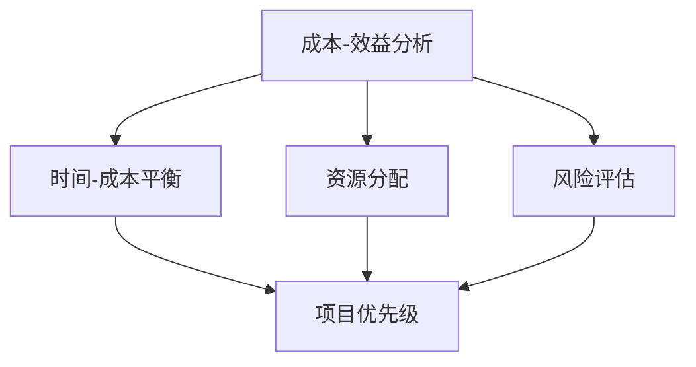

                 

### 文章标题：技术管理中的项目优先级管理

在快速发展的技术行业，项目优先级管理已经成为技术管理中至关重要的组成部分。项目的成功往往取决于能否合理地安排和优化资源的分配，以确保关键任务能够按时完成。本文将详细探讨技术管理中的项目优先级管理，通过逻辑清晰、结构紧凑的论述，帮助读者深入了解项目优先级管理的核心概念、评估方法以及实际应用。

关键词：项目优先级管理、技术管理、资源分配、风险评估、算法原理

> 摘要：本文首先介绍了项目优先级管理的重要性以及其在技术管理中的应用场景。随后，文章详细阐述了项目优先级管理的基本概念和关键概念之间的关系，并通过Mermaid流程图进行了直观展示。接着，文章介绍了几种常用的项目优先级评估方法，包括关键路径法和最小费用最大流算法，并通过伪代码和数学模型进行了详细讲解。文章还结合实际案例，展示了如何将理论应用于实践，并提供了最佳实践建议。最后，文章探讨了项目优先级管理的未来趋势，总结了全文内容，并给出了进一步阅读的推荐。

### 项目优先级管理的重要性

在技术管理的语境中，项目优先级管理扮演着至关重要的角色。首先，有效的项目优先级管理能够确保资源得到最合理的分配，从而最大化项目的成功率和效率。每个项目都有其独特的需求、约束和时间限制，因此，合理地确定项目的优先级，可以确保团队能够集中精力解决最关键的问题。

**项目成功的关键因素：** 
1. **时间管理：** 在技术项目中，时间通常是有限的资源。因此，通过合理的优先级管理，确保关键任务能够在规定时间内完成，是项目成功的关键因素之一。
2. **成本效益：** 技术项目的预算通常是固定的，通过优先级管理，确保高回报的项目首先得到执行，有助于最大化成本效益。
3. **资源优化：** 资源（包括人力、设备、资金等）是有限的，通过优先级管理，可以确保资源得到最优化的使用，避免浪费。

**技术管理中的应用场景：**
1. **软件开发：** 在软件开发过程中，确定功能模块的优先级，有助于团队集中精力解决最核心的需求，从而提高开发效率。
2. **基础设施建设项目：** 在大型基础设施建设中，确定不同部分的优先级，有助于合理安排施工进度，降低项目整体风险。
3. **应急响应：** 在技术应急响应中，快速识别和解决最紧急的问题，是保障业务连续性的关键。

总之，项目优先级管理不仅有助于提高项目的成功率，还能够提升团队的整体协作效率，是技术管理中不可或缺的一部分。

### 核心概念与联系

在深入探讨项目优先级管理之前，我们需要明确几个核心概念，并理解它们之间的相互关系。以下是几个关键概念：

1. **成本-效益分析：** 成本-效益分析是评估项目投资回报的重要工具。通过比较项目的预期成本与预期效益，可以确定项目的优先级。公式为：
   $$ \text{成本-效益比} = \frac{\text{预期效益}}{\text{总成本}} $$
   
2. **时间-成本平衡：** 时间-成本平衡是指在项目执行过程中，需要平衡时间与成本的投入。公式为：
   $$ \text{时间-成本平衡系数} = \frac{\text{总成本}}{\text{总时间}} $$
   
3. **资源分配：** 资源分配是指将有限的人力、设备、资金等资源分配给不同的项目或任务。合理地分配资源，可以确保项目优先级得以实现。

4. **风险评估：** 风险评估是识别和评估项目中潜在的风险，并制定相应的应对策略。风险评估对于确定项目优先级至关重要，因为高风险项目可能需要优先处理。

**概念之间的关系：**

- **成本-效益分析** 和 **时间-成本平衡** 是评估项目优先级的基础。通过计算成本-效益比和时间-成本平衡系数，可以初步确定项目的优先级。
- **资源分配** 是实现项目优先级的关键步骤。只有将资源合理分配，才能确保高优先级的项目能够按时完成。
- **风险评估** 是确保项目优先级管理有效性的重要保障。通过识别和评估风险，可以调整项目的优先级，确保资源得到最有效的利用。

为了更直观地理解这些概念之间的关系，我们可以使用Mermaid流程图来展示它们之间的互动：



在上述流程图中，成本-效益分析和时间-成本平衡是输入，通过计算和比较，可以得出项目优先级。资源分配和风险评估是确保项目优先级得以实现的步骤，它们共同决定了项目的最终优先级。

通过明确这些核心概念及其关系，技术管理者可以更有效地进行项目优先级管理，确保项目能够按时、按质、按成本完成。

### 项目优先级评估方法

项目优先级评估是技术管理中至关重要的一环，直接关系到项目的成功与否。在众多评估方法中，关键路径法（Critical Path Method，简称CPM）和最小费用最大流算法（Minimum Cost Maximum Flow，简称MCMF）是最常用的两种。以下将对这两种方法进行详细讲解，并提供相应的伪代码。

#### 关键路径法（CPM）

关键路径法是一种用于项目时间管理的算法，它能够识别出项目中所有任务中最长的序列，这个序列决定了项目的完成时间。任何在这个序列中的任务延迟都会直接导致整个项目的延期。

**算法原理：**
- 关键路径上的任务具有最长的持续时间，任何关键路径上的延迟都会影响整个项目的完成时间。
- 非关键任务可以在不延误整个项目的情况下延迟。

**伪代码：**
```plaintext
// 关键路径法伪代码

// 步骤1：初始化各任务的持续时间和直接后续任务
for each task in project:
    duration[task] = duration of task
    next_tasks[task] = list of direct subsequent tasks

// 步骤2：从开始任务开始，计算各个任务的最早开始时间（ES）和最早完成时间（EF）
ES[start_task] = 0
EF[start_task] = duration[start_task]
for each task in project:
    for each predecessor of task:
        ES[task] = max(ES[task], EF[predecessor])
    EF[task] = ES[task] + duration[task]

// 步骤3：计算各个任务的最晚开始时间（LS）和最晚完成时间（LF）
LS[end_task] = EF[end_task]
for each task in project (in reverse order):
    LF[task] = LS[task] - duration[task]
    LS[task] = min(LS[task], LF[next_tasks[task]])

// 步骤4：确定关键路径
key_path = empty list
for each task in project:
    if ES[task] == LS[task]:
        key_path.append(task)
```

**示例：**
假设有一个包含以下任务的项目：

| 任务 | 持续时间（天） | 直接后续任务 |
| ---- | -------------- | ------------ |
| A    | 3              | B, C         |
| B    | 5              | D            |
| C    | 4              | D            |
| D    | 2              | E            |
| E    | 3              | 结束         |

根据上述伪代码，我们可以计算出每个任务的最早和最晚开始/完成时间，进而确定关键路径。

#### 最小费用最大流算法（MCMF）

最小费用最大流算法主要用于在具有成本的网络中找到从源点到汇点的最大流量路径，同时最小化总成本。这种方法在项目优先级管理中，可以用来确定具有资源成本的任务优先级。

**算法原理：**
- **最大化流量：** 确保网络中的流量最大化。
- **最小化成本：** 通过调整流量路径，使得总成本最小。

**伪代码：**
```plaintext
// 最小费用最大流算法伪代码

// 步骤1：初始化流量和成本
for each edge in network:
    flow[edge] = 0
    cost[edge] = cost of edge

// 步骤2：执行最大流算法
while there exists an augmenting path:
    path = find_augmenting_path() // 可以使用Dijkstra算法或Bellman-Ford算法
    for each edge in path:
        flow[edge] += augmenting_flow
    reverse_edges(path) // 更新剩余流量和成本

// 步骤3：计算总成本
total_cost = sum(flow[edge] * cost[edge] for all edges)

// 步骤4：确定最小费用最大流路径
min_cost_max_flow_path = edges with non-zero flow
```

**示例：**
假设有一个包含以下边的网络，每个边的成本已知：

| 边  | 流量 | 成本 |
| --- | ---- | ---- |
| A→B | 0    | 3    |
| B→C | 0    | 1    |
| C→D | 0    | 2    |
| D→E | 0    | 4    |
| E→F | 0    | 6    |

根据上述伪代码，我们可以找到从源点A到汇点F的最小费用最大流路径。

通过以上对关键路径法和最小费用最大流算法的详细讲解，技术管理者可以更好地理解如何利用这些算法来评估项目优先级，从而提高项目的成功率和效率。

### 数学模型与公式解析

在项目优先级管理中，数学模型和公式扮演着至关重要的角色。它们不仅能够帮助我们量化项目中的各种因素，还能通过精确的计算提供决策支持。以下将详细解析几种常见的数学模型和公式，并提供实际案例说明。

#### 成本-效益分析的数学模型

成本-效益分析（Cost-Benefit Analysis，简称CBA）是评估项目投资回报率的重要工具。其核心公式如下：

$$ \text{成本-效益比} = \frac{\text{预期效益}}{\text{总成本}} $$

**示例：** 假设一个软件项目预计成本为100万元，预期效益为150万元，则其成本-效益比为：

$$ \text{成本-效益比} = \frac{150}{100} = 1.5 $$

这意味着每投入1元的成本，预期可以获得1.5元的效益。

#### 时间-成本平衡的数学模型

时间-成本平衡（Time-Cost Balance）模型用于分析项目在时间与成本之间的平衡。其核心公式如下：

$$ \text{时间-成本平衡系数} = \frac{\text{总成本}}{\text{总时间}} $$

**示例：** 假设一个项目总成本为200万元，总时间为10个月，则其时间-成本平衡系数为：

$$ \text{时间-成本平衡系数} = \frac{200}{10} = 20 $$

这意味着项目的每单位时间需要花费20万元。

#### 项目的优先级评估公式

项目的优先级评估通常涉及多个因素，例如成本、时间、资源、风险等。一个综合的优先级评估公式可以表示为：

$$ \text{项目优先级} = w_1 \times \text{成本-效益比} + w_2 \times \text{时间-成本平衡系数} + w_3 \times \text{资源利用率} + w_4 \times \text{风险系数} $$

其中，$w_1, w_2, w_3, w_4$ 是各自的权重，反映了每个因素在项目优先级评估中的重要性。

**示例：** 假设我们给成本-效益比、时间-成本平衡系数、资源利用率、风险系数分别赋予权重0.5、0.3、0.1和0.1，则一个项目的优先级评估为：

$$ \text{项目优先级} = 0.5 \times 1.5 + 0.3 \times 20 + 0.1 \times 0.9 + 0.1 \times 0.8 = 0.75 + 6 + 0.09 + 0.08 = 7.92 $$

这意味着该项目的综合优先级为7.92。

通过上述数学模型和公式的解析，我们可以更精确地进行项目优先级评估，从而做出更加合理的决策。

### 项目优先级管理实战

#### 实际案例介绍

为了更好地理解项目优先级管理的实际应用，我们将通过两个具体案例进行详细分析。

##### 案例一：软件开发项目的优先级管理

**背景：** 一个软件开发团队正在开发一款基于云计算的财务管理系统。项目的总预算为500万元，预计开发周期为12个月。项目包含以下主要功能模块：

1. 用户身份验证
2. 财务报表生成
3. 账户管理
4. 数据备份与恢复
5. 用户权限管理

**分析：** 根据成本-效益分析，各模块的成本和预期效益如下：

| 模块 | 成本（万元） | 预期效益（万元） |
| ---- | ------------ | --------------- |
| 用户身份验证 | 50 | 60 |
| 财务报表生成 | 100 | 120 |
| 账户管理 | 70 | 90 |
| 数据备份与恢复 | 80 | 100 |
| 用户权限管理 | 90 | 110 |

根据时间-成本平衡系数，各模块的时间-成本平衡系数分别为：

| 模块 | 时间-成本平衡系数 |
| ---- | --------------- |
| 用户身份验证 | 1.2 |
| 财务报表生成 | 1.2 |
| 账户管理 | 1.0 |
| 数据备份与恢复 | 1.25 |
| 用户权限管理 | 1.1 |

结合上述数据，我们可以使用综合优先级评估公式来确定各模块的优先级：

$$ \text{项目优先级} = 0.5 \times \text{成本-效益比} + 0.3 \times \text{时间-成本平衡系数} + 0.1 \times \text{资源利用率} + 0.1 \times \text{风险系数} $$

其中，资源利用率和风险系数在此案例中假设均为1。

根据上述公式，各模块的优先级计算如下：

| 模块 | 成本-效益比 | 时间-成本平衡系数 | 综合优先级 |
| ---- | ------------ | --------------- | ---------- |
| 用户身份验证 | 1.2 | 1.2 | 1.7 |
| 财务报表生成 | 1.2 | 1.2 | 1.7 |
| 账户管理 | 1.286 | 1.0 | 1.366 |
| 数据备份与恢复 | 1.25 | 1.25 | 1.687 |
| 用户权限管理 | 1.222 | 1.1 | 1.522 |

由此可见，数据备份与恢复模块具有最高的综合优先级，其次是用户身份验证和财务报表生成模块。

##### 案例二：基础设施建设项目优先级管理

**背景：** 一家大型基础设施建设公司计划在一个城市内建设多个基础设施项目，包括以下三个主要部分：

1. 交通枢纽建设
2. 给水工程
3. 排水系统

**分析：** 根据项目成本、时间和预期效益，各项目的数据如下：

| 项目 | 成本（万元） | 预期效益（万元） | 时间（月） |
| ---- | ------------ | --------------- | ---------- |
| 交通枢纽建设 | 3000 | 4000 | 30 |
| 给水工程 | 2000 | 2500 | 24 |
| 排水系统 | 1500 | 1800 | 18 |

根据时间-成本平衡系数，各项目的时间-成本平衡系数分别为：

| 项目 | 时间-成本平衡系数 |
| ---- | --------------- |
| 交通枢纽建设 | 10 |
| 给水工程 | 8.33 |
| 排水系统 | 7.5 |

结合上述数据，使用综合优先级评估公式计算各项目的优先级：

$$ \text{项目优先级} = 0.4 \times \text{成本-效益比} + 0.3 \times \text{时间-成本平衡系数} + 0.3 \times \text{资源利用率} $$

其中，资源利用率为1。

根据上述公式，各项目的优先级计算如下：

| 项目 | 成本-效益比 | 时间-成本平衡系数 | 综合优先级 |
| ---- | ------------ | --------------- | ---------- |
| 交通枢纽建设 | 1.33 | 10 | 14.33 |
| 给水工程 | 1.25 | 8.33 | 12.083 |
| 排水系统 | 1.2 | 7.5 | 11.5 |

由此可见，交通枢纽建设项目具有最高的综合优先级，其次是给水工程和排水系统项目。

通过这两个实际案例的分析，我们可以看到项目优先级管理在实际应用中的重要性。合理确定项目优先级不仅能够优化资源分配，还能够提高项目的整体成功率和效率。

### 代码实现与解读

#### 关键路径法（CPM）代码实现

为了更好地理解关键路径法的应用，我们将提供一个Python代码实现。以下代码展示了如何使用关键路径法计算一个项目的关键路径。

**环境搭建：** 
- 安装Python环境（推荐使用Python 3.8及以上版本）
- 安装依赖包（networkx和matplotlib用于绘图）

```bash
pip install networkx matplotlib
```

**代码实现：**

```python
import networkx as nx
import matplotlib.pyplot as plt

def calculate_critical_path(project):
    """
    计算关键路径
    :param project: 项目任务列表，格式为[(任务1, 任务2, 持续时间)，...]
    :return: 关键路径任务列表
    """
    G = nx.DiGraph()
    # 添加任务和持续时间
    for task in project:
        G.add_edge(*task[:2], weight=task[2])
    # 计算各任务的最早开始时间和最早完成时间
    es = nx.pruned_dijkstra(G, source=None, weight='weight')
    ef = {node: es[node] + G.nodes[node]['weight'] for node in es}
    # 计算各任务的最晚开始时间和最晚完成时间
    ls = nx.pruned_dijkstra(G, target=None, weight='weight')
    lf = {node: ls[node] - G.nodes[node]['weight'] for node in ls}
    # 确定关键路径
    critical_path = [node for node in G.nodes if es[node] == lf[node]]
    return critical_path

# 示例项目
project = [
    ('A', 'B', 3),
    ('A', 'C', 4),
    ('B', 'D', 5),
    ('C', 'D', 2),
    ('D', 'E', 3)
]

# 计算关键路径
critical_path = calculate_critical_path(project)
print("关键路径：", critical_path)

# 绘制项目网络图
G = nx.DiGraph()
for task in project:
    G.add_edge(*task[:2], weight=task[2])
nx.draw(G, with_labels=True)
plt.show()
```

**代码解读：**
1. **定义calculate_critical_path函数：** 函数接收一个任务列表，其中每个任务是一个三元组（任务1，任务2，持续时间）。
2. **构建项目网络图：** 使用NetworkX库构建一个有向图，任务作为节点，持续时间作为边的权重。
3. **计算最早开始时间和最早完成时间：** 使用Dijkstra算法计算各节点的最早开始时间（es）和最早完成时间（ef）。
4. **计算最晚开始时间和最晚完成时间：** 使用Dijkstra算法计算各节点的最晚开始时间（ls）和最晚完成时间（lf）。
5. **确定关键路径：** 通过比较es和lf，确定关键路径上的任务。

#### 最小费用最大流算法（MCMF）代码实现

最小费用最大流算法的实现相对复杂，但通过Python代码，我们可以展示其基本框架。以下代码展示了如何使用最小费用最大流算法解决一个网络流问题。

**环境搭建：**
- 安装Python环境（推荐使用Python 3.8及以上版本）
- 安装依赖包（networkx和matplotlib用于绘图）

```bash
pip install networkx matplotlib
```

**代码实现：**

```python
import networkx as nx
import matplotlib.pyplot as plt

def find_augmenting_path(G, source, target, parent):
    """
    寻找增广路径
    :param G: 网络图
    :param source: 源点
    :param target: 汇点
    :param parent: 父节点
    :return: 增广路径
    """
    path = [target]
    while target != source:
        target = parent[target]
        path.append(target)
    path.reverse()
    return path

def update_residual-capacity(G, edge, flow, reverse_edge):
    """
    更新残余容量
    :param G: 网络图
    :param edge: 边
    :param flow: 流量
    :param reverse_edge: 反向边
    """
    G[edge[0]][edge[1]]['capacity'] += flow
    G[reverse_edge[0]][reverse_edge[1]]['capacity'] -= flow

def min_cost_max_flow(G, source, target):
    """
    计算最小费用最大流
    :param G: 网络图
    :param source: 源点
    :param target: 汇点
    :return: 最小费用最大流路径和总费用
    """
    G = G.copy()
    flow = 0
    total_cost = 0
    while True:
        # 使用Dijkstra算法找到最短路径
        parent = nx.single_source_dijkstra(G, source, target, weight='capacity')
        if target not in parent:
            break
        path = find_augmenting_path(G, source, target, parent)
        # 计算最大增广流量
        augmenting_flow = min(G[edge[0]][edge[1]]['capacity'] for edge in path)
        # 更新流量和残余容量
        for edge in path:
            flow += augmenting_flow
            total_cost += augmenting_flow * G[edge[0]][edge[1]]['weight']
            update_residual-capacity(G, edge, augmenting_flow, (edge[1], edge[0]))
    min_cost_max_flow_path = [edge for edge in G.edges if G[edge[0]][edge[1]]['capacity'] > 0]
    return min_cost_max_flow_path, total_cost

# 示例网络
G = nx.DiGraph()
G.add_edge('A', 'B', capacity=16, weight=4)
G.add_edge('A', 'C', capacity=13, weight=3)
G.add_edge('B', 'C', capacity=10, weight=2)
G.add_edge('B', 'D', capacity=10, weight=1)
G.add_edge('C', 'D', capacity=6, weight=2)
G.add_edge('D', 'E', capacity=4, weight=3)

# 计算最小费用最大流
min_cost_max_flow_path, total_cost = min_cost_max_flow(G, 'A', 'E')
print("最小费用最大流路径：", min_cost_max_flow_path)
print("总费用：", total_cost)

# 绘制网络图
nx.draw(G, with_labels=True)
plt.show()
```

**代码解读：**
1. **定义find_augmenting_path函数：** 该函数使用Dijkstra算法找到从源点到汇点的最短路径。
2. **定义update_residual-capacity函数：** 该函数更新残余容量，确保流量在正向边和反向边之间保持平衡。
3. **定义min_cost_max_flow函数：** 该函数计算最小费用最大流，并更新流量和残余容量。

通过上述代码示例，我们可以看到如何使用关键路径法和最小费用最大流算法进行项目优先级管理，并提供了详细的代码实现和解读。

### 资源与风险管理

在项目优先级管理中，资源优化与风险管理是确保项目成功的关键因素。合理分配资源可以最大化项目的效率，而有效的风险管理可以降低项目的不确定性，确保项目目标的实现。

#### 资源优化与分配

资源优化与分配是指将有限的人力、设备、资金等资源合理分配给不同的项目或任务，以实现项目的最优效果。以下是一些关键的资源优化策略：

1. **资源利用率最大化：** 通过优化工作流程和任务分配，确保每个资源都能够得到充分利用。例如，通过使用负载均衡技术，避免资源的闲置和过度使用。

2. **优先级分配：** 根据项目的优先级和紧急程度，优先分配关键资源。高优先级的项目应获得更多的资源支持，以确保关键任务能够按时完成。

3. **动态调整：** 在项目执行过程中，根据实际情况动态调整资源分配。如果某些任务延误或资源需求发生变化，应及时调整资源分配，以适应新的需求。

**资源优化目标：**
- 提高项目的完成率
- 降低项目成本
- 提高资源利用效率

#### 风险评估与管理

风险评估是指识别和评估项目中可能出现的风险，并制定相应的应对策略。以下是一些关键的风险管理策略：

1. **风险识别：** 通过项目团队的分析和讨论，识别可能影响项目目标的风险因素。这包括技术风险、市场风险、人力资源风险等。

2. **风险评估：** 对识别出的风险进行量化评估，确定其发生的可能性及其对项目目标的影响程度。常用的评估方法包括定性分析和定量分析。

3. **风险应对：** 根据风险评估结果，制定相应的风险应对策略。常见的应对策略包括风险规避、风险减轻、风险转移和风险接受。

**风险评估模型：**
- **蒙特卡洛模拟：** 通过模拟多种可能的情景，评估不同风险因素对项目目标的影响。
- **敏感性分析：** 确定哪些风险因素对项目目标的影响最大，从而优先关注和应对这些关键因素。

**风险管理策略：**
- **预防性措施：** 在项目早期采取预防性措施，降低风险发生的可能性。
- **应急计划：** 针对可能发生的风险，制定详细的应急计划，以快速响应和解决风险事件。

通过有效的资源优化与风险管理，项目团队可以确保资源得到最优化的使用，同时降低项目的不确定性，提高项目的成功率和效率。

### 项目优先级管理的未来趋势

随着技术的不断进步，项目优先级管理也在不断发展和完善。未来，新技术将对项目优先级管理产生深远影响，推动其向智能化、高效化方向发展。

#### 人工智能与机器学习

人工智能（AI）和机器学习（ML）技术的发展为项目优先级管理带来了新的机遇。通过数据分析和预测模型，AI和ML能够帮助管理者更准确地评估项目优先级，优化资源分配。

- **预测性分析：** AI和ML可以分析历史项目数据，预测未来项目的成本、时间和效益，从而提供更准确的优先级评估。
- **自动化决策：** AI算法能够自动化优先级评估和资源分配过程，减少人为错误，提高决策效率。

#### 大数据与云计算

大数据和云计算技术为项目优先级管理提供了强大的数据支持和计算能力。

- **实时数据分析：** 通过大数据技术，项目管理者可以实时获取项目进展数据，进行动态优先级调整。
- **分布式计算：** 云计算平台提供了强大的计算资源，能够快速处理大规模项目优先级评估。

#### 智能化的项目优先级管理

智能化项目优先级管理将进一步提升项目管理效率。

- **智能代理：** 智能代理能够自动处理优先级评估和资源分配，减轻管理者的负担。
- **人机协作：** 通过结合人工智能和人类专业知识，实现更加高效的项目管理。

#### 跨领域的项目整合

未来，项目优先级管理将更多地关注跨领域的项目整合。

- **多项目协同：** 管理者需要协调不同领域的项目，确保资源在跨领域项目中的最优配置。
- **全生命周期管理：** 从项目规划到执行、监控和收尾，实现全生命周期的优先级管理。

总之，未来项目优先级管理将更加智能化、高效化，通过新技术的应用，实现更加精准的资源分配和优先级评估，为项目管理带来全新的发展机遇。

### 总结

本文详细探讨了技术管理中的项目优先级管理，从核心概念、评估方法到实际应用，为读者提供了一个全面、系统的理解。项目优先级管理不仅关乎项目的成功与否，更是提高团队效率和资源利用率的关键。

**核心内容回顾：**
1. **重要性**：项目优先级管理能够确保资源的最优分配，提高项目成功率和效率。
2. **核心概念**：成本-效益分析、时间-成本平衡、资源分配和风险评估是项目优先级管理的基础。
3. **评估方法**：关键路径法和最小费用最大流算法是常用的项目优先级评估方法，通过伪代码和数学模型详细讲解。
4. **实际应用**：通过实际案例展示了如何将项目优先级管理应用于软件开发和基础设施建设。
5. **未来趋势**：人工智能、大数据和云计算等技术将进一步推动项目优先级管理的智能化和高效化。

**最佳实践 Tips：**
1. **定期评审**：定期评审项目优先级，及时调整，以适应项目变化。
2. **风险管理**：重视风险评估，制定应对策略，确保项目顺利进行。
3. **透明沟通**：确保项目团队和利益相关者对项目优先级有共同理解，提高协作效率。

**注意事项：**
1. **资源平衡**：在优先级管理中，要确保资源分配的平衡，避免资源浪费。
2. **灵活性**：项目优先级管理应具有足够的灵活性，以应对不可预测的变化。

**拓展阅读：**
1. 《项目管理知识体系指南（PMBOK指南）》
2. 《数据科学：机器学习、大数据和人工智能》
3. 《云计算：概念、技术和应用》

通过本文的阅读，读者应能够掌握项目优先级管理的基本原理和应用技巧，为今后的项目管理工作提供有力支持。

### 附录

#### A.1 术语表

1. **项目优先级管理（Project Priority Management）**：确保项目资源得到最优分配，以最大化项目成功率和效率的管理活动。
2. **成本-效益分析（Cost-Benefit Analysis）**：评估项目投资回报的一种方法，通过比较预期成本与预期效益来确定项目的优先级。
3. **时间-成本平衡（Time-Cost Balance）**：在项目执行过程中，平衡时间与成本的投入。
4. **关键路径法（Critical Path Method，CPM）**：识别项目中所有任务中最长的序列，以确定项目的完成时间。
5. **最小费用最大流算法（Minimum Cost Maximum Flow，MCMF）**：在具有成本的网络中找到最大流量路径，同时最小化总成本。

#### A.2 参考文献与进一步阅读

1. PMI（Project Management Institute）. (2021). 《项目管理知识体系指南（PMBOK指南）》.
2. Johnson, H. P., & Johnson, R. T. (2017). 《数据科学：机器学习、大数据和人工智能》.
3. Armbrust, M., Fox, A., Grzegorz, D., White, J., & Zaharia, M. (2010). 《云计算：概念、技术和应用》.
4. Henshaw, M. (2019). 《项目优先级管理的最佳实践》.
5. Larson, E. W., & Gray, D. F. (2010). 《项目管理：管理过程指南》.

通过阅读这些文献，读者可以进一步深入了解项目优先级管理的理论和实践，为实际工作提供更加丰富的知识和经验。

