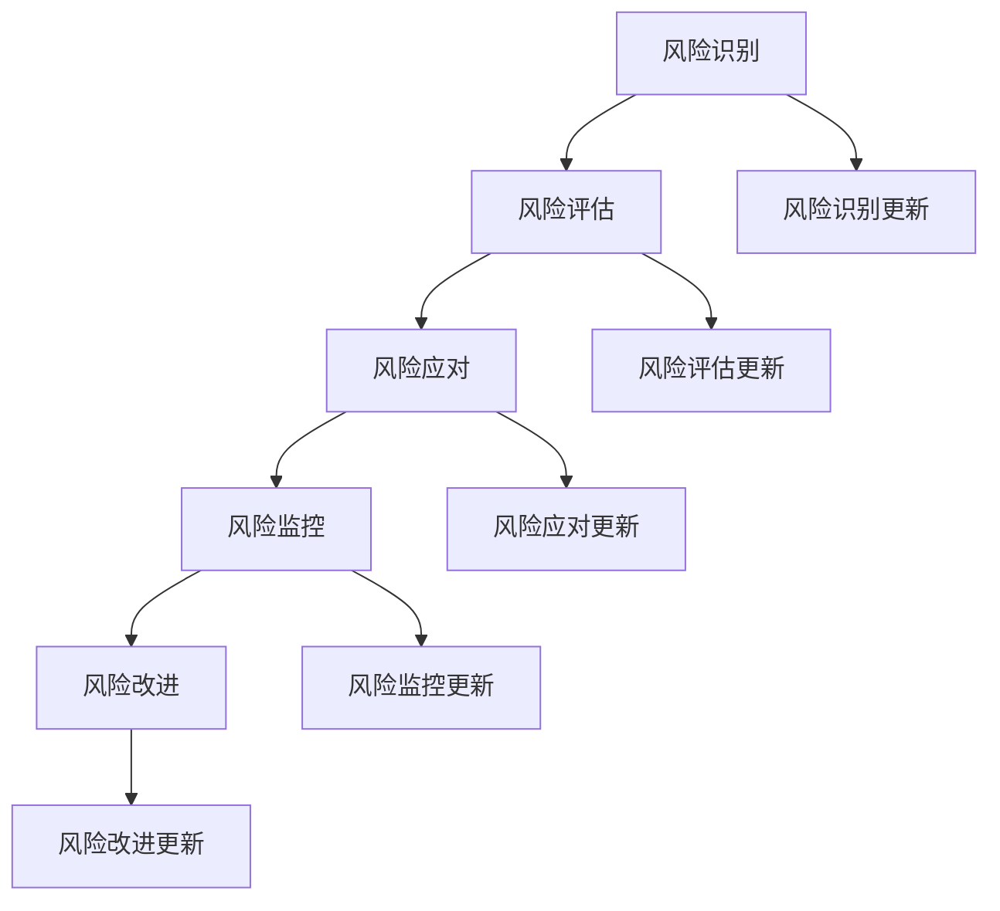
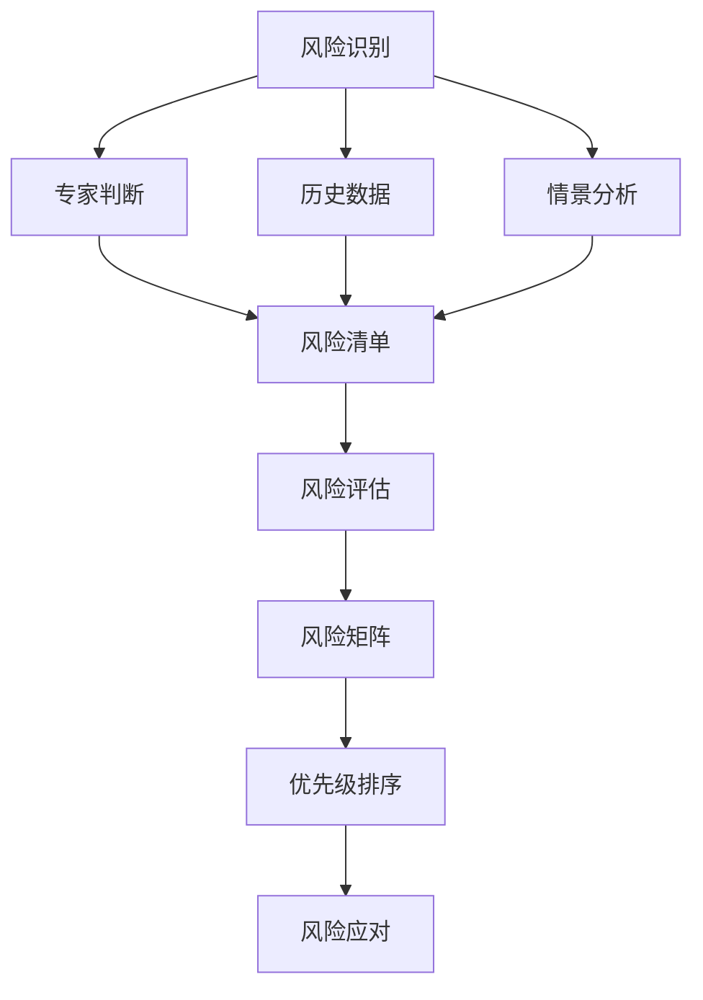
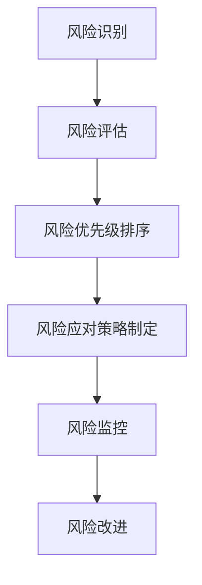
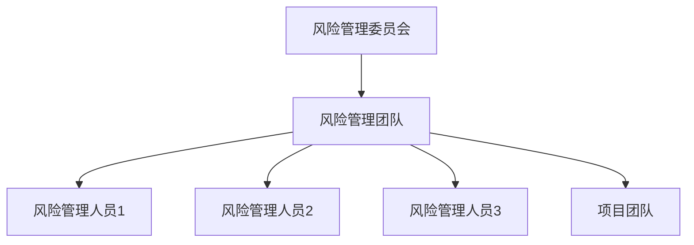
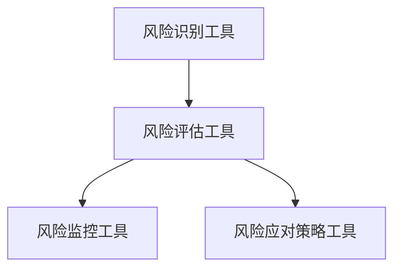

                 

### 引言

在现代技术行业中，风险控制已成为技术管理中的关键要素。随着技术的发展和业务复杂性的增加，技术风险无时不在，对企业的生存和发展构成严重威胁。因此，如何在技术管理中有效控制风险，已成为企业面临的重要课题。

**技术风险**是指在技术项目或产品开发过程中，由于技术本身的复杂性、不确定性或外部环境变化等因素，导致项目延期、成本超支、质量下降、数据泄露等不良后果的可能性。技术风险可能源自多个方面，包括技术漏洞、项目管理缺陷、资源配置不足、技术依赖性等。

**技术管理中的风险控制**是指通过识别、评估、应对和管理技术风险，确保项目或产品开发过程中的稳定性和可持续性。有效的技术风险管理不仅能够降低风险发生的概率，还能提高企业的应变能力和竞争力。

本篇文章将围绕技术管理中的风险控制进行深入探讨。首先，我们将介绍风险管理的理论基础，包括风险管理的原则、框架和方法。接着，我们将详细讲解风险识别与评估的步骤和方法，使用伪代码阐述核心算法原理。随后，我们将介绍各种风险应对策略，如风险转移、规避、减少和接受等，并结合具体案例进行分析。最后，我们将讨论风险管理实施的具体流程、组织和技术，总结全文内容，并对未来风险管理的趋势和发展进行展望。

通过本文的阅读，读者将能够全面了解技术管理中的风险控制，掌握风险管理的方法和技巧，为实际工作中的技术风险控制提供有力支持。

### 风险管理的理论基础

在深入探讨技术管理中的风险控制之前，我们需要了解风险管理的理论基础。风险管理作为一种系统性的方法，旨在通过识别、评估和应对风险，以最小化不利影响并最大化机会。以下是风险管理的三个核心原则、一个基本框架和几种常见方法。

#### 风险管理的原则

1. **全面性原则**：风险管理应覆盖企业或项目的各个方面，包括人员、流程、技术和环境等。只有全面识别和管理风险，才能确保项目的稳定性和可持续性。
2. **系统性原则**：风险管理应是一个系统性的过程，包括风险评估、风险应对、监控和改进。各个步骤相互关联，共同构成一个闭环系统。
3. **动态性原则**：风险管理是一个动态的过程，需要不断更新和调整。随着项目进展和环境变化，风险状况也会发生变化，因此风险管理也需要持续进行。

#### 风险管理的框架

风险管理的框架通常包括以下几个步骤：

1. **风险识别**：通过系统的方法识别可能面临的风险，包括内部和外部风险。
2. **风险评估**：对识别出的风险进行量化评估，确定其发生的概率和潜在影响。
3. **风险应对**：根据风险评估结果，制定和实施相应的风险应对策略，包括风险转移、规避、减少和接受等。
4. **风险监控**：在风险应对过程中，持续监控风险状况，及时发现新风险或风险变化，进行调整。
5. **风险改进**：通过总结经验教训，不断改进风险管理流程和策略。

以下是使用Mermaid绘制的风险管理框架图：



#### 风险管理的方法

1. **定性方法**：通过专家判断、历史数据和情景分析等定性手段评估风险。
2. **定量方法**：使用数学模型、统计方法和计算机模拟等定量手段评估风险。
3. **概率方法**：结合定性方法和定量方法，使用概率论和统计学原理评估风险。

在实际应用中，企业或项目可能结合多种方法进行风险管理。以下是一个简化的风险识别和评估过程：



通过上述理论基础，我们可以更好地理解风险管理的核心概念和方法。在接下来的部分，我们将详细探讨风险识别与评估的步骤，使用伪代码和数学模型来阐述核心算法原理。

### 风险识别与评估

风险识别与评估是风险管理的重要环节，直接决定了风险管理的有效性和针对性。以下是风险识别与评估的具体步骤、方法和工具。

#### 风险识别

风险识别是指通过系统的方法识别潜在的风险。以下是几种常用的风险识别方法：

1. **专家判断**：邀请相关领域的专家，通过他们的经验和知识来识别风险。
2. **历史数据**：分析过去项目或产品的历史数据，识别出可能存在的风险。
3. **情景分析**：通过模拟不同的场景，识别出可能发生的风险。
4. **文档审查**：审查项目相关的文档，如需求说明书、设计文档等，识别潜在的风险。

以下是一个简化的风险识别过程伪代码：

```python
def risk_identification():
    expert_judgment = get_expert_opinion()
    historical_data = analyze_historical_data()
    scenario_analysis = simulate_scenarios()
    document_review = review_documents()
    risk_list = merge_risks(expert_judgment, historical_data, scenario_analysis, document_review)
    return risk_list
```

#### 风险评估

风险评估是指对识别出的风险进行量化评估，确定其发生的概率和潜在影响。以下是几种常用的风险评估方法：

1. **定性方法**：通过专家判断或历史数据对风险的发生概率和影响程度进行评估。
2. **定量方法**：使用数学模型或统计方法对风险的发生概率和影响程度进行量化评估。
3. **概率方法**：结合定性方法和定量方法，使用概率论和统计学原理评估风险。

以下是一个简化的风险评估过程伪代码：

```python
def risk_evaluation(risks):
    for risk in risks:
        probability = calculate_probability(risk)
        impact = calculate_impact(risk)
        risk_score = probability * impact
        risk.risk_score = risk_score
    sorted_risks = sort_risks_by_risk_score(risks)
    return sorted_risks
```

#### 风险分析

风险分析是指对评估后的风险进行详细分析，以确定其优先级和应对策略。以下是几种常用的风险分析工具：

1. **风险矩阵**：使用风险矩阵对风险的发生概率和影响程度进行可视化分析。
2. **决策树**：通过决策树分析风险的各种可能性和应对策略。
3. **蒙特卡罗模拟**：使用蒙特卡罗模拟方法对风险的概率和影响进行详细分析。

以下是一个简化的风险矩阵示例：

| 风险       | 发生概率 | 影响程度 | 风险评分 |
| ---------- | -------- | -------- | -------- |
| 技术漏洞   | 中       | 高       | 中       |
| 项目延期   | 低       | 中       | 低       |
| 数据泄露   | 高       | 高       | 高       |

通过上述步骤和方法，我们可以对技术风险进行全面识别和评估。接下来，我们将讨论风险应对策略，介绍各种应对措施的具体实施方法。

### 风险应对策略

在识别和评估技术风险后，接下来是制定和实施风险应对策略。这些策略旨在降低风险的发生概率和影响程度，确保项目的稳定性和可持续性。以下是几种常见的技术风险应对策略：

#### 风险转移

风险转移是指将风险转移给其他方，如保险公司、合作伙伴或客户。以下是几种常见的风险转移方法：

1. **保险**：通过购买保险，将潜在的技术风险转移给保险公司。保险公司会为风险事件提供经济补偿。
2. **外包**：将部分项目或任务外包给具有专业能力和经验的合作伙伴，从而转移一部分风险。
3. **合同**：通过签订合同，明确各方的责任和义务，将风险转移给合作伙伴或客户。

以下是一个简单的风险转移流程伪代码：

```python
def risk_transfer(risk):
    if risk_type == "保险":
        buy_insurance(risk)
    elif risk_type == "外包":
        outsource_task(risk)
    elif risk_type == "合同":
        sign_contract(risk)
```

#### 风险规避

风险规避是指通过改变项目计划或策略，避免风险的发生。以下是一些常见的风险规避方法：

1. **变更需求**：通过调整需求，避免引入高风险功能。
2. **替代方案**：开发备用的技术方案或组件，以应对可能的技术风险。
3. **提前终止**：在风险发生前，提前终止项目或任务，以避免风险带来的损失。

以下是一个简单的风险规避流程伪代码：

```python
def risk_avoidance(risk):
    if risk_type == "变更需求":
        adjust_requirements(risk)
    elif risk_type == "替代方案":
        develop_backup_solution(risk)
    elif risk_type == "提前终止":
        terminate_project_early(risk)
```

#### 风险减少

风险减少是指通过采取具体措施，降低风险的发生概率和影响程度。以下是一些常见的技术风险减少方法：

1. **技术改进**：通过改进技术方案，降低技术漏洞和故障的风险。
2. **质量管理**：通过加强质量控制，降低项目延期和质量问题的风险。
3. **应急计划**：制定详细的应急计划，以应对可能发生的风险事件。

以下是一个简单的风险减少流程伪代码：

```python
def risk_reduction(risk):
    if risk_type == "技术改进":
        improve_technology_solution(risk)
    elif risk_type == "质量管理":
        enhance_quality_control(risk)
    elif risk_type == "应急计划":
        create_emergency_plan(risk)
```

#### 风险接受

风险接受是指当其他策略无法完全消除风险时，选择接受风险并制定相应的应对措施。以下是一些常见的风险接受方法：

1. **风险容忍度**：明确企业或项目的风险容忍度，对无法规避或减少的风险进行接受。
2. **风险监测**：对接受的风险进行持续监测，以便在风险事件发生时及时采取应对措施。
3. **风险准备金**：设立风险准备金，用于应对可能发生的风险事件。

以下是一个简单的风险接受流程伪代码：

```python
def risk_acceptance(risk):
    if risk_type == "风险容忍度":
        define_risk_tolerance(risk)
    elif risk_type == "风险监测":
        monitor_risk(risk)
    elif risk_type == "风险准备金":
        allocate_risk_fund(risk)
```

通过上述风险应对策略，我们可以有效地降低技术风险的发生概率和影响程度。接下来，我们将通过具体案例来展示这些策略的实际应用。

### 案例分析

为了更好地理解技术管理中的风险控制，我们可以通过几个实际案例来详细分析风险识别、评估和应对的过程。

#### 案例一：某科技公司软件项目风险管理

**背景**：
某科技公司正在开发一款新型企业级管理软件，该项目涉及复杂的系统架构和大量的第三方组件。项目初期，由于时间紧、任务重，团队面临诸多挑战，如技术漏洞、项目管理缺陷、资源配置不足等。

**风险识别**：
1. **技术漏洞**：系统架构复杂，可能存在未发现的技术漏洞。
2. **项目管理缺陷**：项目进度安排不合理，可能导致延期。
3. **资源配置不足**：人手不足，可能影响项目质量。

**风险评估**：
使用风险矩阵对识别出的风险进行评估：

| 风险       | 发生概率 | 影响程度 | 风险评分 |
| ---------- | -------- | -------- | -------- |
| 技术漏洞   | 高       | 中       | 中       |
| 项目延期   | 中       | 高       | 高       |
| 资源配置不足 | 中       | 中       | 中       |

**风险应对**：
1. **风险转移**：通过购买保险，将技术漏洞的风险转移给保险公司。
2. **风险规避**：调整项目进度计划，避免因项目管理缺陷导致的延期。
3. **风险减少**：增加团队成员，确保项目资源的充足。

**实施**：
- 购买保险：与保险公司签订合同，确保技术漏洞风险得到转移。
- 调整进度计划：重新安排任务，确保项目按计划进行。
- 增加团队资源：招聘新成员，提升团队整体实力。

**效果**：
通过上述措施，成功降低了项目延期和资源配置不足的风险，同时通过保险转移了技术漏洞的风险。项目最终顺利完成，实现了预期目标。

#### 案例二：某互联网公司数据安全风险控制

**背景**：
某互联网公司正在开发一款新的用户数据分析平台，该平台涉及大量用户数据。由于数据敏感性高，公司对数据安全风险非常重视。

**风险识别**：
1. **数据泄露**：用户数据可能因系统漏洞或攻击导致泄露。
2. **权限滥用**：内部员工可能滥用权限，访问或修改用户数据。
3. **技术依赖**：依赖第三方数据存储服务，可能面临不可控的风险。

**风险评估**：
使用风险矩阵对识别出的风险进行评估：

| 风险       | 发生概率 | 影响程度 | 风险评分 |
| ---------- | -------- | -------- | -------- |
| 数据泄露   | 高       | 高       | 高       |
| 权限滥用   | 中       | 高       | 中       |
| 技术依赖   | 中       | 中       | 中       |

**风险应对**：
1. **风险规避**：采用本地数据存储，减少对第三方服务的依赖。
2. **风险减少**：实施严格的权限管理和数据加密措施。
3. **风险接受**：对无法规避的风险，制定详细的应急计划和风险监测方案。

**实施**：
- 数据存储迁移：将数据存储迁移至本地服务器，减少对第三方服务的依赖。
- 数据加密：对用户数据进行加密处理，确保数据安全。
- 权限管理：实施严格的权限控制，限制员工对敏感数据的访问。
- 应急计划和风险监测：制定详细的应急计划和风险监测方案，确保在风险事件发生时能够及时应对。

**效果**：
通过上述措施，成功降低了数据泄露和权限滥用的风险，同时通过本地数据存储减少了技术依赖的风险。公司数据安全得到显著提升，用户信任度增加。

#### 案例三：某制造企业供应链风险应对

**背景**：
某制造企业面临供应链风险，由于原材料供应不稳定，可能导致生产线中断。

**风险识别**：
1. **原材料短缺**：供应商可能因各种原因无法按时交付原材料。
2. **运输延误**：物流问题可能导致原材料运输延误。
3. **供应商风险**：供应商可能面临财务问题或其他风险，影响供应能力。

**风险评估**：
使用风险矩阵对识别出的风险进行评估：

| 风险       | 发生概率 | 影响程度 | 风险评分 |
| ---------- | -------- | -------- | -------- |
| 原材料短缺 | 高       | 高       | 高       |
| 运输延误   | 中       | 中       | 中       |
| 供应商风险 | 中       | 高       | 中       |

**风险应对**：
1. **风险转移**：购买供应链保险，将风险转移给保险公司。
2. **风险减少**：建立多元化的供应商体系，确保原材料供应的稳定性。
3. **风险接受**：对无法规避的风险，制定详细的应急计划和替代方案。

**实施**：
- 供应链保险：购买供应链保险，确保在供应商无法按时交付原材料时，能够得到经济补偿。
- 多元化供应商：与多个供应商建立合作关系，确保原材料供应的稳定性。
- 应急计划和替代方案：制定详细的应急计划和替代方案，确保在供应链风险发生时能够及时应对。

**效果**：
通过上述措施，成功降低了原材料短缺和供应商风险的风险评分。虽然运输延误的风险评分未降低，但通过应急计划和替代方案的制定，确保了在运输延误发生时，企业能够迅速调整生产和供应链策略，减少风险对企业运营的影响。

通过这些案例分析，我们可以看到风险识别、评估和应对在实际应用中的具体操作和方法。这些案例不仅展示了技术风险控制的全过程，也为其他企业和项目提供了宝贵的经验和参考。

### 风险管理实施

风险管理实施是将风险管理理论应用到实际工作中的关键环节。为了确保风险管理措施的有效性，需要建立完善的流程、组织和相应的技术支持。以下是风险管理实施的具体流程、组织和技术措施。

#### 风险管理流程

风险管理流程是一个系统性的过程，包括以下步骤：

1. **风险识别**：通过系统的方法识别潜在的风险。可以采用专家判断、历史数据、情景分析等方法。
2. **风险评估**：对识别出的风险进行量化评估，确定其发生的概率和潜在影响。可以使用风险矩阵、决策树等工具。
3. **风险优先级排序**：根据风险评估结果，对风险进行优先级排序，确定重点风险。
4. **风险应对策略制定**：根据风险优先级，制定相应的风险应对策略，如风险转移、规避、减少和接受等。
5. **风险监控**：在风险应对过程中，持续监控风险状况，及时发现新风险或风险变化，进行调整。
6. **风险改进**：通过总结经验教训，不断改进风险管理流程和策略，提高风险管理效果。

以下是一个简化的风险管理流程图：



#### 风险管理组织

风险管理组织是风险管理实施的重要保障。一个有效的风险管理组织应包括以下角色和职责：

1. **风险管理委员会**：负责制定风险管理政策、审批重大风险管理措施，确保风险管理在战略层面得到重视。
2. **风险管理团队**：负责具体的风险识别、评估、应对和监控工作，确保风险管理在执行层面得到落实。
3. **风险管理人员**：负责具体的风险管理工作，包括风险识别、评估、应对和监控等。
4. **项目团队**：负责在项目中实施风险管理措施，确保项目风险得到有效控制。

以下是一个简化的风险管理组织结构图：



#### 风险管理技术

风险管理技术是提高风险管理效率和效果的重要手段。以下是几种常用的风险管理技术：

1. **风险识别工具**：如风险管理软件、专家系统、情景分析工具等。
2. **风险评估工具**：如风险矩阵、决策树、蒙特卡罗模拟等。
3. **风险监控工具**：如风险管理软件、自动化监控工具等。
4. **风险应对策略工具**：如风险转移工具、风险规避工具、风险减少工具等。

以下是一个简化的风险管理技术框架：



通过建立完善的风险管理流程、组织和技术支持，企业可以有效地识别、评估和应对技术风险，确保项目或产品的稳定性和可持续性。

### 总结与展望

在本文中，我们系统地探讨了技术管理中的风险控制，从风险识别、评估到应对策略，再到风险管理实施的具体流程、组织和技术，全面展示了风险控制的理论和实践方法。通过案例分析，我们看到了风险控制在实际应用中的具体操作和成效。

**关键点回顾**：

1. **风险控制的重要性**：技术风险是现代技术项目或产品开发中不可避免的挑战，有效的风险控制可以最大限度地降低风险对项目的负面影响。
2. **风险管理的原则**：全面性、系统性和动态性是风险管理的核心原则，指导我们进行全面、持续和动态的风险管理。
3. **风险识别与评估**：通过系统的方法识别和评估风险，使用伪代码和数学模型阐述核心算法原理，确保我们对风险的准确把握。
4. **风险应对策略**：包括风险转移、规避、减少和接受等策略，结合具体案例展示了各种策略的实际应用。
5. **风险管理实施**：通过建立风险管理流程、组织和相应的技术支持，确保风险控制措施的有效落实。

**未来趋势与发展**：

随着技术的不断进步，风险管理的挑战也在不断变化。以下是一些未来的趋势和发展方向：

1. **人工智能与风险管理**：人工智能技术的应用将进一步提升风险识别、评估和应对的效率和准确性，为风险管理带来新的突破。
2. **数字化转型**：随着数字化转型进程的加快，企业需要更加灵活和智能的风险管理方法，以应对新兴技术的风险。
3. **合规与法规**：随着各国对数据保护和隐私的关注日益增加，合规和法规风险将成为技术管理中的重要方面。
4. **持续集成与持续交付**（CI/CD）：自动化和智能化将成为CI/CD过程的核心，从而提高项目交付的稳定性和质量。

**最佳实践**：

1. **定期风险评估**：定期对项目或产品进行全面的风险评估，及时发现和应对新风险。
2. **跨部门协作**：建立跨部门的风险管理团队，确保各部门之间的沟通和协作，提高风险管理效果。
3. **风险管理培训**：加强对员工的培训，提高全体员工的风险意识和管理能力。
4. **持续改进**：通过总结经验和反馈，不断优化风险管理流程和策略，提高风险管理效果。

通过本文的探讨，我们希望能够为技术管理中的风险控制提供有益的指导和启示，助力企业在复杂多变的环境中实现稳定和可持续发展。

### 附录

**附录A：术语表**

- **技术风险**：指在技术项目或产品开发过程中，由于技术本身的复杂性、不确定性或外部环境变化等因素，导致项目延期、成本超支、质量下降、数据泄露等不良后果的可能性。
- **风险管理**：指通过识别、评估、应对和管理风险，以最小化不利影响并最大化机会的系统方法。
- **风险识别**：指通过系统的方法识别潜在的风险。
- **风险评估**：指对识别出的风险进行量化评估，确定其发生的概率和潜在影响。
- **风险应对策略**：指根据风险评估结果，制定和实施相应的风险应对措施。

**附录B：参考文献**

1. 《风险管理：原则与实务》，李洪心，中国人民大学出版社，2019。
2. 《风险管理框架》，ISO/IEC 31000，国际标准化组织，2018。
3. 《项目管理知识体系指南》（PMBOK指南），项目管理系统协会（PMI），2021。

### 结语

作者：AI天才研究院/AI Genius Institute & 禅与计算机程序设计艺术 /Zen And The Art of Computer Programming

感谢您的阅读。本文旨在帮助读者全面了解技术管理中的风险控制，掌握风险管理的方法和技巧，为实际工作中的技术风险控制提供有力支持。如果您在阅读过程中有任何疑问或建议，欢迎留言讨论。我们期待与您共同探讨和进步。在此，特别感谢AI天才研究院和《禅与计算机程序设计艺术》对本文的支持与贡献。希望本文能对您的工作和学习带来帮助。再次感谢您的阅读！

