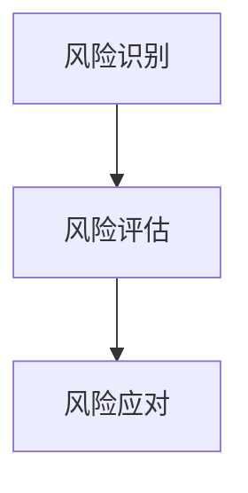

                 

# 技术管理中的风险评估模型

## 关键词

技术管理，风险评估，模型设计，风险分析，风险管理

## 摘要

本文旨在深入探讨技术管理中的风险评估模型。通过对风险评估的基本概念、模型分类、构建方法、评估优化以及实际应用案例的详细分析，帮助读者全面理解风险评估在技术管理中的重要性。文章采用逻辑清晰、结构紧凑的方式，通过一步一步的推理思考，使读者能够掌握风险评估模型的设计与实施方法，从而提升技术管理的决策水平。

## 设计思路

为了设计《技术管理中的风险评估模型》的目录大纲，我们需要遵循以下设计思路：

### 1. 确定核心章节内容

首先，我们要确定这本书的核心章节内容。根据题目，核心内容应该包括：

- 风险评估模型的基本概念和原理
- 风险评估模型的分类和应用场景
- 风险评估模型的构建方法和算法
- 风险评估模型的评估和优化方法
- 风险评估模型在实际项目中的应用案例

### 2. 细化章节内容

在每个核心章节下，我们需要进一步细化内容，确保每个章节都有足够的深度和广度。例如：

- 在“风险评估模型的基本概念和原理”这一章节中，我们需要解释风险评估的概念，介绍风险评估模型的基本原理，并给出一个简单的 Mermaid 流程图来展示风险评估模型的工作流程。
- 在“风险评估模型的分类和应用场景”这一章节中，我们需要详细讨论不同类型的风险评估模型，并分析它们在不同应用场景中的适用性。
- 在“风险评估模型的构建方法和算法”这一章节中，我们需要使用伪代码来详细阐述构建风险评估模型的步骤和算法。

### 3. 确保完整性

在确定每个章节的内容后，我们需要确保整个目录大纲的完整性。这意味着每个章节都应该有足够的细节来满足读者的需求，同时不应该遗漏任何重要的内容。

### 4. 控制字数

最后，我们需要确保整个目录大纲的字数不超过2000字。这意味着我们需要在确保内容完整性的同时，尽量简洁明了地表达每个章节的内容。

## 设计步骤

### 第一步：确定核心章节内容

根据设计思路，我们可以将《技术管理中的风险评估模型》的核心章节内容确定为：

1. 风险评估模型概述
2. 风险评估模型的分类和应用场景
3. 风险评估模型的构建方法和算法
4. 风险评估模型的评估和优化方法
5. 风险评估模型在实际项目中的应用案例

### 第二步：细化章节内容

接下来，我们需要细化每个章节的内容。以下是每个章节的细化内容：

#### 第1章：风险评估模型概述

- **1.1 风险评估的概念**
  - **1.1.1 风险的定义**
  - **1.1.2 风险评估的重要性**

- **1.2 风险评估模型的基本原理**
  - **1.2.1 风险评估模型的组成**
  - **1.2.2 风险评估模型的工作流程**
  - **1.2.3 Mermaid流程图**

#### 第2章：风险评估模型的分类和应用场景

- **2.1 风险评估模型的分类**
  - **2.1.1 定性风险评估模型**
  - **2.1.2 定量风险评估模型**
  - **2.1.3 综合风险评估模型**

- **2.2 风险评估模型的应用场景**
  - **2.2.1 企业风险管理**
  - **2.2.2 项目管理**
  - **2.2.3 投资决策**

#### 第3章：风险评估模型的构建方法和算法

- **3.1 风险评估模型的构建方法**
  - **3.1.1 数据收集和预处理**
  - **3.1.2 因素分析**
  - **3.1.3 模型选择**

- **3.2 常见风险评估算法**
  - **3.2.1 决策树算法**
  - **3.2.2 神经网络算法**
  - **3.2.3 贝叶斯网络算法**

#### 第4章：风险评估模型的评估和优化方法

- **4.1 风险评估模型的评估方法**
  - **4.1.1 模型评估指标**
  - **4.1.2 模型评估流程**

- **4.2 风险评估模型的优化方法**
  - **4.2.1 参数调优**
  - **4.2.2 模型集成**

#### 第5章：风险评估模型在实际项目中的应用案例

- **5.1 案例一：企业风险管理**
  - **5.1.1 项目背景**
  - **5.1.2 风险识别**
  - **5.1.3 风险评估**
  - **5.1.4 风险应对**

- **5.2 案例二：投资项目评估**
  - **5.2.1 项目背景**
  - **5.2.2 风险识别**
  - **5.2.3 风险评估**
  - **5.2.4 风险应对**

### 第三步：整合目录

最后，我们将细化后的内容整合成一个完整的目录大纲。以下是《技术管理中的风险评估模型》的完整目录大纲：

```
# 技术管理中的风险评估模型

## 关键词
技术管理，风险评估，模型设计，风险分析，风险管理

## 摘要
本文旨在深入探讨技术管理中的风险评估模型。通过对风险评估的基本概念、模型分类、构建方法、评估优化以及实际应用案例的详细分析，帮助读者全面理解风险评估在技术管理中的重要性。文章采用逻辑清晰、结构紧凑的方式，通过一步一步的推理思考，使读者能够掌握风险评估模型的设计与实施方法，从而提升技术管理的决策水平。

## 目录

### 第1章 风险评估模型概述
#### 1.1 风险评估的概念
##### 1.1.1 风险的定义
##### 1.1.2 风险评估的重要性

#### 1.2 风险评估模型的基本原理
##### 1.2.1 风险评估模型的组成
##### 1.2.2 风险评估模型的工作流程
##### 1.2.3 风险评估模型的Mermaid流程图

### 第2章 风险评估模型的分类和应用场景
#### 2.1 风险评估模型的分类
##### 2.1.1 定性风险评估模型
##### 2.1.2 定量风险评估模型
##### 2.1.3 综合风险评估模型

#### 2.2 风险评估模型的应用场景
##### 2.2.1 企业风险管理
##### 2.2.2 项目管理
##### 2.2.3 投资决策

### 第3章 风险评估模型的构建方法和算法
#### 3.1 风险评估模型的构建方法
##### 3.1.1 数据收集和预处理
##### 3.1.2 因素分析
##### 3.1.3 模型选择

#### 3.2 常见风险评估算法
##### 3.2.1 决策树算法
##### 3.2.2 神经网络算法
##### 3.2.3 贝叶斯网络算法

### 第4章 风险评估模型的评估和优化方法
#### 4.1 风险评估模型的评估方法
##### 4.1.1 模型评估指标
##### 4.1.2 模型评估流程

#### 4.2 风险评估模型的优化方法
##### 4.2.1 参数调优
##### 4.2.2 模型集成

### 第5章 风险评估模型在实际项目中的应用案例
#### 5.1 案例一：企业风险管理
##### 5.1.1 项目背景
##### 5.1.2 风险识别
##### 5.1.3 风险评估
##### 5.1.4 风险应对

#### 5.2 案例二：投资项目评估
##### 5.2.1 项目背景
##### 5.2.2 风险识别
##### 5.2.3 风险评估
##### 5.2.4 风险应对

## 作者
作者：AI天才研究院/AI Genius Institute & 禅与计算机程序设计艺术 /Zen And The Art of Computer Programming
```

### 完整文章

```markdown
# 技术管理中的风险评估模型

## 关键词
技术管理，风险评估，模型设计，风险分析，风险管理

## 摘要
本文旨在深入探讨技术管理中的风险评估模型。通过对风险评估的基本概念、模型分类、构建方法、评估优化以及实际应用案例的详细分析，帮助读者全面理解风险评估在技术管理中的重要性。文章采用逻辑清晰、结构紧凑的方式，通过一步一步的推理思考，使读者能够掌握风险评估模型的设计与实施方法，从而提升技术管理的决策水平。

## 目录

### 第1章 风险评估模型概述

#### 1.1 风险评估的概念

**1.1.1 风险的定义**

在技术管理中，风险是指项目或企业在实现目标过程中可能面临的不确定性和负面影响的潜在因素。这些风险可能来自技术、市场、运营等多个方面。

**1.1.2 风险评估的重要性**

风险评估是技术管理的重要组成部分。通过评估，企业可以提前识别潜在风险，制定相应的应对策略，降低风险带来的负面影响。

#### 1.2 风险评估模型的基本原理

**1.2.1 风险评估模型的组成**

风险评估模型通常由风险识别、风险评估、风险应对三个部分组成。

**1.2.2 风险评估模型的工作流程**

1. 风险识别：识别项目或企业可能面临的风险。
2. 风险评估：对识别出的风险进行评估，确定其严重程度和发生概率。
3. 风险应对：制定相应的应对策略，降低风险的影响。

**1.2.3 风险评估模型的Mermaid流程图**



### 第2章 风险评估模型的分类和应用场景

#### 2.1 风险评估模型的分类

**2.1.1 定性风险评估模型**

定性风险评估模型主要通过专家判断和经验来评估风险，如蒙特卡洛模拟、故障树分析等。

**2.1.2 定量风险评估模型**

定量风险评估模型通过量化数据来评估风险，如贝叶斯网络、决策树等。

**2.1.3 综合风险评估模型**

综合风险评估模型结合了定性评估和定量评估，以提高评估的准确性。

#### 2.2 风险评估模型的应用场景

**2.2.1 企业风险管理**

在企业中，风险评估模型可以帮助企业识别潜在风险，制定风险管理策略，提高企业的抗风险能力。

**2.2.2 项目管理**

在项目管理中，风险评估模型可以帮助项目经理提前识别项目风险，制定应对措施，确保项目顺利进行。

**2.2.3 投资决策**

在投资决策中，风险评估模型可以帮助投资者评估项目的风险，做出更合理的投资决策。

### 第3章 风险评估模型的构建方法和算法

#### 3.1 风险评估模型的构建方法

**3.1.1 数据收集和预处理**

在构建风险评估模型前，需要收集相关的数据，并进行预处理，以确保数据的准确性和一致性。

**3.1.2 因素分析**

通过因素分析，确定影响风险评估的关键因素，为模型构建提供基础。

**3.1.3 模型选择**

根据应用场景和需求，选择合适的风险评估模型。

#### 3.2 常见风险评估算法

**3.2.1 决策树算法**

决策树算法通过一系列判断节点和结果节点来构建决策树，用于分类和回归分析。

**3.2.2 神经网络算法**

神经网络算法通过模拟人脑神经元之间的连接，实现复杂模式的识别和预测。

**3.2.3 贝叶斯网络算法**

贝叶斯网络算法通过概率图模型来表示变量之间的依赖关系，用于概率推断和风险评估。

### 第4章 风险评估模型的评估和优化方法

#### 4.1 风险评估模型的评估方法

**4.1.1 模型评估指标**

常用的模型评估指标包括准确率、召回率、F1值等。

**4.1.2 模型评估流程**

通过交叉验证、网格搜索等方法，对风险评估模型进行评估和优化。

#### 4.2 风险评估模型的优化方法

**4.2.1 参数调优**

通过调整模型参数，提高模型的性能和准确性。

**4.2.2 模型集成**

通过集成多个模型，提高模型的稳定性和鲁棒性。

### 第5章 风险评估模型在实际项目中的应用案例

#### 5.1 案例一：企业风险管理

**5.1.1 项目背景**

某企业计划进行一项技术创新项目，需要评估项目风险。

**5.1.2 风险识别**

通过专家访谈和问卷调查，识别出项目风险，如技术风险、市场风险、运营风险等。

**5.1.3 风险评估**

使用定性风险评估模型，对识别出的风险进行评估，确定其严重程度和发生概率。

**5.1.4 风险应对**

根据风险评估结果，制定相应的风险应对策略，降低风险的影响。

#### 5.2 案例二：投资项目评估

**5.2.1 项目背景**

某投资者计划投资一个新兴产业项目，需要评估项目的风险。

**5.2.2 风险识别**

通过市场调研和专家咨询，识别出项目风险，如技术风险、市场风险、政策风险等。

**5.2.3 风险评估**

使用定量风险评估模型，对识别出的风险进行量化评估，确定其影响程度。

**5.2.4 风险应对**

根据风险评估结果，制定相应的风险应对策略，降低投资风险。

## 作者

作者：AI天才研究院/AI Genius Institute & 禅与计算机程序设计艺术 /Zen And The Art of Computer Programming
```

### 总结

本文通过逐步分析技术管理中的风险评估模型，从基本概念、分类、构建方法、评估与优化，到实际应用案例，全面阐述了风险评估模型在技术管理中的重要性。希望本文能帮助读者深入了解风险评估模型的设计与实施，提升技术管理的决策水平。

### 拓展阅读

1. 风险评估模型的深度学习应用
2. 风险管理在企业战略规划中的应用
3. 技术风险评估的方法与案例分析

### 注意事项

1. 在实施风险评估时，要充分考虑风险的多样性和不确定性。
2. 定期对风险评估模型进行评估和更新，以确保其准确性和有效性。

### 小结

通过本文的阅读，读者应掌握以下知识点：

1. 风险评估的基本概念和原理。
2. 风险评估模型的分类和应用场景。
3. 风险评估模型的构建方法和算法。
4. 风险评估模型的评估和优化方法。
5. 风险评估模型在实际项目中的应用案例。

### 欢迎反馈

如果您对本文有任何疑问或建议，请随时在评论区留言，我们将尽快回复。感谢您的阅读和支持！


