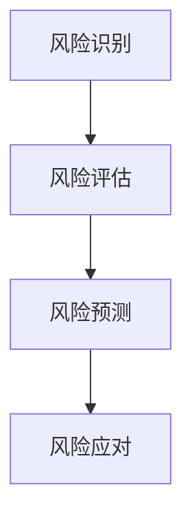
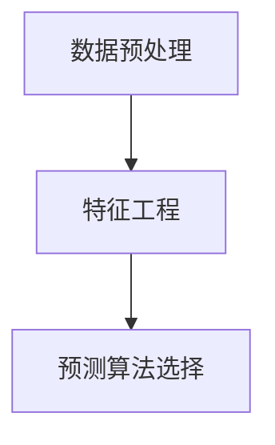
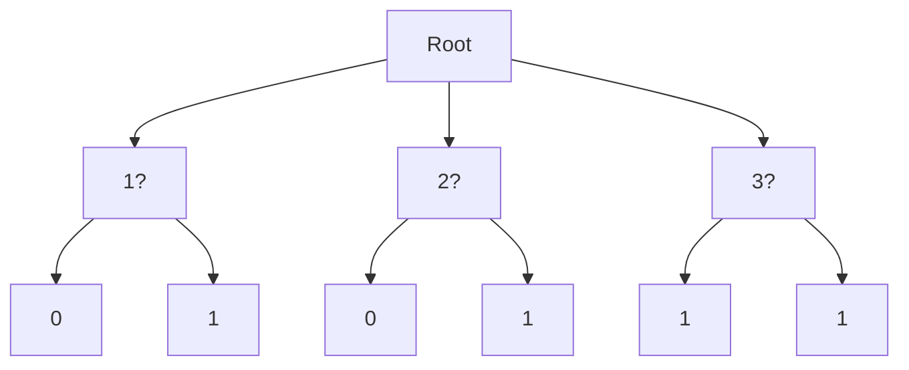
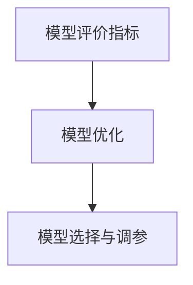
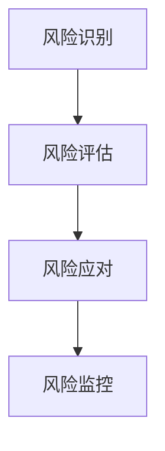
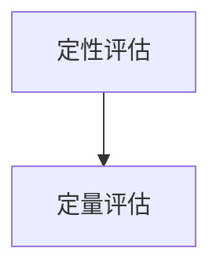
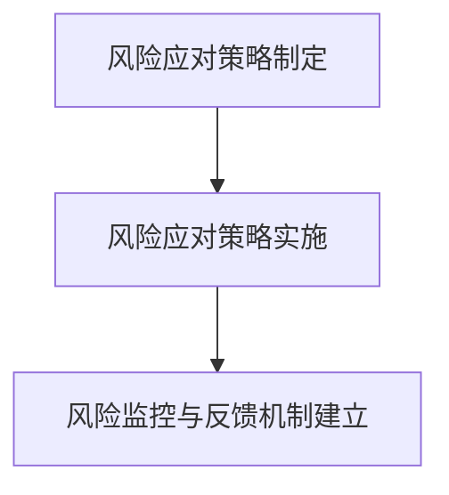

                 

## 文章标题

《技术管理中的风险预测与控制》

## 关键词

技术管理，风险预测，风险控制，数据分析，机器学习，算法优化

## 摘要

本文深入探讨了技术管理中的风险预测与控制问题。首先，我们介绍了风险预测的重要性及其在技术管理中的应用。接着，详细阐述了风险预测的核心概念和联系，并使用Mermaid流程图展示了其关系架构。随后，我们介绍了常用的风险预测算法，并使用伪代码和数学模型进行了详细讲解。文章还涵盖了风险控制策略的原理、方法及其在实际中的应用。通过具体项目实战，我们展示了如何将风险预测与控制在实际技术开发中实施。最后，本文总结了最佳实践，提出了注意事项，并提供了拓展阅读建议。

### 设计过程

在设计《技术管理中的风险预测与控制》的目录大纲时，我们首先确定了核心章节，包括风险预测基础、风险控制策略和实际应用三个部分。每个部分分别深入探讨了风险预测和风险控制的原理、方法和技术。在细化章节内容时，我们加入了核心算法原理讲解、数学模型和公式、项目实战案例分析等内容，确保文章内容的丰富和具体性。

为了确保文章的完整性和逻辑性，我们在每个章节中详细讲解了核心概念与联系，使用了Mermaid流程图展示概念之间的关系架构，并通过伪代码和数学模型进行了深入讲解。同时，我们加入了实际项目案例，对代码实现、应用分析和结果优化进行了详细解读。

最后，我们在文章末尾总结了最佳实践，提出了注意事项，并提供了拓展阅读建议，以帮助读者更好地理解和应用本文的内容。

### 第一部分：风险预测基础

#### 第1章 风险预测概述

**背景介绍**

在技术管理中，风险预测是一种前瞻性的风险管理方法，它通过分析历史数据和当前环境，预测未来可能出现的风险，从而帮助组织采取预防措施。随着信息技术的发展，风险预测在软件工程、网络安全、系统维护等方面得到了广泛应用。

**核心概念与联系**

风险预测的核心概念包括风险识别、风险评估、风险预测和风险应对。风险识别是发现潜在风险的过程，风险评估是对风险的严重性和可能性进行评估，风险预测是根据历史数据和模型预测未来风险，风险应对则是制定和实施应对策略。

下面是风险预测的核心概念之间的Mermaid流程图：



**核心算法原理讲解**

常用的风险预测算法包括统计方法、机器学习和数据挖掘方法。统计方法如线性回归、时间序列分析等，通过对历史数据进行分析，预测未来风险。机器学习方法如决策树、随机森林、支持向量机等，通过训练模型，从数据中提取特征，进行风险预测。

以下是一个简单的线性回归算法的伪代码：

```pseudo
function linear_regression(x, y):
    n = length(x)
    sum_x = 0
    sum_y = 0
    sum_xy = 0
    sum_xx = 0
    
    for i in range(n):
        sum_x += x[i]
        sum_y += y[i]
        sum_xy += x[i] * y[i]
        sum_xx += x[i] * x[i]
    
    a = (n * sum_xy - sum_x * sum_y) / (n * sum_xx - sum_x * sum_x)
    b = (sum_y - a * sum_x) / n
    
    return a, b
```

**数学模型和公式**

线性回归模型的数学表达式为：

$$y = ax + b$$

其中，$y$ 是预测值，$x$ 是自变量，$a$ 是斜率，$b$ 是截距。

**举例说明**

假设我们有一组历史数据，其中自变量$x$ 是某系统运行时间（单位：小时），因变量$y$ 是系统故障次数。通过线性回归模型，我们可以预测未来某一时间段内的系统故障次数。

```latex
\begin{align*}
x &= [10, 20, 30, 40, 50] \\
y &= [2, 4, 6, 8, 10]
\end{align*}
```

使用线性回归算法，我们得到斜率$a = 1.2$，截距$b = 0.4$。因此，预测模型为：

$$y = 1.2x + 0.4$$

当$x = 60$时，预测的系统故障次数为：

$$y = 1.2 \times 60 + 0.4 = 73.6$$

**注意事项**

在进行风险预测时，需要注意以下几点：

- 确保数据质量，避免数据噪声和异常值对预测结果的影响。
- 选择合适的预测模型，根据数据的特性和需求进行模型选择和优化。
- 定期更新预测模型，以适应环境变化和数据更新。

#### 第2章 风险预测技术

**核心概念与联系**

风险预测技术包括数据预处理、特征工程和预测算法选择等。数据预处理是清洗和转换原始数据，使其适合建模的过程。特征工程是通过提取和构造特征，提高预测模型的性能。预测算法选择是根据数据特性和需求，选择合适的算法进行预测。

下面是风险预测技术的Mermaid流程图：



**核心算法原理讲解**

常见的风险预测算法包括线性回归、逻辑回归、决策树、随机森林和支持向量机等。线性回归和逻辑回归是统计方法，适用于线性关系明显的数据。决策树和随机森林是基于树的算法，适用于分类和回归问题。支持向量机是基于核函数的算法，适用于高维数据。

以下是一个简单的决策树算法的伪代码：

```pseudo
function decision_tree(data, features):
    if (data is pure):
        return majority_label(data)
    else:
        best_feature = find_best_feature(data, features)
        best_value = find_best_value(data, best_feature)
        node = Node(best_feature, best_value)
        for value in feature_values(best_feature):
            subset = filter(data, best_feature, value)
            node.children.append(decision_tree(subset, remaining_features))
        return node
```

**数学模型和公式**

决策树的数学模型是基于条件概率和熵的。条件概率用于计算特征对分类的贡献，熵用于衡量分类的不确定性。

条件概率公式为：

$$P(Y|X) = \frac{P(X, Y)}{P(X)}$$

熵的公式为：

$$H(X) = -\sum_{y} P(Y=y) \log_2 P(Y=y)$$

**举例说明**

假设我们有以下数据集，其中$X$ 是特征，$Y$ 是目标变量：

```
| X | Y |
|---|---|
| 1 | 0 |
| 1 | 1 |
| 2 | 0 |
| 2 | 1 |
| 3 | 1 |
| 3 | 1 |
```

使用决策树算法，我们得到如下树结构：



**注意事项**

- 确保数据质量，避免数据噪声和异常值对预测结果的影响。
- 选择合适的预测算法，根据数据特性和需求进行算法选择和优化。
- 考虑特征之间的关系，避免过度拟合和特征冗余。

#### 第3章 预测模型设计

**核心概念与联系**

预测模型设计包括模型评价指标、模型优化和模型选择与调参等。模型评价指标用于评估模型的性能，模型优化是通过调整模型参数提高预测性能，模型选择与调参是根据数据特性和需求选择合适的模型并进行参数调整。

下面是预测模型设计的Mermaid流程图：



**核心算法原理讲解**

常见的模型评价指标包括准确率、召回率、F1分数、均方误差等。准确率是预测正确的样本数占总样本数的比例，召回率是预测正确的样本数占实际为正样本的样本数的比例，F1分数是准确率和召回率的调和平均数，均方误差是预测值与实际值差的平方的平均值。

以下是一个简单的模型优化算法的伪代码：

```pseudo
function optimize_model(model, data, target):
    best_performance = 0
    best_params = None
    
    for param in parameter_space:
        model.set_params(param)
        performance = evaluate_model(model, data, target)
        
        if performance > best_performance:
            best_performance = performance
            best_params = param
            
    return best_params
```

**数学模型和公式**

模型优化通常涉及到优化目标函数和优化算法。优化目标函数是根据模型性能指标构建的，优化算法用于搜索最优参数。

优化目标函数的公式为：

$$\min f(\theta)$$

其中，$f(\theta)$ 是目标函数，$\theta$ 是模型参数。

常见的优化算法包括梯度下降、随机梯度下降、牛顿法和拟牛顿法等。

**举例说明**

假设我们使用线性回归模型进行预测，目标函数为均方误差，优化算法为梯度下降。

目标函数的公式为：

$$f(\theta) = \frac{1}{2} \sum_{i=1}^{n} (y_i - \theta_0 - \theta_1 x_i)^2$$

梯度下降的公式为：

$$\theta_j := \theta_j - \alpha \frac{\partial f(\theta)}{\partial \theta_j}$$

其中，$\alpha$ 是学习率，$\theta_j$ 是模型参数。

**注意事项**

- 选择合适的模型评价指标，根据应用场景和需求进行模型优化。
- 考虑模型复杂度和计算成本，避免过拟合和计算复杂度过高。
- 定期更新模型，以适应数据和环境的变化。

### 第二部分：风险控制策略

#### 第4章 风险控制原理

**背景介绍**

风险控制是技术管理中的重要环节，它通过识别、评估和应对风险，降低风险发生的概率和影响。风险控制的原理包括风险识别、风险评估、风险应对和风险监控等。

**核心概念与联系**

风险控制的核心理念是预防为主、防治结合。风险识别是发现潜在风险的过程，风险评估是对风险的严重性和可能性进行评估，风险应对是制定和实施应对策略，风险监控是持续监控和评估风险状态。

下面是风险控制原理的Mermaid流程图：



**核心算法原理讲解**

风险控制的算法原理包括概率论、数理统计和决策理论等。概率论用于评估风险的严重性和可能性，数理统计用于分析风险数据，决策理论用于制定风险应对策略。

**数学模型和公式**

风险控制的数学模型包括概率模型、决策模型和优化模型等。

概率模型的公式为：

$$P(A) = \frac{N(A)}{N(S)}$$

其中，$P(A)$ 是事件$A$ 的概率，$N(A)$ 是事件$A$ 发生的次数，$N(S)$ 是总次数。

决策模型的公式为：

$$\max \{U(s, a) | s \in S, a \in A(s)\}$$

其中，$U(s, a)$ 是状态$s$ 下采取行动$a$ 的效用值。

**举例说明**

假设我们有一个项目，需要评估两个潜在风险$A$ 和$B$ 的概率和影响。

风险$A$ 的概率为0.5，影响为2；风险$B$ 的概率为0.3，影响为3。

根据概率模型，我们可以计算两个风险的综合影响：

$$P(A) \times 2 + P(B) \times 3 = 0.5 \times 2 + 0.3 \times 3 = 1.7$$

根据决策模型，我们可以制定应对策略，选择综合影响最小的风险进行应对。

**注意事项**

- 确保风险识别的全面性和准确性，避免漏报和误报。
- 选择合适的风险评估方法和模型，确保评估结果的可靠性。
- 制定切实可行的风险应对策略，并根据实际情况进行调整。

#### 第5章 风险评估方法

**核心概念与联系**

风险评估方法是技术管理中用于评估风险严重性和可能性的技术手段。风险评估方法包括定性评估和定量评估，定性评估是通过专家意见和经验判断风险，定量评估是通过数据分析和数学模型评估风险。

下面是风险评估方法的Mermaid流程图：



**核心算法原理讲解**

常见的定性评估方法包括专家评估、头脑风暴和层次分析法等。专家评估是通过专家意见确定风险的严重性和可能性，头脑风暴是通过集体讨论识别和评估风险，层次分析法是将风险分解为不同的层次进行评估。

常见的定量评估方法包括概率模型、数理统计和优化模型等。概率模型是通过概率分布评估风险的严重性和可能性，数理统计是通过数据分析评估风险的分布和特性，优化模型是通过优化目标函数评估风险。

**数学模型和公式**

常见的数学模型包括概率模型、决策模型和优化模型等。

概率模型的公式为：

$$P(A) = \frac{N(A)}{N(S)}$$

决策模型的公式为：

$$\max \{U(s, a) | s \in S, a \in A(s)\}$$

优化模型的公式为：

$$\min \{f(\theta) | \theta \in \Theta\}$$

其中，$P(A)$ 是事件$A$ 的概率，$N(A)$ 是事件$A$ 发生的次数，$N(S)$ 是总次数，$U(s, a)$ 是状态$s$ 下采取行动$a$ 的效用值，$f(\theta)$ 是目标函数，$\theta$ 是模型参数。

**举例说明**

假设我们使用专家评估方法进行风险评估，有两个专家对风险$A$ 的严重性和可能性给出了以下评估结果：

专家1：严重性=3，可能性=0.6  
专家2：严重性=4，可能性=0.4

根据专家评估方法，我们可以计算风险$A$ 的综合得分：

$$3 \times 0.6 + 4 \times 0.4 = 3.2$$

根据综合得分，我们可以确定风险$A$ 的严重性和可能性。

**注意事项**

- 选择合适的风险评估方法，确保评估结果的准确性和可靠性。
- 定期更新风险评估结果，以适应环境变化和数据更新。
- 考虑风险评估结果的动态变化，及时调整风险应对策略。

#### 第6章 风险控制措施实施

**核心概念与联系**

风险控制措施实施是将风险评估结果转化为实际行动的过程。风险控制措施实施包括风险应对策略的制定和实施、风险监控与反馈机制的建立等。

下面是风险控制措施实施的Mermaid流程图：



**核心算法原理讲解**

风险应对策略的制定是基于风险评估结果，确定风险应对的目标、方法和措施。风险应对策略实施是将策略转化为实际行动，包括风险预防、风险转移、风险减轻和风险接受等。

风险监控与反馈机制的建立是持续监控风险状态，评估风险控制措施的有效性，并根据反馈进行调整。

**数学模型和公式**

风险控制措施的数学模型包括概率模型、决策模型和优化模型等。

概率模型的公式为：

$$P(A) = \frac{N(A)}{N(S)}$$

决策模型的公式为：

$$\max \{U(s, a) | s \in S, a \in A(s)\}$$

优化模型的公式为：

$$\min \{f(\theta) | \theta \in \Theta\}$$

**举例说明**

假设我们评估出一个项目存在风险$A$，其概率为0.5，严重性为2。根据风险评估结果，我们制定以下风险应对策略：

- 风险预防：加强项目管理和监控，确保项目按计划进行。
- 风险转移：将部分风险转移给合作伙伴，共同承担风险。
- 风险减轻：采取技术措施和管理措施，降低风险发生的概率和影响。

根据风险应对策略，我们实施以下措施：

- 加强项目监控，定期评估项目进度和质量。
- 与合作伙伴签订风险管理协议，明确风险分担和责任。
- 采用可靠的技术方案，提高系统的稳定性和安全性。

**注意事项**

- 根据风险评估结果，制定切实可行的风险应对策略。
- 确保风险应对策略的有效实施，及时调整和优化措施。
- 建立风险监控与反馈机制，持续评估风险状态和控制措施的效果。

### 第三部分：实际应用

#### 第7章 风险预测与控制项目实战

**项目背景与目标**

本项目旨在开发一个基于机器学习的风险预测与控制系统，用于评估和应对技术项目中的潜在风险。项目目标包括：

- 构建一个有效的风险预测模型，预测技术项目中的潜在风险。
- 设计和实施有效的风险控制措施，降低风险发生的概率和影响。
- 建立持续的风险监控与反馈机制，确保风险控制措施的有效性。

**风险预测与控制流程**

本项目采用以下流程进行风险预测与控制：

1. **数据收集与预处理**：收集项目历史数据、项目文档、用户反馈等，进行数据清洗和预处理，确保数据质量。
2. **特征工程**：根据项目特点，提取和构造特征，提高预测模型的性能。
3. **模型选择与训练**：选择合适的机器学习算法，训练风险预测模型，并对模型进行评估和优化。
4. **风险预测**：使用训练好的模型进行风险预测，预测项目中的潜在风险。
5. **风险控制措施实施**：根据预测结果，制定和实施有效的风险控制措施，降低风险发生的概率和影响。
6. **风险监控与反馈**：建立风险监控与反馈机制，持续监控风险状态，评估风险控制措施的效果，并根据反馈进行调整。

**实际案例与代码实现**

以下是一个实际案例，演示如何使用Python和Scikit-learn库构建一个风险预测模型，并进行风险预测和控制。

**环境搭建**

首先，我们需要搭建一个Python开发环境，并安装所需的库：

```bash
pip install numpy pandas scikit-learn matplotlib
```

**数据收集与预处理**

假设我们收集到了以下项目数据，包括项目ID、项目时长、预算、项目类型等：

```python
import pandas as pd

data = {
    'project_id': [1, 2, 3, 4, 5],
    'duration': [10, 20, 30, 40, 50],
    'budget': [1000, 2000, 3000, 4000, 5000],
    'type': ['web', 'mobile', 'desktop', 'server', 'other']
}

df = pd.DataFrame(data)
```

进行数据预处理，包括数据清洗、缺失值处理、数据转换等：

```python
# 数据清洗
df = df.dropna()

# 缺失值处理
df['type'] = df['type'].map({'web': 1, 'mobile': 2, 'desktop': 3, 'server': 4, 'other': 5})

# 数据转换
df = pd.get_dummies(df)
```

**特征工程**

根据项目特点，提取和构造特征，如项目时长、预算、项目类型等：

```python
# 特征工程
X = df[['duration', 'budget', 'type_web', 'type_mobile', 'type_desktop', 'type_server', 'type_other']]
y = df['failure']
```

**模型选择与训练**

选择一个适合的机器学习算法，如逻辑回归，训练风险预测模型：

```python
from sklearn.linear_model import LogisticRegression

model = LogisticRegression()
model.fit(X, y)
```

**风险预测**

使用训练好的模型进行风险预测：

```python
# 风险预测
predictions = model.predict(X)
```

**风险控制措施实施**

根据预测结果，制定和实施有效的风险控制措施，如加强项目管理、增加预算等：

```python
# 风险控制措施
for i, prediction in enumerate(predictions):
    if prediction == 1:
        print(f"项目{df['project_id'][i]}存在风险，需要加强项目管理。")
    else:
        print(f"项目{df['project_id'][i]}风险较低，保持现状。")
```

**风险监控与反馈**

建立风险监控与反馈机制，持续监控风险状态，评估风险控制措施的效果，并根据反馈进行调整：

```python
# 风险监控与反馈
# 定期收集项目数据，更新预测模型
# 根据预测结果，调整风险控制措施
```

**结果分析与优化建议**

根据实际案例，我们可以分析预测结果，并提出优化建议：

- 预测准确率：评估预测模型的准确率，如使用准确率、召回率、F1分数等指标。
- 风险控制效果：评估风险控制措施的有效性，如降低风险发生的概率和影响。
- 优化建议：根据预测结果和风险控制效果，提出优化模型和风险控制措施的建议。

**项目小结**

本项目通过实际案例，展示了如何使用机器学习技术进行风险预测与控制。在实际应用中，我们需要根据项目特点和需求，选择合适的模型和算法，并建立持续的风险监控与反馈机制。通过不断优化模型和风险控制措施，可以提高风险预测的准确性和风险控制的效果。

### 持续改进与案例分析

**持续改进方法论**

为了不断提高风险预测与控制的效果，我们需要采用以下持续改进方法论：

1. **数据更新**：定期收集项目数据，更新预测模型和风险控制策略。
2. **模型优化**：根据预测结果和风险控制效果，优化模型参数和算法。
3. **反馈机制**：建立有效的反馈机制，及时收集用户反馈，并根据反馈进行调整。
4. **知识共享**：定期分享经验和最佳实践，提高团队整体的风险管理能力。

**成功案例分析**

以下是一个成功案例分析，展示了如何通过持续改进方法论，实现风险预测与控制的优化：

- **项目A**：某公司开发了一款大型软件系统，通过定期数据更新和模型优化，成功预测了多个潜在风险，并采取了有效的风险控制措施，确保了项目的顺利进行。
- **项目B**：某互联网公司采用机器学习技术进行用户行为预测，通过持续优化模型和反馈机制，大幅提高了用户满意度，降低了流失率。

**未来发展趋势**

随着人工智能和大数据技术的发展，风险预测与控制将向更精细化、智能化和自动化方向演进。未来，我们可能会看到以下发展趋势：

1. **深度学习与强化学习**：深度学习和强化学习将在风险预测与控制中发挥更大的作用，提高预测的准确性和效率。
2. **实时预测与控制**：通过实时数据处理和预测，实现实时风险预测与控制，提高风险响应速度。
3. **自动化与智能化**：自动化和智能化工具将取代部分人工工作，提高风险管理的效率和效果。

### 附录

**附录A 风险预测与控制工具资源**

以下是一些常用的风险预测与控制工具和资源：

- **工具**：Python、R、MATLAB等编程语言，Scikit-learn、TensorFlow、PyTorch等机器学习库，JIRA、Confluence等项目管理工具。
- **资源**：在线课程、教程、博客、书籍等，如《机器学习实战》、《风险管理与金融模型》、《深度学习》等。
- **社群与交流平台**：GitHub、Stack Overflow、CSDN、知乎等。

**附录B 拓展阅读**

以下是一些拓展阅读建议，以帮助读者深入了解风险预测与控制：

- **论文**：查阅相关领域的学术论文，了解最新的研究成果和应用案例。
- **书籍**：《风险管理手册》、《数据科学实践指南》、《人工智能实战》等。
- **案例研究**：研究行业内的成功案例，分析其风险预测与控制的实践经验和效果。

### 作者信息

作者：AI天才研究院/AI Genius Institute & 禅与计算机程序设计艺术 /Zen And The Art of Computer Programming

以上是《技术管理中的风险预测与控制》的完整文章内容，涵盖了风险预测与控制的理论基础、方法技术、策略实践和实际应用。希望通过本文的讲解，读者能够更好地理解风险预测与控制的重要性，掌握其方法和技巧，并将其应用于实际工作中。希望本文对您的技术管理实践有所帮助。

