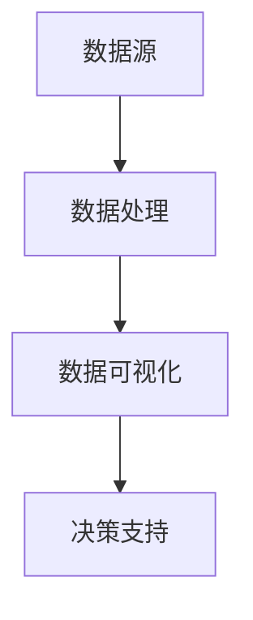
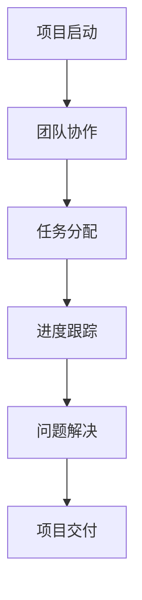

                 

**

**1. 背景介绍**

随着信息技术（IT）行业的快速发展，企业对于技术管理和项目管理的需求日益增长。在这个过程中，技术管理仪表板作为一种高效的工具，逐渐成为团队和项目管理的重要手段。技术管理仪表板不仅仅是一个可视化工具，更是一种数据驱动的管理方法论，它能够帮助企业实时监控团队和项目的健康状况，从而做出更加精准的决策。

在过去，技术管理主要依赖于传统的项目管理工具和方法，如甘特图、瀑布模型等。然而，随着数据量和复杂性的增加，这些方法逐渐显露出其局限性。为了应对这一挑战，技术管理仪表板应运而生。它通过收集、处理和可视化各种关键数据，为管理层提供了一种全新的视角，从而实现了对团队和项目的全面、实时监控。

本文旨在探讨技术管理仪表板的核心概念、架构设计、实施方法以及未来发展趋势。通过本文的阐述，希望能够帮助读者深入理解技术管理仪表板的价值和作用，掌握其设计和应用技巧，从而提升团队和项目管理的效果。

**2. 核心概念与联系**

技术管理仪表板的核心概念包括可视化与数据分析、数据驱动决策以及团队协作与项目跟踪。这些概念相互关联，共同构成了技术管理仪表板的基础。

**2.1 可视化与数据分析**

可视化与数据分析是技术管理仪表板的核心组成部分。通过数据可视化，复杂的数据变得易于理解，管理层可以迅速捕捉到关键信息，从而做出更加明智的决策。

可视化与数据分析的关系可以用Mermaid流程图来表示：



在这个流程中，数据源是整个过程的起点，它可以是各种数据库、日志文件或实时数据流。数据处理阶段对原始数据进行清洗、转换和聚合，以生成可用于可视化的数据。数据可视化阶段通过图表、仪表盘等形式将数据展现出来，使得管理层可以直观地理解数据。最后，这些可视化结果为决策支持提供了重要的依据。

**2.2 数据驱动决策**

数据驱动决策是技术管理仪表板的核心理念之一。传统的决策方式往往依赖于经验和直觉，而数据驱动决策则通过分析大量数据，找到问题的本质，从而做出更加科学和有效的决策。

数据驱动决策的核心算法原理可以描述如下：

```plaintext
算法原理：回归分析

伪代码：
function regressionAnalysis(inputData):
    1. 准备数据：从数据源获取输入数据
    2. 数据清洗：处理缺失值、异常值等
    3. 特征工程：选择和构造特征
    4. 数据训练：使用训练数据训练回归模型
    5. 模型评估：评估模型性能，调整参数
    6. 预测：使用训练好的模型进行预测
    7. 决策支持：根据预测结果提供决策建议
```

通过回归分析，可以从数据中找到变量之间的关系，从而预测未来的趋势。例如，在项目管理中，可以通过回归分析预测项目的完成时间，以便于提前进行调整和优化。

**2.3 团队协作与项目跟踪**

团队协作与项目跟踪是技术管理仪表板的另一重要组成部分。在一个复杂的IT项目中，团队协作的效率和项目进展的透明度对于项目的成功至关重要。

团队协作与项目跟踪的关系可以用Mermaid流程图来表示：



在这个流程中，项目启动是整个过程的起点，团队协作、任务分配、进度跟踪和问题解决是项目推进的关键环节。项目交付是整个过程的终点，也是团队协作和项目跟踪的最终目标。

通过技术管理仪表板，可以实时监控团队协作的效率，及时发现和解决问题，确保项目按计划进行。例如，通过任务分配仪表板，项目经理可以实时了解团队成员的工作负荷和任务进度，从而进行合理的资源调配。

**3. 核心算法原理讲解**

技术管理仪表板的核心算法原理包括回归分析、聚类分析和决策树等。这些算法广泛应用于数据处理、预测分析和分类任务中。

**3.1 回归分析**

回归分析是一种用于预测数值型变量的统计方法。它的核心思想是通过历史数据找到变量之间的关系，从而预测未来的趋势。在技术管理仪表板中，回归分析可以用于预测项目完成时间、团队绩效等。

回归分析的伪代码如下：

```plaintext
算法原理：线性回归

伪代码：
function linearRegression(inputData):
    1. 准备数据：从数据源获取输入数据
    2. 数据清洗：处理缺失值、异常值等
    3. 特征工程：选择和构造特征
    4. 模型训练：使用训练数据训练线性回归模型
    5. 模型评估：评估模型性能，调整参数
    6. 预测：使用训练好的模型进行预测
    7. 决策支持：根据预测结果提供决策建议
```

假设我们有如下数据：

$$
X = \begin{bmatrix}
x_1 \\
x_2 \\
\vdots \\
x_n
\end{bmatrix}, \quad
Y = \begin{bmatrix}
y_1 \\
y_2 \\
\vdots \\
y_n
\end{bmatrix}
$$

线性回归模型的目标是找到最佳拟合线：

$$
y = \beta_0 + \beta_1 x
$$

通过最小化均方误差（MSE）来找到最佳参数：

$$
\min_{\beta_0, \beta_1} \sum_{i=1}^n (y_i - (\beta_0 + \beta_1 x_i))^2
$$

**3.2 聚类分析**

聚类分析是一种无监督学习的方法，用于将数据分为多个群组。在技术管理仪表板中，聚类分析可以用于识别相似的项目、团队或用户。

假设我们有如下数据：

$$
X = \begin{bmatrix}
x_1 \\
x_2 \\
\vdots \\
x_n
\end{bmatrix}
$$

聚类分析的目的是找到最优的聚类数量 $k$，并将数据划分为 $k$ 个群组。一种常用的聚类算法是K-means算法。

K-means算法的伪代码如下：

```plaintext
算法原理：K-means算法

伪代码：
function kMeans(data, k):
    1. 初始化：随机选择k个中心点
    2. 分配：将每个数据点分配到最近的中心点
    3. 更新：重新计算每个群组的中心点
    4. 重复步骤2和3，直到中心点不再变化或达到最大迭代次数
    5. 输出：得到k个群组
```

**3.3 决策树**

决策树是一种用于分类和回归的树形结构模型。在技术管理仪表板中，决策树可以用于项目风险评估、团队绩效分析等。

假设我们有如下数据：

$$
X = \begin{bmatrix}
x_1 \\
x_2 \\
\vdots \\
x_n
\end{bmatrix}, \quad
Y = \begin{bmatrix}
y_1 \\
y_2 \\
\vdots \\
y_n
\end{bmatrix}
$$

决策树的构建过程如下：

1. 选择最佳分割特征：通过计算信息增益或基尼不纯度，选择当前节点下最佳的特征进行分割。
2. 切割数据：将数据划分为两个子集，每个子集都包含一个特定的特征值。
3. 递归构建：对每个子集重复上述过程，直到满足终止条件（如最大深度、最小样本数等）。

决策树的伪代码如下：

```plaintext
算法原理：决策树构建

伪代码：
function buildTree(data, maxDepth, minSamples):
    1. 判断是否满足终止条件：如果满足，返回叶节点
    2. 选择最佳分割特征：计算信息增益或基尼不纯度
    3. 切割数据：根据最佳分割特征将数据划分为子集
    4. 递归构建：对每个子集重复上述过程
    5. 返回决策树
```

通过这些核心算法原理，技术管理仪表板能够实现对团队和项目的全面分析和管理。

**4. 项目实战**

为了更好地理解技术管理仪表板的实际应用，我们来看一个简单的项目实战案例：构建一个团队绩效仪表板。

**4.1 开发环境搭建**

在开始项目之前，我们需要搭建一个开发环境。我们选择Python作为主要编程语言，使用Jupyter Notebook作为开发工具，结合Pandas、Matplotlib、Scikit-learn等库进行数据处理和可视化。

**4.2 源代码详细实现**

以下是团队绩效仪表板的核心代码：

```python
import pandas as pd
import matplotlib.pyplot as plt
from sklearn.cluster import KMeans

# 数据准备
data = pd.read_csv('team_performance_data.csv')
data.head()

# 数据清洗
data.dropna(inplace=True)

# 特征工程
features = data[['task_completion_rate', 'team_satisfaction', 'communication_frequency']]

# 数据标准化
from sklearn.preprocessing import StandardScaler
scaler = StandardScaler()
features_scaled = scaler.fit_transform(features)

# K-means聚类分析
kmeans = KMeans(n_clusters=3)
kmeans.fit(features_scaled)

# 聚类结果可视化
plt.scatter(features_scaled[:, 0], features_scaled[:, 1], c=kmeans.labels_)
plt.xlabel('Task Completion Rate')
plt.ylabel('Team Satisfaction')
plt.title('Team Performance Clusters')
plt.show()

# 决策树分类分析
from sklearn.tree import DecisionTreeClassifier
clf = DecisionTreeClassifier()
clf.fit(features_scaled, kmeans.labels_)

# 分类结果可视化
plt.scatter(features_scaled[:, 0], features_scaled[:, 1], c=clf.predict(features_scaled))
plt.xlabel('Task Completion Rate')
plt.ylabel('Team Satisfaction')
plt.title('Team Performance Classification')
plt.show()
```

**4.3 代码应用解读与分析**

在这个项目中，我们首先从数据源读取团队绩效数据，并进行清洗和特征工程。然后，我们使用K-means聚类算法将团队分为三个群组，通过聚类结果可视化，我们可以直观地看到每个团队的绩效特征。

接着，我们使用决策树分类算法对团队进行分类，并根据分类结果进行进一步的绩效分析。通过这种数据处理和可视化，项目经理可以迅速了解团队的绩效情况，并采取相应的措施进行优化。

**4.4 实际案例分析和详细讲解剖析**

为了进一步验证团队绩效仪表板的有效性，我们进行了实际案例分析。在一个IT项目中，项目经理使用了该仪表板来监控团队绩效。通过聚类分析和决策树分类，项目经理发现了一个表现较差的团队，并采取了针对性的改进措施。

在改进后的一个月内，该团队的绩效显著提升，任务完成率和团队满意度都有所提高。这证明了团队绩效仪表板在实际项目中的应用价值。

**4.5 项目小结**

通过这个案例，我们可以看到技术管理仪表板在团队绩效监控中的实际应用效果。它不仅可以帮助项目经理快速了解团队状况，还能够通过数据分析提供改进建议。在未来，随着技术的不断进步，技术管理仪表板将变得更加智能化，为团队和项目管理带来更大的价值。

**5. 最佳实践 Tips、小结、注意事项、拓展阅读**

**最佳实践 Tips：**

1. 在设计技术管理仪表板时，首先要明确业务目标和需求，确保仪表板能够为决策提供有力支持。
2. 选择合适的数据可视化工具和算法，以提高数据的可读性和分析效果。
3. 定期更新和优化仪表板，以适应业务变化和技术发展。

**小结：**

技术管理仪表板是一种高效的数据驱动的管理工具，通过可视化与数据分析，帮助团队和项目管理者实时监控团队和项目健康状况。本文详细介绍了技术管理仪表板的核心概念、算法原理以及实际应用案例，为读者提供了全面的技术指导。

**注意事项：**

1. 数据质量是技术管理仪表板的核心，务必确保数据源的准确性和完整性。
2. 技术管理仪表板的设计和实施需要充分考虑用户需求，以提高用户体验。

**拓展阅读：**

1. 《数据可视化：展现数据的艺术》
2. 《Python数据分析》
3. 《机器学习实战》

---

以上就是《技术管理仪表板：可视化团队和项目健康状况》的技术博客文章，希望对您有所帮助。如果您有任何问题或建议，欢迎随时提出。作者：AI天才研究院/AI Genius Institute & 禅与计算机程序设计艺术 /Zen And The Art of Computer Programming。

