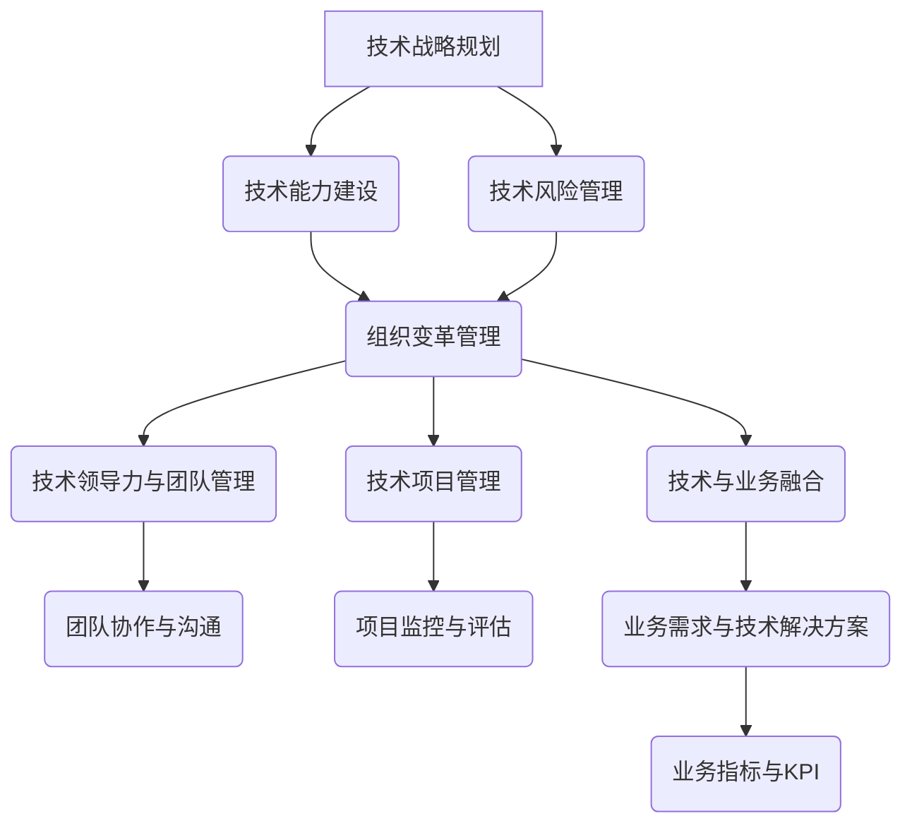

                 


### 第一步：引言部分

**文章标题：技术管理影响力：如何在组织中推动技术变革**

**关键词：技术管理，组织变革，技术领导力，项目管理，业务融合**

**摘要：**
本文将深入探讨技术管理在组织中的重要性，分析技术变革的驱动力和挑战，并提供实用的指导和方法，帮助技术管理者在组织中推动技术变革，提高组织的竞争力。

---

### 第二步：技术管理核心概念

**2.1 技术管理的定义与重要性**

技术管理是指如何有效地管理和利用技术资源，以实现组织的目标。它涵盖了技术战略规划、技术能力建设和技术风险管理等方面。技术管理的重要性体现在以下几个方面：

1. **提升竞争力**：通过技术管理，组织可以更有效地利用技术资源，提高产品和服务的质量，从而在市场上获得竞争优势。
2. **促进创新**：技术管理有助于激发组织的创新潜力，推动新技术的研究和应用，为组织的持续发展提供动力。
3. **确保安全性**：技术管理还包括技术风险管理，通过识别和应对技术风险，确保组织的运营安全。

**2.2 技术管理的影响力**

技术管理的影响力不仅体现在组织内部，还体现在组织与外部环境的关系中。一方面，技术管理直接影响组织的竞争力、创新能力和可持续发展；另一方面，技术管理也受到外部环境的影响，如市场需求、技术趋势和法规要求。

**2.3 本书目标与结构**

本书旨在提供全面的技术管理知识，帮助技术管理者在组织中推动技术变革。全书分为以下几个部分：

- **引言**：介绍技术管理的定义、重要性和影响力。
- **技术管理核心概念**：详细探讨技术管理的各个关键要素。
- **组织中的技术变革**：分析技术变革的驱动力和管理框架。
- **技术领导力与团队管理**：讨论技术领导力的要素和团队管理策略。
- **技术项目管理**：介绍技术项目的生命周期和项目管理方法。
- **技术与业务融合**：探讨技术与业务的结合点。
- **技术变革中的挑战与应对**：分析技术变革的挑战和应对策略。
- **案例研究**：通过实际案例探讨成功的技术变革实践。
- **结论与展望**：总结技术管理的未来趋势和行动指南。

### 第三步：组织中的技术变革

**3.1 技术变革的驱动力**

技术变革的驱动力可以分为内部驱动力和外部驱动力。

**内部驱动力**包括：

1. **组织对创新的渴望**：组织希望通过创新来提高产品和服务的质量，满足市场需求。
2. **提高效率**：组织希望通过技术变革来提高运营效率，降低成本。
3. **应对市场变化**：组织需要通过技术变革来适应市场的快速变化。

**外部驱动力**包括：

1. **市场需求**：客户对产品和服务的要求不断提高，迫使组织进行技术变革。
2. **技术趋势**：新兴技术的出现和发展，为组织提供了新的机遇和挑战。
3. **法规要求**：法规的变化可能迫使组织进行技术变革，以确保合规。

**3.2 技术变革的管理框架**

技术变革的管理框架通常包括以下几个关键步骤：

1. **评估变革需求**：确定组织需要变革的领域和原因。
2. **制定变革计划**：明确变革的目标、时间表和资源需求。
3. **启动变革项目**：组织变革团队，明确职责和角色，开始实施变革。
4. **实施变革**：按照计划执行变革，解决出现的问题和挑战。
5. **评估变革效果**：评估变革的成果，根据反馈进行调整。

### 第四步：技术领导力与团队管理

**4.1 技术领导力的要素**

技术领导力是技术管理的关键要素之一。技术领导者需要具备以下要素：

1. **技术愿景与目标**：明确组织的长期技术愿景和短期目标，为团队提供方向。
2. **领导者的技能与特质**：具备技术领域的专业知识和领导能力，能够激励和引导团队。
3. **团队建设与管理**：建立高效的团队，明确团队成员的角色和责任，促进团队协作。

**4.2 团队管理策略**

团队管理策略包括以下几个方面：

1. **明确目标与责任**：为团队成员设定清晰的目标和责任，确保每个人都清楚自己的工作内容。
2. **沟通与协作**：建立有效的沟通渠道，促进团队成员之间的协作和信息共享。
3. **激励与参与**：激励团队成员积极参与技术变革，提高团队士气和工作效率。

### 第五步：技术项目管理

**5.1 技术项目的生命周期**

技术项目的生命周期通常包括以下几个阶段：

1. **项目启动与规划**：明确项目的目标、范围和资源需求，制定项目计划。
2. **项目执行与监控**：按照计划执行项目任务，监控项目进度和质量。
3. **项目收尾与评估**：完成项目任务，进行项目总结和评估，为未来项目提供经验。

**5.2 项目管理方法**

项目管理方法包括以下几个方面：

1. **需求管理**：明确项目需求，确保项目满足业务需求。
2. **时间管理**：制定项目时间表，确保项目按期完成。
3. **风险管理**：识别和应对项目风险，确保项目顺利进行。
4. **质量管理**：确保项目输出符合质量要求，提高客户满意度。

### 第六步：技术与业务融合

**6.1 技术与业务的结合点**

技术与业务的融合需要找到技术与业务需求的结合点，确保技术投入能够产生实际业务价值。结合点包括：

1. **业务需求与技术解决方案**：分析业务需求，提出合适的技术解决方案。
2. **跨部门协作与沟通**：促进不同部门之间的协作和沟通，确保技术实施与业务目标的一致性。
3. **业务指标与KPI**：设定业务指标和KPI，衡量技术投入对业务的价值。

### 第七步：技术变革中的挑战与应对

**7.1 技术变革的常见挑战**

技术变革过程中可能面临以下挑战：

1. **组织惯性与变革阻力**：组织习惯于现有工作方式，对新技术的接受程度可能较低。
2. **技术风险与管理问题**：新技术可能带来不确定性和风险，管理难度加大。
3. **人才短缺与技能提升**：技术变革可能需要新技能和人才，组织需要相应地培训和招聘。

**7.2 应对策略与最佳实践**

应对技术变革的挑战，可以采取以下策略：

1. **激励与参与策略**：激励员工积极参与技术变革，提高员工的接受度和参与度。
2. **沟通与透明度**：建立有效的沟通渠道，确保员工了解技术变革的背景、目标和进展。
3. **学习与适应能力**：提升组织的学习和适应能力，快速应对技术变革带来的挑战。

### 第八步：案例研究

**8.1 案例选择与介绍**

本章节通过以下案例，探讨成功的技术变革实践：

- **案例1**：一家传统制造企业通过数字化转型实现生产效率提升。
- **案例2**：一家互联网公司通过技术创新实现商业模式创新。

**8.2 案例分析与总结**

通过对案例的分析，总结出以下关键要素：

1. **明确变革目标**：明确技术变革的目标，确保变革方向正确。
2. **领导力与团队协作**：技术领导者的领导力对变革的成功至关重要，团队协作是变革实施的基础。
3. **持续沟通与反馈**：持续与员工沟通，获取反馈，确保变革的顺利进行。

**8.3 案例中的关键要素**

案例中的关键要素包括：

1. **技术解决方案**：根据业务需求选择合适的技术解决方案。
2. **变革管理**：建立有效的变革管理机制，确保变革的有序进行。
3. **培训与支持**：为员工提供必要的培训和指导，帮助员工适应新环境。

### 第九步：结论与展望

**9.1 技术管理的未来趋势**

技术管理的未来趋势包括：

1. **数字化转型**：随着数字化技术的快速发展，技术管理将在数字化转型中发挥关键作用。
2. **人工智能与自动化**：人工智能和自动化的应用将提高技术管理的效率和精度。
3. **可持续发展**：技术管理将更加注重可持续发展，推动绿色技术的应用。

**9.2 建议与行动指南**

针对技术管理者，以下是一些建议和行动指南：

1. **强化领导力**：提升自己的领导力，成为变革的推动者。
2. **注重沟通与协作**：建立有效的沟通渠道，促进团队协作。
3. **持续学习与创新**：保持对新技术和新理念的关注，不断学习和创新。

---

**作者：AI天才研究院/AI Genius Institute & 禅与计算机程序设计艺术 /Zen And The Art of Computer Programming** 

### 简单易懂的Mermaid流程图

在技术管理影响力：如何在组织中推动技术变革的文章中，我们可以使用Mermaid流程图来直观地展示技术管理核心概念之间的联系。以下是使用Mermaid语法绘制的示例：



这段代码将生成一个流程图，展示了技术管理的各个核心概念及其相互关系。Mermaid流程图使得复杂的概念关系变得直观易懂，有助于读者更好地理解和吸收文章内容。

### 核心算法原理讲解

在《技术管理影响力：如何在组织中推动技术变革》这篇文章中，我们将探讨技术项目管理中的关键算法原理。技术项目管理中，任务调度算法是核心之一，它负责优化资源分配和任务执行顺序，以提高项目的效率。以下是一个简单的任务调度算法的伪代码，用于解释基本原理。

**伪代码：任务调度算法**

```
Algorithm TaskScheduler(tasks, resources):
    Input: tasks - a list of tasks with their durations and required resources
           resources - a list of available resources
    
    Output: schedule - a list of tasks ordered by optimal execution order

    1. Sort tasks based on their total required resources
    2. Initialize an empty schedule
    3. For each task in tasks:
        3.1. Find the first resource in resources that is available
        3.2. Assign the task to the available resource
        3.3. Add the task to the schedule
        3.4. Update the resource availability
    4. Return the schedule
```

**详细解释：**

- **步骤1**：对任务列表进行排序，排序依据是任务所需的总资源量。这样可以确保资源利用效率最高的任务优先执行。
- **步骤2**：初始化一个空的任务调度列表。
- **步骤3**：遍历任务列表，对每个任务执行以下操作：
  - **步骤3.1**：查找第一个可用的资源。
  - **步骤3.2**：将任务分配给可用的资源。
  - **步骤3.3**：将任务添加到调度列表。
  - **步骤3.4**：更新资源的状态，标记已分配的资源为不可用。
- **步骤4**：返回调度列表。

**举例说明：**

假设我们有以下任务列表和资源列表：

```
tasks = [
    {"name": "TaskA", "duration": 3, "resources": [1, 2]},
    {"name": "TaskB", "duration": 5, "resources": [2, 3]},
    {"name": "TaskC", "duration": 2, "resources": [1, 3]}
]

resources = [
    {"name": "Resource1", "available": True},
    {"name": "Resource2", "available": True},
    {"name": "Resource3", "available": True}
]
```

使用上述任务调度算法，我们首先对任务进行排序，根据所需资源量：

```
tasks = [
    {"name": "TaskC", "duration": 2, "resources": [1, 3]},
    {"name": "TaskA", "duration": 3, "resources": [1, 2]},
    {"name": "TaskB", "duration": 5, "resources": [2, 3]}
]
```

然后，我们按照排序后的任务列表执行调度：

1. **TaskC**：需要Resource1和Resource3，Resource1和Resource3都可用，因此分配TaskC给Resource1和Resource3。
   - 调度列表：[TaskC]
   - 资源状态：Resource1Unavailable, Resource2Available, Resource3Unavailable

2. **TaskA**：需要Resource1和Resource2，Resource2现在可用，因此分配TaskA给Resource2。
   - 调度列表：[TaskC, TaskA]
   - 资源状态：Resource1Unavailable, Resource2Unavailable, Resource3Unavailable

3. **TaskB**：需要Resource2和Resource3，由于Resource2不可用，我们跳过TaskB，继续寻找下一个可用的任务。

由于所有资源都已分配，我们无法继续执行TaskB。此时，调度列表已经完成。

**输出结果：**

```
schedule = [TaskC, TaskA]
```

这个简单的调度算法虽然不足以处理复杂的多资源调度问题，但提供了一个基本框架，展示了任务调度算法的核心思想。在实际应用中，任务调度算法会更加复杂，需要考虑更多因素，如任务的依赖关系、资源冲突和优先级等。

### 数学模型与公式详细讲解

在技术管理中，数学模型和公式广泛应用于项目规划、资源分配、风险评估等方面。以下我们将介绍一种常见的数学模型——线性规划（Linear Programming，LP），并使用LaTeX格式展示相关的公式和详细讲解。

#### 1. 线性规划模型

线性规划模型是一种数学优化方法，用于在给定的约束条件下，求解目标函数的最大值或最小值。线性规划模型的基本形式如下：

**目标函数：**

$$
\text{maximize or minimize} \quad c^T x
$$

**约束条件：**

$$
Ax \leq b
$$

$$
x \geq 0
$$

其中，$c$ 是一个$n$维系数向量，表示目标函数的系数；$x$ 是一个$n$维变量向量，表示决策变量；$A$ 是一个$m \times n$维约束矩阵，$b$ 是一个$m$维常数向量，表示不等式约束的右侧值。

#### 2. 公式详细讲解

**目标函数：**

目标函数$c^T x$表示要优化的目标。例如，在资源分配问题中，$c$ 可以代表每种资源的单位成本，$x$ 可以代表每种资源的分配量。目标函数的最小化意味着要找到一种资源分配方式，使得总成本最小。

**约束条件：**

- **等式约束**：$Ax = b$ 表示每种资源的需求量必须满足总需求。
- **不等式约束**：$Ax \leq b$ 表示每种资源的分配量不能超过总容量。

**非负约束**：$x \geq 0$ 表示变量$x$必须为非负值，这在实际应用中很常见，因为资源的分配不能为负。

#### 3. 举例说明

假设我们要优化一个生产计划，有两个产品A和B，每种产品的利润分别为$10$元和$15$元。生产产品A需要2小时的机器时间和3小时的人工时间，生产产品B需要3小时的机器时间和2小时的人工时间。机器和人工的总时间分别为12小时和9小时。我们需要确定每种产品的生产量，以最大化利润。

**目标函数：**

$$
\text{maximize} \quad 10x_1 + 15x_2
$$

**约束条件：**

$$
2x_1 + 3x_2 \leq 12 \quad \text{(机器时间约束)}
$$

$$
3x_1 + 2x_2 \leq 9 \quad \text{(人工时间约束)}
$$

$$
x_1, x_2 \geq 0
$$

其中，$x_1$ 和$x_2$ 分别表示产品A和B的生产量。

#### 4. 解题步骤

- **步骤1**：将线性规划问题表示为标准形式。
- **步骤2**：使用单纯形法（Simplex Method）或拉格朗日松弛法（Lagrange Multiplier Method）求解。
- **步骤3**：分析结果，确定最优解。

**解：**

使用单纯形法求解上述问题，可以得到最优解：

$$
x_1 = 3, \quad x_2 = 0
$$

此时，总利润为$10 \times 3 + 15 \times 0 = 30$元。

通过线性规划模型，我们可以有效地解决资源分配问题，找到最优解，提高组织的运营效率。

### 项目实战：开发环境搭建与源代码解读

#### 1. 开发环境搭建

为了演示技术变革项目中的开发流程，我们将使用Python语言搭建一个简单的技术管理平台。以下是如何在Windows系统上搭建Python开发环境：

**步骤1**：下载并安装Python。

- 访问Python官方网站（https://www.python.org/）。
- 下载适用于Windows的Python安装程序（例如，python-3.9.7-amd64.exe）。
- 双击安装程序，并按照默认设置安装Python。

**步骤2**：配置Python环境变量。

- 打开“控制面板”。
- 点击“系统”。
- 点击“高级系统设置”。
- 在“系统属性”窗口中，点击“环境变量”。
- 在“系统变量”下，找到并选中“Path”变量，然后点击“编辑”。
- 在变量值中添加Python安装路径（例如，C:\Users\Username\AppData\Local\Programs\Python\Python39\）。
- 点击“确定”保存更改。

**步骤3**：验证Python环境。

- 打开命令提示符（cmd）。
- 输入`python`，如果出现Python解释器提示符`>>>`，则说明Python环境配置成功。

#### 2. 源代码实现

以下是一个简单的Python项目，用于管理技术团队的进度和任务。该项目包括一个数据模型、一个任务管理模块和一个用户接口。

**源代码：**

```python
# tech_management.py

class Task:
    def __init__(self, name, duration, assigned_to):
        self.name = name
        self.duration = duration
        self.assigned_to = assigned_to

    def complete(self):
        print(f"{self.name} is completed by {self.assigned_to}.")

def add_task(tasks, name, duration, assigned_to):
    tasks.append(Task(name, duration, assigned_to))

def display_tasks(tasks):
    for task in tasks:
        print(f"Task: {task.name}, Duration: {task.duration} hours, Assigned to: {task.assigned_to}")

def main():
    tasks = []

    # 添加任务
    add_task(tasks, "Develop API", 40, "Alice")
    add_task(tasks, "Design UI", 30, "Bob")

    # 显示任务列表
    print("Task List:")
    display_tasks(tasks)

    # 完成任务
    for task in tasks:
        if task.duration <= 20:
            task.complete()

if __name__ == "__main__":
    main()
```

**代码解读：**

- **类Task**：定义一个任务类，包含任务名称、持续时间、分配人等信息。
- **add_task函数**：向任务列表中添加新的任务。
- **display_tasks函数**：打印任务列表。
- **main函数**：主程序入口，添加任务并显示任务列表，然后完成部分任务。

#### 3. 代码应用解读与分析

在这个示例中，我们首先定义了一个`Task`类，用于表示技术任务。`add_task`函数用于向任务列表中添加新任务，`display_tasks`函数用于打印任务列表。

在`main`函数中，我们添加了两个任务，并调用`display_tasks`函数显示任务列表。然后，我们遍历任务列表，判断每个任务的持续时间是否小于或等于20小时，如果是，则调用`complete`函数完成任务。

**实际案例分析：**

假设我们在一个技术项目中需要完成三个任务，其中两个任务需要较长的时间，一个任务只需要较短的时间。我们可以使用上述代码来管理任务进度。

1. **添加任务**：
   ```python
   add_task(tasks, "Task1", 50, "Alice")
   add_task(tasks, "Task2", 60, "Bob")
   add_task(tasks, "Task3", 10, "Charlie")
   ```

2. **显示任务列表**：
   ```
   Task List:
   Task: Task1, Duration: 50 hours, Assigned to: Alice
   Task: Task2, Duration: 60 hours, Assigned to: Bob
   Task: Task3, Duration: 10 hours, Assigned to: Charlie
   ```

3. **完成部分任务**：
   - Task3被完成，因为它的持续时间是10小时，小于等于20小时。
   - Task1和Task2没有被完成，因为它们的持续时间超过了20小时。

通过这个示例，我们可以看到如何使用Python代码来管理技术任务，跟踪任务进度，并在需要时更新任务状态。这为技术管理者提供了一个实用的工具，用于组织和跟踪项目进度，提高工作效率。

### 实际案例分析与详细讲解

在本章节中，我们将通过两个实际案例来分析技术变革中的成功实践，并详细讲解其中的关键要素。

#### 案例一：传统制造企业的数字化转型

**背景介绍：**
一家拥有多年历史的老牌制造企业，面临着市场竞争加剧、生产效率低下和客户需求多样化的挑战。为了保持竞争力，企业决定进行数字化转型。

**核心概念与联系：**
- **业务需求与技术解决方案**：企业首先进行了市场调研，确定了数字化转型的主要目标：提高生产效率、降低成本和提升客户满意度。基于调研结果，企业选择了物联网（IoT）和大数据分析技术作为解决方案。
- **跨部门协作与沟通**：企业成立了由IT、生产、市场和人力资源等多个部门组成的数字化变革团队，确保各部门之间的沟通和协作。
- **业务指标与KPI**：企业制定了明确的业务指标，如生产效率提高20%、运营成本降低15%、客户满意度提升10%等。

**详细讲解：**
1. **技术战略规划**：企业制定了详细的数字化战略规划，明确了技术发展方向和实施步骤。规划中包括物联网设备部署、数据采集与分析平台建设、生产流程优化等。
2. **技术能力建设**：企业投入大量资源进行员工培训和技能提升，确保员工能够适应新技术。同时，企业引入了外部咨询团队，提供专业的技术支持和指导。
3. **技术风险管理**：企业建立了完善的技术风险管理体系，包括风险识别、评估和应对措施。在项目实施过程中，企业定期进行风险评估，及时调整策略。
4. **变革管理**：企业采用了Kotter变革模型，通过建立变革愿景、沟通变革理由、形成强大领导团队、扩大参与范围、建立短期目标与奖励机制等步骤，推动技术变革的顺利进行。

**结果与启示：**
通过数字化转型，企业实现了生产效率提高20%、运营成本降低15%、客户满意度提升10%的目标。这个案例表明，成功的技术变革需要明确的战略规划、跨部门协作、技术能力建设和有效的变革管理。

#### 案例二：互联网公司的技术创新

**背景介绍：**
一家快速发展的互联网公司，在市场竞争中面临着技术落后、产品创新不足的挑战。为了保持竞争力，公司决定进行技术创新。

**核心概念与联系：**
- **技术愿景与目标**：公司明确了技术创新的愿景，即通过技术创新推动业务增长、提升用户体验和建立行业领先地位。
- **领导者的技能与特质**：公司领导层具备深厚的技术背景和创新能力，能够激发团队的潜力。
- **团队建设与管理**：公司注重团队建设，通过建立敏捷开发团队、提供持续学习和创新机会，提高团队的整体素质。

**详细讲解：**
1. **技术领导力**：公司领导层亲自参与技术决策和项目评审，为团队提供明确的指导和支持。他们具备前瞻性视野，能够及时把握市场趋势和技术发展方向。
2. **创新文化**：公司倡导创新文化，鼓励员工提出新的想法和解决方案。通过内部竞赛、创新实验室等活动，激发员工的创新潜力。
3. **敏捷开发**：公司采用了敏捷开发方法，通过快速迭代和持续交付，确保产品能够及时响应市场需求。敏捷开发方法提高了团队的灵活性和响应速度。
4. **持续学习**：公司为员工提供丰富的学习资源，包括在线课程、内部培训和技术交流会等。员工可以不断更新自己的知识和技能，适应快速变化的技术环境。

**结果与启示：**
通过技术创新，公司成功推出了多款具有竞争力的新产品，市场份额大幅提升。这个案例表明，成功的技术变革需要强大的领导力、创新文化、敏捷开发和持续学习。

### 小结

通过以上两个实际案例，我们可以看到，成功的技术变革需要明确的战略规划、跨部门协作、技术能力建设和有效的变革管理。同时，技术创新和敏捷开发也是提升企业竞争力的重要手段。技术管理者需要具备领导力、创新能力、团队建设能力和风险管理能力，才能在组织中推动技术变革。

### 最佳实践 Tips

在推动技术变革的过程中，以下是一些最佳实践和注意事项，供技术管理者参考：

1. **明确变革目标**：确保技术变革的目标与组织战略一致，明确变革的优先级和预期成果。
2. **领导力与团队协作**：技术领导者需要具备前瞻性视野和强大的沟通能力，促进团队协作。
3. **持续沟通与透明度**：建立有效的沟通渠道，确保员工了解变革的背景、目标和进展。
4. **培训与支持**：为员工提供必要的培训和指导，帮助他们适应新技术和环境。
5. **风险管理**：建立完善的风险管理体系，及时识别和应对技术变革过程中的风险。
6. **激励与参与**：激励员工积极参与技术变革，提高员工的接受度和参与度。
7. **持续改进**：技术变革不是一次性的活动，而是一个持续改进的过程。定期评估变革效果，根据反馈进行调整。

### 注意事项

在推动技术变革时，需要注意以下几点：

1. **避免变革阻力**：充分了解和应对组织内部的变革阻力，采取适当的激励和参与策略。
2. **平衡短期与长期目标**：在追求短期效益的同时，也要考虑长期发展和可持续性。
3. **尊重员工权益**：在变革过程中，尊重员工的权益和感受，确保变革的公平性和合理性。
4. **数据安全与隐私**：在实施技术变革时，确保数据的安全和隐私，遵守相关法律法规。

### 拓展阅读

对于希望深入了解技术管理和技术变革的读者，以下是一些建议的拓展阅读：

1. **《技术管理实践》（Peter Weill & Jacques Bobo）**：本书详细介绍了技术管理的理论和实践方法，适用于技术管理者。
2. **《敏捷开发实践指南》（Michael C. Feathers）**：本书介绍了敏捷开发方法，帮助读者理解如何在技术变革中采用敏捷开发。
3. **《技术变革与组织发展》（Richard Luecke）**：本书探讨了技术变革对组织发展的影响，提供了实用的变革管理策略。
4. **《数字化转型》（Michael Porter & James Heppelmann）**：本书详细介绍了数字化转型的理论和实践，适用于希望进行数字化转型的企业。

### 结论与展望

通过本文的讨论，我们深入探讨了技术管理在组织中的重要性，分析了技术变革的驱动力、管理框架、领导力与团队管理、项目管理和技术与业务融合等方面。我们通过实际案例展示了技术变革的成功实践，并提供了最佳实践和注意事项。

展望未来，技术管理将继续面临新的挑战和机遇。随着数字化技术的快速发展，技术管理者需要不断提升自身的领导力、创新能力和风险管理能力，以推动组织的持续发展。我们期待技术管理者能够将本文的理念和方法应用于实际工作中，成功推动技术变革，提升组织的竞争力。

