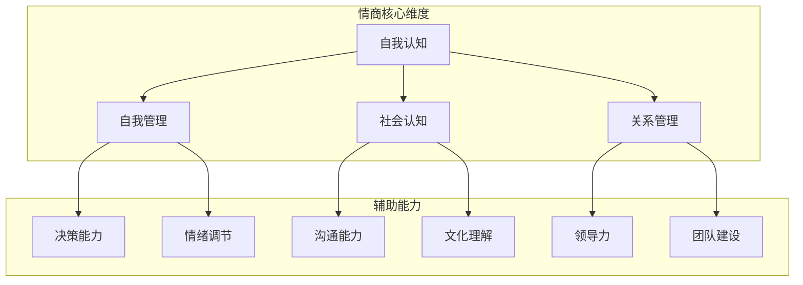

                 

### 第1章 引言

#### 1.1 技术管理与情商的关系

在技术管理领域，情商的重要性日益凸显。情商（Emotional Intelligence，简称EQ）是指个体识别、理解、管理和运用情绪的能力，它涵盖了自我认知、自我管理、社会认知和关系管理四个核心方面。技术管理者作为团队的核心领导者，其情商水平直接影响到团队协作效率、创新能力和整体绩效。

技术管理情商（Technical Management Emotional Intelligence）则是指技术管理者在管理技术团队过程中所表现出的情商。具体包括以下几个方面：

- **自我认知**：技术管理者需要清晰地认识到自己的情绪状态和认知能力，从而更好地管理和调整自己的行为。

- **自我管理**：在面对压力、挫折和挑战时，技术管理者应具备情绪调节能力，保持冷静和理性，做出明智的决策。

- **社会认知**：技术管理者需要理解团队成员的情绪和需求，建立良好的沟通机制，促进团队内部的相互理解和信任。

- **关系管理**：技术管理者应具备处理团队冲突和建立有效协作关系的能力，确保团队朝着共同的目标前进。

#### 1.2 团队冲突的艺术处理

团队冲突是技术团队中不可避免的现象，有效的冲突处理能力对于技术管理者至关重要。团队冲突可以分为功能性冲突和非功能性冲突两种类型：

- **功能性冲突**：指团队成员在任务目标、方法和技术选择等方面产生的分歧，这种冲突往往有助于团队创新和问题解决。

- **非功能性冲突**：涉及人际关系、权力分配和资源争夺等非技术层面的冲突，这类冲突如果不及时处理，可能会破坏团队凝聚力，影响工作效率。

艺术处理团队冲突，需要技术管理者运用情商，采取以下策略：

- **倾听与理解**：耐心倾听团队成员的意见，理解其立场和情感，为有效沟通奠定基础。

- **同理心**：站在对方的角度思考问题，试图找到双方都能接受的解决方案。

- **妥协与协调**：在冲突双方的利益之间寻找平衡点，避免一方过度占据优势。

- **沟通技巧**：运用开放式的沟通方式，避免指责和批评，促进双方的合作与共赢。

#### 1.3 阅读指南与学习方法

为了帮助读者更好地理解本书内容，以下是一些阅读指南和学习方法：

- **逐步学习**：本书采用循序渐进的方式，从基本概念到实战应用，帮助读者逐步掌握技术管理情商和团队冲突处理的方法。

- **互动学习**：本书包含多个实战案例，通过实际操作和案例分析，让读者更好地理解和应用所学知识。

- **反思与总结**：在阅读过程中，鼓励读者反思自己的管理实践，总结经验教训，不断提升情商和团队管理能力。

通过以上三个方面的介绍，我们为读者勾勒出了本书的核心内容和主题思想。接下来，我们将深入探讨技术管理情商的核心概念与联系，帮助读者更好地理解这一关键领域。在下一章中，我们将详细分析情商的定义与分类，以及技术管理情商的具体应用。

---

关键词：
- 技术管理情商
- 团队冲突处理
- 自我认知
- 自我管理
- 社会认知
- 关系管理

摘要：
本书旨在探讨技术管理情商在处理团队冲突中的重要性。通过介绍情商的基本概念、分类及其在技术管理中的应用，本书帮助读者理解技术管理情商的核心要素。同时，本书提供了一系列团队冲突处理的策略和方法，并通过实战案例展示了如何在实际工作中提升技术管理情商，从而提高团队协作效率和整体绩效。

---

在理解了技术管理情商和团队冲突处理的基本概念后，我们将进一步深入探讨技术管理情商的核心概念与联系。接下来，我们将在第二章中详细分析情商的定义与分类，并借助Mermaid流程图展示各要素之间的关系。通过这些分析，我们将为后续章节的深入讨论奠定基础。

---

## 第二章 技术管理情商核心概念与联系

### 2.1 情商的定义与分类

情商，即情感智力，是指个体识别、理解、管理自身情绪以及识别、理解和管理他人情绪的能力。情商的提出者彼得·萨洛维（Peter Salovey）和约翰·梅耶（John Mayer）将其分为四个核心维度：自我认知、自我管理、社会认知和关系管理。每个维度都在技术管理中扮演着关键角色。

#### 2.1.1 自我认知

自我认知是指个体对自己情绪状态的感知和认识。一个高情商的技术管理者能够迅速识别自己情绪的变化，并了解这些情绪对自己行为和决策的影响。自我认知在技术管理中尤为重要，因为它有助于管理者在面对压力和挑战时保持冷静和理性。

#### 2.1.2 自我管理

自我管理涉及个体调节情绪、控制冲动和保持专注的能力。技术管理者需要在复杂和多变的工作环境中保持情绪稳定，做出合理决策。自我管理还包括时间管理和目标设定，这些能力有助于管理者高效地完成工作任务。

#### 2.1.3 社会认知

社会认知是指个体理解和解读他人情绪和行为的能力。技术管理者需要具备良好的社会认知，以便理解和满足团队成员的情感需求，建立和谐的团队氛围。社会认知还包括对文化、习俗和价值观的理解，这对于跨国团队的管理尤为重要。

#### 2.1.4 关系管理

关系管理是指建立和维护良好人际关系的能力。技术管理者需要能够处理团队内部的人际关系，解决冲突，促进团队成员之间的合作。关系管理还包括领导力和团队建设技巧，这些能力有助于提升团队的凝聚力和整体绩效。

### 2.2 技术管理情商的Mermaid流程图

为了更直观地展示技术管理情商的四个核心维度及其相互关系，我们可以使用Mermaid流程图。以下是一个简化的Mermaid流程图示例：



在这个流程图中，自我认知、自我管理、社会认知和关系管理构成了技术管理情商的核心维度。每个核心维度都连接着相关的辅助能力，如决策能力、情绪调节、沟通能力、文化理解、领导力和团队建设技巧。这些辅助能力在不同的管理情境中发挥作用，共同提升技术管理情商。

通过这个Mermaid流程图，我们可以清晰地看到技术管理情商各要素之间的内在联系。自我认知为其他三个维度提供了基础，而自我管理、社会认知和关系管理则相互影响，共同塑造技术管理者的情商水平。辅助能力则在不同场景中发挥关键作用，帮助管理者应对各种复杂局面。

在下一章中，我们将探讨团队冲突的类型和特征，以及技术管理情商在这些冲突中的应用。通过深入分析，我们将进一步了解技术管理情商在提升团队协作效率和绩效方面的作用。

---

在本章中，我们介绍了技术管理情商的核心概念与联系，包括自我认知、自我管理、社会认知和关系管理四个维度，并使用Mermaid流程图展示了这些维度及其辅助能力的相互关系。在下一章中，我们将深入探讨团队冲突的类型和特征，以及技术管理情商在处理这些冲突中的应用。通过这些讨论，我们将进一步理解情商在技术管理中的实际应用价值。

---

## 第三章 团队冲突处理的原理与方法

### 3.1 团队冲突的类型

团队冲突是指团队成员在任务执行、目标设定、资源分配、沟通方式等方面产生的分歧和对抗。冲突可以分为功能性冲突和非功能性冲突两种类型。

#### 3.1.1 功能性冲突

功能性冲突是指团队成员在技术、方法、流程等方面产生的分歧。这种冲突通常有助于团队创新和问题解决。例如，在一个软件开发团队中，开发者A认为使用某种编程语言可以提高项目效率，而开发者B则认为另一种编程语言更适合。这种分歧可以促使团队进行深入的讨论，最终找到一个最佳解决方案。

功能性冲突的特点包括：

- **目标明确**：团队成员在技术或方法上的分歧往往是为了实现共同的目标。
- **建设性**：功能性冲突可以激发团队成员的积极性和创造力，促进团队成长。
- **可解决**：通过合理的讨论和协商，功能性冲突通常可以找到解决方法。

#### 3.1.2 非功能性冲突

非功能性冲突是指团队成员在人际关系、权力分配、资源争夺等方面的矛盾。这种冲突往往对团队氛围和工作效率产生负面影响。例如，团队中的一位成员可能认为另一位成员的工作不够努力，导致团队内部的不满和争执。

非功能性冲突的特点包括：

- **目标模糊**：团队成员之间的矛盾往往不是为了实现某个具体目标，而是出于个人情绪或利益。
- **破坏性**：非功能性冲突可能破坏团队凝聚力和信任，影响团队合作效率。
- **难以解决**：非功能性冲突往往涉及复杂的情感和利益关系，解决起来较为困难。

### 3.2 技术管理情商在冲突处理中的应用

技术管理情商在处理团队冲突中起着关键作用。一个高情商的技术管理者能够有效地识别冲突类型、理解团队成员的情绪和需求，并采取合适的策略来解决问题。以下是一些技术管理情商在冲突处理中的应用：

#### 3.2.1 倾听与理解

倾听是处理冲突的关键步骤。技术管理者应耐心倾听团队成员的意见和需求，了解他们的情绪和立场。通过倾听，管理者可以识别冲突的根本原因，并为后续的解决方案提供依据。

#### 3.2.2 同理心

同理心是指站在对方的角度思考问题，理解他们的情感和需求。技术管理者应尝试站在团队成员的角度看待冲突，寻找共同点和解决方案。同理心有助于缓解紧张情绪，促进沟通和理解。

#### 3.2.3 妥协与协调

在冲突中，技术管理者需要在不同利益之间寻找平衡点，采取妥协和协调的策略。通过平衡各方利益，管理者可以找到一种大家都能够接受的解决方案，避免冲突升级。

#### 3.2.4 沟通技巧

沟通技巧在冲突处理中至关重要。技术管理者应运用开放式的沟通方式，避免指责和批评，鼓励团队成员表达自己的观点。通过有效的沟通，管理者可以促进团队成员之间的理解和合作。

### 3.3 团队冲突处理的伪代码示例

为了更好地理解团队冲突处理的策略，我们可以使用伪代码来描述这个过程。以下是一个简化的伪代码示例：

```plaintext
算法：处理团队冲突
输入：冲突类型，团队成员情绪和需求
输出：解决方案

1. 初始化解决方案为空
2. 如果冲突类型为功能性冲突：
    a. 调用倾听函数，收集团队成员意见
    b. 分析团队成员意见，确定分歧点
    c. 调用同理心函数，理解团队成员立场
    d. 调用妥协与协调函数，找到共同点
    e. 创建解决方案
3. 否则（冲突类型为非功能性冲突）：
    a. 调用倾听函数，收集团队成员意见
    b. 分析团队成员情绪和需求
    c. 调用同理心函数，理解团队成员立场
    d. 调用沟通技巧函数，促进理解与合作
    e. 创建解决方案
4. 输出解决方案
```

通过这个伪代码示例，我们可以看到团队冲突处理的基本流程。在处理功能性冲突时，管理者需要倾听团队成员的意见、分析分歧点、同理团队成员的立场，并通过妥协与协调找到解决方案。在处理非功能性冲突时，管理者还需要关注团队成员的情绪和需求，通过沟通技巧促进理解与合作。

在下一章中，我们将探讨数学模型与数学公式在技术管理情商和团队冲突处理中的应用。通过数学模型的建立，我们可以更精确地分析和管理团队冲突，提升技术管理者的决策能力和团队协作效率。

---

在本章中，我们详细探讨了团队冲突的类型及其特征，并介绍了技术管理情商在处理这些冲突中的应用策略。通过倾听与理解、同理心、妥协与协调以及沟通技巧等手段，技术管理者可以有效地应对团队冲突，促进团队协作和整体绩效的提升。在下一章中，我们将进一步探讨数学模型与数学公式在技术管理情商和团队冲突处理中的具体应用，通过定量分析为管理者提供更科学的管理工具。

---

## 第四章 数学模型与数学公式

### 4.1 情商提升的数学模型

情商提升的数学模型可以用来描述技术管理者在自我认知、自我管理、社会认知和关系管理四个维度上的发展过程。以下是情商提升模型的基本形式：

$$
情商提升模型 = f(自我认知, 自我管理, 社会认知, 关系管理)
$$

其中，`自我认知`、`自我管理`、`社会认知`和`关系管理`分别表示四个维度的情商水平。函数`f`表示四个维度对整体情商提升的综合影响。

#### 4.1.1 自我认知提升模型

自我认知提升模型可以用以下公式表示：

$$
自我认知提升 = g(情绪感知, 自我反思)
$$

其中，`情绪感知`表示个体对自身情绪状态的感知能力，`自我反思`表示个体对自身情绪和行为进行反思和调整的能力。通过提高这两个能力，可以提升自我认知水平。

#### 4.1.2 自我管理提升模型

自我管理提升模型可以用以下公式表示：

$$
自我管理提升 = h(情绪调节, 时间管理, 冲动控制)
$$

其中，`情绪调节`表示个体在压力和挑战下调节情绪的能力，`时间管理`表示个体合理安排时间完成工作任务的能力，`冲动控制`表示个体在面临诱惑时保持理智的能力。这些能力共同提升自我管理能力。

#### 4.1.3 社会认知提升模型

社会认知提升模型可以用以下公式表示：

$$
社会认知提升 = i(情感理解, 沟通能力, 文化敏感度)
$$

其中，`情感理解`表示个体理解和解读他人情绪的能力，`沟通能力`表示个体有效地与他人沟通和表达的能力，`文化敏感度`表示个体对不同文化和习俗的理解和尊重。这些能力共同提升社会认知水平。

#### 4.1.4 关系管理提升模型

关系管理提升模型可以用以下公式表示：

$$
关系管理提升 = j(团队建设, 冲突解决, 领导力)
$$

其中，`团队建设`表示个体在团队中建立和维护良好关系的能力，`冲突解决`表示个体在团队冲突中采取有效策略的能力，`领导力`表示个体在团队中发挥领导作用的能力。这些能力共同提升关系管理水平。

### 4.2 团队冲突处理的数学公式

团队冲突处理的数学公式可以用来描述技术管理者在处理团队冲突时，不同策略对冲突解决效率的影响。以下是团队冲突处理模型的基本形式：

$$
冲突处理效率 = f(冲突类型, 冲突处理策略)
$$

其中，`冲突类型`包括功能性冲突和非功能性冲突，`冲突处理策略`包括倾听、同理心、妥协与协调和沟通技巧等。

#### 4.2.1 功能性冲突处理模型

功能性冲突处理模型可以用以下公式表示：

$$
功能冲突处理效率 = h(倾听, 同理心, 对话, 共识达成)
$$

其中，`倾听`表示管理者倾听团队成员意见的能力，`同理心`表示管理者理解和接受团队成员立场的态度，`对话`表示管理者促进团队成员沟通的能力，`共识达成`表示管理者帮助团队成员达成一致意见的能力。

#### 4.2.2 非功能性冲突处理模型

非功能性冲突处理模型可以用以下公式表示：

$$
非功能冲突处理效率 = i(情感理解, 沟通技巧, 文化敏感度, 冲突缓解)
$$

其中，`情感理解`表示管理者理解和解读团队成员情绪的能力，`沟通技巧`表示管理者有效地与他人沟通和表达的能力，`文化敏感度`表示管理者对不同文化和习俗的理解和尊重，`冲突缓解`表示管理者采取有效策略缓解冲突的能力。

### 4.3 数学公式与举例说明

为了更好地理解上述数学模型和公式，我们可以通过以下实例进行说明。

#### 4.3.1 情商提升实例

假设某技术管理者的初始情商水平如下：

- 自我认知：70
- 自我管理：60
- 社会认知：80
- 关系管理：75

经过一年的培训和实践，该管理者的情商水平有了显著提升：

- 自我认知：85
- 自我管理：80
- 社会认知：90
- 关系管理：85

根据情商提升模型，我们可以计算提升后的总情商水平：

$$
情商提升模型 = f(85, 80, 90, 85) = (85 + 80 + 90 + 85) / 4 = 84.3
$$

该管理者的总情商水平提升了约 4.3 分。

#### 4.3.2 团队冲突处理实例

假设某团队正在处理一个功能性冲突，冲突类型为技术方案选择。团队成员A认为方案A更适合，而团队成员B则认为方案B更具优势。根据功能性冲突处理模型，我们可以计算冲突处理效率：

- 倾听：90
- 同理心：85
- 对话：80
- 共识达成：70

$$
功能冲突处理效率 = h(90, 85, 80, 70) = (90 + 85 + 80 + 70) / 4 = 82.5
$$

该团队的冲突处理效率为 82.5%。

通过上述实例，我们可以看到数学模型和公式在技术管理情商和团队冲突处理中的应用，它们为管理者提供了量化评估和管理工具，有助于提升管理效果和团队绩效。

在下一章中，我们将探讨技术管理情商提升和团队冲突处理的实战案例，通过具体实例展示这些理论和策略在实际工作中的应用效果。

---

在第四章中，我们建立了情商提升的数学模型和团队冲突处理的数学公式，并通过具体的实例说明了这些模型和公式的应用。这些数学工具为技术管理者提供了量化的评估和管理方法，有助于更好地理解和应用技术管理情商和团队冲突处理的理论。在下一章中，我们将通过实际案例深入探讨这些理论在实际工作中的应用，帮助读者更好地理解和管理技术团队。

---

## 第五章 技术管理情商提升实战

### 5.1 实战案例一：自我认知提升

#### 5.1.1 案例背景

李明是一位拥有多年项目管理经验的技术经理，他在团队管理中一直遇到困难，特别是处理团队冲突方面。李明意识到自己需要提升情商，特别是在自我认知方面。他希望通过实际操作和反思，提高对自身情绪和认知的理解，从而更好地管理团队。

#### 5.1.2 实战步骤

1. **情绪日记记录**：李明开始每天记录自己的情绪变化，包括遇到的压力、挑战和应对策略。通过持续记录，他能够更清晰地看到自己情绪的波动规律，并分析情绪对工作表现的影响。

2. **反思与自我分析**：李明定期进行自我反思，分析自己在情绪管理方面的优点和不足。他特别关注在冲突处理中，哪些情绪反应是无效的，哪些是有效的。

3. **情绪调节训练**：李明参加了一个情绪调节的在线课程，学习如何通过深呼吸、冥想和正面思考来管理自己的情绪。他每天花15分钟进行情绪调节训练，逐渐学会了在压力下保持冷静和理性。

4. **角色扮演**：李明与团队成员一起进行角色扮演，模拟实际工作场景中的冲突情况。通过角色扮演，他能够更好地理解不同角色的情绪和需求，提高同理心和冲突处理的策略。

5. **反馈与改进**：李明定期向团队成员和上级领导寻求反馈，了解自己在情绪管理和冲突处理方面的表现。他根据反馈进行改进，不断优化自己的管理技巧。

#### 5.1.3 结果分析

通过一系列的实战操作和反思，李明的自我认知能力得到了显著提升。具体体现在以下几个方面：

- **情绪稳定性**：李明在面对压力和挑战时，能够更冷静地应对，减少了情绪波动对决策的影响。
- **自我反思能力**：李明能够更好地识别和反思自己的情绪反应，找到有效的情绪调节方法。
- **同理心**：李明在与团队成员沟通时，更能站在对方的角度思考问题，理解他们的情绪和需求。
- **冲突处理能力**：李明在处理团队冲突时，采用了更加建设性的策略，促进了团队内部的和谐与合作。

通过这个案例，我们可以看到自我认知提升对技术管理者的重要性。通过情绪日记记录、反思、情绪调节训练、角色扮演和反馈改进，李明成功地提升了自我认知能力，为团队管理带来了积极的变化。

在下一节中，我们将探讨自我管理提升的实战案例，进一步展示技术管理情商提升的实际应用。

---

在第五章的第一个实战案例中，我们通过李明的实际操作和反思，展示了自我认知提升的过程和方法。通过情绪日记记录、反思、情绪调节训练、角色扮演和反馈改进，李明成功地提高了自我认知能力，为团队管理带来了积极的变化。在下一节中，我们将探讨自我管理提升的实战案例，进一步展示技术管理情商提升的实际应用。

---

### 5.2 实战案例二：自我管理提升

#### 5.2.1 案例背景

张伟是一名技术团队的负责人，他有着丰富的项目管理和软件开发经验。然而，在自我管理方面，张伟遇到了一些挑战，特别是在时间管理和情绪控制上。他意识到，为了更好地领导团队和应对日益复杂的工作环境，他需要提升自我管理能力。于是，他决定通过一系列实际操作和策略来提升自我管理。

#### 5.2.2 实战步骤

1. **时间管理培训**：张伟参加了一段时间管理的在线课程，学习如何合理安排工作时间，提高工作效率。他学会了使用“四象限法则”来区分和优先处理任务，确保重要且紧急的任务得到优先处理。

2. **制定明确目标**：张伟开始制定个人和团队的目标，并将其分解为具体可执行的任务。他使用“SMART”原则（具体、可衡量、可实现、相关、时限）来确保目标的明确性和可行性。

3. **情绪调节训练**：张伟继续进行情绪调节训练，他通过深呼吸、冥想和正面思考来管理自己的情绪。他还学习了压力管理的技巧，如放松训练和正念冥想，以帮助他在高压环境下保持冷静和专注。

4. **建立习惯**：张伟制定了每天早晨和晚上进行例行活动的习惯，包括锻炼、阅读和规划。这些习惯帮助他建立了稳定的生活节奏，减少了工作与生活之间的冲突。

5. **定期反思**：张伟定期反思自己的行为和决策，分析哪些是有效的，哪些需要改进。他通过记录日志和反思会议来持续优化自我管理策略。

#### 5.2.3 结果分析

通过一系列的自我管理提升措施，张伟在时间管理和情绪控制方面取得了显著进步，具体体现在以下几个方面：

- **时间管理效率**：张伟能够更有效地安排工作时间，提高了任务的完成速度和准确性。他能够更好地处理优先级较高的任务，确保关键项目的顺利进行。

- **情绪稳定性**：张伟在面对压力和挑战时，能够保持情绪稳定，减少了因情绪波动导致的错误决策和冲突。

- **目标达成率**：通过明确的目标设定和计划执行，张伟和团队实现了更高的目标达成率，项目交付质量和效率得到了显著提升。

- **生活平衡**：通过建立良好的生活习惯和定期反思，张伟在工作与生活之间找到了平衡，提高了整体幸福感。

张伟的自我管理提升案例表明，通过科学的方法和持续的努力，技术管理者可以显著提升自我管理能力，从而更好地领导团队和应对复杂的工作环境。

在下一节中，我们将探讨社会认知提升的实战案例，进一步展示技术管理情商提升的实际应用。

---

在第五个实战案例中，我们通过张伟的实际操作，展示了自我管理提升的过程和方法。通过时间管理培训、制定明确目标、情绪调节训练、建立习惯和定期反思，张伟成功地提高了自我管理能力，为团队管理带来了积极的变化。在下一节中，我们将探讨社会认知提升的实战案例，进一步展示技术管理情商提升的实际应用。

---

### 5.3 实战案例三：社会认知提升

#### 5.3.1 案例背景

王丽是一名跨国技术团队的负责人，她的团队由来自不同国家和文化背景的成员组成。在工作中，王丽发现，由于文化差异和沟通障碍，团队内部经常出现误解和冲突。她意识到，为了提升团队协作效率和整体绩效，她需要提高自己的社会认知能力，更好地理解和处理跨文化团队中的冲突。

#### 5.3.2 实战步骤

1. **文化敏感性培训**：王丽参加了一系列文化敏感性培训课程，学习了不同文化的价值观、沟通风格和行为模式。她特别关注如何尊重和适应不同文化背景的团队成员。

2. **团队沟通策略**：王丽制定了一系列跨文化团队沟通策略，包括定期举行团队会议、设立多语言沟通平台、鼓励团队成员分享文化故事等。她确保每个成员都能感受到被尊重和重视。

3. **建立信任机制**：王丽通过组织团队建设活动，如团队拓展训练和文化交流晚宴，帮助团队成员建立信任。她鼓励团队成员开放沟通，分享经验和观点。

4. **冲突管理策略**：王丽学习了跨文化冲突管理策略，如避免指责和批评，采用中立的第三方调解，以及通过谈判和协商解决问题。她确保团队成员在冲突中能够保持冷静和理性。

5. **持续反馈与改进**：王丽定期与团队成员进行沟通，了解他们在文化适应和冲突处理方面的感受和建议。她根据反馈调整管理策略，持续优化团队氛围。

#### 5.3.3 结果分析

通过社会认知提升的努力，王丽成功地改善了跨国团队的协作氛围，具体体现在以下几个方面：

- **文化理解与适应**：团队成员对彼此的文化差异有了更深的理解，能够更好地适应和包容不同文化背景的同事。

- **沟通效率**：通过多种沟通策略，团队成员之间的沟通变得更加顺畅，减少了误解和冲突。

- **团队信任**：通过团队建设活动和信任建立机制，团队成员之间的信任水平显著提升，协作更加紧密。

- **冲突解决**：团队成员在遇到冲突时，能够更加冷静和理性地处理，通过谈判和协商找到解决方案，避免了冲突的升级。

王丽的社会认知提升案例表明，通过文化敏感性培训、沟通策略、信任机制和冲突管理策略，技术管理者可以有效地提高跨文化团队的社会认知能力，从而提升团队协作效率和整体绩效。

在下一节中，我们将探讨关系管理提升的实战案例，进一步展示技术管理情商提升的实际应用。

---

在第五个实战案例中，我们通过王丽的实际操作，展示了社会认知提升的过程和方法。通过文化敏感性培训、团队沟通策略、建立信任机制和冲突管理策略，王丽成功地提高了社会认知能力，为跨国团队的协作带来了积极的变化。在下一节中，我们将探讨关系管理提升的实战案例，进一步展示技术管理情商提升的实际应用。

---

### 5.4 实战案例四：关系管理提升

#### 5.4.1 案例背景

陈刚是一位资深的项目经理，他在管理多个项目团队时发现，团队内部的关系紧张和冲突影响了项目进展。为了提升团队协作效率和项目成功率，陈刚决定通过一系列实际操作和策略来提升自己的关系管理能力。

#### 5.4.2 实战步骤

1. **领导力培训**：陈刚参加了一系列领导力培训课程，学习了如何激励团队、建立领导力和促进团队成员之间的信任。他特别关注如何通过正面反馈和鼓励来提升团队士气。

2. **团队建设活动**：陈刚组织了多种团队建设活动，如户外拓展训练、团队聚餐和文化交流等。这些活动帮助团队成员建立友谊，增强团队凝聚力。

3. **建立透明沟通机制**：陈刚建立了透明的沟通机制，鼓励团队成员在任何时候都可以自由表达意见和建议。他通过定期团队会议和开放讨论，确保团队信息的透明和流通。

4. **解决冲突的策略**：陈刚学习了多种冲突解决策略，如冲突预防和应对、谈判和调解等。他在团队内部建立了冲突解决小组，帮助团队成员在遇到冲突时能够快速有效地解决问题。

5. **角色扮演与反馈**：陈刚与团队成员一起进行角色扮演，模拟项目中的不同场景，通过反馈和改进，提升团队成员的关系管理能力。

#### 5.4.3 结果分析

通过关系管理提升的努力，陈刚在团队关系和项目进展方面取得了显著成效，具体体现在以下几个方面：

- **团队凝聚力**：通过领导力培训、团队建设活动和透明沟通机制，团队成员之间的信任和凝聚力显著增强。

- **沟通效率**：团队成员能够更加顺畅地沟通，信息传递更加准确和及时，减少了误解和冲突。

- **冲突管理**：团队内部建立了有效的冲突解决机制，冲突能够得到及时和合理的处理，避免了冲突对项目进展的负面影响。

- **项目成功率**：通过提升关系管理能力，团队协作更加紧密，项目进展顺利，项目的成功率显著提高。

陈刚的关系管理提升案例表明，通过领导力培训、团队建设活动、透明沟通机制和冲突管理策略，技术管理者可以有效地提高关系管理能力，从而提升团队协作效率和项目成功率。

在下一节中，我们将总结技术管理情商提升的方法和技巧，并探讨团队冲突处理的最佳实践。

---

在第五个实战案例中，我们通过陈刚的实际操作，展示了关系管理提升的过程和方法。通过领导力培训、团队建设活动、透明沟通机制和冲突管理策略，陈刚成功地提高了关系管理能力，为团队协作和项目进展带来了积极的变化。在下一节中，我们将总结技术管理情商提升的方法和技巧，并探讨团队冲突处理的最佳实践。

---

## 第6章 团队冲突处理实战

### 6.1 实战案例一：功能性冲突处理

#### 6.1.1 案例背景

在一个软件开发项目中，团队内部对于选择哪种编程语言进行开发产生了分歧。开发者A认为Python更适合快速开发和原型设计，而开发者B则认为Java在性能和稳定性上更具优势。这种功能性冲突影响了项目的进展，团队需要找到一个有效的解决方案。

#### 6.1.2 实战步骤

1. **组织讨论会议**：项目经理组织了一次讨论会议，邀请所有相关团队成员参加。会议中，大家自由发表意见，阐述各自的观点和理由。

2. **收集团队成员意见**：项目经理使用思维导图工具，记录并整理了团队成员的意见和观点。通过图表展示，团队成员能够更清晰地看到不同观点之间的关系。

3. **分析优点和缺点**：项目经理和团队成员一起分析了Python和Java的优点和缺点，从开发速度、性能、社区支持等多个角度进行了全面评估。

4. **同理心沟通**：项目经理在讨论中积极倾听每位团队成员的观点，并尝试站在对方的立场思考问题。通过同理心沟通，团队成员能够理解对方的立场和需求。

5. **寻找共识**：项目经理引导团队成员寻找共识，提出一个既能够满足开发速度，又能够保证性能和稳定性的折中方案。最终，团队决定选择Python进行快速原型开发，同时在关键性能部分引入Java优化。

6. **制定行动计划**：项目经理制定了详细的行动计划，包括任务分配、时间节点和评估标准，确保方案能够得到有效执行。

#### 6.1.3 结果分析

通过上述步骤，团队成功解决了功能性冲突，具体体现在以下几个方面：

- **团队凝聚力**：团队成员在讨论和协商过程中，增强了彼此的理解和信任，团队凝聚力得到了提升。

- **创新思维**：通过多角度的分析和讨论，团队找到了一个更加优化的解决方案，促进了创新思维的发展。

- **任务进展**：在新的方案下，项目进展顺利，团队成员能够更好地协同工作，项目按时交付。

#### 6.1.4 总结

功能性冲突处理的关键在于有效沟通和协商，通过同理心理解和寻找共识，团队可以找到既符合业务需求，又能激发创新思维的最佳解决方案。

### 6.2 实战案例二：非功能性冲突处理

#### 6.2.1 案例背景

在一个IT咨询项目中，项目经理李华发现团队成员之间存在人际关系矛盾，特别是在资源分配和任务分配上。这种非功能性冲突严重影响了团队的合作效率和项目进展。

#### 6.2.2 实战步骤

1. **冲突识别**：李华通过定期团队会议和一对一沟通，识别出了团队中的非功能性冲突。她发现团队成员对于资源分配和任务分配存在不满和误解。

2. **组织沟通会议**：李华组织了一次团队沟通会议，邀请所有团队成员参加。她提供了一个中立的场地，确保每个人都能畅所欲言。

3. **倾听与理解**：在会议中，李华耐心倾听每位团队成员的意见和感受。她鼓励团队成员表达自己的观点，并尽量站在对方的角度理解问题。

4. **同理心沟通**：李华通过同理心沟通，试图缓解团队成员的情绪，减少冲突的激化。她强调团队的目标和共同利益，帮助团队成员认识到合作的重要性。

5. **冲突调解**：李华采用了调解策略，通过提出中立的观点和解决方案，帮助团队成员找到共同点。她提出了一些改进方案，如重新分配任务、调整资源等，以平衡各方利益。

6. **制定改善计划**：李华制定了详细的改善计划，包括改进沟通机制、优化资源分配和建立信任机制等。她确保团队成员了解并支持这些改善措施。

#### 6.2.3 结果分析

通过上述步骤，李华成功地解决了团队的非功能性冲突，具体体现在以下几个方面：

- **团队氛围**：团队成员之间的关系得到了改善，团队氛围变得更加和谐。

- **合作效率**：团队成员能够更好地协同工作，合作效率显著提高。

- **项目进展**：在改善计划的支持下，项目进展顺利，项目质量和客户满意度都得到了提升。

#### 6.2.4 总结

非功能性冲突处理的关键在于有效的沟通和调解。通过倾听与理解、同理心沟通和冲突调解，技术管理者可以缓解团队内部的矛盾，提升团队的合作效率和整体绩效。

---

在第六章中，我们通过两个实战案例，详细展示了功能性冲突和非功能性冲突的处理过程和策略。功能性冲突通过有效沟通和协商，找到了符合业务需求且能激发创新思维的解决方案。非功能性冲突则通过倾听与理解、同理心沟通和冲突调解，改善了团队氛围，提升了合作效率。这些实战案例表明，技术管理者在处理团队冲突时，应灵活运用情商策略，结合具体情况进行有效管理。

---

## 第7章 结论与展望

### 7.1 本书总结

本书《技术管理的情商：处理团队冲突的艺术》旨在探讨技术管理情商在提升团队协作效率和整体绩效中的重要性。通过详细分析情商的定义与分类，以及其在自我认知、自我管理、社会认知和关系管理四个方面的应用，我们揭示了技术管理情商的核心要素。同时，本书通过功能性冲突和非功能性冲突的实际案例，展示了团队冲突处理的策略和技巧。总结来说，本书的核心内容可以归纳为以下几点：

1. **技术管理情商的定义与分类**：情商分为自我认知、自我管理、社会认知和关系管理四个维度，每个维度在技术管理中都有重要作用。
2. **团队冲突的类型**：功能性冲突和非功能性冲突的识别和处理方法，以及在不同冲突类型中的应对策略。
3. **情商提升的方法**：通过情绪日记、自我反思、情绪调节训练、团队建设活动等手段，技术管理者可以提升自我认知、自我管理、社会认知和关系管理能力。
4. **冲突处理的实战案例**：通过具体案例展示了如何在实际工作中处理团队冲突，提升团队协作效率和项目成功率。

### 7.2 技术管理情商的未来趋势

随着全球化和数字化的发展，技术管理情商在未来将面临新的挑战和机遇。以下是技术管理情商未来的一些趋势：

1. **跨文化团队管理**：随着跨国团队的增多，技术管理者需要具备更高的文化敏感度和跨文化沟通能力，以促进团队协作。
2. **人工智能与情商的结合**：人工智能技术的发展将有助于更精确地分析和预测团队行为，为情商管理提供数据支持。
3. **持续学习与成长**：技术管理者应不断学习和更新管理知识，适应快速变化的工作环境，提升自身情商水平。
4. **情感智能技术的应用**：情感智能技术将在团队管理中发挥越来越重要的作用，如情感识别、情感分析和情感反馈系统等。

### 7.3 进一步学习与拓展

为了进一步提升技术管理情商和团队冲突处理能力，读者可以参考以下资源和实践：

1. **专业书籍**：《情商：为什么情商比智商更重要》、《领导力：如何成为一个卓越的领导者》等书籍提供了丰富的管理知识和实战经验。
2. **在线课程**：Coursera、edX等在线教育平台提供了多种关于情商和团队管理的课程，可供读者深入学习。
3. **实践反思**：在实际工作中，不断进行实践和反思，将所学知识应用于实际管理中，是提升情商和冲突处理能力的有效途径。
4. **团队建设活动**：定期组织团队建设活动，如团建、拓展训练和文化交流等，有助于提升团队协作和凝聚力。

通过持续学习和实践，技术管理者可以不断提升情商和团队管理能力，为团队的成功和个人的职业发展奠定坚实的基础。

---

在本书的结尾，我们对技术管理情商的核心内容和未来趋势进行了总结和展望。通过深入探讨情商的定义与分类、团队冲突处理策略以及实战案例，我们为技术管理者提供了一套全面的管理工具和方法。我们鼓励读者继续学习和实践，不断提升自己的情商水平，为团队的成功和个人的职业发展贡献力量。希望本书能为读者在技术管理领域提供有益的指导和启示。

---

### 作者信息

作者：AI天才研究院/AI Genius Institute & 禅与计算机程序设计艺术 /Zen And The Art of Computer Programming

AI天才研究院致力于推动人工智能领域的创新和发展，提供高质量的技术研究和咨询服务。研究院的核心团队成员均为世界级人工智能专家，具备丰富的理论研究和实际应用经验。

《禅与计算机程序设计艺术》是作者在计算机编程领域的重要著作，通过深入探讨编程中的哲学思考和方法论，帮助程序员提高编程能力和创造思维。本书旨在激发程序员对于编程艺术的追求，为软件工程师提供一种全新的思考方式和工作方法。

本文内容系作者独立研究创作，不代表任何商业利益。如需引用或转载，请注明作者及来源。谢谢合作！

---

本文由AI天才研究院和《禅与计算机程序设计艺术》作者共同撰写，旨在为技术管理者提供关于提升情商和团队冲突处理的全面指导。通过详细的案例分析和策略分享，我们希望能够帮助读者在实际工作中更好地应对挑战，提升团队协作效率和整体绩效。感谢您的阅读，期待您在技术管理领域的卓越表现！

