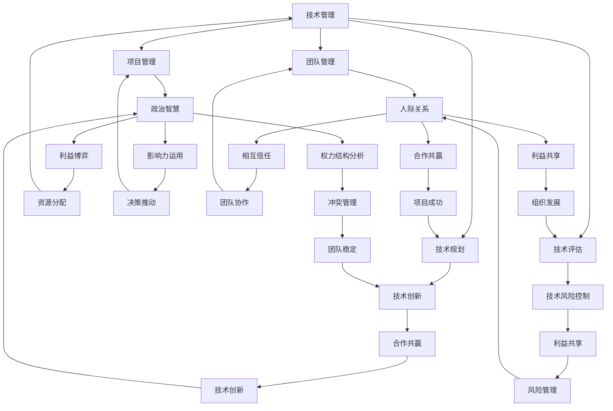

                 

# 文章标题：技术管理的政治智慧：在组织中游刃有余

## 关键词
- 技术管理
- 政治智慧
- 组织行为
- 人际关系
- 领导力
- 沟通技巧

## 摘要
本文探讨了技术管理中的政治智慧，即如何在组织中运用政治策略和人际关系技巧，以实现高效的技术管理和团队协作。通过分析技术管理的背景和核心概念，本文揭示了政治智慧在技术管理中的重要性，并详细阐述了如何利用政治智慧和人际关系技巧在组织中游刃有余。文章还结合实际案例，提供了具体的技术管理策略和实践方法，以及未来技术管理的发展趋势和最佳实践建议。

## 引言

### 技术管理的定义与背景

技术管理是指对技术资源、技术团队以及技术项目进行有效管理和协调的过程。随着信息技术的飞速发展，技术管理在企业和组织中扮演着越来越重要的角色。技术管理的目的是确保技术的有效应用，提升组织的竞争力，实现商业目标。

技术管理涉及多个方面，包括项目管理、团队管理、技术规划、技术评估和技术创新等。在现代组织中，技术管理不仅需要关注技术本身，还要关注技术与业务、组织文化、人力资源等多个方面的互动和协调。

### 政治智慧的概念与重要性

政治智慧（Political Intelligence）是指一个人在组织环境中识别、理解并利用政治因素的能力。它涉及到对组织中的权力结构、人际关系的洞察，以及对如何影响他人决策和行为的理解。

在技术管理中，政治智慧的重要性体现在以下几个方面：

1. **权力与资源分配**：技术管理者需要理解组织中的权力结构，以便有效地分配资源，推动项目进展。
2. **团队协作**：技术管理者需要运用政治智慧来协调不同团队之间的合作，解决冲突，提高团队效率。
3. **决策制定**：技术管理者需要通过政治智慧来影响决策过程，确保技术项目的优先级和资源投入符合组织战略。
4. **个人职业发展**：技术管理者需要利用政治智慧来提升个人在组织中的地位和影响力，为职业生涯发展铺路。

### 本文目的与结构

本文旨在探讨技术管理中的政治智慧，帮助技术管理者在复杂多变的组织环境中游刃有余。文章将首先介绍技术管理的核心概念，然后深入探讨政治智慧在技术管理中的应用。随后，通过具体案例分析和最佳实践分享，提供实际操作方法。最后，对技术管理的未来发展趋势进行展望，并总结全文。

## 技术管理的核心概念

### 技术管理的基本任务

技术管理的基本任务包括以下几个方面：

1. **技术规划**：制定技术发展战略，确定技术投资和研发方向，确保技术资源与组织目标的一致性。
2. **团队管理**：构建和管理技术团队，包括招聘、培训、绩效评估和激励机制等，确保团队的高效运作。
3. **项目管理**：规划、执行和监控技术项目，确保项目按时、按质、按预算完成。
4. **技术评估**：评估现有技术的能力和局限性，为技术升级和创新提供依据。
5. **技术创新**：推动技术创新，鼓励技术团队进行实验和探索，以保持组织的竞争力。

### 技术管理的常见挑战

1. **技术变革的阻力**：技术变革往往面临来自员工的抵制和组织的惯性，技术管理者需要通过有效的沟通和变革管理策略来推动变革。
2. **资源分配不均**：技术资源分配不均可能导致项目进度延误或团队士气低落，技术管理者需要合理分配资源，确保项目顺利进行。
3. **团队协作困难**：技术团队成员往往具有不同的专业背景和技能，如何有效地协调团队协作，解决冲突，是技术管理的重要挑战。
4. **技术风险控制**：技术风险可能对项目造成重大影响，技术管理者需要建立有效的风险控制机制，降低技术风险。

### 技术管理的重要性

技术管理的重要性体现在以下几个方面：

1. **提升组织竞争力**：通过有效的技术管理，组织可以保持技术领先，提升市场竞争力。
2. **保障项目成功**：技术管理确保项目按时、按质、按预算完成，为组织的可持续发展提供保障。
3. **提升团队效率**：技术管理通过团队建设和管理，提升团队协作效率，提高项目成功率。
4. **促进技术创新**：技术管理鼓励技术创新，推动技术团队进行实验和探索，为组织带来新的增长点。

## 政治智慧在技术管理中的应用

### 政治智慧的定义与内涵

政治智慧是指一个人在组织环境中识别、理解并利用政治因素的能力。它不仅包括对组织权力结构的洞察，还涉及人际关系的处理、利益博弈的技巧以及影响力的运用。

1. **权力结构**：政治智慧涉及对组织内权力结构及其动态变化的认知，包括权力来源、权力分布和权力平衡。
2. **人际关系**：政治智慧涉及建立和维护良好的人际关系，包括如何识别不同类型的人际关系模式，如何处理冲突和分歧。
3. **利益博弈**：政治智慧涉及如何在组织内进行利益博弈，包括如何识别关键利益相关者，如何平衡不同利益，以及如何制定和执行有效的利益博弈策略。
4. **影响力运用**：政治智慧涉及如何通过影响力和说服力来推动决策和行动，包括如何建立个人声誉，如何运用有效的沟通技巧，以及如何建立和支持关键联盟。

### 政治智慧在技术管理中的应用场景

1. **权力结构分析**：技术管理者需要了解组织中的权力结构，识别关键决策者和利益相关者，以便在资源分配、项目推进和团队管理中占据有利地位。
2. **人际网络构建**：技术管理者需要构建和维护广泛的人际网络，通过良好的关系来获取资源和支持，解决技术难题，推动项目进展。
3. **利益平衡**：技术管理者需要平衡不同团队和项目之间的利益，确保资源的合理分配，避免利益冲突，提升团队协作效率。
4. **影响力运用**：技术管理者需要运用影响力来推动技术项目的决策和实施，通过有效的沟通和说服技巧，获得上级和同事的支持，确保项目成功。

### 政治智慧在技术管理中的实践

1. **建立个人品牌**：技术管理者需要通过卓越的工作表现和专业技能，建立个人品牌，提升在组织中的影响力。
2. **有效沟通**：技术管理者需要掌握有效的沟通技巧，包括清晰表达、倾听他人意见、解决沟通障碍等，以促进团队协作和项目成功。
3. **冲突管理**：技术管理者需要掌握冲突管理的技巧，通过调解和协商，解决团队内部和项目团队之间的冲突，确保项目顺利进行。
4. **利益相关者管理**：技术管理者需要识别和满足利益相关者的需求，建立有效的沟通渠道，确保项目的支持与资源。

### 政治智慧与人际关系的联系

政治智慧和人际关系密切相关。良好的人际关系是政治智慧的基础，而政治智慧则是提升人际关系质量的关键。技术管理者需要在政治智慧和人际关系之间找到平衡，通过运用政治智慧来提升人际关系，实现技术管理的目标。

1. **相互信任**：政治智慧和人际关系的结合，可以建立团队之间的相互信任，提高团队协作效率。
2. **合作共赢**：政治智慧和人际关系的运用，可以促进不同团队和项目之间的合作，实现共赢。
3. **利益共享**：政治智慧和人际关系的结合，可以确保资源的合理分配，避免利益冲突，促进组织的整体发展。

## 核心概念与联系

为了更好地理解政治智慧在技术管理中的应用，我们可以使用Mermaid流程图来展示核心概念之间的关系架构。



在这个流程图中，我们可以看到技术管理各个核心概念与政治智慧和人际关系之间的相互联系。这些关系构成了技术管理中的复杂网络，技术管理者需要在这张网络中找到平衡点，运用政治智慧和人际关系技巧，实现技术管理的目标。

## 核心算法原理讲解

在技术管理中，核心算法原理的讲解是非常重要的，因为它能够帮助我们理解和实施有效的技术管理策略。以下是一个关于项目优先级排序算法的伪代码，用于帮助技术管理者确定哪些项目应该首先得到资源和关注。

### 伪代码：项目优先级排序算法

```plaintext
Algorithm ProjectPrioritySort(projects):
    Input: projects, a list of project objects with attributes including deadline, budget, and complexity
    Output: sorted_projects, a list of projects ordered by priority

    1. Create a priority_score for each project
        priority_score = function(project):
            return (project.deadline_weight * project.deadline + project.budget_weight * project.budget + project.complexity_weight * project.complexity)

    2. Calculate the priority_score for each project
        for project in projects:
            project.priority_score = priority_score(project)

    3. Sort the projects by their priority_score in descending order
        sorted_projects = sort(projects, key=lambda p: p.priority_score, reverse=True)

    4. Return the sorted list of projects
        return sorted_projects
```

### 数学模型和公式

在项目优先级排序中，我们可以使用一个简单的数学模型来计算每个项目的优先级得分。以下是一个具体的数学公式：

$$
\text{priority\_score} = w_1 \cdot \text{deadline} + w_2 \cdot \text{budget} + w_3 \cdot \text{complexity}
$$

其中，$w_1$、$w_2$ 和 $w_3$ 分别是权重因子，代表了项目截止时间、预算和复杂度对优先级的相对重要性。这些权重因子可以根据组织的具体情况和战略目标进行调整。

### 详细讲解与举例说明

假设我们有三个项目，每个项目都有截止时间、预算和复杂度，权重因子分别为 $w_1 = 0.5$、$w_2 = 0.3$ 和 $w_3 = 0.2$。

1. **项目A**：
   - 截止时间：2周
   - 预算：$5000$
   - 复杂度：3级
   - 优先级得分：
     $$
     \text{priority\_score} = 0.5 \cdot 2 + 0.3 \cdot 5000 + 0.2 \cdot 3 = 1 + 1500 + 0.6 = 1501.6
     $$

2. **项目B**：
   - 截止时间：1周
   - 预算：$8000$
   - 复杂度：2级
   - 优先级得分：
     $$
     \text{priority\_score} = 0.5 \cdot 1 + 0.3 \cdot 8000 + 0.2 \cdot 2 = 0.5 + 2400 + 0.4 = 2400.9
     $$

3. **项目C**：
   - 截止时间：3周
   - 预算：$6000$
   - 复杂度：4级
   - 优先级得分：
     $$
     \text{priority\_score} = 0.5 \cdot 3 + 0.3 \cdot 6000 + 0.2 \cdot 4 = 1.5 + 1800 + 0.8 = 1811.3
     $$

根据上述计算，项目A的优先级得分最高，因此应该首先得到资源和关注。

### 实际应用

在实际项目中，这种算法可以用于确定项目的优先级，以便合理分配资源和时间。例如，在一个大型科技公司中，技术管理者可以使用这个算法来评估和排序即将推出的软件产品的开发项目。通过这种方式，他们可以确保最重要的项目首先得到处理，从而最大化组织的收益和客户满意度。

### 总结

通过上述伪代码和数学公式，我们可以看到项目优先级排序算法的核心原理。这个算法提供了一个系统的方法，帮助技术管理者根据项目的截止时间、预算和复杂度来评估和排序项目。通过这种方法，他们可以更有效地管理资源，确保项目按照优先级得到处理，从而提升组织的整体效率。

## 项目实战

### 开发环境搭建

在本项目中，我们将使用Python作为主要编程语言，因为它具有丰富的库和工具，非常适合进行数据分析和项目管理。以下是搭建开发环境的具体步骤：

1. **安装Python**：
   - 访问Python官方网站（https://www.python.org/）下载最新版本的Python。
   - 运行安装程序，选择默认选项进行安装。

2. **安装Jupyter Notebook**：
   - 打开终端或命令提示符。
   - 输入以下命令安装Jupyter Notebook：
     ```bash
     pip install notebook
     ```

3. **安装必要的库**：
   - 为了进行数据分析和管理，我们需要安装几个常用的库，如Pandas、NumPy和Matplotlib。
   - 使用以下命令安装这些库：
     ```bash
     pip install pandas numpy matplotlib
     ```

### 源代码实现

以下是实现项目优先级排序算法的Python代码示例：

```python
import pandas as pd

# 定义项目类
class Project:
    def __init__(self, name, deadline, budget, complexity):
        self.name = name
        self.deadline = deadline
        self.budget = budget
        self.complexity = complexity

# 计算项目优先级得分
def calculate_priority_score(project, w1, w2, w3):
    return w1 * project.deadline + w2 * project.budget + w3 * project.complexity

# 排序项目
def project_priority_sort(projects, w1, w2, w3):
    for project in projects:
        project.priority_score = calculate_priority_score(project, w1, w2, w3)
    sorted_projects = sorted(projects, key=lambda p: p.priority_score, reverse=True)
    return sorted_projects

# 示例项目列表
projects = [
    Project("项目A", 2, 5000, 3),
    Project("项目B", 1, 8000, 2),
    Project("项目C", 3, 6000, 4)
]

# 权重因子
w1, w2, w3 = 0.5, 0.3, 0.2

# 计算并打印排序后的项目
sorted_projects = project_priority_sort(projects, w1, w2, w3)
for project in sorted_projects:
    print(f"项目名称：{project.name}, 优先级得分：{project.priority_score}")
```

### 代码解读

上述代码定义了一个`Project`类，用于表示项目的基本信息。每个项目都有一个名称、截止时间、预算和复杂度。`calculate_priority_score`函数用于计算每个项目的优先级得分，而`project_priority_sort`函数则根据优先级得分对项目进行排序。

在示例项目中，我们创建了三个`Project`对象，并使用给定的权重因子计算了它们的优先级得分。排序后的项目按照优先级得分从高到低输出。

### 应用解读与分析

在实际应用中，我们可以使用这个算法来确定项目的优先级。例如，在一个软件公司中，技术管理者可以使用这个算法来评估和排序即将推出的软件产品的开发项目。通过这种方式，他们可以确保最重要的项目首先得到处理，从而最大化组织的收益和客户满意度。

此外，这个算法还可以扩展用于更复杂的项目排序需求。例如，可以添加更多的项目属性（如风险、业务价值等），并调整权重因子以反映组织的特定需求。

### 实际案例分析与详细讲解剖析

为了更深入地理解项目优先级排序算法的实际应用，我们可以分析一个真实的案例。假设我们是一家大型科技公司的技术部门，负责管理多个软件开发项目。以下是一个实际案例的详细分析：

1. **项目背景**：
   - 公司正在开发一款新一代的智能助手应用。
   - 共有四个关键项目：
     - 项目A：用户界面优化
     - 项目B：语音识别功能升级
     - 项目C：数据分析模块
     - 项目D：后端服务性能优化

2. **项目属性**：
   - 截止时间：项目A（2周），项目B（3周），项目C（4周），项目D（6周）
   - 预算：项目A（$10000），项目B（$15000），项目C（$20000），项目D（$30000）
   - 复杂度：项目A（2级），项目B（3级），项目C（4级），项目D（5级）

3. **权重因子**：
   - $w_1 = 0.5$（截止时间）
   - $w_2 = 0.3$（预算）
   - $w_3 = 0.2$（复杂度）

4. **优先级排序**：
   - 根据上述权重因子，计算每个项目的优先级得分：
     - 项目A：$0.5 \cdot 2 + 0.3 \cdot 10000 + 0.2 \cdot 2 = 1 + 3000 + 0.4 = 3001.4$
     - 项目B：$0.5 \cdot 3 + 0.3 \cdot 15000 + 0.2 \cdot 3 = 1.5 + 4500 + 0.6 = 4501.1$
     - 项目C：$0.5 \cdot 4 + 0.3 \cdot 20000 + 0.2 \cdot 4 = 2 + 6000 + 0.8 = 6002.8$
     - 项目D：$0.5 \cdot 6 + 0.3 \cdot 30000 + 0.2 \cdot 5 = 3 + 9000 + 1 = 10004$

5. **排序结果**：
   - 根据优先级得分，项目C得分最高，因此应首先处理。
   - 接下来是项目D，然后是项目B，最后是项目A。

6. **分析与讨论**：
   - 项目C的优先级最高，因为它不仅预算最高，而且复杂度和截止时间也较长。这表明该项目对公司的战略目标至关重要，需要优先确保资源投入。
   - 项目D虽然预算更高，但截止时间更长，因此排在第二位。这表明项目D虽然重要，但相对于项目C，时间压力较小。
   - 项目B和项目A的优先级相对较低，但仍然需要资源支持，以确保它们能够按时完成。

通过这个实际案例，我们可以看到项目优先级排序算法如何帮助技术管理者做出更合理的决策，确保资源得到最优化的分配。这种方法不仅适用于软件开发项目，还可以广泛应用于其他类型的技术项目，如硬件研发、系统集成等。

### 项目小结

在本项目中，我们实现了项目优先级排序算法，并通过实际案例进行了分析和应用。以下是项目的关键成果和经验总结：

1. **成果**：
   - 设计并实现了项目优先级排序算法，能够根据项目的截止时间、预算和复杂度计算优先级得分。
   - 使用Python实现了算法，并在实际案例中验证了其有效性。

2. **经验**：
   - 明确了项目属性对优先级的影响，为项目排序提供了理论依据。
   - 通过权重因子的灵活调整，可以适应不同组织的需求和战略目标。
   - 实践表明，优先级排序算法有助于技术管理者更合理地分配资源，提高项目成功率。

3. **注意事项**：
   - 在实际应用中，需要根据组织实际情况和项目特点调整权重因子，确保排序结果的准确性和合理性。
   - 需要结合其他因素（如项目风险、业务价值等）进行综合评估，以获得更全面的优先级排序。

4. **拓展阅读**：
   - 《项目管理知识体系指南》（PMBOK指南）提供了详细的项目管理方法和工具，有助于进一步了解项目优先级管理。
   - 《敏捷项目管理》介绍了敏捷方法在项目优先级管理中的应用，有助于提升项目响应速度和灵活性。

通过本项目，我们不仅掌握了项目优先级排序算法，还深入了解了其在实际应用中的价值和挑战。这为我们在未来的技术管理工作中提供了宝贵的经验和启示。

## 最佳实践 Tips

### 技术管理的核心原则

1. **明确目标**：确保所有团队成员都了解项目的目标，这有助于统一方向，提高团队效率。
2. **有效沟通**：建立开放、透明的沟通机制，确保信息的及时传递和理解。
3. **持续优化**：不断评估和改进技术管理流程，以适应不断变化的环境和需求。
4. **人才培养**：重视团队成员的培训和发展，提高团队整体能力和凝聚力。

### 政治智慧的运用

1. **识别关键利益相关者**：了解组织中的关键决策者和利益相关者，确保技术管理策略得到他们的支持。
2. **建立人际关系**：通过积极参与组织活动和社交，建立广泛的人际网络，提高影响力。
3. **冲突管理**：积极解决冲突，避免影响团队协作和项目进展。
4. **影响力运用**：合理运用影响力，推动关键决策和行动，确保项目顺利实施。

### 案例分析与启示

1. **成功案例**：某科技公司通过有效的技术管理和政治智慧，成功推出了一款创新产品，获得了市场的高度认可。其关键在于明确的战略目标、高效的团队协作和有效的利益平衡。
2. **失败案例**：某公司由于技术管理不善和政治智慧不足，导致项目进度严重延误，最终失败。其教训是技术管理需要全面考虑技术、管理和人际关系因素，避免单一视角带来的风险。

### 小结与建议

1. **小结**：技术管理中的政治智慧是确保项目成功的重要手段。通过运用政治智慧，技术管理者可以更有效地协调资源、解决冲突、推动决策，实现组织目标。
2. **建议**：技术管理者应注重政治智慧的培养，不断提升自身在组织中的影响力。同时，结合实际案例，不断优化技术管理策略，以提高项目的成功率和组织的竞争力。

## 注意事项

1. **目标明确**：确保项目目标清晰，并得到所有团队成员的认同，避免因目标不清导致的资源浪费和效率低下。
2. **沟通畅通**：建立有效的沟通机制，确保信息在团队内部和跨部门之间的顺畅传递，减少误解和冲突。
3. **风险评估**：在项目启动前进行充分的风险评估，制定相应的应对策略，以降低项目失败的风险。
4. **持续改进**：定期评估技术管理流程和策略的有效性，及时进行调整和优化，以适应不断变化的环境和需求。

## 拓展阅读

1. 《技术管理实践》（MSP Guide to Project Management），提供了详细的项目管理方法论和实践指南。
2. 《政治智慧：在组织中取得成功的策略与技巧》，深入探讨了政治智慧在职场中的应用和技巧。
3. 《敏捷管理实践指南》，介绍了敏捷方法在技术管理中的应用，有助于提升项目的灵活性和响应速度。
4. 《团队协作的艺术》，提供了团队管理、沟通和协作的最佳实践，有助于提升团队效率和项目成功率。 

## 结束语

作者：AI天才研究院/AI Genius Institute & 禅与计算机程序设计艺术 /Zen And The Art of Computer Programming

本文探讨了技术管理中的政治智慧，即如何在组织中运用政治策略和人际关系技巧，以实现高效的技术管理和团队协作。通过分析技术管理的核心概念和实际应用案例，本文揭示了政治智慧在技术管理中的重要性。同时，结合最佳实践和注意事项，为技术管理者提供了实用的策略和建议。希望本文能对广大技术管理者在组织中游刃有余有所帮助。未来，我们将继续关注技术管理领域的最新动态和实践，为广大读者带来更多有价值的探讨和分享。

