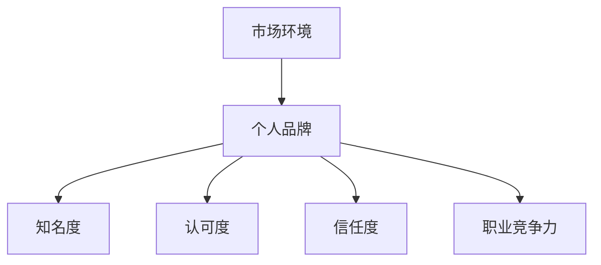
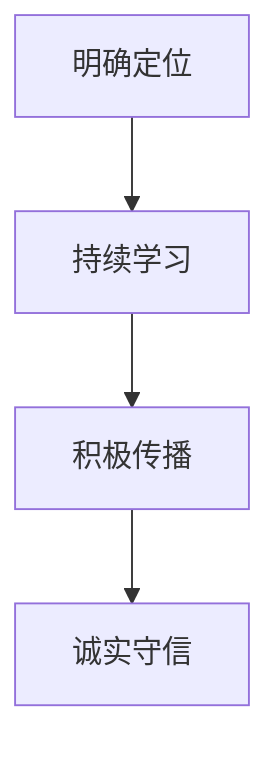
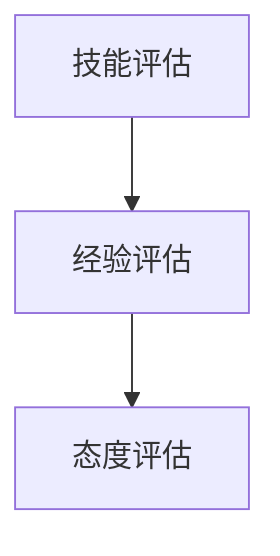
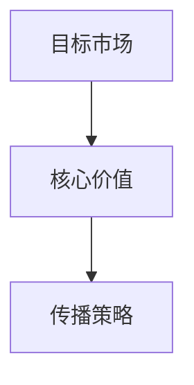
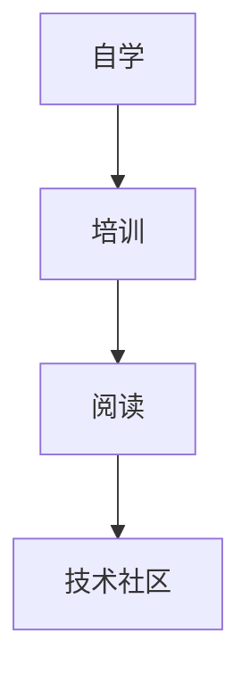
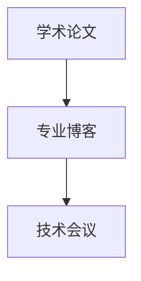
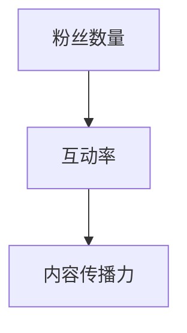

                 

### 文章标题

# 技术管理者个人品牌建设：提升职业影响力的策略

**关键词：** 技术管理者，个人品牌建设，职业影响力，提升策略，品牌传播，社交媒体，影响力打造。

**摘要：** 本文章深入探讨了技术管理者如何通过个人品牌建设来提升职业影响力。文章分为三部分，首先介绍了个人品牌建设的基础理论，包括品牌概述、自我认知与定位、专业知识与技能提升以及个人形象与沟通技巧。其次，阐述了个人品牌传播与推广的策略，包括社交媒体使用、网络影响力打造及线上线下活动策划。最后，通过案例研究和实战指导，为技术管理者提供了具体可操作的路径和技巧。

---

### 第一部分：个人品牌建设基础理论

#### 第1章：个人品牌概述

##### 1.1 个人品牌的定义与意义

个人品牌是指一个人在职场、社交网络或其他领域中，通过其专业技能、个人品质、职业形象等所形成的独特市场标识和竞争优势。在信息化时代，个人品牌的重要性日益凸显。

**核心概念与联系：**

- **个人品牌**：个人品牌（Personal Brand）是企业或个人在市场中通过专业技能、个人品质、职业形象等形成的一种独特的市场标识和竞争优势。
- **市场竞争**：在激烈的市场竞争中，个人品牌能够提升个人的知名度、认可度和信任度，从而增强职业竞争力。

**Mermaid流程图：**



##### 1.2 品牌建设的重要性

品牌建设不仅能够提升个人的职业价值，还能为企业带来巨大的无形资产。

**核心概念与联系：**

- **职业价值**：个人品牌建设能够帮助技术管理者提升职业地位和收入水平。
- **企业资产**：良好的个人品牌有助于企业吸引优秀人才，提升企业整体竞争力。

**伪代码：**

```python
def personal_brand_value():
    if "strong personal brand":
        return "high career value"
    else:
        return "low career value"

def enterprise_assets(personal_brand):
    if personal_brand == "good":
        return "attract talents"
    else:
        return "lose opportunities"
```

##### 1.3 个人品牌的构建原则

构建个人品牌需要遵循以下原则：明确定位、持续学习、积极传播、诚实守信。

**核心概念与联系：**

- **明确定位**：个人品牌建设要明确自身的优势和目标，避免模糊不清。
- **持续学习**：技术管理者需要不断学习新知识，提升自身专业水平。
- **积极传播**：通过社交媒体等渠道，积极传播个人品牌信息，提升知名度。
- **诚实守信**：建立个人品牌需要基于真实的能力和品质，避免虚假宣传。

**Mermaid流程图：**



#### 第2章：自我认知与定位

##### 2.1 自我认知的重要性

自我认知是个人品牌建设的基础，只有深入了解自己的优势和劣势，才能做出正确的职业规划。

**核心概念与联系：**

- **自我认知**：自我认知（Self-awareness）是指个体对自己内在心理状态的认识和了解。
- **职业规划**：准确的自我认知有助于技术管理者制定合理的职业规划。

**伪代码：**

```python
def self_awareness():
    # 获取自我评价
    self_evaluation = input("请描述您的优势与劣势：")
    # 分析自我评价
    if "strong technical skills":
        return "适合技术管理岗位"
    else:
        return "需要进一步提升专业技能"
```

##### 2.2 如何进行自我评估

自我评估是自我认知的关键环节，可以通过以下几个方面进行：

- **技能评估**：对自己的技术能力和项目经验进行评估。
- **经验评估**：对工作经验和成就进行反思。
- **态度评估**：对自己的工作态度、团队合作和沟通能力进行评估。

**核心概念与联系：**

- **技能评估**：技能评估（Skills Assessment）是指对个人技能水平进行评估。
- **经验评估**：经验评估（Experience Assessment）是指对个人工作经验和成就进行评估。
- **态度评估**：态度评估（Attitude Assessment）是指对个人工作态度、团队合作和沟通能力进行评估。

**Mermaid流程图：**



##### 2.3 明确个人品牌定位

个人品牌定位是个人品牌建设的关键步骤，需要明确以下方面：

- **目标市场**：确定个人品牌的目标市场，即希望吸引的人群。
- **核心价值**：明确个人品牌的核心价值，即个人的独特优势和核心竞争力。
- **传播策略**：制定个人品牌的传播策略，包括内容创作、渠道选择和推广方法。

**核心概念与联系：**

- **目标市场**：目标市场（Target Market）是指个人品牌希望吸引的目标人群。
- **核心价值**：核心价值（Core Value）是指个人品牌的独特优势和核心竞争力。
- **传播策略**：传播策略（Communication Strategy）是指个人品牌传播的方法和手段。

**Mermaid流程图：**



#### 第3章：专业知识与技能提升

##### 3.1 专业知识的获取途径

专业知识的获取途径包括自学、参加培训、阅读专业书籍、参与技术社区等。

**核心概念与联系：**

- **自学**：自学（Self-study）是指通过阅读、观看视频、编程实践等方式获取知识。
- **培训**：培训（Training）是指通过专业培训机构提供的课程提升专业技能。
- **阅读**：阅读（Reading）是指通过阅读专业书籍、论文、博客等获取前沿知识。
- **技术社区**：技术社区（Technical Community）是指通过参与技术论坛、博客、GitHub等方式与同行交流。

**Mermaid流程图：**



##### 3.2 技能提升的方法与策略

技能提升的方法包括：

- **项目实践**：通过实际项目实践，提升技术能力和解决问题的能力。
- **持续学习**：定期学习新知识，跟进行业动态。
- **知识共享**：通过技术分享、博客写作等方式，与他人分享知识，提升个人知名度。

**核心概念与联系：**

- **项目实践**：项目实践（Project Practice）是指通过实际项目提升专业技能。
- **持续学习**：持续学习（Continuous Learning）是指定期学习新知识，跟进行业动态。
- **知识共享**：知识共享（Knowledge Sharing）是指通过技术分享、博客写作等方式，与他人分享知识。

**伪代码：**

```python
def skill_improvement():
    if "project practice":
        return "technical ability improved"
    elif "continuous learning":
        return "knowledge level increased"
    elif "knowledge sharing":
        return "personal brand visibility improved"
    else:
        return "no improvement"
```

##### 3.3 建立专业知识的权威性

建立专业知识的权威性可以通过以下方法实现：

- **发表学术论文**：通过发表高质量的学术论文，提升个人在专业领域的知名度。
- **撰写专业博客**：通过撰写专业博客，分享技术见解和实战经验，提升个人影响力。
- **参与技术会议**：通过参与技术会议，与同行交流，拓展人脉，提升个人知名度。

**核心概念与联系：**

- **学术论文**：学术论文（Academic Paper）是指通过学术期刊发表的论文。
- **专业博客**：专业博客（Professional Blog）是指分享技术见解和实战经验的博客。
- **技术会议**：技术会议（Technical Conference）是指行业内举办的技术交流活动。

**Mermaid流程图：**



#### 第4章：个人形象与沟通技巧

##### 4.1 个人形象的塑造

个人形象的塑造对于个人品牌建设至关重要。以下是一些塑造良好个人形象的技巧：

- **着装规范**：保持职业着装，展现专业形象。
- **言谈举止**：注意言谈举止，展现礼貌和自信。
- **态度积极**：保持积极的工作态度，面对挑战和困难时保持乐观。

**核心概念与联系：**

- **着装规范**：着装规范（Dress Code）是指在工作中遵守的职业着装标准。
- **言谈举止**：言谈举止（Speech and Manners）是指说话和行动的礼貌与得体。
- **态度积极**：态度积极（Positive Attitude）是指面对工作和生活保持乐观和积极的心态。

**伪代码：**

```python
def personal_image():
    if "appropriate dress code":
        return "professional image"
    elif "polite speech and manners":
        return "well-mannered"
    elif "positive attitude":
        return "optimistic and confident"
    else:
        return "negative image"
```

##### 4.2 有效沟通的方法

有效沟通是技术管理者必备的技能。以下是一些有效沟通的方法：

- **倾听**：积极倾听对方的意见和需求，展现关注和尊重。
- **表达清晰**：用简洁明了的语言表达自己的想法，避免歧义。
- **反馈**：及时给予反馈，确保沟通的有效性。

**核心概念与联系：**

- **倾听**：倾听（Listening）是指积极关注和理解对方的意见和需求。
- **表达清晰**：表达清晰（Clear Communication）是指用简洁明了的语言表达自己的想法。
- **反馈**：反馈（Feedback）是指及时给予对方反馈，确保沟通的有效性。

**伪代码：**

```python
def effective_communication():
    if "active listening":
        return "understand needs"
    elif "clear expression":
        return "avoid ambiguity"
    elif "timely feedback":
        return "ensure communication effectiveness"
    else:
        return "ineffective communication"
```

##### 4.3 情绪管理技巧

情绪管理是个人形象的重要组成部分。以下是一些情绪管理技巧：

- **情绪识别**：学会识别自己的情绪，了解情绪产生的原因。
- **情绪调节**：通过深呼吸、冥想等方式调节情绪，保持冷静。
- **情绪表达**：学会在适当的场合表达情绪，避免冲动和负面情绪的传递。

**核心概念与联系：**

- **情绪识别**：情绪识别（Emotion Recognition）是指学会识别自己的情绪。
- **情绪调节**：情绪调节（Emotion Regulation）是指通过深呼吸、冥想等方式调节情绪。
- **情绪表达**：情绪表达（Emotion Expression）是指学会在适当的场合表达情绪。

**伪代码：**

```python
def emotional_management():
    if "emotion recognition":
        return "understand emotions"
    elif "emotion regulation":
        return "remain calm"
    elif "appropriate emotion expression":
        return "avoid negative emotions"
    else:
        return "poor emotional management"
```

### 第二部分：个人品牌传播与推广

#### 第5章：社交媒体使用策略

##### 5.1 社交媒体的选择与定位

选择适合自己的社交媒体平台，是个人品牌传播的第一步。以下是一些常见社交媒体平台及其特点：

- **LinkedIn**：专业的社交平台，适合技术管理者建立职业形象。
- **Twitter**：信息传播速度快，适合实时分享行业动态和技术见解。
- **GitHub**：技术社区，适合展示项目成果和技术能力。
- **LinkedIn**：专业的社交平台，适合技术管理者建立职业形象。
- **Twitter**：信息传播速度快，适合实时分享行业动态和技术见解。
- **GitHub**：技术社区，适合展示项目成果和技术能力。

**核心概念与联系：**

- **社交媒体**：社交媒体（Social Media）是指通过网络平台进行社交互动的工具。
- **选择与定位**：选择与定位（Platform Selection and Positioning）是指根据个人特点和目标选择适合的社交媒体平台，并明确个人品牌定位。

**伪代码：**

```python
def social_media_strategy():
    if "LinkedIn":
        return "professional image"
    elif "Twitter":
        return "real-time information sharing"
    elif "GitHub":
        return "technical skills showcase"
    else:
        return "inappropriate platform choice"
```

##### 5.2 内容创作与传播

内容创作是个人品牌传播的核心。以下是一些内容创作与传播的策略：

- **专业知识分享**：分享专业知识和经验，展示个人技术实力。
- **行业动态分析**：分析行业趋势，提供有价值的见解。
- **个人经历分享**：分享个人成长经历和职业故事，展现个人魅力。

**核心概念与联系：**

- **专业知识分享**：专业知识分享（Knowledge Sharing）是指分享专业知识和经验。
- **行业动态分析**：行业动态分析（Industry Analysis）是指分析行业趋势，提供有价值的见解。
- **个人经历分享**：个人经历分享（Personal Experience Sharing）是指分享个人成长经历和职业故事。

**伪代码：**

```python
def content_creation_strategy():
    if "knowledge sharing":
        return "demonstrate technical skills"
    elif "industry analysis":
        return "provide valuable insights"
    elif "personal experience sharing":
        return "show personal charisma"
    else:
        return "inappropriate content creation"
```

##### 5.3 网络营销技巧

网络营销技巧是提升个人品牌影响力的重要手段。以下是一些网络营销技巧：

- **关键词优化**：通过优化标题、内容等，提高在搜索引擎中的排名。
- **合作营销**：与其他个人或企业进行合作，扩大品牌影响力。
- **社交媒体广告**：利用社交媒体广告，精准推广个人品牌。

**核心概念与联系：**

- **关键词优化**：关键词优化（Keywords Optimization）是指通过优化标题、内容等，提高在搜索引擎中的排名。
- **合作营销**：合作营销（Cooperative Marketing）是指与其他个人或企业进行合作，扩大品牌影响力。
- **社交媒体广告**：社交媒体广告（Social Media Advertising）是指利用社交媒体平台进行广告推广。

**伪代码：**

```python
def online_marketing_tactics():
    if "keyword optimization":
        return "improve search engine ranking"
    elif "cooperative marketing":
        return "expand brand influence"
    elif "social media advertising":
        return "targeted promotion"
    else:
        return "ineffective marketing tactics"
```

#### 第6章：网络影响力打造

##### 6.1 影响力的定义与测量

网络影响力是指个人在互联网上所产生的影响力和号召力。以下是一些影响力的定义与测量方法：

- **粉丝数量**：通过粉丝数量来衡量个人在网络上的影响力。
- **互动率**：通过用户互动量（点赞、评论、分享等）来衡量个人在网络上的影响力。
- **内容传播力**：通过内容传播范围（阅读量、转发量等）来衡量个人在网络上的影响力。

**核心概念与联系：**

- **粉丝数量**：粉丝数量（Follower Count）是指个人在社交媒体上的关注者数量。
- **互动率**：互动率（Engagement Rate）是指用户互动量（点赞、评论、分享等）与粉丝数量的比率。
- **内容传播力**：内容传播力（Content Reach）是指内容在社交媒体上的传播范围。

**Mermaid流程图：**



##### 6.2 提升影响力的方法

提升网络影响力可以通过以下方法实现：

- **优质内容创作**：创作有价值的、专业的、有趣的内容，吸引粉丝关注。
- **活跃互动**：积极参与粉丝互动，提高互动率。
- **合作拓展**：与其他有影响力的个人或企业合作，共同提升网络影响力。

**核心概念与联系：**

- **优质内容创作**：优质内容创作（High-quality Content Creation）是指创作有价值的、专业的、有趣的内容。
- **活跃互动**：活跃互动（Active Interaction）是指积极参与粉丝互动。
- **合作拓展**：合作拓展（Collaborative Expansion）是指与其他有影响力的个人或企业合作，共同提升网络影响力。

**伪代码：**

```python
def influence_improvement():
    if "high-quality content creation":
        return "attract followers"
    elif "active interaction":
        return "increase engagement rate"
    elif "collaborative expansion":
        return "expand influence"
    else:
        return "no improvement"
```

##### 6.3 建立个人品牌社区

建立个人品牌社区是提升网络影响力的重要手段。以下是一些建立个人品牌社区的方法：

- **建立微信群或QQ群**：通过建立微信群或QQ群，吸引志同道合的粉丝加入。
- **举办线上活动**：定期举办线上活动，如技术分享、行业讨论等，增强粉丝互动。
- **提供有价值的内容**：持续提供有价值的内容，如专业文章、技术教程等，吸引粉丝关注。

**核心概念与联系：**

- **建立微信群或QQ群**：建立微信群或QQ群（Create WeChat Group or QQ Group）是指通过建立社交群组，吸引粉丝加入。
- **举办线上活动**：举办线上活动（Online Event）是指定期举办线上活动，如技术分享、行业讨论等。
- **提供有价值的内容**：提供有价值的内容（Provide Valuable Content）是指持续提供专业文章、技术教程等。

**伪代码：**

```python
def personal_brand_community():
    if "create social groups":
        return "attract followers"
    elif "host online events":
        return "enhance interaction"
    elif "provide valuable content":
        return "attract attention"
    else:
        return "no community building"
```

#### 第7章：线上线下活动策划与执行

##### 7.1 活动策划的基本原则

活动策划的基本原则包括：

- **明确目标**：明确活动的目标，如提升知名度、增加粉丝、拓展人脉等。
- **预算规划**：根据目标制定合理的预算，确保活动顺利进行。
- **受众分析**：分析目标受众，了解他们的需求和兴趣。
- **内容设计**：设计有趣、有价值的内容，吸引受众参与。

**核心概念与联系：**

- **明确目标**：明确目标（Define Goals）是指明确活动的目标。
- **预算规划**：预算规划（Budget Planning）是指制定合理的预算。
- **受众分析**：受众分析（Audience Analysis）是指分析目标受众。
- **内容设计**：内容设计（Content Design）是指设计有趣、有价值的内容。

**伪代码：**

```python
def event_planning():
    if "clear goals":
        return "effective planning"
    elif "budget planning":
        return "financial stability"
    elif "audience analysis":
        return "targeted promotion"
    elif "content design":
        return "attractive events"
    else:
        return "ineffective planning"
```

##### 7.2 线上活动的执行与推广

线上活动的执行与推广包括以下步骤：

- **活动宣传**：通过社交媒体、邮件等渠道进行宣传，吸引受众参与。
- **互动管理**：在活动过程中，积极管理互动，提高参与度。
- **数据分析**：活动结束后，对数据进行分析，了解活动的效果，为后续活动提供参考。

**核心概念与联系：**

- **活动宣传**：活动宣传（Event Promotion）是指通过多种渠道进行活动宣传。
- **互动管理**：互动管理（Interaction Management）是指在活动过程中，积极管理互动。
- **数据分析**：数据分析（Data Analysis）是指对活动数据进行分析。

**伪代码：**

```python
def online_event_execution():
    if "effective promotion":
        return "high participation rate"
    elif "active interaction management":
        return "enhanced engagement"
    elif "thorough data analysis":
        return "improved event effectiveness"
    else:
        return "ineffective execution"
```

##### 7.3 线下活动的策划与执行

线下活动的策划与执行包括以下步骤：

- **场地选择**：根据活动规模和受众需求，选择合适的场地。
- **嘉宾邀请**：邀请行业专家、合作伙伴等嘉宾参与活动。
- **活动流程**：制定详细的活动流程，确保活动顺利进行。
- **现场管理**：在活动过程中，进行现场管理，确保活动有序进行。

**核心概念与联系：**

- **场地选择**：场地选择（Venue Selection）是指根据活动规模和受众需求，选择合适的场地。
- **嘉宾邀请**：嘉宾邀请（Guest Invitation）是指邀请行业专家、合作伙伴等嘉宾参与活动。
- **活动流程**：活动流程（Event Flow）是指制定详细的活动流程。
- **现场管理**：现场管理（On-site Management）是指在活动过程中，进行现场管理。

**伪代码：**

```python
def offline_event_planning():
    if "appropriate venue selection":
        return "satisfied audience"
    elif "successful guest invitation":
        return "valuable discussions"
    elif "detailed event flow":
        return "smooth execution"
    elif "effective on-site management":
        return "orderly event"
    else:
        return "ineffective planning"
```

### 第三部分：案例研究与实战指导

#### 第8章：技术管理者个人品牌建设案例解析

##### 8.1 案例一：从技术专家到技术领袖

案例一介绍了某技术管理者从技术专家到技术领袖的转型过程。以下是案例解析：

- **背景介绍**：该技术管理者在某一技术领域拥有深厚的技术背景，但在职业发展过程中，意识到需要提升个人品牌影响力。
- **核心概念与联系**：技术专家（Technical Expert）到技术领袖（Technical Leader）的转型，需要提升个人品牌影响力。
- **成功因素**：该技术管理者通过撰写专业博客、参与技术会议、发表学术论文等方式，提升个人品牌影响力，最终成为技术领域的领袖。

**案例解析：**

```markdown
**背景介绍：**
某技术管理者，曾在某一技术领域拥有丰富经验，但在职业发展中，意识到仅凭技术能力无法达到更高层次的发展。于是，他决定通过个人品牌建设来提升职业影响力。

**核心概念与联系：**
技术专家到技术领袖的转型，需要个人品牌影响力的提升。

**成功因素：**
1. 撰写专业博客：该技术管理者定期撰写技术博客，分享技术见解和实战经验，吸引了大量粉丝关注。
2. 参与技术会议：他积极参与各类技术会议，与同行交流，扩大了人脉圈，提升了个人知名度。
3. 发表学术论文：他发表了多篇高质量的学术论文，展示了其深厚的学术造诣，进一步巩固了个人品牌。

最终，该技术管理者成功转型为技术领域的领袖，为公司带来了巨大的价值。

**案例分析：**
该案例成功的关键在于技术管理者能够明确个人品牌定位，通过多种渠道提升个人品牌影响力。其经验值得其他技术管理者借鉴。

```

##### 8.2 案例二：技术管理者的职业转型

案例二介绍了某技术管理者如何通过个人品牌建设实现职业转型。以下是案例解析：

- **背景介绍**：该技术管理者在某一技术领域工作多年，但由于市场竞争激烈，希望实现职业转型。
- **核心概念与联系**：技术管理者（Technical Manager）到职业转型（Career Transition）需要个人品牌的支撑。
- **成功因素**：该技术管理者通过学习新技能、参与行业交流、撰写专业博客等方式，成功实现了职业转型。

**案例解析：**

```markdown
**背景介绍：**
某技术管理者，在某一技术领域工作多年，但面对市场竞争，他意识到需要实现职业转型。于是，他开始积极提升个人品牌，寻求新的职业机会。

**核心概念与联系：**
技术管理者到职业转型的过程中，需要个人品牌的支撑。

**成功因素：**
1. 学习新技能：该技术管理者利用业余时间学习新技能，提升自身竞争力。
2. 参与行业交流：他积极参加行业交流活动，与同行交流，拓展人脉，获取新的职业机会。
3. 撰写专业博客：他撰写专业博客，分享技术见解和实战经验，提升了个人品牌知名度。

最终，该技术管理者成功实现了职业转型，进入了一个新的领域，实现了职业生涯的突破。

**案例分析：**
该案例成功的关键在于技术管理者能够主动学习新技能，积极参与行业交流，提升个人品牌。这种积极的态度和行动力，是其他技术管理者实现职业转型的榜样。

```

##### 8.3 案例三：个人品牌的国际化

案例三介绍了某技术管理者如何通过个人品牌建设实现国际化发展。以下是案例解析：

- **背景介绍**：该技术管理者在国内拥有丰富的技术管理经验，希望将个人品牌推向国际市场。
- **核心概念与联系**：个人品牌的国际化（Internationalization of Personal Brand）需要具备国际视野和跨文化沟通能力。
- **成功因素**：该技术管理者通过参与国际技术会议、撰写英文博客、参与跨国项目等方式，成功实现了个人品牌的国际化。

**案例解析：**

```markdown
**背景介绍：**
某技术管理者，在国内拥有丰富的技术管理经验，希望将个人品牌推向国际市场。于是，他开始积极拓展国际视野，提升跨文化沟通能力。

**核心概念与联系：**
个人品牌的国际化需要具备国际视野和跨文化沟通能力。

**成功因素：**
1. 参与国际技术会议：该技术管理者积极参加国际技术会议，与全球技术专家交流，提升国际影响力。
2. 撰写英文博客：他撰写英文博客，分享技术见解和实战经验，吸引了全球读者的关注。
3. 参与跨国项目：他积极参与跨国项目，锻炼跨文化沟通能力，提升国际项目经验。

最终，该技术管理者成功实现了个人品牌的国际化，成为国际技术领域的知名专家。

**案例分析：**
该案例成功的关键在于技术管理者具备国际视野和跨文化沟通能力，通过多种渠道提升个人品牌。这种全球化的思维方式，是其他技术管理者实现国际化的关键。

```

#### 第9章：个人品牌建设实战指导

##### 9.1 实战步骤与策略

个人品牌建设实战步骤与策略包括以下方面：

- **确定个人品牌定位**：明确个人品牌的核心价值和目标市场，制定明确的个人品牌定位。
- **制定品牌传播计划**：根据个人品牌定位，制定品牌传播计划，包括内容创作、渠道选择、推广策略等。
- **执行与监控**：按照品牌传播计划，执行各项活动，并实时监控效果，根据反馈进行调整。

**核心概念与联系：**

- **个人品牌定位**：个人品牌定位（Personal Brand Positioning）是指明确个人品牌的核心价值和目标市场。
- **品牌传播计划**：品牌传播计划（Brand Communication Plan）是指制定品牌传播的具体策略和执行步骤。
- **执行与监控**：执行与监控（Implementation and Monitoring）是指按照品牌传播计划执行各项活动，并实时监控效果。

**伪代码：**

```python
def brand_building_strategy():
    if "clear personal brand positioning":
        return "understand core values and target market"
    elif "develop brand communication plan":
        return "create effective strategies and actions"
    elif "execute and monitor":
        return "improve brand visibility and influence"
    else:
        return "ineffective strategy"
```

##### 9.2 遇到的挑战与解决方案

在个人品牌建设过程中，技术管理者可能会遇到以下挑战：

- **时间管理**：个人品牌建设需要投入大量的时间和精力，如何平衡工作与个人品牌建设是挑战之一。
- **内容创作**：持续创作高质量的内容是个人品牌建设的关键，但如何保持创作激情和灵感是挑战。
- **网络营销**：有效的网络营销需要掌握一定的技巧，如何提高网络营销效果是挑战。

**解决方案：**

- **时间管理**：制定合理的个人时间管理计划，确保有足够的时间投入个人品牌建设。
- **内容创作**：通过参加培训、阅读专业书籍、与他人交流等方式，不断激发创作灵感。
- **网络营销**：学习网络营销技巧，如关键词优化、社交媒体广告等，提高网络营销效果。

**伪代码：**

```python
def challenges_and_solutions():
    if "time management":
        return "create a balanced schedule"
    elif "content creation":
        return "attend training, read books, and communicate with others"
    elif "network marketing":
        return "learn marketing skills and improve marketing effectiveness"
    else:
        return "ineffective solutions"
```

##### 9.3 持续提升个人品牌的方法

持续提升个人品牌的方法包括以下方面：

- **持续学习**：不断学习新知识，提升专业技能，保持个人品牌的竞争力。
- **内容更新**：定期更新博客、社交媒体等内容，保持活跃度和影响力。
- **互动交流**：积极参与行业交流，拓展人脉，提升个人品牌知名度。
- **拓展领域**：尝试涉足新的领域，提升个人品牌的价值。

**核心概念与联系：**

- **持续学习**：持续学习（Continuous Learning）是指不断学习新知识，提升专业技能。
- **内容更新**：内容更新（Content Update）是指定期更新博客、社交媒体等内容。
- **互动交流**：互动交流（Interaction and Communication）是指积极参与行业交流，拓展人脉。
- **拓展领域**：拓展领域（Expand Scope）是指尝试涉足新的领域，提升个人品牌价值。

**伪代码：**

```python
def continuous_brand_improvement():
    if "continuous learning":
        return "enhance professional skills"
    elif "content update":
        return "maintain active presence"
    elif "interaction and communication":
        return "expand network and visibility"
    elif "expand scope":
        return "increase brand value"
    else:
        return "ineffective improvement"
```

### 附录

#### 附录A：个人品牌建设工具与资源

附录A提供了个人品牌建设所需的工具与资源，包括：

- **个人品牌建设工具推荐**：如个人网站、博客平台、社交媒体管理等工具。
- **社交媒体平台使用指南**：详细介绍各类社交媒体平台的操作方法和技巧。
- **个人品牌建设资源汇总**：汇总各类有用的资源，如专业书籍、在线课程、技术社区等。

**附录A：个人品牌建设工具与资源**

```markdown
## 附录A：个人品牌建设工具与资源

### A.1 个人品牌建设工具推荐

- **个人网站**：个人网站是展示个人品牌的重要平台。推荐使用WordPress、Jekyll等博客平台搭建个人网站。
- **博客平台**：如Medium、MarkdownPad等，便于撰写和发布专业博客。
- **社交媒体管理工具**：如Hootsuite、Buffer等，用于管理社交媒体账号，发布内容，监测互动。

### A.2 社交媒体平台使用指南

- **LinkedIn**：专业的社交平台，适合发布职业动态、分享行业见解。
- **Twitter**：信息传播速度快，适合实时分享行业动态和技术见解。
- **GitHub**：技术社区，适合展示项目成果和技术能力。
- **微信**：适合与国内受众互动，发布专业文章、技术教程等。

### A.3 个人品牌建设资源汇总

- **专业书籍**：《影响力》、《演讲的力量》、《职场成功之道》等。
- **在线课程**：如Coursera、edX等平台上的个人品牌建设相关课程。
- **技术社区**：如Stack Overflow、GitHub等，用于交流技术问题，分享知识。

```

---

**作者：AI天才研究院/AI Genius Institute & 禅与计算机程序设计艺术 /Zen And The Art of Computer Programming**

