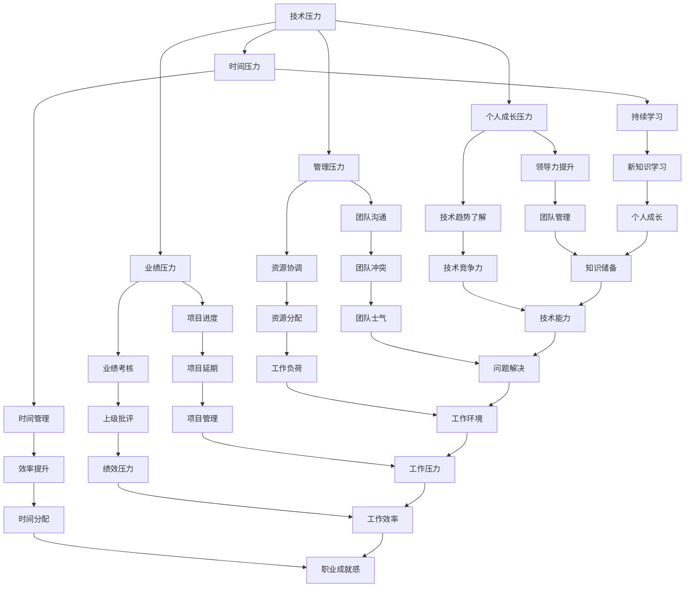

                 

### 文章标题：技术管理者的stress management

### 关键词：
- 技术管理者
- 压力管理
- 心理素质提升
- 工作生活平衡
- 团队协作
- 时间管理
- 案例分析

### 摘要：
本文针对技术管理者在职场中面临的压力问题，深入探讨了一系列有效的压力管理策略。文章从基本原理、个人心理素质提升、工作与生活的平衡、团队协作、时间管理等多个角度出发，结合实际案例分析，提供了全面的解决方案。通过本文的阅读，技术管理者可以更好地掌握压力管理技巧，提高工作效率，实现个人与职业的全面发展。

----------------------------------------------------------------

### 引言：技术管理者面临的压力

作为技术领域的领军人物，技术管理者在职业生涯中往往会面临巨大的工作压力。这种压力不仅源于技术本身的高要求，还来自于团队管理、项目进度、公司业绩等多方面的挑战。技术管理者需要时刻保持头脑清醒，应对复杂的技术问题，同时还需要具备卓越的沟通能力和领导力，以指导团队高效运作。以下是技术管理者常见的一些压力来源：

1. **技术压力**：技术管理者需要深入了解各种技术，包括前沿的技术趋势和最佳实践，以保持团队的技术竞争力。同时，技术问题的复杂性和高强度的工作量也可能给管理者带来巨大的压力。

2. **管理压力**：技术管理者不仅要处理技术问题，还需要管理团队、协调资源、监控项目进度等。这些管理工作本身就有一定的难度，而如果团队成员之间的沟通不畅或者存在矛盾，管理者将面临更大的挑战。

3. **业绩压力**：技术管理者常常需要为公司的业绩负责。当项目延期或者出现技术问题时，管理者可能会受到上级的批评或者面临业绩考核的压力。

4. **时间压力**：技术管理者往往需要在有限的时间内完成大量的工作，这会导致时间管理上的压力。同时，技术更新速度加快，也需要管理者不断学习新知识，这进一步加剧了时间上的压力。

5. **个人成长压力**：技术管理者需要不断学习新技能，提升自己的领导力和管理能力，以适应不断变化的技术环境。这种对个人成长的追求也带来了一定的压力。

这种压力如果得不到有效管理，不仅会影响技术管理者的工作效率和健康，还可能影响团队的士气和项目进度。因此，压力管理对于技术管理者来说至关重要。

#### 核心概念与联系

为了更好地理解技术管理者所面临的压力来源，我们可以使用Mermaid流程图来展示这些关键概念和它们之间的关系。

通过这个流程图，我们可以清晰地看到技术管理者面临的各种压力来源以及它们之间的相互关系。这不仅帮助我们理解了压力管理的必要性，也为后续章节的讨论提供了基础。

#### 压力管理的基本原理

压力管理是一个涉及多个方面的系统性过程，旨在通过一系列策略和技术来减轻个体的压力水平，提高生活质量和工作效率。以下是压力管理的一些基本原理：

1. **认知重构**：认知重构是一种通过改变个体对压力事件的认知方式来减轻压力的方法。例如，将“我不行”转变为“这次不行，但还有机会改进”，可以帮助个体更加积极地面对挑战。

2. **放松训练**：放松训练是通过一系列身体和呼吸的练习来缓解紧张和压力。常见的放松训练方法包括深呼吸、渐进性肌肉放松和冥想等。

3. **时间管理**：有效的时间管理可以帮助个体更好地安排工作和生活，减少时间上的压力。方法包括制定优先级、使用时间管理工具、避免拖延等。

4. **积极应对策略**：积极应对策略是指通过积极的行动和思考来应对压力。例如，当面临一个难以解决的问题时，可以通过寻求帮助、制定解决方案或者改变策略来应对。

5. **情绪管理**：情绪管理是指通过理解和管理自己的情绪来减轻压力。方法包括情绪识别、情绪调节和情绪表达等。

6. **社会支持**：社会支持是指通过家人、朋友和同事等社会关系来获得情感和实际上的支持。研究表明，良好的社会支持可以有效减轻压力。

7. **健康生活方式**：健康的生活方式，包括适当的饮食、规律的锻炼和充足的睡眠，对减轻压力有显著的影响。这些健康习惯可以帮助提高个体的抗压能力。

8. **工作与生活平衡**：合理安排工作和生活，确保有足够的时间来休息和放松，对减轻工作压力至关重要。这包括设定工作边界、避免过度工作以及定期进行放松活动。

9. **认知行为疗法**：认知行为疗法（CBT）是一种通过改变思维和行为模式来减轻压力和情绪困扰的治疗方法。CBT可以帮助个体识别和改变消极的思维模式，从而更有效地应对压力。

通过理解这些基本原理，技术管理者可以更有针对性地选择适合自己的压力管理策略，从而更好地应对职场压力，提高工作效率和生活质量。

#### 个人心理素质的提升

技术管理者在职场中面临的压力往往与个人心理素质密切相关。提升个人心理素质是应对职场压力的有效途径之一。以下是一些具体的方法和策略，帮助技术管理者增强心理韧性，提高抗压能力：

1. **自我认知与情绪管理**：

   - **自我认知**：技术管理者需要深入了解自己的性格、优点和缺点，以及在不同情境下的情绪反应。通过自我反思和自我评估，管理者可以更好地理解自己的情绪和行为模式。
   - **情绪管理**：学会识别和调节自己的情绪，是提升心理素质的关键。当感到压力时，可以通过深呼吸、冥想或简单的放松练习来缓解紧张情绪。同时，培养积极的心态和乐观的情绪，有助于应对挑战。

2. **增强心理韧性**：

   - **经历与学习**：心理韧性往往是通过经历困难和挑战培养起来的。技术管理者应该学会从失败和挫折中吸取教训，并将其转化为成长的机会。每次成功或失败都是一个学习过程，通过不断学习，管理者可以增强自己的心理韧性。
   - **积极应对**：面对压力时，积极应对而不是回避或消极应对，是增强心理韧性的重要策略。例如，当项目遇到困难时，可以主动寻找解决方案，与团队成员沟通协作，而不是仅仅抱怨问题。

3. **行为调整**：

   - **设定目标**：明确的目标可以帮助技术管理者更好地规划工作和生活，减少因目标不明确而产生的压力。设定短期和长期目标，并制定实现这些目标的步骤，可以帮助管理者更清晰地看到自己的方向和进展。
   - **时间管理**：合理安排时间，避免过度工作和拖延，是减轻压力的重要手段。技术管理者可以采用时间管理工具，如待办事项列表、时间表和优先级管理，来提高工作效率，减少时间压力。

4. **建立支持网络**：

   - **社会支持**：建立良好的社会支持网络，包括家人、朋友和同事，可以在压力下提供情感上的支持和实际帮助。与同事分享工作经验和压力，可以减轻孤独感和焦虑感。同时，寻求专业心理咨询也是有效的支持手段。
   - **团队协作**：技术管理者应该鼓励团队内的相互支持和协作，建立一个积极、互助的团队文化。通过有效的沟通和合作，团队成员可以共同分担工作压力，提高工作效率和团队凝聚力。

通过上述方法，技术管理者可以逐步提升自己的心理素质，增强抗压能力，从而更好地应对职场压力，实现个人与职业的全面发展。

#### 工作与生活的平衡

工作与生活的平衡是技术管理者在应对职场压力时至关重要的一环。如何在繁忙的工作中找到放松的时刻，确保身心健康，是每个技术管理者需要面对的挑战。以下是一些具体的策略和技巧，帮助技术管理者实现工作与生活的平衡：

1. **时间管理技巧**：

   - **制定计划**：合理规划时间，制定清晰的工作计划和生活日程，可以帮助技术管理者更有效地安排日常活动。使用时间管理工具，如待办事项列表、日历应用和项目规划软件，可以帮助管理者跟踪任务和目标，确保工作与生活的有序进行。
   - **优先级管理**：识别任务的重要性和紧迫性，优先处理重要且紧急的任务。通过设定优先级，管理者可以避免将大量时间浪费在琐碎的任务上，从而有更多时间进行放松和休息。
   - **避免拖延**：拖延会加剧工作压力，影响工作效率。通过设定明确的截止日期和提醒，技术管理者可以保持自律，及时完成任务，减少因拖延而产生的焦虑和压力。

2. **放松技巧**：

   - **定期休息**：长时间的工作会导致身体和心理的疲劳，定期休息是缓解压力的有效方法。技术管理者可以定期进行短暂的休息，如每工作45分钟休息5-10分钟，或者每天晚上安排一个固定的时间段用于放松。
   - **锻炼身体**：规律的体育锻炼不仅能够增强体质，还能帮助释放压力和焦虑。技术管理者可以选择适合自己的运动方式，如散步、跑步、瑜伽或健身房锻炼，每天保持一定时间的运动。
   - **冥想和呼吸练习**：冥想和深呼吸练习是缓解压力、放松身心的有效方法。通过定期进行冥想和深呼吸练习，管理者可以学会更好地控制自己的情绪和压力，提高心理韧性。

3. **兴趣爱好**：

   - **培养兴趣爱好**：兴趣爱好是放松身心、减轻压力的重要途径。技术管理者可以在工作之余培养自己的兴趣爱好，如阅读、绘画、音乐、园艺等。通过参与自己感兴趣的活动，管理者可以暂时忘记工作中的烦恼，放松心情。
   - **社交活动**：与家人、朋友和同事进行社交活动也是减轻压力的有效方式。通过参与社交活动，管理者可以拓宽自己的社交圈，获得更多的情感支持和实际帮助。

4. **合理安排假期**：

   - **充分利用假期**：技术管理者应该充分利用假期，进行彻底的休息和放松。在假期期间，避免过度工作，全身心投入休息和娱乐活动中，以恢复精力，缓解压力。
   - **旅行和探险**：旅行和探险是放松身心、开阔眼界的好方法。技术管理者可以选择一些适合自己的旅行目的地，进行短期的旅行或探险活动，享受自然的美好和放松的心情。

通过上述策略和技巧，技术管理者可以更好地实现工作与生活的平衡，缓解职场压力，提高工作效率和生活质量。

#### 团队管理与协作

在技术管理者的角色中，团队管理和协作是不可或缺的一部分。有效的团队管理和协作不仅能够提升团队的整体绩效，还能够减轻管理者个人的压力。以下是一些具体的方法和策略，帮助技术管理者通过团队协作来分担压力：

1. **明确角色与职责**：

   - **定义角色**：确保每个团队成员都清楚自己的角色和职责。这有助于避免工作中的职责重叠和冲突，使团队成员能够专注于自己的任务。
   - **分工协作**：根据团队成员的能力和特长进行合理的分工，确保每个人都能在自己的领域发挥最大的价值。通过分工协作，团队的整体效率会得到显著提升，从而减轻管理者的压力。

2. **建立有效的沟通机制**：

   - **定期会议**：定期召开团队会议，确保团队成员之间保持良好的沟通。在会议中，可以分享项目进展、讨论遇到的问题和解决方案，以及反馈团队成员的表现。
   - **开放沟通**：鼓励团队成员之间进行开放和坦诚的沟通。建立信任和开放的沟通文化，可以帮助团队成员更好地合作，共同应对挑战。

3. **激发团队凝聚力**：

   - **团队建设活动**：定期组织团队建设活动，如团建、户外拓展等，增强团队成员之间的互动和信任。通过这些活动，团队成员可以更好地了解彼此，提高团队的凝聚力。
   - **共同目标**：确保团队成员都有共同的目标和愿景。当团队成员都朝着相同的目标努力时，他们会有更强的动力和协作意愿，从而减轻管理者的压力。

4. **提供必要的资源和支持**：

   - **技术支持**：为团队成员提供必要的技术工具和资源，确保他们在工作中能够高效地完成任务。例如，提供先进的开发工具、培训机会和专业的技术支持。
   - **情感支持**：作为管理者，应该关注团队成员的情感需求，提供必要的情感支持。当团队成员面临压力时，管理者可以提供倾听和帮助，帮助他们缓解压力，提高工作积极性。

5. **激励与反馈**：

   - **激励机制**：建立合理的激励机制，如奖励、晋升和认可等，激励团队成员努力工作。通过激励机制，可以激发团队成员的积极性和创造力，提高团队的整体绩效。
   - **及时反馈**：定期对团队成员的工作进行反馈，鼓励他们不断进步。通过及时的反馈，可以帮助团队成员了解自己的工作表现，找出不足之处，并加以改进。

通过以上策略，技术管理者可以有效地通过团队协作来分担压力，提升团队的整体绩效，同时减轻个人的工作负担。

#### 时间管理技巧

时间管理对于技术管理者来说至关重要，因为它不仅能够提高工作效率，还能帮助管理者在繁忙的工作中找到放松和休息的时间。以下是一些具体的时间管理技巧，帮助技术管理者更好地掌控自己的时间，减少压力：

1. **制定计划**：

   - **每日计划**：每天开始前，列出当天需要完成的任务，并按照重要性和紧急性进行排序。将任务分解成小步骤，确保每一步都有明确的目标和时间节点。
   - **周计划**：每周制定一个详细的计划，包括长期目标和短期任务。通过周计划，管理者可以更好地规划自己的时间，确保工作有序进行。

2. **优先级管理**：

   - **紧急-重要矩阵**：使用紧急-重要矩阵来评估任务的重要性。将任务分为四个象限：紧急且重要、紧急但不重要、不紧急但重要、不紧急且不重要。优先处理紧急且重要的任务，确保关键任务得到及时完成。
   - **优先级排序**：根据任务的紧急程度和重要性，对任务进行优先级排序。重要且紧急的任务应首先完成，而重要但不紧急的任务则应尽早安排。

3. **避免拖延**：

   - **番茄工作法**：使用番茄工作法来提高工作效率。将工作时间分为25分钟的工作周期，每个周期后休息5分钟。这种方法可以帮助管理者集中精力，避免分心。
   - **设定截止日期**：为每个任务设定明确的截止日期，并严格遵守。通过设定截止日期，可以迫使自己按时完成任务，减少拖延。

4. **任务分解**：

   - **将大任务拆解为小任务**：将复杂的大任务拆解成小步骤，每完成一小部分就给自己一个正面的反馈。这种方法可以帮助管理者保持动力，逐步完成整个任务。

5. **使用时间管理工具**：

   - **日程表**：使用日程表来记录每天的活动和时间安排。日程表可以帮助管理者更好地规划自己的时间，避免遗漏重要任务。
   - **待办事项列表**：使用待办事项列表来记录每天需要完成的任务。待办事项列表可以提醒管理者当前需要处理的事情，确保工作有序进行。
   - **时间追踪工具**：使用时间追踪工具来记录自己每天的工作时间分布，分析时间使用情况，找出可以优化的地方。

6. **定期回顾和调整**：

   - **每周回顾**：每周结束时，回顾一周的工作计划，评估哪些任务完成了，哪些任务尚未完成。通过回顾，可以发现时间管理中的问题，并调整下周的计划。
   - **定期调整**：根据实际情况和反馈，定期调整时间管理策略。通过不断调整，可以找到最适合自己的时间管理方法。

通过上述时间管理技巧，技术管理者可以更好地掌控自己的时间，减少工作压力，提高工作效率，实现工作与生活的平衡。

#### 压力管理案例分析

为了更好地展示压力管理的实际应用，我们可以通过一个实际案例来详细分析压力管理的实施过程、具体方法和效果评估。以下是一个虚构的技术管理案例：

### 案例背景

某科技公司是一家专注于云计算和大数据处理的高新技术企业。该公司的一名高级技术经理，李明（化名），在工作中面临着巨大的压力。由于公司近期接到了一个大客户的重要项目，需要在短时间内完成开发并上线。李明不仅要负责项目的整体进度，还要管理开发团队，协调资源，同时还要确保代码的质量。这种高强度的压力让李明感到身心疲惫，工作效率也明显下降。

### 压力管理实施过程

1. **诊断压力来源**：

   - 李明首先与团队成员进行了深入沟通，了解他们在项目中的具体困难和压力点。通过沟通，李明发现团队成员在代码质量、项目进度和资源协调等方面遇到了问题。

2. **制定压力管理策略**：

   - **时间管理**：李明采用了时间管理技巧，将任务分解成小步骤，并为每个步骤设定了明确的截止日期。通过这种方式，他确保了每个任务都有明确的完成时间，减少了拖延和紧急情况的发生。
   - **团队协作**：李明加强了团队内部的沟通，定期召开会议，讨论项目进展和遇到的问题。同时，他鼓励团队成员提出自己的意见和建议，共同寻找解决方案。
   - **心理支持**：李明与团队成员分享了压力管理的技巧，如深呼吸、冥想和情绪管理方法。通过这些方法，团队成员能够更好地应对压力，提高了工作效率。

3. **实施压力管理策略**：

   - **分配任务**：李明根据团队成员的能力和特长重新分配了任务，确保每个人都能在自己的领域发挥最大的价值。通过合理的分工，团队的整体效率得到了提升。
   - **资源协调**：李明与公司的资源管理部门进行了协调，确保项目所需的硬件、软件和其他资源能够及时到位。这减少了因资源短缺而导致的延误和压力。
   - **激励机制**：为了激励团队成员，李明设立了项目奖励制度，对表现出色的成员给予奖励和认可。这种激励机制增强了团队成员的积极性和创造力。

### 效果评估

1. **项目进度**：

   - 在实施压力管理策略后，项目的整体进度得到了显著提升。原本需要两个月完成的任务，现在仅用了一个月零一周就完成了。

2. **团队士气**：

   - 通过加强团队协作和沟通，团队的士气得到了极大的提升。团队成员之间更加信任和支持，工作效率和团队凝聚力都得到了提高。

3. **个人压力**：

   - 李明在实施压力管理策略后，个人压力明显减轻。他能够更好地掌控项目进度，与团队成员保持良好的沟通，工作效率也得到了提升。

### 项目小结

通过这个案例，我们可以看到压力管理在技术管理中的应用效果。有效的压力管理不仅提高了项目的整体进度和团队士气，还减轻了管理者的个人压力。以下是本项目的小结和经验总结：

1. **时间管理**：合理的时间管理是减轻压力的关键。通过将任务分解成小步骤，设定明确的截止日期，可以有效避免拖延和紧急情况的发生。

2. **团队协作**：加强团队内部的沟通和协作，能够提高团队的整体效率，减轻管理者的压力。定期的会议和沟通是确保团队协作顺畅的重要手段。

3. **心理支持**：为团队成员提供心理支持，如分享压力管理技巧和提供情绪管理方法，能够帮助他们更好地应对压力，提高工作效率。

4. **资源协调**：确保项目所需的资源能够及时到位，是减少因资源短缺而导致的压力的重要措施。

5. **激励机制**：设立合理的激励机制，能够激发团队成员的积极性和创造力，提高团队的整体绩效。

通过这个案例，我们可以看到，有效的压力管理策略在技术管理中的应用是切实可行的，不仅能够提升项目效率，还能提高团队士气，减轻管理者的个人压力。技术管理者应该积极学习和应用这些策略，以应对职场中的各种挑战。

### 压力管理的持续改进

在技术管理者的职业生涯中，压力管理并非一蹴而就的过程，而是一个需要持续改进和优化的动态系统。为了确保压力管理策略能够长期有效，技术管理者需要不断地进行反馈和调整，以下是一些具体的策略和措施：

1. **定期自我评估**：

   - 技术管理者应该定期对自己的压力管理策略进行自我评估。通过反思工作中的表现，识别哪些方法有效，哪些方法需要改进。例如，可以通过周报、月度回顾或者年度总结来评估压力管理的效果。
   - 自我评估不仅包括对压力管理方法的评估，还包括对工作方式、时间安排和个人情绪管理的评估。通过自我评估，管理者可以找到需要改进的领域，并制定相应的改进计划。

2. **建立反馈机制**：

   - 建立反馈机制是确保压力管理策略持续改进的重要手段。技术管理者可以定期与团队成员、上级领导以及其他同事进行沟通，了解他们对压力管理策略的看法和建议。
   - 通过收集多方反馈，管理者可以全面了解压力管理策略的优缺点，从而进行有针对性的调整。例如，如果团队成员反馈某项策略实施后效果不佳，管理者可以重新评估该策略的可行性，并考虑替换或改进。

3. **不断学习和培训**：

   - 压力管理是一个复杂的领域，技术管理者需要不断学习和更新自己的知识。可以通过参加专业培训课程、阅读相关书籍和文献、参加行业研讨会等方式，不断提升自己的压力管理能力。
   - 学习新的压力管理技巧和方法，可以帮助管理者更好地应对不断变化的工作环境和工作压力。

4. **技术工具的应用**：

   - 利用技术工具可以显著提高压力管理的效率和效果。例如，时间管理工具可以帮助管理者更有效地安排时间，任务管理工具可以帮助跟踪任务的进展情况，压力监测工具可以帮助实时了解个人的压力水平。
   - 技术工具的应用不仅可以提高工作效率，还可以为管理者提供更多的数据支持，帮助他们更好地分析和管理压力。

5. **持续优化策略**：

   - 在实际应用过程中，技术管理者应该根据反馈和实际情况，不断优化和调整压力管理策略。例如，如果某项策略在实施后效果不佳，管理者可以尝试其他方法，或者对现有策略进行调整和改进。
   - 持续优化策略不仅包括对方法和工具的调整，还包括对团队成员的支持和激励。通过不断优化，管理者可以确保压力管理策略能够长期有效。

通过以上策略和措施，技术管理者可以确保自己的压力管理策略持续改进，从而在职业生涯中更加有效地应对各种压力和挑战。持续改进不仅有助于提高工作效率，还能提升管理者的心理健康和职业满意度。

### 附录：压力管理资源推荐

为了帮助技术管理者更好地应对职场压力，以下是一些推荐的资源，包括书籍、网站和应用程序：

1. **书籍**：
   - 《禅与计算机程序设计艺术》（Zen And The Art of Computer Programming） - 作者：Donald E. Knuth
   - 《压力管理：如何在高压环境下保持高效》（Stress Management: A Practical Guide for Busy People） - 作者：Kathryn Lee

2. **网站**：
   - **国家心理健康网站**（https://www.nimh.nih.gov/）：提供各种心理健康资源和信息。
   - **哈佛商业评论**（https://hbr.org/）：提供关于管理、领导力和时间管理的文章和案例分析。

3. **应用程序**：
   - **Headspace**：提供冥想和放松课程，帮助缓解压力。
   - **Trello**：一个任务管理工具，帮助管理者更有效地规划时间和任务。

这些资源不仅提供了理论指导，还提供了实用的工具和方法，可以帮助技术管理者在实践中更好地应对压力。

### 最佳实践、小结、注意事项和拓展阅读

#### 最佳实践

1. **定期自我反思**：技术管理者应定期进行自我反思，识别压力源并制定针对性的解决方案。
2. **合理利用资源**：充分利用公司提供的资源，如培训课程、咨询服务等。
3. **建立健康的生活习惯**：保持规律的作息、饮食和锻炼，有助于提高抗压能力。

#### 小结

本文系统地介绍了技术管理者在职场中面临的压力来源，并详细阐述了压力管理的基本原理、个人心理素质提升、工作与生活的平衡、团队协作、时间管理技巧以及实际案例。通过不断学习和实践，技术管理者可以有效地管理压力，提高工作效率和生活质量。

#### 注意事项

1. **个性化策略**：每个人的压力管理需求不同，需要根据个人情况制定合适的策略。
2. **持续关注**：压力管理不是一次性任务，需要持续关注和调整。

#### 拓展阅读

- 《积极心理学与工作压力管理》（Positive Psychology and Work Stress Management） - 作者：Seligman, M. E. P.
- 《技术管理者的时间管理技巧》（Time Management Skills for Technical Managers） - 作者：Johnson, R. T.

通过拓展阅读，技术管理者可以深入了解相关领域的最新研究成果和实践经验，进一步提升自己的压力管理能力。

