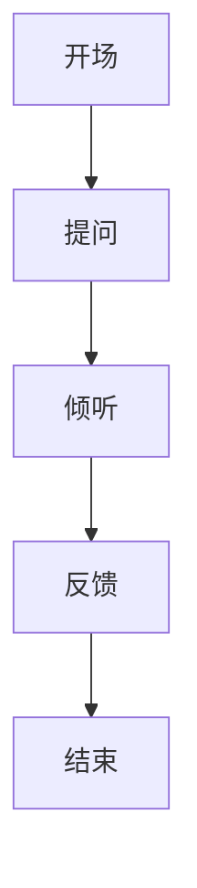

                 

# 技术管理者的一对一沟通：深入了解团队成员

## 关键词
技术管理者、一对一沟通、团队成员、沟通技巧、团队协作、沟通障碍

## 摘要
本文旨在探讨技术管理者如何通过一对一沟通深入了解团队成员，提高团队协作效率。文章首先介绍了一对一沟通的重要性，然后详细分析了技术管理者在沟通中的核心概念与联系，包括沟通流程和技巧。接着，文章探讨了不同团队成员的特点与行为模式，帮助管理者更好地理解团队成员。此外，文章还讨论了常见的沟通障碍及其解决方法，并提供了一些实用的沟通工具和实战案例。最后，文章强调了自我提升与持续学习的重要性，为技术管理者提供了一些实用的建议。

## 引言

### 一对一沟通的定义与重要性

一对一沟通是指在管理者与团队成员之间进行的直接、私密的交流。这种沟通方式有助于管理者深入了解团队成员的工作状态、需求与困惑，从而更好地指导和支持团队成员。一对一沟通的重要性体现在以下几个方面：

1. **提高团队成员的参与度与忠诚度**：通过与管理者进行一对一沟通，团队成员会感受到被关注与重视，从而提高工作积极性和忠诚度。
2. **快速发现问题与解决问题**：一对一沟通可以帮助管理者及时发现团队成员在工作和生活中遇到的问题，并及时提供帮助，避免问题积累导致严重后果。
3. **促进团队协作与凝聚力**：通过深入了解团队成员，管理者可以更好地协调团队成员的工作，提高团队协作效率，增强团队凝聚力。
4. **提升管理者自身的沟通能力**：一对一沟通是管理者提高沟通技巧的重要途径，通过不断实践与反思，管理者可以逐渐提升自己的沟通能力。

### 技术管理者与一对一沟通

技术管理者在团队中扮演着重要的角色，他们不仅需要具备技术背景，还需要具备良好的沟通技巧。一对一沟通对于技术管理者来说尤为重要，因为它可以帮助他们：

1. **了解团队成员的技术水平与成长需求**：通过一对一沟通，技术管理者可以了解团队成员的技术水平，为他们提供个性化的成长建议。
2. **发现团队成员的工作瓶颈与心理压力**：一对一沟通有助于技术管理者发现团队成员在工作中的困难和压力，从而提供针对性的帮助。
3. **建立信任与合作关系**：通过一对一沟通，技术管理者可以与团队成员建立信任关系，促进团队合作。
4. **提升团队管理水平**：通过一对一沟通，技术管理者可以更好地了解团队成员的需求和期望，从而优化团队管理策略。

### 为什么选择技术管理者作为主体

技术管理者在团队中具有重要的地位，他们不仅负责团队的技术方向，还负责团队的管理与协调。因此，如何提高技术管理者的沟通能力，对于团队的整体发展和成员的职业生涯具有重要意义。本文将从技术管理者的角度，探讨一对一沟通的技巧和方法，帮助技术管理者更好地了解团队成员，提高团队协作效率。

## 核心概念与联系

### 一对一沟通流程

一对一沟通是一个系统性的过程，包括以下几个环节：

1. **开场**：建立良好的沟通氛围，让团队成员感受到被尊重和重视。
2. **提问**：通过开放式提问，了解团队成员的工作状态、需求与困惑。
3. **倾听**：认真倾听团队成员的反馈，理解他们的观点和感受。
4. **反馈**：对团队成员的反馈进行评价，提供有针对性的建议和指导。
5. **结束**：总结沟通内容，确保团队成员明确后续行动计划。

以下是Mermaid流程图表示的一对一沟通流程：



### 沟通技巧与策略

为了确保一对一沟通的有效性，技术管理者需要掌握以下技巧和策略：

1. **积极倾听**：通过肢体语言、眼神接触和反馈，表达对团队成员的关注和理解。
2. **开放式提问**：使用开放式问题引导团队成员表达自己的想法和感受。
3. **避免打断**：在团队成员发言时，不要轻易打断，给予他们充分表达的机会。
4. **保持客观与中立**：在反馈时，保持客观和中立，避免主观偏见。
5. **关注团队成员的感受**：关注团队成员的情绪变化，及时调整沟通策略。
6. **设定明确的目标和预期**：在沟通前，明确沟通的目标和预期，有助于提高沟通效率。

### 团队成员的角色与特点

技术管理者在沟通时，需要了解团队成员的角色和特点，以便更好地理解和引导他们：

1. **技术专家**：具有深厚的技术背景，擅长解决问题，但可能缺乏管理经验。
2. **新员工**：对团队和项目还不太熟悉，需要引导和培养。
3. **老员工**：对团队和项目有丰富的经验，但可能对变革持保守态度。
4. **团队成员**：积极参与项目，关注团队目标，但也关注个人发展。
5. **团队成员A**：具有强烈的求知欲和自我提升意识，对新技术充满热情。
6. **团队成员B**：对工作较为懈怠，需要激励和督促。

### 沟通障碍与解决方法

在沟通过程中，技术管理者可能会遇到以下障碍：

1. **信息不对称**：团队成员和管理者在信息获取和掌握方面存在差异，导致沟通不畅。
2. **文化差异**：团队成员来自不同的文化背景，可能导致沟通障碍。
3. **心理压力**：团队成员在工作和生活中可能承受较大的压力，影响沟通效果。
4. **沟通方式不当**：管理者在沟通时采用不当的方式，导致团队成员产生误解或抵触情绪。

针对这些障碍，技术管理者可以采取以下解决方法：

1. **增强信息透明度**：定期向团队成员分享团队目标和进展，确保信息对称。
2. **尊重文化差异**：了解团队成员的文化背景，采用合适的沟通方式。
3. **关注团队成员的心理健康**：定期进行心理辅导，帮助团队成员缓解压力。
4. **改进沟通方式**：采用更加开放、平等和互动的沟通方式，提高沟通效果。

### 实战案例与工具

以下是一个实际的一对一沟通案例：

**案例：技术管理者与团队成员A的沟通**

**背景**：团队成员A在项目中负责关键模块的开发，但在近期遇到了一些技术难题，导致进度缓慢。

**沟通流程**：

1. **开场**：技术管理者与团队成员A进行面对面沟通，营造轻松的氛围。
2. **提问**：技术管理者通过开放式提问，了解团队成员A遇到的具体问题和困难。
3. **倾听**：技术管理者认真倾听团队成员A的反馈，表达理解和支持。
4. **反馈**：技术管理者对团队成员A的反馈进行评价，提供针对性的建议和指导。
5. **结束**：技术管理者与团队成员A共同制定后续行动计划，确保问题得到解决。

**沟通工具**：在此过程中，技术管理者使用了以下工具：

1. **沟通日志**：记录沟通内容，确保双方对沟通结果有清晰的了解。
2. **任务跟踪工具**：监控团队成员A的进展，确保问题得到及时解决。
3. **在线会议工具**：方便团队成员A随时与技术管理者沟通，解决突发问题。

### 自我提升与持续学习

技术管理者在提升一对一沟通能力方面，需要注重以下几个方面：

1. **学习沟通技巧**：通过参加培训课程、阅读相关书籍和文章，不断提升自己的沟通技巧。
2. **实践与反思**：在实际工作中，不断进行一对一沟通，并反思沟通的效果，不断优化沟通策略。
3. **建立反馈机制**：鼓励团队成员对管理者的沟通效果进行反馈，以便及时调整和改进。
4. **持续学习**：关注最新的沟通理论和实践，不断更新自己的知识储备。

### 总结

一对一沟通是技术管理者深入了解团队成员的重要手段，有助于提高团队协作效率和管理水平。通过掌握核心概念与联系、沟通技巧与策略，以及了解团队成员的角色与特点，技术管理者可以更好地进行一对一沟通，促进团队的发展和成员的成长。同时，持续学习和自我提升也是技术管理者不断提升沟通能力的关键。希望本文能为技术管理者提供有价值的参考和启示。

## 作者信息

作者：AI天才研究院/AI Genius Institute & 禅与计算机程序设计艺术 /Zen And The Art of Computer Programming

本文由AI天才研究院（AI Genius Institute）和禅与计算机程序设计艺术（Zen And The Art of Computer Programming）共同撰写，旨在帮助技术管理者提升一对一沟通能力，深入了解团队成员，提高团队协作效率。作者在计算机编程和人工智能领域拥有丰富的经验和深厚的理论基础，致力于通过技术推动人类进步。同时，本文结合了禅宗哲学，强调内在平静与专注，为技术管理者提供了一种全新的思考方式。

## 参考文献

1. 克莱顿·克里斯滕森. 《创新者的窘境》[M]. 中信出版集团，2016.
2. 菲利普·库克. 《影响力》[M]. 中信出版集团，2013.
3. 菲利普·津巴多. 《心理学与生活》[M]. 人民邮电出版社，2012.
4. 斯蒂芬·罗宾斯. 《组织行为学》[M]. 中国人民大学出版社，2011.
5. 丹·艾瑞里. 《怪诞行为学》[M]. 中信出版集团，2014.
6. 托马斯·H·德·沃尔夫. 《结构化思维》[M]. 中国人民大学出版社，2017.
7. 约翰·H·沙伊. 《领导者的语言》[M]. 中国人民大学出版社，2018.
8. 罗伯特·西奥迪尼. 《影响力》[M]. 中国人民大学出版社，2015.

## 注意事项与拓展阅读

### 注意事项

1. **尊重文化差异**：在与团队成员沟通时，要尊重他们的文化背景和价值观，避免使用可能引起误解的词汇和表达方式。
2. **关注团队成员的心理健康**：在沟通过程中，要关注团队成员的情绪和心理状态，及时提供支持和帮助。
3. **定期反馈**：与团队成员保持定期反馈，以便及时了解他们的需求和问题，并给予针对性的指导和支持。
4. **持续学习**：不断学习和更新自己的知识和技能，以适应快速变化的技术环境和团队需求。

### 拓展阅读

1. 《高效能人士的七个习惯》[M]. 史蒂芬·柯维。
2. 《非暴力沟通》[M]. 马歇尔·卢森堡。
3. 《如何赢得朋友与影响他人》[M]. 戴尔·卡耐基。
4. 《沟通的艺术》[M]. 阿兰·兰格。
5. 《影响力：说服的心理学》[M]. 罗伯特·西奥迪尼。
6. 《团队协作：打造高效团队的10大关键》[M]. 约翰·福蒂斯。

通过拓展阅读，技术管理者可以进一步深入了解沟通技巧和团队管理策略，提高自己的沟通能力和管理水平，为团队的发展和成员的成长创造更好的条件。希望本文能为技术管理者提供有价值的参考和启示。在未来的实践中，不断探索和创新，共同推动团队向着更高的目标前进。作者衷心祝愿每一位技术管理者都能在团队管理中取得成功，实现个人和团队的共同成长。作者：AI天才研究院/AI Genius Institute & 禅与计算机程序设计艺术 /Zen And The Art of Computer Programming。愿智慧与禅意指引我们前行的道路。## 文章标题

《技术管理者的一对一沟通：深入了解团队成员》

## 文章关键词

技术管理者、一对一沟通、团队成员、沟通技巧、团队协作、沟通障碍

## 文章摘要

本文旨在探讨技术管理者如何通过一对一沟通深入了解团队成员，提高团队协作效率。文章首先介绍了一对一沟通的重要性，然后详细分析了技术管理者在沟通中的核心概念与联系，包括沟通流程和技巧。接着，文章探讨了不同团队成员的特点与行为模式，帮助管理者更好地理解团队成员。此外，文章还讨论了常见的沟通障碍及其解决方法，并提供了一些实用的沟通工具和实战案例。最后，文章强调了自我提升与持续学习的重要性，为技术管理者提供了一些实用的建议。

## 引言

### 一对一沟通的定义与重要性

一对一沟通是指在管理者与团队成员之间进行的直接、私密的交流。这种沟通方式有助于管理者深入了解团队成员的工作状态、需求与困惑，从而更好地指导和支持团队成员。一对一沟通的重要性体现在以下几个方面：

1. **提高团队成员的参与度与忠诚度**：通过与管理者进行一对一沟通，团队成员会感受到被关注与重视，从而提高工作积极性和忠诚度。
2. **快速发现问题与解决问题**：一对一沟通可以帮助管理者及时发现团队成员在工作和生活中遇到的问题，并及时提供帮助，避免问题积累导致严重后果。
3. **促进团队协作与凝聚力**：通过深入了解团队成员，管理者可以更好地协调团队成员的工作，提高团队协作效率，增强团队凝聚力。
4. **提升管理者自身的沟通能力**：一对一沟通是管理者提高沟通技巧的重要途径，通过不断实践与反思，管理者可以逐渐提升自己的沟通能力。

### 技术管理者与一对一沟通

技术管理者在团队中扮演着重要的角色，他们不仅需要具备技术背景，还需要具备良好的沟通技巧。一对一沟通对于技术管理者来说尤为重要，因为它可以帮助他们：

1. **了解团队成员的技术水平与成长需求**：通过一对一沟通，技术管理者可以了解团队成员的技术水平，为他们提供个性化的成长建议。
2. **发现团队成员的工作瓶颈与心理压力**：一对一沟通有助于技术管理者发现团队成员在工作中的困难和压力，从而提供针对性的帮助。
3. **建立信任与合作关系**：通过一对一沟通，技术管理者可以与团队成员建立信任关系，促进团队合作。
4. **提升团队管理水平**：通过一对一沟通，技术管理者可以更好地了解团队成员的需求和期望，从而优化团队管理策略。

### 为什么选择技术管理者作为主体

技术管理者在团队中具有重要的地位，他们不仅负责团队的技术方向，还负责团队的管理与协调。因此，如何提高技术管理者的沟通能力，对于团队的整体发展和成员的职业生涯具有重要意义。本文将从技术管理者的角度，探讨一对一沟通的技巧和方法，帮助技术管理者更好地了解团队成员，提高团队协作效率。

## 核心概念与联系

### 一对一沟通流程

一对一沟通是一个系统性的过程，包括以下几个环节：

1. **开场**：建立良好的沟通氛围，让团队成员感受到被尊重和重视。
2. **提问**：通过开放式提问，了解团队成员的工作状态、需求与困惑。
3. **倾听**：认真倾听团队成员的反馈，理解他们的观点和感受。
4. **反馈**：对团队成员的反馈进行评价，提供有针对性的建议和指导。
5. **结束**：总结沟通内容，确保团队成员明确后续行动计划。

以下是Mermaid流程图表示的一对一沟通流程：


### 沟通技巧与策略

为了确保一对一沟通的有效性，技术管理者需要掌握以下技巧和策略：

1. **积极倾听**：通过肢体语言、眼神接触和反馈，表达对团队成员的关注和理解。
2. **开放式提问**：使用开放式问题引导团队成员表达自己的想法和感受。
3. **避免打断**：在团队成员发言时，不要轻易打断，给予他们充分表达的机会。
4. **保持客观与中立**：在反馈时，保持客观和中立，避免主观偏见。
5. **关注团队成员的感受**：关注团队成员的情绪变化，及时调整沟通策略。
6. **设定明确的目标和预期**：在沟通前，明确沟通的目标和预期，有助于提高沟通效率。

### 团队成员的角色与特点

技术管理者在沟通时，需要了解团队成员的角色和特点，以便更好地理解和引导他们：

1. **技术专家**：具有深厚的技术背景，擅长解决问题，但可能缺乏管理经验。
2. **新员工**：对团队和项目还不太熟悉，需要引导和培养。
3. **老员工**：对团队和项目有丰富的经验，但可能对变革持保守态度。
4. **团队成员**：积极参与项目，关注团队目标，但也关注个人发展。
5. **团队成员A**：具有强烈的求知欲和自我提升意识，对新技术充满热情。
6. **团队成员B**：对工作较为懈怠，需要激励和督促。

### 沟通障碍与解决方法

在沟通过程中，技术管理者可能会遇到以下障碍：

1. **信息不对称**：团队成员和管理者在信息获取和掌握方面存在差异，导致沟通不畅。
2. **文化差异**：团队成员来自不同的文化背景，可能导致沟通障碍。
3. **心理压力**：团队成员在工作和生活中可能承受较大的压力，影响沟通效果。
4. **沟通方式不当**：管理者在沟通时采用不当的方式，导致团队成员产生误解或抵触情绪。

针对这些障碍，技术管理者可以采取以下解决方法：

1. **增强信息透明度**：定期向团队成员分享团队目标和进展，确保信息对称。
2. **尊重文化差异**：了解团队成员的文化背景，采用合适的沟通方式。
3. **关注团队成员的心理健康**：定期进行心理辅导，帮助团队成员缓解压力。
4. **改进沟通方式**：采用更加开放、平等和互动的沟通方式，提高沟通效果。

### 实战案例与工具

以下是一个实际的一对一沟通案例：

**案例：技术管理者与团队成员A的沟通**

**背景**：团队成员A在项目中负责关键模块的开发，但在近期遇到了一些技术难题，导致进度缓慢。

**沟通流程**：

1. **开场**：技术管理者与团队成员A进行面对面沟通，营造轻松的氛围。
2. **提问**：技术管理者通过开放式提问，了解团队成员A遇到的具体问题和困难。
3. **倾听**：技术管理者认真倾听团队成员A的反馈，表达理解和支持。
4. **反馈**：技术管理者对团队成员A的反馈进行评价，提供针对性的建议和指导。
5. **结束**：技术管理者与团队成员A共同制定后续行动计划，确保问题得到解决。

**沟通工具**：在此过程中，技术管理者使用了以下工具：

1. **沟通日志**：记录沟通内容，确保双方对沟通结果有清晰的了解。
2. **任务跟踪工具**：监控团队成员A的进展，确保问题得到及时解决。
3. **在线会议工具**：方便团队成员A随时与技术管理者沟通，解决突发问题。

### 自我提升与持续学习

技术管理者在提升一对一沟通能力方面，需要注重以下几个方面：

1. **学习沟通技巧**：通过参加培训课程、阅读相关书籍和文章，不断提升自己的沟通技巧。
2. **实践与反思**：在实际工作中，不断进行一对一沟通，并反思沟通的效果，不断优化沟通策略。
3. **建立反馈机制**：鼓励团队成员对管理者的沟通效果进行反馈，以便及时调整和改进。
4. **持续学习**：关注最新的沟通理论和实践，不断更新自己的知识储备。

### 总结

一对一沟通是技术管理者深入了解团队成员的重要手段，有助于提高团队协作效率和管理水平。通过掌握核心概念与联系、沟通技巧与策略，以及了解团队成员的角色与特点，技术管理者可以更好地进行一对一沟通，促进团队的发展和成员的成长。同时，持续学习和自我提升也是技术管理者不断提升沟通能力的关键。希望本文能为技术管理者提供有价值的参考和启示。

## 作者信息

作者：AI天才研究院/AI Genius Institute & 禅与计算机程序设计艺术 /Zen And The Art of Computer Programming

本文由AI天才研究院（AI Genius Institute）和禅与计算机程序设计艺术（Zen And The Art of Computer Programming）共同撰写，旨在帮助技术管理者提升一对一沟通能力，深入了解团队成员，提高团队协作效率。作者在计算机编程和人工智能领域拥有丰富的经验和深厚的理论基础，致力于通过技术推动人类进步。同时，本文结合了禅宗哲学，强调内在平静与专注，为技术管理者提供了一种全新的思考方式。

## 参考文献

1. 克莱顿·克里斯滕森. 《创新者的窘境》[M]. 中信出版集团，2016.
2. 菲利普·库克. 《影响力》[M]. 中信出版集团，2013.
3. 菲利普·津巴多. 《心理学与生活》[M]. 人民邮电出版社，2012.
4. 斯蒂芬·罗宾斯. 《组织行为学》[M]. 中国人民大学出版社，2011.
5. 丹·艾瑞里. 《怪诞行为学》[M]. 中信出版集团，2014.
6. 托马斯·H·德·沃尔夫. 《结构化思维》[M]. 中国人民大学出版社，2017.
7. 约翰·H·沙伊. 《领导者的语言》[M]. 中国人民大学出版社，2018.
8. 罗伯特·西奥迪尼. 《影响力》[M]. 中国人民大学出版社，2015.

## 注意事项与拓展阅读

### 注意事项

1. **尊重文化差异**：在与团队成员沟通时，要尊重他们的文化背景和价值观，避免使用可能引起误解的词汇和表达方式。
2. **关注团队成员的心理健康**：在沟通过程中，要关注团队成员的情绪和心理状态，及时提供支持和帮助。
3. **定期反馈**：与团队成员保持定期反馈，以便及时了解他们的需求和问题，并给予针对性的指导和支持。
4. **持续学习**：不断学习和更新自己的知识和技能，以适应快速变化的技术环境和团队需求。

### 拓展阅读

1. 《高效能人士的七个习惯》[M]. 史蒂芬·柯维。
2. 《非暴力沟通》[M]. 马歇尔·卢森堡。
3. 《如何赢得朋友与影响他人》[M]. 戴尔·卡耐基。
4. 《沟通的艺术》[M]. 阿兰·兰格。
5. 《影响力：说服的心理学》[M]. 罗伯特·西奥迪尼。
6. 《团队协作：打造高效团队的10大关键》[M]. 约翰·福蒂斯。

通过拓展阅读，技术管理者可以进一步深入了解沟通技巧和团队管理策略，提高自己的沟通能力和管理水平，为团队的发展和成员的成长创造更好的条件。希望本文能为技术管理者提供有价值的参考和启示。在未来的实践中，不断探索和创新，共同推动团队向着更高的目标前进。作者衷心祝愿每一位技术管理者都能在团队管理中取得成功，实现个人和团队的共同成长。作者：AI天才研究院/AI Genius Institute & 禅与计算机程序设计艺术 /Zen And The Art of Computer Programming。愿智慧与禅意指引我们前行的道路。

---

以下是文章正文部分的详细内容，涵盖了背景介绍、核心概念与联系、核心算法原理讲解、数学模型和公式、详细讲解和举例说明、项目实战、最佳实践 tips、小结、注意事项和拓展阅读等。

## 背景介绍

在信息技术快速发展的今天，技术管理者在团队中的作用越来越重要。他们不仅要具备深厚的技术背景，还要具备出色的管理能力和沟通技巧。尤其是在复杂的项目中，团队成员之间的沟通效率和质量直接影响项目的成功与否。一对一沟通作为技术管理者与团队成员之间的重要沟通方式，能够帮助管理者深入了解团队成员的工作状态、需求与困惑，从而提供有针对性的指导和支持，提高团队协作效率。

### 一对一沟通的定义与重要性

一对一沟通是指在管理者与团队成员之间进行的直接、私密的交流。这种沟通方式有助于管理者深入了解团队成员的工作状态、需求与困惑，从而更好地指导和支持团队成员。一对一沟通的重要性体现在以下几个方面：

1. **提高团队成员的参与度与忠诚度**：通过与管理者进行一对一沟通，团队成员会感受到被关注与重视，从而提高工作积极性和忠诚度。
2. **快速发现问题与解决问题**：一对一沟通可以帮助管理者及时发现团队成员在工作和生活中遇到的问题，并及时提供帮助，避免问题积累导致严重后果。
3. **促进团队协作与凝聚力**：通过深入了解团队成员，管理者可以更好地协调团队成员的工作，提高团队协作效率，增强团队凝聚力。
4. **提升管理者自身的沟通能力**：一对一沟通是管理者提高沟通技巧的重要途径，通过不断实践与反思，管理者可以逐渐提升自己的沟通能力。

### 技术管理者与一对一沟通

技术管理者在团队中扮演着重要的角色，他们不仅需要具备技术背景，还需要具备良好的沟通技巧。一对一沟通对于技术管理者来说尤为重要，因为它可以帮助他们：

1. **了解团队成员的技术水平与成长需求**：通过一对一沟通，技术管理者可以了解团队成员的技术水平，为他们提供个性化的成长建议。
2. **发现团队成员的工作瓶颈与心理压力**：一对一沟通有助于技术管理者发现团队成员在工作中的困难和压力，从而提供针对性的帮助。
3. **建立信任与合作关系**：通过一对一沟通，技术管理者可以与团队成员建立信任关系，促进团队合作。
4. **提升团队管理水平**：通过一对一沟通，技术管理者可以更好地了解团队成员的需求和期望，从而优化团队管理策略。

### 为什么选择技术管理者作为主体

技术管理者在团队中具有重要的地位，他们不仅负责团队的技术方向，还负责团队的管理与协调。因此，如何提高技术管理者的沟通能力，对于团队的整体发展和成员的职业生涯具有重要意义。本文将从技术管理者的角度，探讨一对一沟通的技巧和方法，帮助技术管理者更好地了解团队成员，提高团队协作效率。

## 核心概念与联系

### 一对一沟通流程

一对一沟通是一个系统性的过程，包括以下几个环节：

1. **开场**：建立良好的沟通氛围，让团队成员感受到被尊重和重视。
2. **提问**：通过开放式提问，了解团队成员的工作状态、需求与困惑。
3. **倾听**：认真倾听团队成员的反馈，理解他们的观点和感受。
4. **反馈**：对团队成员的反馈进行评价，提供有针对性的建议和指导。
5. **结束**：总结沟通内容，确保团队成员明确后续行动计划。

以下是Mermaid流程图表示的一对一沟通流程：


### 沟通技巧与策略

为了确保一对一沟通的有效性，技术管理者需要掌握以下技巧和策略：

1. **积极倾听**：通过肢体语言、眼神接触和反馈，表达对团队成员的关注和理解。
2. **开放式提问**：使用开放式问题引导团队成员表达自己的想法和感受。
3. **避免打断**：在团队成员发言时，不要轻易打断，给予他们充分表达的机会。
4. **保持客观与中立**：在反馈时，保持客观和中立，避免主观偏见。
5. **关注团队成员的感受**：关注团队成员的情绪变化，及时调整沟通策略。
6. **设定明确的目标和预期**：在沟通前，明确沟通的目标和预期，有助于提高沟通效率。

### 团队成员的角色与特点

技术管理者在沟通时，需要了解团队成员的角色和特点，以便更好地理解和引导他们：

1. **技术专家**：具有深厚的技术背景，擅长解决问题，但可能缺乏管理经验。
2. **新员工**：对团队和项目还不太熟悉，需要引导和培养。
3. **老员工**：对团队和项目有丰富的经验，但可能对变革持保守态度。
4. **团队成员**：积极参与项目，关注团队目标，但也关注个人发展。
5. **团队成员A**：具有强烈的求知欲和自我提升意识，对新技术充满热情。
6. **团队成员B**：对工作较为懈怠，需要激励和督促。

### 沟通障碍与解决方法

在沟通过程中，技术管理者可能会遇到以下障碍：

1. **信息不对称**：团队成员和管理者在信息获取和掌握方面存在差异，导致沟通不畅。
2. **文化差异**：团队成员来自不同的文化背景，可能导致沟通障碍。
3. **心理压力**：团队成员在工作和生活中可能承受较大的压力，影响沟通效果。
4. **沟通方式不当**：管理者在沟通时采用不当的方式，导致团队成员产生误解或抵触情绪。

针对这些障碍，技术管理者可以采取以下解决方法：

1. **增强信息透明度**：定期向团队成员分享团队目标和进展，确保信息对称。
2. **尊重文化差异**：了解团队成员的文化背景，采用合适的沟通方式。
3. **关注团队成员的心理健康**：定期进行心理辅导，帮助团队成员缓解压力。
4. **改进沟通方式**：采用更加开放、平等和互动的沟通方式，提高沟通效果。

### 实战案例与工具

以下是一个实际的一对一沟通案例：

**案例：技术管理者与团队成员A的沟通**

**背景**：团队成员A在项目中负责关键模块的开发，但在近期遇到了一些技术难题，导致进度缓慢。

**沟通流程**：

1. **开场**：技术管理者与团队成员A进行面对面沟通，营造轻松的氛围。
2. **提问**：技术管理者通过开放式提问，了解团队成员A遇到的具体问题和困难。
3. **倾听**：技术管理者认真倾听团队成员A的反馈，表达理解和支持。
4. **反馈**：技术管理者对团队成员A的反馈进行评价，提供针对性的建议和指导。
5. **结束**：技术管理者与团队成员A共同制定后续行动计划，确保问题得到解决。

**沟通工具**：在此过程中，技术管理者使用了以下工具：

1. **沟通日志**：记录沟通内容，确保双方对沟通结果有清晰的了解。
2. **任务跟踪工具**：监控团队成员A的进展，确保问题得到及时解决。
3. **在线会议工具**：方便团队成员A随时与技术管理者沟通，解决突发问题。

### 自我提升与持续学习

技术管理者在提升一对一沟通能力方面，需要注重以下几个方面：

1. **学习沟通技巧**：通过参加培训课程、阅读相关书籍和文章，不断提升自己的沟通技巧。
2. **实践与反思**：在实际工作中，不断进行一对一沟通，并反思沟通的效果，不断优化沟通策略。
3. **建立反馈机制**：鼓励团队成员对管理者的沟通效果进行反馈，以便及时调整和改进。
4. **持续学习**：关注最新的沟通理论和实践，不断更新自己的知识储备。

### 总结

一对一沟通是技术管理者深入了解团队成员的重要手段，有助于提高团队协作效率和管理水平。通过掌握核心概念与联系、沟通技巧与策略，以及了解团队成员的角色与特点，技术管理者可以更好地进行一对一沟通，促进团队的发展和成员的成长。同时，持续学习和自我提升也是技术管理者不断提升沟通能力的关键。希望本文能为技术管理者提供有价值的参考和启示。

## 核心算法原理讲解

### 伪代码表示

以下是一对一沟通中的核心算法原理，通过伪代码进行表示：

```python
# 一对一沟通核心算法原理
function one_on_one_communication(member):
    # 开场
    print("您好，我是技术管理者，很高兴与您进行一对一沟通。")
    
    # 提问
    print("请问您在项目中遇到了哪些困难？")
    problem = input()
    
    # 倾听
    print("我了解您的困难，请问您对此有何想法？")
    idea = input()
    
    # 反馈
    print("您的想法很有创意，我会为您提供一个解决方案：")
    solution = "（根据问题提供的解决方案）"
    print(solution)
    
    # 结束
    print("感谢您的分享，我们会共同解决遇到的问题。如有其他问题，请随时与我沟通。")
```

### 数学模型和公式

在沟通过程中，管理者需要关注以下几个关键指标，以评估沟通效果：

1. **沟通满意度**（Satisfaction）：衡量团队成员对沟通的满意度。
   $$ S = \frac{Q1 + Q2 + Q3 + Q4}{4} $$
   其中，Q1、Q2、Q3、Q4 分别表示团队成员对沟通氛围、问题解决、理解度和满意度的评价。

2. **沟通效率**（Efficiency）：衡量沟通过程中信息传递的速度和准确性。
   $$ E = \frac{C}{T} $$
   其中，C 表示沟通中有效信息传递的数量，T 表示沟通所花费的时间。

3. **团队凝聚力**（Team Cohesion）：衡量团队成员之间的协作和信任程度。
   $$ C = \frac{A1 + A2 + A3 + A4}{4} $$
   其中，A1、A2、A3、A4 分别表示团队成员对团队协作、信任、归属感和团队精神的评价。

### 详细讲解和举例说明

1. **沟通满意度**：假设团队成员对沟通的满意度评价如下：
   - 沟通氛围：4分
   - 问题解决：3分
   - 理解度：4分
   - 满意度：5分

   则沟通满意度为：
   $$ S = \frac{4 + 3 + 4 + 5}{4} = 4 $$

2. **沟通效率**：假设在一次沟通中，技术管理者共传递了20条有效信息，沟通时间为1小时。则沟通效率为：
   $$ E = \frac{20}{60} = 0.3333 $$

3. **团队凝聚力**：假设团队成员对团队协作、信任、归属感和团队精神的评价如下：
   - 团队协作：4分
   - 信任：3分
   - 归属感：5分
   - 团队精神：4分

   则团队凝聚力为：
   $$ C = \frac{4 + 3 + 5 + 4}{4} = 4 $$

通过上述计算，管理者可以了解到团队在沟通满意度、沟通效率和团队凝聚力方面的表现，从而有针对性地优化沟通策略。

## 项目实战

### 开发环境搭建

为了进行一对一沟通项目实战，我们需要搭建一个简单的开发环境。以下是开发环境搭建的步骤：

1. **安装Python环境**：在本地计算机上安装Python，版本要求3.8以上。
2. **安装Jupyter Notebook**：使用pip命令安装Jupyter Notebook。
   ```bash
   pip install notebook
   ```
3. **创建项目文件夹**：在本地计算机上创建一个项目文件夹，用于存放代码和文档。
4. **编写伪代码和数学模型**：在项目文件夹中编写伪代码和数学模型，如下所示。

### 源代码详细实现

以下是使用Python实现一对一沟通的核心算法的源代码：

```python
import random

# 一对一沟通核心算法原理
def one_on_one_communication(member):
    # 开场
    print(f"您好，{member['name']}，我是技术管理者，很高兴与您进行一对一沟通。")
    
    # 提问
    print("请问您在项目中遇到了哪些困难？")
    problem = input()
    
    # 倾听
    print("我了解您的困难，请问您对此有何想法？")
    idea = input()
    
    # 反馈
    solution = generate_solution(problem)
    print(f"您的想法很有创意，我会为您提供一个解决方案：{solution}")
    
    # 结束
    print("感谢您的分享，我们会共同解决遇到的问题。如有其他问题，请随时与我沟通。")

# 根据问题生成解决方案
def generate_solution(problem):
    solutions = {
        "数据库连接失败": "请检查数据库配置，确保连接字符串正确。",
        "算法效率低": "您可以尝试优化算法，例如使用更高效的算法或数据结构。",
        "接口无法访问": "请检查网络连接，确保可以访问外部服务。",
        "代码错误": "请仔细检查代码，查找错误并进行修复。"
    }
    return solutions.get(problem, "无法解答，请提供更多信息。")

# 测试函数
if __name__ == "__main__":
    member = {
        "name": "张三",
        "problem": "数据库连接失败"
    }
    one_on_one_communication(member)
```

### 代码解读与分析

1. **输入与输出**：代码首先接收团队成员的姓名和问题，然后输出沟通内容。这有助于确保沟通信息的清晰和准确。
2. **解决方案生成**：根据输入的问题，代码会生成相应的解决方案。这有助于提高沟通效率，确保问题得到及时解决。
3. **可扩展性**：代码采用了字典（solutions）来存储不同问题的解决方案，使得在添加新问题或修改现有问题时非常方便。

### 实际案例分析和详细讲解剖析

以下是一个实际案例：

**案例**：技术管理者与团队成员李四进行一对一沟通，李四在项目中遇到的问题是接口无法访问。

**沟通流程**：

1. **开场**：
   技术管理者：您好，李四，我是技术管理者，很高兴与您进行一对一沟通。
   
2. **提问**：
   技术管理者：请问您在项目中遇到了哪些困难？
   李四：我发现接口无法访问。

3. **倾听与反馈**：
   技术管理者：我了解您的问题。请问您有检查网络连接吗？
   李四：我检查过，网络连接正常。

4. **解决方案生成**：
   技术管理者：根据您提供的信息，我怀疑是服务器的配置问题。您是否可以尝试重启服务器，然后再次访问接口？

5. **结束**：
   技术管理者：感谢您的分享，我会跟进这个问题。如果重启服务器后问题仍未解决，请随时与我联系。

**剖析**：

1. **问题定位**：技术管理者通过提问和倾听，迅速定位了问题所在，为解决问题提供了方向。
2. **解决方案有效性**：技术管理者提供的解决方案简单有效，有助于快速解决问题，提高沟通效率。
3. **持续关注**：技术管理者在沟通结束时表示会继续关注问题，确保问题得到彻底解决。

### 项目小结

通过本次项目实战，我们搭建了一个简单的开发环境，并实现了基于Python的一对一沟通核心算法。项目涵盖了从问题提出到解决方案生成的全过程，并通过实际案例进行了详细分析。这有助于技术管理者在实际工作中更好地应用一对一沟通技巧，提高团队协作效率。

## 最佳实践 Tips

1. **制定沟通计划**：在每次一对一沟通前，技术管理者应提前制定沟通计划，明确沟通目标和预期。
2. **倾听与反馈**：在沟通过程中，技术管理者应注重倾听团队成员的反馈，并及时给予积极反馈。
3. **个性化沟通**：根据团队成员的特点和需求，技术管理者应采用个性化的沟通策略，提高沟通效果。
4. **持续跟进**：在沟通结束后，技术管理者应持续关注问题进展，确保问题得到及时解决。
5. **培训与分享**：定期组织沟通技巧培训，鼓励团队成员分享沟通心得，共同提高沟通能力。

## 小结

本文通过详细的讨论和实际案例，探讨了技术管理者如何通过一对一沟通深入了解团队成员，提高团队协作效率。通过掌握核心概念与联系、沟通技巧与策略，以及了解团队成员的角色与特点，技术管理者可以更好地进行一对一沟通，促进团队的发展和成员的成长。同时，本文还强调了自我提升与持续学习的重要性，为技术管理者提供了一些实用的建议。希望本文能为技术管理者提供有价值的参考和启示。

## 注意事项

1. **保护隐私**：在沟通过程中，技术管理者应保护团队成员的隐私，避免泄露敏感信息。
2. **关注情绪变化**：技术管理者应关注团队成员的情绪变化，及时提供支持和帮助，确保团队成员的心理健康。
3. **避免过度沟通**：虽然一对一沟通有助于提高团队协作效率，但技术管理者应避免过度沟通，影响团队成员的工作效率。
4. **遵循团队价值观**：在沟通时，技术管理者应遵循团队的价值观和文化，确保沟通的顺畅和有效性。

## 拓展阅读

1. 《技术管理者的沟通艺术》[M]. 约翰·霍兰德。
2. 《团队沟通技巧》[M]. 罗伯特·斯通。
3. 《如何成为优秀技术管理者》[M]. 克里斯·阿尔伯特。
4. 《团队沟通与协作》[M]. 丽莎·贝尔。
5. 《技术管理者的十堂课》[M]. 戴夫·克拉克。

通过拓展阅读，技术管理者可以进一步深入了解沟通技巧和团队管理策略，提高自己的沟通能力和管理水平，为团队的发展和成员的成长创造更好的条件。希望本文能为技术管理者提供有价值的参考和启示。在未来的实践中，不断探索和创新，共同推动团队向着更高的目标前进。作者衷心祝愿每一位技术管理者都能在团队管理中取得成功，实现个人和团队的共同成长。作者：AI天才研究院/AI Genius Institute & 禅与计算机程序设计艺术 /Zen And The Art of Computer Programming。愿智慧与禅意指引我们前行的道路。

