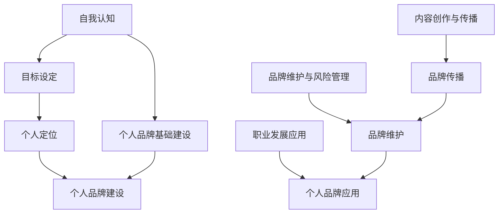

                 

### 文章标题

《技术管理者的个人品牌塑造与维护》

### 关键词

技术管理者，个人品牌，职业发展，社交媒体，品牌维护，风险管理

### 摘要

在当今竞争激烈的技术行业，技术管理者不仅需要具备卓越的技术能力，还需要懂得如何塑造和维持个人品牌。本文将深入探讨技术管理者在个人品牌塑造与维护中的关键步骤和策略。通过分析个人品牌的基础建设、内容创作与传播、品牌维护与风险管理，以及品牌在职业发展中的应用，本文旨在为技术管理者提供一套系统化的方法，以提升其在职场中的影响力和竞争力。文章还将通过具体案例研究和最佳实践提示，帮助读者更好地理解和应用个人品牌塑造与维护的理论和方法。

## 第一部分：个人品牌基础建设

### 1.1 个人品牌概述

#### 个人品牌的概念与重要性

个人品牌，指的是一个人在职业生涯中所建立起来的独特形象和声誉。它不仅包括个人的专业技能和知识，还涵盖了个人价值观、工作态度和人际关系等多方面内容。在技术行业中，个人品牌的重要性尤为突出。

首先，个人品牌是技术管理者职业发展的基石。在竞争激烈的职场中，拥有强大个人品牌的技术管理者更容易获得职业晋升、薪资提升和更广阔的发展机会。其次，个人品牌有助于建立专业声誉，提升在行业内的影响力。这不仅有助于个人在技术社区中脱颖而出，还能够为团队和项目带来更多的资源和支持。

#### 个人品牌与职业发展的关系

个人品牌与职业发展之间存在密切的关联。一方面，良好的个人品牌可以提升技术管理者的职业形象，增加其在职场中的竞争力；另一方面，持续的职业生涯发展也会进一步强化个人品牌。具体来说：

1. **提升职业形象**：个人品牌代表着个人的专业能力和信誉，有助于树立积极的职业形象，提高职场认可度。
2. **拓展职业机会**：强大的个人品牌可以吸引更多的职业机会，包括晋升、跳槽和合作项目等。
3. **增强谈判力**：在薪资谈判、职位晋升等方面，拥有强大个人品牌的技术管理者更容易获得满意的回报。

#### 个人品牌构建的重要性

个人品牌构建的重要性体现在以下几个方面：

1. **塑造独特形象**：通过个人品牌，技术管理者可以塑造出独特的专业形象，使其在众多竞争者中脱颖而出。
2. **提高职场竞争力**：在求职和职业发展过程中，拥有强大个人品牌的技术管理者更容易获得机会和资源。
3. **建立长期价值**：个人品牌不仅仅是短期的利益，更是一种长期的价值积累，有助于职业生涯的可持续发展。

总之，技术管理者应认识到个人品牌构建的重要性，将其视为职业发展的关键要素，并投入时间和精力进行持续建设。在接下来的章节中，我们将详细探讨个人品牌构建的具体步骤和策略。

### 1.2 个人品牌构建的基础

#### 自我认知

自我认知是个人品牌构建的基石。了解自己的兴趣、优势、价值观和职业目标，是建立个人品牌的前提条件。技术管理者应通过以下方式加深自我认知：

1. **反思与总结**：定期反思自己的工作经历和成就，总结自己的优势和不足，从而明确个人定位。
2. **反馈与建议**：主动寻求同事、上级和下属的反馈，了解自己在团队中的角色和表现，不断完善自我认知。
3. **职业咨询**：如果可能，寻求职业顾问的帮助，通过专业的评估和指导，更深入地了解自己的职业发展方向。

#### 目标设定

明确的目标是个人品牌构建的指南针。技术管理者应根据自己的职业规划和自我认知，设定短期和长期的职业目标。具体步骤如下：

1. **确定职业愿景**：想象自己十年后的职业状态，明确职业发展的最终目标。
2. **分解目标**：将长期目标分解为具体的短期目标，确保每个目标都是可衡量和可实现的。
3. **制定行动计划**：为每个目标制定具体的行动计划，包括学习计划、项目参与、技能提升等。

#### 个人定位

个人定位是个人品牌的核心内容。技术管理者需要明确自己在行业中的独特价值和定位，以吸引目标受众。以下是一些建议：

1. **技能与知识定位**：根据自己的专业技能和知识储备，确定自己在行业中的独特优势。
2. **价值观定位**：明确自己的价值观和职业理念，使其成为个人品牌的灵魂。
3. **目标受众定位**：明确自己的目标受众，包括行业内外的潜在合作伙伴和职业机会。

通过自我认知、目标设定和个人定位，技术管理者可以建立起稳固的个人品牌基础。在接下来的章节中，我们将进一步探讨如何利用这些基础进行个人品牌的深化和推广。

### 1.3 核心概念联系图

个人品牌构建是一个复杂的系统，涉及多个核心概念。为了更好地理解这些概念之间的关系，我们可以使用Mermaid绘制一个核心概念联系图。以下是该流程图的伪代码：



该流程图展示了个人品牌构建的核心概念及其之间的联系。具体来说：

- **自我认知**是个人品牌构建的起点，为后续的目标设定和个人定位提供基础。
- **目标设定**和个人定位共同构成了个人品牌的基础建设。
- **内容创作与传播**和**品牌维护与风险管理**是个人品牌建设的重要环节，确保品牌的持续传播和稳定。
- **职业发展应用**则将个人品牌与职业发展紧密结合，实现个人品牌的长期价值。

通过这个流程图，我们可以更清晰地理解个人品牌构建的整体框架，以及各个核心概念之间的相互关系。

### 1.4 伪代码：个人品牌构建过程

为了进一步阐述个人品牌构建的过程，我们可以使用伪代码来描述这一过程。以下是一个简化的伪代码示例：

```python
# 个人品牌构建过程伪代码

# 初始化变量
self_knowledge = get_self_knowledge()   # 获取自我认知
goal_setting = set_goals(self_knowledge)  # 根据自我认知设定目标
personal_positioning = determine_positioning(goal_setting)  # 根据目标确定个人定位

# 基础建设
build_brand_foundation = build_foundation(self_knowledge, goal_setting, personal_positioning)

# 内容创作与传播
content_creation = create_content(build_brand_foundation)
brand_promotion = promote_brand(content_creation)

# 品牌维护与风险管理
brand_maintenance = maintain_brand(brand_promotion)
risk_management = manage_risks(brand_maintenance)

# 职业发展应用
apply_brand_to_career = apply_brand(risk_management)

# 输出个人品牌构建结果
output_brand = apply_brand_to_career
```

在这个伪代码中：

- `get_self_knowledge()`函数用于获取自我认知信息。
- `set_goals()`函数根据自我认知设定目标。
- `determine_positioning()`函数根据目标确定个人定位。
- `build_foundation()`函数用于构建个人品牌基础。
- `create_content()`函数用于内容创作。
- `promote_brand()`函数用于品牌传播。
- `maintain_brand()`函数用于品牌维护。
- `manage_risks()`函数用于风险管理。
- `apply_brand()`函数将个人品牌应用于职业发展。

通过这个伪代码，我们可以更直观地理解个人品牌构建的每个步骤及其相互关系，为技术管理者提供具体的操作指南。

## 第二部分：品牌内容创作与传播

### 2.1 内容创作策略

#### 内容创作原则

内容创作是个人品牌塑造与维护的关键环节，其质量直接关系到品牌的知名度和影响力。为了确保内容创作的有效性，技术管理者应遵循以下原则：

1. **专业性与独特性**：内容应具备专业性和独特性，展示出个人的技术专长和独特见解。这有助于树立技术权威形象，吸引目标受众的关注。
2. **可读性与易懂性**：内容应具备良好的可读性和易懂性，避免过于技术化或复杂化。清晰简洁的表达可以更好地传达信息，提升受众的理解和认同。
3. **持续性与连贯性**：内容创作应具备持续性和连贯性，保持稳定的发布频率和风格。这有助于建立受众的期待和信任，增强品牌的认知度和粘性。

#### 内容类型选择

根据技术管理者的专业背景和目标受众，可以选择多种类型的内容进行创作和传播。以下是一些常见的内容类型：

1. **技术博客和文章**：这是技术管理者展示专业知识和独特见解的重要方式。可以通过深入分析技术问题、分享实战经验或探讨前沿技术趋势来吸引读者。
2. **视频教程和直播**：通过视频教程和直播，可以更直观地展示技术能力和教学水平。这类内容易于传播，可以迅速积累粉丝和影响力。
3. **演讲和会议分享**：在行业会议、技术沙龙或内部培训中发表演讲，可以提升个人在行业内的知名度。通过演讲内容，可以展示专业知识和演讲能力，增强个人品牌的权威性。
4. **开源项目和代码示例**：参与开源项目或分享代码示例，可以展示技术实力和实践经验。这不仅有助于提升个人在技术社区的影响力，还可以吸引潜在的雇主和合作伙伴。

#### 内容发布策略

内容发布策略是确保内容传播效果的关键。以下是一些发布策略：

1. **多平台发布**：在多个社交媒体平台和博客平台上发布内容，可以扩大受众范围，提高曝光率。例如，在LinkedIn、Twitter、GitHub、Medium等平台同步发布内容。
2. **定期发布**：保持固定的发布频率，例如每周发布一篇文章或视频，建立受众的期待和习惯。这有助于提高内容的粘性，增强受众的参与度。
3. **互动与反馈**：积极与受众互动，回复评论和私信，听取反馈和建议。这不仅可以增强与受众的联系，还可以了解受众的需求和期望，为后续的内容创作提供方向。
4. **优化标题和摘要**：吸引人的标题和摘要可以大幅提高内容的点击率和阅读量。应确保标题简洁明了，摘要具有吸引力，能够准确传达内容的核心价值。

通过遵循内容创作原则、选择合适的内容类型和制定有效的发布策略，技术管理者可以打造出高质量的个人品牌内容，提升品牌知名度和影响力。

### 2.2 社交媒体使用指南

#### 不同平台的策略

在个人品牌塑造过程中，社交媒体扮演着重要的角色。不同的社交媒体平台具有独特的特点和用户群体，技术管理者应制定相应的策略，以最大化内容传播效果。以下是几个主要社交媒体平台的策略指南：

1. **LinkedIn**：
   - **目标受众**：LinkedIn主要吸引职场人士和专业人士，适合技术管理者建立专业形象。
   - **内容策略**：发布技术文章、行业动态、个人成就等，展示专业能力和职业发展。保持职业和专业，避免过于私人的内容。
   - **互动策略**：积极参与群组和讨论，分享专业见解，建立行业人脉。

2. **Twitter**：
   - **目标受众**：Twitter用户多样化，适合广泛传播技术和行业信息。
   - **内容策略**：发布技术趋势、行业新闻、个人见解等，保持更新频率。使用相关话题标签（hashtags）提高内容的可见性。
   - **互动策略**：积极与粉丝互动，回复评论和私信，参与话题讨论。

3. **GitHub**：
   - **目标受众**：开发者和技术爱好者，适合展示技术实力和实践经验。
   - **内容策略**：参与开源项目，发布代码示例、技术文档等，展示技术专长。
   - **互动策略**：参与项目的讨论，回复问题和反馈，建立技术社区联系。

4. **Medium**：
   - **目标受众**：知识型受众，适合撰写深度文章和博客。
   - **内容策略**：撰写高质量的技术文章、观点分析等，提供独到见解。
   - **互动策略**：鼓励读者评论，回复评论并参与讨论，增加互动和曝光。

5. **微信公众号**：
   - **目标受众**：中国职场人士和技术爱好者，适合内容深度和专业性。
   - **内容策略**：发布原创文章、技术教程、行业洞察等，提供有价值的内容。
   - **互动策略**：定期举办线上活动，如问答、投票等，增强用户参与度。

#### 内容发布频率与时间

内容发布频率和时间对品牌传播效果具有重要影响。以下是一些建议：

1. **发布频率**：保持一定的发布频率，例如每周发布一篇文章或视频，建立受众的期待和习惯。这有助于提高内容的粘性和受众的参与度。

2. **发布时间**：选择最佳发布时间，以最大化内容的曝光率和阅读量。一般建议在早晨（如9:00 AM）和工作日的早晨和下午（如12:00 PM和4:00 PM）发布内容。这些时间段用户活跃度较高，有利于内容传播。

#### 社交媒体管理工具

为了高效管理社交媒体账户，技术管理者可以考虑使用一些社交媒体管理工具，如：

- **Hootsuite**：用于规划和管理社交媒体内容的发布。
- **Buffer**：用于自动化社交媒体内容的发布和跟踪。
- **Google Analytics**：用于分析社交媒体的流量和用户行为。
- **Mailchimp**：用于邮件营销和用户互动。

通过合理使用社交媒体平台、制定发布策略和利用管理工具，技术管理者可以有效地传播个人品牌内容，提升品牌知名度和影响力。

### 2.3 个人品牌传播技巧

#### 网络影响力评估

个人品牌传播的关键在于评估和提升网络影响力。以下是一些评估网络影响力的方法和指标：

1. **指标评估**：
   - **关注者数量**：关注者数量是衡量个人品牌传播广度的重要指标。尽管数量本身不反映质量，但一定数量的关注者表明个人品牌具有一定的基础。
   - **互动率**：互动率（如点赞、评论、分享等）反映了受众对内容的兴趣和参与度。高互动率表明内容有较高的吸引力和影响力。
   - **转发率**：内容被转发次数反映了内容的传播效果。较高的转发率意味着内容具有广泛传播的潜力。
   - **提及量**：在其他社交媒体平台或文章中提及个人品牌，表明个人品牌在行业内具有一定的影响力和知名度。

2. **工具与方法**：
   - **社交媒体分析工具**：如Instagram Insights、Twitter Analytics、LinkedIn Analytics等，这些工具可以提供详细的用户数据和分析报告。
   - **第三方分析工具**：如Google Analytics、Hootsuite等，可以监控社交媒体账户的流量和用户行为。

#### 合作与跨界合作

合作与跨界合作是提升个人品牌影响力的重要手段。以下是一些建议：

1. **行业合作**：
   - **专家合作**：与行业内的知名专家或权威机构合作，可以通过联合发表文章、举办活动或共同参与项目等方式，提升个人品牌的专业形象。
   - **合作伙伴**：与同行业或其他相关行业的合作伙伴建立合作关系，共同开展项目或活动，扩大个人品牌的影响范围。

2. **跨界合作**：
   - **跨领域专家**：与来自不同领域的专家进行合作，通过跨界交流，拓宽个人品牌的视野和影响力。
   - **品牌联盟**：与其他品牌或企业建立品牌联盟，共同推广，实现资源共享和品牌互推。

3. **合作内容策略**：
   - **联合发布**：与合作伙伴共同发布内容，如联合撰写的文章、联合举办的活动等，可以增强内容的可信度和吸引力。
   - **跨平台推广**：在多个平台同步推广合作内容，扩大传播范围。

通过评估网络影响力、开展合作与跨界合作，技术管理者可以有效地提升个人品牌的影响力，扩大品牌传播效果。

### 2.4 案例研究：技术专家的个人品牌塑造

#### 案例介绍

张华是一位资深的技术专家，专注于云计算和大数据领域。他通过持续的内容创作、社交媒体传播和跨界合作，成功地塑造了自己的个人品牌，并在业内获得了广泛认可。

#### 成功要素分析

1. **内容创作**：
   - **高质量内容**：张华在LinkedIn和Medium等平台上定期发布高质量的技术文章，涵盖了云计算、大数据、人工智能等前沿技术主题。
   - **独特见解**：他的文章不仅深入剖析技术问题，还提供了独到的见解和解决方案，吸引了大量读者的关注。

2. **社交媒体传播**：
   - **多平台策略**：张华同时在LinkedIn、Twitter、GitHub等多个社交媒体平台发布内容，通过多平台发布策略，扩大了内容传播的范围。
   - **互动与反馈**：他积极与读者互动，回复评论和私信，建立与读者的良好关系，增强品牌粘性。

3. **跨界合作**：
   - **专家合作**：张华与知名云计算公司共同举办技术研讨会，与行业专家进行深度交流，提升了个人品牌的专业形象。
   - **跨领域合作**：他还与人工智能领域的专家合作，共同探讨云计算和大数据在人工智能中的应用，拓宽了个人品牌的视野。

#### 案例总结

张华的成功经验表明，技术管理者通过高质量的内容创作、有效的社交媒体传播和积极的跨界合作，可以成功地塑造个人品牌。他的案例为其他技术管理者提供了宝贵的借鉴和启示。

## 第三部分：品牌维护与风险管理

### 3.1 品牌监控与反馈

#### 监控工具与方法

为了有效维护个人品牌，技术管理者需要使用适当的工具和方法进行品牌监控。以下是几种常用的监控工具和方法：

1. **社交媒体分析工具**：
   - **Instagram Insights**：提供详细的用户数据和分析，帮助了解受众行为和内容效果。
   - **Twitter Analytics**：提供帖子表现、受众信息和参与度指标，帮助优化社交媒体策略。
   - **LinkedIn Analytics**：分析社交媒体账户的表现，包括内容分享、互动和受众数据。

2. **搜索引擎工具**：
   - **Google Analytics**：监控网站流量和用户行为，识别关键词排名和搜索引擎优化（SEO）机会。
   - **Google Search Console**：监控网站在搜索引擎中的表现，包括搜索查询、点击率和排名。

3. **社交媒体监控工具**：
   - **Brandwatch**：实时监控社交媒体上的品牌提及，识别潜在风险和机会。
   - **Hootsuite**：管理多个社交媒体账户，监控品牌提及和用户互动。

#### 处理负面反馈

负面反馈是品牌维护中的常见挑战。以下是一些建议，帮助技术管理者有效处理负面反馈：

1. **及时回应**：及时回应负面反馈，展示出对用户问题的重视。快速回应可以缓解负面情绪，避免问题扩大。

2. **理性分析**：冷静分析负面反馈，了解问题的根源。理性分析有助于找到解决问题的方法。

3. **真诚道歉**：如果问题确实存在，真诚道歉并采取措施解决问题。这可以赢得用户的理解和信任。

4. **积极沟通**：与用户保持开放和积极的沟通，了解他们的需求和期望，努力提供满意的解决方案。

5. **反思与改进**：从负面反馈中吸取教训，改进产品和服务，提升品牌质量。

通过使用适当的监控工具和方法，以及积极处理负面反馈，技术管理者可以维护个人品牌的良好形象，提高品牌忠诚度和信任度。

### 3.2 品牌更新与迭代

#### 保持品牌相关性的策略

随着技术行业的发展和个人职业进阶，技术管理者的品牌需要不断更新和迭代，以保持与时代的同步和相关性。以下是一些策略，帮助技术管理者保持品牌的相关性：

1. **持续学习**：技术更新迅速，技术管理者需要不断学习新技术、新理念，以保持知识体系的更新。参加技术会议、研讨会和在线课程是有效的方法。

2. **行业关注**：关注行业趋势和发展动态，了解新兴技术和市场变化。通过阅读行业报告、技术博客和参加行业会议，可以及时获取行业信息。

3. **内容多样化**：在内容创作中，结合多种形式的内容，如视频、直播、演讲等，以适应不同受众的需求和偏好。

4. **个性化表达**：在内容创作和传播中，保持个性和独特性，展示个人独特视角和思考方式。这有助于建立个人品牌的核心价值和独特形象。

#### 品牌形象迭代

品牌形象的迭代是品牌更新的一部分，旨在适应个人职业发展和市场环境的变化。以下是一些建议：

1. **重新定位**：根据个人职业发展路径和市场变化，重新审视和定位个人品牌。这可能包括调整职业目标、扩展技能范围或改变品牌形象。

2. **视觉更新**：更新个人品牌视觉元素，如头像、封面图片、社交媒体图标等，以反映个人职业发展和品牌更新。

3. **故事重构**：重构个人职业故事，突出新的成就和经历，展示个人品牌的成长和进步。

4. **持续传播**：在品牌更新过程中，保持内容的持续传播，确保新形象和更新信息传达到目标受众。

通过持续学习和关注行业动态，以及定期迭代品牌形象，技术管理者可以保持个人品牌的活力和竞争力。

### 3.3 风险管理

#### 风险识别与评估

个人品牌在塑造和维护过程中可能会面临多种风险，这些风险可能来自内部或外部因素。以下是一些建议，帮助技术管理者识别和评估品牌风险：

1. **技术风险**：技术发展迅速，技术管理者需要不断更新知识和技能，否则可能会因为技术落后而被淘汰。识别技术风险，通过持续学习和培训来保持技术竞争力。

2. **声誉风险**：社交媒体上的负面评论、争议性言论或不当行为都可能损害个人品牌声誉。定期监控社交媒体和在线评价，及时发现和处理潜在声誉风险。

3. **法律风险**：在内容创作和传播过程中，需要注意版权问题、隐私保护和合规性。评估法律风险，确保内容创作符合相关法律法规。

4. **个人隐私风险**：在个人品牌塑造过程中，需要保护个人隐私。避免公开过多的个人信息，确保网络安全。

#### 应急预案与处理

为了有效应对品牌风险，技术管理者应制定应急预案和处理流程：

1. **建立应急预案**：制定具体的应急预案，明确在出现品牌风险时如何快速响应和处置。

2. **培训团队**：对团队成员进行品牌风险管理的培训，确保他们了解应急预案和操作流程。

3. **快速响应**：一旦发现品牌风险，应立即启动应急预案，采取有效措施进行风险控制。

4. **公开沟通**：在处理品牌风险时，保持与受众的沟通，透明公开地解释情况，以减少负面影响的扩散。

5. **持续监测**：在风险处理过程中，持续监测品牌声誉和市场反应，确保问题得到妥善解决。

通过识别、评估和应对品牌风险，技术管理者可以确保个人品牌的稳定和持续发展。

### 3.4 案例研究：技术管理者的品牌危机处理

#### 案例介绍

李明是一位知名的技术管理者，专注于人工智能和机器学习领域。在一次公开演讲中，他发表了一些争议性言论，引发了广泛讨论和负面反响。这次事件对李明的个人品牌产生了显著影响，他必须迅速采取措施来应对品牌危机。

#### 处理过程与结果分析

1. **事件发现**：
   - 李明在演讲中提到的一些观点与当前社会舆论和行业共识存在较大分歧，引起了媒体的广泛关注。

2. **危机评估**：
   - 李明的团队迅速评估了事件的严重性，发现负面反响持续升温，对个人品牌和职业生涯可能造成严重影响。

3. **紧急措施**：
   - 李明立即发布了道歉声明，承认言论不当，并表示愿意就相关问题进行深入讨论和反思。
   - 同时，他的团队启动了危机应对计划，与媒体和利益相关者进行沟通，试图平息争议。

4. **公众回应**：
   - 李明的道歉得到了部分人的理解和支持，但也引起了一些质疑和批评。
   - 李明在社交媒体上积极回应，进一步解释了自己的立场，并承诺在未来会更加谨慎地表达观点。

5. **后续影响**：
   - 经过一段时间的舆论风波，李明的个人品牌逐渐恢复了稳定，但这次事件对其声誉造成了一定的损害。
   - 李明从中吸取了教训，更加注重言论谨慎，并加强了与公众和媒体之间的沟通。

#### 案例总结

通过这次品牌危机处理，李明展示了良好的危机应对能力。尽管危机对个人品牌造成了一定影响，但通过及时道歉、积极沟通和反思改进，他成功地控制了局面，维护了个人品牌的整体形象。这个案例为其他技术管理者提供了宝贵的经验教训，提醒他们在公开表达观点时要更加谨慎，同时建立有效的危机应对机制。

## 第四部分：个人品牌在职业发展中的应用

### 4.1 品牌助力职业晋升

个人品牌在职业晋升中发挥着至关重要的作用。强大的个人品牌不仅可以提升技术管理者的职场竞争力，还可以为他们带来更多的职业机会和发展空间。以下是个人品牌助力职业晋升的几个方面：

#### 个人品牌在求职中的应用

1. **简历优化**：个人品牌可以帮助技术管理者优化简历，使其更具吸引力和竞争力。通过突出个人技术专长、项目经验和专业成就，简历可以更加突出，提高求职成功率。

2. **面试准备**：个人品牌可以帮助技术管理者在面试中展示自己的独特价值。通过分享个人品牌故事、展示专业知识和实践能力，可以在面试中脱颖而出。

3. **职业定位**：个人品牌明确了个人的专业定位和目标，有助于技术管理者在求职过程中选择合适的岗位，提高求职效率。

#### 职业规划与品牌发展的关系

1. **长远规划**：个人品牌与职业规划相互促进。技术管理者应根据个人品牌的发展方向制定长期职业规划，确保个人品牌与职业目标的匹配。

2. **持续提升**：个人品牌需要持续维护和提升，以适应职业发展的需求。技术管理者应不断学习新技术、扩展技能范围，保持个人品牌的活力。

3. **动态调整**：随着技术行业和市场环境的变化，技术管理者的品牌定位和策略也需要动态调整。灵活应对变化，确保个人品牌与职业发展的同步。

### 4.2 品牌提升团队影响力

个人品牌不仅对个人职业发展有重要影响，还可以提升团队的整体影响力。以下是个人品牌在团队管理中的应用：

#### 品牌与团队文化的融合

1. **树立团队形象**：个人品牌可以帮助技术管理者树立团队的形象和声誉，提升团队在行业内的知名度。

2. **传递价值观**：个人品牌所传递的价值观可以影响和塑造团队文化，确保团队成员在价值观上保持一致。

3. **增强凝聚力**：强大的个人品牌可以增强团队凝聚力，提高团队成员的归属感和认同感。

#### 品牌在团队管理中的应用

1. **领导力**：技术管理者通过个人品牌树立领导形象，提高领导力和影响力，带领团队实现共同目标。

2. **项目管理**：个人品牌有助于技术管理者在项目管理中展示专业能力和信任度，赢得团队成员的信任和支持。

3. **资源获取**：强大的个人品牌可以帮助技术管理者在团队中争取更多资源和机会，推动项目成功。

通过个人品牌的建设和维护，技术管理者不仅可以提升自身职业竞争力，还可以提升团队的整体影响力，为团队和组织的成功贡献力量。

### 4.3 品牌与业务拓展

个人品牌在业务拓展中发挥着重要作用。强大的个人品牌可以为企业带来更多的商业机会，推动业务发展。以下是个人品牌在业务拓展中的应用：

#### 品牌在商务合作中的作用

1. **增强信任**：个人品牌可以增强企业与合作伙伴之间的信任，降低合作风险，提高合作成功率。

2. **拓展人脉**：通过个人品牌的影响力，技术管理者可以结识更多的行业专家和潜在合作伙伴，拓宽人脉网络。

3. **提升品牌价值**：个人品牌可以提升企业的整体品牌价值，增加企业在市场中的竞争力。

#### 品牌塑造对企业的影响

1. **企业形象**：个人品牌可以塑造企业整体形象，提升企业在行业中的声誉和知名度。

2. **员工招募**：强大的个人品牌可以吸引更多优秀的人才加入企业，提高员工的综合素质和团队凝聚力。

3. **业务增长**：通过个人品牌的传播和影响力，企业可以拓展新市场、吸引新客户，实现业务的持续增长。

4. **创新动力**：个人品牌的激励作用可以激发企业的创新动力，推动企业不断进行技术和管理创新，保持竞争优势。

通过个人品牌的建设和推广，技术管理者不仅可以提升自身职业竞争力，还可以为企业带来更多的商业机会和业务拓展，推动企业的长期发展。

## 附录

### 5.1 个人品牌构建工具与资源

为了有效地构建和维护个人品牌，技术管理者可以利用以下工具和资源：

1. **内容创作工具**：
   - **Markdown编辑器**：如Typora、MarkText等，用于撰写和排版文章。
   - **图像和视频编辑工具**：如Adobe Photoshop、Canva、Adobe Premiere等，用于制作品牌视觉内容。

2. **社交媒体管理工具**：
   - **Hootsuite**：用于多平台内容发布和监控。
   - **Buffer**：用于自动化内容发布。
   - **Sprout Social**：提供高级社交媒体分析和管理功能。

3. **博客平台**：
   - **WordPress**：适用于搭建个人博客网站。
   - **Medium**：提供便捷的内容发布和分享平台。

4. **在线学习平台**：
   - **Coursera**：提供各种技术课程，提升专业技能。
   - **Udemy**：学习最新技术趋势和实用技能。

5. **网络分析工具**：
   - **Google Analytics**：分析网站流量和用户行为。
   - **SimilarWeb**：了解竞争对手和行业趋势。

通过合理使用这些工具和资源，技术管理者可以高效地构建和维护个人品牌，提升职业竞争力。

### 5.2 参考文献

在撰写本文过程中，我们参考了以下书籍、文章和研究报告，以提供更多有关个人品牌建设、技术管理以及品牌维护的理论和实践指导。

1. **《个人品牌：打造你的影响力，赢得成功的秘密武器》**，作者：丹·沙克尔顿。
2. **《技术领导者：成功的技术管理策略》**，作者：汤姆·凯利。
3. **《社交媒体营销：策略、工具和实践》**，作者：阿尔·莱瑟姆和查德·布鲁尔。
4. **《LinkedIn营销实战》**，作者：丹·莱瑟姆。
5. **《社交媒体危机管理：品牌声誉保护策略》**，作者：吉姆·泰勒。
6. **《人工智能：一种现代方法》**，作者：斯图尔特·罗素和彼得·诺维格。
7. **《大数据技术导论》**，作者：李航。

这些参考文献为本文提供了丰富的理论依据和实践案例，有助于读者深入理解个人品牌建设和维护的相关知识。

### 总结与展望

#### 总结

本文从多个角度探讨了技术管理者的个人品牌塑造与维护，涵盖了从基础建设到内容创作、传播、维护以及品牌在职业发展中的应用。通过详细的分析和案例研究，我们提出了个人品牌构建的关键步骤和策略，包括自我认知、目标设定、个人定位、内容创作、社交媒体使用、品牌传播技巧以及风险管理等。同时，我们还介绍了如何通过个人品牌提升职业竞争力、团队影响力和业务拓展。

#### 展望

未来，技术行业将继续快速发展，技术管理者需要不断提升自身能力，适应新的技术趋势和市场变化。个人品牌作为职业发展的关键要素，其重要性将日益凸显。以下是一些建议和展望：

1. **持续学习**：技术更新迅速，技术管理者应保持持续学习，掌握新技术和趋势。
2. **多平台传播**：在多个社交媒体平台上进行内容传播，扩大品牌影响力。
3. **跨界合作**：与不同领域的专家和企业进行合作，拓宽品牌视野。
4. **品牌个性化**：保持个人品牌的独特性和个性化，建立与目标受众的情感连接。
5. **危机应对**：建立有效的危机应对机制，快速处理品牌风险和负面反馈。

通过不断学习和优化个人品牌，技术管理者可以在职业发展中取得更大的成功，成为行业中的佼佼者。让我们共同努力，打造强大的个人品牌，迎接未来职业发展的无限可能。

