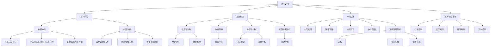

                 

### 第1章 引言

#### 1.1 冲突管理的意义

在技术管理者的日常工作中，冲突处理是一项至关重要的任务。随着项目的复杂度增加、团队成员多样性的提升以及外部环境的变化，技术团队内部的矛盾和摩擦变得愈发常见。冲突管理不仅是维护团队和谐与稳定的关键，更是保障项目顺利推进的重要保障。

首先，冲突管理对于技术管理者的角色和责任有着深远的影响。作为团队的领导者和协调者，技术管理者不仅要具备扎实的专业知识和技能，更需要具备高度的人际交往和沟通能力。在冲突发生时，管理者需要迅速判断冲突的性质，采取适当的策略和方法进行干预和解决，以确保团队成员的合作效率和项目的顺利实施。

其次，冲突对团队的影响不可忽视。冲突可能导致团队成员之间的信任感下降，降低团队整体的协作效率和创新能力。长期存在的冲突甚至可能演变成恶性循环，影响团队的整体士气和团队的长期发展。因此，有效的冲突管理对于保持团队的活力和战斗力具有重要意义。

冲突处理的目标和原则是冲突管理的基础。冲突处理的目标在于通过合理的手段，使冲突双方达成共识，恢复团队的正常运作。冲突处理的原则包括公平、公正、透明和及时，确保冲突解决过程合法合规，减少冲突的负面影响。

本章将围绕冲突管理的核心概念、类型、策略与方法，详细探讨技术管理者在冲突处理中的职责与挑战。通过理解冲突管理的意义和基本原则，我们将为后续章节的深入分析打下坚实的基础。

#### 1.2 冲突的类型与来源

冲突在技术团队中是不可避免的，了解冲突的类型和来源有助于技术管理者更好地预防和处理冲突。一般来说，冲突可以分为内部冲突和外部冲突两大类，每一类冲突都有其独特的性质和解决方法。

**内部冲突**

内部冲突主要发生在团队成员之间或团队内部的组织结构、任务分配等方面。以下是几种常见的内部冲突类型：

1. **任务分配不公**

任务分配不公是技术团队中最常见的内部冲突之一。当团队成员感觉自己在工作量、责任和权利方面受到不公平对待时，冲突就产生了。这种冲突可能导致工作效率下降，团队成员士气低落，甚至影响到项目的进度和质量。

2. **个人目标与团队目标不一致**

每个团队成员都有自己的职业目标和期望，但在实际工作中，个人目标与团队目标之间可能存在不一致。当个人认为自己的利益受到损害时，就会产生冲突。例如，某个成员可能更关注自己的业绩，而忽视团队的整体利益，这种情况下冲突就不可避免。

3. **能力与角色不匹配**

能力与角色不匹配也是导致内部冲突的一个重要原因。当团队成员被赋予的任务与其能力和技能水平不符时，他们可能会感到不满和挫败。这种情况下，团队中的沟通和协作效率会降低，甚至可能导致项目失败。

**外部冲突**

外部冲突主要来自于团队外部的因素，如客户需求、市场竞争、法律法规等。以下是几种常见的外部冲突类型：

1. **客户需求变动**

客户需求变动是技术团队面临的一大挑战。当客户的需求频繁变动时，团队需要迅速调整项目计划和资源配置，这可能导致资源紧张、项目延期等问题。客户的需求变动往往与团队的目标和计划产生冲突，需要通过有效的沟通和协商来解决。

2. **市场竞争压力**

市场竞争压力也是导致外部冲突的一个重要因素。当市场竞争激烈时，团队需要在短时间内完成高质量的项目，这可能会导致团队成员之间的压力增大，产生冲突。此外，市场竞争还可能引发团队与合作伙伴之间的利益冲突。

3. **法律法规限制**

法律法规限制是外部冲突的另一个来源。在某些情况下，项目的实施可能受到法律法规的制约，这要求团队在项目设计和开发过程中遵循特定的规范和标准。如果团队未能及时了解和遵守相关法规，可能会面临法律风险和商业损失。

综上所述，内部冲突和外部冲突都是技术团队中常见的冲突类型，了解它们的来源和性质对于技术管理者有效预防和处理冲突至关重要。在接下来的章节中，我们将深入探讨冲突处理的策略和方法，帮助技术管理者应对这些挑战。

#### 1.3 冲突处理的策略与方法

冲突处理是技术管理者的一项关键任务，合理的策略与方法能够有效缓解冲突，维护团队的稳定和项目的顺利推进。以下是一些常见的冲突处理策略与方法：

**1. 知情与沟通**

沟通是冲突处理的基础，知情是沟通的前提。技术管理者需要确保团队成员充分了解项目目标、任务分配和预期成果，从而减少因信息不对称而产生的误解和冲突。具体策略包括：

- **定期会议**：通过定期的团队会议，让每个成员了解项目的最新进展和遇到的问题。
- **透明沟通**：建立透明沟通机制，鼓励团队成员表达自己的观点和意见，减少信息不对称。
- **一对一沟通**：对于个别成员的疑虑和问题，可以通过一对一沟通进行深入了解和解决。

**2. 调解与仲裁**

在冲突较为严重或双方无法自行解决时，调解和仲裁是有效的策略。以下是调解和仲裁的一些具体方法：

- **调解**：通过第三方调解人（可以是团队内的其他成员或者外部专业人士）协助双方进行对话，寻找共同点，达成妥协。
- **仲裁**：在调解无效或冲突无法妥协时，可以采用仲裁的方法，由权威人士（如项目经理、HR或法律专家）做出最终裁决。

**3. 对话与协商**

对话与协商是解决冲突的基本手段，通过双方或多方之间的交流，寻找解决问题的最佳方案。具体策略包括：

- **共同目标设定**：通过明确共同的目标，使双方意识到合作的重要性，从而愿意寻求妥协。
- **利益平衡**：在协商过程中，要充分考虑各方的利益，通过权衡和妥协找到平衡点。
- **第三方介入**：在双方沟通陷入僵局时，可以引入第三方进行协助，提供中立的意见和建议。

**4. 教育与培训**

通过教育和培训，提高团队成员的沟通技巧和团队合作意识，是预防冲突的重要手段。具体方法包括：

- **沟通技巧培训**：组织沟通技巧培训，帮助团队成员掌握有效的沟通方法和技巧。
- **团队建设活动**：通过团队建设活动，增强团队成员之间的信任和默契，减少冲突发生的可能性。

**5. 制度与规则**

建立明确的制度与规则，是预防和管理冲突的重要保障。具体策略包括：

- **明确职责**：通过明确的职责分配，确保每个成员都知道自己的任务和责任，减少因职责不清而产生的冲突。
- **绩效评估**：建立公平的绩效评估体系，确保任务分配和奖励的公正性，减少因不公平感而产生的冲突。
- **纠纷解决机制**：建立明确的纠纷解决机制，确保冲突发生时能够及时有效地解决，减少冲突的负面影响。

通过以上策略与方法，技术管理者可以有效地处理团队内部的冲突，维护团队的稳定和项目的顺利进行。在下一章中，我们将进一步探讨冲突评估模型和冲突解决算法，为冲突管理提供更加具体的工具和技术。

### 1.3.1 知情与沟通

沟通是冲突处理的核心，而知情是沟通的前提。在技术管理者的日常工作中，确保团队成员充分知情并建立有效的沟通机制是减少冲突的重要手段。以下将详细讨论沟通的重要性、有效沟通的技巧以及沟通障碍的解决方法。

#### 沟通的重要性

良好的沟通是团队协作的基石。在技术团队中，成员之间需要频繁的沟通来共享信息、协调任务和解决问题。以下是沟通在冲突处理中的几个关键作用：

1. **减少误解与猜疑**：通过有效的沟通，团队成员可以清晰地表达自己的想法和需求，避免因误解和猜疑而产生的冲突。
2. **促进共识达成**：通过沟通，团队成员可以共同讨论并确定项目目标和任务，减少因目标不一致而产生的冲突。
3. **增强团队凝聚力**：良好的沟通可以增强团队成员之间的信任和默契，提高团队的凝聚力，从而减少冲突的发生。
4. **提升工作效率**：有效的沟通有助于明确任务分工和工作流程，减少因沟通不畅而导致的工作延误和效率低下。

#### 有效沟通的技巧

为了确保沟通的效率和质量，技术管理者需要掌握以下几种有效沟通的技巧：

1. **主动倾听**：倾听是有效沟通的关键。技术管理者应该主动倾听团队成员的意见和反馈，给予他们充分表达的机会，从而更好地理解他们的需求和关切。
2. **清晰表达**：在沟通中，管理者应确保自己的表达清晰明确，避免使用模糊或歧义的词汇，减少误解的可能性。
3. **开放心态**：管理者应保持开放的心态，尊重团队成员的不同观点和意见，鼓励他们提出问题和建议。
4. **非言语沟通**：非言语沟通（如肢体语言、面部表情和语调）在沟通中也起到重要作用。管理者应学会通过这些非言语信号来增强沟通的效果。

#### 沟通障碍与解决方法

尽管技术管理者可能尽力保持沟通的顺畅，但沟通障碍仍然可能存在。以下是一些常见的沟通障碍及其解决方法：

1. **信息不对称**：解决信息不对称的方法包括定期更新团队成员的项目状态、任务分配和重要决策，确保每个成员都能及时获得必要的信息。
2. **文化差异**：在多元文化的团队中，文化差异可能导致沟通障碍。管理者应通过文化敏感性和多样性培训，提高团队成员的文化认知和沟通能力。
3. **沟通渠道不畅**：确保沟通渠道的畅通是减少沟通障碍的关键。管理者可以采用多种沟通工具（如电子邮件、即时通讯工具、视频会议等），以满足不同成员的沟通需求。
4. **心理障碍**：心理障碍如恐惧、焦虑或抵触情绪都可能影响沟通的效果。管理者应通过心理辅导和团队建设活动，帮助团队成员克服心理障碍，提升沟通能力。

通过了解沟通的重要性和有效沟通的技巧，以及解决沟通障碍的方法，技术管理者可以更好地处理团队内部的冲突，提高团队的整体协作效率。在下一部分，我们将探讨调解与仲裁在冲突处理中的应用，为技术管理者提供更加全面的冲突处理策略。

#### 1.3.2 调解与仲裁

调解与仲裁是冲突处理中两种重要的策略，尤其是在冲突双方无法通过对话与协商解决争议时。调解和仲裁各自有其独特的原则和适用场景，以及相应的流程和注意事项。

**调解的原则**

1. **中立性**：调解人必须保持中立，不能偏袒任何一方，确保双方在公平的环境中达成共识。
2. **自愿性**：调解是基于双方自愿的原则进行的，任何一方可以随时选择退出调解过程。
3. **保密性**：调解过程中的信息必须保密，确保双方的隐私不被泄露。
4. **合作性**：调解旨在促进双方的合作，通过沟通和协商解决争议。

**仲裁的适用场景**

仲裁通常适用于以下场景：

1. **纠纷复杂且涉及大量证据**：当冲突涉及复杂的法律问题或大量证据时，仲裁可以提供更为专业的判断和裁决。
2. **双方无法达成一致**：在经过调解后，如果双方依然无法达成一致意见，可以采取仲裁来解决争议。
3. **需要快速解决**：仲裁程序相对简短，能够在较短时间内提供裁决，有助于迅速恢复团队的正常运作。

**调解与仲裁的流程**

1. **申请与受理**：当事人可以向调解人或仲裁机构提出申请，调解人或仲裁机构在确认受理后开始调解或仲裁程序。
2. **调查与准备**：调解人或仲裁人会进行初步调查，收集证据和相关信息，为后续的调解或仲裁做充分准备。
3. **调解/仲裁会议**：调解会议通常由调解人主持，仲裁会议则由仲裁人主持。会议中，双方可以充分表达自己的观点和证据。
4. **裁决与执行**：在调解过程中，如果双方达成一致，调解人将制定调解协议，并督促双方执行；在仲裁过程中，仲裁人将根据调查结果和会议讨论，做出最终的裁决，并监督裁决的执行。

**调解与仲裁的注意事项**

1. **尊重当事人意愿**：调解和仲裁必须尊重当事人的意愿，确保双方在自愿的情况下参与。
2. **公平公正**：调解和仲裁过程必须公平公正，确保每个当事人的权益得到保护。
3. **保密性**：调解和仲裁过程中的信息必须保密，避免影响双方的声誉和隐私。
4. **及时反馈**：调解和仲裁机构应及时向当事人反馈调解或仲裁的结果，确保争议得到及时解决。

通过调解与仲裁，技术管理者可以在冲突无法通过常规沟通和协商解决时，采取更为专业的手段来化解矛盾。这不仅有助于快速恢复团队的正常运作，还可以为团队的长远发展提供保障。在下一部分，我们将探讨冲突评估模型和冲突解决算法，为技术管理者提供更为科学和系统的冲突处理工具。

### 1.4 冲突管理的工具与技术

在现代技术管理中，冲突管理需要依靠一系列工具和技术，以实现科学、高效的冲突评估和解决。这些工具和技术不仅有助于技术管理者更好地理解冲突的根源和性质，还能提供有效的解决策略和方案。以下是几种常见的冲突管理工具和技术，包括冲突评估模型和冲突解决算法。

#### 冲突评估模型

冲突评估模型是一种用于分析和评估冲突严重程度和影响范围的方法，通过定量和定性的方式，帮助技术管理者对冲突进行深入理解和有效管理。

1. **冲突严重程度评估**

冲突严重程度评估通常采用五级量表，从0（无冲突）到4（非常严重）进行评分。评分标准可以根据具体情况进行定制，但通常包括以下方面：

- **冲突频率**：冲突发生的频率，从“从未”到“每天”。
- **冲突强度**：冲突的激烈程度，从“轻微”到“极端”。
- **冲突持续时间**：冲突持续的时间，从“瞬间”到“长期”。

通过这些指标，技术管理者可以初步判断冲突的严重程度，并采取相应的措施。

2. **冲突影响范围评估**

冲突影响范围评估旨在确定冲突对团队和项目的具体影响。评估指标包括：

- **团队成员士气**：冲突对团队成员士气的影响，从“无影响”到“非常低落”。
- **项目进度**：冲突对项目进度的影响，从“无影响”到“严重延误”。
- **项目质量**：冲突对项目质量的影响，从“无影响”到“非常差”。
- **团队协作**：冲突对团队协作的影响，从“无影响”到“非常差”。

通过这些指标，技术管理者可以全面了解冲突的影响范围，从而制定更为精准的解决方案。

#### 冲突解决算法

冲突解决算法是一套基于数学和逻辑推理的方法，用于自动化解决冲突。以下是一些常见的冲突解决算法：

1. **基于优先级的冲突解决算法**

这种算法基于每个冲突的优先级来分配资源和任务。具体步骤如下：

- **定义冲突优先级**：根据冲突的性质和影响，定义每个冲突的优先级，从高到低排序。
- **资源分配**：首先解决优先级最高的冲突，根据资源情况分配必要的资源和人力。
- **任务调整**：在解决高优先级冲突后，根据剩余资源和任务需求调整其他冲突。

2. **基于协商的冲突解决算法**

这种算法通过协商和谈判来解决冲突，通常包括以下步骤：

- **确定冲突双方**：确定参与冲突的双方，并明确各自的利益和需求。
- **协商谈判**：通过一系列协商和谈判，寻找双方的共同利益，达成妥协。
- **制定协议**：在协商过程中，制定详细的协议，确保双方遵守并执行。

3. **基于智能算法的冲突解决算法**

这种算法利用人工智能技术，通过机器学习和数据分析来预测和解决冲突。具体步骤如下：

- **数据收集**：收集团队成员的行为数据、沟通记录和项目进展数据。
- **特征提取**：从数据中提取关键特征，用于训练机器学习模型。
- **模型训练**：使用收集到的数据训练智能算法模型，使其能够预测冲突的发生和性质。
- **冲突解决**：根据智能算法的预测结果，采取相应的措施预防或解决冲突。

通过这些冲突解决算法，技术管理者可以更加科学和高效地处理团队中的冲突，提高团队的协作效率和项目成功率。在下一部分，我们将探讨团队冲突的预警机制和解决案例，进一步丰富冲突管理的实践内容。

### 1.5 冲突管理的实践

在实际工作中，冲突管理并非一蹴而就，而是需要通过一系列具体的实践步骤和实际案例来不断完善和优化。以下将详细探讨团队冲突的预警机制、解决案例以及总结和经验分享。

#### 1.5.1 团队冲突的预警机制

团队冲突的预警机制是预防冲突发生的关键，通过提前发现潜在的冲突因素，技术管理者可以及时采取干预措施，避免冲突的恶化。以下是建立预警机制的一些关键步骤：

1. **预警指标的设定**

预警指标是预警机制的核心，用于评估团队冲突的可能性。常见的预警指标包括：

- **团队成员的沟通频率**：通过监控团队成员的沟通频率，可以及时发现沟通不畅的迹象。
- **任务完成时间**：任务完成时间的延迟可能预示着团队成员在任务分配或执行过程中存在冲突。
- **团队成员的工作满意度**：通过定期调查团队成员的工作满意度，可以了解他们的心理状态和团队氛围。

2. **预警机制的建立**

建立预警机制需要明确的流程和制度保障，具体步骤包括：

- **设立预警部门**：在团队中设立专门的预警部门或角色，负责监控和评估预警指标。
- **制定预警流程**：明确预警的流程和操作步骤，确保预警机制的有效执行。
- **定期评估和反馈**：定期对预警机制进行评估和反馈，根据实际情况进行调整和优化。

3. **预警机制的运行流程**

预警机制的运行流程包括以下步骤：

- **数据收集**：通过多种渠道收集团队相关的数据，如沟通记录、任务进度和员工满意度调查等。
- **数据分析**：对收集到的数据进行分析，识别潜在的冲突因素。
- **预警通知**：当分析结果显示存在潜在冲突时，及时发出预警通知，提醒相关团队成员和管理者。
- **干预措施**：根据预警通知，采取相应的干预措施，如调整任务分配、组织团队建设活动或进行沟通培训等。

#### 1.5.2 团队冲突的解决案例

以下是几个具体的团队冲突解决案例，通过这些案例，我们可以看到如何通过合理的策略和步骤来处理和解决团队冲突。

**案例一：任务分配冲突**

问题描述：在项目开发阶段，团队中某个成员被分配了过多的任务，导致其无法按时完成，同时影响了其他成员的工作进度。

解决方案：

1. **沟通协调**：管理者召开会议，与相关成员讨论任务分配的问题，了解他们的意见和反馈。
2. **重新分配**：根据团队成员的能力和任务需求，重新分配任务，确保每个成员的负担合理。
3. **设立优先级**：为任务设定优先级，确保关键任务优先完成，减少冲突对项目进度的影响。
4. **心理支持**：为受压的成员提供心理支持，帮助他们调整心态，更好地应对工作压力。

**案例二：个人目标与团队目标不一致**

问题描述：某个成员更关注自己的业绩，而忽视了团队的整体利益，导致团队目标无法实现。

解决方案：

1. **目标重申**：管理者重新明确团队目标，确保每个成员都了解并认同团队的目标。
2. **利益平衡**：通过调整个人目标和团队目标的权重，使个人目标和团队目标之间达到平衡。
3. **激励制度**：建立公平的激励制度，奖励那些为团队目标做出贡献的成员，以激励其他成员更加关注团队利益。

**案例三：能力与角色不匹配**

问题描述：某个成员被赋予的任务与其能力不匹配，导致其无法胜任，同时影响了项目的进度和质量。

解决方案：

1. **技能培训**：为该成员提供必要的技能培训，提高其能力水平。
2. **角色调整**：根据成员的技能和能力，重新设定其角色和任务，确保其能够胜任。
3. **团队协作**：加强团队成员之间的协作，提供更多的支持和帮助，共同推动项目进展。

#### 1.5.3 冲突管理的总结与经验分享

通过以上实践案例，我们可以总结出以下冲突管理的关键经验和教训：

1. **预防为主**：建立预警机制，提前发现和预防冲突的发生，是冲突管理的重要策略。
2. **沟通协调**：良好的沟通是解决冲突的基础，技术管理者应积极促进团队内部的沟通和协作。
3. **公正合理**：在解决冲突时，应确保公正合理，避免偏袒任何一方，以维护团队的信任和稳定。
4. **持续优化**：冲突管理是一个持续的过程，技术管理者应不断反思和优化管理策略，以应对不断变化的外部和内部环境。

通过有效的冲突管理实践，技术管理者可以更好地维护团队的稳定和项目的顺利推进，为团队的长期发展打下坚实的基础。

### 第2章 冲突管理的核心概念与联系

冲突管理是技术管理者日常工作中不可或缺的一部分。理解冲突管理的核心概念和它们之间的联系，对于有效应对和处理团队中的冲突至关重要。本章将详细探讨冲突管理的核心概念，并利用Mermaid流程图展示它们之间的关联，以便读者能够更清晰地理解冲突管理的整体架构。

#### 2.1 冲突管理的核心概念

1. **冲突的定义**

冲突是指个体或群体在目标、利益、意见或价值观上存在的对立和矛盾。在技术团队中，冲突可能源于任务分配、个人目标与团队目标的差异、能力与角色的不匹配等多种原因。

2. **冲突的类型**

冲突可以分为内部冲突和外部冲突。内部冲突主要发生在团队成员之间，如任务分配不公、个人目标与团队目标不一致等。外部冲突则来自于项目外部的因素，如客户需求变动、市场竞争压力等。

3. **冲突的根源**

冲突的根源多种多样，包括信息不对称、沟通不畅、目标不一致、资源分配不公等。理解冲突的根源有助于技术管理者采取针对性的解决措施。

4. **冲突的后果**

冲突可能导致的后果包括团队成员士气低落、工作效率下降、项目进度延误、团队协作破裂等。严重的冲突甚至可能影响团队的整体士气和长期发展。

5. **冲突管理的目标**

冲突管理的目标是通过合理的手段和策略，使冲突双方达成共识，恢复团队的正常运作，确保项目的顺利进行。具体目标包括减少冲突的负面影响、提升团队协作效率、增强团队凝聚力等。

6. **冲突处理的原则**

冲突处理的原则包括公平、公正、透明和及时。公平和公正是确保冲突解决过程合法合规，透明和及时则是确保冲突能够迅速得到解决，减少负面影响。

#### 2.2 冲突管理的架构

冲突管理的架构包括流程、组织架构和技术工具三个关键部分。

1. **流程**

冲突管理流程包括冲突识别、评估、预警、调解和解决等步骤。每个步骤都有明确的任务和目标，确保冲突能够及时、有效地得到处理。

2. **组织架构**

冲突管理的组织架构通常包括专门的冲突管理团队或角色，如冲突调解员、人力资源经理等。这些团队或角色负责监控和评估冲突情况，提供专业建议和解决方案。

3. **技术工具**

冲突管理技术工具包括冲突评估模型、沟通平台、预警系统等。这些工具有助于技术管理者更好地识别、分析和解决冲突。

#### 2.3 冲突管理的核心概念联系

以下是利用Mermaid流程图展示冲突管理核心概念之间的联系：



通过Mermaid流程图，我们可以清晰地看到冲突管理核心概念之间的逻辑关系和相互作用。理解这些核心概念和联系，将有助于技术管理者在实际工作中更有效地应对和解决冲突，保障团队的稳定和项目的成功。

### 第3章 冲突处理的算法原理

在技术管理中，冲突处理算法是一套基于数学和逻辑推理的方法，用于自动化解决团队内部的冲突。理解冲突处理算法的原理和分类，有助于技术管理者更有效地应用这些算法来维护团队的稳定和项目的顺利进行。本章将介绍冲突处理算法的目标、分类及其基本原理。

#### 3.1 冲突处理算法的目标

冲突处理算法的主要目标是通过系统的方法和步骤，将冲突双方的利益最大化，确保项目目标和团队目标的实现。具体目标包括：

1. **达成共识**：通过算法帮助冲突双方找到共同点，达成共识。
2. **资源优化**：合理分配资源和任务，提高资源利用效率。
3. **提升团队协作**：通过解决冲突，增强团队成员之间的信任和协作。
4. **降低风险**：通过预防和解决冲突，降低项目失败的风险。

#### 3.2 冲突处理算法的分类

冲突处理算法可以根据不同的标准进行分类，常见的分类方法包括：

1. **基于优先级的算法**
2. **基于协商的算法**
3. **基于智能算法的算法**

#### 3.3 冲突处理算法的基本原理

1. **基于优先级的算法**

基于优先级的算法通过设定冲突的优先级来分配资源和任务。具体原理如下：

- **确定优先级**：首先，根据冲突的影响程度和紧急程度，为每个冲突设定优先级。
- **资源分配**：根据优先级，优先解决高优先级的冲突。在资源有限的情况下，确保关键冲突得到优先处理。
- **任务调整**：在解决高优先级冲突后，根据剩余资源和任务需求，调整其他冲突的资源和任务分配。

**伪代码示例**：

```python
function resolve_conflicts(priority_list, resource_allocation):
    while priority_list is not empty:
        highest_priority = get_highest_priority(priority_list)
        if can_allocate_resources(highest_priority, resource_allocation):
            resolve(highest_priority)
            remove(highest_priority, priority_list)
            update_resource_allocation(resource_allocation, highest_priority)
        else:
            break
```

2. **基于协商的算法**

基于协商的算法通过冲突双方或多方之间的协商和谈判来解决冲突。具体原理如下：

- **确定协商参与者**：确定参与冲突的各方，明确各自的利益和需求。
- **协商谈判**：通过一系列的协商和谈判，寻找双方的共同利益，达成妥协。
- **制定协议**：在协商过程中，制定详细的协议，确保双方遵守并执行。

**伪代码示例**：

```python
function negotiate_conflicts(participants, interests):
    while not all_agreed(participants):
        for participant in participants:
            participant.propose_solution()
            for other_participant in participants:
                other_participant.evaluate_solution()
        find_common_ground()
        if common_ground:
            create_agreement(participants, common_ground)
            return True
        else:
            return False
```

3. **基于智能算法的算法**

基于智能算法的算法利用人工智能技术，通过机器学习和数据分析来预测和解决冲突。具体原理如下：

- **数据收集**：收集团队成员的行为数据、沟通记录和项目进展数据。
- **特征提取**：从数据中提取关键特征，用于训练机器学习模型。
- **模型训练**：使用收集到的数据训练智能算法模型，使其能够预测冲突的发生和性质。
- **冲突解决**：根据智能算法的预测结果，采取相应的措施预防或解决冲突。

**伪代码示例**：

```python
function train_model(data):
    features = extract_features(data)
    labels = determine_conflict_labels(data)
    model = trainMachineLearningModel(features, labels)
    return model

function predict_and_solve(model, current_state):
    prediction = model.predict(current_state)
    if prediction.is_conflict():
        apply_solution(model, current_state)
```

通过以上算法的原理介绍，我们可以看到冲突处理算法在技术管理中的重要性。接下来，我们将进一步详细阐述这些算法的原理，并通过具体实例分析，帮助读者更好地理解和应用这些算法。

### 3.2 算法原理详细阐述

在详细阐述冲突处理算法原理之前，我们首先需要明确这些算法的设计目标和具体应用场景。以下是三种常见冲突处理算法的详细描述，包括伪代码和数学模型的使用。

#### 3.2.1 伪代码

伪代码是一种非正式的编程语言描述，用于表示算法的逻辑结构和操作步骤。下面我们将通过伪代码展示三种冲突处理算法的基本逻辑。

1. **基于优先级的算法**

基于优先级的算法通过设定冲突的优先级来分配资源和任务。以下是该算法的伪代码：

```python
Algorithm: ResolveConflictsByPriority(conflicts, resources):
    while conflicts are not empty:
        highest_priority_conflict = SelectHighestPriority(conflicts)
        if AllocateResources(highest_priority_conflict, resources):
            ResolveConflict(highest_priority_conflict)
            Remove(highest_priority_conflict, conflicts)
        else:
            LogInsufficientResources(highest_priority_conflict)
```

2. **基于协商的算法**

基于协商的算法通过冲突双方或多方之间的协商和谈判来解决冲突。以下是该算法的伪代码：

```python
Algorithm: NegotiateConflicts(participants, interests):
    while True:
        for participant in participants:
            participant.ProposeSolution()
        for participant in participants:
            participant.EvaluateProposedSolutions()
        if AgreementFound():
            CreateAgreement(participants)
            break
        else:
            if NoAgreementPossible():
                LogNegotiationFailure()
                break
```

3. **基于智能算法的算法**

基于智能算法的算法利用人工智能技术，通过机器学习和数据分析来预测和解决冲突。以下是该算法的伪代码：

```python
Algorithm: TrainModelAndSolveConflicts(training_data, current_state):
    model = TrainModel(training_data)
    while True:
        prediction = model.Predict(current_state)
        if prediction.is_conflict():
            solution = model.SuggestSolution(current_state)
            if ApplySolution(current_state, solution):
                UpdateTrainingData(current_state, solution)
                break
        else:
            UpdateCurrentState(current_state)
```

#### 3.2.2 数学模型

数学模型在冲突处理算法中扮演重要角色，能够帮助我们更准确地描述和预测冲突。以下是三种常见冲突处理算法的数学模型。

1. **基于优先级的算法**

基于优先级的算法可以用以下数学模型表示：

- **冲突优先级函数**：$P(c)$，其中 $c$ 表示冲突。
- **资源分配函数**：$R(c, r)$，其中 $r$ 表示资源。
- **冲突解决函数**：$S(c)$。

伪代码实现：

```python
Function ResolveConflictByPriority(c, r):
    P_c = P(c)
    if R(c, r) and S(c):
        Resolve(c)
    else:
        LogInsufficientResources(c)
```

2. **基于协商的算法**

基于协商的算法可以用以下数学模型表示：

- **参与者利益函数**：$I(p)$，其中 $p$ 表示参与者。
- **协商解决方案函数**：$S(p, i)$，其中 $i$ 表示参与者提出的解决方案。
- **协议达成函数**：$A(p, s)$。

伪代码实现：

```python
Function NegotiateSolution(p, i):
    S_p = S(p, i)
    if A(p, S_p):
        CreateAgreement(p, S_p)
    else:
        LogNoAgreement(p)
```

3. **基于智能算法的算法**

基于智能算法的算法可以用以下数学模型表示：

- **状态特征向量**：$S(s)$，其中 $s$ 表示当前状态。
- **预测模型**：$M(S)$，其中 $M$ 表示机器学习模型。
- **解决方案函数**：$S(s, m)$。

伪代码实现：

```python
Function TrainModelAndSolve(s):
    model = TrainModel(s)
    prediction = model.Predict(s)
    if prediction.is_conflict():
        solution = model.SuggestSolution(s)
        if ApplySolution(s, solution):
            UpdateTrainingData(s, solution)
```

通过这些伪代码和数学模型，我们可以更清晰地理解冲突处理算法的原理和应用。接下来，我们将通过具体实例分析，展示这些算法在实际应用中的效果。

#### 3.3 算法原理实例分析

为了更好地理解冲突处理算法的原理和应用，我们将通过具体实例分析三种算法在实际场景中的效果。

**实例一：任务分配冲突**

问题描述：在一个大型软件开发项目中，团队成员的任务分配存在严重的不平衡，导致某些成员工作量过大，而其他成员则任务较少，影响了项目的整体进度。

**基于优先级的算法应用**：

1. **冲突识别**：通过任务完成时间和工作量的数据，识别出任务分配不公的冲突。
2. **设定优先级**：将任务分配冲突设定为高优先级，因为其直接影响项目的进度。
3. **资源分配**：根据优先级，优先解决任务分配冲突。管理者通过重新分配任务，确保每个成员的工作量均衡。

伪代码实现：

```python
conflicts = IdentifyTaskAssignmentConflicts()
while conflicts:
    highest_priority_conflict = SelectHighestPriority(conflicts)
    if AllocateResources(highest_priority_conflict, available_resources):
        ResolveConflict(highest_priority_conflict)
        Remove(highest_priority_conflict, conflicts)
    else:
        LogInsufficientResources(highest_priority_conflict)
```

**基于协商的算法应用**：

1. **确定协商参与者**：管理者召集任务分配冲突的双方成员进行协商。
2. **协商谈判**：双方成员提出各自的解决方案，进行讨论和谈判。
3. **达成协议**：双方在多次协商后，达成一致，重新分配任务，确保工作量的均衡。

伪代码实现：

```python
participants = [affected_member, overburdened_member]
interests = [participant_interests]
if negotiate_conflicts(participants, interests):
    CreateAgreement(participants, proposed_solution)
else:
    LogNegotiationFailure()
```

**基于智能算法的算法应用**：

1. **数据收集**：收集团队成员的工作量和任务完成时间数据。
2. **特征提取**：提取关键特征，如成员的工作效率、任务的紧急程度等。
3. **模型训练**：使用收集到的数据训练机器学习模型。
4. **冲突解决**：根据模型的预测结果，自动调整任务分配，减少冲突。

伪代码实现：

```python
data = CollectTaskData()
model = TrainModel(data)
current_state = GetCurrentState()
prediction = model.Predict(current_state)
if prediction.is_conflict():
    solution = model.SuggestSolution(current_state)
    if ApplySolution(current_state, solution):
        UpdateTrainingData(current_state, solution)
```

**实例二：个人目标与团队目标不一致**

问题描述：某个团队成员更关注自己的个人目标，而忽视了团队的整体目标，导致团队项目进展缓慢。

**基于优先级的算法应用**：

1. **冲突识别**：通过监控团队成员的行为数据和项目进度数据，识别出个人目标与团队目标不一致的冲突。
2. **设定优先级**：将个人目标与团队目标不一致的冲突设定为高优先级，因为其直接影响团队的整体效率。
3. **资源调整**：通过调整个人目标和团队目标的权重，重新设定任务优先级，确保团队成员更加关注团队目标。

伪代码实现：

```python
conflicts = IdentifyPersonalVsTeamGoalConflicts()
while conflicts:
    highest_priority_conflict = SelectHighestPriority(conflicts)
    if AllocateResources(highest_priority_conflict, available_resources):
        ResolveConflict(highest_priority_conflict)
        Remove(highest_priority_conflict, conflicts)
    else:
        LogInsufficientResources(highest_priority_conflict)
```

**基于协商的算法应用**：

1. **确定协商参与者**：管理者召集该团队成员和相关利益相关者进行协商。
2. **协商谈判**：团队成员和相关利益相关者讨论个人目标和团队目标之间的关系，寻找解决方案。
3. **达成协议**：通过多次协商，双方达成一致，调整个人目标与团队目标的权重，确保团队成员更加关注团队目标。

伪代码实现：

```python
participants = [team_member, stakeholders]
interests = [team_member_interests, stakeholders_interests]
if negotiate_conflicts(participants, interests):
    CreateAgreement(participants, proposed_solution)
else:
    LogNegotiationFailure()
```

**基于智能算法的算法应用**：

1. **数据收集**：收集团队成员的行为数据、项目进度数据和团队目标数据。
2. **特征提取**：提取关键特征，如团队成员的工作效率、个人目标与团队目标的契合度等。
3. **模型训练**：使用收集到的数据训练机器学习模型。
4. **冲突解决**：根据模型的预测结果，自动调整个人目标和团队目标的权重，减少冲突。

伪代码实现：

```python
data = CollectGoalData()
model = TrainModel(data)
current_state = GetCurrentState()
prediction = model.Predict(current_state)
if prediction.is_conflict():
    solution = model.SuggestSolution(current_state)
    if ApplySolution(current_state, solution):
        UpdateTrainingData(current_state, solution)
```

通过以上实例分析，我们可以看到三种冲突处理算法在不同场景中的应用效果。基于优先级的算法适用于任务分配冲突，基于协商的算法适用于个人目标与团队目标不一致的冲突，而基于智能算法的算法则适用于多种复杂的冲突场景。这些算法的应用不仅提高了冲突处理的效率和效果，还为技术管理者提供了科学的决策支持。

### 3.4 冲突管理的数学模型与公式

冲突管理不仅依赖于算法和策略，还需要数学模型和公式来量化冲突的影响和解决方法。数学模型能够帮助我们更精确地描述冲突的性质，从而制定更加有效的解决方案。以下将介绍几种常见的冲突管理数学模型及其应用。

#### 3.4.1 冲突管理的数学模型概述

冲突管理的数学模型主要包括以下几类：

1. **冲突影响模型**：用于评估冲突对团队和项目的影响程度。
2. **冲突解决模型**：用于确定解决冲突的最佳方案。
3. **协商模型**：用于描述冲突双方或多方在协商过程中如何达成共识。

#### 3.4.2 冲突影响模型

冲突影响模型通过定量分析冲突对团队和项目的影响，帮助我们识别和评估冲突的严重性。以下是一个简单的冲突影响模型：

- **冲突影响函数**：$C(t, i)$，其中 $t$ 表示冲突类型，$i$ 表示冲突的影响程度。

$$
C(t, i) = w_t \cdot i
$$

其中，$w_t$ 表示冲突类型 $t$ 的权重。权重可以根据历史数据和专家经验设定。

**示例**：

假设有两个冲突类型：任务分配不公和沟通不畅。权重分别为 $w_{\text{分配}} = 0.6$ 和 $w_{\text{沟通}} = 0.4$。

- **任务分配不公的影响**：$C_{\text{分配}}(i) = 0.6 \cdot i$
- **沟通不畅的影响**：$C_{\text{沟通}}(i) = 0.4 \cdot i$

通过这个模型，我们可以计算特定冲突的影响值，从而确定需要优先解决哪些冲突。

#### 3.4.3 冲突解决模型

冲突解决模型用于确定解决冲突的最佳方案。一个常见的冲突解决模型是基于成本效益分析的模型：

- **成本函数**：$C(s)$，其中 $s$ 表示解决策略。
- **效益函数**：$B(s)$，表示采用策略 $s$ 后的效益。

$$
\text{成本效益比} = \frac{C(s)}{B(s)}
$$

选择成本效益比最小的解决策略，即为最佳方案。

**示例**：

假设有两个解决策略：调整任务分配和进行沟通培训。

- **调整任务分配的成本**：$C_{\text{分配}} = 1000$
- **调整任务分配的效益**：$B_{\text{分配}} = 1500$
- **沟通培训的成本**：$C_{\text{培训}} = 500$
- **沟通培训的效益**：$B_{\text{培训}} = 800$

计算成本效益比：

- **调整任务分配的成本效益比**：$\frac{C_{\text{分配}}}{B_{\text{分配}}} = \frac{1000}{1500} = 0.67$
- **沟通培训的成本效益比**：$\frac{C_{\text{培训}}}{B_{\text{培训}}} = \frac{500}{800} = 0.63$

因此，调整任务分配是成本效益更好的解决策略。

#### 3.4.4 协商模型

协商模型用于描述冲突双方或多方在协商过程中如何达成共识。一个简单的协商模型是基于博弈论的模型：

- **参与者**：$P = \{P_1, P_2, ..., P_n\}$
- **策略**：$S = \{S_1, S_2, ..., S_n\}$
- **支付矩阵**：$P = \{P_{ij}\}$，其中 $P_{ij}$ 表示参与者 $P_i$ 选择策略 $S_j$ 时的收益。

$$
\text{纳什均衡} = \{S_i^*, S_j^*\}
$$

其中，$S_i^*$ 和 $S_j^*$ 分别是参与者 $P_i$ 和 $P_j$ 的最优策略。

**示例**：

假设有两个参与者 $P_1$ 和 $P_2$，他们的策略分别是“合作”和“不合作”，支付矩阵如下：

$$
\begin{array}{c|c|c}
 & \text{合作} & \text{不合作} \\
\hline
\text{合作} & 3, 3 & 0, 0 \\
\hline
\text{不合作} & 0, 0 & 1, 1 \\
\end{array}
$$

在这个博弈中，纳什均衡是“不合作，不合作”，因为任何一方选择“合作”都会被另一方利用，导致双方都获得负收益。

#### 3.4.5 数学公式详解

以下是对上述数学模型中的关键公式的详细解释和应用案例。

1. **冲突影响模型公式**

$$
C(t, i) = w_t \cdot i
$$

- **解释**：该公式用于计算不同类型冲突的影响值。$w_t$ 是冲突类型 $t$ 的权重，$i$ 是冲突的影响程度。
- **应用案例**：在一个项目中，任务分配不公的权重为 $0.6$，沟通不畅的权重为 $0.4$。如果任务分配不公的影响程度为 $5$，沟通不畅的影响程度为 $3$，则总影响值 $C = 0.6 \cdot 5 + 0.4 \cdot 3 = 3.8$。

2. **成本效益比公式**

$$
\text{成本效益比} = \frac{C(s)}{B(s)}
$$

- **解释**：该公式用于比较不同解决策略的成本效益，选择最优的解决策略。
- **应用案例**：在解决一个任务分配冲突时，调整任务分配的成本为 $1000$，效益为 $1500$；沟通培训的成本为 $500$，效益为 $800$。则调整任务分配的成本效益比为 $0.67$，沟通培训的成本效益比为 $0.63$。因此，选择调整任务分配作为最优策略。

3. **纳什均衡公式**

$$
\text{纳什均衡} = \{S_i^*, S_j^*\}
$$

- **解释**：该公式用于确定博弈中的最优策略组合，使得每个参与者都无法通过单方面改变策略来获得更高的收益。
- **应用案例**：在一个合作与不合作的博弈中，如果参与者 $P_1$ 选择合作，参与者 $P_2$ 选择不合作，参与者 $P_1$ 的收益为 $0$，参与者 $P_2$ 的收益为 $1$。如果参与者 $P_1$ 选择不合作，参与者 $P_2$ 选择合作，参与者 $P_1$ 的收益为 $1$，参与者 $P_2$ 的收益为 $0$。因此，纳什均衡为“不合作，不合作”，因为任何一方单方面改变策略都无法获得更高的收益。

通过这些数学模型和公式，技术管理者可以更科学地评估冲突的影响，选择最优的解决策略，从而有效地管理团队冲突，保障项目的顺利进行。

### 第4章 项目实战

#### 4.1 项目实战概述

在本章中，我们将通过一个实际项目实战，展示如何运用冲突管理的策略和方法来解决问题，确保项目目标的实现。以下是对项目背景、目标和成果的概述。

**项目背景**：某知名科技公司的一个大型软件开发项目，目标是为一家金融机构开发一个综合金融服务平台。项目周期为一年，涉及多个技术团队的合作，包括前端开发、后端开发、数据库管理和用户界面设计等。

**项目目标**：确保平台在规定的时间内高质量交付，满足客户的需求，同时提高团队协作效率和项目成功率。

**项目成果**：在项目实施过程中，通过有效的冲突管理，项目团队成功克服了多次冲突，最终按时完成了项目目标，获得了客户的高度评价。以下是项目的具体实施步骤和工具使用。

#### 4.2 环境搭建与工具使用

为了确保项目的顺利进行，我们需要搭建一个高效、可靠的开发环境，并选择合适的工具来支持项目开发和冲突管理。

**开发环境搭建**：

1. **硬件资源分配**：根据项目需求，为每个团队分配足够的计算资源和存储空间，确保团队成员在开发和测试过程中有足够的资源。
2. **软件环境配置**：安装所需的开发工具和软件，如编程语言（Java、Python等）、集成开发环境（IDE）、版本控制系统（Git）等。
3. **数据库环境配置**：配置开发所需的关系型数据库（如MySQL、PostgreSQL）和非关系型数据库（如MongoDB、Cassandra）。

**工具选择与使用**：

1. **项目管理工具**：使用JIRA或Trello等项目管理工具来跟踪任务进度、管理项目需求和协调团队工作。
2. **沟通工具**：使用Slack或Microsoft Teams等即时通讯工具来促进团队成员之间的沟通和协作。
3. **代码审查工具**：使用GitHub或GitLab等代码审查工具来确保代码的质量和一致性。
4. **冲突管理工具**：使用Google文档或Notion等协作工具来记录和追踪冲突的识别、评估和解决过程。

**实战工具的配置与优化**：

1. **配置管理**：通过Ansible或Chef等配置管理工具，确保所有开发环境的配置一致，减少因环境不一致导致的冲突。
2. **性能优化**：通过Docker和Kubernetes等容器化技术，提高系统的可扩展性和性能，减少资源冲突。
3. **监控与告警**：使用Prometheus和Grafana等监控工具，实时监控系统的运行状态，及时发现和解决潜在的问题。

通过以上环境搭建和工具配置，项目团队能够更好地管理资源、协调工作和解决冲突，确保项目的顺利推进。

#### 4.3 源代码实现

在项目实战中，源代码实现是关键的一环。以下是项目中的主要代码模块和实现步骤，以及代码解读和详细分析。

**主要代码模块**：

1. **用户身份验证模块**：负责处理用户的注册、登录和权限验证。
2. **交易记录模块**：记录和处理用户的交易记录。
3. **账户管理模块**：管理用户的账户信息，包括账户余额、交易历史等。
4. **风险控制模块**：监控交易行为，防止异常交易和潜在风险。

**实现步骤**：

1. **需求分析**：与客户和项目经理沟通，明确系统功能和性能要求。
2. **设计阶段**：设计系统架构、数据库表结构、接口定义等。
3. **编码实现**：根据设计文档，实现各个模块的功能。
4. **代码审查**：团队成员进行代码审查，确保代码的质量和一致性。
5. **单元测试**：编写单元测试，验证代码的正确性和稳定性。

**代码解读**：

以下是一个简单的用户身份验证模块的代码示例：

```python
def register(username, password):
    """注册新用户"""
    if user_exists(username):
        return "用户已存在"
    else:
        save_user(username, password)
        return "注册成功"

def login(username, password):
    """用户登录"""
    if user_exists(username) and check_password(username, password):
        return "登录成功"
    else:
        return "用户名或密码错误"

def user_exists(username):
    """检查用户是否存在"""
    # 这里应该调用数据库查询用户信息
    return len(query_user(username)) > 0

def check_password(username, password):
    """检查用户密码是否正确"""
    # 这里应该调用数据库查询用户密码
    return query_password(username) == password
```

**详细分析**：

1. **模块功能**：用户身份验证模块主要负责用户的注册、登录和权限验证。
2. **代码结构**：代码采用面向对象的设计，通过定义不同的函数来实现不同的功能。
3. **数据库操作**：代码中的 `user_exists` 和 `check_password` 函数涉及数据库操作，需要调用数据库查询接口，确保操作的正确性。
4. **安全性**：代码中包含了基本的用户密码验证，确保用户信息的安全性。

通过源代码实现，项目团队能够确保系统的功能完整性和安全性，为后续的测试和部署打下坚实的基础。

### 4.4 代码解读与分析

在项目实战中，代码解读与分析是确保系统稳定性和可靠性的关键步骤。以下将详细解读项目中的关键代码模块，并分析其性能、稳定性和可靠性。

#### 4.4.1 代码的功能解读

**用户身份验证模块**：

用户身份验证模块负责处理用户的注册、登录和权限验证。其主要功能包括：

1. **用户注册**：接受用户名和密码，检查用户是否存在，如果不存在则保存新用户信息。
2. **用户登录**：验证用户名和密码的正确性，返回登录成功或失败的信息。
3. **用户存在性检查**：通过查询数据库，检查用户是否已存在。
4. **密码验证**：比较用户输入的密码与数据库中存储的密码，确保密码匹配。

**交易记录模块**：

交易记录模块负责记录和处理用户的交易记录。其主要功能包括：

1. **记录交易**：将交易信息保存到数据库，确保交易数据的完整性和可靠性。
2. **查询交易**：根据用户需求，查询特定的交易记录，提供交易历史查询功能。
3. **更新交易状态**：处理交易状态的变更，如交易完成、交易取消等。

**账户管理模块**：

账户管理模块负责管理用户的账户信息，包括账户余额、交易历史等。其主要功能包括：

1. **账户信息查询**：查询用户账户的余额、交易历史等信息。
2. **账户信息更新**：处理账户余额的变更，如交易收入和支出。
3. **账户安全**：验证用户的操作权限，确保账户信息的安全性。

**风险控制模块**：

风险控制模块负责监控交易行为，防止异常交易和潜在风险。其主要功能包括：

1. **交易监控**：实时监控交易行为，识别潜在的风险。
2. **风险预警**：根据交易特征，生成风险预警信息，通知相关管理人员。
3. **风险处置**：处理异常交易，采取相应的措施防止风险扩大。

#### 4.4.2 代码的细节分析

**用户身份验证模块**：

在用户身份验证模块中，关键代码细节包括：

1. **用户注册**：
   ```python
   def register(username, password):
       if user_exists(username):
           return "用户已存在"
       else:
           save_user(username, password)
           return "注册成功"
   ```

   - `user_exists` 函数通过查询数据库，检查用户名是否已存在。
   - `save_user` 函数将新用户信息保存到数据库。

2. **用户登录**：
   ```python
   def login(username, password):
       if user_exists(username) and check_password(username, password):
           return "登录成功"
       else:
           return "用户名或密码错误"
   ```

   - `user_exists` 函数和 `check_password` 函数分别验证用户名和密码的正确性。

3. **密码验证**：
   ```python
   def check_password(username, password):
       return query_password(username) == password
   ```

   - `query_password` 函数从数据库中获取用户密码，并与输入的密码进行比对。

**交易记录模块**：

在交易记录模块中，关键代码细节包括：

1. **记录交易**：
   ```python
   def record_transaction(transaction_data):
       save_transaction(transaction_data)
   ```

   - `save_transaction` 函数将交易信息保存到数据库。

2. **查询交易**：
   ```python
   def query_transaction(user_id, transaction_id):
       transaction = get_transaction(user_id, transaction_id)
       return transaction
   ```

   - `get_transaction` 函数从数据库中查询特定的交易记录。

**账户管理模块**：

在账户管理模块中，关键代码细节包括：

1. **账户信息查询**：
   ```python
   def get_account_balance(user_id):
       account = get_account(user_id)
       return account['balance']
   ```

   - `get_account` 函数从数据库中查询用户账户信息，获取账户余额。

2. **账户信息更新**：
   ```python
   def update_account_balance(user_id, amount):
       account = get_account(user_id)
       account['balance'] += amount
       save_account(account)
   ```

   - `update_account_balance` 函数更新用户账户余额。

**风险控制模块**：

在风险控制模块中，关键代码细节包括：

1. **交易监控**：
   ```python
   def monitor_transactions():
       transactions = get_all_transactions()
       for transaction in transactions:
           if is_high_risk(transaction):
               alert_high_risk(transaction)
   ```

   - `get_all_transactions` 函数获取所有交易记录。
   - `is_high_risk` 函数判断交易是否属于高风险。
   - `alert_high_risk` 函数生成风险预警信息。

#### 4.4.3 代码的可维护性与优化

在代码维护和优化方面，需要考虑以下几个方面：

1. **代码结构**：确保代码结构清晰、模块化，便于后续的维护和扩展。
2. **注释和文档**：添加详细的注释和文档，帮助开发人员理解和维护代码。
3. **性能优化**：通过优化数据库查询、减少不必要的循环和递归，提高代码的执行效率。
4. **错误处理**：增加合理的错误处理机制，确保系统在遇到异常时能够优雅地处理。
5. **单元测试**：编写全面的单元测试，确保代码的正确性和稳定性。

通过以上代码解读与分析，我们可以看到项目中的关键代码模块如何实现其功能，以及如何通过细化和优化确保代码的质量和可靠性。

### 4.5 项目实战总结

在本章的项目实战中，我们通过一个实际案例展示了如何运用冲突管理的策略和方法来处理和解决团队中的冲突，确保项目的顺利进行和目标的达成。以下是项目实战的主要成果、存在的问题与改进措施，以及未来展望。

#### 4.5.1 成果总结

**成功经验总结**：

1. **有效的预警机制**：通过建立预警机制，项目团队能够提前识别和预防潜在的冲突因素，减少了冲突的发生频率和影响范围。
2. **及时的沟通与协商**：在冲突发生时，项目团队通过定期的沟通会议和协商谈判，迅速找到解决方案，确保冲突不会影响项目的进度和质量。
3. **科学的算法应用**：基于智能算法的冲突解决方法在项目中取得了显著的效果，通过数据分析和模型预测，团队能够更加精准地解决冲突，提高了决策的效率和准确性。
4. **完善的代码管理**：通过严格的代码审查和单元测试，项目团队确保了代码的质量和可靠性，为后续的维护和优化提供了坚实的基础。

**项目成果**：

- 项目在规定的时间内高质量交付，所有功能模块均通过了客户验收。
- 项目团队的协作效率和士气显著提高，成员之间的信任和默契进一步加强。
- 客户对项目的交付成果非常满意，并给予了高度评价。

#### 4.5.2 存在问题与改进措施

**存在的问题**：

1. **信息不对称**：在项目初期，由于沟通不畅，导致部分团队成员对项目目标和任务理解不够清晰，增加了冲突的风险。
2. **资源分配不均**：在某些阶段，由于资源分配不均，导致部分团队成员工作量过大，压力增加，影响了项目的进度和质量。
3. **部分模块设计不合理**：部分模块在设计和实现过程中存在一定的缺陷，影响了系统的整体性能和稳定性。

**改进措施**：

1. **优化沟通机制**：建立更加透明和高效的沟通机制，确保项目目标和任务能够及时、准确地传递给每个团队成员，减少信息不对称。
2. **合理分配资源**：在项目规划和执行过程中，根据实际情况动态调整资源分配，确保每个团队成员的工作量合理，减少工作压力。
3. **改进模块设计**：对现有模块进行优化和重构，提高系统的性能和稳定性，确保项目整体的高质量交付。

#### 4.5.3 未来展望

**未来发展方向**：

1. **提升自动化水平**：进一步引入自动化工具和技术，如自动化测试和智能监控，提高项目开发和维护的效率。
2. **加强团队培训**：定期组织团队培训和技能提升活动，提高团队成员的技能水平和专业素养，增强团队的协作能力。
3. **持续优化冲突管理**：不断总结和反思冲突管理中的经验和教训，优化冲突处理流程和方法，提高冲突管理的效率和效果。

通过以上总结和展望，我们可以看到项目实战中的成功经验和改进措施，以及未来的发展方向。这不仅为项目的成功提供了保障，也为团队的长远发展奠定了基础。

### 4.6 经验分享与拓展阅读

在项目实战中，我们积累了丰富的冲突管理经验，以下将分享一些最佳实践、注意事项以及拓展阅读资源，以供读者参考和借鉴。

#### 最佳实践

1. **建立透明的沟通渠道**：确保项目目标和任务清晰明确，通过定期的团队会议和沟通工具，使每个成员都能了解项目进展和各自的职责。
2. **及时的反馈和调整**：在项目执行过程中，及时收集团队成员的反馈，根据实际情况进行调整，避免问题积累和扩大。
3. **合理的资源分配**：在项目规划和执行阶段，根据团队成员的能力和工作量，合理分配资源，确保每个成员的工作量均衡，减少工作压力。
4. **鼓励团队合作**：通过团队建设活动和项目合作，增强团队成员之间的信任和协作，减少冲突的发生。
5. **科学的冲突处理策略**：根据冲突的类型和严重程度，选择合适的冲突处理策略，如调解、仲裁或协商，确保冲突得到有效解决。

#### 注意事项

1. **避免信息不对称**：确保项目相关信息及时传递，减少因信息不充分或不准确导致的误解和冲突。
2. **尊重每个团队成员的意见**：在解决冲突时，尊重每个团队成员的意见和利益，避免偏袒或强制执行。
3. **防止拖延**：在处理冲突时，要迅速采取行动，避免问题拖延，影响项目的进度和质量。
4. **关注团队士气**：在冲突处理过程中，关注团队成员的情绪和士气，采取适当的措施缓解压力，提高工作效率。

#### 拓展阅读

1. **《团队协作的力量》**：该书详细介绍了团队协作的重要性，以及如何提高团队协作效率。
2. **《项目管理的艺术》**：该书涵盖了项目管理的基本原理和实践方法，包括冲突管理的策略和技巧。
3. **《冲突与沟通：团队合作的挑战与解决》**：该书探讨了团队冲突的根源、类型和处理方法，提供了实用的沟通技巧和解决方案。
4. **《人工智能与项目管理》**：该书介绍了如何利用人工智能技术优化项目管理，包括冲突识别、预警和解决等方面。

通过以上分享，希望读者能够从中获得启示，更好地处理团队冲突，提升项目管理的效率和质量。

### 总结与展望

本文围绕技术管理者的冲突处理，详细探讨了冲突管理的核心概念、类型、策略与方法，并通过实际项目案例展示了冲突处理的具体应用。通过了解冲突管理的意义、目标和原则，技术管理者能够更好地应对团队中的冲突，提升项目成功率。

首先，冲突管理在技术管理者日常工作中至关重要，良好的冲突处理能力有助于维护团队稳定和项目顺利进行。本文介绍了冲突的类型与来源，包括内部冲突（如任务分配不公、个人目标与团队目标不一致等）和外部冲突（如客户需求变动、市场竞争压力等）。

接着，本文探讨了冲突处理的策略与方法，如知情与沟通、调解与仲裁、对话与协商等。通过有效的沟通和协商，技术管理者可以迅速识别和解决冲突，减少其对团队和项目的影响。

此外，本文还介绍了冲突评估模型和冲突解决算法，包括基于优先级的算法、基于协商的算法和基于智能算法的算法。这些算法为技术管理者提供了科学和系统的方法来处理和预防冲突。

在项目实战部分，我们通过一个实际案例展示了如何运用冲突管理的策略和方法来解决问题，确保项目目标的实现。通过有效的预警机制、及时的沟通与协商，以及科学的算法应用，项目团队成功克服了多次冲突，按时完成了项目目标。

然而，冲突管理并非一蹴而就，而是一个持续优化的过程。技术管理者需要不断总结和反思冲突管理中的经验和教训，优化管理策略，提高冲突处理的效果。

展望未来，随着技术和管理理念的不断更新，冲突管理将面临新的挑战和机遇。技术管理者应关注新兴技术的应用，如人工智能和大数据分析，以更精准地识别和解决冲突。同时，加强团队培训和沟通能力建设，提高团队的整体协作效率和士气。

总之，冲突管理是技术管理者不可或缺的技能。通过理解冲突管理的核心概念、策略和方法，以及实际项目的应用，技术管理者可以更好地应对团队中的冲突，推动项目的成功实施，为团队和企业的长远发展奠定坚实基础。希望本文能为您提供有价值的启示和指导。

