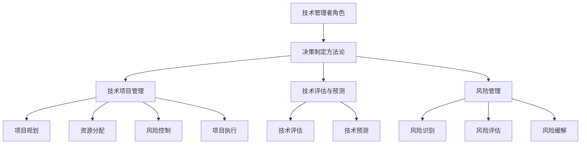

                 

### 摘要

在快速变化的技术领域中，技术管理者面临着诸多挑战，其中最为关键的是如何有效地制定决策。本文旨在探讨技术管理者的决策制定方法论，通过系统地阐述决策制定的核心概念、方法论、实际应用以及案例分析，为技术管理者提供一套实用且全面的决策框架。文章首先介绍了技术管理者的角色与职责，明确了其在项目管理中的关键作用。接着，深入分析了决策制定方法论的基础，包括决策的类型、过程模型以及关键要素。在后续章节中，文章重点探讨了技术评估与预测、风险管理与决策等实际应用场景，并通过具体案例展示了方法论的应用。最终，本文总结了最佳实践和注意事项，为技术管理者在实际工作中提供了有力的指导。### 确定核心概念与联系

在讨论技术管理者的决策制定方法论之前，有必要首先明确几个核心概念，并理解它们之间的相互关系。以下是本文中涉及的一些关键概念及其联系：

**技术管理者的角色**：技术管理者是负责指导、协调和管理技术团队的关键角色。他们不仅需要具备深厚的技术背景，还必须具备出色的管理能力和业务洞察力。技术管理者在组织中的角色包括但不限于：制定技术战略、管理项目、分配资源、推动技术创新以及确保团队的工作效率。

**决策制定方法论**：决策制定方法论是一套系统化的流程和方法，用于帮助管理者在不同情况下做出最优决策。这些方法论通常包括明确决策目标、收集和分析信息、评估可选方案以及选择最佳方案等步骤。对于技术管理者来说，决策制定方法论不仅适用于日常的管理决策，还适用于项目规划、技术选型、风险管理等重要领域。

**技术项目管理**：技术项目管理是确保技术项目按照预定的时间、预算和质量要求完成的过程。它涵盖了从项目规划、资源分配、风险控制到项目执行的各个方面。技术项目管理是技术管理者职责的核心部分，有效的项目管理能够提高项目成功的可能性。

**技术评估与预测**：技术评估是对现有或潜在技术的性能、效率、成本和可行性进行分析的过程。技术预测则是基于现有数据和市场趋势对未来技术发展方向的判断。技术评估与预测对于技术管理者来说至关重要，因为它们直接影响到技术的选型、项目的方向以及长期的技术规划。

**风险管理与决策**：风险管理是识别、评估和应对项目中的潜在风险的过程。技术管理者在决策制定过程中必须考虑各种风险，并制定相应的缓解策略。有效的风险管理能够降低项目失败的概率，确保项目的顺利进行。

这些概念之间的联系在于，技术管理者的角色决定了他们需要运用决策制定方法论进行技术项目管理，而技术评估与预测以及风险管理则是决策制定方法论的具体应用。通过深入理解这些概念及其相互关系，技术管理者可以更加系统和科学地制定决策，从而提高项目成功率和组织竞争力。

为了更好地理解这些概念，我们可以使用Mermaid流程图来展示技术管理者的决策制定流程：

这个流程图展示了技术管理者如何通过决策制定方法论来处理技术项目管理中的各个关键环节，包括技术评估与预测和风险管理。通过这样的结构化分析，技术管理者可以更好地理解其职责和决策制定过程，从而在实践中更有效地管理项目。### 第一部分：引言与基础

**第1章：技术管理者的角色与职责**

#### 1.1 技术管理者的角色

技术管理者在现代企业中扮演着至关重要的角色。他们不仅是技术团队的核心领导者，也是组织战略的执行者。具体来说，技术管理者的角色包括以下几个方面：

1. **技术战略规划**：技术管理者负责制定和实施组织的技术战略。这包括评估市场需求、分析技术趋势以及规划技术发展方向。技术管理者需要确保技术战略与组织整体战略相一致，从而为组织提供长远的技术支持。

2. **团队管理**：技术管理者负责领导和管理技术团队，包括招聘、培训、绩效评估和团队建设。他们需要激励团队成员，培养技术能力和团队协作精神，以提升整体团队的工作效率。

3. **项目管理**：技术管理者在项目管理中发挥着关键作用。他们负责项目规划、资源分配、风险控制和项目执行等全过程，确保项目按时、按质、按预算完成。

4. **技术决策**：技术管理者需要根据项目需求和市场趋势，做出技术选型、技术升级和技术淘汰等关键决策。这些决策直接影响项目的成功和组织的竞争力。

5. **业务和技术融合**：技术管理者需要具备较强的业务洞察力，能够理解业务需求，并将技术解决方案与业务目标相结合，推动组织的技术创新和业务增长。

#### 1.2 技术管理者的职责

技术管理者的职责具体包括以下几个方面：

1. **制定技术战略**：分析市场需求和竞争环境，制定符合组织长远发展目标的技术战略，确保技术投入与回报的平衡。

2. **管理项目**：负责项目规划、资源分配、进度控制和项目监控，确保项目按时、按质、按预算完成。

3. **团队建设**：制定团队发展计划，提升团队技术能力和团队协作精神，打造高效的技术团队。

4. **决策制定**：在项目和技术规划过程中，做出科学合理的决策，平衡技术需求和业务目标。

5. **风险管理**：识别项目风险，评估风险影响，制定风险应对策略，确保项目顺利进行。

6. **持续改进**：推动技术团队不断学习新技术，优化工作流程，提高工作效率和项目成功率。

#### 1.3 技术管理者面临的挑战

技术管理者在履行职责的过程中面临着诸多挑战：

1. **技术快速变化**：随着技术的快速发展，技术管理者需要不断更新自己的知识体系，保持对新兴技术的敏感度。

2. **资源有限**：技术管理者通常面临资源有限的情况，需要在有限的资源下做出最优决策，提高资源利用率。

3. **项目管理复杂度**：随着项目规模的扩大和复杂度的增加，技术管理者需要掌握更复杂的项目管理方法和工具。

4. **团队协作**：技术管理者需要有效协调不同团队之间的合作，解决跨部门协作中的冲突和沟通问题。

5. **业务和技术融合**：技术管理者需要深入了解业务需求，将技术解决方案与业务目标相结合，推动业务增长。

通过深入理解技术管理者的角色与职责以及面临的挑战，我们可以更好地理解技术管理者的决策制定方法论的重要性。接下来，我们将详细探讨技术项目管理的基础，为技术管理者提供更加全面和实用的决策制定框架。### 第2章：技术项目管理基础

#### 2.1 技术项目管理概述

技术项目管理是确保技术项目按照预定的时间、预算和质量要求成功完成的过程。它涵盖了从项目规划、资源分配到项目执行和监控的各个方面。技术项目管理不仅涉及技术方面的决策，还涉及管理、协调和沟通等多个层面。以下是技术项目管理的基本概念和关键要素：

**项目生命周期**：技术项目生命周期包括项目启动、项目规划、项目执行、项目监控和项目收尾等阶段。每个阶段都有其特定的任务和目标，相互关联并确保项目的顺利进行。

- **项目启动**：确定项目目标、范围和可行性，组建项目团队，明确项目干系人的需求和期望。
- **项目规划**：制定详细的项目计划，包括任务分解、时间表、资源分配、风险评估和风险应对策略。
- **项目执行**：按照项目计划执行任务，协调团队成员的工作，确保项目按计划进行。
- **项目监控**：监控项目进度、质量和成本，识别和解决项目中的问题，确保项目在既定范围内完成。
- **项目收尾**：完成项目交付，进行项目总结和评估，确保项目目标的实现。

**项目管理方法论**：技术项目管理方法论是一套系统化的方法和工具，用于指导项目管理的各个阶段。常见的方法论包括瀑布模型、敏捷方法、迭代开发等。不同方法论适用于不同的项目类型和需求，技术管理者需要根据实际情况选择合适的方法论。

**项目干系人管理**：项目干系人是指对项目成功有直接或间接影响的人员或组织。技术管理者需要识别项目干系人，了解他们的需求和期望，并建立有效的沟通机制，确保项目干系人的积极参与和项目信息的透明度。

**项目资源管理**：项目资源管理包括人力资源、物资资源和财务资源等。技术管理者需要合理分配和利用资源，确保项目在有限的资源下取得最佳效果。这包括人员招聘、培训、资源优化和成本控制等。

#### 2.2 项目生命周期管理

项目生命周期管理是技术项目管理的重要组成部分，它确保项目按照预定的目标和时间表顺利完成。以下是项目生命周期管理的具体步骤和关键要素：

1. **项目启动**：
   - 确定项目目标和范围：明确项目的目标、预期成果和项目范围。
   - 组建项目团队：根据项目需求组建专业团队，明确团队成员的角色和职责。
   - 确定项目干系人：识别项目的关键利益相关者，包括内部和外部干系人，并建立沟通渠道。

2. **项目规划**：
   - 制定项目计划：详细规划项目的任务、时间表、资源分配和预算。
   - 风险评估与应对策略：识别项目中的潜在风险，评估其可能性和影响，并制定相应的风险应对策略。
   - 制定质量管理计划：确保项目成果的质量符合预期标准，包括质量保证措施和质量控制流程。

3. **项目执行**：
   - 按计划执行任务：确保项目团队按照项目计划执行任务，协调团队成员的工作，解决项目中的问题和冲突。
   - 项目监控：实时监控项目进度、质量和成本，识别和解决项目中的问题，确保项目在既定范围内进行。

4. **项目监控**：
   - 项目进度监控：跟踪项目进度，确保项目按计划进行，及时调整计划以应对变化。
   - 质量监控：评估项目成果的质量，确保达到预期标准。
   - 成本监控：控制项目成本，确保项目在预算范围内完成。

5. **项目收尾**：
   - 项目交付：完成项目交付，确保项目成果符合项目目标和质量要求。
   - 项目总结：对项目过程进行总结和评估，识别项目中的成功经验和改进机会。
   - 项目文档归档：整理项目文档，确保项目资料的完整性和可追溯性。

通过系统地管理项目生命周期，技术管理者可以确保项目目标的实现，提高项目的成功率和组织的竞争力。

#### 2.3 项目风险管理

项目风险管理是确保项目在预定范围内成功完成的关键环节。技术管理者需要识别、评估和应对项目中的潜在风险，以降低项目失败的概率。以下是项目风险管理的具体步骤和关键要素：

1. **风险识别**：
   - 识别潜在风险：通过访谈、文档审查、专家咨询等方法，识别项目中的潜在风险。
   - 风险分类：根据风险的可能性和影响，将风险分类为高、中、低风险。

2. **风险评估**：
   - 评估风险可能性：对识别出的风险进行概率评估，确定其可能发生的概率。
   - 评估风险影响：对识别出的风险进行影响评估，确定其可能对项目目标、进度、质量和成本的影响程度。

3. **风险应对策略**：
   - 风险规避：通过调整项目计划、改变项目范围或采用不同的技术方案，避免风险的发生。
   - 风险减轻：通过采取预防措施、加强监控、增加预算或资源，降低风险的影响程度。
   - 风险接受：对某些不可避免的风险，制定风险接受策略，确保在风险发生时能够应对。

4. **风险监控**：
   - 风险监控计划：制定风险监控计划，实时跟踪已识别的风险，评估风险应对措施的有效性。
   - 风险更新：定期更新风险清单，记录新识别的风险和已采取的应对措施。

通过系统地管理项目风险，技术管理者可以降低项目失败的概率，提高项目的成功率。

综上所述，技术项目管理基础包括项目生命周期管理和项目风险管理，它们为技术管理者的决策制定提供了坚实的理论和实践基础。在接下来的章节中，我们将进一步探讨决策制定方法论的具体步骤和工具，帮助技术管理者在实际工作中更加科学和有效地制定决策。### 第二部分：决策制定方法论

**第3章：决策制定方法论概述**

#### 3.1 决策的类型

在技术管理者的日常工作中，决策的类型多种多样，根据不同的标准，可以划分为以下几类：

1. **战略决策**：战略决策涉及组织的长期发展方向和目标。技术管理者需要根据市场趋势、技术发展和技术战略，制定组织的技术发展方向、技术投资计划和产品开发策略。这类决策通常具有深远的影响，需要考虑组织的整体利益和长期目标。

2. **战术决策**：战术决策通常涉及短期目标和策略，如项目规划、资源分配、团队建设和技术选型等。技术管理者需要在有限的资源和时间内，确保项目顺利推进，并达到预期的目标。

3. **运营决策**：运营决策涉及日常运营活动，如工作流程优化、任务分配、设备维护和日常项目管理等。这些决策直接影响到团队的效率和项目的执行效果。

4. **紧急决策**：紧急决策通常是在突发事件或紧急情况下做出的，如系统故障、客户投诉或项目延期等。技术管理者需要迅速响应，采取有效的措施解决问题，以减少对项目和其他方面的影响。

#### 3.2 决策过程模型

决策过程模型是指导技术管理者进行科学决策的工具。一个典型的决策过程通常包括以下几个步骤：

1. **问题识别**：明确决策需要解决的问题或面对的挑战。这一步骤需要技术管理者具备敏锐的洞察力和分析能力，能够识别出问题的本质。

2. **目标设定**：根据问题识别的结果，设定具体的决策目标。目标应具有明确性、可行性和可衡量性，以便后续的决策评估。

3. **方案列举**：列举所有可能的解决方案或行动方案。这一步骤需要技术管理者具备广泛的知识和经验，能够从不同的角度思考问题。

4. **方案评估**：对每个方案进行详细评估，包括其可行性、成本、风险和潜在收益。评估过程中，技术管理者应运用数据分析和逻辑推理，确保评估的客观性和全面性。

5. **方案选择**：根据评估结果，选择最佳方案。这一步骤需要技术管理者具备决策能力和判断力，能够在多个可行方案中做出最优选择。

6. **方案实施**：将选定的方案付诸实施。技术管理者需要协调资源、分配任务，确保方案顺利执行。

7. **监控与调整**：在方案实施过程中，持续监控方案的效果，并根据实际情况进行调整。这一步骤是确保决策成功的关键，技术管理者需要具备良好的应变能力和管理能力。

#### 3.3 决策制定的关键要素

科学决策需要考虑多个关键要素，以下是其中几个重要的要素：

1. **信息收集**：决策过程中需要收集充分的信息，包括技术数据、市场信息、竞争对手分析等。信息收集的全面性和准确性直接影响到决策的质量。

2. **风险评估**：对每个方案进行详细的风险评估，包括可能的风险类型、发生概率和影响程度。风险评估是决策制定的重要环节，能够帮助技术管理者全面了解每个方案的风险，从而做出更加明智的决策。

3. **成本效益分析**：评估每个方案的预期成本和潜在收益，确保决策的经济合理性。成本效益分析是决策制定过程中不可或缺的一环，能够帮助技术管理者选择最具效益的方案。

4. **团队协作**：技术管理者需要充分发挥团队的智慧和力量，通过团队讨论和合作，集思广益，形成最佳的决策方案。

5. **决策执行的保障**：确保决策方案能够得到有效执行，需要技术管理者具备良好的沟通协调能力，能够调动团队的积极性，确保方案顺利实施。

通过深入理解和应用决策制定方法论，技术管理者可以更加科学和有效地做出决策，提高项目的成功率和组织的竞争力。在接下来的章节中，我们将进一步探讨技术评估与预测以及风险管理在决策制定中的应用。### 第4章：技术评估与预测

#### 4.1 技术评估的方法

技术评估是技术管理者在决策制定过程中必不可少的一环，它涉及到对现有或潜在技术的性能、效率、成本和可行性的全面分析。以下是几种常见的技术评估方法：

1. **成本效益分析**：成本效益分析是一种评估技术方案经济性的方法。它通过计算每个技术方案的初始投资、运营成本和预期收益，来确定哪个方案最具有经济效益。具体步骤如下：

   - **成本计算**：包括初始投资、维护成本、运营成本等。
   - **效益计算**：包括预期收益、市场份额、客户满意度等。
   - **成本效益比**：将效益与成本进行比较，得出每个方案的相对经济性。

2. **性能评估**：性能评估主要关注技术方案的性能指标，如速度、可靠性、可扩展性等。通过模拟测试、基准测试或现场测试，评估技术方案在实际应用中的表现。具体步骤如下：

   - **定义性能指标**：明确评估的性能指标，如响应时间、吞吐量、错误率等。
   - **测试设计**：设计测试场景，模拟实际应用环境。
   - **测试执行**：执行测试，记录测试结果。
   - **结果分析**：分析测试结果，确定技术方案的性能水平。

3. **风险评估**：在技术评估过程中，需要对技术方案的风险进行全面评估，包括技术风险、市场风险、法律风险等。通过识别风险、评估风险发生概率和影响程度，制定相应的风险缓解策略。

4. **专家评审**：邀请技术专家对技术方案进行评审，提供专业的意见和建议。专家评审可以补充量化分析方法的不足，提供更加全面的评估结果。

5. **基准对比**：将评估的技术方案与现有的基准方案或竞争对手的方案进行对比，分析优劣。基准对比可以帮助技术管理者更清晰地了解技术方案的优劣势，为决策提供参考。

#### 4.2 技术预测的技巧

技术预测是技术管理者根据现有数据和市场趋势，对未来技术发展方向和趋势的判断。以下是几种常见的技术预测技巧：

1. **趋势分析**：通过分析过去和现在的技术趋势，预测未来的技术发展方向。具体步骤如下：

   - **收集数据**：收集过去和现在的技术数据，包括专利申请、学术论文、市场报告等。
   - **数据可视化**：使用图表、曲线图等可视化工具，展示技术发展的趋势。
   - **趋势分析**：分析技术数据，识别技术发展的主要趋势和变化。

2. **情景分析**：通过构建不同的未来情景，预测不同情景下的技术发展情况。具体步骤如下：

   - **定义情景**：根据现有数据和市场趋势，定义多个未来情景，如最佳情景、最差情景等。
   - **情景模拟**：模拟不同情景下的技术发展，分析每种情景的可行性和潜在影响。
   - **结果分析**：分析每种情景下的技术发展情况，确定最可能的情景和应对策略。

3. **专家咨询**：邀请技术专家对未来的技术发展进行预测，结合专家的意见和判断，提高预测的准确性。

4. **数据驱动预测**：使用机器学习和数据分析技术，对历史数据进行分析和建模，预测未来的技术发展。具体步骤如下：

   - **数据准备**：收集和清洗历史数据，包括技术指标、市场指标等。
   - **特征工程**：提取数据中的关键特征，构建预测模型。
   - **模型训练与评估**：使用机器学习算法训练模型，评估模型性能。
   - **预测**：使用训练好的模型进行预测，生成技术发展预测结果。

#### 4.3 数据驱动的决策制定

数据驱动的决策制定是指通过收集、分析和利用数据，支持决策制定过程。技术管理者可以通过以下步骤实现数据驱动的决策制定：

1. **数据收集**：收集与决策相关的数据，包括内部数据和外部数据。内部数据包括项目数据、客户反馈、运营数据等；外部数据包括市场报告、行业数据、竞争对手数据等。

2. **数据分析**：使用数据分析工具和技术，对收集到的数据进行分析，提取有价值的信息和洞察。具体步骤如下：

   - **数据清洗**：清理和整理数据，确保数据的质量和准确性。
   - **数据可视化**：使用图表、仪表板等工具，展示分析结果，帮助技术管理者更直观地理解数据。
   - **统计分析**：使用统计学方法，对数据进行分析和建模，识别数据中的规律和趋势。

3. **数据驱动决策**：根据数据分析结果，制定决策。具体步骤如下：

   - **制定备选方案**：基于数据分析结果，制定多个备选方案。
   - **评估备选方案**：对备选方案进行评估，包括成本、效益、风险等。
   - **选择最优方案**：根据评估结果，选择最优方案进行实施。

通过数据驱动的决策制定，技术管理者可以减少决策的主观性，提高决策的准确性和效率。数据驱动的决策制定不仅适用于日常运营决策，还适用于长期战略决策，为技术管理者提供更加科学和全面的决策支持。

总之，技术评估与预测是技术管理者决策制定的重要环节，通过科学的方法和技巧，可以确保技术决策的科学性和有效性。在接下来的章节中，我们将进一步探讨风险管理与决策的相关内容，帮助技术管理者全面掌握决策制定的方法论。### 第5章：风险管理与决策

#### 5.1 风险识别与评估

在技术管理者的决策过程中，风险管理是一个至关重要的环节。有效的风险管理能够帮助技术管理者识别、评估和应对项目中的潜在风险，从而确保项目的顺利进行。以下是风险识别与评估的具体步骤和方法：

1. **风险识别**：风险识别是风险管理的基础，旨在识别项目中可能存在的风险。以下是一些常用的风险识别方法：

   - **头脑风暴**：组织项目团队成员进行头脑风暴，列出所有可能的风险。
   - **历史记录**：参考以往项目的风险记录，识别相似风险。
   - **专家咨询**：邀请行业专家和经验丰富的团队成员，提供风险识别的意见和建议。
   - **文档审查**：审查项目文档、合同、法规等，识别潜在的风险点。

2. **风险分类**：根据风险的可能性和影响，对识别出的风险进行分类。常见的分类方法包括：

   - **按风险类型分类**：如技术风险、市场风险、财务风险等。
   - **按风险影响分类**：如高、中、低风险。

3. **风险优先级排序**：对识别出的风险进行优先级排序，确定需要优先处理的风险。以下是一些排序方法：

   - **影响矩阵**：使用影响矩阵（如RI矩阵），根据风险的可能性和影响，对风险进行排序。
   - **风险评分法**：根据风险的可能性和影响，给每个风险打分，排序得分最高的风险。

4. **风险记录**：将识别出的风险记录在风险登记册中，包括风险名称、描述、分类、优先级、影响程度等信息。

5. **风险评估**：在风险识别的基础上，对每个风险进行详细评估，确定其可能性和影响程度。以下是常用的风险评估方法：

   - **定量评估**：使用定量方法，如概率分布、统计模型等，评估风险的可能性和影响程度。
   - **定性评估**：通过专家评估、打分等方法，对风险进行定性评估。
   - **蒙特卡罗模拟**：使用蒙特卡罗模拟，模拟风险事件的发生概率和影响程度。

6. **风险应对策略**：根据风险评估结果，制定相应的风险应对策略。常见的风险应对策略包括：

   - **风险规避**：通过调整项目计划、改变项目范围或采用不同的技术方案，避免风险的发生。
   - **风险减轻**：通过采取预防措施、加强监控、增加预算或资源，降低风险的影响程度。
   - **风险接受**：对某些不可避免的风险，制定风险接受策略，确保在风险发生时能够应对。

#### 5.2 风险缓解策略

风险缓解策略是降低项目风险影响的重要手段。以下是几种常见风险缓解策略：

1. **预防措施**：预防措施是在风险发生前采取的措施，以降低风险发生的概率。例如：

   - **加强团队培训**：提高团队成员的技术水平和风险意识，减少技术风险。
   - **制定应急预案**：为可能发生的紧急情况制定应急预案，确保快速响应。

2. **缓解措施**：缓解措施是在风险发生时采取的措施，以减轻风险的影响。例如：

   - **备份和冗余**：建立备份系统和冗余设计，确保在风险发生时，系统能够快速恢复。
   - **风险隔离**：将高风险模块与其他模块隔离，防止风险扩散。

3. **风险转移**：风险转移是将风险转移给其他方，如保险公司或第三方供应商。常见的风险转移方式包括：

   - **购买保险**：为项目购买保险，将财务风险转移给保险公司。
   - **外包**：将部分高风险任务外包给专业的第三方，减轻项目团队的风险负担。

4. **风险监测**：在风险缓解策略实施后，需要对风险进行持续监测，确保风险缓解措施的有效性。以下是一些风险监测方法：

   - **定期审查**：定期审查风险登记册，更新风险信息，评估风险应对措施的效果。
   - **实时监控**：使用实时监控工具，监控项目的关键指标和风险指标，及时发现和应对风险。

#### 5.3 风险决策模型

风险决策模型是一种基于概率和期望值的理论模型，用于在风险环境中做出最优决策。以下是几种常见风险决策模型：

1. **期望值模型**：期望值模型是一种基于概率和期望值的决策模型，用于在风险环境中选择最佳行动方案。具体步骤如下：

   - **定义决策变量**：确定决策模型中的决策变量，如技术方案、投资金额等。
   - **定义状态变量**：确定决策模型中的状态变量，如市场需求、技术成熟度等。
   - **定义概率分布**：根据历史数据和专家意见，定义每个状态变量的概率分布。
   - **计算期望值**：根据概率分布，计算每个决策变量的期望值。
   - **选择最佳方案**：选择期望值最大的决策变量，作为最佳行动方案。

2. **决策树模型**：决策树模型是一种图形化模型，用于在风险环境中进行决策分析。具体步骤如下：

   - **定义决策节点**：确定决策树中的决策节点，如技术方案选择、预算分配等。
   - **定义状态节点**：确定决策树中的状态节点，如市场需求、技术成熟度等。
   - **定义概率分支**：根据概率分布，定义每个状态节点的概率分支。
   - **计算期望值**：根据概率分支和收益值，计算每个决策节点的期望值。
   - **选择最佳路径**：选择期望值最大的决策路径，作为最佳行动方案。

3. **蒙特卡罗模拟**：蒙特卡罗模拟是一种基于随机抽样的模拟方法，用于在风险环境中进行决策分析。具体步骤如下：

   - **定义模型参数**：确定蒙特卡罗模拟中的模型参数，如概率分布、收益函数等。
   - **随机抽样**：使用随机抽样方法，生成大量随机样本。
   - **模拟计算**：根据模型参数和随机样本，进行模拟计算，得到每个决策变量的期望值和方差。
   - **结果分析**：分析模拟结果，确定最佳行动方案。

通过应用这些风险决策模型，技术管理者可以在风险环境中做出更加科学和理性的决策，降低项目失败的概率，提高项目成功率。

总之，风险管理与决策是技术管理者的重要职责之一。通过有效的风险识别、评估和应对策略，技术管理者可以降低项目风险，确保项目的顺利进行。在接下来的章节中，我们将进一步探讨决策制定在实际项目中的应用，帮助技术管理者将风险管理方法应用于实际工作中。### 第6章：决策制定在实际项目中的应用

#### 6.1 项目规划与资源分配

项目规划与资源分配是项目管理的核心环节，它直接影响到项目的进度、质量和成本。有效的项目规划与资源分配能够确保项目在既定的时间、预算和质量要求内顺利完成。以下是项目规划与资源分配的具体步骤和注意事项：

1. **项目目标与范围定义**：在项目规划初期，明确项目的目标、范围和预期成果。这包括确定项目的关键成功因素和项目的边界。项目目标的明确性有助于后续的资源分配和规划。

2. **工作分解结构（WBS）**：创建工作分解结构，将项目任务分解为更小、更具体的子任务。WBS有助于清晰地展示项目的各个组成部分，便于分配资源和管理进度。

3. **任务分配**：根据团队成员的技能、经验和兴趣，将任务分配给相应的成员。在任务分配过程中，应考虑任务的优先级和依赖关系，确保项目任务能够有序进行。

4. **时间规划**：制定项目的时间规划，包括确定关键路径和项目进度。关键路径是影响项目完成时间的关键任务序列，确保关键路径上的任务按时完成，是项目成功的关键。

5. **资源分配**：根据项目任务和时间规划，合理分配资源，包括人力、设备和预算。在资源分配过程中，要考虑到资源的可用性和团队的工作负荷，避免资源过剩或不足。

6. **风险评估**：在项目规划阶段，识别项目中的潜在风险，评估其可能性和影响，并制定相应的风险应对策略。风险评估有助于提前识别和预防潜在的问题。

7. **沟通与协调**：确保项目团队成员之间的沟通畅通，定期举行项目会议，更新项目进度和问题，协调团队成员的工作。有效的沟通和协调能够减少项目中的误解和冲突，提高项目的成功率。

注意事项：

- **灵活性**：在项目规划与资源分配过程中，要考虑到项目可能的变化和不确定性，留有一定的调整空间。
- **迭代规划**：项目规划是一个动态的过程，应根据项目进展情况进行迭代调整，确保项目能够适应变化。
- **持续监控**：在项目执行过程中，持续监控项目进度和资源使用情况，及时调整规划和资源分配，确保项目按计划进行。

#### 6.2 技术选型与评估

技术选型与评估是项目管理中的一项关键决策，它直接影响到项目的成功和组织的长期发展。以下是技术选型与评估的具体步骤和注意事项：

1. **需求分析**：在技术选型之前，详细分析项目需求，包括功能需求、性能需求、安全性需求等。需求分析有助于明确项目的技术方向和选型的依据。

2. **市场调研**：调研市场上的技术方案，包括开源和商业解决方案。通过市场调研，了解不同技术方案的特点、性能、成本和适用范围。

3. **技术评估**：对每个候选技术方案进行评估，包括其性能、稳定性、扩展性、兼容性和支持情况。技术评估可以通过实验、模拟和专家评审等方法进行。

4. **成本效益分析**：评估每个技术方案的经济性，包括初始投资、维护成本、运营成本和预期收益。成本效益分析有助于确定哪个技术方案最具经济效益。

5. **风险评估**：评估每个技术方案的风险，包括技术风险、市场风险、法律风险等。风险评估有助于识别潜在的风险并制定相应的风险应对策略。

6. **方案对比**：将评估结果进行对比，分析各个技术方案的优劣势，选择最佳方案。在对比过程中，要综合考虑技术性能、成本、风险和长期发展潜力。

7. **决策与实施**：根据评估结果，做出技术选型决策，并制定详细的实施计划。在技术选型决策过程中，要充分考虑项目的实际需求和组织的长期发展。

注意事项：

- **长期视角**：在技术选型时，不仅要考虑当前需求，还要考虑未来的发展潜力，确保所选技术方案能够适应未来的需求变化。
- **团队合作**：技术选型与评估是一个团队协作的过程，应充分听取团队成员的意见和建议，确保决策的科学性和全面性。
- **持续监控**：在技术选型后，持续监控技术方案的实施效果，根据实际情况进行调整和优化。

#### 6.3 项目变更管理

项目变更是项目管理中常见的情况，由于需求变更、技术变更或外部环境变化，项目规划可能需要调整。有效的项目变更管理能够确保项目在变更过程中仍能按计划进行。以下是项目变更管理的具体步骤和注意事项：

1. **变更请求**：在变更发生前，提出变更请求，明确变更的原因、影响和预期效果。变更请求应由项目团队成员或干系人提出，并经过审核和批准。

2. **变更评估**：评估变更的可行性、影响和风险。变更评估应包括对项目进度、成本、质量和风险等方面的影响分析。

3. **变更控制**：根据变更评估结果，决定是否批准变更。批准变更后，应制定详细的变更计划，包括变更的执行步骤、资源需求和时间安排。

4. **实施变更**：按照变更计划，实施变更。在变更实施过程中，要确保变更的影响得到有效控制，避免对项目其他方面造成不利影响。

5. **变更记录**：记录变更的详细信息，包括变更请求、评估结果、变更计划和实施情况。变更记录有助于后续的审计和项目总结。

6. **沟通与协调**：在变更过程中，保持与项目团队成员和干系人的沟通，及时更新项目进度和变更情况，确保变更的透明度和协调性。

注意事项：

- **及时响应**：对变更请求要及时响应，避免拖延，确保项目能够快速适应变化。
- **控制变更范围**：在变更管理过程中，要严格控制变更的范围和影响，避免不必要的变更，确保项目的稳定性。
- **文档管理**：加强对变更文档的管理，确保变更的记录完整、准确，便于后续审计和项目总结。

通过以上项目规划与资源分配、技术选型与评估、项目变更管理的具体应用，技术管理者可以更有效地制定决策，确保项目目标的实现。在实际工作中，技术管理者应根据项目的具体情况，灵活应用这些决策制定方法，提高项目的成功率。### 第7章：跨部门协作与沟通

#### 7.1 跨部门协作的挑战

跨部门协作是技术管理者的一个重要任务，但在实际操作中常常面临诸多挑战。以下是一些常见的挑战及其解决方案：

1. **目标不一致**：不同部门可能有各自的目标和优先级，导致协作困难。解决方案是明确项目的整体目标和各部门的具体目标，确保所有部门的目标一致。

2. **信息孤岛**：各部门之间可能存在信息壁垒，导致信息传递不畅。解决方案是建立统一的信息共享平台，确保各部门能够及时获取所需信息。

3. **沟通障碍**：语言、文化和专业知识的差异可能导致沟通不畅。解决方案是加强跨部门的沟通培训，提高团队成员的沟通技巧和跨文化理解。

4. **资源分配不均**：资源分配不均可能导致某些部门工作量过重，而另一些部门资源过剩。解决方案是建立公平的资源分配机制，确保各部门资源均衡。

5. **责任不清**：在跨部门协作中，责任分配可能不明确，导致工作推诿和效率低下。解决方案是明确各部门和个人的职责，建立清晰的责任体系。

#### 7.2 沟通技巧

有效的沟通是跨部门协作的关键，以下是一些提高沟通效率的技巧：

1. **倾听**：倾听是沟通的第一步，确保准确理解对方的观点和需求。倾听的技巧包括耐心、开放态度和积极反馈。

2. **明确表达**：清晰、简洁地表达自己的想法和需求，避免使用专业术语或模糊语言。在表达时，注意使用具体的例子和数据支持自己的观点。

3. **提问和反馈**：通过提问和反馈，确保双方对沟通内容的理解一致。提问可以帮助澄清疑虑，反馈可以确认信息的传达效果。

4. **非语言沟通**：注意使用肢体语言、面部表情和语调等非语言沟通方式，增强沟通的效果。这些非语言元素可以传达情感和态度，有助于建立信任。

5. **定期沟通**：建立定期的沟通机制，如项目进度会议、团队协作会议等，确保信息及时传达和问题及时解决。

#### 7.3 协同决策制定

在跨部门协作中，协同决策制定是确保项目顺利进行的重要环节。以下是一些协同决策制定的方法：

1. **共识决策**：通过讨论和协商，达成所有部门都认同的决策。共识决策有助于增强团队的凝聚力和执行力度。

2. **矩阵式决策**：建立跨部门的决策团队，由各部门的代表组成，共同讨论和制定决策。矩阵式决策可以确保不同部门的利益和需求得到充分考虑。

3. **投票决策**：在无法达成共识的情况下，通过投票决定最终方案。投票决策可以确保决策的民主性和公平性。

4. **决策矩阵**：使用决策矩阵分析各个方案的优缺点和可行性，帮助团队做出更科学的决策。

5. **迭代决策**：在决策过程中，允许团队成员提出反馈和改进意见，进行迭代优化，确保决策的准确性和有效性。

通过有效的跨部门协作和沟通，技术管理者可以更好地协调各部门的工作，提高项目执行效率，确保项目目标的实现。在接下来的章节中，我们将通过具体案例展示这些决策方法在实际项目中的应用。### 案例分析一：技术升级项目的决策制定

#### 8.1 项目背景

某互联网公司在市场竞争日益激烈的环境下，决定对现有技术架构进行升级，以提高系统的性能、可靠性和可扩展性。该项目旨在通过引入新技术和优化现有架构，满足快速增长的用户需求，提升用户体验，并确保系统在未来的可持续发展。

**项目目标**：
- 提高性能和响应速度。
- 提高系统的可靠性和稳定性。
- 优化架构，提升系统的可扩展性。
- 减少运维成本。

**项目范围**：
- 技术升级包括后端服务、数据库和前端应用。
- 需要进行系统重构和代码优化。
- 需要评估和引入新的技术栈。

#### 8.2 技术评估与预测

在项目启动前，技术团队进行了全面的技术评估与预测，以确定最佳的技术方案。

**技术评估方法**：

1. **成本效益分析**：
   - 对现有技术栈的维护成本和潜在升级成本进行了分析。
   - 评估了不同技术方案的初期投资和长期运营成本。

2. **性能评估**：
   - 使用基准测试和模拟负载测试，评估现有系统和潜在新技术的性能。
   - 重点关注系统的吞吐量、响应时间和资源消耗。

3. **风险评估**：
   - 评估了每个技术方案的技术风险、市场风险和法律风险。
   - 针对潜在风险制定了相应的缓解策略。

4. **专家评审**：
   - 邀请外部技术专家对各个技术方案进行评审，提供专业意见和建议。

**技术预测**：

1. **趋势分析**：
   - 分析了行业技术发展趋势，重点关注云计算、容器化和微服务架构等新兴技术。
   - 根据市场趋势和技术发展，预测了未来技术的方向和潜力。

2. **情景分析**：
   - 构建了最佳情景和最差情景，分析了不同情景下的技术发展情况。
   - 根据情景分析结果，确定了最可能的情景和应对策略。

#### 8.3 风险管理与决策

在技术评估和预测的基础上，项目团队制定了详细的风险管理计划，并进行了风险决策。

**风险识别**：

1. **技术风险**：
   - 新技术引入可能带来的不兼容性。
   - 技术团队对新技术的熟悉度不足。

2. **市场风险**：
   - 技术升级可能影响现有用户的使用体验。
   - 市场竞争可能导致客户流失。

3. **法律风险**：
   - 技术升级可能涉及知识产权问题。

**风险评估**：

1. **定量评估**：
   - 使用概率分布和影响矩阵，对每个风险进行了定量评估。

2. **定性评估**：
   - 通过专家评估，对风险的可能性和影响进行了定性评估。

**风险应对策略**：

1. **风险规避**：
   - 对于高风险的技术方案，采取规避策略，避免引入不兼容的新技术。

2. **风险减轻**：
   - 提前进行技术培训和知识分享，提高团队成员对新技术的熟悉度。
   - 在用户反馈中关注用户体验，及时调整技术方案。

3. **风险接受**：
   - 对于无法规避或减轻的风险，制定接受策略，确保在风险发生时能够应对。

**决策过程**：

1. **制定备选方案**：
   - 根据评估结果，制定了多个备选方案，包括现有架构优化、部分技术升级和全面技术升级。

2. **方案评估**：
   - 对备选方案进行了详细的成本效益分析、性能评估和风险评估。

3. **选择最优方案**：
   - 根据评估结果，选择了全面技术升级方案，因为它在长期发展潜力、性能提升和成本控制方面具有优势。

4. **决策实施**：
   - 制定了详细的实施计划，包括时间表、资源分配和风险评估。

#### 8.4 项目实施与结果

**项目实施**：

1. **需求分析**：
   - 明确了技术升级的具体需求和预期效果。
   - 确定了项目的范围和时间表。

2. **资源分配**：
   - 调配了技术团队和项目管理团队，确保项目的顺利推进。
   - 确保项目资源的充足和合理使用。

3. **技术选型与评估**：
   - 引入了微服务架构和容器化技术，优化了系统架构。
   - 对新技术进行了详细评估，确保其性能和稳定性。

4. **风险评估与监控**：
   - 持续监控项目风险，及时调整风险应对策略。
   - 定期进行项目进度和风险评估。

**项目结果**：

1. **性能提升**：
   - 系统响应速度提高了30%，用户满意度显著提升。
   - 系统的稳定性和可靠性得到了显著改善。

2. **成本节约**：
   - 通过优化技术栈和减少冗余组件，运维成本降低了20%。
   - 长期来看，新技术引入带来了更高的投资回报率。

3. **用户体验**：
   - 用户反馈积极，系统升级后用户体验得到了显著提升。
   - 用户留存率和活跃度有所提高。

4. **团队成长**：
   - 技术团队对新技术的熟悉度显著提升，团队协作更加顺畅。
   - 员工技能和知识得到了全面提升。

**项目小结**：

技术升级项目在风险管理和技术评估的基础上，通过科学的决策过程和有效的实施管理，取得了显著成效。项目不仅提升了系统的性能和用户体验，还实现了成本节约和团队成长。此次项目为公司的长期发展奠定了坚实基础，也为后续的技术升级和决策提供了宝贵经验。

通过这个案例，我们可以看到技术管理者在项目决策制定中的重要作用。通过科学的方法和工具，技术管理者可以有效地应对项目中的挑战，确保项目的成功实施。在未来的技术管理实践中，技术管理者应继续提升自身的决策能力和项目管理能力，推动组织的持续发展。### 案例分析二：新产品的市场策略决策

#### 9.1 市场调研与分析

在决定开发一款新产品之前，市场调研与分析是至关重要的。通过深入的市场调研，技术管理者可以了解市场需求、用户偏好以及竞争对手的情况，从而制定出科学合理的市场策略。

**调研目标**：
- 确定目标市场的需求与趋势。
- 识别潜在用户群体及其需求。
- 分析竞争对手的产品、优势和劣势。

**调研方法**：

1. **问卷调查**：通过在线问卷、线下访谈等方式，收集用户对现有产品和潜在新产品的看法和需求。
2. **深度访谈**：与行业专家、潜在用户和现有客户进行深度访谈，获取详细的市场信息和用户反馈。
3. **数据分析**：分析市场报告、行业数据和竞争对手的运营数据，了解市场趋势和用户行为。
4. **竞争分析**：对比分析竞争对手的产品特性、市场策略和用户评价，识别自身产品的优势与不足。

**调研结果**：

- 目标市场对新产品的需求强烈，尤其在功能扩展和用户体验方面。
- 用户对现有产品的满意度较高，但期待更多个性化服务和更优的用户体验。
- 竞争对手的产品在性能和价格上有一定优势，但在用户体验和售后服务方面存在不足。

#### 9.2 技术选型与成本分析

在市场调研的基础上，技术管理者需要结合产品需求和预算，选择合适的技术方案，并进行详细的成本分析。

**技术选型**：

1. **功能需求**：根据市场需求和用户反馈，确定产品的核心功能和扩展功能。
2. **技术栈选择**：结合现有技术栈和新兴技术，选择能够满足功能需求且具有发展潜力的技术方案。
   - **前端**：选择流行的前端框架，如React或Vue，提高开发效率和用户体验。
   - **后端**：采用微服务架构和容器化技术，提高系统的可扩展性和可靠性。
   - **数据库**：根据数据规模和查询需求，选择合适的数据库方案，如MySQL、MongoDB等。
3. **第三方服务**：考虑使用云计算和第三方服务，降低开发和运维成本。

**成本分析**：

1. **初期投资**：包括软件开发、硬件采购和第三方服务费用等。
2. **长期运营成本**：包括服务器租赁、数据库维护和员工培训等。
3. **风险评估**：考虑技术选型可能带来的风险，如兼容性问题、安全风险等，并制定相应的应对措施。

#### 9.3 风险评估与决策

在技术选型和成本分析的基础上，技术管理者需要全面评估项目的风险，并制定相应的决策。

**风险识别**：

1. **技术风险**：
   - 新技术引入可能带来兼容性和稳定性问题。
   - 技术团队对新技术的熟悉度不足，可能导致开发效率低下。

2. **市场风险**：
   - 新产品可能无法满足市场需求，导致销量不佳。
   - 竞争对手可能迅速响应，推出类似产品，影响市场地位。

3. **法律风险**：
   - 新产品可能涉及知识产权问题，需要合规审查。

**风险评估**：

1. **定量评估**：使用概率分布和影响矩阵，对每个风险进行定量评估。
2. **定性评估**：通过专家评估，对风险的可能性和影响进行定性评估。

**风险应对策略**：

1. **风险规避**：
   - 对于高风险的技术方案，考虑采用成熟的技术栈，避免引入不确定的新技术。

2. **风险减轻**：
   - 提前进行技术培训和知识分享，提高团队成员对新技术的熟悉度。
   - 与合作伙伴和技术供应商合作，降低技术风险。

3. **风险接受**：
   - 对于无法规避或减轻的风险，制定接受策略，确保在风险发生时能够应对。

**决策过程**：

1. **制定备选方案**：根据评估结果，制定多个备选方案，包括技术选型、市场策略和风险应对措施。
2. **方案评估**：对备选方案进行详细的成本效益分析和风险评估。
3. **选择最优方案**：根据评估结果，选择最优方案，并进行详细的实施规划。
4. **决策实施**：制定详细的实施计划，包括时间表、资源分配和风险管理。

#### 9.4 市场推广与反馈

**市场推广**：

1. **产品发布**：在确定最终方案后，制定详细的产品发布计划，包括营销策略、渠道选择和推广活动。
2. **用户教育**：通过线上和线下渠道，向目标用户介绍新产品的功能和优势，提高用户对产品的认知和兴趣。
3. **合作伙伴关系**：与行业合作伙伴建立合作关系，共同推广新产品，扩大市场影响力。

**用户反馈**：

1. **用户调研**：通过用户调研、问卷调查和用户访谈等方式，收集用户对产品的反馈和建议。
2. **数据分析**：对用户反馈进行数据分析，识别产品的问题和改进机会。
3. **持续优化**：根据用户反馈，持续优化产品功能和服务，提升用户体验。

**市场反馈结果**：

- 新产品发布后，获得了用户的积极反馈，用户满意度显著提升。
- 通过市场推广，产品在目标市场的知名度大幅提高，销量稳步增长。
- 与合作伙伴的紧密合作，扩大了产品的影响力和市场份额。

**项目小结**：

通过科学的市场调研、技术选型和风险评估，技术管理者成功制定了新产品的市场策略，并在市场推广和用户反馈中取得了显著成效。此次项目不仅提升了公司的市场竞争力，也为公司未来的新产品开发提供了宝贵的经验和指导。

通过这个案例，我们可以看到技术管理者在市场策略决策中的重要作用。通过全面的市场调研和科学的风险评估，技术管理者可以制定出科学合理的决策，确保新产品的成功开发和市场推广。在未来的技术管理实践中，技术管理者应继续提升自身的市场分析能力和决策能力，推动公司的持续发展和市场竞争力。### 附录A：决策制定工具与资源

在技术管理者的日常工作中，有效的工具和资源对于决策制定至关重要。以下是一些常用的决策制定工具和资源，供技术管理者参考和借鉴。

#### 9.1 决策制定工具

1. **SWOT分析**：
   - **定义**：SWOT分析是一种战略规划工具，用于评估项目的优势、劣势、机会和威胁。
   - **使用场景**：适用于评估项目或产品的市场定位、竞争优势等。

2. **决策树**：
   - **定义**：决策树是一种图形化工具，用于表示决策过程和各个可能的结果。
   - **使用场景**：适用于复杂决策的分析和决策路径的展示。

3. **期望值分析**：
   - **定义**：期望值分析是一种基于概率和收益的计算方法，用于评估不同决策的结果和收益。
   - **使用场景**：适用于风险评估和成本效益分析。

4. **蒙特卡罗模拟**：
   - **定义**：蒙特卡罗模拟是一种基于随机抽样的模拟方法，用于评估决策的概率分布和风险。
   - **使用场景**：适用于不确定性和风险的决策分析。

5. **甘特图**：
   - **定义**：甘特图是一种用于展示项目进度和任务的图形化工具。
   - **使用场景**：适用于项目规划和进度管理。

6. **平衡计分卡**：
   - **定义**：平衡计分卡是一种绩效管理工具，用于衡量项目的财务、客户、内部流程和学习与成长等四个维度。
   - **使用场景**：适用于项目绩效评估和目标管理。

#### 9.2 技术评估资源

1. **市场报告**：
   - **来源**：行业分析机构、市场研究公司等。
   - **用途**：提供市场趋势、竞争分析和用户需求等信息。

2. **技术白皮书**：
   - **来源**：技术供应商、开源社区等。
   - **用途**：提供技术原理、性能指标和最佳实践等详细信息。

3. **学术论文**：
   - **来源**：学术期刊、学术会议等。
   - **用途**：提供最新的研究成果和技术发展趋势。

4. **开源社区**：
   - **来源**：GitHub、Stack Overflow等。
   - **用途**：获取开源技术代码、社区讨论和最佳实践。

5. **技术博客和论坛**：
   - **来源**：技术博客、论坛和专业社区等。
   - **用途**：获取技术讨论、问题和解决方案。

#### 9.3 风险管理资源

1. **风险登记册**：
   - **用途**：记录和跟踪项目中的风险，包括风险名称、描述、分类和应对策略。

2. **风险评估矩阵**：
   - **用途**：评估风险的优先级和影响，帮助制定风险应对策略。

3. **应急预案**：
   - **用途**：在风险事件发生时，提供紧急响应和处理措施。

4. **风险管理软件**：
   - **用途**：自动化和简化风险识别、评估和监控过程。

5. **风险管理培训**：
   - **用途**：提高团队成员的风险管理意识和技能。

通过利用这些决策制定工具和资源，技术管理者可以更加科学和高效地进行决策制定，提高项目的成功率和组织的竞争力。在实际工作中，技术管理者应根据项目特点和需求，灵活选择和运用这些工具和资源，以实现最佳的决策效果。### 最佳实践 Tips、小结、注意事项、拓展阅读

**最佳实践 Tips：**

1. **定期回顾与反思**：在项目执行过程中，定期回顾和反思项目进展，识别成功经验和改进机会，及时调整决策方向。

2. **充分利用数据**：利用数据分析工具，收集并分析项目数据，为决策提供客观依据。

3. **建立风险管理文化**：在团队中建立风险管理文化，提高团队成员的风险意识和应对能力。

4. **重视沟通与协作**：确保团队成员之间的沟通畅通，加强跨部门协作，减少误解和冲突。

5. **灵活应对变化**：在项目执行过程中，灵活应对变化，及时调整计划和决策。

**小结：**

本文系统地介绍了技术管理者的决策制定方法论，从角色与职责、项目生命周期管理、决策过程模型、技术评估与预测、风险管理到跨部门协作，为技术管理者提供了全面的决策框架。通过科学的方法和工具，技术管理者可以更加有效地制定决策，提高项目成功率和组织竞争力。

**注意事项：**

1. **明确项目目标**：在决策制定过程中，务必明确项目目标，确保决策与目标一致。

2. **充分考虑风险**：在项目规划和决策过程中，充分考虑潜在风险，制定相应的风险应对策略。

3. **持续学习和提升**：技术管理者应不断学习新技术和管理方法，提升自身能力和决策水平。

**拓展阅读：**

1. 《项目管理知识体系指南》（PMBOK指南）：提供全面的项目管理知识和方法。

2. 《风险管理与决策制定》（Risk Management and Decision-Making）：深入探讨风险管理和决策制定的原理和实践。

3. 《敏捷项目管理实践指南》（Agile Project Management）：介绍敏捷方法在项目管理中的应用。

4. 《数据驱动决策》（Data-Driven Decision-Making）：探讨如何利用数据支持决策制定。

5. 《跨部门协作技巧》（Cross-Functional Collaboration）：提供跨部门协作的最佳实践和技巧。### 文章标题

《技术管理者的决策制定方法论：科学决策，高效管理》

### 文章关键词

技术管理者、决策制定、项目管理、技术评估、风险管理、跨部门协作

### 文章摘要

本文旨在为技术管理者提供一套全面的决策制定方法论，包括角色与职责、项目生命周期管理、决策过程模型、技术评估与预测、风险管理以及跨部门协作等关键环节。通过系统地阐述这些方法，本文帮助技术管理者在实际工作中做出科学、合理的决策，提高项目成功率和组织竞争力。文章结合具体案例分析，展示了方法论的应用和效果，为技术管理者提供了实用的决策指南。### 结尾

本文通过详细的探讨，为技术管理者提供了一套科学、系统的决策制定方法论。在快速变化的技术环境中，技术管理者需要不断学习新知识、掌握新方法，以应对日益复杂的挑战。希望本文的内容能够帮助读者更好地理解决策制定的原理和实践，提升自身的决策能力和项目管理水平。

**作者信息：**

作者：AI天才研究院/AI Genius Institute & 禅与计算机程序设计艺术 /Zen And The Art of Computer Programming

感谢您的阅读，如果您有任何问题或建议，欢迎随时与我们联系。期待在未来的技术管理实践中，与您共同探讨更多精彩话题。祝您在技术管理的道路上不断前行，取得更加辉煌的成就！

