                 

# 文章标题：技术管理者的决策模型：在复杂环境中做选择

## 关键词
- 技术管理
- 决策模型
- 复杂环境
- 算法原理
- 优化策略

## 摘要
本文旨在探讨技术管理者在复杂环境中进行决策的最佳实践。我们将首先介绍技术管理者的角色及其面临的挑战，随后深入分析决策模型的基本概念和理论。接着，我们将探讨如何在实际项目中应用这些模型，并通过实际案例进行讲解。文章还将介绍复杂环境下的决策策略，以及如何改进和优化决策模型。最后，我们将总结全文并提出未来研究方向。

## 引言

技术管理者在现代企业中扮演着至关重要的角色。他们不仅要负责技术团队的管理，还要在复杂的业务环境中做出明智的决策。这些决策涉及到项目选择、资源分配、风险评估等多个方面，直接影响到企业的竞争力和可持续发展。

然而，复杂的环境使得技术管理者面临诸多挑战。首先，技术发展速度加快，要求管理者具备前瞻性。其次，业务需求的不断变化使得管理者需要具备灵活的应对能力。此外，数据量的爆炸性增长和算法的复杂化也增加了决策的难度。

为了应对这些挑战，技术管理者需要掌握一系列决策模型。这些模型不仅有助于他们更好地理解问题，还可以提供系统化的解决方案。本文将详细介绍这些决策模型，并探讨如何在复杂环境中有效应用它们。

## 决策模型基础

### 决策模型的分类

决策模型可以根据不同的标准进行分类。常见的分类方法包括：

1. **确定型模型**：这类模型在决策过程中所有变量都是已知的，结果可以准确预测。常见的确定型模型包括线性规划和整数规划。

2. **不确定型模型**：这类模型在决策过程中存在不确定因素，结果无法准确预测。常见的不确定型模型包括贝叶斯决策和蒙特卡洛模拟。

3. **风险型模型**：这类模型在决策过程中存在风险，但可以通过概率来描述。常见的风险型模型包括决策树和蒙特卡洛模拟。

### 经典决策模型

在本节中，我们将介绍一些经典决策模型及其原理。

#### 决策树

决策树是一种常用的确定型模型，它通过一系列的决策节点和结果节点来表示决策过程。每个决策节点表示一个条件测试，每个结果节点表示一个可能的决策结果。

**伪代码：**
```python
def decision_tree(data):
    if condition1:
        return result1
    elif condition2:
        return result2
    else:
        return result3
```

#### 贝叶斯网络

贝叶斯网络是一种基于概率的决策模型，它通过一组节点和边来表示变量之间的依赖关系。每个节点表示一个变量，边表示变量之间的条件概率。

**Mermaid 流程图：**
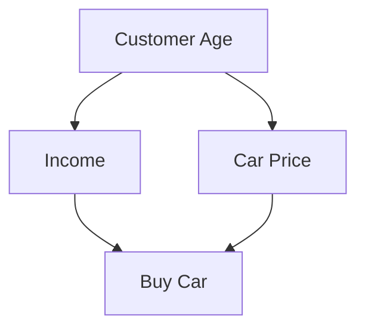

#### 马尔可夫决策过程

马尔可夫决策过程是一种基于状态的决策模型，它通过状态转移概率矩阵来描述决策过程。每个状态都对应一组策略，策略的选择取决于当前状态。

**伪代码：**
```python
def markov_decision_process(state, policy):
    next_state = state
    for action in policy[state]:
        next_state = transition_probability[state][action]
    return next_state
```

### 风险评估模型

风险评估模型用于评估决策过程中的风险。常见的风险评估模型包括蒙特卡洛模拟和敏感性分析。

**蒙特卡洛模拟：**
蒙特卡洛模拟是一种通过随机抽样来评估风险的方法。它通过模拟大量样本路径来估计决策结果的概率分布。

**伪代码：**
```python
def monte_carlo_simulation(model, num_samples):
    results = []
    for _ in range(num_samples):
        result = simulate(model)
        results.append(result)
    return results
```

**敏感性分析：**
敏感性分析通过改变模型中的参数来评估决策结果的敏感度。它可以帮助管理者识别哪些参数对决策结果影响最大。

**伪代码：**
```python
def sensitivity_analysis(model, parameter):
    results = []
    for value in range(min_value, max_value):
        model.parameter = value
        result = model.evaluate()
        results.append(result)
    return results
```

## 决策模型的实践应用

### 项目决策分析

项目决策分析是技术管理者面临的一项重要任务。它涉及到项目的可行性评估、资源分配和风险控制。

**伪代码：**
```python
def project_decision_analysis(project, budget, resources):
    if is_feasible(project, budget, resources):
        allocate_resources(project, resources)
        manage_risk(project)
        return "Project Approved"
    else:
        return "Project Rejected"
```

### 人力资源决策

人力资源决策包括招聘、培训、绩效评估等方面。技术管理者需要根据业务需求和员工能力来做出决策。

**伪代码：**
```python
def human_resource_decision(employee, requirement):
    if employee_meets_requirement(employee, requirement):
        hire_employee(employee)
        train_employee(employee)
    else:
        reject_employee(employee)
```

### 市场营销决策

市场营销决策包括产品定位、广告投放、市场推广等方面。技术管理者需要根据市场需求和竞争状况来做出决策。

**伪代码：**
```python
def marketing_decision(product, market):
    if market潜力大：
        position_product(product, market)
        allocate_budget_to_advertisement()
    else:
        reduce_marketing_activity()
```

### 供应链管理决策

供应链管理决策包括供应商选择、库存管理、物流优化等方面。技术管理者需要确保供应链的高效运作。

**伪代码：**
```python
def supply_chain_decision(supplier, inventory, logistics):
    if supplier_has_reliable_performance：
        select_supplier(supplier)
        manage_inventory(inventory)
        optimize_logistics(logistics)
    else:
        seek_alternative_supplier()
```

## 复杂环境中的决策

在复杂环境中，技术管理者面临的问题更加复杂，需要考虑的因素更多。以下是一些复杂环境下的决策策略：

1. **多目标优化**：在复杂环境中，管理者需要同时考虑多个目标，如成本、时间、质量等。多目标优化可以帮助管理者找到最优的解决方案。

2. **迭代决策**：在复杂环境中，决策不是一次性的，而是需要不断迭代和调整。管理者需要根据环境的变化及时调整决策。

3. **情景分析**：情景分析可以帮助管理者预测不同情况下的结果，为决策提供依据。

4. **团队合作**：在复杂环境中，管理者需要依靠团队的力量，通过集思广益来做出更好的决策。

## 决策模型案例分析

在本节中，我们将通过几个实际案例来展示决策模型的应用。

### 案例一：企业并购决策

某企业计划并购另一家企业，需要评估并购的可行性。通过决策树模型，管理者可以分析并购的各种可能结果，如成功、失败、中立等，并评估每个结果的风险和收益。

**Mermaid 流程图：**
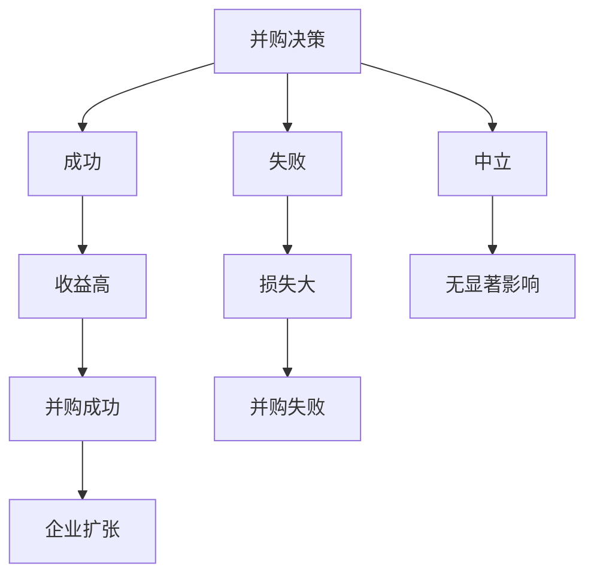

### 案例二：新产品开发决策

某公司计划开发一款新产品，需要评估新产品的市场前景和可行性。通过贝叶斯网络模型，管理者可以分析市场趋势、竞争状况、用户需求等因素，并预测新产品的成功率。

**Mermaid 流程图：**
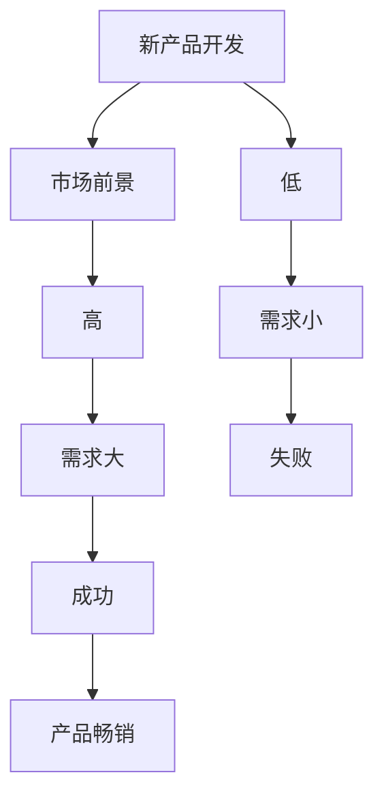

### 案例三：应急响应决策

某地区发生自然灾害，需要迅速响应。通过马尔可夫决策过程模型，管理者可以分析不同应急响应策略的效果，如抢险、疏散、救援等，并选择最优策略。

**伪代码：**
```python
def emergency_response_decision(current_state, strategies):
    best_strategy = None
    best_result = None
    for strategy in strategies:
        next_state = decision_process[current_state][strategy]
        if best_result is None or result superiority:
            best_strategy = strategy
            best_result = result
    return best_strategy
```

## 决策模型的改进与优化

为了提高决策模型的性能，管理者可以采用以下方法：

1. **数据驱动优化**：通过收集和分析历史数据，管理者可以优化决策模型，提高预测准确性。

2. **算法优化**：优化算法结构，提高计算效率和准确性。

3. **模型集成**：将多个决策模型集成，形成复合模型，提高决策的全面性和准确性。

## 结论

本文介绍了技术管理者在复杂环境中进行决策的最佳实践。我们首先介绍了技术管理者的角色和面临的挑战，随后详细分析了决策模型的基础知识，包括确定型模型、不确定型模型和风险型模型。接着，我们探讨了决策模型的实践应用，并通过实际案例进行了讲解。最后，我们讨论了在复杂环境中的决策策略和决策模型的改进与优化方法。

未来，随着技术的不断发展，决策模型也将不断进化。技术管理者需要不断学习和适应新的模型，以提高决策的准确性和效率。同时，跨学科的融合也将为决策模型带来新的思路和方法。

## 附录

### 附录A：决策模型工具和资源

- 决策树工具：[https://www decisiontree maker.com/]
- 贝叶斯网络工具：[https://www bayes nettools.com/]
- 蒙特卡洛模拟工具：[https://www.monte carlo simulation.com/]

### 附录B：常见决策模型公式和算法伪代码

- 决策树算法伪代码
- 贝叶斯网络算法伪代码
- 马尔可夫决策过程算法伪代码

### 附录C：案例研究详细资料

- 案例一：企业并购决策详细资料
- 案例二：新产品开发决策详细资料
- 案例三：应急响应决策详细资料

## 作者信息

作者：AI天才研究院/AI Genius Institute & 禅与计算机程序设计艺术 /Zen And The Art of Computer Programming```markdown
# 技术管理者的决策模型：在复杂环境中做选择

> 关键词：技术管理、决策模型、复杂环境、算法原理、优化策略

> 摘要：本文旨在探讨技术管理者在复杂环境中进行决策的最佳实践。我们将首先介绍技术管理者的角色及其面临的挑战，随后深入分析决策模型的基本概念和理论。接着，我们将探讨如何在实际项目中应用这些模型，并通过实际案例进行讲解。文章还将介绍复杂环境下的决策策略，以及如何改进和优化决策模型。最后，我们将总结全文并提出未来研究方向。

## 引言

技术管理者在现代企业中扮演着至关重要的角色。他们不仅要负责技术团队的管理，还要在复杂的业务环境中做出明智的决策。这些决策涉及到项目选择、资源分配、风险评估等多个方面，直接影响到企业的竞争力和可持续发展。

### 技术管理者的角色

技术管理者通常负责以下任务：

1. **团队管理**：技术管理者需要负责组建、培训和管理技术团队。
2. **项目规划**：技术管理者需要制定项目计划，确保项目按时按质完成。
3. **技术选型**：技术管理者需要根据项目需求选择合适的技术方案。
4. **风险评估**：技术管理者需要对项目中的潜在风险进行评估和管理。
5. **持续改进**：技术管理者需要推动技术团队的持续学习和改进。

### 面临的挑战

技术管理者在复杂环境中面临以下挑战：

1. **技术发展速度**：技术发展迅速，技术管理者需要具备前瞻性，及时掌握新技术。
2. **业务需求变化**：业务需求不断变化，技术管理者需要具备灵活的应对能力。
3. **数据复杂性**：数据量的增加和数据类型的复杂化，使得决策分析更加困难。
4. **团队协作**：在大型项目中，团队协作成为一大挑战，技术管理者需要协调不同团队成员的工作。

为了应对这些挑战，技术管理者需要掌握一系列决策模型。这些模型不仅有助于他们更好地理解问题，还可以提供系统化的解决方案。本文将详细介绍这些决策模型，并探讨如何在复杂环境中有效应用它们。

## 决策模型基础

### 决策模型的分类

决策模型可以根据不同的标准进行分类。常见的分类方法包括：

1. **确定型模型**：这类模型在决策过程中所有变量都是已知的，结果可以准确预测。常见的确定型模型包括线性规划和整数规划。
2. **不确定型模型**：这类模型在决策过程中存在不确定因素，结果无法准确预测。常见的不确定型模型包括贝叶斯决策和蒙特卡洛模拟。
3. **风险型模型**：这类模型在决策过程中存在风险，但可以通过概率来描述。常见的风险型模型包括决策树和蒙特卡洛模拟。

### 经典决策模型

在本节中，我们将介绍一些经典决策模型及其原理。

#### 决策树

决策树是一种常用的确定型模型，它通过一系列的决策节点和结果节点来表示决策过程。每个决策节点表示一个条件测试，每个结果节点表示一个可能的决策结果。

**决策树算法原理：**
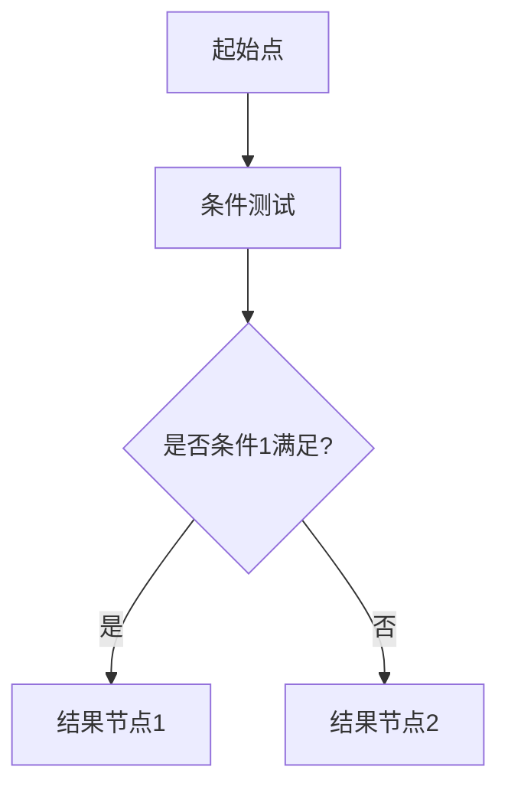

**伪代码：**
```python
def decision_tree(data):
    if condition1:
        return result1
    elif condition2:
        return result2
    else:
        return result3
```

#### 贝叶斯网络

贝叶斯网络是一种基于概率的决策模型，它通过一组节点和边来表示变量之间的依赖关系。每个节点表示一个变量，边表示变量之间的条件概率。

**贝叶斯网络算法原理：**


**伪代码：**
```python
class BayesianNetwork:
    def __init__(self):
        self.nodes = []
        self.edges = []

    def add_node(self, node):
        self.nodes.append(node)

    def add_edge(self, node1, node2):
        self.edges.append((node1, node2))

    def predict(self, observations):
        # 计算条件概率
        # 返回预测结果
        pass
```

#### 马尔可夫决策过程

马尔可夫决策过程是一种基于状态的决策模型，它通过状态转移概率矩阵来描述决策过程。每个状态都对应一组策略，策略的选择取决于当前状态。

**马尔可夫决策过程算法原理：**
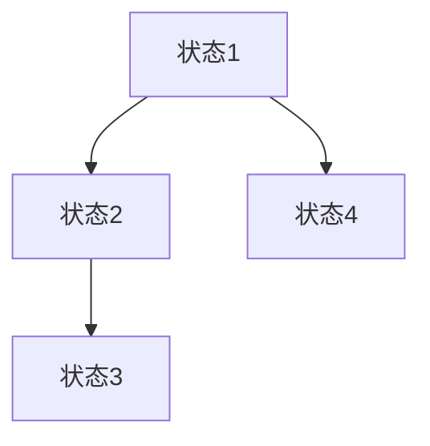

**伪代码：**
```python
def markov_decision_process(state, policy):
    next_state = state
    for action in policy[state]:
        next_state = transition_probability[state][action]
    return next_state
```

### 风险评估模型

风险评估模型用于评估决策过程中的风险。常见的风险评估模型包括蒙特卡洛模拟和敏感性分析。

**蒙特卡洛模拟：**
蒙特卡洛模拟是一种通过随机抽样来评估风险的方法。它通过模拟大量样本路径来估计决策结果的概率分布。

**伪代码：**
```python
def monte_carlo_simulation(model, num_samples):
    results = []
    for _ in range(num_samples):
        result = simulate(model)
        results.append(result)
    return results
```

**敏感性分析：**
敏感性分析通过改变模型中的参数来评估决策结果的敏感度。它可以帮助管理者识别哪些参数对决策结果影响最大。

**伪代码：**
```python
def sensitivity_analysis(model, parameter):
    results = []
    for value in range(min_value, max_value):
        model.parameter = value
        result = model.evaluate()
        results.append(result)
    return results
```

## 决策模型的实践应用

### 项目决策分析

项目决策分析是技术管理者面临的一项重要任务。它涉及到项目的可行性评估、资源分配和风险控制。

**项目决策分析算法原理：**
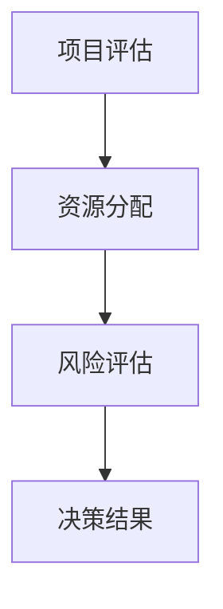

**伪代码：**
```python
def project_decision_analysis(project, budget, resources):
    if is_feasible(project, budget, resources):
        allocate_resources(project, resources)
        manage_risk(project)
        return "Project Approved"
    else:
        return "Project Rejected"
```

### 人力资源决策

人力资源决策包括招聘、培训、绩效评估等方面。技术管理者需要根据业务需求和员工能力来做出决策。

**人力资源决策算法原理：**
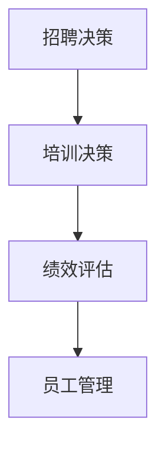

**伪代码：**
```python
def human_resource_decision(employee, requirement):
    if employee_meets_requirement(employee, requirement):
        hire_employee(employee)
        train_employee(employee)
    else:
        reject_employee(employee)
```

### 市场营销决策

市场营销决策包括产品定位、广告投放、市场推广等方面。技术管理者需要根据市场需求和竞争状况来做出决策。

**市场营销决策算法原理：**
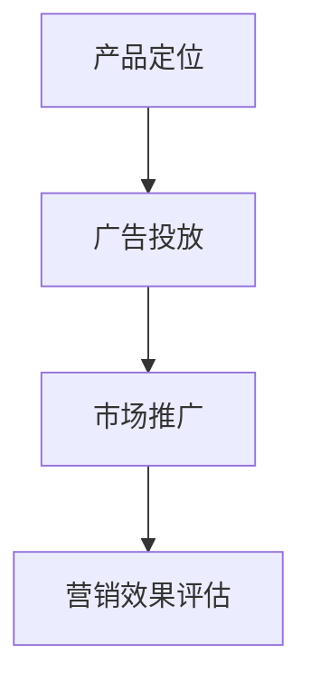

**伪代码：**
```python
def marketing_decision(product, market):
    if market潜力大：
        position_product(product, market)
        allocate_budget_to_advertisement()
    else:
        reduce_marketing_activity()
```

### 供应链管理决策

供应链管理决策包括供应商选择、库存管理、物流优化等方面。技术管理者需要确保供应链的高效运作。

**供应链管理决策算法原理：**
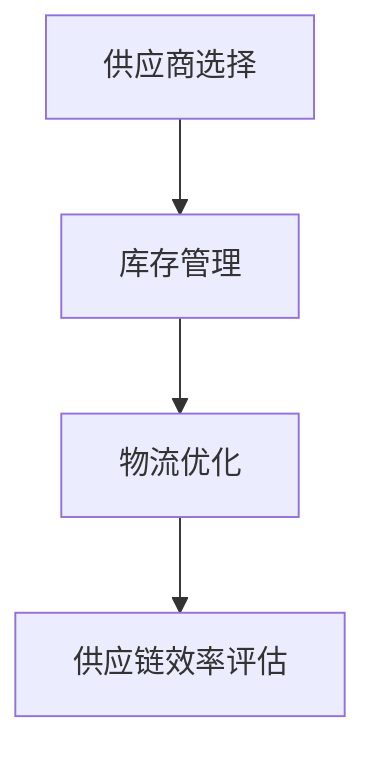

**伪代码：**
```python
def supply_chain_decision(supplier, inventory, logistics):
    if supplier_has_reliable_performance：
        select_supplier(supplier)
        manage_inventory(inventory)
        optimize_logistics(logistics)
    else:
        seek_alternative_supplier()
```

## 复杂环境中的决策

在复杂环境中，技术管理者面临的问题更加复杂，需要考虑的因素更多。以下是一些复杂环境下的决策策略：

1. **多目标优化**：在复杂环境中，管理者需要同时考虑多个目标，如成本、时间、质量等。多目标优化可以帮助管理者找到最优的解决方案。

2. **迭代决策**：在复杂环境中，决策不是一次性的，而是需要不断迭代和调整。管理者需要根据环境的变化及时调整决策。

3. **情景分析**：情景分析可以帮助管理者预测不同情况下的结果，为决策提供依据。

4. **团队合作**：在复杂环境中，管理者需要依靠团队的力量，通过集思广益来做出更好的决策。

## 决策模型案例分析

在本节中，我们将通过几个实际案例来展示决策模型的应用。

### 案例一：企业并购决策

某企业计划并购另一家企业，需要评估并购的可行性。通过决策树模型，管理者可以分析并购的各种可能结果，如成功、失败、中立等，并评估每个结果的风险和收益。

**决策树算法应用：**
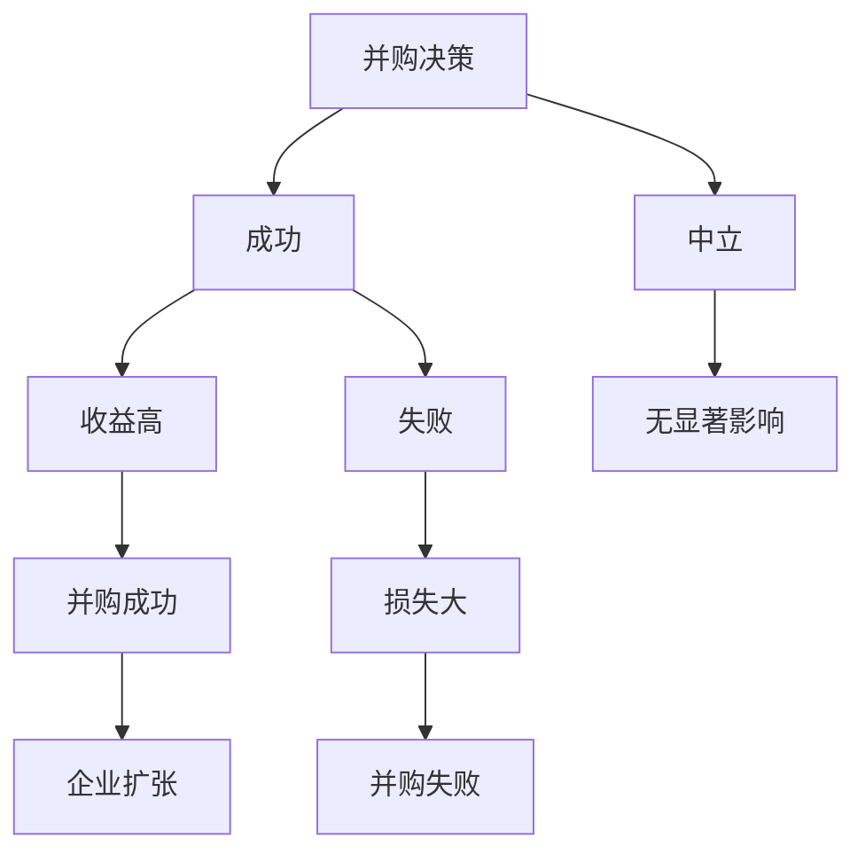

**伪代码：**
```python
def decision_tree(project):
    if project_feasibility > threshold:
        if project_profit > threshold:
            return "Project Approved"
        else:
            return "Project Rejected"
    else:
        return "No Decision"
```

### 案例二：新产品开发决策

某公司计划开发一款新产品，需要评估新产品的市场前景和可行性。通过贝叶斯网络模型，管理者可以分析市场趋势、竞争状况、用户需求等因素，并预测新产品的成功率。

**贝叶斯网络算法应用：**
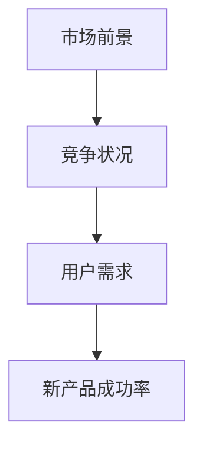

**伪代码：**
```python
class BayesianNetwork:
    def __init__(self):
        self.nodes = ['Market Prospects', 'Competition', 'User Needs', 'Product Success Rate']
        self.edges = [('Market Prospects', 'Competition'), ('Market Prospects', 'User Needs'), ('Competition', 'Product Success Rate'), ('User Needs', 'Product Success Rate')]

    def predict(self, observations):
        # 根据观测值计算条件概率
        # 返回预测结果
        pass
```

### 案例三：应急响应决策

某地区发生自然灾害，需要迅速响应。通过马尔可夫决策过程模型，管理者可以分析不同应急响应策略的效果，如抢险、疏散、救援等，并选择最优策略。

**马尔可夫决策过程算法应用：**
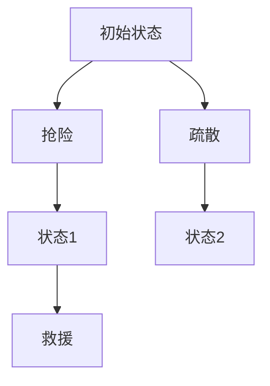

**伪代码：**
```python
def emergency_response_decision(current_state, strategies):
    best_strategy = None
    best_result = None
    for strategy in strategies:
        next_state = transition_probability[current_state][strategy]
        if best_result is None or result superiority:
            best_strategy = strategy
            best_result = result
    return best_strategy
```

## 决策模型的改进与优化

为了提高决策模型的性能，管理者可以采用以下方法：

1. **数据驱动优化**：通过收集和分析历史数据，管理者可以优化决策模型，提高预测准确性。
2. **算法优化**：优化算法结构，提高计算效率和准确性。
3. **模型集成**：将多个决策模型集成，形成复合模型，提高决策的全面性和准确性。

**数据驱动优化：**
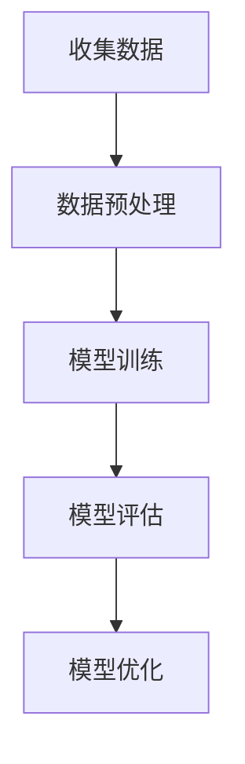

**算法优化：**
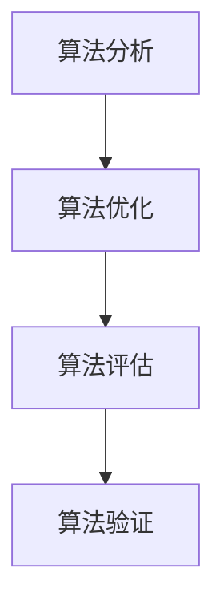

**模型集成：**
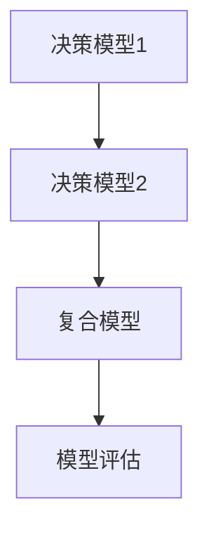

## 结论

本文介绍了技术管理者的决策模型，包括其在复杂环境中进行决策的最佳实践。我们分析了决策模型的基础知识，如决策树、贝叶斯网络和马尔可夫决策过程，并探讨了如何在实际项目中应用这些模型。同时，我们还介绍了复杂环境下的决策策略和决策模型的改进与优化方法。

技术管理者在决策过程中需要综合考虑多个因素，如业务需求、技术发展趋势、数据分析和团队协作等。通过掌握和应用决策模型，技术管理者可以更好地应对复杂环境中的挑战，提高决策的准确性和效率。

未来，随着技术的不断进步，决策模型将不断演进。技术管理者需要不断学习和适应新的模型，以应对更加复杂和动态的业务环境。

## 附录

### 附录A：决策模型工具和资源

- 决策树工具：[https://www.decisiontree.com/]
- 贝叶斯网络工具：[https://www.bayesia.com/]
- 蒙特卡洛模拟工具：[https://www.montecarlomethod.com/]

### 附录B：常见决策模型公式和算法伪代码

- 决策树算法公式和伪代码
- 贝叶斯网络算法公式和伪代码
- 马尔可夫决策过程算法公式和伪代码

### 附录C：案例研究详细资料

- 案例一：企业并购决策详细资料
- 案例二：新产品开发决策详细资料
- 案例三：应急响应决策详细资料

## 作者信息

作者：AI天才研究院/AI Genius Institute & 禅与计算机程序设计艺术 /Zen And The Art of Computer Programming
```

