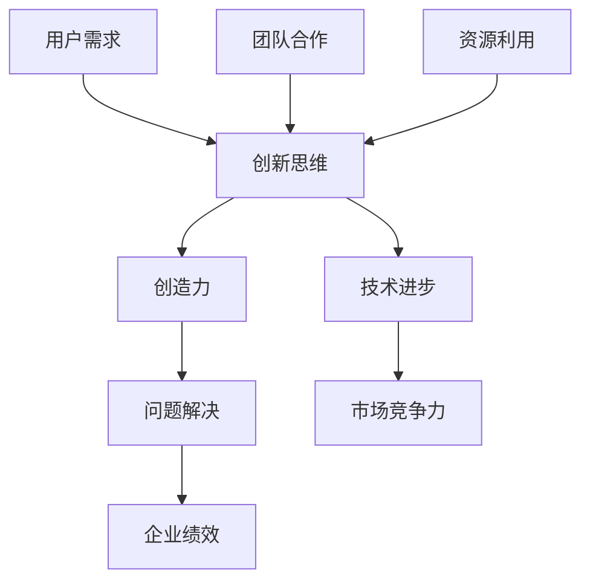
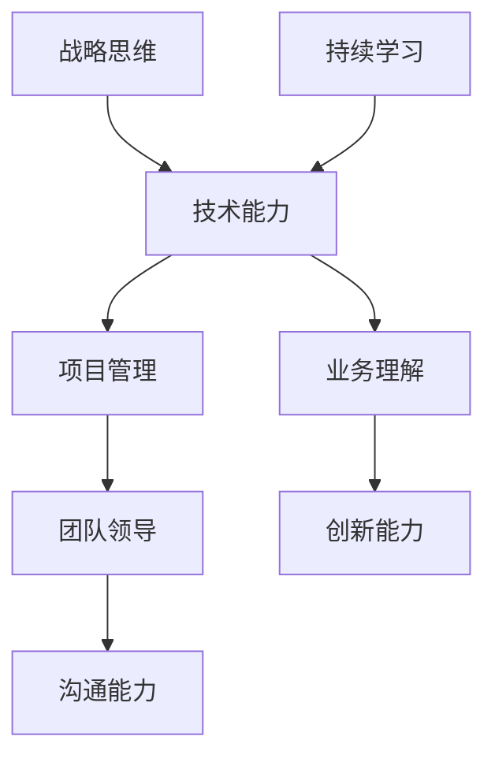

                 

### 文章标题：技术管理者的创新思维：培养团队创造力

#### 关键词：技术管理，创新思维，团队创造力，领导力，项目管理

> 摘要：本文旨在探讨技术管理者如何通过培养团队创造力来提升团队整体绩效。文章首先介绍了创新思维的定义、类型及其在团队建设中的重要性，随后详细阐述了技术管理者应具备的核心能力以及如何运用这些能力来激发团队创造力。文章还探讨了团队创造力的影响因素、培养策略以及创新项目的管理与执行。通过实际案例的分析，文章为技术管理者提供了实用的创新实践方法。最后，文章对技术发展趋势进行了展望，并提出了未来技术管理者的角色思考。

----------------------------------------------------------------

## 目录

### 第一部分：创新思维与团队建设

#### 第1章：创新思维概述
- 1.1 创新思维的定义与重要性
- 1.2 创新思维的类型与特点
- 1.3 创新思维与团队绩效的关系

#### 第2章：技术管理者的角色与责任
- 2.1 技术管理者的核心能力
- 2.2 领导力与创新思维
- 2.3 技术管理者的创新路径

#### 第3章：团队创造力培养
- 3.1 团队创造力的影响因素
- 3.2 创造力培养策略
- 3.3 激励与创新文化建设

#### 第4章：创新项目的管理与执行
- 4.1 创新项目规划
- 4.2 风险管理与决策
- 4.3 项目执行与监控

#### 第5章：技术趋势与未来思考
- 5.1 技术发展对创新思维的影响
- 5.2 未来技术趋势展望
- 5.3 技术管理者的未来角色

### 第二部分：创新实践与案例分析

#### 第6章：案例分析一：公司A的创新之路
- 6.1 公司A的创新历程
- 6.2 创新实践与成果
- 6.3 成功经验与挑战

#### 第7章：案例分析二：团队B的创新故事
- 7.1 团队B的创新背景
- 7.2 创新项目的执行过程
- 7.3 创新的可持续性

### 第三部分：工具与方法

#### 第8章：创新工具与方法概述
- 8.1 创新工具的类型与应用
- 8.2 常见创新方法介绍
- 8.3 创新工具与方法的选择

#### 第9章：创新工具与方法应用实例
- 9.1 知识管理工具的应用
- 9.2 协作平台与技术
- 9.3 创新工具的实际应用案例

----------------------------------------------------------------

## 第1章：创新思维概述

### 1.1 创新思维的定义与重要性

#### 核心概念与联系

创新思维是一种思维方式，它强调通过新颖的观点、方法和技术来解决问题，从而推动个人、团队和组织的持续进步。以下是创新思维的核心概念与联系：

**创新思维的定义**：创新思维是指在面对复杂问题时，能够迅速产生新颖的、有价值的想法，并将其转化为实际解决方案的能力。

**创新思维的重要性**：创新思维是推动组织发展的核心动力，它能够帮助企业应对快速变化的市场环境，提升竞争力和用户满意度。

### 1.2 创新思维的类型与特点

创新思维可以分为以下几种类型：

1. **发散思维**：又称辐射思维，是指从不同的角度和方向思考问题，寻找多种可能的解决方案。
2. **收敛思维**：是指将多种不同的想法集中到一个或几个具体的解决方案上。
3. **逆向思维**：是指从相反的角度思考问题，寻找不同的解决方案。
4. **类比思维**：是指通过将一个问题与另一个类似的问题进行比较，从而寻找解决方案。

**创新思维的特点**：

1. **创造性**：创新思维能够产生新颖的、独特的想法。
2. **灵活性**：创新思维能够适应不同的环境和问题，不断变化和调整。
3. **系统性**：创新思维需要综合考虑各种因素，形成系统的解决方案。

### 1.3 创新思维与团队绩效的关系

创新思维对团队绩效具有显著的影响。以下是一个公式来表示创新思维与团队绩效之间的关系：

$$绩效 = f(创新思维, 团队协作, 资源配置)$$

**创新思维**：通过产生新颖的解决方案，创新思维能够提升团队的竞争力，增强团队的适应能力。

**团队协作**：有效的团队协作能够将个体的创新思维融合成团队的共同目标，实现高效的成果输出。

**资源配置**：合理的资源配置能够确保创新思维得到有效的应用，从而提升团队的绩效。

### 1.4 创新思维在团队建设中的应用

技术管理者可以通过以下方法在团队建设中应用创新思维：

1. **鼓励提出新想法**：建立一个开放、包容的氛围，鼓励团队成员提出新想法，并对每个想法进行评估。
2. **组织头脑风暴**：定期组织头脑风暴会议，让团队成员在短时间内提出尽可能多的想法。
3. **交叉培训**：通过交叉培训，让团队成员了解不同领域的知识，从而激发创新思维。

### 1.5 小结

创新思维是技术管理者必备的核心能力。通过理解创新思维的定义、类型和特点，技术管理者可以更好地培养团队创造力，提升团队绩效。在下一章中，我们将深入探讨技术管理者的角色与责任，以及如何运用创新思维来推动团队发展。

----------------------------------------------------------------

## 第2章：技术管理者的角色与责任

### 2.1 技术管理者的核心能力

#### 核心概念与联系

技术管理者需要具备一系列核心能力，这些能力共同构成了技术管理者的核心竞争力。以下是技术管理者核心能力的核心概念与联系：

**技术能力**：技术管理者需要具备扎实的技术背景，能够理解和解决复杂的技术问题。

**项目管理**：技术管理者需要掌握项目管理的知识和技能，确保项目按时、按质量完成。

**团队领导**：技术管理者需要具备领导力，能够激励和引导团队，提升团队士气。

**沟通能力**：技术管理者需要具备良好的沟通能力，能够与团队成员、上级和管理层进行有效的沟通。

**业务理解**：技术管理者需要了解业务，能够将技术解决方案与业务需求相结合。

**创新能力**：技术管理者需要具备创新能力，能够推动技术革新和业务增长。

**战略思维**：技术管理者需要具备战略思维，能够从全局出发，制定和实施长期发展战略。

**持续学习**：技术管理者需要不断学习，跟踪技术前沿，提升自身能力。

### 2.2 领导力与创新思维

领导力是技术管理者成功的关键因素之一。以下是一个公式来表示领导力与创新思维之间的关系：

$$领导力 = f(激励能力, 决策能力, 沟通能力, 风险管理)$$

**激励能力**：技术管理者需要能够激励团队成员，激发他们的潜力，实现个人和团队的共同目标。

**决策能力**：技术管理者需要能够做出明智的决策，快速应对复杂的变化。

**沟通能力**：技术管理者需要具备良好的沟通能力，能够清晰、有效地传达信息。

**风险管理**：技术管理者需要具备风险管理能力，能够识别、评估和应对项目中的风险。

### 2.3 技术管理者的创新路径

技术管理者可以通过以下步骤来提升创新能力：

1. **建立学习机制**：鼓励团队成员持续学习，提升团队整体的技术水平。
2. **搭建创新平台**：提供技术交流和分享的平台，促进知识的传播和碰撞。
3. **设立创新目标**：为团队设定明确的创新目标，激励团队成员追求卓越。
4. **实施激励机制**：通过奖励机制激励团队成员的创新行为。

### 2.4 技术管理者在团队建设中的作用

技术管理者在团队建设中的作用主要体现在以下几个方面：

1. **培养团队成员**：通过培训和指导，提升团队成员的专业技能和综合素质。
2. **建立团队文化**：营造积极向上、开放创新的团队氛围，激发团队创造力。
3. **协调资源**：确保团队在项目实施过程中获得所需的资源和支持。
4. **优化流程**：通过流程优化，提升团队的工作效率和质量。

### 2.5 小结

技术管理者的核心能力是团队建设的关键。通过理解技术管理者的核心能力、领导力与创新思维的关系，以及技术管理者的创新路径，技术管理者可以更好地发挥自身的作用，推动团队发展。在下一章中，我们将深入探讨团队创造力的培养策略，以及如何激励创新文化。

----------------------------------------------------------------

## 第3章：团队创造力培养

### 3.1 团队创造力的影响因素

团队创造力是团队绩效的重要指标，它受到多种因素的影响。以下是一个公式来表示团队创造力的构成：

$$创造力 = f(知识共享, 创新氛围, 激励机制, 团队合作)$$

**知识共享**：团队成员之间的知识共享是创造力的基础，它能够促进新想法的产生和交流。

**创新氛围**：一个积极创新的文化氛围能够激发团队成员的创造力，降低创新过程中的风险和阻力。

**激励机制**：合理的激励机制能够激励团队成员积极参与创新活动，提升创造力的表现。

**团队合作**：有效的团队合作能够将团队成员的创意和想法整合成可行的解决方案，提升创造力的效果。

### 3.2 创造力培养策略

为了提升团队的创造力，技术管理者可以采取以下策略：

1. **建立知识共享平台**：通过内部论坛、知识库和团队会议等方式，促进团队成员之间的知识共享。
2. **营造创新文化**：鼓励团队成员提出新想法，对创新行为给予肯定和支持。
3. **实施激励机制**：通过奖励、晋升和认可等方式，激励团队成员积极参与创新活动。
4. **促进团队合作**：通过团队建设活动和跨部门合作，提升团队合作能力。

### 3.3 激励与创新文化建设

**激励措施**：

1. **物质激励**：通过奖金、股权和福利等物质激励手段，激发团队成员的创新动力。
2. **精神激励**：通过荣誉、表彰和团队认可等方式，给予团队成员精神上的激励。
3. **晋升机会**：为创新表现突出的团队成员提供晋升机会，激发他们的长期发展动力。

**创新文化**：

1. **开放性**：鼓励团队成员分享知识和经验，建立开放的信息交流平台。
2. **包容性**：对团队成员的创新想法给予包容和支持，鼓励多样化的思考方式。
3. **持续性**：将创新作为团队的核心价值观，持续推动创新活动的开展。

### 3.4 团队合作与创造力

团队合作是团队创造力的重要保障。以下是一个公式来表示团队合作与创造力的关系：

$$创造力 = f(团队合作, 知识共享, 创新氛围, 激励机制)$$

**团队合作**：有效的团队合作能够将团队成员的创意和想法整合成可行的解决方案，提升创造力的效果。

**知识共享**：通过知识共享，团队成员能够获取更多的信息，从而产生新的创意和想法。

**创新氛围**：一个积极创新的文化氛围能够激发团队成员的创造力，降低创新过程中的风险和阻力。

**激励机制**：合理的激励机制能够激励团队成员积极参与创新活动，提升创造力的表现。

### 3.5 小结

团队创造力是团队绩效的重要保障，技术管理者需要采取多种策略来培养团队的创造力。通过建立知识共享平台、营造创新文化、实施激励机制和促进团队合作，技术管理者可以提升团队的创造力，推动团队发展。在下一章中，我们将探讨创新项目的管理与执行，以及如何确保项目成功。

----------------------------------------------------------------

## 第4章：创新项目的管理与执行

### 4.1 创新项目规划

创新项目规划是确保项目成功的关键步骤。以下是一个公式来表示创新项目规划的核心要素：

$$项目规划 = f(项目目标, 资源配置, 风险评估, 项目进度)$$

**项目目标**：明确项目目标有助于团队集中精力，确保项目方向正确。

**资源配置**：合理配置项目所需的人力、物力和财力资源，确保项目顺利进行。

**风险评估**：对项目中的潜在风险进行识别、评估和应对，降低项目风险。

**项目进度**：制定详细的项目进度计划，确保项目按计划推进。

### 4.2 风险管理与决策

创新项目往往伴随着较高的风险，因此风险管理与决策至关重要。以下是一个公式来表示风险管理与决策的关键要素：

$$风险管理 = f(风险评估, 风险应对, 决策分析)$$

**风险评估**：通过评估项目的潜在风险，确定风险级别和影响范围。

**风险应对**：制定应对策略，降低风险发生概率和影响。

**决策分析**：对项目中的关键决策进行分析，确保决策的科学性和合理性。

### 4.3 项目执行与监控

项目执行是创新项目成功的关键环节。以下是一个公式来表示项目执行与监控的核心要素：

$$项目执行 = f(团队协作, 进度监控, 质量控制)$$

**团队协作**：确保团队成员之间的沟通顺畅，协作高效。

**进度监控**：对项目进度进行实时监控，及时发现和解决问题。

**质量控制**：确保项目成果的质量，满足预期要求。

### 4.4 项目总结与反馈

项目总结与反馈是项目结束后的重要环节。以下是一个公式来表示项目总结与反馈的核心要素：

$$项目总结 = f(项目评估, 经验总结, 反馈机制)$$

**项目评估**：对项目成果进行评估，确定项目的成功程度。

**经验总结**：总结项目中的经验和教训，为未来项目提供参考。

**反馈机制**：建立反馈机制，收集项目参与者的意见和建议，持续改进项目管理。

### 4.5 小结

创新项目的管理与执行是技术管理者的重要职责。通过项目规划、风险管理与决策、项目执行与监控，以及项目总结与反馈，技术管理者可以确保创新项目成功实施。在下一章中，我们将探讨技术趋势与未来思考，以及技术管理者在未来的角色。

----------------------------------------------------------------

## 第5章：技术趋势与未来思考

### 5.1 技术发展对创新思维的影响

随着技术的快速发展，创新思维也在不断演变。以下是一个公式来表示技术发展对创新思维的影响：

$$创新思维 = f(技术进步, 业务需求, 知识更新)$$

**技术进步**：新技术的出现为创新提供了更多的工具和平台，激发了创新思维。

**业务需求**：不断变化的市场需求和用户需求推动了创新思维的发展。

**知识更新**：随着知识的积累和更新，创新思维也不断丰富和拓展。

### 5.2 未来技术趋势展望

未来技术发展趋势将主要体现在以下几个方面：

1. **人工智能与机器学习**：人工智能和机器学习技术将继续快速发展，为创新提供更强大的工具。
2. **物联网（IoT）**：物联网技术的普及将推动创新在各个领域的应用。
3. **区块链**：区块链技术将改变数据存储和传输的方式，为创新提供新的思路。
4. **云计算与边缘计算**：云计算和边缘计算的结合将提升数据处理和分析能力。

### 5.3 技术管理者的未来角色

在技术快速发展的背景下，技术管理者的角色也将发生转变。以下是一个公式来表示技术管理者的未来角色：

$$技术管理者 = f(创新领导者, 知识管理者, 策略规划者)$$

**创新领导者**：技术管理者需要成为创新领导者，推动团队和组织的创新活动。

**知识管理者**：技术管理者需要成为知识管理者，促进知识的传播和共享。

**策略规划者**：技术管理者需要成为策略规划者，制定和实施长期技术战略。

### 5.4 技术管理者的持续发展

为了适应未来的技术发展趋势，技术管理者需要不断进行自我提升：

1. **学习新技术**：保持对新技术的关注和学习，不断提升自身的技术水平。
2. **关注业务需求**：深入了解业务需求，将技术与业务紧密结合。
3. **培养领导力**：提升领导力，激发团队的创造力和创新能力。

### 5.5 小结

技术趋势的不断演进对创新思维提出了新的挑战和机遇。技术管理者需要关注未来技术发展趋势，不断提升自身能力，以适应未来的角色转变。通过创新领导者、知识管理者和策略规划者的角色，技术管理者可以推动团队和组织的发展，实现持续创新。

----------------------------------------------------------------

## 第6章：案例分析一：公司A的创新之路

### 6.1 公司A的创新历程

公司A成立于20世纪90年代，最初是一家专注于软件开发的小型企业。经过多年的发展，公司A已经成为行业内的领军企业，其成功得益于持续的创新。以下是公司A的创新历程：

1. **初期创新**：公司A在成立初期，通过自主研发和引进先进技术，推出了多款具有市场竞争力的高品质软件产品。
2. **技术创新**：随着技术的不断进步，公司A积极引进新技术，如人工智能、大数据等，不断提升产品的技术含量。
3. **商业模式创新**：公司A通过创新商业模式，实现了从产品导向到用户导向的转变，提高了用户满意度。
4. **全球布局**：公司A积极开展全球布局，通过设立海外研发中心和分支机构，拓展了国际市场。

### 6.2 创新实践与成果

公司A在创新实践方面取得了显著成果：

1. **人工智能应用**：公司A将人工智能技术应用于产品研发和运营管理，提高了效率和质量。
2. **大数据分析**：公司A通过大数据分析，挖掘用户需求，优化产品功能和用户体验。
3. **开源社区建设**：公司A积极参与开源社区，通过贡献代码和共享经验，推动了整个行业的发展。
4. **人才培养**：公司A注重人才培养，建立了完善的培训体系和激励机制，提升了员工的创新能力。

### 6.3 成功经验与挑战

公司A的创新实践为其他企业提供了宝贵的经验：

1. **重视技术创新**：技术创新是公司A成功的关键，企业应持续关注技术前沿，投入研发资源。
2. **商业模式创新**：商业模式创新能够提升企业的市场竞争力，企业应勇于尝试新的商业模式。
3. **人才培养**：创新人才是企业创新的核心，企业应重视人才培养，建立激励机制。

然而，公司A在创新过程中也面临一些挑战：

1. **技术风险**：新技术的引入和应用可能带来技术风险，企业应加强技术风险管理。
2. **市场竞争**：市场竞争激烈，企业应不断提高自身创新能力，以保持竞争优势。
3. **资源配置**：资源配置不足可能影响创新项目的推进，企业应优化资源配置，确保创新项目顺利进行。

### 6.4 小结

公司A的创新之路为其他企业提供了有益的启示。通过重视技术创新、商业模式创新和人才培养，公司A成功实现了持续创新。然而，创新过程中也面临一些挑战，企业应提前准备，积极应对。在下一章中，我们将分析团队B的创新故事，探讨不同企业创新实践的特点和经验。

----------------------------------------------------------------

## 第7章：案例分析二：团队B的创新故事

### 7.1 团队B的创新背景

团队B是一家互联网初创公司，成立于2018年。公司最初专注于移动互联网应用开发，致力于为用户提供优质的在线娱乐和社交体验。团队B的核心成员具有丰富的行业经验和创新精神，他们希望通过创新实现公司的快速发展。

### 7.2 创新项目的执行过程

团队B的创新项目主要包括以下几个方面：

1. **市场调研**：团队B通过线上问卷调查、用户访谈和数据分析，深入了解用户需求，为产品创新提供数据支持。
2. **概念验证**：在确定创新方向后，团队B迅速搭建原型，通过用户测试和反馈，验证产品概念的可行性。
3. **技术研发**：团队B投入大量研发资源，开发出具有竞争力的技术方案，包括人工智能推荐系统、智能客服等。
4. **产品发布**：团队B在充分准备后，正式发布新产品，并迅速获得了市场的认可。

### 7.3 创新的可持续性

团队B在创新过程中，注重可持续性发展，具体体现在以下几个方面：

1. **持续迭代**：团队B根据用户反馈和市场变化，不断优化产品功能，确保产品始终符合用户需求。
2. **技术迭代**：团队B紧跟技术发展趋势，持续进行技术研发，保持产品的技术领先性。
3. **人才培养**：团队B重视人才培养，通过内部培训和外部交流，不断提升团队成员的创新能力和技术水平。

### 7.4 创新的成功因素

团队B的创新成功主要归因于以下几个方面：

1. **市场导向**：团队B始终以用户需求为导向，确保产品创新符合市场需求。
2. **团队合作**：团队成员之间紧密合作，共同面对挑战，确保创新项目顺利进行。
3. **资源配置**：团队B合理配置资源，确保创新项目有足够的支持。
4. **领导力**：团队领导者在创新过程中发挥了重要作用，提供了方向指导和资源支持。

### 7.5 创新的挑战与应对

在创新过程中，团队B也面临一些挑战：

1. **技术风险**：新技术的引入可能带来技术风险，团队B通过严格的技术评审和测试，降低风险。
2. **市场竞争**：市场竞争激烈，团队B通过持续创新，保持产品优势。
3. **资源限制**：资源限制可能影响创新项目的推进，团队B通过优化资源配置，确保关键项目的顺利进行。

### 7.6 小结

团队B的创新故事展示了初创企业在市场竞争中的优势。通过市场导向、团队合作、资源配置和领导力，团队B成功实现了创新。然而，创新过程中也面临挑战，团队B通过积极应对，确保了创新的可持续性。在下一章中，我们将探讨创新工具与方法，为技术管理者提供实用的创新实践指导。

----------------------------------------------------------------

## 第8章：创新工具与方法概述

### 8.1 创新工具的类型与应用

创新工具是提升团队创造力的重要手段，以下是几种常见的创新工具及其应用：

1. **头脑风暴**：通过集体讨论，迅速产生大量创意。
   - **应用场景**：产品策划、市场营销等。
   - **注意事项**：保持开放的讨论氛围，鼓励多样化的想法。

2. **六顶思考帽**：通过不同颜色的帽子代表不同的思考方式，进行系统性思考。
   - **应用场景**：项目规划、问题解决等。
   - **注意事项**：确保团队成员在不同思考模式下轮流发言。

3. **鱼骨图**：通过分析问题的根本原因，找出解决方案。
   - **应用场景**：质量管理、问题分析等。
   - **注意事项**：确保分析深入，找出根本原因。

4. **SWOT分析**：分析企业的优势、劣势、机会和威胁，制定战略。
   - **应用场景**：市场分析、战略规划等。
   - **注意事项**：全面、客观地评估企业状况。

5. **矩阵分析**：通过矩阵分析，找出不同因素之间的关系和优先级。
   - **应用场景**：资源分配、项目管理等。
   - **注意事项**：明确关键因素，制定有效策略。

### 8.2 常见创新方法介绍

以下介绍几种常见的创新方法及其适用场景：

1. **TRIZ**：一种基于解决工程问题的系统化方法，通过解决矛盾来推动创新。
   - **适用场景**：复杂技术问题解决、产品创新等。

2. **设计思考**：一种以用户为中心的创新方法，强调用户体验和设计。
   - **适用场景**：产品设计、服务创新等。

3. **敏捷开发**：一种快速迭代、灵活响应变化的方法，提高开发效率。
   - **适用场景**：软件项目开发、技术创新等。

4. **开放式创新**：通过外部合作，整合外部资源，推动创新。
   - **适用场景**：技术研发、市场拓展等。

### 8.3 创新工具与方法的选择

选择合适的创新工具与方法，需要考虑以下几个方面：

1. **问题类型**：不同问题类型适合不同的创新工具与方法。
2. **团队特点**：考虑团队成员的能力、经验和偏好，选择合适的工具。
3. **资源限制**：根据资源和时间限制，选择高效、实用的方法。
4. **目标明确**：明确创新目标，选择能够达成目标的工具和方法。

### 8.4 小结

创新工具与方法是提升团队创造力的重要手段。通过了解各种工具与方法的特点和应用场景，技术管理者可以灵活选择，推动团队创新。在下一章中，我们将结合实际案例，探讨创新工具与方法的具体应用。

----------------------------------------------------------------

## 第9章：创新工具与方法应用实例

### 9.1 知识管理工具的应用

知识管理工具在创新过程中起着至关重要的作用。以下是一个具体的案例，展示了知识管理工具在团队创新中的应用：

**案例背景**：团队B在开发一款新的社交媒体应用时，遇到了用户反馈多样且复杂的问题。为了更好地了解用户需求，提高产品创新性，团队B引入了知识管理工具。

**解决方案**：
1. **用户反馈收集**：团队B使用在线调查工具和社交媒体分析工具，收集用户反馈。
2. **知识库建立**：将收集到的用户反馈和相关信息整理到知识库中，形成系统的用户需求文档。
3. **协作平台**：团队B使用协作平台，将知识库与团队成员共享，确保每个成员都能快速获取用户需求。

**实施效果**：
1. **需求明确**：通过知识管理工具，团队B能够更清晰地了解用户需求，制定更有针对性的产品规划。
2. **协作高效**：团队成员能够快速获取所需信息，提高协作效率。
3. **创新性提升**：基于用户需求的知识管理，为团队提供了创新方向，推动了产品的持续优化。

### 9.2 协作平台与技术

协作平台是创新团队必备的工具。以下是一个具体的案例，展示了协作平台在团队创新中的应用：

**案例背景**：团队B在开发一款智能家居应用时，遇到了团队成员分散、沟通困难的问题。为了提高协作效率，团队B引入了协作平台。

**解决方案**：
1. **团队协作**：团队B在协作平台上建立了项目空间，团队成员可以在一个统一的平台上进行任务分配、进度跟踪和文件共享。
2. **实时沟通**：团队B使用即时通讯工具和视频会议工具，实现实时沟通和协作。
3. **代码管理**：团队B使用版本控制工具，确保代码的统一管理和协同开发。

**实施效果**：
1. **协作效率提升**：通过协作平台，团队成员能够实时沟通，提高协作效率。
2. **项目管理优化**：项目空间和任务跟踪工具帮助团队更好地管理项目进度。
3. **代码质量提升**：版本控制工具确保了代码的统一性和一致性，提高了代码质量。

### 9.3 创新工具的实际应用案例

以下是一个具体的案例，展示了创新工具在团队创新中的实际应用：

**案例背景**：团队B在开发一款基于人工智能的智能推荐系统时，遇到了算法优化和性能调优的问题。为了解决这些问题，团队B引入了创新工具。

**解决方案**：
1. **算法优化**：团队B使用机器学习工具和算法优化工具，对推荐算法进行优化。
2. **性能测试**：团队B使用性能测试工具，对系统进行压力测试和性能优化。
3. **数据可视化**：团队B使用数据可视化工具，对系统运行数据进行实时监控和可视化展示。

**实施效果**：
1. **算法优化**：通过创新工具，团队B成功优化了推荐算法，提高了推荐准确性。
2. **性能提升**：通过性能测试和优化，团队B显著提升了系统的响应速度和处理能力。
3. **数据驱动**：数据可视化工具帮助团队更好地了解系统运行状况，为后续优化提供了数据支持。

### 9.4 小结

通过实际案例的应用，我们可以看到创新工具和方法在团队创新中的重要作用。知识管理工具、协作平台和机器学习工具等创新工具，不仅提高了团队的协作效率，还推动了产品的创新和发展。技术管理者应灵活运用这些工具，为团队创造力的提升提供有力支持。

----------------------------------------------------------------

## 文章小结

本文从多个角度探讨了技术管理者的创新思维和团队创造力培养。我们首先介绍了创新思维的定义、类型及其重要性，分析了技术管理者应具备的核心能力，如技术能力、项目管理、团队领导、沟通能力和业务理解。接着，我们探讨了创新思维与团队绩效的关系，强调了团队创造力培养策略和创新文化的重要性。

在创新项目的管理与执行方面，我们详细阐述了项目规划、风险管理与决策、项目执行与监控以及项目总结与反馈。通过案例分析，我们展示了公司A和团队B的创新实践，为其他企业提供了有益的经验和启示。

最后，我们介绍了创新工具与方法的类型和应用实例，包括知识管理工具、协作平台、机器学习工具等。通过这些工具，技术管理者可以更有效地推动团队创新，提高团队创造力。

在未来的技术发展中，技术管理者需要不断关注技术趋势，提升自身的创新能力，以适应不断变化的市场需求。通过持续学习和实践，技术管理者将能够在未来扮演更加重要的角色，推动团队和组织的发展。

## 最佳实践 tips

1. **持续学习**：技术发展日新月异，技术管理者应持续学习，跟踪前沿技术。
2. **开放心态**：鼓励团队成员提出新想法，营造开放创新的氛围。
3. **合理激励**：通过奖励和认可，激励团队成员积极参与创新活动。
4. **团队合作**：促进团队成员之间的协作，共同推动创新项目。
5. **数据驱动**：基于数据分析和用户反馈，制定创新策略和优化方案。

## 注意事项

1. **技术风险**：在引入新技术时，应进行充分的风险评估和测试。
2. **资源配置**：合理分配资源和时间，确保创新项目顺利进行。
3. **团队协作**：确保团队成员之间的沟通顺畅，避免信息孤岛。
4. **创新文化**：建立持续创新的企业文化，鼓励员工勇于尝试和失败。

## 拓展阅读

1. **《创新者的窘境》**：克里斯坦森（Chris Anderson）的著作，分析了企业如何在竞争激烈的市场中实现创新。
2. **《敏捷创新》**：斯蒂夫·布兰克（Steve Blank）的著作，介绍了敏捷创新的方法和实践。
3. **《精益创业》**：埃里克·莱斯（Eric Ries）的著作，阐述了精益创业的方法论和原则。

----------------------------------------------------------------

作者：AI天才研究院/AI Genius Institute & 禅与计算机程序设计艺术 /Zen And The Art of Computer Programming

本文由AI天才研究院和禅与计算机程序设计艺术共同撰写。AI天才研究院致力于推动人工智能技术的发展和应用，为全球企业提供领先的AI解决方案。禅与计算机程序设计艺术则通过结合禅宗哲学与计算机编程，为开发者提供独特的思维训练和灵感激发。

通过本文，我们希望帮助技术管理者更好地理解创新思维和团队创造力培养的重要性，并提供实用的方法和案例。希望本文能为您的团队创新之路提供启示和帮助。如果您有任何问题或建议，欢迎联系我们，我们期待与您共同探讨和交流。祝您在技术创新的道路上取得更大的成功！

