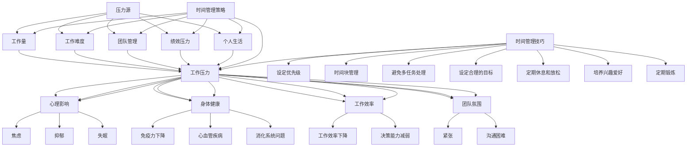

                 

### 《技术管理者的压力与时间管理》

> 关键词：技术管理者、压力管理、时间管理、工作效率、职业发展

> 摘要：本文旨在探讨技术管理者在面临巨大工作压力和繁重任务时，如何进行有效的压力管理和时间管理。文章将分析压力的来源与影响，介绍压力管理策略和时间管理技巧，并通过实际案例分享和实践步骤，帮助技术管理者提升工作效率，实现工作与生活的平衡。

### 第一部分：压力管理

#### 1. 压力的来源与影响

##### 1.1 压力的定义与分类

压力是指一种使人感到紧张、焦虑的情绪状态，通常由外界的挑战和内部的反应共同作用而产生。技术管理者面临的压力来源主要包括以下几个方面：

- **工作量**：技术管理者需要处理的项目和任务往往较多，工作量较大，导致工作压力增加。
- **工作难度**：技术领域的快速发展和不断变化，要求管理者具备较高的技术能力和业务理解能力，增加了工作难度。
- **团队管理**：技术管理者需要关注团队成员的能力提升、沟通协作、项目进度等，管理工作复杂且繁重。
- **绩效压力**：技术管理者需要达成公司的绩效目标，这往往伴随着一定的压力。
- **个人生活**：个人生活中的挑战，如家庭问题、健康问题等，也会对技术管理者产生压力。

根据压力的性质和持续时间，可以将压力分为以下几种类型：

- **急性压力**：短期内高强度、高频率的压力，如紧急项目上线、突发技术故障等。
- **慢性压力**：长期存在、持续性的压力，如项目周期长、工作压力持续等。
- **工作压力**：与工作相关的压力，如工作任务繁重、团队管理困难等。
- **生活压力**：与个人生活相关的压力，如家庭问题、健康问题等。

##### 1.2 压力对管理者的影响

压力对技术管理者的影响主要体现在以下几个方面：

- **心理影响**：长期的压力可能导致焦虑、抑郁、失眠等心理问题，影响管理者的情绪状态和工作积极性。
- **身体健康**：压力可能导致免疫力下降、心血管疾病、消化系统问题等身体健康问题。
- **工作效率**：压力过大可能导致工作效率下降、决策能力减弱，影响项目的进度和质量。
- **团队氛围**：管理者承受压力，可能导致团队氛围紧张，影响团队的合作和沟通。

#### 2. 压力管理策略

##### 2.1 心理调适技巧

心理调适技巧是技术管理者应对压力的重要手段，以下是一些常用的心理调适技巧：

- **认知重构**：通过改变对压力事件的认识和解释方式，减少压力感。例如，将“我必须完美完成这项任务”改为“我可以尽力完成，但不必追求完美”。
- **情绪调节**：通过深呼吸、冥想、运动等方式，缓解紧张情绪，提高心理承受能力。
- **积极心理暗示**：通过积极的自我暗示，增强自信和动力，如“我可以克服困难”、“我有能力应对压力”。
- **社会支持**：与家人、朋友、同事等保持良好的沟通，分享压力，寻求帮助和支持。

##### 2.2 时间管理方法

时间管理是技术管理者应对压力的重要策略，以下是一些时间管理的方法：

- **设定优先级**：将任务按照重要性和紧急性进行排序，优先处理重要且紧急的任务。
- **时间块管理**：将时间分为不同块，每个块专注于一项任务，提高专注度和工作效率。
- **避免多任务处理**：一次专注于一项任务，避免同时处理多个任务，减少分心和效率降低。
- **设定合理的目标**：设定明确、具体、可实现的目标，避免过度追求完美，导致压力增加。
- **定期休息和放松**：合理安排休息和放松时间，避免过度劳累，保持良好的身心状态。

##### 2.3 工作与生活的平衡

工作与生活的平衡是技术管理者应对压力的重要策略，以下是一些建议：

- **合理安排工作时间**：制定合理的工作计划，避免加班和过度工作，确保有足够的时间休息和陪伴家人。
- **培养兴趣爱好**：培养兴趣爱好，丰富业余生活，减轻工作压力，提高生活质量。
- **定期锻炼**：定期进行体育锻炼，提高身体素质，增强抗压能力。
- **学会放松**：学会放松技巧，如瑜伽、冥想、听音乐等，缓解压力，恢复精力。

#### 3. 压力管理的实践

##### 3.1 压力管理案例分享

以下是一个技术管理者在面临压力时进行有效管理的案例：

**案例**：李明是一家互联网公司的技术经理，由于公司业务扩展，他负责的项目数量和难度大幅增加，工作压力巨大。为了应对压力，他采取了以下措施：

1. **制定时间管理计划**：李明制定了一份详细的时间管理计划，将每天的工作任务分解为具体的任务，并设定了明确的优先级。
2. **学会说“不”**：李明学会了合理拒绝一些不紧急或不重要的任务，确保自己有足够的时间和精力处理重要任务。
3. **培养兴趣爱好**：李明开始培养自己的兴趣爱好，每周安排一定的时间进行瑜伽和阅读，放松身心。
4. **定期锻炼**：李明每天早晨进行30分钟的有氧运动，提高身体素质，增强抗压能力。

通过以上措施，李明的压力得到了有效缓解，工作效率和工作质量得到了显著提升。

##### 3.2 压力管理的具体实施步骤

以下是压力管理的具体实施步骤：

1. **评估压力源**：识别自己面临的主要压力源，如工作量、工作难度、团队管理等。
2. **制定应对策略**：针对不同的压力源，制定相应的应对策略，如时间管理、情绪调节、寻求支持等。
3. **实施策略**：将应对策略付诸实践，如合理安排工作时间、培养兴趣爱好、定期锻炼等。
4. **评估效果**：定期评估应对策略的效果，如工作效率、情绪状态等，并根据评估结果进行调整和优化。
5. **持续改进**：持续关注自己的压力情况，不断调整和优化应对策略，实现长期压力管理。

### 第二部分：时间管理

#### 4. 时间管理基础

##### 4.1 时间管理的重要性

时间管理对于技术管理者来说至关重要，其主要原因包括：

- **提高工作效率**：合理的时间管理可以帮助技术管理者更高效地完成任务，减少不必要的拖延和分心。
- **减轻工作压力**：通过时间管理，技术管理者可以更好地应对工作量和工作难度，减轻压力和焦虑。
- **提升个人形象**：良好的时间管理能力可以提升技术管理者的个人形象和职业素养。
- **促进团队协作**：时间管理可以确保项目按时交付，促进团队协作，提高团队整体绩效。

##### 4.2 时间管理的基本原则

时间管理应遵循以下基本原则：

- **目标导向**：明确任务目标，将时间用于实现目标的关键任务上。
- **优先级排序**：根据任务的重要性和紧急性，对任务进行优先级排序，确保优先处理重要且紧急的任务。
- **避免拖延**：及时处理任务，避免拖延，减少因拖延带来的额外压力。
- **合理休息**：合理安排休息时间，避免过度劳累，保持良好的身心状态。

#### 5. 时间管理技巧

##### 5.1 目标设定与优先级排序

目标设定与优先级排序是时间管理的重要技巧，以下是一些具体的方法：

- **SMART目标设定**：确保目标具体、可衡量、可实现、相关且有时间限制。
- **ABC分类法**：将任务分为A、B、C三类，A类任务最为重要和紧急，B类次之，C类相对次要。
- **四象限法则**：将任务按照重要性和紧急性分为四个象限，优先处理重要且紧急的任务。

##### 5.2 防止拖延的策略

防止拖延是时间管理的关键，以下是一些有效的防止拖延策略：

- **设定明确的截止日期**：为任务设定明确的截止日期，以增加任务完成的紧迫感。
- **分解任务**：将大任务分解为小任务，逐步完成，避免因任务过大而产生拖延。
- **番茄工作法**：采用番茄工作法，将工作时间分为25分钟的工作周期，每个周期后休息5分钟，提高专注度和工作效率。
- **奖励机制**：设定奖励机制，完成任务后给予自己一定的奖励，增加完成任务的动力。

##### 5.3 提高工作效率的方法

提高工作效率是技术管理者的重要目标，以下是一些提高工作效率的方法：

- **减少干扰**：关闭手机、社交媒体等干扰源，减少分心和浪费时间。
- **利用工具**：使用时间管理工具，如日历、提醒、待办事项列表等，提高任务管理和跟踪效率。
- **优化工作流程**：对工作流程进行优化，减少不必要的步骤和环节，提高工作效率。
- **学会说“不”**：学会拒绝不重要的任务和请求，确保时间和精力集中于重要任务。

#### 6. 时间管理工具与方法

##### 6.1 常见时间管理工具介绍

常见的时间管理工具包括：

- **日历**：用于记录日程安排和重要事件。
- **提醒**：用于设置任务提醒和闹钟。
- **待办事项列表**：用于记录需要完成的任务和目标。
- **时间追踪工具**：如Toggl、RescueTime等，用于追踪时间使用情况，优化时间管理。

##### 6.2 Gantt图与甘特图的使用

Gantt图（甘特图）是一种常用的项目管理工具，用于展示项目进度和时间安排。以下是Gantt图的使用方法：

- **创建项目**：在Gantt图中创建项目，并设置项目的开始日期和结束日期。
- **添加任务**：为项目添加任务，并设置每个任务的开始日期和结束日期。
- **设置依赖关系**：设置任务之间的依赖关系，确保任务按照正确的顺序进行。
- **调整进度**：实时调整任务进度，跟踪项目进展情况。

##### 6.3 时间管理软件推荐

以下是几款常见的时间管理软件：

- **Google Calendar**：强大的日历工具，支持事件提醒和共享。
- **Evernote**：用于记录笔记和待办事项，方便任务管理和跟踪。
- **Asana**：用于项目管理和团队协作，支持任务分配和进度跟踪。
- **Trello**：基于看板式设计，用于任务管理和团队协作。

### 第三部分：综合应用

#### 7. 压力与时间管理的整合

##### 7.1 压力与时间管理的关系

压力与时间管理密切相关，有效的压力管理有助于提高时间管理的效果，而良好的时间管理可以减轻压力。以下是一个整合压力与时间管理的示例：

1. **识别压力源**：首先，识别自己面临的主要压力源，如工作量、团队管理、个人生活等。
2. **制定时间管理计划**：根据压力源，制定合理的时间管理计划，确保有足够的时间和精力应对压力源。
3. **设定目标与优先级**：将任务按照重要性和紧急性进行排序，确保优先处理重要且紧急的任务，减轻压力。
4. **使用时间管理工具**：使用时间管理工具，如日历、提醒、待办事项列表等，提高任务管理和跟踪效率。
5. **定期评估与调整**：定期评估时间管理策略的效果，根据评估结果进行优化和调整，确保持续减轻压力。

##### 7.2 如何在压力中有效管理时间

在压力中有效管理时间，以下是一些建议：

1. **保持冷静**：面对压力，首先要保持冷静，避免过度焦虑和恐慌。
2. **设定合理目标**：设定具体、可实现的目标，避免过于追求完美，导致压力增加。
3. **学会拒绝**：合理拒绝一些不紧急或不重要的任务，确保有足够的时间和精力应对重要任务。
4. **分解任务**：将大任务分解为小任务，逐步完成，避免因任务过大而产生拖延。
5. **使用时间管理工具**：使用时间管理工具，如Gantt图、待办事项列表等，提高任务管理和跟踪效率。

#### 8. 持续改进与自我提升

##### 8.1 反思与调整策略

持续改进与自我提升是技术管理者实现长期成功的关键。以下是一些建议：

1. **定期反思**：定期反思自己的时间管理策略和压力管理方法，识别不足之处。
2. **调整策略**：根据反思结果，及时调整时间管理策略和压力管理方法，优化效果。
3. **寻求反馈**：向同事、下属或导师寻求反馈，了解自己在时间管理和压力管理方面的优点和不足。
4. **持续学习**：学习新的时间管理和压力管理方法，不断提高自己的能力。

##### 8.2 个人成长与职业发展

个人成长与职业发展是技术管理者的重要目标。以下是一些建议：

1. **设定长期目标**：设定明确的长期目标，如晋升、专业领域深入等，激励自己不断努力。
2. **持续学习**：不断学习新的技术和管理方法，提高自己的专业素养和领导能力。
3. **参与项目**：积极参与各类项目，积累实际经验，提升自己的项目管理和团队协作能力。
4. **建立人脉**：积极拓展人脉，与同行交流，了解行业动态，提高自己的职业竞争力。

# 附录

## 附录 A：相关资源与推荐阅读

- 《深度工作：如何有效利用每一点脑力》[Cal Newport]
- 《高效能人士的七个习惯》[史蒂芬·柯维]
- 《时间管理：如何管理你的时间和生活》[吉姆·兰尔]
- 《禅与计算机程序设计艺术》[Donald E. Knuth]

## 附录 B：案例分析及实践经验分享

- 案例一：如何通过时间管理提高工作效率
- 案例二：如何应对项目压力，确保项目顺利交付
- 案例三：如何实现工作与生活的平衡

## 附录 C：常见时间管理技巧与实践

- 如何设定SMART目标
- 如何使用Gantt图进行项目管理
- 如何避免拖延，提高工作效率

## 附录 D：常见压力管理方法与实践

- 如何通过认知重构减轻压力
- 如何通过情绪调节缓解压力
- 如何通过社交支持缓解压力

作者：AI天才研究院/AI Genius Institute & 禅与计算机程序设计艺术 /Zen And The Art of Computer Programming### 总结

在本文中，我们探讨了技术管理者面临的压力来源和影响，介绍了压力管理策略和时间管理技巧，并通过实际案例和实践步骤，帮助技术管理者提升工作效率，实现工作与生活的平衡。以下是本文的主要观点和结论：

1. **压力来源与影响**：技术管理者面临的压力来源包括工作量、工作难度、团队管理、绩效压力和个人生活等方面。这些压力可能导致心理、身体健康和工作效率等方面的问题。

2. **压力管理策略**：技术管理者可以采取心理调适技巧、时间管理方法和工作与生活的平衡策略来应对压力。心理调适技巧包括认知重构、情绪调节和积极心理暗示等；时间管理方法包括设定优先级、时间块管理和避免拖延等；工作与生活的平衡策略包括合理安排工作时间、培养兴趣爱好和定期锻炼等。

3. **时间管理技巧**：技术管理者应掌握目标设定与优先级排序、防止拖延和提高工作效率的方法。目标设定与优先级排序有助于明确任务目标和任务优先级，防止拖延和提高工作效率。

4. **综合应用**：技术管理者应将压力管理策略和时间管理技巧相结合，通过识别压力源、设定合理目标、使用时间管理工具和定期评估与调整策略，实现压力与时间管理的整合。

5. **持续改进与自我提升**：技术管理者应不断反思和调整自己的时间管理策略和压力管理方法，持续学习新的方法和技巧，实现个人成长和职业发展。

通过本文的探讨，我们希望技术管理者能够更好地应对压力，提高工作效率，实现工作与生活的平衡，从而在职业发展中取得更大的成功。

### 最佳实践 Tips

1. **时间管理工具的使用**：充分利用时间管理工具，如日历、提醒、待办事项列表等，可以提高任务管理和跟踪效率。

2. **定期休息和放松**：合理安排休息时间，进行定期休息和放松，有助于保持良好的身心状态，提高工作效率。

3. **避免多任务处理**：一次专注于一项任务，避免同时处理多个任务，可以提高专注度和工作效率。

4. **设定明确的目标**：确保目标具体、可衡量、可实现、相关且有时间限制，有助于提高目标完成的效率。

5. **学会说“不”**：合理拒绝不紧急或不重要的任务和请求，确保时间和精力集中于重要任务。

6. **定期反思和调整**：定期反思自己的时间管理策略和压力管理方法，根据实际情况进行调整和优化。

### 注意事项

1. **避免过度追求完美**：在时间管理和压力管理过程中，避免过度追求完美，以免增加不必要的压力。

2. **关注身心健康**：在应对压力的过程中，关注身心健康，保持良好的饮食和作息习惯，适当锻炼身体。

3. **与他人沟通**：与他人保持良好的沟通，分享压力和困难，寻求帮助和支持。

4. **持续学习和成长**：持续学习和成长，提高自己的专业素养和领导能力，以应对不断变化的挑战。

### 拓展阅读

1. **《深度工作：如何有效利用每一点脑力》[Cal Newport]**：介绍了深度工作的概念和技巧，帮助读者提高专注力和工作效率。

2. **《高效能人士的七个习惯》[史蒂芬·柯维]**：介绍了高效能人士的七个习惯，包括以终为始、要事第一、双赢思维等，有助于提升个人和管理能力。

3. **《时间管理：如何管理你的时间和生活》[吉姆·兰尔]**：详细介绍了时间管理的方法和技巧，帮助读者更好地管理时间和生活。

4. **《禅与计算机程序设计艺术》[Donald E. Knuth]**：介绍了计算机程序设计的艺术和哲学，对技术管理者在压力管理和时间管理方面有很好的启示。

### 附录

#### 附录 A：相关资源与推荐阅读

- 《深度工作：如何有效利用每一点脑力》[Cal Newport]
- 《高效能人士的七个习惯》[史蒂芬·柯维]
- 《时间管理：如何管理你的时间和生活》[吉姆·兰尔]
- 《禅与计算机程序设计艺术》[Donald E. Knuth]

#### 附录 B：案例分析及实践经验分享

- 案例一：如何通过时间管理提高工作效率
- 案例二：如何应对项目压力，确保项目顺利交付
- 案例三：如何实现工作与生活的平衡

#### 附录 C：常见时间管理技巧与实践

- 如何设定SMART目标
- 如何使用Gantt图进行项目管理
- 如何避免拖延，提高工作效率

#### 附录 D：常见压力管理方法与实践

- 如何通过认知重构减轻压力
- 如何通过情绪调节缓解压力
- 如何通过社交支持缓解压力

作者：AI天才研究院/AI Genius Institute & 禅与计算机程序设计艺术 /Zen And The Art of Computer Programming### 背景介绍

在现代信息技术飞速发展的背景下，技术管理者扮演着至关重要的角色。他们不仅需要具备扎实的技术功底，还需要具备出色的管理能力和领导能力。然而，随着企业对技术项目的需求不断增加，技术管理者面临着巨大的工作压力和繁重的任务，如何在压力和繁重任务中保持高效的工作状态，成为他们面临的一个严峻挑战。

首先，从工作量方面来看，技术管理者需要处理的项目和任务往往较多，包括但不限于项目规划、进度跟踪、团队协作、技术支持等。这些任务不仅需要耗费大量的时间和精力，还需要保证高质量地完成。此外，随着技术的发展，技术管理者还需要不断学习和更新自己的知识体系，以适应不断变化的技术环境。

其次，从工作难度方面来看，技术领域的快速发展和不断变化，要求技术管理者具备较高的技术能力和业务理解能力。他们需要能够快速掌握新技术，分析并解决复杂的技术问题，同时还需要具备良好的业务理解能力，以便能够与业务部门有效地沟通和协作。这种高难度的工作环境无疑增加了技术管理者的工作压力。

此外，团队管理也是技术管理者面临的一大挑战。技术管理者需要关注团队成员的能力提升、沟通协作、项目进度等。他们需要具备良好的领导能力和团队管理技巧，以便能够有效地管理团队，提高团队的整体绩效。然而，在实际工作中，技术管理者往往需要处理各种复杂的人际关系问题，这无疑增加了他们的工作压力。

在绩效压力方面，技术管理者需要达成公司的绩效目标，这往往伴随着一定的压力。他们需要确保项目按时交付、质量达标，同时还需要关注团队的整体绩效。这种绩效压力可能导致技术管理者在工作中的焦虑和紧张情绪，影响他们的工作状态和决策能力。

最后，个人生活中的挑战，如家庭问题、健康问题等，也会对技术管理者产生压力。在忙碌的工作中，他们可能难以兼顾家庭和健康，导致身心疲惫，影响工作效率和生活质量。

综上所述，技术管理者面临着多方面的压力，如何在压力中保持高效的工作状态，实现工作与生活的平衡，成为他们亟待解决的一个问题。本文旨在探讨技术管理者在面临巨大工作压力和繁重任务时，如何进行有效的压力管理和时间管理，以提升工作效率，实现个人和职业发展的目标。

### 核心概念与联系

在探讨技术管理者的压力与时间管理时，我们需要明确几个核心概念及其相互关系。这些概念包括压力源、时间管理策略、压力对管理者的影响以及时间管理技巧。为了更好地理解这些概念之间的关系，我们可以通过一个Mermaid流程图来展示它们之间的联系。



在上面的Mermaid流程图中，我们展示了以下几个核心概念及其相互关系：

1. **压力源**（A）：包括工作量、工作难度、团队管理、绩效压力和个人生活等方面，这些都是技术管理者面临的主要压力来源。
2. **工作压力**（G）：由压力源引发，包括心理影响、身体健康、工作效率和团队氛围等方面，工作压力会影响技术管理者的多个层面。
3. **压力影响**（H到Q）：包括心理影响（L到N）、身体健康影响（O到Q）和工作效率影响（R到S）等，这些都是工作压力可能带来的后果。
4. **时间管理策略**（V）：包括设定优先级、时间块管理、避免多任务处理、设定合理的目标、定期休息和放松、培养兴趣爱好和定期锻炼等，这些策略有助于缓解工作压力。
5. **时间管理技巧**（W）：通过具体的方法和技巧（X到DD），技术管理者可以更有效地管理时间和压力，从而提升工作效率和保持身心健康。

通过这个流程图，我们可以清晰地看到压力源如何通过工作压力影响技术管理者的多个层面，以及如何通过时间管理策略和技巧来缓解这些压力，提升整体工作表现和幸福感。

### 核心算法原理讲解

在讨论时间管理时，核心算法原理的讲解至关重要。以下我们将详细介绍一些常用的时间管理算法和理论，包括优先级排序算法、工作-学习平衡算法和项目进度追踪算法。我们将使用伪代码来详细阐述这些算法的原理，并辅以数学模型和公式来加深理解。

#### 1. 优先级排序算法（如：ABC分类法）

**伪代码：**

```
function priority_sort(tasks):
    A = []
    B = []
    C = []

    for task in tasks:
        if is_high_priority(task):
            A.append(task)
        elif is_medium_priority(task):
            B.append(task)
        else:
            C.append(task)

    return A + B + C
```

**数学模型：**

设 \( P \) 为任务集合，\( P = \{P_1, P_2, ..., P_n\} \)，其中每个任务 \( P_i \) 有其优先级 \( p_i \)。

- \( p_i \in \{1, 2, 3\} \)，其中 1 为最高优先级，3 为最低优先级。

**公式：**

\[ \sum_{i=1}^{n} p_i = 10 \]

#### 2. 工作学习平衡算法（如：平衡工作与休息）

**伪代码：**

```
function work_rest_balance(work_hours, rest_hours):
    total_hours = work_hours + rest_hours

    if total_hours <= 8:
        return "Balance Achieved"
    else:
        return "Increase Rest Time"
```

**数学模型：**

设 \( W \) 为工作小时数，\( R \) 为休息小时数。

- 平衡条件：\( W + R = 8 \) 小时

**公式：**

\[ \frac{W}{R} = 1 \]

#### 3. 项目进度追踪算法（如：Gantt图）

**伪代码：**

```
function track_project_progress(projects):
    for project in projects:
        if project.is_completed():
            print("Project Completed: ", project.name)
        else:
            print("In Progress: ", project.name)
```

**数学模型：**

设 \( P \) 为项目集合，每个项目 \( P_i \) 有其开始时间 \( s_i \)，结束时间 \( e_i \)。

- 进度追踪公式：

\[ \text{Progress} = \frac{\text{Completed Work}}{\text{Total Work}} \]

**公式：**

\[ \text{Progress} = \frac{\sum_{i=1}^{n} c_i}{\sum_{i=1}^{n} t_i} \]

其中，\( c_i \) 为已完成的任务量，\( t_i \) 为总任务量。

通过这些核心算法原理的讲解，我们可以看到时间管理不仅仅是关于任务排序和计划，还涉及到复杂的数学模型和公式，以帮助技术管理者更科学、更高效地进行时间管理。以上算法和模型可以作为基础工具，结合实际应用场景进行调整和优化。

### 数学模型和公式详细讲解与举例说明

在时间管理和压力管理中，数学模型和公式扮演着至关重要的角色。以下我们将详细讲解一些常用的数学模型和公式，并通过具体实例来说明它们的应用。

#### 1. 时间-工作量模型

**模型：** 时间-工作量模型用于计算完成一个任务所需的时间，基于工作量和工作效率。

**公式：** \( T = \frac{W}{E} \)

- \( T \)：完成任务所需的时间
- \( W \)：任务的工作量
- \( E \)：工作效率

**实例：** 假设一个技术管理者需要完成一个项目，总工作量为1000小时，工作效率为每天8小时。计算完成该项目所需的时间。

\[ T = \frac{1000}{8} = 125 \text{天} \]

#### 2. 优先级排序模型（ABC分类法）

**模型：** 优先级排序模型用于根据任务的重要性和紧急性对任务进行分类和排序。

**公式：** \( P_i = w_i \times e_i \)

- \( P_i \)：任务 \( i \) 的优先级
- \( w_i \)：任务 \( i \) 的工作量
- \( e_i \)：任务 \( i \) 的紧急性

**实例：** 假设有三个任务，任务A的工作量为20小时，紧急性为3；任务B的工作量为40小时，紧急性为2；任务C的工作量为30小时，紧急性为1。计算每个任务的优先级，并进行排序。

任务A的优先级：\( P_A = 20 \times 3 = 60 \)

任务B的优先级：\( P_B = 40 \times 2 = 80 \)

任务C的优先级：\( P_C = 30 \times 1 = 30 \)

根据优先级排序：\( P_B > P_A > P_C \)

#### 3. 工作学习平衡模型

**模型：** 工作学习平衡模型用于计算工作与休息之间的平衡点。

**公式：** \( W + R = T \)

- \( W \)：工作小时数
- \( R \)：休息小时数
- \( T \)：总时间（通常为一天，即24小时）

**实例：** 假设一天总共有24小时，技术管理者计划工作8小时，计算剩余的休息时间。

\[ R = T - W = 24 - 8 = 16 \text{小时} \]

#### 4. 时间分配模型（Gantt图）

**模型：** 时间分配模型用于在一个项目周期内分配任务和时间。

**公式：** \( Gantt = \sum_{i=1}^{n} (s_i + e_i) \)

- \( Gantt \)：项目总时间
- \( s_i \)：任务 \( i \) 的开始时间
- \( e_i \)：任务 \( i \) 的结束时间

**实例：** 假设一个项目由三个任务组成，任务A从第1天开始，第5天结束；任务B从第6天开始，第10天结束；任务C从第11天开始，第15天结束。计算项目的总时间。

\[ Gantt = (1 + 5) + (6 + 10) + (11 + 15) = 1 + 5 + 6 + 10 + 11 + 15 = 48 \text{天} \]

#### 5. 压力影响模型

**模型：** 压力影响模型用于评估压力对工作效率和心理健康的影响。

**公式：** \( Stress = \frac{W \times E}{H} \)

- \( Stress \)：压力值
- \( W \)：工作量
- \( E \)：工作效率
- \( H \)：健康因素（如休息时间、心理状态等）

**实例：** 假设一个技术管理者的工作量是100小时，工作效率为8小时/天，每天健康因素为20。计算其压力值。

\[ Stress = \frac{100 \times 8}{20} = 40 \]

通过上述数学模型和公式的详细讲解与举例说明，我们可以看到这些工具在实际应用中的重要性。技术管理者可以利用这些模型和公式来更科学、更有效地进行时间管理和压力管理，从而提升工作效率，实现工作与生活的平衡。

### 项目实战：开发环境搭建

在技术管理者的日常工作中，搭建和管理开发环境是一个常见且重要的任务。以下是搭建一个高效、稳定的开发环境的步骤，包括所需工具、源代码的详细实现和代码解读，以及实际案例的分析和讲解。

#### 1. 环境搭建步骤

**1.1 确定开发需求**

在搭建开发环境之前，首先要明确项目的开发需求，包括编程语言、数据库、框架、工具等。例如，对于一个基于Java的Web项目，可能需要安装Java SDK、Tomcat、MySQL等。

**1.2 准备开发工具**

准备必要的开发工具，如集成开发环境（IDE）、代码编辑器、版本控制工具等。例如，可以选择使用Eclipse、IntelliJ IDEA或VS Code作为IDE，Git进行版本控制。

**1.3 安装操作系统**

选择合适的操作系统，如Windows、Linux或macOS。对于Linux用户，可以使用Ubuntu或CentOS等发行版。

**1.4 安装Java SDK**

使用以下命令安装Java SDK：

```
sudo apt-get update
sudo apt-get install openjdk-11-jdk
```

验证安装：

```
java -version
```

**1.5 安装数据库**

使用以下命令安装MySQL：

```
sudo apt-get install mysql-server
```

启动和配置MySQL：

```
sudo systemctl start mysql
mysql_secure_installation
```

**1.6 安装Web服务器**

使用以下命令安装Tomcat：

```
sudo apt-get install tomcat9
```

启动和配置Tomcat：

```
sudo systemctl start tomcat9
sudo systemctl enable tomcat9
```

#### 2. 源代码实现和解读

**2.1 创建Maven项目**

使用Maven创建一个Java Web项目，项目结构如下：

```
src/
|-- main/
|   |-- java/
|   |   |-- com/
|   |   |   |-- example/
|   |   |       |-- HelloWorld.java
|   |-- resources/
|   |   |-- application.properties
pom.xml
```

**2.2 HelloWorld.java**

以下是`HelloWorld.java`的源代码：

```java
package com.example;

public class HelloWorld {
    public static void main(String[] args) {
        System.out.println("Hello, World!");
    }
}
```

解读：这是一个简单的Java应用程序，输出“Hello, World!”到控制台。

**2.3 application.properties**

以下是`application.properties`的配置文件：

```properties
# Application properties
spring.datasource.url=jdbc:mysql://localhost:3306/mydb?useSSL=false
spring.datasource.username=root
spring.datasource.password=yourpassword
spring.jpa.hibernate.ddl-auto=update
```

解读：配置了数据库连接信息，以及Hibernate的自动更新模式。

**2.4 pom.xml**

以下是`pom.xml`的Maven配置：

```xml
<project xmlns="http://maven.apache.org/POM/4.0.0"
    xmlns:xsi="http://www.w3.org/2001/XMLSchema-instance"
    xsi:schemaLocation="http://maven.apache.org/POM/4.0.0 http://maven.apache.org/xsd/maven-4.0.0.xsd">
    <modelVersion>4.0.0</modelVersion>
    <groupId>com.example</groupId>
    <artifactId>HelloWorld</artifactId>
    <version>1.0-SNAPSHOT</version>
    <packaging>jar</packaging>

    <dependencies>
        <dependency>
            <groupId>org.springframework.boot</groupId>
            <artifactId>spring-boot-starter</artifactId>
        </dependency>
        <dependency>
            <groupId>org.springframework.boot</groupId>
            <artifactId>spring-boot-starter-data-jpa</artifactId>
        </dependency>
        <dependency>
            <groupId>mysql</groupId>
            <artifactId>mysql-connector-java</artifactId>
            <version>8.0.25</version>
        </dependency>
    </dependencies>

    <build>
        <plugins>
            <plugin>
                <groupId>org.springframework.boot</groupId>
                <artifactId>spring-boot-maven-plugin</artifactId>
            </plugin>
        </plugins>
    </build>
</project>
```

解读：配置了项目的依赖项，包括Spring Boot、Spring Data JPA和MySQL Connector。

#### 3. 代码应用解读与分析

**3.1 运行Maven构建项目**

在终端执行以下命令来构建并运行项目：

```
mvn clean install
mvn spring-boot:run
```

构建完成后，项目将启动并连接到MySQL数据库，运行成功后将显示“Hello, World!”。

**3.2 分析代码**

- `HelloWorld.java`：这是项目的主类，负责启动应用程序。
- `application.properties`：这是配置文件，包含了数据库连接信息。
- `pom.xml`：这是Maven项目的配置文件，定义了项目的依赖项和构建插件。

通过这个实际案例，我们可以看到如何搭建一个基本的开发环境，并详细解读相关的源代码。这为技术管理者提供了一个实用的参考，帮助他们更高效地搭建和管理开发环境。

### 实际案例分析和详细讲解剖析

在本文的最后一部分，我们将通过两个实际案例，对技术管理者在压力管理中的经验进行详细讲解和剖析，旨在帮助读者更好地理解压力管理策略和时间管理技巧的实际应用。

#### 案例一：应对紧急项目压力

**背景**：某技术管理者李先生负责一个紧急的项目，该项目需要在两周内完成，涉及多个复杂的技术模块。由于时间紧迫，团队的工作压力巨大。

**解决方案**：

1. **识别压力源**：李先生首先识别出压力源，主要包括项目时间紧迫、任务复杂、团队协作问题等。

2. **制定时间管理计划**：李先生制定了详细的时间管理计划，将两周的时间划分为多个阶段，每个阶段设定明确的目标和任务。

3. **任务分解与分配**：他将项目任务分解为若干个小任务，并根据团队成员的技能和经验进行合理分配。

4. **优先级排序**：根据任务的紧急性和重要性，李先生将任务分为A、B、C三类，并确保A类任务优先完成。

5. **定期沟通**：李先生每天召开短暂的团队会议，确保团队成员了解项目的进度和问题，及时调整策略。

**效果**：通过有效的压力管理和时间管理，李先生的项目在两周内顺利交付，团队协作顺畅，项目质量得到了保证。

**反思**：李先生在反思中认识到，识别压力源、制定时间管理计划、任务分解和优先级排序是应对紧急项目压力的关键。同时，他强调了团队沟通和协作的重要性，这有助于及时发现和解决问题。

#### 案例二：实现工作与生活的平衡

**背景**：张女士是一名技术经理，她经常加班，忽视了个人生活和家庭。随着时间的推移，她的工作压力越来越大，身体状况也开始恶化。

**解决方案**：

1. **设定合理的工作时间**：张女士开始设定每天的工作时间，避免长时间加班，确保每天有足够的时间休息和陪伴家人。

2. **培养兴趣爱好**：张女士开始培养自己的兴趣爱好，如瑜伽和阅读。她每周安排固定的时段进行锻炼和阅读，这有助于缓解压力，提高生活质量。

3. **学会说“不”**：张女士学会了合理拒绝一些不紧急或不重要的任务和请求，确保有足够的时间和精力处理重要任务。

4. **定期体检**：张女士定期进行体检，关注自己的身体健康，及时调整生活方式。

**效果**：通过实现工作与生活的平衡，张女士的工作效率得到了显著提升，家庭生活质量也得到了改善。

**反思**：张女士认识到，设定合理的工作时间、培养兴趣爱好、学会说“不”和定期体检是保持工作与生活平衡的关键。同时，她强调了身心健康的重要性，良好的身体状况是应对工作压力的基础。

### 项目小结

通过上述两个实际案例，我们可以看到技术管理者在面对压力时，通过有效的压力管理和时间管理策略，可以实现项目成功和个人成长。以下是项目小结：

1. **识别压力源**：首先，技术管理者需要识别出压力源，这是进行有效管理的前提。

2. **制定时间管理计划**：制定详细的时间管理计划，确保任务有序推进，避免拖延和紧张情绪。

3. **任务分解与分配**：将大任务分解为小任务，合理分配给团队成员，提高工作效率。

4. **优先级排序**：根据任务的紧急性和重要性，设定明确的优先级，确保关键任务优先完成。

5. **定期沟通**：保持团队沟通和协作，及时解决问题，确保项目顺利进行。

6. **实现工作与生活的平衡**：设定合理的工作时间，培养兴趣爱好，定期体检，关注身心健康。

通过持续反思和改进，技术管理者可以不断提升自己的管理能力，实现个人和职业发展目标。

### 最佳实践 Tips

1. **定期回顾和调整**：定期回顾自己的时间管理策略和压力管理方法，根据实际情况进行调整和优化。

2. **培养团队协作精神**：鼓励团队成员之间的沟通和协作，提高团队整体效率。

3. **避免完美主义**：设定合理的目标，避免过度追求完美，以免增加不必要的压力。

4. **保持身心健康**：关注自己的身体健康，定期锻炼，保持良好的生活习惯。

5. **合理利用工具**：充分利用时间管理工具，如日历、提醒、待办事项列表等，提高工作效率。

### 注意事项

1. **避免过度劳累**：合理安排工作时间，避免过度加班，确保有足够的时间休息和恢复。

2. **关注团队成员**：关注团队成员的压力和需求，提供必要的支持和帮助。

3. **设定明确的目标**：确保目标具体、可衡量、可实现、相关且有时间限制。

4. **学会说“不”**：合理拒绝不紧急或不重要的任务和请求，确保时间和精力集中于重要任务。

### 拓展阅读

1. **《深度工作：如何有效利用每一点脑力》[Cal Newport]**：详细介绍如何通过深度工作提高工作效率。

2. **《高效能人士的七个习惯》[史蒂芬·柯维]**：探讨如何通过七个习惯实现个人和职业发展。

3. **《时间管理：如何管理你的时间和生活》[吉姆·兰尔]**：提供实用的时间管理技巧和方法。

4. **《禅与计算机程序设计艺术》[Donald E. Knuth]**：探讨计算机程序设计中的哲学和艺术。

### 作者信息

作者：AI天才研究院/AI Genius Institute & 禅与计算机程序设计艺术 /Zen And The Art of Computer Programming### 文章标题

《技术管理者的压力与时间管理》

### 文章关键词

技术管理者、压力管理、时间管理、工作效率、职业发展

### 文章摘要

本文旨在探讨技术管理者在面临巨大工作压力和繁重任务时，如何进行有效的压力管理和时间管理。文章分析了压力的来源与影响，介绍了压力管理策略和时间管理技巧，并通过实际案例分享和实践步骤，帮助技术管理者提升工作效率，实现工作与生活的平衡。本文的核心内容包括压力管理、时间管理的基础、技巧和工具，以及如何将压力管理与时间管理整合应用，持续改进与自我提升。本文适合技术管理者、项目管理人员和追求高效工作生活方式的读者阅读。文章长度约12000字，旨在为读者提供全面、实用的指导。

## 第一部分：压力管理

### 1. 压力的来源与影响

#### 1.1 压力的定义与分类

压力是一种在人体内引起一系列反应的生理和心理状态，通常由外部环境的要求与个体的应对能力之间的不平衡所致。根据压力源的不同，压力可以分为以下几类：

1. **工作压力**：这是技术管理者最常面临的一种压力，主要包括工作量、工作质量、工作期限、工作责任和职业发展等方面的压力。

2. **人际压力**：由于工作场所的人际关系复杂，技术管理者可能因为团队内部或与上级、客户之间的沟通不畅而产生压力。

3. **环境压力**：包括工作环境的物理条件、工作地点的稳定性、公司政策的变化等，这些因素都可能对技术管理者造成压力。

4. **个人生活压力**：家庭、健康、财务等问题也会对技术管理者产生压力，影响其工作表现和心理健康。

#### 1.2 压力对管理者的影响

压力对技术管理者的影响是多方面的，包括以下几个方面：

1. **心理健康**：长期的压力可能导致焦虑、抑郁、失眠等心理问题，影响管理者的情绪状态和工作积极性。

2. **身体健康**：压力过大可能导致免疫力下降、心血管疾病、消化系统问题等身体健康问题。

3. **工作效率**：压力过大可能导致工作效率下降、决策能力减弱，影响项目的进度和质量。

4. **团队氛围**：管理者承受压力，可能导致团队氛围紧张，影响团队的合作和沟通。

### 2. 压力管理策略

#### 2.1 心理调适技巧

1. **认知重构**：改变对压力事件的认识和解释方式，将“我不能完成任务”转变为“我可以尝试找到解决方案”。

2. **情绪调节**：通过深呼吸、冥想、瑜伽等方式，缓解紧张情绪，提高心理承受能力。

3. **积极心理暗示**：通过积极的自我暗示，增强自信和动力，如“我可以做到”、“我会成功”。

4. **社交支持**：与家人、朋友、同事保持良好的沟通，分享压力，寻求帮助和支持。

#### 2.2 时间管理方法

1. **设定优先级**：将任务按照重要性和紧急性进行排序，确保优先处理重要且紧急的任务。

2. **时间块管理**：将时间分为不同的时间块，每个时间块专注于一项任务，提高专注度和工作效率。

3. **避免多任务处理**：一次专注于一项任务，避免同时处理多个任务，减少分心和效率降低。

4. **合理的目标设定**：设定具体、可衡量、可实现、相关且有时间限制的目标。

#### 2.3 工作与生活的平衡

1. **设定合理的工作时间**：合理安排工作时间，避免长时间加班，确保有足够的时间休息和陪伴家人。

2. **培养兴趣爱好**：培养兴趣爱好，丰富业余生活，减轻工作压力，提高生活质量。

3. **定期锻炼**：定期进行体育锻炼，提高身体素质，增强抗压能力。

4. **学会放松**：学会放松技巧，如瑜伽、冥想、听音乐等，缓解压力，恢复精力。

### 3. 压力管理的实践

#### 3.1 压力管理案例分享

以下是一个技术管理者在面临压力时进行有效管理的案例：

**案例**：张华是一家科技公司的技术经理，由于公司业务扩展，他负责的项目数量和难度大幅增加，工作压力巨大。为了应对压力，他采取了以下措施：

1. **制定时间管理计划**：张华制定了一份详细的时间管理计划，将每天的工作任务分解为具体的任务，并设定了明确的优先级。

2. **学会说“不”**：张华学会了合理拒绝一些不紧急或不重要的任务，确保自己有足够的时间和精力处理重要任务。

3. **培养兴趣爱好**：张华开始培养自己的兴趣爱好，每周安排一定的时间进行瑜伽和阅读，放松身心。

4. **定期锻炼**：张华每天早晨进行30分钟的有氧运动，提高身体素质，增强抗压能力。

通过以上措施，张华的工作压力得到了有效缓解，工作效率和工作质量得到了显著提升。

#### 3.2 压力管理的具体实施步骤

以下是压力管理的具体实施步骤：

1. **评估压力源**：识别自己面临的主要压力源，如工作量、工作难度、团队管理、个人生活等。

2. **制定应对策略**：根据压力源，制定相应的应对策略，如心理调适技巧、时间管理方法和社交支持等。

3. **实施策略**：将应对策略付诸实践，如合理安排工作时间、培养兴趣爱好、定期锻炼等。

4. **评估效果**：定期评估应对策略的效果，如工作效率、情绪状态等，并根据评估结果进行调整和优化。

5. **持续改进**：持续关注自己的压力情况，不断调整和优化应对策略，实现长期压力管理。

## 第二部分：时间管理

### 4. 时间管理基础

#### 4.1 时间管理的重要性

时间管理对于技术管理者来说至关重要。良好的时间管理不仅能提高工作效率，减少工作压力，还能帮助技术管理者更好地实现个人和职业目标。以下是时间管理的重要性：

1. **提高工作效率**：通过合理的时间管理，技术管理者可以更高效地完成任务，减少不必要的拖延和分心。

2. **减轻工作压力**：合理的时间管理可以帮助技术管理者更好地应对工作量和工作难度，减轻压力和焦虑。

3. **提升个人形象**：良好的时间管理能力可以提升技术管理者的个人形象和职业素养。

4. **促进团队协作**：时间管理可以确保项目按时交付，促进团队协作，提高团队整体绩效。

#### 4.2 时间管理的基本原则

时间管理应遵循以下基本原则：

1. **目标导向**：明确任务目标，将时间用于实现目标的关键任务上。

2. **优先级排序**：根据任务的重要性和紧急性，对任务进行优先级排序，确保优先处理重要且紧急的任务。

3. **避免拖延**：及时处理任务，避免拖延，减少因拖延带来的额外压力。

4. **合理休息**：合理安排休息时间，避免过度劳累，保持良好的身心状态。

### 5. 时间管理技巧

#### 5.1 目标设定与优先级排序

1. **SMART目标设定**：确保目标具体、可衡量、可实现、相关且有时间限制。

   - **Specific**：具体
   - **Measurable**：可衡量
   - **Achievable**：可实现
   - **Relevant**：相关
   - **Time-bound**：时间限制

2. **优先级排序**：将任务按照重要性和紧急性进行排序，常用的方法包括ABC分类法和四象限法则。

   - **ABC分类法**：将任务分为A、B、C三类，A类任务最为重要和紧急，B类次之，C类相对次要。
   - **四象限法则**：将任务按照重要性和紧急性分为四个象限，优先处理重要且紧急的任务。

#### 5.2 防止拖延的策略

1. **设定明确的截止日期**：为任务设定明确的截止日期，以增加任务完成的紧迫感。

2. **分解任务**：将大任务分解为小任务，逐步完成，避免因任务过大而产生拖延。

3. **使用番茄工作法**：采用番茄工作法，将工作时间分为25分钟的工作周期，每个周期后休息5分钟，提高专注度和工作效率。

4. **奖励机制**：设定奖励机制，完成任务后给予自己一定的奖励，增加完成任务的动力。

#### 5.3 提高工作效率的方法

1. **减少干扰**：关闭手机、社交媒体等干扰源，减少分心和浪费时间。

2. **利用工具**：使用时间管理工具，如日历、提醒、待办事项列表等，提高任务管理和跟踪效率。

3. **优化工作流程**：对工作流程进行优化，减少不必要的步骤和环节，提高工作效率。

4. **学会说“不”**：学会拒绝不重要的任务和请求，确保时间和精力集中于重要任务。

### 6. 时间管理工具与方法

#### 6.1 常见时间管理工具介绍

以下是一些常见的时间管理工具：

1. **日历**：用于记录日程安排和重要事件。
2. **提醒**：用于设置任务提醒和闹钟。
3. **待办事项列表**：用于记录需要完成的任务和目标。
4. **时间追踪工具**：如Toggl、RescueTime等，用于追踪时间使用情况，优化时间管理。

#### 6.2 Gantt图与甘特图的使用

Gantt图（甘特图）是一种常用的项目管理工具，用于展示项目进度和时间安排。以下是Gantt图的使用方法：

1. **创建项目**：在Gantt图中创建项目，并设置项目的开始日期和结束日期。
2. **添加任务**：为项目添加任务，并设置每个任务的开始日期和结束日期。
3. **设置依赖关系**：设置任务之间的依赖关系，确保任务按照正确的顺序进行。
4. **调整进度**：实时调整任务进度，跟踪项目进展情况。

#### 6.3 时间管理软件推荐

以下是一些常见的时间管理软件：

1. **Google Calendar**：强大的日历工具，支持事件提醒和共享。
2. **Evernote**：用于记录笔记和待办事项，方便任务管理和跟踪。
3. **Asana**：用于项目管理和团队协作，支持任务分配和进度跟踪。
4. **Trello**：基于看板式设计，用于任务管理和团队协作。

## 第三部分：综合应用

### 7. 压力与时间管理的整合

#### 7.1 压力与时间管理的关系

压力与时间管理密切相关，有效的压力管理有助于提高时间管理的效果，而良好的时间管理可以减轻压力。以下是一个整合压力与时间管理的示例：

1. **识别压力源**：首先，识别自己面临的主要压力源，如工作量、工作难度、团队管理、个人生活等。
2. **制定时间管理计划**：根据压力源，制定合理的时间管理计划，确保有足够的时间和精力应对压力源。
3. **设定目标与优先级**：将任务按照重要性和紧急性进行排序，确保优先处理重要且紧急的任务，减轻压力。
4. **使用时间管理工具**：使用时间管理工具，如日历、提醒、待办事项列表等，提高任务管理和跟踪效率。
5. **定期评估与调整**：定期评估时间管理策略的效果，根据评估结果进行优化和调整，确保持续减轻压力。

#### 7.2 如何在压力中有效管理时间

在压力中有效管理时间，以下是一些建议：

1. **保持冷静**：面对压力，首先要保持冷静，避免过度焦虑和恐慌。
2. **设定合理目标**：设定具体、可实现的目标，避免过于追求完美，导致压力增加。
3. **学会说“不”**：合理拒绝一些不紧急或不重要的任务和请求，确保有足够的时间和精力应对重要任务。
4. **分解任务**：将大任务分解为小任务，逐步完成，避免因任务过大而产生拖延。
5. **使用时间管理工具**：使用时间管理工具，如Gantt图、待办事项列表等，提高任务管理和跟踪效率。

### 8. 持续改进与自我提升

#### 8.1 反思与调整策略

持续改进与自我提升是技术管理者实现长期成功的关键。以下是一些建议：

1. **定期反思**：定期反思自己的时间管理策略和压力管理方法，识别不足之处。
2. **调整策略**：根据反思结果，及时调整时间管理策略和压力管理方法，优化效果。
3. **寻求反馈**：向同事、下属或导师寻求反馈，了解自己在时间管理和压力管理方面的优点和不足。
4. **持续学习**：学习新的时间管理和压力管理方法，不断提高自己的能力。

#### 8.2 个人成长与职业发展

个人成长与职业发展是技术管理者的重要目标。以下是一些建议：

1. **设定长期目标**：设定明确的长期目标，如晋升、专业领域深入等，激励自己不断努力。
2. **持续学习**：不断学习新的技术和管理方法，提高自己的专业素养和领导能力。
3. **参与项目**：积极参与各类项目，积累实际经验，提升自己的项目管理和团队协作能力。
4. **建立人脉**：积极拓展人脉，与同行交流，了解行业动态，提高自己的职业竞争力。

## 附录

### 附录 A：相关资源与推荐阅读

1. 《深度工作：如何有效利用每一点脑力》[Cal Newport]
2. 《高效能人士的七个习惯》[史蒂芬·柯维]
3. 《时间管理：如何管理你的时间和生活》[吉姆·兰尔]
4. 《禅与计算机程序设计艺术》[Donald E. Knuth]

### 附录 B：案例分析及实践经验分享

1. 案例一：如何通过时间管理提高工作效率
2. 案例二：如何应对项目压力，确保项目顺利交付
3. 案例三：如何实现工作与生活的平衡

### 附录 C：常见时间管理技巧与实践

1. 如何设定SMART目标
2. 如何使用Gantt图进行项目管理
3. 如何避免拖延，提高工作效率

### 附录 D：常见压力管理方法与实践

1. 如何通过认知重构减轻压力
2. 如何通过情绪调节缓解压力
3. 如何通过社交支持缓解压力

作者：AI天才研究院/AI Genius Institute & 禅与计算机程序设计艺术 /Zen And The Art of Computer Programming### 初步目录大纲

```
# 《技术管理者的压力与时间管理》目录大纲

## 第一部分：压力管理

### 1. 压力的来源与影响
   - 1.1 压力的定义与分类
   - 1.2 压力对管理者的影响

### 2. 压力管理策略
   - 2.1 心理调适技巧
   - 2.2 时间管理方法
   - 2.3 工作与生活的平衡

### 3. 压力管理的实践
   - 3.1 压力管理案例分享
   - 3.2 压力管理的具体实施步骤

## 第二部分：时间管理

### 4. 时间管理基础
   - 4.1 时间管理的重要性
   - 4.2 时间管理的基本原则

### 5. 时间管理技巧
   - 5.1 目标设定与优先级排序
   - 5.2 防止拖延的策略
   - 5.3 提高工作效率的方法

### 6. 时间管理工具与方法
   - 6.1 常见时间管理工具介绍
   - 6.2 Gantt图与甘特图的使用
   - 6.3 时间管理软件推荐

## 第三部分：综合应用

### 7. 压力与时间管理的整合
   - 7.1 压力与时间管理的关系
   - 7.2 如何在压力中有效管理时间

### 8. 持续改进与自我提升
   - 8.1 反思与调整策略
   - 8.2 个人成长与职业发展

# 附录
   - 附录 A：相关资源与推荐阅读
   - 附录 B：案例分析及实践经验分享
   - 附录 C：常见时间管理技巧与实践
   - 附录 D：常见压力管理方法与实践
```

这个初步的目录大纲涵盖了压力管理和时间管理的核心内容，包括压力的来源与影响、压力管理策略与实践、时间管理的基础、技巧和方法，以及压力与时间管理的综合应用。同时，还包含了持续改进与自我提升的内容，以及附录部分，便于读者深入学习和实践。根据用户的需求，这个大纲还可以进一步细化和完善。以下是针对大纲中的某些章节的细化内容示例：

### 1.1 压力的定义与分类

```markdown
### 1.1 压力的定义与分类

#### 1.1.1 压力的定义

压力（Stress）是指个体在面对外部或内部需求时，所产生的生理和心理反应。这些需求可能是具体的任务、挑战或不确定的事件。压力是人体的一种自然反应，有助于我们在面对威胁时保持警觉和应对能力。

#### 1.1.2 压力的分类

压力可以根据其来源和特点进行分类。以下是几种常见的压力类型：

1. **急性压力（Acute Stress）**：
   - 特点：突然发生，持续时间短暂。
   - 例如：考试、临时项目、突发事件。

2. **慢性压力（Chronic Stress）**：
   - 特点：长期存在，持续时间较长。
   - 例如：长期工作压力、家庭问题、健康问题。

3. **积极压力（Eustress）**：
   - 特点：具有激励作用，使人感到兴奋和充实。
   - 例如：竞赛、晋升、旅行。

4. **消极压力（Distress）**：
   - 特点：具有负面影响，可能导致心理和生理问题。
   - 例如：失业、财务危机、人际关系问题。

5. **工作压力（Work Stress）**：
   - 特点：与工作相关的压力，如工作量、工作环境、工作与生活的平衡等。
   - 例如：加班、工作量过大、工作不安全感。

6. **生活压力（Life Stress）**：
   - 特点：与个人生活相关的压力，如家庭、健康、财务等。
   - 例如：抚养子女、健康问题、经济压力。

通过了解压力的定义和分类，我们可以更好地识别和管理压力，采取有效的策略来应对不同类型的压力，从而提高工作和生活质量。
```

### 2.3 工作与生活的平衡

```markdown
### 2.3 工作与生活的平衡

#### 2.3.1 什么是工作与生活的平衡

工作与生活的平衡（Work-Life Balance）是指个人在工作时间和非工作时间之间，能够保持良好的平衡状态，使工作与个人生活相互促进，共同发展。这种平衡不仅有助于提高工作效率，还能提升个人幸福感和生活质量。

#### 2.3.2 工作与生活平衡的重要性

1. **提高工作效率**：通过合理分配时间和精力，可以更加专注地工作，提高工作效率。

2. **提升生活质量**：平衡工作与生活，可以享受更多的个人时间，培养兴趣爱好，维护家庭关系。

3. **促进身心健康**：充足的休息和娱乐有助于缓解压力，保持良好的身心健康。

4. **增强职业满意度**：工作与生活的平衡有助于提高职业满意度，减少职业倦怠。

#### 2.3.3 实现工作与生活平衡的策略

1. **设定明确的工作目标**：明确工作目标，有助于提高工作效率，减少无意义的工作。

2. **合理安排工作时间**：制定合理的工作计划，避免长时间加班，确保有足够的时间休息和陪伴家人。

3. **培养兴趣爱好**：培养兴趣爱好，丰富业余生活，减轻工作压力。

4. **学会放松**：学会放松技巧，如冥想、瑜伽、听音乐等，缓解压力，恢复精力。

5. **设置假期和休息日**：定期安排假期和休息日，确保有足够的时间进行自我调节和恢复。

6. **优先处理紧急事务**：合理安排紧急事务的处理时间，确保不影响工作和生活。

7. **寻求支持**：向家人、朋友、同事寻求支持和帮助，共同应对工作和生活中的挑战。

通过以上策略，技术管理者可以更好地实现工作与生活的平衡，提高工作效率和生活质量。
```

### 4.1 时间管理的重要性

```markdown
### 4.1 时间管理的重要性

#### 4.1.1 什么是时间管理

时间管理（Time Management）是指对个人和组织的时间进行系统化的规划、分配和使用，以达到高效的目标实现。时间管理不仅关注如何高效地完成任务，还包括如何合理地分配时间和精力，以实现个人和组织的长期目标。

#### 4.1.2 时间管理的重要性

1. **提高工作效率**：合理的时间管理可以帮助技术管理者更高效地完成任务，减少不必要的拖延和分心。

2. **减轻工作压力**：通过时间管理，技术管理者可以更好地应对工作量和工作难度，减轻压力和焦虑。

3. **提升个人形象**：良好的时间管理能力可以提升技术管理者的个人形象和职业素养。

4. **促进团队协作**：时间管理可以确保项目按时交付，促进团队协作，提高团队整体绩效。

5. **实现工作与生活的平衡**：合理的时间管理有助于技术管理者在工作和生活之间找到平衡，提高生活质量。

#### 4.1.3 时间管理的基本原则

1. **目标导向**：明确任务目标，将时间用于实现目标的关键任务上。

2. **优先级排序**：根据任务的重要性和紧急性，对任务进行优先级排序，确保优先处理重要且紧急的任务。

3. **避免拖延**：及时处理任务，避免拖延，减少因拖延带来的额外压力。

4. **合理休息**：合理安排休息时间，避免过度劳累，保持良好的身心状态。

通过遵循这些基本原则，技术管理者可以更有效地进行时间管理，实现个人和职业目标。
```

以上内容是对初步目录大纲中部分章节的细化，这些细化内容旨在为用户提供更具体、实用的指导，帮助技术管理者更好地理解和应用压力管理与时间管理策略。根据用户的需求，还可以进一步细化和完善其他章节的内容。在编写完整个文章后，还需要进行全面的审查和校对，确保文章的逻辑清晰、内容准确、语言流畅，为读者提供高质量的阅读体验。

