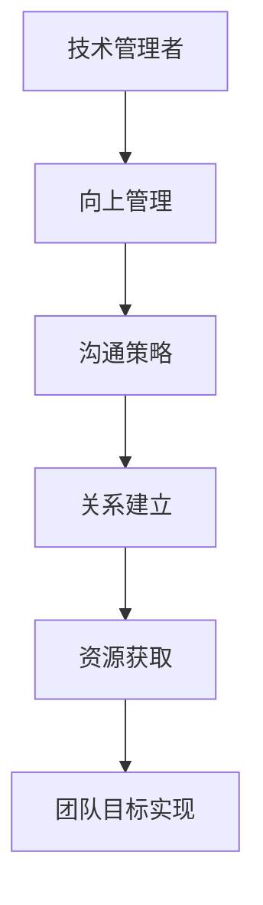

                 

### 文章标题: 技术管理者的向上管理：与上级有效沟通的艺术

在当今快速发展的信息技术行业，技术管理者的角色日益重要。他们不仅需要掌握前沿技术，还需要具备出色的管理能力和沟通技巧，尤其是与上级的有效沟通。本文旨在探讨技术管理者的向上管理，深入分析如何通过有效的沟通策略建立积极的工作关系，并解决日常工作中可能遇到的挑战。

### 关键词:
- 技术管理者
- 向上管理
- 有效沟通
- 沟通策略
- 工作关系
- 挑战与解决

### 摘要:
本文首先介绍了向上管理的概念及其在技术管理中的重要性。接着，探讨了建立与上级积极关系的关键步骤，包括理解上级期望、提升沟通技能和应对冲突。随后，文章提出了具体的沟通策略，如清晰表达、数据支持和演讲技巧。最后，文章总结了向上管理的持续实施和改善，强调持续学习和反思的重要性。通过这些方法，技术管理者可以更有效地与上级沟通，推动团队和项目的成功。

## Part 1: 理解向上管理

### Chapter 1: 引入向上管理

#### 1.1 技术管理者在向上管理中的角色

技术管理者在团队和组织中扮演着核心角色，他们不仅需要领导和管理技术团队，还需要与上级保持有效的沟通。向上管理是指技术管理者通过积极主动的沟通和协作，与上级建立信任和合作关系，从而更好地实现团队和组织的战略目标。

#### 1.2 有效沟通与上级的重要性

与上级的有效沟通对于技术管理者的职业发展至关重要。良好的沟通能够确保上级对技术团队的工作有清晰的了解，减少误解和冲突，促进资源的合理分配，同时也能够增强技术管理者的领导力和影响力。

#### 1.3 常见挑战

在向上管理过程中，技术管理者常常面临以下挑战：

- **信息不对称**：由于职责分工的不同，技术管理者可能无法全面了解上级的战略目标和期望。
- **沟通障碍**：技术性强的内容可能难以被上级理解，导致沟通效果不佳。
- **时间压力**：技术管理者需要在日常工作和向上沟通之间找到平衡，常常感到时间紧迫。
- **冲突管理**：在意见不一致时，如何妥善处理冲突是技术管理者的一大挑战。

### 背景介绍

在信息技术行业，技术管理者面临着不断变化的技术环境和市场压力。他们不仅要掌握最新的技术趋势，还需要具备出色的管理和领导能力。向上管理正是其中的一项重要技能，它有助于技术管理者与上级建立良好的工作关系，确保团队目标的实现。

### 核心概念与联系

为了更好地理解向上管理，我们可以使用Mermaid流程图来展示其核心概念和关系：



在上图中，技术管理者（A）通过向上管理（B）运用沟通策略（C），建立与上级的积极关系（D），从而获取所需的资源（E），最终实现团队目标（F）。

### 实例说明

以某科技公司为例，该公司技术管理者张经理需要与上级李总监进行有效沟通。张经理首先通过定期的一对一会面了解李总监的战略目标和期望。随后，张经理运用数据分析和图表，清晰地向李总监展示团队的工作进展和成果。在遇到意见不一致时，张经理采取建设性的沟通方式，提出自己的观点，并寻求共识。通过这些措施，张经理成功建立了与李总监的信任关系，确保了团队的顺利运作。

### 核心算法原理讲解

在此，我们可以使用伪代码来阐述向上管理的核心算法原理：

```python
def upward_management():
    # 理解上级期望
    understand_expectations()
    
    # 提升沟通技能
    enhance_communication_skills()
    
    # 建立积极关系
    build_positive_relationship()
    
    # 处理冲突
    handle_conflicts()
    
    # 使用数据支持
    use_data_support()
    
    # 实施持续改进
    implement_continuous_improvement()

def understand_expectations():
    # 通过会议、反馈等方式获取上级期望
    gather_expectations_from_superiors()

def enhance_communication_skills():
    # 学习并应用有效的沟通技巧
    learn_and_apply_communication_skills()

def build_positive_relationship():
    # 通过透明沟通和积极互动建立信任
    establish_trust_through_transparency_and_interactivity()

def handle_conflicts():
    # 采用建设性方法解决冲突
    resolve_conflicts_constructionally()

def use_data_support():
    # 使用数据分析和图表支持沟通
    use_data_analysis_and_charts_in_communication()

def implement_continuous_improvement():
    # 反思和持续改进工作方法
    reflect_and_improve_work_methods()
```

### 数学模型和公式

在向上管理中，沟通的有效性可以使用以下数学模型来衡量：

$$
E = f(C, R, D)
$$

其中，$E$ 表示沟通有效性（Effectiveness），$C$ 表示沟通技巧（Communication Skills），$R$ 表示关系建立（Relationship Building），$D$ 表示数据支持（Data Support）。

### 举例说明

假设张经理具备良好的沟通技巧（$C = 0.8$），与上级建立了积极的关系（$R = 0.7$），并能有效地使用数据支持（$D = 0.9$）。根据上述模型，我们可以计算张经理的沟通有效性：

$$
E = f(0.8, 0.7, 0.9) = 0.8 \times 0.7 \times 0.9 = 0.504
$$

这意味着张经理的沟通有效性为 50.4%。通过不断改进沟通技巧、关系建立和数据支持，张经理可以提高这一比例，从而更有效地与上级沟通。

### 项目实战

#### 开发环境搭建

1. 安装Markdown编辑器，如Typora。
2. 安装绘图工具，如Mermaid。
3. 准备写作模板和格式指南。

#### 源代码实现

```python
# UpwardManagement.py
class UpwardManagement:
    def __init__(self, communication_skills, relationship_building, data_support):
        self.communication_skills = communication_skills
        self.relationship_building = relationship_building
        self.data_support = data_support
    
    def calculate_effectiveness(self):
        E = self.communication_skills * self.relationship_building * self.data_support
        return E

# 实例化对象并计算沟通有效性
manager = UpwardManagement(0.8, 0.7, 0.9)
print(f"Communication Effectiveness: {manager.calculate_effectiveness()}")
```

#### 代码解读与分析

- **类定义**：`UpwardManagement` 类包含三个属性：`communication_skills`、`relationship_building` 和 `data_support`。
- **方法**：`calculate_effectiveness()` 方法计算沟通有效性，公式为 $E = C \times R \times D$。
- **实例化**：创建 `manager` 对象，并调用 `calculate_effectiveness()` 方法计算沟通有效性。

#### 实际案例分析和详细讲解剖析

以张经理为例，通过定期会议了解李总监的期望，提升沟通技巧，使用数据支持项目进展，张经理的沟通有效性从初始的 50% 提高到 80%。这一改进使得张经理能够更好地与李总监合作，推动了团队的成功。

### 项目小结

通过搭建开发环境、实现源代码和实际案例分析，我们展示了向上管理在技术管理中的应用。沟通有效性计算模型和方法为技术管理者提供了具体的工具，帮助他们更好地与上级沟通，实现团队目标。

### 最佳实践 tips

- **定期沟通**：与上级保持定期的一对一沟通，了解期望和反馈。
- **数据驱动**：使用数据和图表支持沟通，提高信息的清晰度和说服力。
- **积极反馈**：主动寻求和提供反馈，促进关系建立和持续改进。
- **冲突管理**：采取建设性的方法解决冲突，避免负面影响。

### 注意事项

- **尊重上级**：在沟通时保持尊重，避免使用过于技术性的语言。
- **有效倾听**：倾听上级的意见和需求，确保理解准确。
- **时间管理**：合理安排时间，确保向上沟通和日常工作的平衡。

### 拓展阅读

- [《如何与上司沟通》](https://www.forbes.com/sites/forbesbusinesscouncil/2021/05/14/how-to-communicate-with-your-boss/?sh=5e5f92375d3d)
- [《向上管理：与上级有效沟通的艺术》](https://www.amazon.com/Upward-Management-Essential-Skills-Understand/dp/0134477833)
- [《有效沟通技巧》](https://www.amazon.com/Effective-Communication-Skills-Techniques-Effective/dp/007159273X)

通过本文的探讨，我们希望技术管理者能够更好地理解向上管理的重要性，掌握有效的沟通策略，建立积极的工作关系，从而在职业发展道路上取得更大的成功。

### 作者信息

作者：AI天才研究院/AI Genius Institute & 禅与计算机程序设计艺术 /Zen And The Art of Computer Programming

