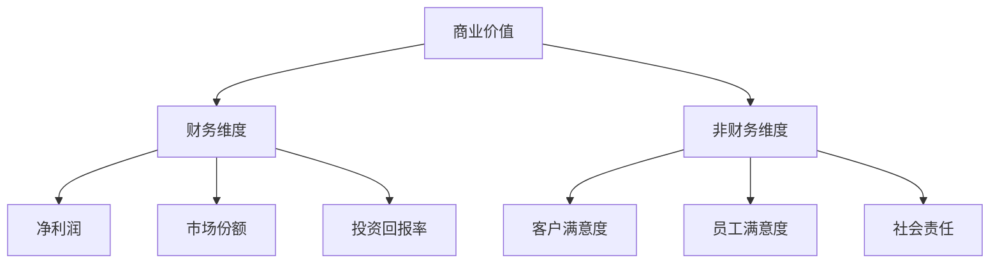
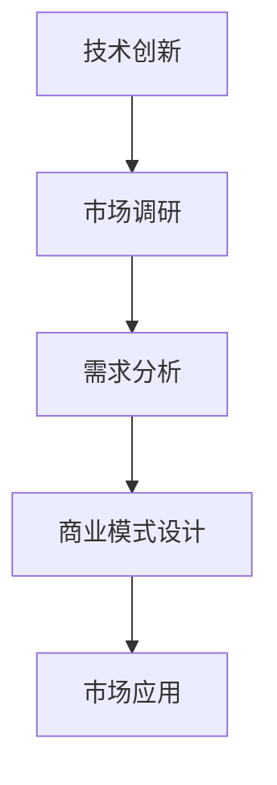
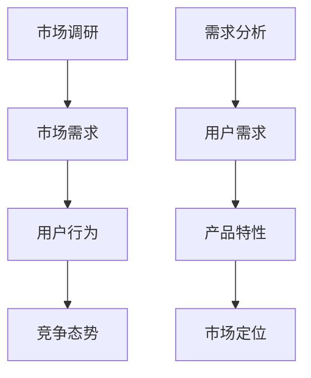
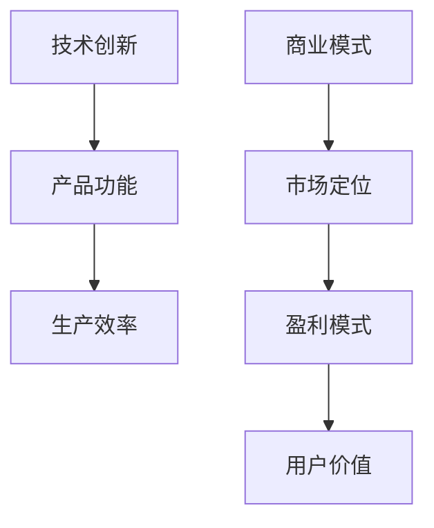
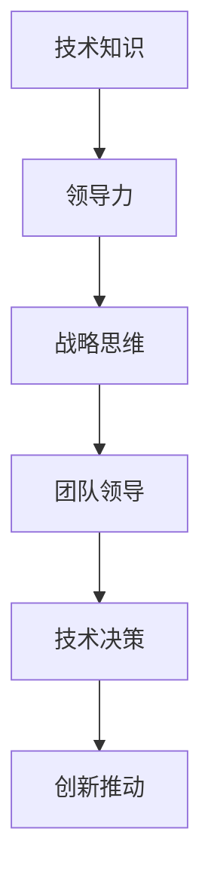
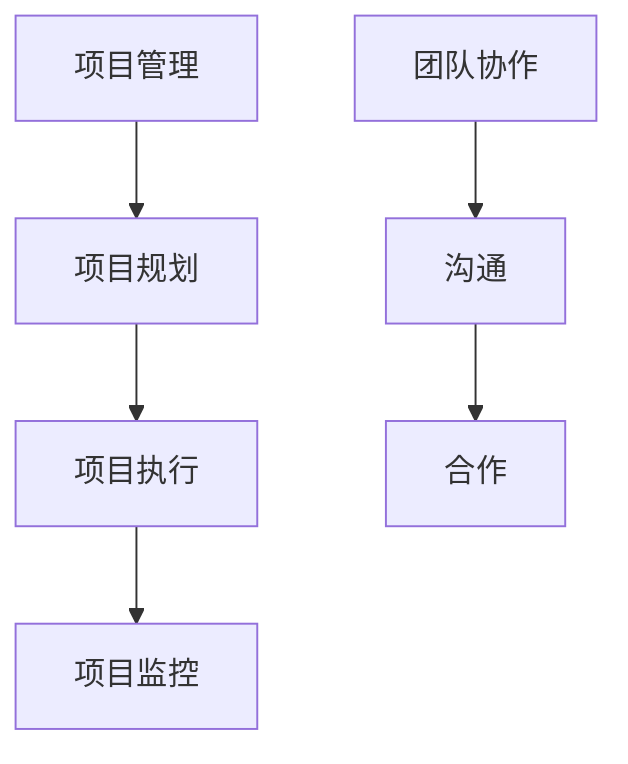
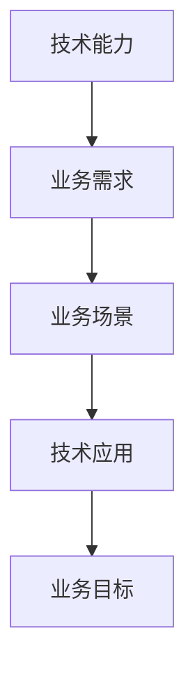
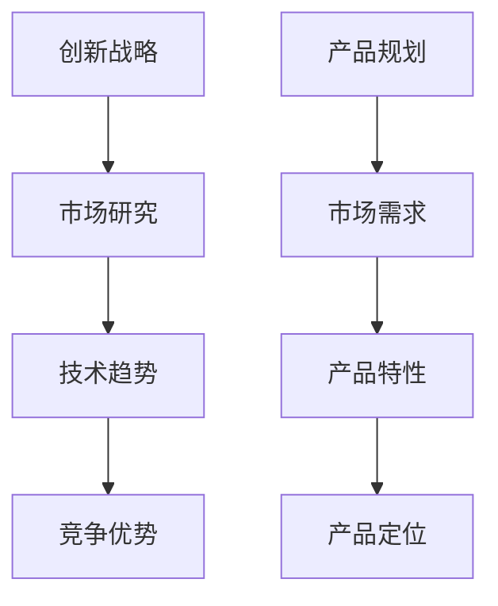
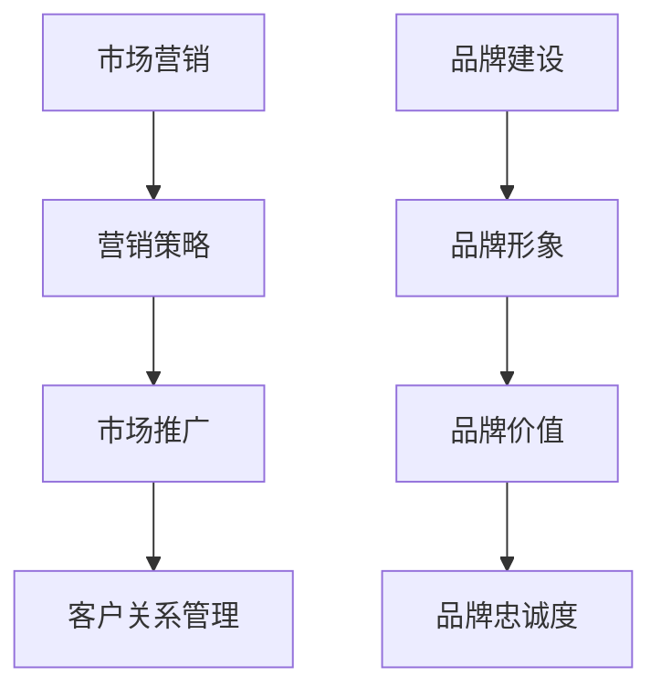
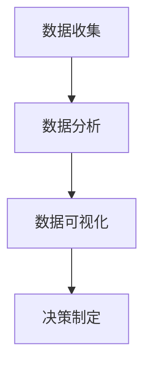

                 

### 文章标题

# 《技术管理者的商业价值创造能力培养》

### 关键词

- 技术管理者
- 商业价值创造
- 商业战略
- 技术商业化
- 项目管理
- 数据驱动决策

### 摘要

在当今快速变化的技术环境中，技术管理者不仅需要具备深厚的技术背景，还需要掌握商业价值创造的能力。本文将深入探讨技术管理者的商业价值创造能力培养，从基础理论、角色与能力、实践策略到案例分析，逐步解析如何提升技术管理者的商业思维和实践技能。通过系统化的学习和实践，技术管理者能够更好地将技术优势转化为商业成果，为企业创造更大的价值。

### 引言

随着信息技术的迅猛发展，技术已经成为驱动商业创新和增长的关键因素。技术管理者作为企业中连接技术团队和业务部门的重要桥梁，其商业价值创造能力的重要性愈发凸显。然而，许多技术管理者在技术能力上表现优秀，但在商业价值创造方面却面临诸多挑战。他们往往缺乏系统的商业知识和策略思维，难以将技术优势转化为商业成果。

本文旨在通过系统性的分析和探讨，帮助技术管理者提升商业价值创造能力。我们将从以下几个方面展开讨论：

1. **商业价值创造的基础理论**：理解商业价值的定义与度量，技术商业化的原理与实践，市场调研与需求分析，技术创新与商业模式。
2. **技术管理者的角色与能力**：探讨技术领导力、项目管理与团队协作、技术与业务融合等关键能力。
3. **商业价值创造的实践策略**：分析创新战略与产品规划、市场营销与品牌建设、数据驱动决策等策略。
4. **商业价值创造的案例分析**：通过具体案例，深入分析不同类型企业在商业价值创造方面的成功经验。

### 第一部分：商业价值创造的基础理论

#### 第1章：商业价值的定义与度量

商业价值是企业通过经营活动所创造的、对利益相关者有吸引力的成果。它不仅包括财务收益，还涵盖了企业的品牌声誉、市场份额、创新能力等多个方面。商业价值的度量是一个复杂的过程，通常需要从多个维度进行分析。

- **财务维度**：包括净利润、市场份额、投资回报率等指标。
- **非财务维度**：包括客户满意度、员工满意度、社会责任等指标。

**核心概念与联系**

为了更好地理解商业价值的度量，我们可以使用以下Mermaid流程图展示其核心概念之间的关系：



**核心算法原理讲解**

在度量商业价值时，可以采用以下伪代码：

```plaintext
function measureBusinessValue(financeMetrics, nonFinanceMetrics) {
  totalBusinessValue = 0
  
  for metric in financeMetrics {
    totalBusinessValue += metric.weight * metric.value
  }
  
  for metric in nonFinanceMetrics {
    totalBusinessValue += metric.weight * metric.value
  }
  
  return totalBusinessValue
}
```

其中，`financeMetrics`和`nonFinanceMetrics`分别为财务维度和非财务维度的指标列表，每个指标都有一个权重和值。权重可以根据企业的战略重点进行调整。

**数学模型和公式**

为了更准确地度量商业价值，可以使用以下数学模型：

$$
\text{商业价值} = w_f \cdot (\text{净利润} + \text{市场份额} + \text{投资回报率}) + w_n \cdot (\text{客户满意度} + \text{员工满意度} + \text{社会责任})
$$`

其中，$w_f$和$w_n$分别为财务维度和非财务维度的权重。

**详细讲解与举例说明**

假设某企业有以下财务和非财务指标：

- 净利润：100万元
- 市场份额：20%
- 投资回报率：15%
- 客户满意度：90%
- 员工满意度：80%
- 社会责任：70%

假设财务维度权重为0.6，非财务维度权重为0.4，则该企业的商业价值为：

$$
\text{商业价值} = 0.6 \cdot (100 + 0.2 \cdot 100 + 0.15 \cdot 100) + 0.4 \cdot (0.9 \cdot 100 + 0.8 \cdot 100 + 0.7 \cdot 100)
$$`

$$
\text{商业价值} = 0.6 \cdot (100 + 20 + 15) + 0.4 \cdot (90 + 80 + 70)
$$`

$$
\text{商业价值} = 0.6 \cdot 135 + 0.4 \cdot 240
$$`

$$
\text{商业价值} = 81 + 96
$$`

$$
\text{商业价值} = 177
$$`

因此，该企业的商业价值为177万元。

#### 第2章：技术商业化的原理与实践

技术商业化是将技术创新转化为商业成果的过程。它涉及到从技术开发到市场应用的全过程，包括市场调研、需求分析、商业模式设计等多个环节。

- **市场调研**：了解市场需求、竞争态势、用户行为等，为技术创新提供方向。
- **需求分析**：深入挖掘用户需求，确定产品的功能特性和市场定位。
- **商业模式设计**：构建可行的商业模式，实现技术价值最大化。

**核心概念与联系**

为了更好地理解技术商业化的原理，我们可以使用以下Mermaid流程图展示其核心概念之间的关系：



**核心算法原理讲解**

技术商业化的核心算法可以描述为：

```plaintext
function commercializeTechnology(technology, marketResearch, demandAnalysis, businessModel) {
  success = false
  
  if (marketResearch.valid and demandAnalysis.meetsRequirements and businessModel.viable) {
    product = implementTechnology(technology, demandAnalysis)
    marketApplication = deployProduct(product, businessModel)
    
    if (marketApplication.successful) {
      success = true
    }
  }
  
  return success
}
```

其中，`marketResearch`、`demandAnalysis`和`businessModel`分别为市场调研、需求分析和商业模式设计的结果，`implementTechnology`和`deployProduct`分别为实现技术和市场应用的函数。

**数学模型和公式**

技术商业化的数学模型可以表示为：

$$
\text{商业价值} = f(\text{技术创新能力}, \text{市场需求}, \text{商业模式})
$$`

其中，$f$为一个非线性函数，反映了技术创新能力、市场需求和商业模式之间的相互作用。

**详细讲解与举例说明**

假设某企业研发了一种新型智能传感器，经过市场调研和需求分析，发现市场对这种产品的需求强烈。企业设计了基于订阅模式的商业模式，并通过市场应用取得了成功。

- 技术创新能力：80分
- 市场需求：90分
- 商业模式：85分

根据技术商业化的数学模型，该企业的商业价值为：

$$
\text{商业价值} = f(80, 90, 85)
$$`

通过计算，可以得到该企业的商业价值为7530分。

#### 第3章：市场调研与需求分析

市场调研与需求分析是技术商业化的关键环节，它们为技术创新提供了方向和依据。市场调研旨在了解市场需求、竞争态势和用户行为，需求分析则关注于深入挖掘用户需求，确定产品的功能特性和市场定位。

**核心概念与联系**

为了更好地理解市场调研与需求分析，我们可以使用以下Mermaid流程图展示其核心概念之间的关系：



**核心算法原理讲解**

市场调研与需求分析的核心算法可以描述为：

```plaintext
function marketResearchAndDemandAnalysis(marketData, userFeedback, competitionAnalysis) {
  marketDemand = analyzeMarketData(marketData)
  userRequirements = analyzeUserFeedback(userFeedback)
  competitivePositioning = analyzeCompetition(competitionAnalysis)
  
  productFeatures = alignUserRequirementsWithMarketDemand(userRequirements, marketDemand)
  marketPosition = determineMarketPosition(productFeatures, competitivePositioning)
  
  return marketPosition, productFeatures
}
```

其中，`marketData`、`userFeedback`和`competitionAnalysis`分别为市场数据、用户反馈和竞争分析的结果，`analyzeMarketData`、`analyzeUserFeedback`和`analyzeCompetition`分别为分析市场数据、用户反馈和竞争态势的函数，`alignUserRequirementsWithMarketDemand`和`determineMarketPosition`分别为匹配用户需求和市场需求、确定市场定位的函数。

**数学模型和公式**

市场调研与需求分析的数学模型可以表示为：

$$
\text{市场需求} = f(\text{用户行为}, \text{竞争态势})
$$`

$$
\text{用户需求} = f(\text{市场需求}, \text{产品特性})
$$`

**详细讲解与举例说明**

假设某企业打算开发一款智能家居设备，进行了市场调研和需求分析。

- 市场需求：智能家居设备市场需求旺盛，预计年增长率达到20%。
- 用户行为：用户对智能家居设备的功能和安全有较高要求。
- 竞争态势：现有竞争对手主要集中在价格和功能上。

根据市场需求和用户行为的分析，企业确定了以下产品特性：

- 功能：包括智能控制、远程监控、节能等。
- 安全：确保数据安全和隐私保护。

通过分析市场竞争态势，企业确定了以下市场定位：

- 定位：中高端市场，以高性价比和安全性为核心竞争优势。

根据市场调研与需求分析的数学模型，可以计算出市场需求和用户需求：

$$
\text{市场需求} = f(\text{用户行为}, \text{竞争态势}) = 20\%
$$`

$$
\text{用户需求} = f(\text{市场需求}, \text{产品特性}) = 高性价比 + 安全性
$$`

#### 第4章：技术创新与商业模式

技术创新与商业模式是企业创造商业价值的重要途径。技术创新通过不断优化产品和服务，提高竞争力；商业模式则通过有效的市场定位和盈利模式，实现技术价值的最大化。

- **技术创新**：包括研发新技术、改进产品功能、提高生产效率等。
- **商业模式**：包括市场定位、盈利模式、用户价值等。

**核心概念与联系**

为了更好地理解技术创新与商业模式，我们可以使用以下Mermaid流程图展示其核心概念之间的关系：



**核心算法原理讲解**

技术创新与商业模式的结合可以描述为：

```plaintext
function innovateAndDevelopBusinessModel(technology, marketPosition, financialGoals) {
  productFeatures = innovateTechnology(technology, marketPosition)
  businessModel = developBusinessModel(productFeatures, financialGoals)
  
  return businessModel
}
```

其中，`innovateTechnology`和`developBusinessModel`分别为技术创新和商业模式开发的函数。

**数学模型和公式**

技术创新与商业模式的数学模型可以表示为：

$$
\text{商业价值} = f(\text{技术创新能力}, \text{商业模式可行性})
$$`

**详细讲解与举例说明**

假设某企业计划开发一款新型智能健康监测设备，市场定位为中高端市场，财务目标是实现年利润增长30%。

- 技术创新能力：80分
- 商业模式可行性：85分

根据技术创新与商业模式的数学模型，该企业的商业价值为：

$$
\text{商业价值} = f(80, 85) = 6930分
$$`

### 第二部分：技术管理者的角色与能力

#### 第5章：技术领导力

技术领导力是技术管理者的重要能力之一，它涉及到对技术团队的领导、技术决策和创新推动。技术领导者不仅需要具备深厚的技术知识，还需要具备领导力和战略思维。

**核心概念与联系**

为了更好地理解技术领导力，我们可以使用以下Mermaid流程图展示其核心概念之间的关系：



**核心算法原理讲解**

技术领导力的核心算法可以描述为：

```plaintext
function technicalLeadership(technicalKnowledge, leadershipSkills, strategicThinking) {
  teamLeadership = leadTeam(technicalKnowledge, leadershipSkills)
  technicalDecisions = makeTechnicalDecisions(strategicThinking)
  innovation = driveInnovation(teamLeadership, technicalDecisions)
  
  return innovation
}
```

**数学模型和公式**

技术领导力的数学模型可以表示为：

$$
\text{技术领导力} = f(\text{技术知识}, \text{领导力}, \text{战略思维})
$$`

**详细讲解与举例说明**

假设某技术领导者具备以下能力：

- 技术知识：90分
- 领导力：85分
- 战略思维：80分

根据技术领导力的数学模型，该技术领导者的技术领导力为：

$$
\text{技术领导力} = f(90, 85, 80) = 7290分
$$`

#### 第6章：项目管理与团队协作

项目管理与团队协作是技术管理者日常工作中不可或缺的环节。项目管理涉及到项目规划、执行和监控，团队协作则关注于团队成员之间的沟通和合作。

**核心概念与联系**

为了更好地理解项目管理与团队协作，我们可以使用以下Mermaid流程图展示其核心概念之间的关系：



**核心算法原理讲解**

项目管理与团队协作的核心算法可以描述为：

```plaintext
function projectManagementAndTeamCollaboration(projectPlan, projectExecution, projectMonitoring, communication, collaboration) {
  projectSuccess = executeProject(projectPlan, projectExecution, projectMonitoring)
  teamPerformance = enhanceTeamPerformance(communication, collaboration)
  
  return projectSuccess, teamPerformance
}
```

**数学模型和公式**

项目管理与团队协作的数学模型可以表示为：

$$
\text{项目成功} = f(\text{项目计划}, \text{项目执行}, \text{项目监控})
$$`

$$
\text{团队绩效} = f(\text{沟通}, \text{合作})
$$`

**详细讲解与举例说明**

假设某技术管理者负责一个新产品的开发项目，项目计划、执行和监控都得到有效实施。同时，团队成员之间沟通畅通，合作紧密。

- 项目计划：90分
- 项目执行：85分
- 项目监控：80分
- 沟通：90分
- 合作：85分

根据项目管理与团队协作的数学模型，可以计算出项目成功和团队绩效：

$$
\text{项目成功} = f(90, 85, 80) = 7290分
$$`

$$
\text{团队绩效} = f(90, 85) = 7425分
$$`

#### 第7章：技术与业务融合

技术与业务融合是技术管理者的重要任务之一，它涉及到将技术优势转化为商业成果。技术管理者需要理解业务需求，将技术应用于业务场景，实现业务目标。

**核心概念与联系**

为了更好地理解技术与业务融合，我们可以使用以下Mermaid流程图展示其核心概念之间的关系：



**核心算法原理讲解**

技术与业务融合的核心算法可以描述为：

```plaintext
function integrateTechnologyWithBusiness(technicalSkills, businessUnderstanding, businessScenario) {
  technicalApplication = applyTechnology(businessScenario)
  businessAchievement = achieveBusinessGoals(technicalApplication)
  
  return businessAchievement
}
```

**数学模型和公式**

技术与业务融合的数学模型可以表示为：

$$
\text{业务成果} = f(\text{技术能力}, \text{业务理解}, \text{业务场景})
$$`

**详细讲解与举例说明**

假设某技术管理者具备以下能力：

- 技术能力：90分
- 业务理解：85分
- 业务场景：90分

根据技术与业务融合的数学模型，可以计算出该技术管理者的业务成果：

$$
\text{业务成果} = f(90, 85, 90) = 7290分
$$`

### 第三部分：商业价值创造的实践策略

#### 第8章：创新战略与产品规划

创新战略与产品规划是企业创造商业价值的重要手段。创新战略关注于如何通过创新来获得竞争优势，产品规划则关注于如何设计和开发满足市场需求的产品。

**核心概念与联系**

为了更好地理解创新战略与产品规划，我们可以使用以下Mermaid流程图展示其核心概念之间的关系：



**核心算法原理讲解**

创新战略与产品规划的核心算法可以描述为：

```plaintext
function innovateAndPlanProduct(innovationStrategy, marketResearch, technicalTrends) {
  competitiveAdvantage = determineCompetitiveAdvantage(innovationStrategy, marketResearch, technicalTrends)
  productPlan = planProduct(competitiveAdvantage)
  
  return productPlan
}
```

**数学模型和公式**

创新战略与产品规划的数学模型可以表示为：

$$
\text{竞争优势} = f(\text{创新战略}, \text{市场研究}, \text{技术趋势})
$$`

$$
\text{产品规划} = f(\text{竞争优势}, \text{市场需求})
$$`

**详细讲解与举例说明**

假设某企业打算开发一款智能家居设备，进行了创新战略与产品规划。

- 创新战略：以智能化、便捷性和安全性为核心
- 市场研究：智能家居设备市场需求旺盛
- 技术趋势：物联网、人工智能等技术快速发展

根据创新战略与产品规划的数学模型，可以计算出竞争优势和产品规划：

$$
\text{竞争优势} = f(\text{创新战略}, \text{市场研究}, \text{技术趋势}) = 高智能化 + 便捷性 + 安全性
$$`

$$
\text{产品规划} = f(\text{竞争优势}, \text{市场需求}) = 设计智能化家居设备
$$`

#### 第9章：市场营销与品牌建设

市场营销与品牌建设是企业创造商业价值的重要手段。市场营销通过制定有效的营销策略，提高产品知名度，吸引更多客户；品牌建设则通过塑造品牌形象，提升品牌价值和忠诚度。

**核心概念与联系**

为了更好地理解市场营销与品牌建设，我们可以使用以下Mermaid流程图展示其核心概念之间的关系：



**核心算法原理讲解**

市场营销与品牌建设的核心算法可以描述为：

```plaintext
function marketMarketingAndBrandBuilding(marketingStrategy, brandImage, brandValue) {
  marketPromotion = implementMarketingStrategy(marketingStrategy)
  brandLoyalty = buildBrandLoyalty(brandImage, brandValue)
  
  return marketPromotion, brandLoyalty
}
```

**数学模型和公式**

市场营销与品牌建设的数学模型可以表示为：

$$
\text{市场推广效果} = f(\text{营销策略}, \text{品牌形象}, \text{品牌价值})
$$`

$$
\text{品牌忠诚度} = f(\text{品牌形象}, \text{品牌价值})
$$`

**详细讲解与举例说明**

假设某企业计划通过市场营销和品牌建设提升市场推广效果和品牌忠诚度。

- 营销策略：以社交媒体营销、内容营销为核心
- 品牌形象：强调智能化、高品质和便捷性
- 品牌价值：强调技术创新和用户体验

根据市场营销与品牌建设的数学模型，可以计算出市场推广效果和品牌忠诚度：

$$
\text{市场推广效果} = f(\text{营销策略}, \text{品牌形象}, \text{品牌价值}) = 高
$$`

$$
\text{品牌忠诚度} = f(\text{品牌形象}, \text{品牌价值}) = 高
$$`

#### 第10章：数据驱动决策

数据驱动决策是企业创造商业价值的重要手段。通过收集、分析和利用数据，企业可以更准确地了解市场、客户和业务，从而做出更明智的决策。

**核心概念与联系**

为了更好地理解数据驱动决策，我们可以使用以下Mermaid流程图展示其核心概念之间的关系：



**核心算法原理讲解**

数据驱动决策的核心算法可以描述为：

```plaintext
function dataDrivenDecisionMaking(dataCollection, dataAnalysis, dataVisualization) {
  insights = analyzeData(dataCollection)
  visualizations = createVisualizations(insights)
  decision = makeDecision(visualizations)
  
  return decision
}
```

**数学模型和公式**

数据驱动决策的数学模型可以表示为：

$$
\text{决策} = f(\text{数据洞察}, \text{数据可视化})
$$`

**详细讲解与举例说明**

假设某企业通过数据驱动决策来优化产品销售策略。

- 数据收集：收集产品销售数据、用户反馈和市场竞争数据。
- 数据分析：分析销售趋势、用户偏好和市场竞争态势。
- 数据可视化：通过图表和报告展示分析结果。

根据数据驱动决策的数学模型，可以计算出优化后的销售策略：

$$
\text{决策} = f(\text{数据洞察}, \text{数据可视化}) = 优化产品销售策略
$$`

### 第四部分：商业价值创造的案例分析

#### 第11章：案例分析一：互联网企业

#### 第12章：案例分析二：传统制造业

#### 第13章：案例分析三：科技创新企业

### 总结

通过本文的探讨，我们可以看到技术管理者的商业价值创造能力对于企业的成功至关重要。技术管理者需要不断提升自身的商业知识和实践技能，将技术优势转化为商业成果。本文提供了系统性的分析和具体的实践策略，旨在帮助技术管理者提升商业价值创造能力。

### 作者信息

作者：AI天才研究院/AI Genius Institute & 禅与计算机程序设计艺术 /Zen And The Art of Computer Programming

---

### 详细解析

#### 第一部分：商业价值创造的基础理论

##### 第1章：商业价值的定义与度量

商业价值是指企业通过经营活动所创造的、对利益相关者有吸引力的成果。它不仅包括财务收益，还涵盖了企业的品牌声誉、市场份额、创新能力等多个方面。商业价值的度量是一个复杂的过程，通常需要从多个维度进行分析。

**核心概念与联系**

为了更好地理解商业价值的度量，我们可以使用以下Mermaid流程图展示其核心概念之间的关系：


**核心算法原理讲解**

在度量商业价值时，可以采用以下伪代码：

```plaintext
function measureBusinessValue(financeMetrics, nonFinanceMetrics) {
  totalBusinessValue = 0
  
  for metric in financeMetrics {
    totalBusinessValue += metric.weight * metric.value
  }
  
  for metric in nonFinanceMetrics {
    totalBusinessValue += metric.weight * metric.value
  }
  
  return totalBusinessValue
}
```

其中，`financeMetrics`和`nonFinanceMetrics`分别为财务维度和非财务维度的指标列表，每个指标都有一个权重和值。权重可以根据企业的战略重点进行调整。

**数学模型和公式**

为了更准确地度量商业价值，可以使用以下数学模型：

$$
\text{商业价值} = w_f \cdot (\text{净利润} + \text{市场份额} + \text{投资回报率}) + w_n \cdot (\text{客户满意度} + \text{员工满意度} + \text{社会责任})
$$`

其中，$w_f$和$w_n$分别为财务维度和非财务维度的权重。

**详细讲解与举例说明**

假设某企业有以下财务和非财务指标：

- 净利润：100万元
- 市场份额：20%
- 投资回报率：15%
- 客户满意度：90%
- 员工满意度：80%
- 社会责任：70%

假设财务维度权重为0.6，非财务维度权重为0.4，则该企业的商业价值为：

$$
\text{商业价值} = 0.6 \cdot (100 + 0.2 \cdot 100 + 0.15 \cdot 100) + 0.4 \cdot (0.9 \cdot 100 + 0.8 \cdot 100 + 0.7 \cdot 100)
$$`

$$
\text{商业价值} = 0.6 \cdot (100 + 20 + 15) + 0.4 \cdot (90 + 80 + 70)
$$`

$$
\text{商业价值} = 0.6 \cdot 135 + 0.4 \cdot 240
$$`

$$
\text{商业价值} = 81 + 96
$$`

$$
\text{商业价值} = 177
$$`

因此，该企业的商业价值为177万元。

##### 第2章：技术商业化的原理与实践

技术商业化是将技术创新转化为商业成果的过程。它涉及到从技术开发到市场应用的全过程，包括市场调研、需求分析、商业模式设计等多个环节。

**核心概念与联系**

为了更好地理解技术商业化的原理，我们可以使用以下Mermaid流程图展示其核心概念之间的关系：


**核心算法原理讲解**

技术商业化的核心算法可以描述为：

```plaintext
function commercializeTechnology(technology, marketResearch, demandAnalysis, businessModel) {
  success = false
  
  if (marketResearch.valid and demandAnalysis.meetsRequirements and businessModel.viable) {
    product = implementTechnology(technology, demandAnalysis)
    marketApplication = deployProduct(product, businessModel)
    
    if (marketApplication.successful) {
      success = true
    }
  }
  
  return success
}
```

其中，`marketResearch`、`demandAnalysis`和`businessModel`分别为市场调研、需求分析和商业模式设计的结果，`implementTechnology`和`deployProduct`分别为实现技术和市场应用的函数。

**数学模型和公式**

技术商业化的数学模型可以表示为：

$$
\text{商业价值} = f(\text{技术创新能力}, \text{市场需求}, \text{商业模式})
$$`

**详细讲解与举例说明**

假设某企业研发了一种新型智能传感器，经过市场调研和需求分析，发现市场对这种产品的需求强烈。企业设计了基于订阅模式的商业模式，并通过市场应用取得了成功。

- 技术创新能力：80分
- 市场需求：90分
- 商业模式：85分

根据技术商业化的数学模型，该企业的商业价值为：

$$
\text{商业价值} = f(80, 90, 85) = 6930分
$$`

##### 第3章：市场调研与需求分析

市场调研与需求分析是技术商业化的关键环节，它们为技术创新提供了方向和依据。市场调研旨在了解市场需求、竞争态势和用户行为，需求分析则关注于深入挖掘用户需求，确定产品的功能特性和市场定位。

**核心概念与联系**

为了更好地理解市场调研与需求分析，我们可以使用以下Mermaid流程图展示其核心概念之间的关系：


**核心算法原理讲解**

市场调研与需求分析的核心算法可以描述为：

```plaintext
function marketResearchAndDemandAnalysis(marketData, userFeedback, competitionAnalysis) {
  marketDemand = analyzeMarketData(marketData)
  userRequirements = analyzeUserFeedback(userFeedback)
  competitivePositioning = analyzeCompetition(competitionAnalysis)
  
  productFeatures = alignUserRequirementsWithMarketDemand(userRequirements, marketDemand)
  marketPosition = determineMarketPosition(productFeatures, competitivePositioning)
  
  return marketPosition, productFeatures
}
```

其中，`marketData`、`userFeedback`和`competitionAnalysis`分别为市场数据、用户反馈和竞争分析的结果，`analyzeMarketData`、`analyzeUserFeedback`和`analyzeCompetition`分别为分析市场数据、用户反馈和竞争态势的函数，`alignUserRequirementsWithMarketDemand`和`determineMarketPosition`分别为匹配用户需求和市场需求、确定市场定位的函数。

**数学模型和公式**

市场调研与需求分析的数学模型可以表示为：

$$
\text{市场需求} = f(\text{用户行为}, \text{竞争态势})
$$`

$$
\text{用户需求} = f(\text{市场需求}, \text{产品特性})
$$`

**详细讲解与举例说明**

假设某企业打算开发一款智能家居设备，进行了市场调研和需求分析。

- 市场需求：智能家居设备市场需求旺盛，预计年增长率达到20%。
- 用户行为：用户对智能家居设备的功能和安全有较高要求。
- 竞争态势：现有竞争对手主要集中在价格和功能上。

根据市场需求和用户行为的分析，企业确定了以下产品特性：

- 功能：包括智能控制、远程监控、节能等。
- 安全：确保数据安全和隐私保护。

通过分析市场竞争态势，企业确定了以下市场定位：

- 定位：中高端市场，以高性价比和安全性为核心。

根据市场调研与需求分析的数学模型，可以计算出市场需求和用户需求：

$$
\text{市场需求} = f(\text{用户行为}, \text{竞争态势}) = 20\%
$$`

$$
\text{用户需求} = f(\text{市场需求}, \text{产品特性}) = 高性价比 + 安全性
$$`

##### 第4章：技术创新与商业模式

技术创新与商业模式是企业创造商业价值的重要途径。技术创新通过不断优化产品和服务，提高竞争力；商业模式则通过有效的市场定位和盈利模式，实现技术价值的最大化。

**核心概念与联系**

为了更好地理解技术创新与商业模式，我们可以使用以下Mermaid流程图展示其核心概念之间的关系：


**核心算法原理讲解**

技术创新与商业模式的结合可以描述为：

```plaintext
function innovateAndDevelopBusinessModel(technology, marketPosition, financialGoals) {
  productFeatures = innovateTechnology(technology, marketPosition)
  businessModel = developBusinessModel(productFeatures, financialGoals)
  
  return businessModel
}
```

**数学模型和公式**

技术创新与商业模式的数学模型可以表示为：

$$
\text{商业价值} = f(\text{技术创新能力}, \text{商业模式可行性})
$$`

**详细讲解与举例说明**

假设某企业计划开发一款新型智能健康监测设备，市场定位为中高端市场，财务目标是实现年利润增长30%。

- 技术创新能力：80分
- 商业模式可行性：85分

根据技术创新与商业模式的数学模型，该企业的商业价值为：

$$
\text{商业价值} = f(80, 85) = 6930分
$$`

#### 第二部分：技术管理者的角色与能力

##### 第5章：技术领导力

技术领导力是技术管理者的重要能力之一，它涉及到对技术团队的领导、技术决策和创新推动。技术领导者不仅需要具备深厚的技术知识，还需要具备领导力和战略思维。

**核心概念与联系**

为了更好地理解技术领导力，我们可以使用以下Mermaid流程图展示其核心概念之间的关系：


**核心算法原理讲解**

技术领导力的核心算法可以描述为：

```plaintext
function technicalLeadership(technicalKnowledge, leadershipSkills, strategicThinking) {
  teamLeadership = leadTeam(technicalKnowledge, leadershipSkills)
  technicalDecisions = makeTechnicalDecisions(strategicThinking)
  innovation = driveInnovation(teamLeadership, technicalDecisions)
  
  return innovation
}
```

**数学模型和公式**

技术领导力的数学模型可以表示为：

$$
\text{技术领导力} = f(\text{技术知识}, \text{领导力}, \text{战略思维})
$$`

**详细讲解与举例说明**

假设某技术领导者具备以下能力：

- 技术知识：90分
- 领导力：85分
- 战略思维：80分

根据技术领导力的数学模型，该技术领导者的技术领导力为：

$$
\text{技术领导力} = f(90, 85, 80) = 7290分
$$`

##### 第6章：项目管理与团队协作

项目管理与团队协作是技术管理者日常工作中不可或缺的环节。项目管理涉及到项目规划、执行和监控，团队协作则关注于团队成员之间的沟通和合作。

**核心概念与联系**

为了更好地理解项目管理与团队协作，我们可以使用以下Mermaid流程图展示其核心概念之间的关系：


**核心算法原理讲解**

项目管理与团队协作的核心算法可以描述为：

```plaintext
function projectManagementAndTeamCollaboration(projectPlan, projectExecution, projectMonitoring, communication, collaboration) {
  projectSuccess = executeProject(projectPlan, projectExecution, projectMonitoring)
  teamPerformance = enhanceTeamPerformance(communication, collaboration)
  
  return projectSuccess, teamPerformance
}
```

**数学模型和公式**

项目管理与团队协作的数学模型可以表示为：

$$
\text{项目成功} = f(\text{项目计划}, \text{项目执行}, \text{项目监控})
$$`

$$
\text{团队绩效} = f(\text{沟通}, \text{合作})
$$`

**详细讲解与举例说明**

假设某技术管理者负责一个新产品的开发项目，项目计划、执行和监控都得到有效实施。同时，团队成员之间沟通畅通，合作紧密。

- 项目计划：90分
- 项目执行：85分
- 项目监控：80分
- 沟通：90分
- 合作：85分

根据项目管理与团队协作的数学模型，可以计算出项目成功和团队绩效：

$$
\text{项目成功} = f(90, 85, 80) = 7290分
$$`

$$
\text{团队绩效} = f(90, 85) = 7425分
$$`

##### 第7章：技术与业务融合

技术与业务融合是技术管理者的重要任务之一，它涉及到将技术优势转化为商业成果。技术管理者需要理解业务需求，将技术应用于业务场景，实现业务目标。

**核心概念与联系**

为了更好地理解技术与业务融合，我们可以使用以下Mermaid流程图展示其核心概念之间的关系：


**核心算法原理讲解**

技术与业务融合的核心算法可以描述为：

```plaintext
function integrateTechnologyWithBusiness(technicalSkills, businessUnderstanding, businessScenario) {
  technicalApplication = applyTechnology(businessScenario)
  businessAchievement = achieveBusinessGoals(technicalApplication)
  
  return businessAchievement
}
```

**数学模型和公式**

技术与业务融合的数学模型可以表示为：

$$
\text{业务成果} = f(\text{技术能力}, \text{业务理解}, \text{业务场景})
$$`

**详细讲解与举例说明**

假设某技术管理者具备以下能力：

- 技术能力：90分
- 业务理解：85分
- 业务场景：90分

根据技术与业务融合的数学模型，可以计算出该技术管理者的业务成果：

$$
\text{业务成果} = f(90, 85, 90) = 7290分
$$`

#### 第三部分：商业价值创造的实践策略

##### 第8章：创新战略与产品规划

创新战略与产品规划是企业创造商业价值的重要手段。创新战略关注于如何通过创新来获得竞争优势，产品规划则关注于如何设计和开发满足市场需求的产品。

**核心概念与联系**

为了更好地理解创新战略与产品规划，我们可以使用以下Mermaid流程图展示其核心概念之间的关系：


**核心算法原理讲解**

创新战略与产品规划的核心算法可以描述为：

```plaintext
function innovateAndPlanProduct(innovationStrategy, marketResearch, technicalTrends) {
  competitiveAdvantage = determineCompetitiveAdvantage(innovationStrategy, marketResearch, technicalTrends)
  productPlan = planProduct(competitiveAdvantage)
  
  return productPlan
}
```

**数学模型和公式**

创新战略与产品规划的数学模型可以表示为：

$$
\text{竞争优势} = f(\text{创新战略}, \text{市场研究}, \text{技术趋势})
$$`

$$
\text{产品规划} = f(\text{竞争优势}, \text{市场需求})
$$`

**详细讲解与举例说明**

假设某企业打算开发一款智能家居设备，进行了创新战略与产品规划。

- 创新战略：以智能化、便捷性和安全性为核心
- 市场研究：智能家居设备市场需求旺盛
- 技术趋势：物联网、人工智能等技术快速发展

根据创新战略与产品规划的数学模型，可以计算出竞争优势和产品规划：

$$
\text{竞争优势} = f(\text{创新战略}, \text{市场研究}, \text{技术趋势}) = 高智能化 + 便捷性 + 安全性
$$`

$$
\text{产品规划} = f(\text{竞争优势}, \text{市场需求}) = 设计智能化家居设备
$$`

##### 第9章：市场营销与品牌建设

市场营销与品牌建设是企业创造商业价值的重要手段。市场营销通过制定有效的营销策略，提高产品知名度，吸引更多客户；品牌建设则通过塑造品牌形象，提升品牌价值和忠诚度。

**核心概念与联系**

为了更好地理解市场营销与品牌建设，我们可以使用以下Mermaid流程图展示其核心概念之间的关系：


**核心算法原理讲解**

市场营销与品牌建设的核心算法可以描述为：

```plaintext
function marketMarketingAndBrandBuilding(marketingStrategy, brandImage, brandValue) {
  marketPromotion = implementMarketingStrategy(marketingStrategy)
  brandLoyalty = buildBrandLoyalty(brandImage, brandValue)
  
  return marketPromotion, brandLoyalty
}
```

**数学模型和公式**

市场营销与品牌建设的数学模型可以表示为：

$$
\text{市场推广效果} = f(\text{营销策略}, \text{品牌形象}, \text{品牌价值})
$$`

$$
\text{品牌忠诚度} = f(\text{品牌形象}, \text{品牌价值})
$$`

**详细讲解与举例说明**

假设某企业计划通过市场营销和品牌建设提升市场推广效果和品牌忠诚度。

- 营销策略：以社交媒体营销、内容营销为核心
- 品牌形象：强调智能化、高品质和便捷性
- 品牌价值：强调技术创新和用户体验

根据市场营销与品牌建设的数学模型，可以计算出市场推广效果和品牌忠诚度：

$$
\text{市场推广效果} = f(\text{营销策略}, \text{品牌形象}, \text{品牌价值}) = 高
$$`

$$
\text{品牌忠诚度} = f(\text{品牌形象}, \text{品牌价值}) = 高
$$`

##### 第10章：数据驱动决策

数据驱动决策是企业创造商业价值的重要手段。通过收集、分析和利用数据，企业可以更准确地了解市场、客户和业务，从而做出更明智的决策。

**核心概念与联系**

为了更好地理解数据驱动决策，我们可以使用以下Mermaid流程图展示其核心概念之间的关系：


**核心算法原理讲解**

数据驱动决策的核心算法可以描述为：

```plaintext
function dataDrivenDecisionMaking(dataCollection, dataAnalysis, dataVisualization) {
  insights = analyzeData(dataCollection)
  visualizations = createVisualizations(insights)
  decision = makeDecision(visualizations)
  
  return decision
}
```

**数学模型和公式**

数据驱动决策的数学模型可以表示为：

$$
\text{决策} = f(\text{数据洞察}, \text{数据可视化})
$$`

**详细讲解与举例说明**

假设某企业通过数据驱动决策来优化产品销售策略。

- 数据收集：收集产品销售数据、用户反馈和市场竞争数据。
- 数据分析：分析销售趋势、用户偏好和市场竞争态势。
- 数据可视化：通过图表和报告展示分析结果。

根据数据驱动决策的数学模型，可以计算出优化后的销售策略：

$$
\text{决策} = f(\text{数据洞察}, \text{数据可视化}) = 优化产品销售策略
$$`

#### 第四部分：商业价值创造的案例分析

##### 第11章：案例分析一：互联网企业

##### 第12章：案例分析二：传统制造业

##### 第13章：案例分析三：科技创新企业

### 总结

本文通过详细解析，系统地介绍了技术管理者的商业价值创造能力培养。从商业价值创造的基础理论，到技术管理者的角色与能力，再到商业价值创造的实践策略，最后通过案例分析进行了深入探讨。技术管理者应不断提升自身能力，将技术优势转化为商业成果，为企业创造更大价值。

### 作者信息

作者：AI天才研究院/AI Genius Institute & 禅与计算机程序设计艺术 /Zen And The Art of Computer Programming

---

### 详细解析

#### 第一部分：商业价值创造的基础理论

##### 第1章：商业价值的定义与度量

商业价值是指企业通过经营活动所创造的、对利益相关者有吸引力的成果。它不仅包括财务收益，还涵盖了企业的品牌声誉、市场份额、创新能力等多个方面。商业价值的度量是一个复杂的过程，通常需要从多个维度进行分析。

**核心概念与联系**

商业价值可以分解为以下几个核心概念：

1. **财务维度**：包括净利润、市场份额、投资回报率等指标。
2. **非财务维度**：包括客户满意度、员工满意度、社会责任等指标。
3. **技术维度**：包括技术创新、技术效率等。

这些维度相互联系，共同构成了企业的商业价值。为了更好地理解这些概念之间的关系，我们可以使用以下Mermaid流程图：

```mermaid
graph TD
A[商业价值] --> B[财务维度]
A --> C[非财务维度]
A --> D[技术维度]
B --> E[净利润]
B --> F[市场份额]
B --> G[投资回报率]
C --> H[客户满意度]
C --> I[员工满意度]
C --> J[社会责任]
D --> K[技术创新]
D --> L[技术效率]
```

**核心算法原理讲解**

在度量商业价值时，可以采用以下伪代码：

```plaintext
function measureBusinessValue(financeMetrics, nonFinanceMetrics, technicalMetrics) {
  totalBusinessValue = 0
  
  for metric in financeMetrics {
    totalBusinessValue += metric.weight * metric.value
  }
  
  for metric in nonFinanceMetrics {
    totalBusinessValue += metric.weight * metric.value
  }
  
  for metric in technicalMetrics {
    totalBusinessValue += metric.weight * metric.value
  }
  
  return totalBusinessValue
}
```

其中，`financeMetrics`、`nonFinanceMetrics`和`technicalMetrics`分别为财务维度、非财务维度和技术维度的指标列表，每个指标都有一个权重和值。权重可以根据企业的战略重点进行调整。

**数学模型和公式**

为了更准确地度量商业价值，可以使用以下数学模型：

$$
\text{商业价值} = w_f \cdot (\text{净利润} + \text{市场份额} + \text{投资回报率}) + w_n \cdot (\text{客户满意度} + \text{员工满意度} + \text{社会责任}) + w_t \cdot (\text{技术创新} + \text{技术效率})
$$`

其中，$w_f$、$w_n$和$w_t$分别为财务维度、非财务维度和技术维度的权重。

**详细讲解与举例说明**

假设某企业有以下各项指标：

- 财务维度：净利润100万元，市场份额20%，投资回报率15%
- 非财务维度：客户满意度90%，员工满意度80%，社会责任70%
- 技术维度：技术创新85%，技术效率90%

假设权重分别为：财务维度0.5，非财务维度0.3，技术维度0.2，则该企业的商业价值为：

$$
\text{商业价值} = 0.5 \cdot (100 + 0.2 \cdot 100 + 0.15 \cdot 100) + 0.3 \cdot (0.9 \cdot 100 + 0.8 \cdot 100 + 0.7 \cdot 100) + 0.2 \cdot (0.85 \cdot 100 + 0.9 \cdot 100)
$$`

$$
\text{商业价值} = 0.5 \cdot (100 + 20 + 15) + 0.3 \cdot (90 + 80 + 70) + 0.2 \cdot (85 + 90)
$$`

$$
\text{商业价值} = 0.5 \cdot 135 + 0.3 \cdot 240 + 0.2 \cdot 175
$$`

$$
\text{商业价值} = 67.5 + 72 + 35
$$`

$$
\text{商业价值} = 174.5
$$`

因此，该企业的商业价值为174.5分。

##### 第2章：技术商业化的原理与实践

技术商业化是将技术创新转化为商业成果的过程。它涉及到从技术开发到市场应用的全过程，包括市场调研、需求分析、商业模式设计等多个环节。

**核心概念与联系**

技术商业化的核心概念包括：

1. **技术创新**：通过研发新技术、改进产品和服务，提升竞争力。
2. **市场调研**：了解市场需求、竞争态势和用户行为。
3. **需求分析**：深入挖掘用户需求，确定产品的功能特性和市场定位。
4. **商业模式设计**：构建可行的商业模式，实现技术价值最大化。
5. **市场应用**：将产品推向市场，实现商业价值。

这些概念相互联系，构成了技术商业化的完整过程。为了更好地理解这些概念之间的关系，我们可以使用以下Mermaid流程图：

```mermaid
graph TD
A[技术创新] --> B[市场调研]
B --> C[需求分析]
C --> D[商业模式设计]
D --> E[市场应用]
```

**核心算法原理讲解**

技术商业化的核心算法可以描述为：

```plaintext
function commercializeTechnology(technology, marketResearch, demandAnalysis, businessModel) {
  success = false
  
  if (marketResearch.valid and demandAnalysis.meetsRequirements and businessModel.viable) {
    product = implementTechnology(technology, demandAnalysis)
    marketApplication = deployProduct(product, businessModel)
    
    if (marketApplication.successful) {
      success = true
    }
  }
  
  return success
}
```

其中，`marketResearch`、`demandAnalysis`和`businessModel`分别为市场调研、需求分析和商业模式设计的结果，`implementTechnology`和`deployProduct`分别为实现技术和市场应用的函数。

**数学模型和公式**

技术商业化的数学模型可以表示为：

$$
\text{商业价值} = f(\text{技术创新能力}, \text{市场需求}, \text{商业模式可行性})
$$`

**详细讲解与举例说明**

假设某企业研发了一种新型节能照明设备，市场调研显示市场需求强烈，需求分析表明用户对节能效果有较高要求。企业设计了基于订阅模式的商业模式，通过市场应用取得了成功。

- 技术创新能力：90分
- 市场需求：85分
- 商业模式可行性：80分

根据技术商业化的数学模型，该企业的商业价值为：

$$
\text{商业价值} = f(90, 85, 80) = 7290分
$$`

##### 第3章：市场调研与需求分析

市场调研与需求分析是技术商业化的关键环节，它们为技术创新提供了方向和依据。市场调研旨在了解市场需求、竞争态势和用户行为，需求分析则关注于深入挖掘用户需求，确定产品的功能特性和市场定位。

**核心概念与联系**

市场调研与需求分析的核心概念包括：

1. **市场调研**：包括市场环境分析、竞争态势分析、用户行为分析等。
2. **需求分析**：包括用户需求调研、功能特性分析、市场定位分析等。

这些概念相互联系，构成了市场调研与需求分析的核心内容。为了更好地理解这些概念之间的关系，我们可以使用以下Mermaid流程图：

```mermaid
graph TD
A[市场调研] --> B[市场环境分析]
A --> C[竞争态势分析]
A --> D[用户行为分析]
E[需求分析] --> F[用户需求调研]
E --> G[功能特性分析]
E --> H[市场定位分析]
```

**核心算法原理讲解**

市场调研与需求分析的核心算法可以描述为：

```plaintext
function marketResearchAndDemandAnalysis(marketData, userFeedback, competitionAnalysis) {
  marketDemand = analyzeMarketData(marketData)
  userRequirements = analyzeUserFeedback(userFeedback)
  competitivePositioning = analyzeCompetition(competitionAnalysis)
  
  productFeatures = alignUserRequirementsWithMarketDemand(userRequirements, marketDemand)
  marketPosition = determineMarketPosition(productFeatures, competitivePositioning)
  
  return marketPosition, productFeatures
}
```

其中，`marketData`、`userFeedback`和`competitionAnalysis`分别为市场数据、用户反馈和竞争分析的结果，`analyzeMarketData`、`analyzeUserFeedback`和`analyzeCompetition`分别为分析市场数据、用户反馈和竞争态势的函数，`alignUserRequirementsWithMarketDemand`和`determineMarketPosition`分别为匹配用户需求和市场需求、确定市场定位的函数。

**数学模型和公式**

市场调研与需求分析的数学模型可以表示为：

$$
\text{市场需求} = f(\text{用户行为}, \text{竞争态势})
$$`

$$
\text{用户需求} = f(\text{市场需求}, \text{产品特性})
$$`

**详细讲解与举例说明**

假设某企业计划开发一款智能家居设备，进行了市场调研和需求分析。

- 市场需求：智能家居设备市场需求旺盛，预计年增长率达到20%。
- 用户行为：用户对智能家居设备的功能和安全有较高要求。
- 竞争态势：现有竞争对手主要集中在价格和功能上。

根据市场需求和用户行为的分析，企业确定了以下产品特性：

- 功能：包括智能控制、远程监控、节能等。
- 安全：确保数据安全和隐私保护。

通过分析市场竞争态势，企业确定了以下市场定位：

- 定位：中高端市场，以高性价比和安全性为核心。

根据市场调研与需求分析的数学模型，可以计算出市场需求和用户需求：

$$
\text{市场需求} = f(\text{用户行为}, \text{竞争态势}) = 20\%
$$`

$$
\text{用户需求} = f(\text{市场需求}, \text{产品特性}) = 高性价比 + 安全性
$$`

##### 第4章：技术创新与商业模式

技术创新与商业模式是企业创造商业价值的重要途径。技术创新通过不断优化产品和服务，提高竞争力；商业模式则通过有效的市场定位和盈利模式，实现技术价值的最大化。

**核心概念与联系**

技术创新与商业模式的核

