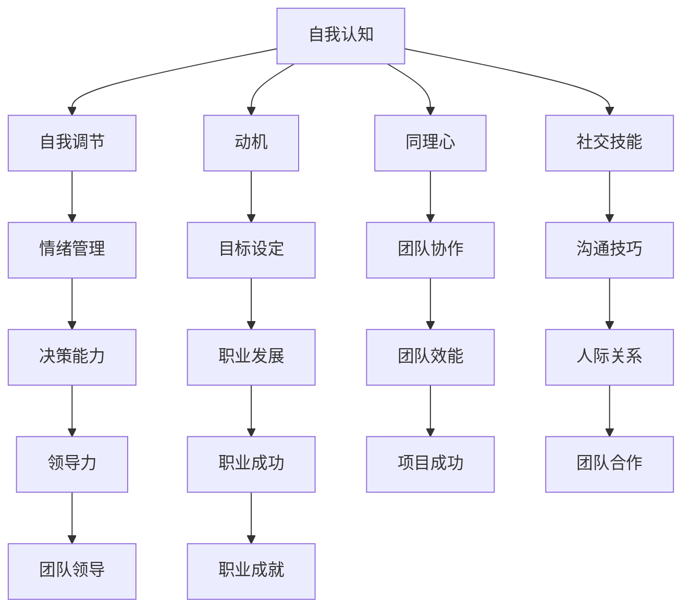

                 

### 文章标题

《技术管理者的情商修炼》

### 关键词

情商、技术管理者、团队管理、领导力、沟通技巧、项目管理

### 摘要

本文深入探讨了技术管理者在职场中情商的重要性及其修炼方法。通过分析情商的定义、要素及其在技术管理中的应用，本文提出了一套提升情商的具体策略，帮助技术管理者更好地应对工作挑战，提升团队效能和职业发展。文章结构清晰，逻辑严谨，旨在为技术管理者提供实用的情商提升指南。

---

## 引言

在当今快速变化的技术领域，技术管理者的角色变得越来越重要。他们不仅需要具备扎实的技术背景，还要具备卓越的管理能力和领导力。然而，在众多技能中，情商往往被忽视，成为技术管理者面临的一大挑战。本文旨在揭示情商在技术管理中的关键作用，并通过一系列具体策略，帮助技术管理者提升情商，从而在职场中取得更好的成绩。

### 情商概念与重要性

#### 1. 情商的定义

情商（Emotional Intelligence，简称EQ）是指个体识别、理解、管理自己情绪的能力，以及识别、理解、影响他人情绪的能力。心理学家戈尔曼（Daniel Goleman）将情商分为五个主要领域：自我认知、自我调节、动机、同理心和社交技能。

#### 2. 情商的重要性

情商在技术管理中的重要性不容忽视。首先，情商帮助技术管理者更好地处理复杂的人际关系，促进团队合作。其次，情商有助于技术管理者在压力下保持冷静，做出更明智的决策。最后，情商的提升有助于技术管理者在职业发展中取得更大的成功。

### 情商模型与要素

#### 1. 情商模型

情商模型通常包括五个主要领域：自我认知、自我调节、动机、同理心和社交技能。以下是这些领域的详细描述：

- **自我认知**：指个体对自己情绪的认识和了解。技术管理者需要能够识别自己的情绪状态，理解这些情绪对行为和决策的影响。

- **自我调节**：指个体管理自己情绪的能力。技术管理者需要学会在压力和挑战面前保持冷静，调整情绪以应对不同的情况。

- **动机**：指个体追求目标和保持动力的能力。技术管理者需要设定明确的目标，并具备持续追求这些目标的内在动力。

- **同理心**：指个体理解和感受他人情绪的能力。技术管理者需要能够站在他人的角度思考问题，从而更好地理解和满足团队成员的需求。

- **社交技能**：指个体与他人有效沟通和建立关系的能力。技术管理者需要具备良好的沟通技巧，能够与团队成员建立信任和合作关系。

#### 2. 情商要素之间的关系架构

以下是一个情商要素之间关系的Mermaid流程图：

### 情商自我评估

#### 1. 自我评估的重要性

自我评估是提升情商的第一步。通过自我评估，技术管理者可以识别自己在情商方面的优势和劣势，从而有针对性地进行提升。

#### 2. 情商自我评估方法

技术管理者可以通过以下几种方法进行自我评估：

- **问卷评估**：使用专业的情商评估问卷，如戈尔曼的EQ-i 2.0。
- **360度反馈**：收集来自团队成员、上级和其他利益相关者的反馈。
- **自我反思**：定期进行自我反思，记录自己的情绪变化和应对策略。

### 技术管理者情商提升策略

#### 1. 提升情商的方法

技术管理者可以采取以下方法提升情商：

- **情绪管理技巧**：学会识别和管理自己的情绪，避免情绪对决策和行为产生负面影响。
- **同理心培养**：通过观察他人和倾听他人意见，提高对他人情绪的理解和感受能力。
- **社交技能提升**：通过参加社交活动、团队建设活动和沟通培训，提高沟通和建立人际关系的能力。

#### 2. 提升情商的实践案例

以下是一些技术管理者提升情商的实践案例：

- **案例一**：某技术管理者通过参加情商培训课程，学会了更好的情绪管理和同理心培养技巧，从而在团队中建立了更好的信任和合作关系。
- **案例二**：某技术管理者通过定期进行自我反思和360度反馈，识别了自己的情绪管理问题，并采取了相应的改进措施，显著提高了决策质量和团队效能。

### 情商在技术管理中的应用

#### 1. 情商在团队管理中的应用

情商在团队管理中具有重要作用。技术管理者可以通过以下方式应用情商：

- **建立高效的团队**：通过同理心和社交技能，技术管理者可以更好地理解和满足团队成员的需求，从而建立高效的团队。
- **处理冲突**：通过自我调节和同理心，技术管理者可以有效地处理团队内部的冲突，维护团队的和谐与稳定。
- **提升团队凝聚力**：通过社交技能和动机，技术管理者可以激发团队成员的积极性和归属感，提升团队凝聚力。

#### 2. 情商在项目管理中的应用

情商在项目管理中也具有重要意义。技术管理者可以通过以下方式应用情商：

- **提升项目成功率**：通过情绪管理和同理心，技术管理者可以更好地应对项目中的挑战和压力，提高项目成功率。
- **管理项目风险**：通过自我调节和动机，技术管理者可以识别和管理项目风险，确保项目按计划进行。
- **提升项目管理效率**：通过社交技能和沟通技巧，技术管理者可以提升项目管理的效率，减少资源浪费和时间延误。

### 情商领导力实践

#### 1. 情商领导力的定义

情商领导力是指技术管理者通过情商能力来影响和激励团队成员，实现组织目标的能力。

#### 2. 情商领导力的重要性

情商领导力对于技术管理者至关重要。它不仅可以帮助技术管理者更好地管理团队和项目，还可以提升个人领导力和职业发展。

#### 3. 情商领导力实践案例

以下是一些技术管理者通过情商提升领导力的实践案例：

- **案例一**：某技术管理者通过提升情绪管理和同理心，成功地化解了团队内部的矛盾，提升了团队的凝聚力和工作效率。
- **案例二**：某技术管理者通过自我调节和动机管理，带领团队成功完成了多个复杂项目，赢得了上级和同事的高度认可。

### 情商与团队管理

#### 1. 情商在团队沟通中的作用

情商在团队沟通中发挥着重要作用。技术管理者可以通过以下方式发挥情商在沟通中的作用：

- **提升沟通效率**：通过同理心和社交技能，技术管理者可以更好地理解团队成员的需求和意见，提高沟通效率。
- **减少误解**：通过自我调节和情绪管理，技术管理者可以减少沟通中的误解和冲突。
- **增强团队协作**：通过同理心和动机，技术管理者可以激发团队成员的积极性和合作意愿，增强团队协作。

#### 2. 情商在团队冲突解决中的作用

情商在解决团队冲突中也发挥着关键作用。技术管理者可以通过以下方式应用情商：

- **处理团队冲突**：通过自我调节和同理心，技术管理者可以冷静地分析冲突原因，找到解决问题的方法。
- **促进团队和谐**：通过社交技能和动机，技术管理者可以化解团队冲突，建立和谐的团队氛围。
- **增强团队凝聚力**：通过同理心和动机，技术管理者可以激发团队成员的归属感和共同目标，增强团队凝聚力。

### 情商与跨部门协作

#### 1. 情商在跨部门协作中的作用

情商在跨部门协作中具有重要作用。技术管理者可以通过以下方式发挥情商在跨部门协作中的作用：

- **提升协作效率**：通过同理心和社交技能，技术管理者可以更好地理解和满足跨部门团队的需求，提高协作效率。
- **减少部门壁垒**：通过自我调节和同理心，技术管理者可以减少跨部门之间的误解和隔阂，促进部门协同。
- **促进部门协同**：通过社交技能和动机，技术管理者可以激发跨部门团队的积极性和合作意愿，促进部门协同。

#### 2. 情商在跨部门沟通中的应用

情商在跨部门沟通中也发挥着重要作用。技术管理者可以通过以下方式应用情商：

- **提升跨部门沟通效率**：通过同理心和社交技能，技术管理者可以更好地理解跨部门团队的意见和需求，提高沟通效率。
- **减少跨部门误解**：通过自我调节和情绪管理，技术管理者可以减少跨部门之间的误解和冲突。
- **增强跨部门协作**：通过同理心和动机，技术管理者可以激发跨部门团队的积极性和合作意愿，增强跨部门协作。

### 情商与项目管理

#### 1. 情商在项目管理中的作用

情商在项目管理中具有重要作用。技术管理者可以通过以下方式发挥情商在项目管理中的作用：

- **提升项目管理效率**：通过自我调节和同理心，技术管理者可以更好地管理项目进度和质量，提高项目管理效率。
- **管理项目风险**：通过情绪管理和动机，技术管理者可以识别和管理项目风险，确保项目按计划进行。
- **提升项目成功率**：通过社交技能和沟通技巧，技术管理者可以建立有效的团队协作，提高项目成功率。

#### 2. 情商在项目沟通中的应用

情商在项目沟通中也具有重要意义。技术管理者可以通过以下方式应用情商：

- **提升项目沟通效率**：通过同理心和社交技能，技术管理者可以更好地理解项目团队成员的需求和意见，提高沟通效率。
- **减少项目误解**：通过自我调节和情绪管理，技术管理者可以减少项目沟通中的误解和冲突。
- **增强项目团队凝聚力**：通过同理心和动机，技术管理者可以激发项目团队成员的积极性和合作意愿，增强项目团队凝聚力。

### 情商与沟通技巧

#### 1. 情商在沟通技巧中的作用

情商在沟通技巧中发挥着重要作用。技术管理者可以通过以下方式应用情商：

- **提高沟通效果**：通过同理心和社交技能，技术管理者可以更好地理解和满足沟通对象的需求，提高沟通效果。
- **减少沟通障碍**：通过自我调节和情绪管理，技术管理者可以减少沟通中的障碍和误解。
- **增强沟通效率**：通过同理心和动机，技术管理者可以激发沟通对象的积极性和参与度，增强沟通效率。

#### 2. 提高情商沟通技巧的策略

技术管理者可以采取以下策略提高情商沟通技巧：

- **倾听**：通过同理心，技术管理者要倾听他人的意见和需求，尊重对方的观点。
- **表达**：通过社交技能，技术管理者要清晰、准确地表达自己的意见和想法。
- **非语言沟通**：通过情绪管理和非语言沟通技巧，技术管理者可以更好地传递自己的情感和态度。
- **应对冲突**：通过自我调节和同理心，技术管理者要能够冷静应对沟通中的冲突，寻求双赢的解决方案。

### 情商与时间管理

#### 1. 情商在时间管理中的作用

情商在时间管理中发挥着重要作用。技术管理者可以通过以下方式应用情商：

- **提高时间管理效率**：通过自我调节和动机，技术管理者可以更好地规划和安排时间，提高时间管理效率。
- **减少时间浪费**：通过情绪管理和自我认知，技术管理者可以识别和避免无效的活动和时间浪费。
- **平衡工作与生活**：通过同理心和社交技能，技术管理者可以更好地处理工作与生活的平衡，减少因工作压力导致的生活质量下降。

#### 2. 提高情商时间管理技巧的策略

技术管理者可以采取以下策略提高情商时间管理技巧：

- **设定目标**：通过自我调节和动机，技术管理者要设定明确的目标和优先级，确保时间投入在最重要的任务上。
- **优先级排序**：通过自我认知和同理心，技术管理者要能够识别关键任务和紧急任务，合理安排时间和资源。
- **时间块管理**：通过情绪管理和时间块管理技巧，技术管理者要将时间分成小块，高效完成每个任务。
- **灵活调整**：通过自我调节和同理心，技术管理者要能够根据实际情况灵活调整时间安排，应对突发情况和变化。

### 情商与职业发展

#### 1. 情商在职业发展中的作用

情商在职业发展中具有重要作用。技术管理者可以通过以下方式应用情商：

- **提升职业竞争力**：通过自我认知和动机，技术管理者可以更好地了解自己的优势和不足，提升职业竞争力。
- **建立人际关系**：通过同理心和社交技能，技术管理者可以建立广泛的人际关系网络，为职业发展提供支持。
- **应对职业挑战**：通过自我调节和情绪管理，技术管理者可以更好地应对职业挑战和压力，保持积极的心态。

#### 2. 提高情商职业发展技巧的策略

技术管理者可以采取以下策略提高情商职业发展技巧：

- **自我认知**：通过定期自我反思和反馈，技术管理者要明确自己的职业目标和兴趣，找到适合自己的职业发展方向。
- **人际关系建设**：通过同理心和社交技能，技术管理者要主动与他人建立联系，拓展职业圈子，寻求职业机会。
- **情绪管理**：通过自我调节和情绪管理，技术管理者要能够应对工作中的压力和挑战，保持良好的心理状态。
- **持续学习**：通过动机和自我认知，技术管理者要不断学习和提升自己的技能和知识，保持竞争力。

### 总结与展望

本文通过深入探讨情商在技术管理中的重要性，提出了具体的提升策略和实践方法。情商不仅是技术管理者个人成长的必备素质，也是提升团队效能和职业发展的关键因素。未来，随着人工智能和技术的不断发展，情商在技术管理中的地位将日益重要。因此，技术管理者应积极修炼情商，不断提升自己的管理能力和领导力，为职业发展奠定坚实基础。

---

**作者：AI天才研究院/AI Genius Institute & 禅与计算机程序设计艺术 /Zen And The Art of Computer Programming**

