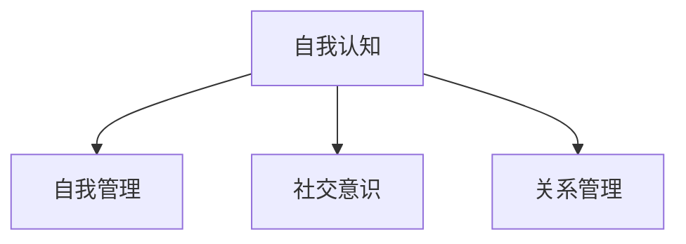

                 

## 文章标题：技术管理者的情商提升与冲突解决

### 关键词：技术管理者、情商、冲突解决、团队协作、领导力

### 摘要：
本文将深入探讨技术管理者在职场中的情商提升与冲突解决策略。通过分析情商的定义、重要性及提升方法，以及冲突的本质、类型和管理策略，本文旨在为技术管理者提供实用的工具和技巧，以提升团队协作效率和领导力，最终实现个人与组织目标的共赢。

## 引言

技术管理者的角色日益重要，他们不仅需要具备扎实的技术能力，还需具备卓越的人际沟通和冲突解决能力。情商（Emotional Intelligence，简称EQ）作为衡量一个人情感智力水平的重要指标，对技术管理者的职业发展具有深远影响。本文将围绕情商提升与冲突解决两大主题，探讨技术管理者如何在职场中更好地发挥其领导力，提升团队协作效率，从而实现组织目标。

### 情商的基础概念

#### 1.1 情商的定义与作用

情商，又称情感智力，是指个体识别、理解、管理自己情绪以及识别、理解和影响他人情绪的能力。情商涵盖了自我认知、自我管理、社交意识和关系管理四个核心维度。

- **自我认知**：了解自己的情绪、需求和价值观，是情商的基础。
- **自我管理**：调节情绪，保持积极心态，提高抗压能力。
- **社交意识**：感知和理解他人情绪，建立良好的人际关系。
- **关系管理**：处理人际关系，解决冲突，促进团队合作。

情商在职业发展中的作用不可忽视。研究表明，情商对职业成功的影响甚至超过智商（IQ）。技术管理者通过提升情商，可以更好地管理团队、提升团队协作效率，从而在职场中脱颖而出。

#### 1.2 情商的四个维度

情商的四个维度相互关联，共同构成了一个人的情感智力水平。

- **自我认知**：包括情绪识别、自我反思和自我接受。技术管理者需学会观察自己的情绪变化，理解情绪背后的原因，以及接受自己的情绪。
- **自我管理**：包括情绪调节、压力管理和自我激励。技术管理者应学会在不同情境下调节情绪，保持冷静和专注，以及设定目标并激励自己。
- **社交意识**：包括同理心、社交技能和情绪感知。技术管理者需具备同理心，理解他人感受，以及运用社交技能建立和维护良好的人际关系。
- **关系管理**：包括冲突解决、团队合作和领导力。技术管理者应学会解决冲突，促进团队合作，以及展现领导力，引领团队达成目标。

#### 1.3 情商与职业发展的关系

情商对职业发展具有重要影响。一方面，情商帮助技术管理者更好地应对职场压力，提升工作效率；另一方面，情商有助于建立良好的人际关系，提升领导力。研究表明，情商高的技术管理者在团队协作、项目管理、决策制定等方面表现出色，更容易获得职业晋升和认可。

## 第二部分：情商提升

### 第2章：自我认知与情绪管理

#### 2.1 自我认知的方法

自我认知是情商的基础，技术管理者可通过以下方法提升自我认知：

- **日记法**：记录每日的情绪变化、行为反应和思考过程，有助于洞察自己的情绪和行为模式。
- **反思法**：定期进行自我反思，思考自己在工作中的优点和不足，以及如何改进。
- **提问法**：通过向自己提出问题，如“我在这个情境下如何反应？”“我如何影响他人？”等，深入理解自己的行为和情感。

#### 2.2 情绪的类型与识别

情绪分为基本情绪和复合情绪。基本情绪包括喜怒哀乐等，而复合情绪则是基本情绪的组合。技术管理者可通过以下方法识别情绪：

- **生理反应法**：观察身体反应，如心跳加速、肌肉紧张等，以识别情绪。
- **面部表情法**：通过观察面部表情变化，判断情绪类型。
- **情绪日记法**：记录情绪发生的时间、地点、情境和情绪类型，有助于识别情绪。

#### 2.3 情绪管理技巧

情绪管理是情商的核心，技术管理者可通过以下技巧提升情绪管理能力：

- **认知重构**：改变对事件的看法，从而改变情绪。
- **情绪宣泄**：适当宣泄情绪，如通过运动、写日记等方式释放压力。
- **情绪调节**：学会在不同情境下调节情绪，保持冷静和专注。

### 第3章：人际沟通与协作

#### 3.1 有效沟通的原则

有效沟通是技术管理者必备的能力。以下原则有助于提升沟通效果：

- **倾听**：认真倾听他人的意见和需求，避免打断。
- **表达清晰**：用简洁明了的语言表达自己的观点，避免含糊不清。
- **非语言沟通**：运用肢体语言、面部表情等非语言手段辅助沟通。
- **解决分歧**：面对分歧时，积极寻求解决方案，避免争吵。

#### 3.2 非语言沟通的作用

非语言沟通在人际交往中具有重要影响。以下是非语言沟通的几个作用：

- **增强语言表达**：通过非语言手段，如肢体动作、面部表情等，增强语言表达效果。
- **传递情感信息**：非语言沟通能够传递情感信息，如喜悦、愤怒、沮丧等。
- **建立信任**：良好的非语言沟通有助于建立信任，促进人际关系。

#### 3.3 协作中的冲突解决

在团队合作中，冲突是不可避免的。技术管理者可通过以下方法解决冲突：

- **积极沟通**：主动与冲突方沟通，了解彼此的观点和需求。
- **寻求共识**：寻找共同点，达成共识，化解冲突。
- **换位思考**：站在对方角度思考问题，理解对方的立场。

### 第4章：领导力与情商

#### 4.1 情商领导力的重要性

情商领导力是指领导者运用情商能力，影响、激励和引导团队的过程。情商领导力对团队协作和业绩提升具有深远影响。

- **增强团队凝聚力**：情商领导力有助于建立信任和尊重，增强团队凝聚力。
- **提升团队效率**：情商领导力能够激发团队成员的潜力，提升团队效率。
- **促进创新**：情商领导力鼓励团队成员分享想法，促进创新。

#### 4.2 情商领导力的模型

情商领导力模型包括自我认知、自我管理、社交意识和关系管理四个方面。以下是一个简单的情商领导力模型：

#### 4.3 情商领导力的实践

技术管理者可通过以下实践提升情商领导力：

- **自我提升**：不断学习和反思，提升自我认知和自我管理能力。
- **激励团队**：运用同理心和激励技巧，提升团队士气。
- **培养下属**：关注下属成长，提供指导和支持，提升团队整体素质。

### 第5章：情商提升策略与实践

#### 5.1 情商提升的途径

技术管理者可通过以下途径提升情商：

- **培训课程**：参加情商培训课程，学习相关知识和技巧。
- **阅读书籍**：阅读有关情商和领导力的书籍，获取实践经验。
- **实践应用**：将所学知识应用于实际工作中，不断总结和反思。

#### 5.2 情商提升的案例分析

以下是一个情商提升的案例分析：

**案例背景**：某技术团队在项目实施过程中，因为任务分配不均，导致团队成员情绪低落，工作效率下降。

**解决方案**：

1. **自我认知**：管理者首先反思自己的决策过程，认识到任务分配不合理的问题。
2. **情绪管理**：管理者通过情绪调节技巧，保持冷静和客观，与团队成员进行沟通。
3. **社交意识**：管理者关注团队成员的需求和情绪，积极倾听他们的意见和反馈。
4. **关系管理**：管理者重新调整任务分配，确保公平合理，并鼓励团队成员共同承担项目责任。

**结果**：通过上述措施，团队士气得到提升，工作效率显著提高，项目顺利完成。

#### 5.3 情商提升的长期策略

为了实现长期情商提升，技术管理者应制定以下策略：

- **建立学习机制**：定期组织培训和学习活动，提高团队整体情商水平。
- **设置明确目标**：为团队和个人设置明确的目标，激发潜能和动力。
- **关注员工成长**：关注团队成员的成长需求，提供职业发展指导和支持。

## 第三部分：冲突解决

### 第6章：冲突的本质与类型

#### 6.1 冲突的本质

冲突是指两个或多个个体在目标、价值观、意见等方面的不一致，导致矛盾和紧张状态。冲突的本质包括：

- **差异性**：个体在目标、价值观、意见等方面的差异是冲突产生的根源。
- **互动性**：冲突是双方或多方之间的互动过程，需要双方或多方共同参与。
- **动态性**：冲突是一个不断演变的过程，可能随着时间和情境的变化而加剧或缓和。

#### 6.2 冲突的类型

冲突可分为以下几种类型：

- **目标冲突**：个体在目标上的不一致，如资源争夺、任务分配等。
- **价值观冲突**：个体在价值观上的不一致，如道德观念、文化差异等。
- **意见冲突**：个体在意见上的不一致，如项目方案选择、决策制定等。

#### 6.3 冲突的影响

冲突对团队和组织具有双重影响。一方面，适度的冲突可以激发创新、提高决策质量；另一方面，过度的冲突可能导致团队分裂、效率下降。技术管理者应学会平衡冲突，使其发挥积极作用。

### 第7章：冲突管理策略

#### 7.1 冲突管理的原则

冲突管理应遵循以下原则：

- **公正性**：处理冲突时，要公正无私，不偏袒任何一方。
- **主动性**：主动发现和解决冲突，避免冲突恶化。
- **沟通**：加强沟通，确保冲突双方充分表达意见和需求。
- **合作**：鼓励合作，寻求共同解决方案。

#### 7.2 冲突管理的方法

冲突管理包括以下几种方法：

- **回避**：暂时回避冲突，给双方时间和空间冷静思考。
- **妥协**：双方做出让步，达成暂时的妥协。
- **竞争**：通过竞争方式，决定冲突的最终结果。
- **合作**：寻求共同解决方案，实现双赢。

#### 7.3 冲突管理技巧

技术管理者可运用以下技巧进行冲突管理：

- **倾听**：认真倾听冲突双方的意见和需求。
- **中立**：保持中立立场，不偏袒任何一方。
- **引导**：引导冲突双方进行理性对话，找到共同点。
- **调解**：在冲突双方之间进行调解，帮助他们达成共识。

### 第8章：冲突解决的案例分析

#### 8.1 案例一：团队内部冲突的解决

**案例背景**：某技术团队在项目实施过程中，因为任务分配不公，导致团队成员情绪低落，工作效率下降。

**解决方案**：

1. **了解情况**：管理者了解团队成员的不满和抱怨，分析冲突原因。
2. **倾听意见**：管理者倾听冲突双方的诉求，了解他们的立场和观点。
3. **公平分配**：管理者重新分配任务，确保公平合理。
4. **沟通协调**：管理者与团队成员进行沟通，消除误解和猜疑。
5. **激励团队**：管理者激励团队成员，增强团队凝聚力。

**结果**：通过上述措施，团队内部冲突得到有效解决，工作效率和团队士气得到显著提升。

#### 8.2 案例二：跨部门冲突的解决

**案例背景**：某公司的产品部门和技术部门在项目推进过程中，因意见不一致，导致项目进度延误。

**解决方案**：

1. **了解情况**：管理者了解跨部门冲突的原因和影响。
2. **组织会议**：管理者组织产品部门和技术部门的会议，让双方充分表达意见和需求。
3. **共同目标**：管理者引导双方共同明确项目目标，寻找共同点。
4. **分工合作**：管理者调整部门分工，确保项目顺利推进。
5. **监督执行**：管理者监督项目执行过程，确保各方按时完成任务。

**结果**：通过上述措施，跨部门冲突得到有效解决，项目进度恢复正常。

#### 8.3 案例三：客户投诉的解决

**案例背景**：某公司的客户在购买产品后，对产品功能提出投诉。

**解决方案**：

1. **了解投诉**：管理者了解客户的投诉原因和诉求。
2. **沟通解释**：管理者与客户进行沟通，解释产品功能和使用方法。
3. **解决问题**：管理者协调相关部门，解决客户提出的问题。
4. **客户反馈**：管理者收集客户反馈，改进产品和服务。
5. **跟踪服务**：管理者跟踪客户满意度，确保问题得到彻底解决。

**结果**：通过上述措施，客户投诉得到有效解决，客户满意度显著提升。

### 第9章：冲突预防与情商提升

#### 9.1 冲突预防的策略

冲突预防是技术管理者的重要职责。以下策略有助于预防冲突：

- **建立沟通机制**：建立有效的沟通机制，确保团队成员之间的信息畅通。
- **明确目标**：明确团队目标和个体目标，减少目标冲突。
- **尊重差异**：尊重团队成员的个性和差异，避免价值观冲突。
- **定期反馈**：定期进行团队反馈，及时发现和解决问题。

#### 9.2 冲突预防与情商提升的关系

冲突预防与情商提升密切相关。技术管理者通过提升情商，可以更好地处理冲突，预防冲突的发生。情商提升有助于管理者：

- **增强团队凝聚力**：提升情商，增强团队凝聚力，减少冲突发生的可能性。
- **提高决策质量**：提升情商，提高决策质量，减少因决策不当引发的冲突。
- **改善人际关系**：提升情商，改善人际关系，为冲突预防创造良好氛围。

#### 9.3 冲突预防的长期策略

为了实现长期冲突预防，技术管理者应制定以下策略：

- **培养情商文化**：在企业内部培养情商文化，让情商成为员工素质的重要组成部分。
- **提供培训**：定期组织情商培训，提升员工的情商水平。
- **建立激励机制**：建立合理的激励机制，鼓励员工积极提升情商和冲突预防能力。

## 附录

### 附录 A：情商提升与冲突解决的实用工具

以下是一些情商提升与冲突解决的实用工具：

- **情绪日记**：记录情绪变化，分析情绪模式。
- **沟通技巧训练**：通过模拟练习和角色扮演，提升沟通技巧。
- **冲突解决工作坊**：组织冲突解决工作坊，让团队成员共同学习和实践冲突解决技巧。

### 附录 B：参考文献与推荐阅读

以下是一些参考文献和推荐阅读，供读者进一步学习：

- **参考文献**：
  1. Goleman, D. (1995). Emotional Intelligence. Bantam Books.
  2. Smith, M. (2002). The Brain and Emotional Intelligence. Basic Books.
  3. conflict resolution techniques. (2010). Harvard Negotiation Law Review.
  
- **推荐阅读**：
  1. Mayer, J.D., Salovey, P., & Caruso, D. (2004). Emotional Intelligence: Theory, Findings, and Implications. Emotion, 4(3), 185-211.
  2. Ten Tips for Effective Communication. (n.d.). Harvard Business Review.
  3. Tannen, D. (1995). The Power of Talk: Who Gets Heard and Why. Harvard Business Review Press.

作者：AI天才研究院/AI Genius Institute & 禅与计算机程序设计艺术 /Zen And The Art of Computer Programming

