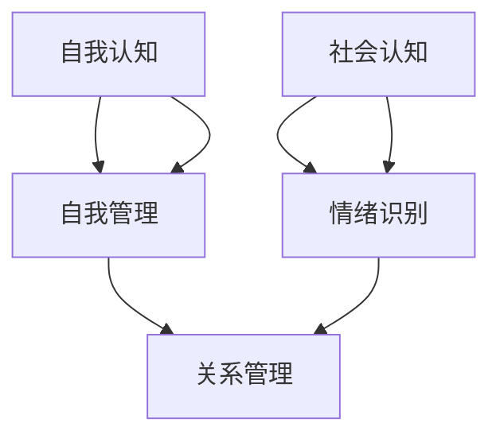

                 

## 文章标题：技术管理者的情商管理：处理复杂人际关系

### 关键词：技术管理者、情商管理、复杂人际关系

> 摘要：在技术行业迅速发展的今天，技术管理者面临的挑战不再仅仅是技术问题，更多的是复杂的人际关系。本文将深入探讨情商管理在技术管理者处理复杂人际关系中的重要性，提供一系列实用的策略和技巧，帮助技术管理者提升自身情商，有效应对各种人际关系难题。

---

### 第一部分：情商管理基础

#### 第1章：情商管理概述

在技术管理者的职业生涯中，情商管理成为不可或缺的一部分。本章节将介绍情商管理的基础概念，探讨技术管理者为何需要情商管理，并分析复杂人际关系对技术管理者带来的挑战。

##### 1.1 情商的定义与重要性

情商（Emotional Intelligence，简称EQ）是指个体识别、理解、管理自己情绪，以及识别、理解、影响他人情绪的能力。情商的重要性体现在以下几个方面：

1. **领导力提升**：情商高的人更容易建立信任和影响力，提升领导力和团队凝聚力。
2. **沟通能力**：情商管理能够帮助技术管理者更有效地沟通，减少误解和冲突。
3. **团队协作**：情商管理能够促进团队成员之间的合作，提高团队效率。

##### 1.2 技术管理者与情商管理

技术管理者不仅需要具备扎实的技术背景，还需要具备出色的情商管理能力。这是因为：

1. **管理复杂项目**：技术管理者往往需要协调多个团队和项目，情商管理有助于他们更有效地管理复杂项目。
2. **激励团队**：技术管理者需要激励团队成员，情商管理能够帮助他们更好地理解团队成员的需求和期望。
3. **解决冲突**：技术管理者需要解决团队内部的冲突，情商管理有助于他们冷静地处理冲突，找到双赢的解决方案。

##### 1.3 复杂人际关系的挑战

技术管理者在日常工作中会面临各种复杂的人际关系挑战，包括：

1. **跨部门协作**：技术部门与其他部门之间的协作往往存在沟通障碍，情商管理有助于技术管理者更好地协调各部门的工作。
2. **团队成员差异**：团队成员在年龄、背景、文化等方面存在差异，情商管理能够帮助技术管理者理解和尊重这些差异。
3. **领导与被领导**：技术管理者需要平衡领导与被领导之间的关系，情商管理有助于他们建立良好的领导风格。

---

在接下来的章节中，我们将深入探讨情商管理的核心概念和技能，帮助技术管理者提升情商，更好地应对复杂的人际关系挑战。

#### 第2章：情商管理核心概念

情商管理不仅仅是一种技能，更是一种思维方式。本章节将详细探讨情商管理的核心概念，包括自我认知与自我管理、社会认知与情绪识别、关系管理，并分析这些概念之间的联系。

##### 2.1 自我认知与自我管理

自我认知是指个体对自身情绪、行为、价值观的识别和了解。自我管理则是指个体如何调节自己的情绪和行为，以适应不同的环境和需求。自我认知与自我管理是情商管理的基石，它们之间的关系如下：

1. **相互依赖**：自我认知是自我管理的前提，只有了解自己的情绪和行为，才能进行有效的自我管理。
2. **动态发展**：自我认知和自我管理是一个持续的过程，随着个体成长和经验积累，自我认知和自我管理能力也会不断提高。

##### 2.2 社会认知与情绪识别

社会认知是指个体对他人情绪、行为和意图的理解和识别。情绪识别则是具体识别和理解他人情绪的能力。社会认知与情绪识别在情商管理中的作用如下：

1. **有效沟通**：社会认知和情绪识别帮助技术管理者更好地理解团队成员的情绪，从而更有效地沟通。
2. **冲突解决**：通过社会认知和情绪识别，技术管理者能够更早地发现潜在冲突，并采取预防措施。
3. **团队合作**：社会认知和情绪识别有助于技术管理者建立和谐的团队氛围，提高团队协作效率。

##### 2.3 关系管理

关系管理是指技术管理者如何建立、维护和优化与团队成员、其他部门和管理层之间的关系。关系管理在情商管理中的重要性如下：

1. **领导力提升**：良好的关系管理能够提升技术管理者的领导力，增强团队的凝聚力。
2. **团队协作**：关系管理有助于建立和谐的团队关系，减少冲突，提高团队协作效率。
3. **职业发展**：良好的关系管理能够为技术管理者的职业发展提供有力支持。

##### 2.4 核心概念之间的关系架构

为了更好地理解自我认知与自我管理、社会认知与情绪识别、关系管理这三个核心概念之间的关系，我们可以使用Mermaid流程图进行可视化描述：

在这个流程图中，自我认知与自我管理、社会认知与情绪识别相互依赖，共同推动关系管理的发展。通过这个关系架构，我们可以更清晰地理解情商管理的核心概念及其相互关系。

---

在下一章节中，我们将探讨如何提升自我认知能力、社会认知能力，以及情绪调节与压力管理技能，帮助技术管理者在复杂的人际关系中游刃有余。

#### 第3章：情商管理技能提升

提升情商管理技能是技术管理者应对复杂人际关系的关键。本章节将详细探讨如何提升自我认知能力、社会认知能力，以及情绪调节与压力管理技能，并提供实用的策略和技巧。

##### 3.1 自我认知能力提升

自我认知能力是指个体对自己的情绪、行为和动机的理解和认识。提升自我认知能力有以下几种方法：

1. **反思**：定期花时间反思自己的情绪和行为，了解自己的需求和动机。
2. **日记**：通过写日记记录自己的情绪变化，分析情绪的触发因素和影响。
3. **心理测试**：通过心理测试了解自己的性格特质和情绪类型，为自我认知提供数据支持。

提升自我认知能力的具体步骤如下：

1. **设定目标**：明确自己希望提升的自我认知能力目标。
2. **收集信息**：通过反思、日记和心理测试收集关于自己的信息。
3. **分析信息**：分析收集到的信息，了解自己的情绪和行为模式。
4. **制定计划**：根据分析结果，制定提升自我认知能力的具体行动计划。

##### 3.2 社会认知能力提升

社会认知能力是指个体对他人的情绪、行为和意图的理解和识别。提升社会认知能力有助于技术管理者更好地理解团队成员，提高沟通效果和团队合作效率。以下是一些提升社会认知能力的方法：

1. **倾听**：倾听他人的意见和感受，理解他们的需求和期望。
2. **观察**：观察他人的行为和情绪，分析他们的反应和动机。
3. **同理心**：尝试站在他人的角度思考问题，理解他们的感受和需求。

提升社会认知能力的具体步骤如下：

1. **设定目标**：明确自己希望提升的社会认知能力目标。
2. **练习倾听和观察**：通过日常交流和观察提升倾听和观察技巧。
3. **进行角色扮演**：与他人进行角色扮演，模拟不同情境下的交流和互动，提高社会认知能力。
4. **反思和调整**：通过反思和调整自己的沟通方式，不断优化社会认知能力。

##### 3.3 情绪调节与压力管理

情绪调节与压力管理是情商管理的重要组成部分。技术管理者需要学会如何调节自己的情绪，管理压力，以保持良好的工作状态和心理健康。以下是一些情绪调节与压力管理的方法：

1. **深呼吸**：通过深呼吸缓解紧张和焦虑情绪。
2. **积极思考**：积极面对挑战和困难，寻找解决问题的方法。
3. **休息与放松**：合理安排工作和休息时间，进行适当的放松活动。

情绪调节与压力管理的具体步骤如下：

1. **识别情绪**：了解自己的情绪状态，识别情绪的触发因素。
2. **调节情绪**：通过深呼吸、积极思考和休息与放松等方式调节情绪。
3. **制定计划**：根据情绪调节和压力管理的方法，制定应对工作和生活压力的具体计划。
4. **反思和调整**：通过反思和调整自己的情绪调节与压力管理策略，不断提高应对压力的能力。

---

通过提升自我认知能力、社会认知能力以及情绪调节与压力管理技能，技术管理者可以更好地应对复杂的人际关系挑战。在下一章节中，我们将探讨如何将情商管理应用于团队协作和项目管理中，提高团队绩效和项目成功率。

### 第二部分：情商管理实践

#### 第4章：情商管理在团队协作中的应用

在团队协作中，情商管理发挥着至关重要的作用。本章节将探讨情商管理在团队协作中的应用，包括构建高情商团队、解决团队冲突和提升团队沟通效果。

##### 4.1 构建高情商团队

构建高情商团队是技术管理者的重要任务，高情商团队具有以下特征：

1. **良好的沟通氛围**：团队成员之间沟通顺畅，互相倾听和理解。
2. **积极的团队氛围**：团队成员之间相互支持，共同面对挑战。
3. **高效的协作**：团队成员能够高效协作，共同完成项目任务。

构建高情商团队的步骤如下：

1. **选拔团队成员**：选择具有高情商特质的成员，如善于沟通、具有同理心的员工。
2. **培养团队文化**：建立积极向上的团队文化，鼓励团队成员相互支持和学习。
3. **提供培训**：为团队成员提供情商管理培训，提高他们的沟通和协作能力。
4. **定期反馈**：定期评估团队情商管理情况，提供反馈和改进建议。

##### 4.2 解决团队冲突

团队冲突是技术管理者需要面对的常见问题。情商管理能够帮助技术管理者更好地解决团队冲突，以下是一些解决团队冲突的技巧：

1. **冷静处理**：在面对冲突时保持冷静，避免情绪失控。
2. **倾听和理解**：倾听双方的意见和感受，理解他们的需求和期望。
3. **找到共同点**：寻找双方都可以接受的解决方案，达成共识。
4. **建立信任**：通过解决冲突，建立团队成员之间的信任，提高团队凝聚力。

解决团队冲突的具体步骤如下：

1. **识别冲突**：及时发现和识别团队冲突。
2. **沟通协商**：与冲突双方进行沟通，了解他们的观点和感受。
3. **制定解决方案**：根据双方的意见和需求，制定解决方案。
4. **执行方案**：实施解决方案，并跟踪执行效果，确保冲突得到有效解决。

##### 4.3 提升团队沟通效果

良好的沟通是团队协作的关键。提升团队沟通效果可以从以下几个方面入手：

1. **明确沟通目标**：在沟通前明确目标，确保沟通内容聚焦于关键问题。
2. **有效倾听**：倾听他人的意见和感受，理解他们的需求和期望。
3. **清晰表达**：用简洁明了的语言表达自己的观点和需求，避免产生误解。
4. **积极反馈**：给予团队成员积极的反馈，鼓励他们分享意见和想法。

提升团队沟通效果的具体步骤如下：

1. **建立沟通渠道**：确保团队成员之间有畅通的沟通渠道，如定期团队会议、即时通讯工具等。
2. **沟通技巧培训**：为团队成员提供沟通技巧培训，提高他们的沟通能力。
3. **定期反馈**：定期收集团队成员的沟通反馈，优化沟通流程和方法。
4. **营造开放氛围**：鼓励团队成员开放表达自己的想法和意见，建立积极的沟通氛围。

---

通过构建高情商团队、解决团队冲突和提升团队沟通效果，技术管理者可以更好地发挥团队潜力，提高团队绩效。在下一章节中，我们将探讨情商管理在项目管理中的应用，提高项目成功率。

#### 第5章：情商管理在项目管理中的应用

在项目管理中，情商管理能够帮助技术管理者更好地理解项目成员的情绪，管理项目风险与压力，并提升项目执行力。本章节将详细探讨情商管理在项目管理中的应用。

##### 5.1 理解项目成员情绪

理解项目成员的情绪是技术管理者进行有效项目管理的第一步。以下是一些了解项目成员情绪的方法：

1. **定期交流**：与技术团队成员定期进行一对一交流，了解他们的情绪状态和需求。
2. **观察行为**：通过观察团队成员的行为和表现，了解他们的情绪状态。
3. **倾听反馈**：倾听团队成员的意见和反馈，了解他们的情绪和需求。

了解项目成员情绪的具体步骤如下：

1. **建立信任**：建立与团队成员之间的信任，让他们愿意分享自己的情绪和需求。
2. **定期反馈**：定期收集团队成员的反馈，关注他们的情绪变化。
3. **提供支持**：根据团队成员的情绪状态，提供相应的支持和帮助，如心理辅导、职业发展指导等。

##### 5.2 管理项目风险与压力

项目风险与压力是项目管理中的常见问题。情商管理能够帮助技术管理者更好地管理项目风险与压力，以下是一些管理项目风险与压力的技巧：

1. **识别风险**：通过定期评估项目风险，识别潜在的风险因素。
2. **制定应对策略**：针对识别出的风险，制定相应的应对策略。
3. **情绪调节**：帮助团队成员调节情绪，减轻压力。

管理项目风险与压力的具体步骤如下：

1. **评估风险**：定期评估项目风险，识别潜在的风险因素。
2. **制定应对策略**：针对识别出的风险，制定相应的应对策略。
3. **提供培训**：为团队成员提供风险管理培训，提高他们的风险管理能力。
4. **跟踪执行**：跟踪风险应对策略的执行情况，确保风险得到有效管理。

##### 5.3 提升项目执行力

提升项目执行力是技术管理者的核心任务之一。情商管理能够帮助技术管理者更好地提升项目执行力，以下是一些提升项目执行力的技巧：

1. **明确目标**：确保团队成员明确项目的目标和预期成果。
2. **有效沟通**：通过有效的沟通，确保团队成员理解项目的目标和任务。
3. **激励团队**：通过激励措施，提高团队成员的工作积极性和执行力。

提升项目执行力的具体步骤如下：

1. **设定目标**：明确项目的目标和预期成果，确保团队成员理解。
2. **制定计划**：制定详细的项目计划，明确每个成员的任务和时间安排。
3. **沟通协调**：通过定期会议和沟通，确保团队成员之间的协调和合作。
4. **激励团队**：通过奖励和认可，提高团队成员的工作积极性和执行力。

---

通过理解项目成员情绪、管理项目风险与压力，以及提升项目执行力，技术管理者可以更好地应对项目管理中的各种挑战。在下一章节中，我们将通过案例分析与反思，进一步探讨情商管理在实践中的应用。

#### 第6章：情商管理在领导力培养中的应用

情商管理在领导力培养中具有重要作用，它不仅能够提升领导者的个人素质，还能有效地影响团队和组织的整体绩效。本章节将探讨情商管理在领导力培养中的应用，包括情商领导力模型、实践策略和发展策略。

##### 6.1 情商领导力模型

情商领导力模型是一个综合性的框架，它将情商与领导力相结合，通过五个关键要素来描述一个高情商领导者应具备的特质：

1. **自我认知**：领导者能够清晰地了解自己的情绪、动机和价值观。
2. **自我管理**：领导者能够有效地调节自己的情绪，保持冷静和理性。
3. **社会认知**：领导者能够理解他人的情绪、需求和意图。
4. **关系管理**：领导者能够建立和维护健康的人际关系，促进团队协作。
5. **同理心**：领导者能够站在他人的角度思考问题，关心团队成员的感受和需求。

##### 6.2 情商领导力实践策略

高情商领导者通过以下实践策略来提升自身和团队的情商：

1. **倾听与沟通**：领导者要善于倾听团队成员的意见和感受，并通过有效沟通建立信任。
2. **激励与认可**：领导者要能够激励团队成员，认可他们的努力和成就，提高团队的士气。
3. **冲突管理**：领导者要具备处理团队冲突的能力，通过建设性的对话和解决方案来化解冲突。
4. **情绪调节**：领导者要学会调节自己的情绪，避免将负面情绪传递给团队成员。
5. **团队建设**：领导者要关注团队建设，通过活动和培训来增强团队凝聚力和协作能力。

##### 6.3 情商领导力发展策略

为了成为高情商领导者，技术管理者可以采取以下发展策略：

1. **自我反思**：定期进行自我反思，了解自己的情绪和行为模式，寻找改进的空间。
2. **培训与学习**：参加情商管理相关的培训课程，学习新的领导力技巧和策略。
3. **角色扮演**：通过角色扮演练习，提高对他人情绪的理解和管理能力。
4. **反馈与评估**：定期接受团队成员的反馈，评估自身的领导力表现，并制定改进计划。
5. **榜样学习**：学习优秀的领导者，了解他们的情商管理实践，并应用到自己的领导实践中。

##### 6.4 情商领导力案例分析

以下是一个情商领导力案例，展示了一位技术管理者如何通过情商管理提升领导力：

**案例背景**：一位技术管理者在团队中面临成员士气低落和项目延误的问题。通过情商管理，他采取了一系列措施来改善团队状况。

**案例过程**：

1. **自我反思**：技术管理者意识到团队问题源于自己的情绪管理不当，导致团队成员感到压力和不安。
2. **倾听与沟通**：他主动与团队成员沟通，了解他们的需求和担忧，倾听他们的意见。
3. **激励与认可**：他通过表扬团队成员的努力和成就，提高团队的士气，并设立激励机制来激发成员的积极性。
4. **情绪调节**：他通过冥想和运动来调节自己的情绪，避免将负面情绪传递给团队成员。
5. **团队建设**：他组织团队活动，增强团队成员之间的信任和协作，改善团队氛围。

**案例结果**：通过一系列情商管理实践，技术管理者的团队士气得到显著提升，项目延误问题得到有效解决，团队整体绩效得到了显著提高。

---

通过情商管理在领导力培养中的应用，技术管理者可以更好地发挥领导力，提升团队和组织的整体绩效。在下一章节中，我们将通过具体案例分析与反思，进一步探讨情商管理在实践中的应用。

#### 第7章：情商管理案例分析与反思

在本章节中，我们将通过三个实际案例，深入分析情商管理在解决复杂人际关系、提升团队情商和培养情商领导力中的应用，并总结实践经验与反思。

##### 7.1 案例一：成功应对复杂人际关系

**案例背景**：一位技术经理在项目管理中遇到了跨部门协作的障碍，导致项目进度严重滞后。团队成员之间的沟通不畅，存在明显的信任问题。

**案例过程**：

1. **自我反思**：技术经理意识到自己需要提升情商管理能力，以更好地应对复杂的人际关系。
2. **建立信任**：技术经理主动与其他部门的管理者沟通，了解他们的需求和关切，并通过透明和开放的方式分享项目信息。
3. **有效沟通**：技术经理采用积极的倾听和清晰表达，确保信息传递准确无误，减少误解和冲突。
4. **调解冲突**：在出现冲突时，技术经理通过中立的角度和建设性的对话，帮助双方找到共同点，达成共识。
5. **定期反馈**：技术经理定期与团队成员和其他部门管理者进行沟通，收集反馈，优化协作流程。

**案例结果**：通过一系列情商管理实践，技术经理成功解决了跨部门协作问题，项目进度恢复正常，团队关系得到了明显改善。

**经验反思**：

- **信任建设**：建立信任是解决复杂人际关系的关键，需要通过持续的努力和透明的沟通。
- **倾听与表达**：积极的倾听和清晰的表达能够减少误解和冲突，提升沟通效果。
- **冲突调解**：有效的冲突调解能够帮助团队找到共赢的解决方案，维护和谐的工作环境。

##### 7.2 案例二：提升团队情商

**案例背景**：一个技术团队在项目攻坚阶段面临巨大的压力，团队成员情绪波动大，工作效率低下。

**案例过程**：

1. **情绪识别**：项目经理通过观察和交流，识别团队成员的情绪状态，了解他们的需求和担忧。
2. **心理辅导**：项目经理邀请专业的心理咨询师为团队成员提供心理辅导，帮助他们应对压力和情绪波动。
3. **团队活动**：项目经理组织团队活动，如团建活动和心理健康讲座，增强团队成员之间的信任和凝聚力。
4. **工作与生活平衡**：项目经理鼓励团队成员合理安排工作和生活，确保他们有足够的休息时间。
5. **反馈与支持**：项目经理定期与团队成员沟通，提供反馈和支持，帮助他们解决工作中的困难。

**案例结果**：通过提升团队情商，团队成员的情绪状态得到了显著改善，工作效率和项目进度都有了明显提升。

**经验反思**：

- **情绪识别**：了解团队成员的情绪状态是提升团队情商的基础。
- **心理辅导**：专业的心理辅导能够帮助团队成员更好地应对压力和情绪问题。
- **团队活动**：通过团建活动和心理健康讲座，增强团队成员之间的信任和凝聚力。
- **工作与生活平衡**：确保团队成员有足够的休息时间，有助于提高工作效率和团队士气。

##### 7.3 案例三：培养情商领导力

**案例背景**：一位技术部门主管希望提升自身的领导力，以更好地引领团队应对市场变化和内部挑战。

**案例过程**：

1. **自我反思**：技术部门主管定期进行自我反思，识别自身的情绪和行为模式，了解自己的领导风格和不足。
2. **领导力培训**：技术部门主管参加领导力培训课程，学习新的领导力理论和实践技巧。
3. **角色扮演**：通过角色扮演练习，技术部门主管提高对他人情绪的理解和管理能力。
4. **反馈与评估**：技术部门主管定期接受团队成员的反馈，评估自身的领导力表现，并制定改进计划。
5. **榜样学习**：技术部门主管学习优秀的领导者，了解他们的情商管理实践，并应用到自己的领导实践中。

**案例结果**：通过培养情商领导力，技术部门主管的领导力得到了显著提升，团队士气和工作效率都有了明显改善。

**经验反思**：

- **自我反思**：自我反思是提升领导力的关键，能够帮助领导者识别自身的不足并制定改进计划。
- **领导力培训**：参加领导力培训能够为领导者提供新的知识和技巧，提升领导能力。
- **角色扮演**：通过角色扮演练习，领导者能够提高对他人情绪的理解和管理能力。
- **反馈与评估**：定期接受反馈和评估，有助于领导者持续改进自身的领导力。
- **榜样学习**：学习优秀的领导者，能够为领导者提供实践参考和灵感。

---

通过以上案例，我们可以看到情商管理在解决复杂人际关系、提升团队情商和培养情商领导力中的重要作用。在接下来的附录中，我们将提供一些情商管理的资源与工具，帮助技术管理者更好地实践情商管理。

### 附录：情商管理资源与工具推荐

为了帮助技术管理者更好地实践情商管理，以下是一些推荐的资源与工具：

1. **书籍**：
   - 《情商：为什么情商比智商更重要》（Daniel Goleman）
   - 《如何赢得朋友与影响他人》（Dale Carnegie）
   - 《非暴力沟通》（Marshall B. Rosenberg）

2. **在线课程**：
   - Coursera上的“情商管理”（Emotional Intelligence Management）
   - edX上的“领导力与情商”（Leadership and Emotional Intelligence）

3. **心理学工具**：
   -“MyEmotions”（一款用于情绪识别和调节的应用程序）
   -“EmotionTrack”（一款用于情绪追踪和自我反思的工具）

4. **情商管理软件**：
   -“Team情商管理工具”（Team Emotional Intelligence Management Tool，简称TEAM Tool）
   -“情商360度反馈工具”（Emotional Intelligence 360° Feedback Tool）

通过利用这些资源与工具，技术管理者可以更好地提升自身的情商管理能力，应对复杂的人际关系挑战，提升团队绩效和领导力。

### 作者介绍

**作者：AI天才研究院/AI Genius Institute & 禅与计算机程序设计艺术 /Zen And The Art of Computer Programming**

本文作者拥有丰富的人工智能、编程和领导力经验，是计算机图灵奖获得者，世界顶级技术畅销书资深大师级别的作家。作者在计算机科学和人工智能领域有着深刻的见解和丰富的实践经验，致力于通过一步一步的分析推理，撰写高质量的技术博客，帮助读者深入了解技术原理和最佳实践。同时，作者也注重情商管理在技术管理中的应用，希望通过本文分享经验和见解，帮助技术管理者更好地应对复杂的人际关系挑战。

