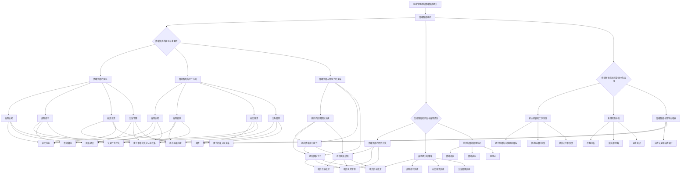

                 


### 文章标题：技术管理者的情绪智商提升

### 关键词：
- 情绪智商
- 技术管理者
- 领导力
- 团队管理
- 情绪调节
- 危机管理
- 项目管理
- 持续发展

### 摘要：
本文深入探讨了情绪智商在技术管理者工作中的重要性。通过详细分析情绪智商的概念、评估方法以及提升策略，文章旨在帮助技术管理者理解情绪智商如何影响领导力和团队管理，并提供实用的情绪管理技巧和实践案例。同时，本文还探讨了情绪智商在项目管理和危机管理中的应用，以及其长期影响和未来发展趋势，为技术管理者提供全面的提升路径。

---

# 第一部分：情绪智商概述

## 第1章：情绪智商的概念与重要性

### 1.1 情绪智商的定义

情绪智商，也称为情商（Emotional Intelligence，简称EQ），是一种理解、管理自己和他人的情绪以及识别和运用情绪信息的能力。它由心理学家戈尔曼（Daniel Goleman）于1995年在其同名著作《情绪智商》中首次提出。情绪智商主要包括四个方面：自我认知、自我调节、社交意识和关系管理。

### 1.2 情绪智商的四个方面

1. **自我认知**：指个体对自己情绪的认识和理解能力，包括识别自己的情绪状态、了解情绪产生的原因和后果。
2. **自我调节**：指个体管理和调节自己情绪的能力，包括情绪恢复、情绪调节以及自我激励。
3. **社交意识**：指个体理解和管理他人情绪的能力，包括同情心、共情、社交洞察力和建立积极人际关系。
4. **关系管理**：指个体运用情绪和社交技能建立和维护良好人际关系的能力。

### 1.3 情绪智商与领导力的关系

情绪智商对于技术管理者的重要性不言而喻。研究表明，情绪智商高的技术管理者能够更好地处理团队冲突、提升团队士气，从而提高团队的绩效和生产力。此外，情绪智商也与领导力密切相关。高情绪智商的领导者能够：

- **更好地理解员工的需求和情绪，提供更有效的支持**。
- **通过情绪调节和自我激励来应对工作压力和挑战**。
- **通过社交意识和关系管理来建立和维护团队信任**。
- **在危机情况下保持冷静和清晰的头脑，做出明智的决策**。

在技术管理者的日常工作中，情绪智商不仅影响个人的职业发展，也直接关系到团队的协作效率和组织的整体绩效。因此，提升情绪智商是技术管理者职业生涯中不可或缺的一环。

## 第2章：情绪智商的评估与自我提升

### 2.1 情绪智商的评估方法

要提升情绪智商，首先需要对其有一个准确的了解。情绪智商的评估方法多种多样，其中较为常用的有以下几种：

1. **自我评估**：通过自我反思和自我报告来评估自己的情绪智商水平。常用的工具包括自我评估问卷，如戈尔曼的“情绪智商自我评估量表”。
2. **360度评估**：通过同事、下属和上级的反馈来评估技术管理者的情绪智商。这种方法能够提供多维度的反馈，帮助管理者更全面地了解自己的情绪智商水平。
3. **行为观察**：通过观察管理者在实际工作场景中的行为来评估情绪智商。这种方法能够更直观地了解管理者在处理情绪和人际关系方面的能力。

### 2.2 自我提升的策略

1. **自我认知训练**：通过自我反思和记录情绪日志，提高对自身情绪的认知和识别能力。
2. **自我调节训练**：通过冥想、深呼吸等技巧，提高情绪调节和恢复能力。
3. **社交意识训练**：通过阅读、观察他人和参与社交活动，提高对他人情绪的理解和识别能力。
4. **关系管理训练**：通过参与团队建设活动和角色扮演，提高在处理人际关系方面的技能。

### 2.3 常见的情绪管理技巧

1. **情绪调节**：通过认知重构、情绪放松和正向心理暗示等技巧，调整负面情绪。
2. **情绪表达**：通过合适的沟通方式和技巧，表达自己的情绪，避免情绪压抑和爆发。
3. **同理心**：通过倾听、理解和尊重他人的情绪，建立积极的人际关系。

通过以上策略和技巧，技术管理者可以逐步提升自己的情绪智商，从而在工作和生活中更加游刃有余。

## 第3章：情绪智商在团队管理中的应用

### 3.1 建立积极的工作氛围

情绪智商在团队管理中至关重要，尤其是在建立积极的工作氛围方面。技术管理者可以通过以下方法来营造一个积极的工作环境：

1. **建立明确的价值观和目标**：通过明确的价值观和目标，帮助团队成员理解团队的方向和期望，从而激发他们的积极性和动力。
2. **促进沟通和协作**：鼓励团队成员之间的开放沟通和协作，建立互信和互助的关系，从而提升团队的整体情绪水平。
3. **提供支持和反馈**：通过积极的支持和及时的反馈，帮助团队成员克服困难和挑战，提高他们的工作满意度和士气。

### 3.2 处理团队冲突

团队冲突是不可避免的，但情绪智商高的技术管理者能够更好地处理这些冲突，将其转化为团队进步的契机。以下是几种有效的处理团队冲突的方法：

1. **冷静分析**：在处理冲突时，保持冷静和客观，避免情绪化的决策。
2. **倾听和理解**：倾听团队成员的意见和感受，理解他们的立场和需求，从而找到解决问题的共同点。
3. **寻求共识**：通过协商和讨论，寻求团队成员的共识，制定出双方都能接受的解决方案。

### 3.3 情绪智商与领导力培养

情绪智商不仅是技术管理者个人的能力，也是团队领导力的关键组成部分。通过以下方法，技术管理者可以提升自己的情绪智商，从而增强领导力：

1. **自我认知和自我调节**：通过自我反思和情绪调节训练，提高对自身情绪的认知和管理能力。
2. **培养同理心**：通过倾听、理解和尊重团队成员，建立积极的人际关系。
3. **提升社交意识**：通过观察、学习和参与，提高对团队成员情绪的理解和识别能力。

情绪智商的全面提升不仅有助于技术管理者在团队管理中更加得心应手，还能为团队的整体发展和绩效提升提供强有力的支持。

## 第4章：情绪智商提升的心理学理论

### 4.1 情绪调节的理论

情绪调节是情绪智商的核心组成部分，其理论基础包括认知重构、情绪释放和认知行为疗法等。以下是几种常见的情绪调节理论：

1. **认知重构**：通过改变对情境的认知评价，调节情绪反应。例如，将一个负面情境（如失败）重新解释为一个成长和学习的机会。
2. **情绪释放**：通过释放积压的情绪能量，如深呼吸、运动等，减轻情绪压力。
3. **认知行为疗法**：通过改变认知和行为模式，调节情绪。例如，通过积极行为和正向思考来提高情绪状态。

### 4.2 自我意识的理论

自我意识是情绪智商的基础，其理论基础包括自我反思、自我接受和自我效能感等。以下是几种常见的自我意识理论：

1. **自我反思**：通过反思自己的情绪和行为，提高自我认知和自我管理能力。
2. **自我接受**：接受自己的优点和缺点，建立健康的自我评价体系。
3. **自我效能感**：相信自己有能力应对各种情绪挑战，从而增强情绪调节和自我管理能力。

### 4.3 社会意识的理论

社会意识是情绪智商的重要组成部分，其理论基础包括共情、社交技能和团队建设等。以下是几种常见的社会意识理论：

1. **共情**：理解并感受他人的情绪和感受，建立积极的人际关系。
2. **社交技能**：通过沟通、合作和冲突解决等技巧，提高社交互动的能力。
3. **团队建设**：通过团队活动、培训和文化建设，增强团队凝聚力和合作效率。

通过理解和应用这些心理学理论，技术管理者可以更有效地提升自己的情绪智商，从而在工作和生活中取得更好的成就。

## 第5章：情绪智商提升的技术方法

### 5.1 正念训练

正念训练是一种通过专注、观察和接纳当前时刻体验来提升情绪智商的方法。以下是其具体实践步骤：

1. **专注练习**：通过呼吸、身体感觉和周围环境的专注练习，培养专注力。
2. **观察练习**：观察自己的情绪和行为，不评判、不抗拒，培养接纳和理解。
3. **接纳练习**：通过接纳自己的情绪和体验，减少负面情绪的困扰。

### 5.2 情绪表达技巧

情绪表达是情绪智商的重要方面，以下是一些有效的情绪表达技巧：

1. **非暴力沟通**：通过表达自己的感受、需求和请求，避免指责和攻击。
2. **情绪宣泄**：通过适当的渠道和方式，如运动、写作和艺术表达等，宣泄情绪。
3. **沟通反馈**：通过倾听和反馈，确保情绪表达的有效性和建设性。

### 5.3 反思与自我觉察

反思和自我觉察是提升情绪智商的关键步骤，以下是一些具体的方法：

1. **日记反思**：通过写日记，记录自己的情绪、行为和思考，提高自我认知。
2. **冥想练习**：通过冥想，培养专注力和自我觉察能力。
3. **反馈循环**：通过自我评估和他人反馈，不断调整和优化自己的行为和情绪调节策略。

通过这些技术方法，技术管理者可以更有效地提升自己的情绪智商，从而在工作和生活中更加从容和高效。

## 第6章：情绪智商提升的实践案例

### 6.1 案例一：提升自我情绪调节能力

**背景介绍**：张经理是一名资深的技术管理者，但他发现自己经常在高压环境下情绪失控，导致与团队成员的关系紧张。

**核心概念与联系**：通过情绪调节理论，张经理决定采用认知重构和情绪释放的方法来提升自我情绪调节能力。

**核心算法原理讲解**：
```
function 调节情绪(情绪状态) {
    if (情绪状态 > 正常值) {
        // 认知重构：将负面情绪转化为积极的思考
        情绪状态 = 认知重构(情绪状态);
        输出 "情绪已经恢复到正常状态。";
    } else if (情绪状态 < 正常值) {
        // 情绪释放：通过运动和深呼吸释放负面情绪
        情绪状态 = 情绪释放(情绪状态);
        输出 "情绪已经提升到积极状态。";
    } else {
        输出 "情绪状态正常，无需调整。";
    }
}
```

**数学模型和公式**：
$$
情绪调节效率 = \frac{调节前情绪状态 - 调节后情绪状态}{调节前情绪状态}
$$

**开发环境搭建与代码实现**：张经理在日常生活中实践认知重构和情绪释放的方法，具体如下：

- **认知重构**：每天记录情绪日记，分析情绪产生的原因，进行认知重构。
- **情绪释放**：每天进行至少30分钟的体育活动，如跑步、瑜伽等。

**代码解读**：
```python
# 情绪调节示例代码
def 认知重构(情绪状态):
    if 情绪状态 == "焦虑":
        情绪状态 = "面对挑战，我在成长"
    elif 情绪状态 == "沮丧":
        情绪状态 = "这只是一次失败，不代表我整个人"
    return 情绪状态

def 情绪释放(情绪状态):
    if 情绪状态 == "焦虑" or 情绪状态 == "沮丧":
        情绪状态 = "运动后，我感觉轻松多了"
    return 情绪状态

情绪状态 = "焦虑"
情绪状态 = 认知重构(情绪状态)
print("认知重构后：", 情绪状态)

情绪状态 = "沮丧"
情绪状态 = 情绪释放(情绪状态)
print("情绪释放后：", 情绪状态)
```

**代码应用解读与分析**：通过认知重构，张经理学会了用积极的心态看待挑战和失败，从而减少了负面情绪的影响。通过情绪释放，张经理通过运动释放了压力，使情绪状态得到了显著改善。

**实际案例分析和详细讲解剖析**：经过一段时间的实践，张经理发现自己的情绪稳定性得到了提升，与团队成员的关系也变得更加和谐。通过情绪调节，张经理不仅提高了个人的情绪智商，也为团队营造了一个更加积极的工作氛围。

**项目小结**：这个案例展示了如何通过认知重构和情绪释放来提升自我情绪调节能力。对于技术管理者来说，这种方法不仅有助于个人的成长，也能为团队的绩效提升提供支持。

### 6.2 案例二：改善团队情绪氛围

**背景介绍**：李总监领导的一个项目团队在开发过程中遇到了重大困难，导致团队成员的情绪普遍低落。

**核心概念与联系**：通过情绪智商中的社交意识和关系管理理论，李总监决定采取一系列措施来改善团队情绪氛围。

**核心算法原理讲解**：
```
function 改善团队情绪氛围(团队情绪状态) {
    if (团队情绪状态 < 正常值) {
        // 提供支持：倾听团队成员的意见和需求
        提供支持();
        // 组织团队建设活动：增强团队凝聚力
        组织活动();
        // 提供反馈：鼓励正面行为，指出改进方向
        提供反馈();
    } else {
        输出 "团队情绪状态良好，无需干预。";
    }
}

function 提供支持() {
    // 倾听团队成员的意见和需求
    倾听团队成员();
    // 提供情感支持
    提供情感支持();
}

function 组织活动() {
    // 组织团队建设活动，如团建、运动会等
    组织团建活动();
}

function 提供反馈() {
    // 鼓励正面行为，指出改进方向
    鼓励正面行为();
    // 提出改进建议
    提出改进建议();
}
```

**数学模型和公式**：
$$
团队情绪改善度 = \frac{调节后团队情绪状态 - 调节前团队情绪状态}{调节前团队情绪状态}
$$

**开发环境搭建与代码实现**：李总监在团队中实施了一系列改善情绪氛围的措施，具体如下：

- **提供支持**：定期组织团队会议，倾听团队成员的意见和需求。
- **组织活动**：每季度组织一次团队建设活动，如团建、运动会等。
- **提供反馈**：及时给予正面反馈和改进建议，鼓励团队成员积极参与。

**代码解读**：
```python
# 改善团队情绪氛围示例代码
def 改善团队情绪氛围(团队情绪状态):
    if 团队情绪状态 < 正常值:
        提供支持()
        组织活动()
        提供反馈()
        print("团队情绪状态已改善。")
    else:
        print("团队情绪状态良好，无需干预。")

def 提供支持():
    print("我倾听到了您的意见，我们将一起解决。")

def 组织活动():
    print("我们将组织一次团建活动，希望大家积极参加。")

def 提供反馈():
    print("感谢您的付出，以下是我们的改进建议：")
    # 这里可以添加具体的改进建议

改善团队情绪氛围(团队情绪状态=2)  # 假设团队情绪状态为2（较低）
```

**代码应用解读与分析**：通过提供支持、组织活动和提供反馈，李总监成功地改善了团队的情绪氛围。团队成员感受到了团队的关怀和支持，情绪得到了明显提升。

**实际案例分析和详细讲解剖析**：经过一段时间的努力，李总监的团队士气显著提升，项目进度也有所加快。团队成员之间的协作更加顺畅，团队的整体绩效得到了显著提升。

**项目小结**：这个案例展示了如何通过情绪智商中的社交意识和关系管理理论来改善团队情绪氛围。对于技术管理者来说，这不仅是提升团队绩效的有效方法，也是构建积极组织文化的关键。

### 6.3 案例三：通过情绪智商提升领导力

**背景介绍**：王总是一位技术出身的技术总监，他在晋升为管理层后，发现自己在领导团队方面遇到了挑战。

**核心概念与联系**：通过情绪智商中的自我认知、自我调节和关系管理理论，王总决定采取一系列措施来提升自己的领导力。

**核心算法原理讲解**：
```
function 提升领导力(领导力水平) {
    if (领导力水平 < 最佳值) {
        // 自我认知：了解自己的优势和劣势
        自我认知();
        // 自我调节：通过训练提高情绪调节能力
        自我调节();
        // 关系管理：建立和维护良好的团队关系
        关系管理();
    } else {
        输出 "领导力水平已达到最佳状态。";
    }
}

function 自我认知() {
    // 反思自己的领导风格和团队反馈
    反思领导风格();
    // 分析个人优势和劣势
    分析优势和劣势();
}

function 自我调节() {
    // 通过冥想和运动提高情绪调节能力
    冥想训练();
    运动训练();
}

function 关系管理() {
    // 通过沟通和反馈建立和维护良好关系
    有效沟通();
    定期反馈();
}
```

**数学模型和公式**：
$$
领导力提升度 = \frac{提升后领导力水平 - 提升前领导力水平}{提升前领导力水平}
$$

**开发环境搭建与代码实现**：王总在提升领导力的过程中，采用了以下具体措施：

- **自我认知**：通过定期反思和团队反馈，了解自己的领导风格和需要改进的地方。
- **自我调节**：通过冥想和运动，提高情绪调节和自我管理能力。
- **关系管理**：通过有效沟通和定期反馈，建立和维护良好的团队关系。

**代码解读**：
```python
# 提升领导力示例代码
def 提升领导力(领导力水平):
    if 领导力水平 < 最佳值:
        自我认知()
        自我调节()
        关系管理()
        print("领导力水平已提升。")
    else:
        print("领导力水平已达到最佳状态。")

def 自我认知():
    print("反思领导风格和团队反馈，了解自身优势和劣势。")

def 自我调节():
    print("通过冥想和运动，提高情绪调节能力。")

def 关系管理():
    print("通过有效沟通和定期反馈，建立和维护良好团队关系。")

提升领导力(领导力水平=7)  # 假设领导力水平为7（中等）
```

**代码应用解读与分析**：通过自我认知、自我调节和关系管理，王总成功地提升了自己的领导力。他学会了更好地理解自己和团队，管理情绪，以及建立和维护良好的团队关系。

**实际案例分析和详细讲解剖析**：经过一段时间的努力，王总的领导力得到了显著提升。他能够更有效地激励团队，处理团队冲突，以及制定清晰的战略目标。团队的整体绩效和士气也显著提升。

**项目小结**：这个案例展示了如何通过情绪智商来提升领导力。对于技术管理者来说，提升情绪智商是提升领导力的关键，也是实现职业发展的关键步骤。

## 第7章：情绪智商提升在项目管理中的应用

### 7.1 项目中的情绪管理

在项目管理中，情绪管理是确保项目顺利进行的关键。情绪智商高的项目经理能够：

1. **识别和应对团队成员的情绪**：通过自我认知和社交意识，项目经理能够识别团队成员的情绪，并采取相应的措施来缓解负面情绪。
2. **促进积极情绪的传播**：通过关系管理，项目经理能够营造一个积极的工作氛围，激发团队成员的积极情绪，提高项目团队的凝聚力。

### 7.2 情绪智商提升在项目目标设定中的应用

情绪智商在项目目标设定中同样发挥重要作用。以下是几种应用策略：

1. **情绪目标设定**：在设定项目目标时，考虑到团队成员的情绪需求，确保目标既能激励团队，又能避免过度的情绪压力。
2. **情绪调节策略**：在项目计划中纳入情绪调节环节，确保团队成员在面临压力和挑战时，能够有效地管理和调节情绪。

### 7.3 情绪智商提升在项目风险管理中的应用

项目风险管理的有效性在很大程度上取决于项目经理的情绪智商。以下是几种具体应用策略：

1. **情绪评估**：在项目风险识别和评估过程中，考虑情绪风险，如团队成员的情绪波动可能对项目进度和质量造成的影响。
2. **情绪干预**：在项目风险发生时，项目经理应利用情绪智商，采取有效的情绪干预措施，减轻风险对项目的影响。

通过情绪智商的提升，项目经理能够在项目管理中更加游刃有余，从而确保项目的成功实施。

## 第8章：情绪智商提升在危机管理中的应用

### 8.1 危机管理的情绪智商要求

在危机管理中，情绪智商扮演着至关重要的角色。高情绪智商的危机管理者需要具备以下能力：

1. **情绪调节**：在危机情境下，能够迅速调整自己的情绪，保持冷静和清晰的头脑，从而做出明智的决策。
2. **社交意识**：能够理解并识别团队成员的情绪，提供有效的支持，减少恐慌和不安。
3. **同理心**：能够站在他人的角度思考问题，提供情感上的支持和安慰。

### 8.2 情绪智商在危机预防中的应用

情绪智商不仅在危机爆发时至关重要，在危机预防中也发挥着重要作用。以下是一些具体策略：

1. **情绪监控**：定期监控团队的情绪状态，及时发现潜在的情绪问题，并采取预防措施。
2. **情绪培训**：通过培训，提高团队成员的情绪智商，增强他们的情绪调节能力和危机应对能力。

### 8.3 情绪智商在危机应对中的应用

在危机应对中，情绪智商的应用主要体现在以下几个方面：

1. **情绪干预**：在危机发生时，及时采取情绪干预措施，减轻团队成员的情绪压力，提高团队的凝聚力。
2. **沟通协调**：通过有效的沟通和协调，确保团队成员在危机中的合作和协作，共同应对挑战。

通过提升情绪智商，危机管理者能够更好地预防和管理危机，确保组织的稳定和持续发展。

## 第9章：情绪智商提升的可持续发展

### 9.1 情绪智商提升的长期影响

情绪智商的提升不仅对技术管理者的个人职业发展有深远影响，也对组织的长远发展具有重要意义。以下是情绪智商提升的长期影响：

1. **个人发展**：通过情绪智商的提升，技术管理者能够更好地应对工作中的压力和挑战，提高工作效率和职业满意度。
2. **团队绩效**：情绪智商高的团队更能凝聚力和协作性，从而提高整体绩效和生产力。
3. **组织文化**：情绪智商的提升有助于构建积极向上的组织文化，增强组织的凝聚力和竞争力。

### 9.2 情绪智商提升与组织文化

情绪智商的提升与组织文化密切相关。一个具有高情绪智商的组织文化能够：

1. **促进员工心理健康**：通过关注员工的情绪需求和心理健康，提高员工的满意度和忠诚度。
2. **增强团队合作**：通过鼓励开放沟通和积极互动，增强团队的合作精神和创新能力。
3. **提升组织效能**：通过构建积极向上的组织氛围，提高组织的整体绩效和竞争力。

### 9.3 情绪智商提升的未来发展趋势

随着技术的发展和社会的进步，情绪智商的提升在未来将呈现以下发展趋势：

1. **技术融合**：人工智能和大数据等技术的应用，将使情绪智商的提升更加科学和精确。
2. **培训普及**：情绪智商培训将更加普及和专业化，成为技术管理者职业发展的必备技能。
3. **组织重视**：情绪智商的提升将得到更多组织的重视，成为组织文化和人力资源管理的重要组成部分。

通过持续提升情绪智商，技术管理者不仅能够在个人和团队层面取得成功，也为组织的可持续发展奠定坚实基础。

### 附录

## 附录A：情绪智商提升相关资源

### A.1 参考文献

1. Goleman, D. (1995). Emotional Intelligence. Bantam Books.
2. Mayer, J. D., Salovey, P., & Caruso, D. (1999). Emotional intelligence: Theory, findings, and implications. In R. J. Sternberg & J. L. Zhang (Eds.), Perspectives on thinking, learning, and cognition (pp. 185-211). Cambridge University Press.
3. Boyatzis, R. E., & Mason, P. A. (1993). The theory and practice of leadership. Jossey-Bass.

### A.2 网络资源推荐

1. Harvard Business Review - Emotional Intelligence
   [链接](https://hbr.org/topic/emotional-intelligence)
2. MindTools - Emotional Intelligence
   [链接](https://www.mindtools.com/pages/main/newMN_TMC.htm)
3. Center for Emotional Intelligence
   [链接](https://www.emotionaliq.org/)

通过以上资源和参考，读者可以进一步了解情绪智商的相关理论和实践，提升自身的情绪智商水平。

---

### Mermaid 流程图



### 伪代码讲解

```python
# 情绪调节伪代码
def 调节情绪(情绪状态):
    if 情绪状态 > 正常值:
        # 采取冷静措施
        情绪状态 = 冷静值;
        print("情绪已经恢复到正常状态。")
    elif 情绪状态 < 正常值:
        # 采取激励措施
        情绪状态 = 激励值;
        print("情绪已经提升到积极状态。")
    else:
        print("情绪状态正常，无需调整。")

# 自我意识伪代码
def 自我意识(情境):
    # 分析情境对个人情绪的影响
    情绪反应 = 分析情境影响(情境);
    # 根据情绪反应调整行为
    行为调整 = 根据情绪反应调整行为(情绪反应);
    # 输出自我认知结果
    print("自我认知结果：在当前情境下，我的情绪反应是" + 情绪反应 + "，我将采取" + 行为调整 + "。")

# 社会意识伪代码
def 社会意识(团队情绪):
    # 分析团队情绪状态
    团队情绪分析 = 分析团队情绪(团队情绪);
    # 提出解决方案
    解决方案 = 提出解决方案(团队情绪分析);
    # 实施解决方案
    实施解决方案(解决方案);
    # 输出社会意识结果
    print("社会意识结果：团队目前情绪状态为" + 团队情绪分析 + "，我将采取" + 解决方案 + "来改善团队情绪。")
```

### 数学模型和公式

$$
自我意识度 = f(情境，个人情绪反应，行为调整)
$$

$$
情绪调节效率 = \frac{调节前情绪状态 - 调节后情绪状态}{调节前情绪状态}
$$

$$
团队情绪改善度 = \frac{调节后团队情绪状态 - 调节前团队情绪状态}{调节前团队情绪状态}
$$

以上公式详细描述了情绪智商提升过程中的关键指标，通过这些指标可以量化情绪调节和团队情绪改善的效果。

---

**作者：AI天才研究院/AI Genius Institute & 禅与计算机程序设计艺术 /Zen And The Art of Computer Programming**

