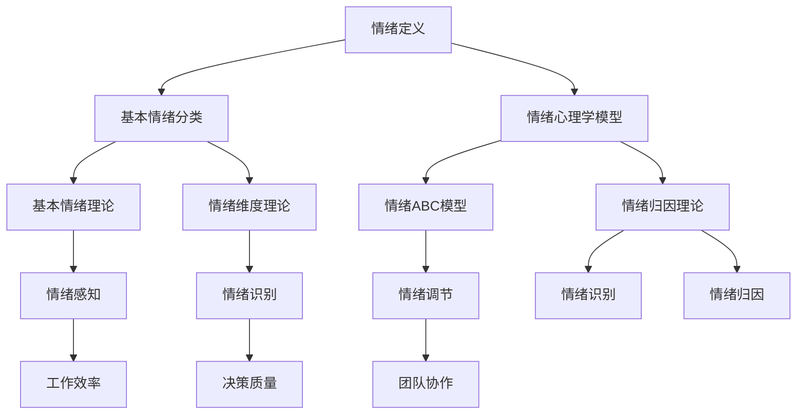

                 

### 引言

在信息技术飞速发展的今天，技术管理者作为企业技术发展的核心推动力量，承担着巨大的责任和压力。他们的工作不仅涉及复杂的技术难题，还要协调团队、管理项目、制定战略等，这一系列任务使得技术管理者常常面临巨大的工作压力和情绪波动。有效的情绪管理，对于技术管理者来说，不仅有助于保持个人的心理健康，还能提高工作效率、提升团队协作能力，最终促进企业的长期发展。

情绪管理是指通过一系列策略和技巧，使个体能够合理地识别、表达、控制和管理自己的情绪。在技术管理领域，情绪管理的重要性体现在以下几个方面：

1. **提高工作效率**：情绪稳定的技术管理者能够更专注于工作，减少因情绪波动导致的错误和失误。
2. **改善人际关系**：良好的情绪管理技能有助于建立和维护和谐的人际关系，提升团队的凝聚力。
3. **促进决策质量**：情绪稳定的个体在做出决策时更加理性，能够避免因情绪波动而导致的冲动决策。

本文将探讨技术管理者在面临工作压力时如何通过情绪管理来保持冷静与理性。我们将首先介绍情绪管理的基础理论，然后深入分析情绪对技术管理者的影响，并提供具体的情绪管理策略与实践方法。通过本文的阅读，技术管理者将能够了解情绪管理的重要性，掌握一系列实用的情绪管理技巧，从而在职业生涯中更加游刃有余。

## 情绪管理基础理论

情绪管理的基础理论建立在心理学的研究之上，涉及情绪的定义、分类、识别以及它们对个体行为和心理健康的影响。以下是这些核心概念及其相互关系的详细阐述。

### 情绪的定义与分类

情绪（Emotion）是一种复杂的心理和生理状态，通常与特定的事件、情境或思考过程相关联。情绪不仅包括主观体验（如愉悦、焦虑、愤怒等），还涉及生理反应（如心率变化、呼吸急促、肌肉紧张等）。

心理学中常见的情绪分类方法包括：

1. **基本情绪理论**：由保罗·埃克曼（Paul Ekman）提出的基本情绪理论认为，人类共有六种基本情绪，即愉悦、惊讶、愤怒、悲伤、厌恶和恐惧。
2. **情绪维度理论**：由罗伯特·普拉哈（Robert Plutchik）提出的情绪维度理论，将情绪分为八种基本类型，包括爱的正性情绪和恐惧的负性情绪。

### 情绪的心理学模型

情绪的心理学模型试图解释情绪的产生、加工和表达过程。以下是一些重要的情绪心理学模型：

1. **情绪ABC模型**：由阿尔伯特·艾利斯（Albert Ellis）提出的情绪ABC模型认为，个体的情绪（Emotion）是由其信念（Belief）和评价（Assessment）引起的，即A（Activating Event）引起B（Belief）进而导致C（Consequence）。
2. **情绪归因理论**：由弗朗斯·杰罗姆·奥尔波特（Frans J. Ajzen）提出，情绪归因理论关注个体如何解释情绪产生的原因，包括内部归因（如个人能力）和外部归因（如环境因素）。

### 情绪的识别与理解

情绪的识别与理解是情绪管理的基础。以下是几个关键点：

1. **情绪感知**：情绪感知是指个体对自身和他人情绪状态的认识。有效的情绪感知有助于建立良好的人际关系。
2. **情绪识别**：情绪识别是指识别和命名自身的情绪状态。这通常需要自我反思和情绪标签的使用。
3. **情绪调节**：情绪调节是指通过认知、行为和生理方法来管理情绪。情绪调节策略包括认知重构、放松训练和正念练习等。

### 情绪对技术管理者的影响

情绪不仅影响个体的心理健康，还对技术管理者的工作效率、决策质量和团队协作产生深远的影响。

1. **工作效率**：情绪波动可能导致注意力不集中、决策迟缓和工作效率下降。情绪稳定的技术管理者能够更好地规划任务、优先处理重要事项。
2. **决策质量**：情绪稳定的技术管理者在面临复杂问题时能够保持理性思考，避免因情绪波动导致的错误决策。
3. **团队协作**：情绪良好的管理者能够建立积极的团队氛围，增强团队成员之间的信任和协作，提高整体工作效率。

### 核心概念原理之间的联系架构 Mermaid 流程图

以下是一个简化的情绪管理核心概念原理之间的联系架构 Mermaid 流程图：

通过上述Mermaid流程图，可以清晰地看到情绪管理核心概念之间的相互关系，为技术管理者提供了一种直观的理解和记忆方式。

### 情绪管理策略

情绪管理策略是技术管理者保持冷静与理性的关键。以下是一些具体的方法和技巧：

1. **时间管理策略**：通过合理的时间分配和任务规划，技术管理者可以有效减轻工作压力。具体方法包括：
   - **制定时间计划**：使用日程表或时间管理应用来规划每日、每周和每月的任务。
   - **优先级管理**：根据任务的紧急性和重要性进行优先级排序，确保重要且紧急的任务首先完成。
   - **消除时间浪费**：识别并减少不必要的工作流程和会议，避免时间浪费。

2. **沟通技巧**：有效的沟通能够帮助技术管理者建立良好的人际关系，减轻压力。具体技巧包括：
   - **倾听与表达**：在沟通中积极倾听对方的意见，清晰表达自己的想法，避免误解和冲突。
   - **非暴力沟通**：采用非暴力沟通的方式，以尊重和理解为基础进行交流，减少情绪冲突。
   - **情绪管理在沟通中的应用**：在沟通中保持冷静和理性，避免因情绪波动导致的冲动发言。

3. **压力缓解策略**：长期的压力会导致情绪波动，因此技术管理者需要学会有效的压力缓解方法。具体策略包括：
   - **身体锻炼**：定期进行身体锻炼，如瑜伽、跑步等，有助于缓解压力和改善心理健康。
   - **正念练习**：通过正念冥想等方式，提高对情绪和思维的觉察能力，减少焦虑和压力。
   - **休息与放松**：确保充足的休息时间，定期进行放松活动，如听音乐、阅读等。

### 时间管理策略

时间管理是技术管理者保持冷静与理性的关键之一。有效的任务规划和时间分配可以帮助管理者减轻工作压力，提高工作效率。以下是一些具体的策略：

1. **制定时间计划**：首先，技术管理者需要制定详细的时间计划。这可以通过以下步骤实现：
   - **确定目标**：明确每日、每周和每月的工作目标。
   - **划分时间段**：将工作时间划分为固定的时间段，如上午、下午和晚上。
   - **安排任务**：根据任务的紧急性和重要性，将任务分配到相应的时间段。

2. **优先级管理**：为了确保重要任务得到优先处理，技术管理者需要学会优先级管理。具体方法包括：
   - **紧急与重要矩阵**：使用紧急与重要矩阵（Eisenhower Matrix）将任务分为四类，并按优先级处理。
   - **任务优先级排序**：根据任务的紧急性和重要性，对任务进行排序，确保重要且紧急的任务首先完成。

3. **消除时间浪费**：为了最大化利用时间，技术管理者需要识别并消除时间浪费。以下是一些建议：
   - **减少不必要的会议**：合理安排会议时间，减少不必要的会议，确保会议内容高效。
   - **避免多任务处理**：多任务处理会降低工作效率，技术管理者应尽量避免同时处理多个任务。
   - **合理利用工具**：使用时间管理工具，如日历应用、任务管理软件等，来帮助管理时间和任务。

### 提高工作效率的方法

除了时间管理策略外，提高工作效率也是技术管理者情绪管理的重要一环。以下是一些提高工作效率的方法：

1. **工作流程优化**：通过优化工作流程，可以减少不必要的步骤和重复工作，提高整体工作效率。具体方法包括：
   - **自动化**：使用自动化工具和脚本来自动完成重复性的任务。
   - **标准化**：制定标准化的工作流程和操作步骤，确保团队成员的一致性和效率。

2. **工作方法与工具**：选择合适的工作方法和工具可以提高工作效率。以下是一些建议：
   - **团队协作工具**：使用团队协作工具，如Slack、Trello等，来协调团队工作。
   - **项目管理工具**：使用项目管理工具，如Jira、Asana等，来跟踪项目进度和任务分配。

3. **避免过度工作**：过度工作不仅会影响工作效率，还会增加情绪压力。以下是一些建议来避免过度工作：
   - **设定工作时间**：明确工作时间，避免加班和长时间工作。
   - **合理分配任务**：合理分配任务，确保每个团队成员都能承受适量的工作负荷。

### 时间管理与情绪管理的关系

时间管理和情绪管理之间存在密切的关系。一方面，有效的情绪管理有助于时间管理；另一方面，良好的时间管理也有助于情绪管理。以下是一些具体的关系和影响：

1. **情绪对时间管理的影响**：
   - **情绪波动**：情绪波动，如焦虑和压力，会导致时间管理上的混乱和效率降低。技术管理者在情绪不稳定时可能会忘记任务、错过截止日期或过度工作。
   - **情绪对任务选择**：情绪稳定的个体能够更好地判断任务的紧急性和重要性，从而更合理地分配时间。

2. **时间管理对情绪的影响**：
   - **时间压力**：时间压力是情绪压力的一个重要来源。过度的工作负荷和紧迫的时间限制会导致焦虑和压力。
   - **时间效率**：有效的时间管理可以减少时间压力，从而降低情绪压力。通过合理安排时间和任务，技术管理者可以更好地控制工作进度，减少焦虑和压力。

3. **情绪管理对时间管理策略的优化**：
   - **情绪识别与调节**：通过情绪识别和调节，技术管理者可以更好地理解自己的情绪状态，从而调整时间管理策略。例如，在情绪不稳定时，可以适当减少工作负荷，避免过度工作。
   - **情绪管理技巧**：如正念练习、放松训练等情绪管理技巧，可以帮助技术管理者保持冷静和专注，从而更有效地管理时间。

综上所述，时间管理和情绪管理是相辅相成的。通过有效的情绪管理，技术管理者可以更好地控制时间，提高工作效率，减少情绪压力；同时，良好的时间管理也有助于情绪管理，帮助技术管理者保持心理健康。

### 沟通技巧

沟通技巧在情绪管理中扮演着至关重要的角色。有效的沟通不仅可以减少误解和冲突，还能增强团队凝聚力和工作效率。以下是一些关键沟通技巧：

1. **倾听与表达**：
   - **倾听**：倾听是有效沟通的基础。在沟通中，技术管理者需要全神贯注地倾听对方的意见和感受，避免打断和中断。
   - **表达**：清晰、明确地表达自己的想法和意见。使用简单的语言和具体的例子，避免使用模糊或含糊不清的表达。

2. **非暴力沟通**：
   - **非暴力沟通**：采用非暴力沟通的方式，以尊重和理解为基础进行交流。避免指责、批评和命令式语言，而是使用请求和解决方案的表述方式。

3. **情绪管理在沟通中的应用**：
   - **保持冷静**：在沟通中保持冷静和理性，避免因情绪波动而导致的冲动发言或行为。
   - **情绪反馈**：在适当的时候，技术管理者可以适度表达自己的情绪，如“我现在感到有些焦虑，我们需要尽快解决这个问题”。

4. **有效沟通的方法与技巧**：
   - **积极倾听**：积极倾听不仅包括听对方说什么，还包括观察对方的非语言行为，如肢体语言和面部表情。
   - **开放提问**：使用开放性提问来引导对话，鼓励团队成员分享意见和想法。

### 情绪管理在沟通技巧中的应用

情绪管理在沟通技巧中的应用主要体现在以下几个方面：

1. **情绪识别**：在沟通过程中，技术管理者需要识别和理解自己的情绪状态。通过自我反思和情绪标签，管理者可以更清楚地了解自己的情绪，从而更好地控制情绪表达。

2. **情绪调节**：情绪调节技巧，如深呼吸、正念冥想等，可以帮助技术管理者在紧张的沟通场合中保持冷静。这些技巧有助于降低焦虑和压力，提高沟通效果。

3. **情绪表达**：在适当的时机和方式下，适度表达情绪可以增强沟通的透明度和信任感。例如，技术管理者可以表达对某个问题的担忧，同时提出解决方案，而不是单纯指责或抱怨。

4. **情绪反馈**：在团队沟通中，技术管理者可以通过情绪反馈来帮助团队成员更好地理解彼此的感受。例如，当团队成员的情绪波动较大时，管理者可以适时给予支持和安慰，以缓解紧张气氛。

通过上述情绪管理在沟通技巧中的应用，技术管理者可以建立更和谐、更高效的沟通环境，从而提升整体团队的协作能力。

### 压力缓解策略

在技术管理者的职业生涯中，压力是不可避免的。长期的压力不仅会影响个人的心理健康，还会对工作效率和人际关系产生负面影响。因此，掌握有效的压力缓解策略对于保持情绪稳定至关重要。以下是一些常见的压力缓解策略：

1. **身体锻炼**：身体锻炼是缓解压力的有效方法。定期进行有氧运动，如慢跑、游泳或瑜伽，可以促进身体的血液循环，释放紧张情绪，同时释放内啡肽等“快乐激素”，提升心理健康。研究表明，每周至少进行150分钟的中等强度运动，可以有效减轻压力。

2. **正念练习**：正念冥想是一种通过专注当下、接受当下情况来缓解压力的技巧。通过正念练习，技术管理者可以学会观察自己的情绪和思维，而不被其左右，从而减少焦虑和压力。每天花10-15分钟进行正念冥想，有助于提高情绪调节能力。

3. **社交支持**：建立良好的社交支持网络对于缓解压力至关重要。与家人、朋友或同事分享自己的感受和压力，可以减轻心理负担。此外，参与社交活动，如团队建设或兴趣小组，有助于建立积极的人际关系，提升心理健康。

4. **时间管理**：合理的时间管理是减轻工作压力的关键。通过制定明确的工作计划和目标，技术管理者可以更好地掌控工作节奏，避免过度工作和疲劳。使用时间管理工具，如日历应用和任务管理软件，有助于合理安排时间，减少时间压力。

5. **休息与放松**：确保充足的休息时间和放松时间对于缓解压力至关重要。每天至少保证7-8小时的睡眠，可以帮助身体和大脑得到充分的恢复。此外，定期进行放松活动，如阅读、听音乐、散步等，可以帮助管理者放松心情，减轻压力。

6. **心理健康支持**：如果压力难以自行缓解，寻求专业心理健康支持是一个不错的选择。心理治疗、心理咨询和药物治疗等手段可以帮助技术管理者更好地管理情绪和压力。

### 压力管理的基本概念

压力管理是指通过一系列策略和技巧来应对和减轻压力的过程。对于技术管理者而言，有效的压力管理不仅有助于保持心理健康，还能提高工作效率和团队协作能力。以下是压力管理的一些基本概念：

1. **压力源**：压力源是指引发压力的内外部因素，包括工作压力、人际关系、时间压力、健康问题等。识别压力源是压力管理的重要步骤，有助于制定针对性的缓解策略。

2. **压力反应**：压力反应是指个体在面临压力源时产生的生理、心理和行为反应。常见的压力反应包括焦虑、愤怒、抑郁、身体疲劳等。了解压力反应有助于管理者更好地识别和管理自己的情绪。

3. **压力阈值**：压力阈值是指个体能够承受的最大压力水平。每个人的压力阈值不同，压力阈值过高可能导致情绪崩溃，过低则可能导致无法有效应对压力。

4. **压力缓解策略**：压力缓解策略是指用于减轻压力的各种方法和技巧，包括身体锻炼、正念冥想、社交支持、时间管理等。选择适合自己的压力缓解策略是有效管理压力的关键。

### 压力缓解的方法与技巧

以下是一些具体的方法和技巧，用于减轻技术管理者的工作压力：

1. **身体锻炼**：
   - **有氧运动**：如慢跑、游泳、瑜伽等，有助于释放紧张情绪，提升心理健康。
   - **力量训练**：如举重、俯卧撑等，可以增强身体素质，提高抗压能力。

2. **正念冥想**：
   - **呼吸练习**：通过深呼吸练习，可以帮助管理者放松身体和心灵，减轻焦虑。
   - **冥想应用**：使用正念冥想应用，如Headspace、Calm等，进行规律的冥想练习。

3. **社交支持**：
   - **家庭支持**：与家人分享工作和压力，寻求支持和理解。
   - **同事支持**：与同事建立良好的关系，共同面对工作挑战，提供情感支持。

4. **时间管理**：
   - **任务优先级**：根据任务的紧急性和重要性进行排序，优先处理重要任务。
   - **合理安排时间**：避免过度工作和加班，确保充足的休息和放松时间。

5. **放松技巧**：
   - **休息与放松**：定期进行休息和放松活动，如阅读、听音乐、散步等。
   - **放松训练**：通过放松训练，如渐进性肌肉松弛法、瑜伽等，减轻身体和心理的紧张感。

通过上述方法和技巧，技术管理者可以有效缓解工作压力，保持情绪稳定，提高工作效率。

### 压力管理与情绪管理的关系

压力管理与情绪管理之间存在密切的关系，二者相互影响，共同作用于个体的心理健康。有效的压力管理策略不仅有助于缓解情绪波动，还能提高情绪管理的整体效果。

首先，压力与情绪之间存在直接的关联。长期的压力会导致情绪不稳定，常见的情绪反应包括焦虑、抑郁、愤怒等。当技术管理者感受到巨大的工作压力时，他们可能会出现情绪波动，从而影响决策和团队协作。

其次，情绪管理对压力管理具有调节作用。通过有效的情绪管理，技术管理者可以更好地应对压力。例如，通过正念冥想和放松训练，管理者可以降低焦虑水平，提高情绪稳定性，从而更好地应对压力源。

此外，压力管理与情绪管理之间的关系还体现在个人应对策略上。有效的情绪管理策略，如积极沟通、自我调节等，可以帮助管理者更好地应对压力，减少负面情绪的影响。同时，良好的压力管理也有助于提高情绪管理能力，形成良性循环。

综上所述，压力管理与情绪管理相互交织，共同作用于个体的心理健康。通过综合运用压力管理和情绪管理策略，技术管理者可以更好地保持心理健康，提高工作效率和团队协作能力。

### 情绪管理在技术管理中的应用

情绪管理在技术管理中扮演着至关重要的角色，能够显著提升项目管理、团队领导和决策过程中的效率和效果。以下将详细讨论情绪管理在这三个关键领域的应用。

#### 情绪管理在项目管理中的应用

1. **任务分配与监督**：在项目管理中，技术管理者需要合理分配任务，并监督项目进展。情绪稳定的管理者能够更公正地评估团队成员的能力和潜力，避免因个人情绪而影响任务分配的公平性。同时，他们在监督过程中能够保持冷静，有效地处理团队成员可能出现的情绪波动，如焦虑或不满。

2. **风险应对**：项目实施过程中难免会遇到各种风险和挑战。情绪管理的技能可以帮助管理者在面对突发情况时保持冷静，快速做出理性的决策。例如，当项目进度落后时，情绪稳定的管理者能够更好地制定应对计划，调整资源分配，确保项目能够按时完成。

3. **团队协作**：情绪管理有助于建立和谐的团队氛围，提升团队协作效率。情绪稳定的管理者能够有效地处理团队内部冲突，鼓励团队成员积极沟通，共同解决问题。通过情绪管理，管理者能够激发团队成员的潜力，提升团队的整体绩效。

#### 情绪管理在团队领导中的应用

1. **激励与支持**：作为团队的领导者，技术管理者需要时刻关注团队成员的情绪状态。通过有效的情绪管理，管理者可以识别团队成员的情绪需求，提供必要的激励和支持。例如，当团队成员遭遇困难或挫折时，情绪稳定的管理者能够提供情感上的支持，帮助团队成员重拾信心，克服挑战。

2. **建立信任**：信任是团队协作的基石。情绪管理良好的领导者能够通过积极的沟通和行动建立信任。他们在面对团队成员的疑问或不满时，能够保持冷静和理性，以开放的态度倾听和理解，从而增强团队成员之间的信任。

3. **冲突管理**：团队内部难免会出现冲突，情绪管理的技能在冲突管理中至关重要。情绪稳定的领导者能够冷静分析冲突原因，采取合适的策略进行调解。例如，通过中立的态度和公正的评判，领导者可以有效地缓解紧张气氛，促进冲突的解决。

#### 情绪管理在决策过程中的应用

1. **理性决策**：情绪波动会影响个体的判断力，导致决策失误。情绪管理的技能有助于技术管理者在面对复杂决策时保持冷静和理性。例如，通过情绪调节技巧，管理者可以在决策过程中控制情绪，避免因冲动或情绪化而产生的错误决策。

2. **风险评估**：在决策过程中，情绪管理有助于全面评估风险。情绪稳定的管理者能够更客观地分析各种可能的风险，制定有效的风险应对策略。

3. **团队共识**：在制定决策时，情绪管理有助于建立团队共识。情绪稳定的管理者能够通过有效的沟通，鼓励团队成员表达自己的意见和担忧，从而在决策过程中形成共识，提高决策的执行力度。

#### 案例分析

以下是一个具体的案例分析，展示了情绪管理在技术管理中的实际应用：

**案例背景**：一家高科技公司正在开发一款新型软件产品，项目团队由多个不同领域的专家组成。项目启动初期，由于技术挑战和项目目标的不明确，团队成员出现了情绪波动，如焦虑、沮丧和不满。

**解决方案**：
1. **情绪识别与调节**：技术管理者首先识别了团队成员的情绪波动，并采取了情绪调节措施。通过定期召开团队会议，管理者与团队成员进行了深入沟通，了解他们的情绪状态和需求。

2. **激励与支持**：管理者通过鼓励和支持，帮助团队成员重拾信心。他们分享了项目成功的案例，展示了团队成员的贡献和价值，激发了团队的积极性。

3. **冲突调解**：在团队内部出现了小范围的冲突时，管理者通过中立和公正的态度进行了调解。他们鼓励团队成员通过开放和诚实的沟通解决分歧，避免了情绪的进一步激化。

4. **决策制定**：在项目遇到关键决策时，管理者通过情绪管理保持了冷静和理性。他们引导团队进行充分讨论，评估各种方案的风险和收益，最终做出明智的决策。

**结果**：通过情绪管理的应用，项目团队的氛围得到了显著改善，团队成员的情绪波动减少，工作效率和协作能力提升。最终，项目如期完成，并获得了客户的认可。

#### 总结

情绪管理在技术管理中具有至关重要的作用。通过有效的情绪管理，技术管理者可以更好地应对项目挑战、激励团队、制定明智的决策，从而提升整体绩效。情绪管理不仅有助于提高个人的心理健康，还能促进团队协作和项目的成功。因此，技术管理者应重视情绪管理，掌握相关的策略和技巧，将其应用到实际工作中。

### 情绪管理的发展趋势与未来展望

随着技术的不断进步和社会的快速变迁，情绪管理在技术管理领域正经历着显著的演变。未来的情绪管理将更加智能化、个性化，并融合更多的技术手段。以下是一些关键趋势和未来展望：

1. **人工智能与情绪识别**：人工智能（AI）在情绪识别方面的应用日益成熟，通过分析语音、面部表情和行为数据，AI系统能够准确识别个体的情绪状态。未来，技术管理者可以利用这些AI工具实时监控团队成员的情绪变化，从而及时采取干预措施。

2. **个性化情绪管理**：传统的情绪管理方法往往具有普遍性，而未来的情绪管理将更加注重个性化。通过大数据和机器学习技术，系统可以了解每个团队成员的独特需求和偏好，提供个性化的情绪管理建议。例如，根据个体对压力的敏感性，系统可以推荐最适合他们的放松技巧和时间安排。

3. **生物反馈技术**：生物反馈技术，如心率变异性监测、脑波扫描等，可以提供即时的生理状态信息。未来，技术管理者可以利用这些技术帮助团队成员更好地了解自己的生理反应，从而采取相应的调节策略。

4. **虚拟现实（VR）与正念练习**：虚拟现实技术为情绪管理提供了新的平台。通过VR环境，技术管理者可以创建个性化的正念练习场景，帮助团队成员在虚拟世界中放松身心，提高情绪调节能力。

5. **情感计算**：情感计算是研究如何使计算机系统理解和响应人类情感的技术。未来，情感计算技术将被广泛应用于工作环境，如自动化的情绪监测和反馈系统，可以实时监测员工的情绪状态，提供个性化的情绪支持。

6. **社会支持网络扩展**：随着社交网络的扩展和在线协作工具的普及，技术管理者可以更方便地建立和维护社交支持网络。未来，这些网络将整合更多的情绪管理资源，如在线心理咨询、情绪管理课程等，为团队成员提供全方位的支持。

#### 技术管理者应对未来情绪管理挑战的策略

1. **持续学习和自我提升**：技术管理者应保持对情绪管理领域的关注，不断学习新的理论和方法，提升自身的情绪管理能力。

2. **培养团队协作精神**：建立积极、开放的团队文化，鼓励团队成员之间的沟通和支持，提高团队的凝聚力。

3. **灵活运用技术工具**：利用人工智能、生物反馈等技术工具，为团队成员提供个性化的情绪管理支持和反馈。

4. **加强心理健康支持**：为团队成员提供心理健康支持，如定期的心理辅导、员工援助计划等，帮助他们应对工作压力。

5. **建立反馈机制**：建立有效的反馈机制，定期收集团队成员的情绪状态和工作满意度，及时调整管理策略。

通过上述策略，技术管理者可以更好地应对未来的情绪管理挑战，提高个人的心理健康水平，促进团队协作和项目的成功。

### 情绪管理最佳实践 tips

为了在技术管理中有效实施情绪管理，以下是一些最佳实践和技巧：

1. **建立个人情绪日志**：定期记录自己的情绪状态，包括情绪的类型、出现的时间和情境，有助于识别情绪波动的原因，并采取相应的调节策略。

2. **练习自我反思**：通过自我反思，技术管理者可以深入理解自己的情绪和行为，从而更好地控制情绪，提升自我认知。

3. **保持身体健康**：定期进行体育锻炼，保持良好的饮食习惯和充足的睡眠，有助于减轻工作压力，提升情绪稳定性。

4. **培养积极心态**：通过积极心态的培养，如感恩练习、正面思考等，技术管理者可以在面对挑战时保持乐观和冷静。

5. **有效沟通与反馈**：与团队成员保持开放和诚实的沟通，及时提供和接受反馈，有助于建立信任和和谐的工作关系。

6. **时间管理和优先级设定**：合理安排工作时间，设定明确的任务优先级，避免过度工作和紧急情况，有助于减少情绪压力。

7. **利用正念冥想**：定期进行正念冥想练习，可以帮助技术管理者提高专注力，降低焦虑和压力。

8. **寻求专业支持**：当情绪管理遇到困难时，及时寻求专业心理咨询和支持，可以有效缓解情绪问题。

通过遵循这些最佳实践，技术管理者可以更好地管理自己的情绪，提升工作效率和团队协作能力。

### 小结

本文详细探讨了技术管理者在情绪管理中的重要性，介绍了情绪管理的基础理论、时间管理策略、沟通技巧、压力缓解方法，并深入分析了情绪管理在项目管理、团队领导和决策过程中的应用。通过具体的案例分析，我们看到了情绪管理对技术管理成效的显著影响。未来的情绪管理将更加智能化和个性化，技术管理者需要不断学习和适应这些变化，提升自身的情绪管理能力。建议读者定期反思自己的情绪状态，运用文中提到的技巧和方法，积极实践情绪管理，以应对工作中的挑战，实现个人和团队的共同成长。

### 注意事项

在实施情绪管理时，技术管理者需要注意以下几点：

1. **避免忽视情绪**：情绪管理不是忽视或压抑情绪，而是学会理解和调节情绪。忽视情绪可能导致情绪积累和爆发。

2. **持续学习与反思**：情绪管理是一个持续的过程，技术管理者需要不断学习新的方法，并定期反思自己的情绪管理实践。

3. **个性化策略**：每个人的情绪管理需求不同，管理者需要根据个人特点和需求制定合适的策略。

4. **寻求专业支持**：当情绪管理遇到困难时，应及时寻求专业心理咨询和支持，以避免问题恶化。

### 拓展阅读

1. 《情绪智力：为什么情商比智商更重要》（Daniel Goleman）
2. 《时间管理：如何充分利用你的24小时》（Laura Vanderkam）
3. 《非暴力沟通：用非暴力方式解决冲突》（Marshall B. Rosenberg）
4. 《压力管理：如何应对现代生活的压力》（Stephen Covey）
5. 《正念：一条通往幸福与成功的路》（Jon Kabat-Zinn）

这些书籍提供了丰富的情绪管理理论和实践指导，有助于技术管理者提升情绪管理能力。

### 作者信息

作者：AI天才研究院/AI Genius Institute & 禅与计算机程序设计艺术 /Zen And The Art of Computer Programming。本文旨在帮助技术管理者掌握情绪管理技巧，提升工作效率和团队协作能力。希望读者能在实际工作中运用这些方法，实现个人和职业的全面发展。如需进一步交流或咨询，欢迎联系作者。

