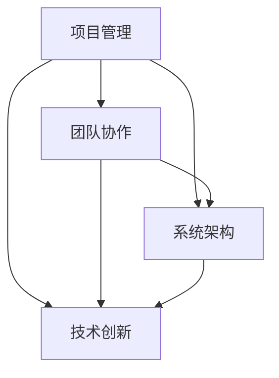

                 

### 文章标题

《技术管理者的成长之路：从编码到领导》

### 关键词

技术管理、敏捷开发、项目管理、系统架构、团队领导、数据驱动、领导力转型

### 摘要

本文将深入探讨技术管理者的成长路径，从编码新手到领导者的角色转变。通过剖析敏捷开发、项目管理、系统设计与架构优化、数据驱动决策、领导力与团队管理等关键领域，结合实际项目案例，阐述技术管理者所需的知识和技能。文章旨在为有志于成为技术管理者的从业者提供一套实用的成长指南，助力他们在技术和管理双领域取得成功。

### 引言

在当今快速发展的技术时代，技术管理者的角色日益重要。他们不仅需要拥有卓越的编程技能，还要具备出色的管理能力，能够在复杂的项目中引领团队、解决问题，并推动技术进步。然而，从一名优秀的程序员成长为一名合格的技术管理者并非易事，需要跨越多个阶段，掌握多种技能。

本文将详细探讨技术管理者的成长之路，包括以下关键领域：

1. **技术管理者的角色与职责**：了解技术管理者的核心职责和工作内容。
2. **敏捷开发与团队协作**：掌握敏捷开发方法，提升团队协作效率。
3. **项目管理基础**：学习项目管理的核心概念和方法。
4. **系统设计与架构优化**：理解系统设计原则，提升架构优化能力。
5. **数据驱动决策**：利用数据分析，支持业务决策。
6. **领导力与团队管理**：培养领导力，提升团队管理能力。
7. **从技术到业务视角的转型**：理解业务战略，实现技术与管理融合。
8. **项目实战案例分析**：通过实际项目，实践所学知识。
9. **技术管理者的成长路径**：规划职业发展，实现自我提升。

接下来，我们将逐一深入探讨这些领域，为技术管理者的成长提供实用的指导。

## 第1章：技术管理者的角色与职责

### 背景介绍

技术管理者在组织中扮演着至关重要的角色。他们不仅需要具备深厚的编程技能，还要拥有出色的管理能力，能够在复杂的项目中引领团队、解决问题，并推动技术进步。随着技术的快速发展，技术管理者的职责也在不断扩展和变化。

### 核心概念与联系

为了更好地理解技术管理者的角色，我们需要了解以下几个核心概念：

1. **项目管理**：项目管理是确保项目按时、按预算和按质量完成的一系列过程和活动。技术管理者需要掌握项目管理的核心原则和方法，以确保项目顺利进行。
2. **团队协作**：团队协作是技术管理者的重要任务之一。技术管理者需要建立高效的团队协作机制，促进团队成员之间的沟通和合作。
3. **系统架构**：系统架构是指系统的整体结构设计和组成部分之间的关系。技术管理者需要具备系统架构设计的能力，确保系统的稳定性和可扩展性。
4. **技术创新**：技术创新是技术管理者的重要使命。技术管理者需要不断探索新的技术解决方案，推动组织的数字化转型。

这些核心概念之间存在紧密的联系。项目管理是技术管理者确保项目成功的工具，团队协作是实现项目目标的关键，系统架构是保证系统稳定和高效的基础，而技术创新则是推动组织持续发展的动力。

### Mermaid 流程图

下面是一个 Mermaid 流程图，展示了技术管理者角色中的核心概念及其联系：



### 核心算法原理讲解

虽然技术管理者不一定需要编写复杂的代码，但他们需要理解基本的项目管理和系统架构原理。以下是一些核心算法原理的讲解：

1. **项目管理算法**：常用的项目管理算法包括关键路径法（Critical Path Method, CPM）和计划评审技术（Program Evaluation and Review Technique, PERT）。CPM 用于确定项目完成所需的最短时间，PERT 用于评估项目完成时间的概率分布。
    ```plaintext
    // CPM算法伪代码
    function CPM(tasks, dependencies) {
        // 初始化任务持续时间
        for each task in tasks {
            task.duration = calculateDuration()
        }
        
        // 计算关键路径
        calculateCriticalPath(tasks, dependencies)
        
        // 输出关键路径
        printCriticalPath()
    }
    ```
2. **系统架构算法**：系统架构设计中常用的算法包括负载均衡（Load Balancing）和缓存（Caching）。负载均衡算法用于将工作负载分配到多个服务器上，以避免单点故障和提高系统的响应速度。缓存算法用于存储常用数据，以减少数据库访问次数和提高系统性能。
    ```plaintext
    // 负载均衡算法伪代码
    function LoadBalancing(requests, servers) {
        while (requests are not empty) {
            for each server in servers {
                if (server is not overloaded) {
                    assign request to server
                    break
                }
            }
        }
    }
    ```

### 数学模型和公式讲解

在项目管理中，常见的数学模型包括甘特图（Gantt Chart）和帕累托图（Pareto Chart）。甘特图用于表示项目的进度和时间安排，帕累托图用于分析项目中影响最大的问题。

1. **甘特图**：甘特图的基本公式如下：
    $$ Gantt \ Chart = [Start \ Date, End \ Date, Tasks] $$
    其中，`StartDate` 和 `EndDate` 分别表示项目的开始日期和结束日期，`Tasks` 表示项目中的任务列表。

2. **帕累托图**：帕累托图的基本公式如下：
    $$ Pareto \ Chart = [Issues, Frequency, Importance] $$
    其中，`Issues` 表示项目中出现的问题，`Frequency` 表示问题发生的频率，`Importance` 表示问题的重要性。

### 举例说明

假设我们有一个项目，需要完成以下任务：

- 任务A：需求分析，持续时间为5天。
- 任务B：系统设计，持续时间为7天。
- 任务C：编码实现，持续时间为10天。
- 任务D：测试与调试，持续时间为8天。

我们可以使用甘特图和帕累托图来表示项目的进度和问题。

1. **甘特图**：
    ```mermaid
    gantt
    title 项目进度
    dateFormat  YYYY-MM-DD
    section 项目进度
    A :任务A, 2023-04-01, 5 days
    B :任务B, 2023-04-06, 7 days
    C :任务C, 2023-04-13, 10 days
    D :任务D, 2023-04-23, 8 days
    ```

2. **帕累托图**：
    ```mermaid
    classDef important fill:#FFAAAA,stroke:none
    classDef medium fill:#AAAAFF,stroke:none
    classDef low fill:#AAAAFF,stroke:none

    pie title="问题分析"
    "需求不清" : 20
    "设计缺陷" : 30
    "编码错误" : 25
    "测试不足" : 15
    "其他" : 10
    ```

通过甘特图和帕累托图，我们可以清晰地了解项目的进度和问题，从而采取相应的措施来优化项目。

### 项目实战

假设我们正在开发一个电子商务平台，需要完成以下任务：

- 任务1：需求分析，持续时间为5天。
- 任务2：系统设计，持续时间为7天。
- 任务3：前端开发，持续时间为10天。
- 任务4：后端开发，持续时间为10天。
- 任务5：测试与调试，持续时间为8天。

1. **开发环境搭建**：

    - 安装必要的开发工具和库。
    - 配置版本控制系统（如Git）。
    - 确定开发语言和框架。

2. **源代码详细实现**：

    - 编写前端代码，实现用户界面和交互功能。
    - 编写后端代码，实现业务逻辑和数据存储。
    - 使用数据库管理系统（如MySQL）存储数据。

3. **代码解读与分析**：

    - 检查代码质量，确保符合编程规范。
    - 分析代码性能，优化代码结构。

4. **实际案例分析和详细讲解剖析**：

    - 分析用户行为数据，优化用户体验。
    - 解决实际出现的问题，如系统瓶颈、性能问题等。

5. **项目小结**：

    - 总结项目的开发过程和经验教训。
    - 提出改进建议，为未来项目提供参考。

### 最佳实践 Tips

- **持续学习**：技术和管理领域都在快速发展，持续学习是技术管理者必备的能力。
- **沟通与协作**：建立有效的沟通机制，促进团队协作。
- **关注细节**：在项目管理中，细节决定成败。
- **灵活应变**：面对变化，技术管理者需要具备灵活应对的能力。

### 小结

技术管理者的角色与职责涵盖了项目管理、团队协作、系统架构和技术创新等多个方面。通过本文的介绍，读者可以了解到技术管理者所需的核心概念和技能，并掌握如何将这些知识应用于实际项目中。

### 注意事项

- **项目管理**：项目管理是技术管理者的核心职责之一。需要掌握项目管理的核心原则和方法，如甘特图和帕累托图等。
- **团队协作**：团队协作是项目成功的关键。需要建立有效的沟通机制，促进团队成员之间的合作。
- **系统架构**：系统架构是确保系统稳定性和可扩展性的基础。需要理解系统架构设计原则，如负载均衡和缓存等。
- **技术创新**：技术创新是推动组织持续发展的动力。需要关注技术发展趋势，不断探索新的解决方案。

### 拓展阅读

- 《敏捷开发实践指南》
- 《项目管理知识体系指南》
- 《软件架构设计：创建基于需求的软件架构》
- 《数据驱动决策》

### 文章小结

技术管理者的成长之路并非一蹴而就，需要从编码到领导，逐步掌握项目管理、团队协作、系统架构、数据驱动决策和领导力等核心技能。通过本文的介绍，读者可以了解到技术管理者所需的知识和技能，并为自己的成长之路制定明确的规划。希望本文能为有志于成为技术管理者的从业者提供有价值的参考。作者：AI天才研究院/AI Genius Institute & 禅与计算机程序设计艺术 /Zen And The Art of Computer Programming

